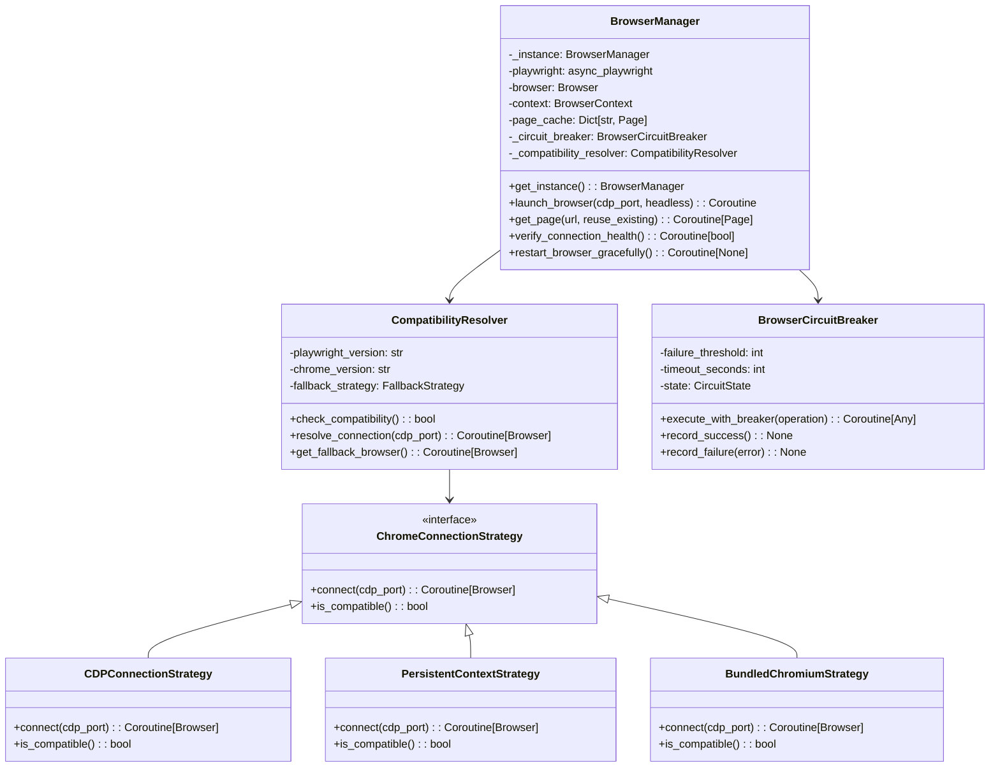
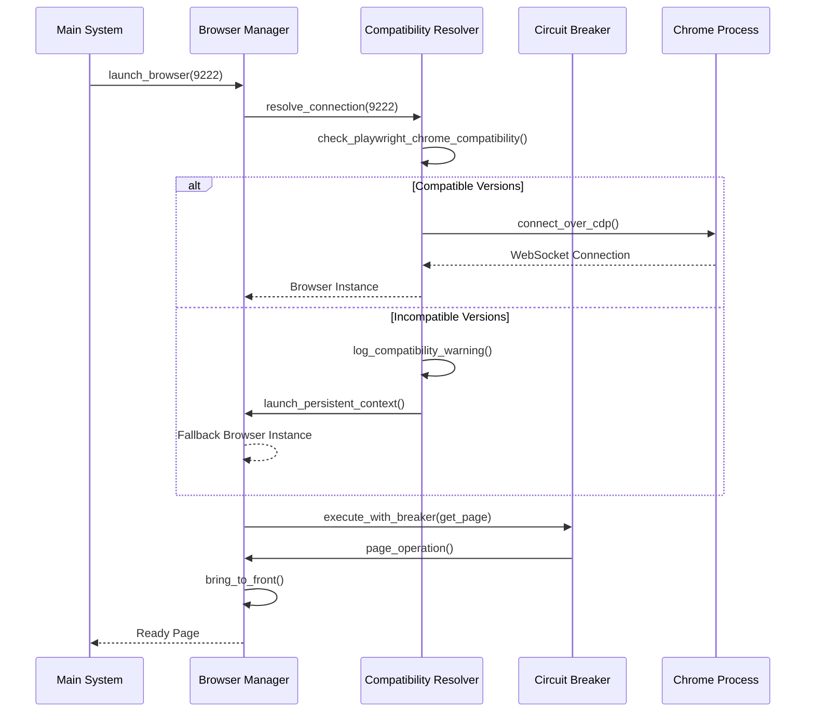
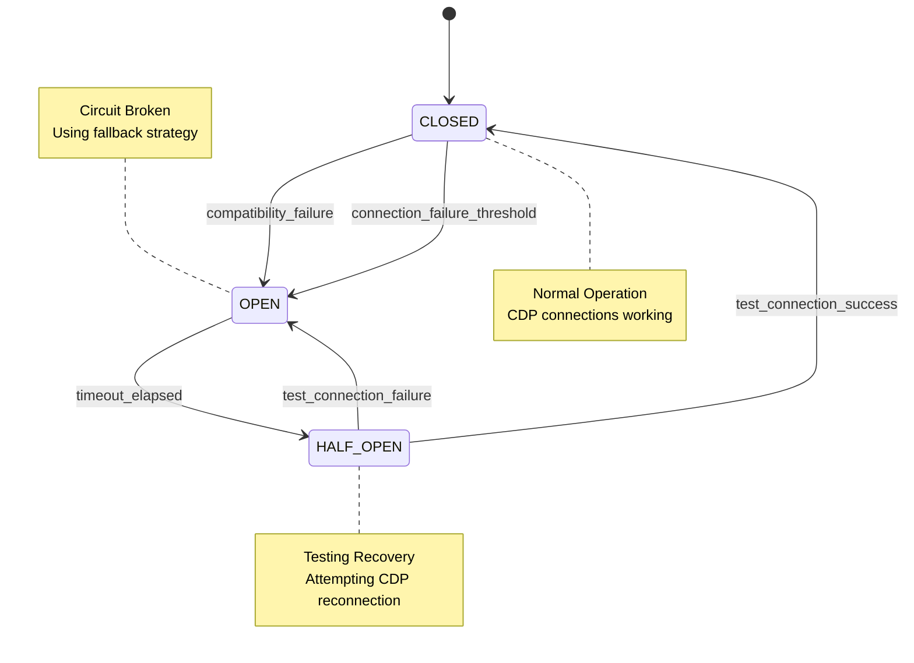
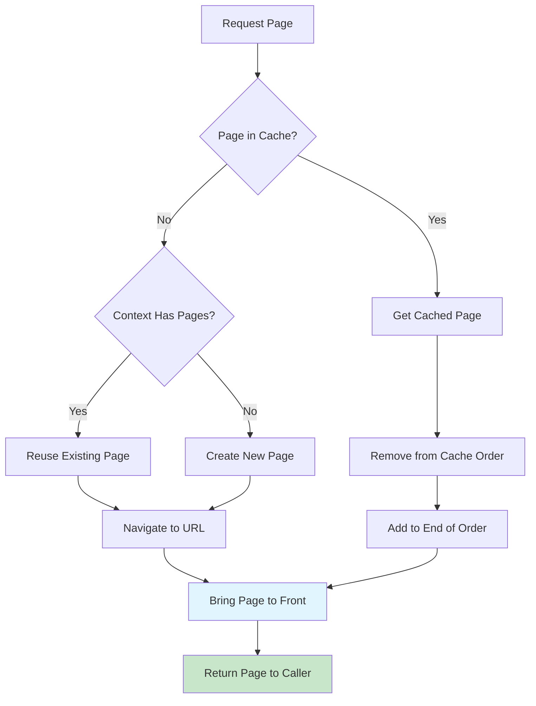
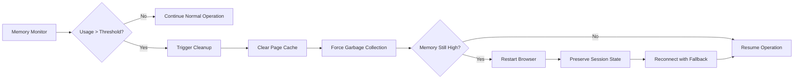

# Browser Manager Design for Amazon FBA Agent System v32

## Overview

The Browser Manager is a critical component of the Amazon FBA Agent System that provides centralized browser resource management with robust Chrome CDP (Chrome DevTools Protocol) connectivity. This design addresses the critical "socket hang up" compatibility issue between Playwright 1.54.0 and Chrome 139.x WebSocket protocol while maintaining system stability and user visibility requirements.

## Architecture

### Core Components



### System Architecture Integration



## Component Design

### 1. Compatibility Resolver

The CompatibilityResolver addresses the core "socket hang up" issue by implementing version-aware connection strategies.

#### Key Features

- **Version Detection**: Automatically detects Playwright and Chrome versions
- **Compatibility Matrix**: Maintains known working version combinations
- **Fallback Strategy**: Implements graceful degradation when versions are incompatible
- **Connection Testing**: Validates connections before returning to main system

#### Implementation Strategy

```python
class CompatibilityResolver:
    COMPATIBLE_COMBINATIONS = {
        "playwright_1.40.0": ["chrome_130.x", "chrome_131.x"],
        "playwright_1.47.0": ["chrome_139.x", "chrome_140.x"],
        "playwright_1.54.0": ["chrome_141.x", "chrome_142.x"]
    }
    
    async def resolve_connection(self, cdp_port: int) -> Browser:
        if await self.check_compatibility():
            return await self.connect_via_cdp(cdp_port)
        else:
            return await self.connect_via_fallback(cdp_port)
```

### 2. Connection Strategies

#### Primary Strategy: CDP Connection
- **Use Case**: When Playwright and Chrome versions are compatible
- **Method**: `connect_over_cdp()`
- **Benefits**: Full profile sync, existing session preservation

#### Fallback Strategy: Persistent Context
- **Use Case**: When CDP connection fails due to version incompatibility
- **Method**: `launch_persistent_context()`
- **Benefits**: Profile functionality without WebSocket issues

#### Emergency Fallback: Bundled Chromium
- **Use Case**: When all external Chrome connections fail
- **Method**: `launch()` with bundled Chromium
- **Benefits**: Guaranteed compatibility, isolated environment

### 3. Browser Circuit Breaker Enhancement

Enhanced circuit breaker with compatibility-aware failure detection.

#### Circuit States



#### Failure Classification

- **Compatibility Failures**: WebSocket protocol mismatches
- **Connection Failures**: Network or port issues
- **Browser Failures**: Chrome process crashes or hangs

### 4. Page Management with Visibility Requirements

Enhanced page management ensuring user visibility throughout automation workflow.

#### Key Requirements

- **Mandatory Visibility**: All browser activities must be visible to user
- **Page Bringing to Front**: Every returned page must call `bring_to_front()`
- **Single Page Mode**: Force single-page mode for stability (MAX_CACHED_PAGES = 1)

#### Page Lifecycle



## Critical Issue Resolution

### Chrome CDP "Socket Hang Up" Fix

The primary issue is WebSocket protocol incompatibility between Playwright 1.54.0 and Chrome 139.x.

#### Root Cause Analysis

1. **Playwright 1.54.0**: Uses updated WebSocket protocol
2. **Chrome 139.x**: Uses older WebSocket implementation
3. **Result**: `socket hang up` error during CDP handshake

#### Solution Implementation

```python
async def resolve_cdp_compatibility_issue(self, cdp_port: int):
    """
    Resolve Chrome CDP compatibility issue with surgical precision.
    """
    try:
        # Test CDP connection with timeout
        test_browser = await self.playwright.chromium.connect_over_cdp(
            f"http://localhost:{cdp_port}",
            timeout=5000  # Reduced timeout for fast failure
        )
        
        if test_browser and test_browser.is_connected():
            self.log.info("✅ CDP connection successful - versions compatible")
            return test_browser
            
    except Exception as cdp_error:
        if "socket hang up" in str(cdp_error):
            self.log.warning(f"⚠️ CDP socket hang up detected - version incompatibility")
            self.log.info("🔄 Falling back to launch_persistent_context")
            
            # Fallback to persistent context
            return await self.playwright.chromium.launch_persistent_context(
                user_data_dir="C:\\ChromeDebugProfile",
                headless=False,
                args=["--disable-blink-features=AutomationControlled"]
            )
        else:
            raise cdp_error
```

### Configuration Requirements

#### Chrome Launch Requirements

```bash
# Required Chrome launch command
chrome.exe --remote-debugging-port=9222 --user-data-dir="C:\ChromeDebugProfile"

# Alternative port if 9222 blocked
chrome.exe --remote-debugging-port=9223 --user-data-dir="C\ChromeDebugProfile"
```

#### Environment Constraints

- **Windows**: 23H2 or later
- **Python**: 3.8+
- **Playwright**: 1.40.0+ (recommended 1.47+)
- **Chrome**: Latest stable version
- **Memory**: 8GB+ RAM recommended

## Data Models

### Browser Connection State

```python
@dataclass
class BrowserConnectionState:
    is_connected: bool
    connection_method: str  # 'cdp', 'persistent_context', 'bundled'
    chrome_version: str
    playwright_version: str
    compatibility_status: str
    last_health_check: datetime
    failure_count: int
    memory_usage_mb: int
```

### Compatibility Matrix

```python
@dataclass
class CompatibilityEntry:
    playwright_version: str
    chrome_version_range: str
    status: str  # 'compatible', 'incompatible', 'unknown'
    fallback_required: bool
    notes: str
```

## Testing Strategy

### Compatibility Test Suite

```python
class BrowserCompatibilityTests:
    async def test_cdp_connection(self):
        """Test direct CDP connection"""
        
    async def test_fallback_strategies(self):
        """Test all fallback connection methods"""
        
    async def test_version_detection(self):
        """Test version detection accuracy"""
        
    async def test_circuit_breaker_behavior(self):
        """Test circuit breaker with different failure types"""
```

### Health Monitoring

- **Connection Health**: Regular CDP endpoint testing
- **Memory Monitoring**: Track Chrome process memory usage
- **Performance Metrics**: Page load times and response rates
- **Failure Analysis**: Categorize and log different failure types

## Performance Optimization

### Memory Management



### Connection Optimization

- **Connection Pooling**: Reuse existing connections when possible
- **Lazy Loading**: Initialize components only when needed
- **Resource Cleanup**: Proper cleanup of failed connections
- **Timeout Management**: Appropriate timeouts for different operations

## Monitoring and Diagnostics

### Health Metrics

- **Connection Success Rate**: Percentage of successful connections
- **Fallback Usage Rate**: How often fallbacks are triggered
- **Memory Usage Trends**: Chrome process memory over time
- **Page Response Times**: Navigation and interaction performance

### Diagnostic Tools

- **Connection Test Script**: `test_chrome_debug.py`
- **Compatibility Checker**: Version compatibility validation
- **Health Dashboard**: Real-time browser health monitoring
- **Error Classification**: Categorized error logging and analysis