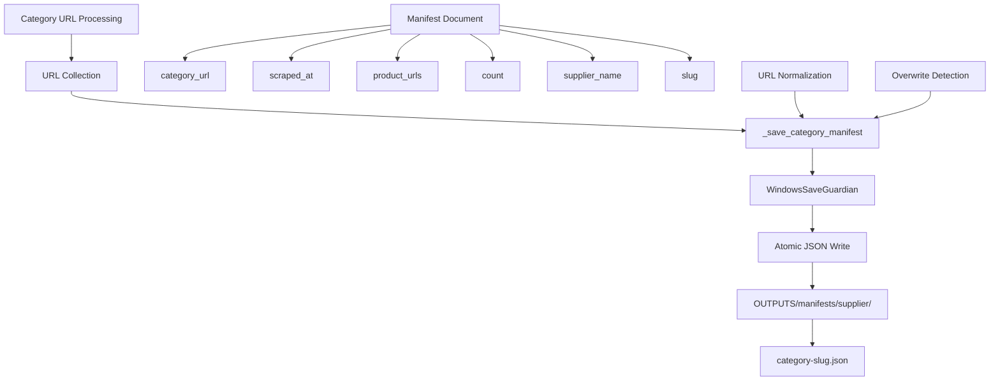

# Category Manifest Implementation & Validation

## Overview

The Amazon FBA Agent System v3.7+ requires atomic category manifest generation as the "authoritative bridge" between product discovery and filtering operations. The system currently has a `_save_category_manifest()` method that creates atomic JSON manifests for each category, but there are gaps in validation, consistency checking, and integration with the filtering pipeline that need to be addressed.

## Current Category Manifest Architecture

### Existing Implementation



### Current Manifest Structure

**Location**: `OUTPUTS/manifests/{supplier_name}/{category-slug}.json`

```json
{
  "category_url": "https://supplier.com/category/home-kitchen",
  "scraped_at": "2025-01-15T14:30:22Z",
  "product_urls": [
    "https://supplier.com/product/item-1",
    "https://supplier.com/product/item-2"
  ],
  "count": 2,
  "supplier_name": "supplier.com",
  "slug": "home-kitchen"
}
```

## Critical Issues Identified

### Issue 1: Inconsistent Manifest Generation

**Problem**: Manifests are only generated during supplier extraction phase, not during resume operations.

**Current State**: 
- Manifests created in `_extract_supplier_products()` at line 4193
- No manifest validation during resume
- Missing manifests cause filtering pipeline failures

**Impact**:
- Resume operations lack authoritative URL lists
- Filtering pipeline cannot validate completeness
- Inconsistent behavior between fresh runs and resumes

### Issue 2: Missing Manifest Validation

**Problem**: No validation of manifest integrity or completeness.

**Missing Features**:
- URL count validation against actual scraping results
- Duplicate URL detection within manifests
- Manifest consistency across multiple runs
- Corruption detection and recovery

### Issue 3: Limited Integration with Filtering Pipeline

**Problem**: Filtering pipeline doesn't use manifests as authoritative source.

**Current State**:
- Manifests stored but not referenced during filtering
- No validation that filtered URLs match manifest
- Missing audit trail for filtering decisions

### Issue 4: Incomplete Manifest Metadata

**Problem**: Manifests lack essential metadata for debugging and validation.

**Missing Data**:
- Scraping performance metrics (pages, time)
- URL normalization details
- Filtering statistics
- Category processing context

## Quest Objectives

### Primary Goals

1. **Manifest Validation System**
   - Implement comprehensive manifest integrity checking
   - Add URL count validation and duplicate detection
   - Create manifest consistency verification across runs
   - Implement corruption detection and recovery

2. **Enhanced Manifest Generation**
   - Ensure manifests are generated in all processing scenarios
   - Add comprehensive metadata for debugging
   - Implement manifest versioning and change tracking
   - Create manifest backup and recovery mechanisms

3. **Filtering Pipeline Integration**
   - Use manifests as authoritative source for filtering
   - Implement manifest-based filtering validation
   - Create audit trails linking manifests to filtering decisions
   - Add manifest-driven resume capabilities

4. **Manifest Analytics and Reporting**
   - Implement manifest comparison and diff analysis
   - Create category processing performance metrics
   - Add manifest health monitoring and alerts
   - Generate manifest-based processing reports

### Secondary Goals

1. **Advanced Manifest Features**
   - Implement incremental manifest updates
   - Add manifest compression for large categories
   - Create manifest synchronization across runs
   - Implement manifest-based caching strategies

2. **Debugging and Diagnostics**
   - Add detailed manifest logging and tracing
   - Create manifest visualization tools
   - Implement manifest-based debugging workflows
   - Add manifest performance profiling

## Technical Implementation Plan

### Phase 1: Manifest Validation System

#### Comprehensive Manifest Validator

```python
class CategoryManifestValidator:
    def __init__(self, logger):
        self.logger = logger
        self.validation_errors = []
        self.validation_warnings = []
    
    def validate_manifest_structure(self, manifest_path: Path) -> Dict[str, Any]:
        """Validate manifest file structure and required fields"""
        
        if not manifest_path.exists():
            return {
                "valid": False,
                "errors": [f"Manifest file does not exist: {manifest_path}"],
                "warnings": []
            }
        
        try:
            with open(manifest_path, 'r', encoding='utf-8') as f:
                manifest_data = json.load(f)
        except json.JSONDecodeError as e:
            return {
                "valid": False,
                "errors": [f"Invalid JSON in manifest: {e}"],
                "warnings": []
            }
        except Exception as e:
            return {
                "valid": False,
                "errors": [f"Failed to read manifest: {e}"],
                "warnings": []
            }
        
        # Validate required fields
        required_fields = ["category_url", "scraped_at", "product_urls", "count", "supplier_name", "slug"]
        errors = []
        warnings = []
        
        for field in required_fields:
            if field not in manifest_data:
                errors.append(f"Missing required field: {field}")
        
        # Validate field types and values
        if "product_urls" in manifest_data:
            if not isinstance(manifest_data["product_urls"], list):
                errors.append("product_urls must be a list")
            else:
                # Check for empty URLs
                empty_urls = [i for i, url in enumerate(manifest_data["product_urls"]) if not url or not url.strip()]
                if empty_urls:
                    warnings.append(f"Empty URLs found at indices: {empty_urls}")
        
        if "count" in manifest_data:
            if not isinstance(manifest_data["count"], int):
                errors.append("count must be an integer")
            elif "product_urls" in manifest_data:
                actual_count = len(manifest_data["product_urls"])
                if manifest_data["count"] != actual_count:
                    errors.append(f"Count mismatch: declared {manifest_data['count']}, actual {actual_count}")
        
        # Validate URL format
        if "category_url" in manifest_data:
            if not self._is_valid_url(manifest_data["category_url"]):
                errors.append(f"Invalid category URL format: {manifest_data['category_url']}")
        
        return {
            "valid": len(errors) == 0,
            "errors": errors,
            "warnings": warnings,
            "manifest_data": manifest_data if len(errors) == 0 else None
        }
    
    def validate_url_integrity(self, manifest_data: Dict) -> Dict[str, Any]:
        """Validate URL integrity within manifest"""
        
        product_urls = manifest_data.get("product_urls", [])
        
        # Check for duplicates
        url_counts = {}
        for url in product_urls:
            normalized_url = self._normalize_url(url)
            url_counts[normalized_url] = url_counts.get(normalized_url, 0) + 1
        
        duplicates = {url: count for url, count in url_counts.items() if count > 1}
        
        # Check for invalid URLs
        invalid_urls = []
        for i, url in enumerate(product_urls):
            if not self._is_valid_url(url):
                invalid_urls.append({"index": i, "url": url})
        
        # Check URL consistency (same domain as category)
        category_url = manifest_data.get("category_url", "")
        category_domain = self._extract_domain(category_url)
        
        foreign_urls = []
        for i, url in enumerate(product_urls):
            url_domain = self._extract_domain(url)
            if url_domain and category_domain and url_domain != category_domain:
                foreign_urls.append({"index": i, "url": url, "domain": url_domain})
        
        return {
            "total_urls": len(product_urls),
            "unique_urls": len(url_counts),
            "duplicates": duplicates,
            "duplicate_count": len(duplicates),
            "invalid_urls": invalid_urls,
            "foreign_urls": foreign_urls,
            "integrity_score": self._calculate_integrity_score(len(product_urls), len(duplicates), len(invalid_urls))
        }
    
    def validate_manifest_consistency(self, current_manifest: Dict, 
                                    previous_manifest: Dict = None) -> Dict[str, Any]:
        """Validate consistency between current and previous manifests"""
        
        if not previous_manifest:
            return {
                "status": "no_previous_manifest",
                "consistency_score": 1.0
            }
        
        current_urls = set(current_manifest.get("product_urls", []))
        previous_urls = set(previous_manifest.get("product_urls", []))
        
        # Calculate URL changes
        added_urls = current_urls - previous_urls
        removed_urls = previous_urls - current_urls
        common_urls = current_urls & previous_urls
        
        # Calculate consistency metrics
        total_unique_urls = len(current_urls | previous_urls)
        consistency_score = len(common_urls) / total_unique_urls if total_unique_urls > 0 else 1.0
        
        # Determine change significance
        change_rate = (len(added_urls) + len(removed_urls)) / max(len(previous_urls), 1)
        
        if change_rate > 0.5:
            change_significance = "major"
        elif change_rate > 0.1:
            change_significance = "moderate"
        else:
            change_significance = "minor"
        
        return {
            "status": "comparison_completed",
            "consistency_score": consistency_score,
            "change_significance": change_significance,
            "change_rate": change_rate,
            "added_urls": len(added_urls),
            "removed_urls": len(removed_urls),
            "common_urls": len(common_urls),
            "total_current": len(current_urls),
            "total_previous": len(previous_urls),
            "added_urls_sample": list(added_urls)[:5],  # First 5 for logging
            "removed_urls_sample": list(removed_urls)[:5]  # First 5 for logging
        }
    
    def _normalize_url(self, url: str) -> str:
        """Normalize URL for comparison"""
        from utils.normalization import normalize_url
        return normalize_url(url)
    
    def _is_valid_url(self, url: str) -> bool:
        """Check if URL is valid"""
        try:
            from urllib.parse import urlparse
            result = urlparse(url)
            return all([result.scheme, result.netloc])
        except:
            return False
    
    def _extract_domain(self, url: str) -> str:
        """Extract domain from URL"""
        try:
            from urllib.parse import urlparse
            return urlparse(url).netloc.lower()
        except:
            return ""
    
    def _calculate_integrity_score(self, total_urls: int, duplicates: int, invalid_urls: int) -> float:
        """Calculate URL integrity score (0-1)"""
        if total_urls == 0:
            return 1.0
        
        issues = duplicates + invalid_urls
        return max(0.0, 1.0 - (issues / total_urls))
```

#### Enhanced Manifest Generator

```python
class EnhancedCategoryManifestGenerator:
    def __init__(self, logger, config_loader):
        self.logger = logger
        self.config_loader = config_loader
        self.validator = CategoryManifestValidator(logger)
        
    def generate_enhanced_manifest(self, supplier_name: str, category_url: str, 
                                 urls: List[str], scraping_metadata: Dict = None) -> str:
        """Generate enhanced manifest with comprehensive metadata"""
        
        from utils.normalization import normalize_url
        from utils.windows_save_guardian import WindowsSaveGuardian
        import re
        
        # Generate category slug for consistent naming
        slug = self._generate_category_slug(category_url)
        manifest_dir = Path("OUTPUTS") / "manifests" / supplier_name
        manifest_dir.mkdir(parents=True, exist_ok=True)
        manifest_path = manifest_dir / f"{slug}.json"
        
        # Normalize URLs for consistency
        normalized_urls = [normalize_url(u) for u in urls if u and u.strip()]
        
        # Load previous manifest for comparison
        previous_manifest = None
        if manifest_path.exists():
            try:
                validation_result = self.validator.validate_manifest_structure(manifest_path)
                if validation_result["valid"]:
                    previous_manifest = validation_result["manifest_data"]
            except Exception as e:
                self.logger.warning(f"Could not load previous manifest for comparison: {e}")
        
        # Validate URL integrity
        temp_manifest = {"product_urls": normalized_urls, "category_url": category_url}
        url_integrity = self.validator.validate_url_integrity(temp_manifest)
        
        # Validate consistency with previous manifest
        consistency_result = self.validator.validate_manifest_consistency(
            temp_manifest, previous_manifest
        )
        
        # Create enhanced manifest document
        doc = {
            "category_url": category_url,
            "scraped_at": datetime.utcnow().isoformat() + "Z",
            "product_urls": normalized_urls,
            "count": len(normalized_urls),
            "supplier_name": supplier_name,
            "slug": slug,
            
            # Enhanced metadata
            "scraping_metadata": scraping_metadata or {},
            "url_integrity": {
                "total_urls": url_integrity["total_urls"],
                "unique_urls": url_integrity["unique_urls"],
                "duplicate_count": url_integrity["duplicate_count"],
                "invalid_url_count": len(url_integrity["invalid_urls"]),
                "foreign_url_count": len(url_integrity["foreign_urls"]),
                "integrity_score": url_integrity["integrity_score"]
            },
            "consistency_metrics": {
                "consistency_score": consistency_result["consistency_score"],
                "change_significance": consistency_result.get("change_significance", "new"),
                "change_rate": consistency_result.get("change_rate", 0),
                "added_urls": consistency_result.get("added_urls", 0),
                "removed_urls": consistency_result.get("removed_urls", 0)
            },
            
            # Version and tracking
            "manifest_version": "2.0",
            "generation_timestamp": time.time(),
            "system_version": self.config_loader.get_system_config().get("version", "unknown")
        }
        
        # Use WindowsSaveGuardian for atomic write
        guardian = WindowsSaveGuardian()
        success = guardian.save_json_atomic(manifest_path, doc)
        
        if success:
            # Log enhanced manifest information
            self.logger.info(f"📝 ENHANCED MANIFEST: {len(normalized_urls)} URLs → {manifest_path}")
            self.logger.info(f"📊 Integrity: {url_integrity['integrity_score']:.2f} | "
                           f"Consistency: {consistency_result['consistency_score']:.2f} | "
                           f"Change: {consistency_result.get('change_significance', 'new')}")
            
            # Log quality warnings
            if url_integrity["duplicate_count"] > 0:
                self.logger.warning(f"⚠️ {url_integrity['duplicate_count']} duplicate URLs in manifest")
            
            if len(url_integrity["invalid_urls"]) > 0:
                self.logger.warning(f"⚠️ {len(url_integrity['invalid_urls'])} invalid URLs in manifest")
            
            if consistency_result.get("change_significance") == "major":
                self.logger.warning(f"⚠️ Major changes detected: "
                                  f"+{consistency_result.get('added_urls', 0)} "
                                  f"-{consistency_result.get('removed_urls', 0)} URLs")
            
            return str(manifest_path)
        else:
            self.logger.error(f"❌ Failed to save enhanced manifest for {category_url}")
            raise RuntimeError(f"Failed to save category manifest: {manifest_path}")
    
    def _generate_category_slug(self, category_url: str) -> str:
        """Generate readable slug from category URL"""
        import re
        from urllib.parse import urlparse
        
        try:
            parsed = urlparse(category_url)
            path = parsed.path.strip('/')
            
            # Extract meaningful parts from path
            path_parts = [part for part in path.split('/') if part and not part.isdigit()]
            
            if path_parts:
                slug_base = '-'.join(path_parts[-2:])  # Last 2 meaningful parts
            else:
                slug_base = parsed.netloc.replace('.', '-')
            
            # Clean and limit slug
            slug = re.sub(r'[^a-z0-9-]', '-', slug_base.lower())
            slug = re.sub(r'-+', '-', slug).strip('-')
            
            return slug[:50]  # Limit length for filesystem
            
        except Exception:
            # Fallback to simple slug generation
            return re.sub(r"[^a-z0-9]+", "-", category_url.lower()).strip("-")[:50]
```

### Phase 2: Filtering Pipeline Integration

#### Manifest-Based Filtering Validator

```python
class ManifestBasedFilteringValidator:
    def __init__(self, logger):
        self.logger = logger
        
    def validate_filtering_against_manifest(self, manifest_path: Path, 
                                          filtered_urls: Dict[str, List[str]]) -> Dict[str, Any]:
        """Validate filtering results against authoritative manifest"""
        
        # Load manifest
        try:
            with open(manifest_path, 'r', encoding='utf-8') as f:
                manifest_data = json.load(f)
        except Exception as e:
            return {
                "valid": False,
                "error": f"Could not load manifest: {e}"
            }
        
        manifest_urls = set(manifest_data.get("product_urls", []))
        
        # Collect all filtered URLs
        all_filtered_urls = set()
        for category, urls in filtered_urls.items():
            all_filtered_urls.update(urls)
        
        # Validate completeness
        missing_from_filter = manifest_urls - all_filtered_urls
        extra_in_filter = all_filtered_urls - manifest_urls
        
        # Calculate validation metrics
        total_manifest = len(manifest_urls)
        total_filtered = len(all_filtered_urls)
        common_urls = len(manifest_urls & all_filtered_urls)
        
        completeness_score = common_urls / total_manifest if total_manifest > 0 else 1.0
        accuracy_score = common_urls / total_filtered if total_filtered > 0 else 1.0
        
        return {
            "valid": len(missing_from_filter) == 0 and len(extra_in_filter) == 0,
            "completeness_score": completeness_score,
            "accuracy_score": accuracy_score,
            "total_manifest_urls": total_manifest,
            "total_filtered_urls": total_filtered,
            "common_urls": common_urls,
            "missing_from_filter": len(missing_from_filter),
            "extra_in_filter": len(extra_in_filter),
            "missing_urls_sample": list(missing_from_filter)[:5],
            "extra_urls_sample": list(extra_in_filter)[:5]
        }
    
    def create_filtering_audit_trail(self, manifest_path: Path, 
                                   filtering_decisions: Dict[str, Any]) -> str:
        """Create audit trail linking manifest to filtering decisions"""
        
        audit_dir = manifest_path.parent / "audit_trails"
        audit_dir.mkdir(exist_ok=True)
        
        audit_filename = f"{manifest_path.stem}_filtering_audit_{int(time.time())}.json"
        audit_path = audit_dir / audit_filename
        
        audit_data = {
            "manifest_path": str(manifest_path),
            "audit_timestamp": datetime.utcnow().isoformat() + "Z",
            "filtering_decisions": filtering_decisions,
            "validation_results": self.validate_filtering_against_manifest(
                manifest_path, 
                filtering_decisions.get("filtered_urls", {})
            )
        }
        
        try:
            with open(audit_path, 'w', encoding='utf-8') as f:
                json.dump(audit_data, f, indent=2, ensure_ascii=False)
            
            self.logger.info(f"📋 Filtering audit trail created: {audit_path}")
            return str(audit_path)
            
        except Exception as e:
            self.logger.error(f"❌ Failed to create filtering audit trail: {e}")
            return ""
```

### Phase 3: Integration with Main Workflow

#### Updated Manifest Integration

```python
def _save_enhanced_category_manifest(self, supplier_name: str, category_url: str, 
                                   urls: List[str], scraping_metadata: Dict = None) -> str:
    """Save enhanced category manifest with validation and metadata"""
    
    # Initialize enhanced manifest generator if not exists
    if not hasattr(self, 'enhanced_manifest_generator'):
        self.enhanced_manifest_generator = EnhancedCategoryManifestGenerator(
            self.log, self.config_loader
        )
    
    # Prepare scraping metadata
    if not scraping_metadata:
        scraping_metadata = {}
    
    # Add current processing context
    scraping_metadata.update({
        "category_index": getattr(self, '_current_category_index', 0),
        "processing_timestamp": datetime.utcnow().isoformat() + "Z",
        "system_phase": "supplier_extraction",
        "total_categories": getattr(self, '_total_categories', 0)
    })
    
    # Generate enhanced manifest
    try:
        manifest_path = self.enhanced_manifest_generator.generate_enhanced_manifest(
            supplier_name, category_url, urls, scraping_metadata
        )
        
        # Store manifest path for later validation
        if not hasattr(self, 'generated_manifests'):
            self.generated_manifests = {}
        self.generated_manifests[category_url] = manifest_path
        
        return manifest_path
        
    except Exception as e:
        self.log.error(f"❌ Enhanced manifest generation failed for {category_url}: {e}")
        # Fallback to original manifest generation
        return self._save_category_manifest(supplier_name, category_url, urls)

def _validate_manifests_before_filtering(self, supplier_name: str) -> bool:
    """Validate all generated manifests before filtering phase"""
    
    if not hasattr(self, 'generated_manifests'):
        self.log.warning("⚠️ No manifests generated - validation skipped")
        return True
    
    validator = CategoryManifestValidator(self.log)
    validation_results = {}
    
    for category_url, manifest_path in self.generated_manifests.items():
        result = validator.validate_manifest_structure(Path(manifest_path))
        validation_results[category_url] = result
        
        if not result["valid"]:
            self.log.error(f"❌ Invalid manifest for {category_url}: {result['errors']}")
        elif result["warnings"]:
            self.log.warning(f"⚠️ Manifest warnings for {category_url}: {result['warnings']}")
    
    # Calculate overall validation score
    valid_manifests = sum(1 for r in validation_results.values() if r["valid"])
    total_manifests = len(validation_results)
    validation_score = valid_manifests / total_manifests if total_manifests > 0 else 1.0
    
    self.log.info(f"📊 Manifest validation: {valid_manifests}/{total_manifests} valid "
                  f"(score: {validation_score:.2f})")
    
    # Return True if at least 90% of manifests are valid
    return validation_score >= 0.9
```

## Testing Strategy

### Unit Tests

```python
def test_manifest_validation():
    """Test manifest validation functionality"""
    # Test structure validation
    # Test URL integrity checking
    # Test consistency validation

def test_enhanced_manifest_generation():
    """Test enhanced manifest generation"""
    # Test metadata inclusion
    # Test error handling
    # Test atomic writes

def test_filtering_integration():
    """Test filtering pipeline integration"""
    # Test manifest-based validation
    # Test audit trail creation
    # Test completeness checking
```

### Integration Tests

```python
def test_manifest_workflow_integration():
    """Test manifest integration with main workflow"""
    # Test manifest generation during processing
    # Test validation before filtering
    # Test resume with manifests

def test_manifest_consistency_across_runs():
    """Test manifest consistency across multiple runs"""
    # Test manifest comparison
    # Test change detection
    # Test consistency scoring
```

## Success Criteria

### Primary Objectives

- [ ] All categories generate validated manifests with comprehensive metadata
- [ ] Manifest validation prevents processing with corrupted data
- [ ] Filtering pipeline uses manifests as authoritative source
- [ ] Resume operations validate against existing manifests
- [ ] Manifest consistency tracking across multiple runs

### Quality Metrics

- [ ] 100% manifest generation success rate
- [ ] <1% manifest validation failure rate
- [ ] Complete audit trail for all filtering decisions
- [ ] Manifest integrity score >0.95 for all categories
- [ ] Zero data loss due to manifest corruption

### System Integration

- [ ] Seamless integration with existing workflow
- [ ] Minimal performance impact (<5% overhead)
- [ ] Enhanced debugging capabilities through manifests
- [ ] Comprehensive logging and monitoring
- [ ] Backward compatibility with existing manifest format

This quest provides a comprehensive framework for implementing robust category manifest generation, validation, and integration with the filtering pipeline in the Amazon FBA Agent System.