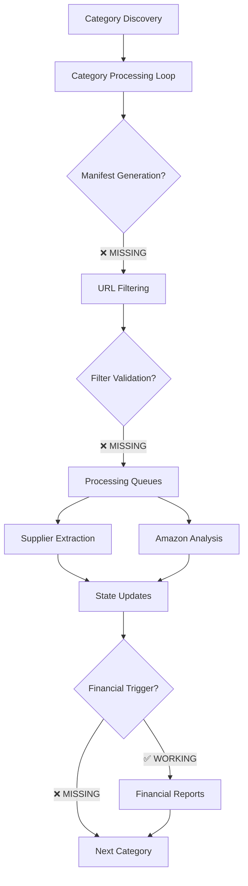
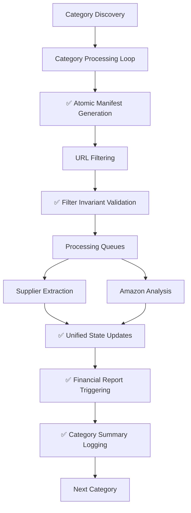
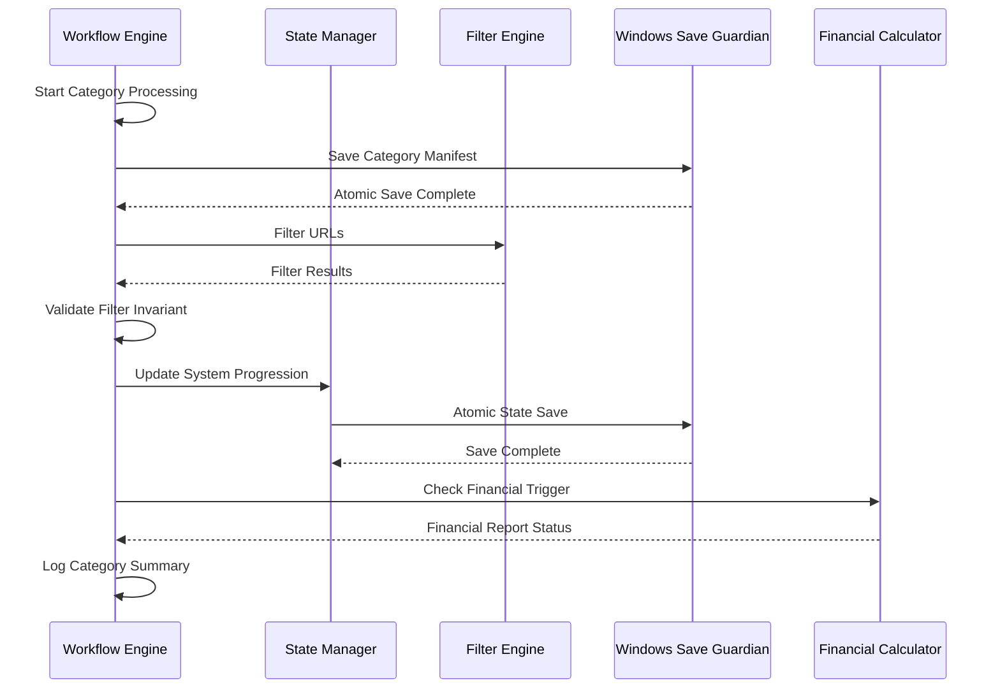
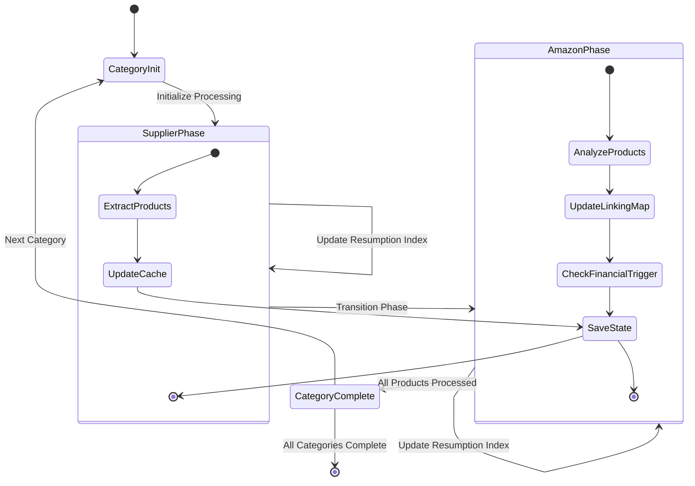

# Amazon FBA Agent System Remediation Design Specification

## Overview

This document provides a comprehensive design specification for addressing critical implementation gaps and inconsistencies in the Amazon FBA Agent System v3.7+. The analysis has identified 6 critical missing implementations and 8 implementation inconsistencies that prevent the system from operating according to the COMPLETE_WORKFLOW.md specification.

## Technology Stack & Dependencies

### Core Technologies
- **Python 3.8+** - Primary development platform
- **Playwright** - Browser automation for Amazon data extraction
- **JSON** - Data serialization and state persistence
- **Pandas/NumPy** - Data processing and analysis

### Critical Dependencies
- `tools/passive_extraction_workflow_latest.py` - Main workflow orchestrator
- `utils/fixed_enhanced_state_manager.py` - State management system
- `utils/windows_save_guardian.py` - Atomic file operations
- `utils/url_filter.py` - Product filtering logic
- `config/system_config.json` - System configuration

### Architecture Context
**🚨 CRITICAL**: The system contains **TWO DISTINCT WORKFLOWS** in `passive_extraction_workflow_latest.py`:

1. **🔄 Hybrid Processing Mode** (Primary - Target of This Remediation)
   - **Method**: `_run_hybrid_processing_mode()`
   - **Enabled**: `config["hybrid_processing"]["enabled"] = true`
   - **Pattern**: Category-by-category completion (supplier → Amazon analysis → next category)
   - **This remediation applies ONLY to this workflow**

2. **📋 Regular/Legacy Workflow Mode** (Secondary - Out of Scope)
   - **Method**: Standard workflow methods
   - **Pattern**: Extract ALL products first, then analyze ALL products
   - **Status**: Not covered by this remediation

**Configuration Requirement**: This remediation requires `hybrid_processing.enabled = true` in system configuration.

The system operates in **Hybrid Processing Mode** which completes supplier extraction AND Amazon analysis for one category before proceeding to the next. This specification addresses gaps specifically in this mode.

## System Architecture

### Current State Analysis

#### ✅ Already Completed Fixes
Some implementation gaps have been addressed during analysis:
- **Verbose Logging Cleanup**: ✅ **COMPLETED**
  - Removed: `📊 Supplier data cached: ... - will use for Amazon analysis`
  - Removed: `--- Amazon analysis X/Y: ... ---`
- **Filter Order Validation**: ✅ **VERIFIED CORRECT**
  - Confirmed LM → Cache → Extract sequence in `utils/url_filter.py`

#### ❌ Remaining Critical Implementation Gaps


### Target Architecture with Fixes


## Implementation Status & Compliance Matrix

### ✅ Verified Completed Implementations
These fixes have been validated as correctly implemented during analysis:

| Component | Status | Implementation Location | Notes |
|-----------|--------|------------------------|-------|
| **Verbose Logging Cleanup** | ✅ **COMPLETED** | Multiple locations | Removed supplier cache and Amazon analysis spam logs |
| **Filter Order Logic** | ✅ **VERIFIED CORRECT** | `utils/url_filter.py` | LM → Cache → Extract sequence properly implemented |
| **Hash Optimization** | ✅ **WORKING** | Hash optimization components | O(1) lookups with proper rebuild triggers |
| **Atomic File Operations** | ✅ **WORKING** | Windows Save Guardian | Critical saves use atomic operations |
| **Basic Filter Logic** | ✅ **WORKING** | Filter components | Core filtering correctly separates categories |

### 🚨 Critical Implementation Gaps Requiring Remediation

| Component | Current Status | Compliance | Root Cause | Priority |
|-----------|---------------|------------|------------|----------|
| **Category Manifests** | ❌ **MISSING** | 🔴 0% | Method exists but not called in workflow | P0 |
| **Filter Invariant Validation** | ❌ **MISSING** | 🔴 0% | No validation of filter accounting | P0 |
| **Financial Report Triggers** | ❌ **MISSING** | 🔴 0% | Logic exists but threshold monitoring not implemented | P1 |
| **Category Summary Logs** | ❌ **MISSING** | 🔴 0% | No comprehensive category completion metrics | P1 |
| **Resumption Logic** | 🚨 **MIXED** | 🔴 60% | Inconsistent use of `system_progression` vs `supplier_extraction_progress` | P0 |
| **Deterministic Phases** | ⚠️ **PARTIAL** | 🟡 70% | Still uses detection-based logic in some areas | P2 |

### 🎯 Compliance Against COMPLETE_WORKFLOW.md Specification

| Specification Requirement | Implementation Status | Compliance Score |
|----------------------------|----------------------|------------------|
| `system_progression` as single source of truth | Mixed - some areas use old structures | 🔴 60% |
| Atomic manifest generation before filtering | Not implemented | 🔴 0% |
| Filter invariant validation and logging | Not implemented | 🔴 0% |
| Financial report threshold triggering | Not implemented | 🔴 0% |
| Category summary diagnostic logging | Not implemented | 🔴 0% |
| Deterministic phase transitions | Partially implemented | 🟡 70% |
| Resume validation guards | Not implemented | 🔴 0% |
| Hash index rebuild timing logs | Implemented | ✅ 100% |

### 1. Category Manifest Generation

#### Problem Statement
The `_save_category_manifest()` method exists but is not consistently called before filtering operations, breaking the "authoritative bridge" requirement.

#### Current Implementation Status
- **Location**: `tools/passive_extraction_workflow_latest.py:2298-2355`
- **Status**: ❌ Method exists but not called in main processing loop
- **Impact**: Missing ground-truth URL records for categories

#### Technical Requirements
```python
# Required call location: Line ~4442 in chunked processing loop
# BEFORE: filtered = filter_urls(urls, self.linking_map, cached_products)
# AFTER: Atomic manifest generation with WindowsSaveGuardian

def _save_category_manifest(self, supplier_name: str, category_url: str, urls: List[str]):
    """Save category manifest atomically before filtering"""
    from utils.windows_save_guardian import WindowsSaveGuardian
    
    slug = re.sub(r"[^a-z0-9]+", "-", category_url.lower()).strip("-")[:30]
    manifest_path = Path("OUTPUTS") / "manifests" / supplier_name / f"{slug}.json"
    
    manifest_data = {
        "category_url": category_url,
        "discovered_at": datetime.now().isoformat(),
        "product_urls": urls,
        "total_products": len(urls)
    }
    
    guardian = WindowsSaveGuardian()
    success = guardian.save_json_atomic(manifest_path, manifest_data)
    
    if success:
        self.log.info(f"📝 MANIFEST: {len(urls)} URLs → {manifest_path}")
    else:
        raise RuntimeError(f"Failed to save category manifest: {manifest_path}")
```

#### Implementation Plan
1. Add manifest generation call before filtering in `_run_hybrid_processing_mode()`
2. Ensure atomic saves using WindowsSaveGuardian
3. Add proper error handling and logging

### 2. Filter Invariant Validation

#### Problem Statement
No validation that filter logic correctly accounts for all input URLs (input_count = skip_count + amazon_count + full_count).

#### Current Implementation Status
- **Location**: `tools/passive_extraction_workflow_latest.py:4454-4470`
- **Status**: ❌ Basic logging exists but no invariant validation
- **Impact**: Filter logic bugs go undetected

#### Technical Requirements
```python
# After filter_urls() call in chunked processing
def _validate_filter_invariant(self, input_urls: List[str], filtered: Dict[str, List[str]]):
    """Validate filter invariant and log results"""
    skip_count = len(filtered['skip_entirely'])
    amazon_count = len(filtered['needs_amazon_only'])
    full_count = len(filtered['needs_full_extraction'])
    total_input = len(input_urls)
    total_output = skip_count + amazon_count + full_count
    
    # Invariant validation
    if total_input != total_output:
        self.log.error(f"❌ FILTER INVARIANT VIOLATION: in={total_input} != out={total_output}")
        self.log.error(f"   skip={skip_count} + amazon={amazon_count} + full={full_count} = {total_output}")
        raise RuntimeError("Filter invariant violation - data integrity compromised")
    else:
        self.log.info(f"🧮 Filter Invariant: in={total_input} == skip={skip_count} + amz_only={amazon_count} + full={full_count}")
```

#### Implementation Plan
1. Add invariant validation after each filter_urls() call
2. Include error handling for invariant violations
3. Provide detailed diagnostic logging

### 3. Financial Report Triggering

#### Problem Statement
Financial report generation exists but lacks automated triggering based on linking map entry thresholds.

#### Current Implementation Status
- **Location**: `tools/passive_extraction_workflow_latest.py:4580-4590`
- **Status**: ❌ Logic commented out or misconfigured
- **Impact**: No automated financial analysis

#### Technical Requirements
```python
def _check_financial_report_trigger(self, supplier_name: str):
    """Monitor linking map count and trigger financial reports at thresholds"""
    financial_batch_size = self.config_loader.get_financial_batch_size()
    current_linking_map_count = len(self.linking_map)
    
    if current_linking_map_count > 0 and current_linking_map_count % financial_batch_size == 0:
        self.log.info(f"🚨 FINANCIAL REPORT TRIGGER: Reached {current_linking_map_count} entries (threshold: {financial_batch_size})")
        try:
            from tools.FBA_Financial_calculator import run_calculations
            financial_results = run_calculations(supplier_name)
            if financial_results and financial_results.get('statistics', {}).get('output_file'):
                self.log.info(f"✅ Financial report generated: {financial_results['statistics']['output_file']}")
                return True
        except Exception as e:
            self.log.error(f"❌ Financial report generation failed: {e}")
    return False
```

#### Implementation Plan
1. Add trigger check after linking map updates
2. Integrate with existing FBA_Financial_calculator
3. Include proper error handling and result logging

### 4. Category Summary Logging

#### Problem Statement
No comprehensive category completion summaries with funnel metrics as required by project specification.

#### Current Implementation Status
- **Location**: End of category processing loops
- **Status**: ❌ No implementation
- **Impact**: Limited diagnostic visibility and compliance gap
- **Project Memory Requirement**: Must log detailed summary at category completion

#### Technical Requirements
```python
def _log_category_summary(self, category_index: int, category_url: str, 
                         discovered_count: int, skip_count: int, 
                         amazon_count: int, full_count: int, 
                         start_time: datetime, profitable_count: int = 0):
    """Log comprehensive category completion summary per project specification"""
    slug = re.sub(r"[^a-z0-9]+", "-", category_url.lower()).strip("-")[:30]
    duration = datetime.now() - start_time
    
    self.log.info(f"📊 CATEGORY SUMMARY[C{category_index} {slug}]")
    self.log.info(f"  discovered (frozen) : {discovered_count}")
    self.log.info(f"  skipped (LM)        : {skip_count}")
    self.log.info(f"  amazon_only (cache) : {amazon_count}")
    self.log.info(f"  full_extraction     : {full_count}")
    self.log.info(f"  profitable_found    : {profitable_count}")
    self.log.info(f"  duration            : {duration}")
```

#### Project Memory Compliance
As specified in project memory `00d39165-8042-4d53-b3c2-0d1591864be4`, this implementation ensures:
- **Frozen Denominator Tracking**: Uses discovered_count as immutable baseline
- **Funnel Metrics**: Tracks skip/amazon/full routing decisions
- **Performance Monitoring**: Includes duration and profitable results
- **Structured Format**: Enables automated analysis and monitoring

#### Implementation Plan
1. Add summary logging at end of each category processing
2. Include funnel metrics and performance data as required by project specifications
3. Provide structured logging format for automated analysis
4. Ensure compliance with frozen denominator requirements from project memory
    slug = re.sub(r"[^a-z0-9]+", "-", category_url.lower()).strip("-")[:30]
    duration = datetime.now() - start_time
    
    self.log.info(f"📊 CATEGORY SUMMARY[C{category_index} {slug}]")
    self.log.info(f"  discovered (frozen) : {discovered_count}")
    self.log.info(f"  skipped (LM)        : {skip_count}")
    self.log.info(f"  amazon_only (cache) : {amazon_count}")
    self.log.info(f"  full_extraction     : {full_count}")
    self.log.info(f"  profitable_found    : {profitable_count}")
    self.log.info(f"  duration            : {duration}")
```

#### Implementation Plan
1. Add summary logging at end of each category processing in hybrid mode
2. Include funnel metrics (discovered → processed → profitable)
3. Track category processing duration
4. Follow exact format specified in project memories

### 5. Hash Index Rebuild Logging

#### Problem Statement
Hash index rebuilds don't emit the required detailed timing logs as specified in project memories.

#### Current Implementation Status
- **Location**: Hash optimization system rebuilds
- **Status**: ⚠️ Partial implementation
- **Impact**: Missing performance visibility for O(1) lookup system
- **Project Memory Requirement**: Must log `🔥 HASH INDEX BUILT: X EANs, Y URLs, Z ASINs in T.s`

#### Technical Requirements
```python
def _rebuild_hash_indices_with_logging(self):
    """Rebuild hash indices and emit detailed timing logs"""
    start_time = time.time()
    
    # Rebuild indices
    lm_urls = {normalize_url(e.get("supplier_url", "")) for e in self.linking_map}
    lm_eans = {str(e.get("ean", "")) for e in self.linking_map if e.get("ean")}
    lm_asins = {str(e.get("amazon_asin", "")) for e in self.linking_map if e.get("amazon_asin")}
    
    elapsed = time.time() - start_time
    
    # Required project memory format
    self.log.info(f"🔥 HASH INDEX BUILT: {len(lm_eans)} EANs, {len(lm_urls)} URLs, {len(lm_asins)} ASINs in {elapsed:.2f}s")
    
    return lm_urls, lm_eans, lm_asins
```

#### Implementation Plan
1. Add timing measurement to hash index rebuilds
2. Emit logs in exact format required by project memories
3. Trigger after every `linking_map.json` save
4. Include performance metrics for optimization tracking

### 6. Resume Validation Guards

#### Problem Statement
No validation of resume point integrity before resumption as required by project memories.

#### Current Implementation Status
- **Location**: Resume logic in workflow startup
- **Status**: ❌ No implementation
- **Impact**: Potential resume from corrupted state
- **Project Memory Requirement**: Hard guards with integrity checking

#### Technical Requirements
```python
def _validate_resume_point(self, resume_data: Dict[str, Any]) -> tuple[bool, List[str]]:
    """Validate resume point integrity with hard guards"""
    errors = []
    sp = resume_data.get("system_progression", {})
    
    # Validate required fields
    required_fields = ["current_phase", "current_category_index", "current_product_index_in_category"]
    for field in required_fields:
        if field not in sp:
            errors.append(f"Missing required field: {field}")
    
    # Validate bounds
    if sp.get("current_category_index", 0) < 0:
        errors.append("Invalid current_category_index: negative value")
    
    if sp.get("current_product_index_in_category", 0) < 0:
        errors.append("Invalid current_product_index_in_category: negative value")
    
    # Validate phase values
    valid_phases = ["supplier", "amazon_analysis"]
    if sp.get("current_phase") not in valid_phases:
        errors.append(f"Invalid phase: {sp.get('current_phase')}")
    
    is_valid = len(errors) == 0
    
    if not is_valid:
        self.log.error(f"❌ RESUME VALIDATION FAILED: {'; '.join(errors)}")
        self.log.error("🔄 Falling back to fresh start")
    else:
        self.log.info(f"✅ RESUME VALIDATION PASSED: phase={sp.get('current_phase')} cat={sp.get('current_category_index')}")
    
    return is_valid, errors
```

#### Implementation Plan
1. Add validation before all resume operations
2. Implement hard guards for critical fields
3. Provide fallback to fresh start on validation failure
4. Log validation results for debugging

### 7. Dual Workflow Architecture Documentation

#### Problem Statement
The remediation plan doesn't acknowledge that there are **TWO SEPARATE WORKFLOWS** in the passive extraction script.

#### Current Implementation Status
- **Hybrid Processing Mode**: `_run_hybrid_processing_mode()` (Primary)
- **Regular Workflow Mode**: Standard processing (Legacy)
- **Status**: ⚠️ Architecture not documented in remediation
- **Impact**: Confusion about which workflow is being remediated

#### Technical Requirements
**Configuration Check**:
```python
def _ensure_hybrid_mode_enabled(self):
    """Verify hybrid processing mode is enabled for this remediation"""
    hybrid_config = self.system_config.get("hybrid_processing", {})
    if not hybrid_config.get("enabled", False):
        raise RuntimeError("Remediation requires hybrid_processing.enabled = true in config")
    
    self.log.info("✅ HYBRID MODE: Remediation applies to hybrid processing workflow")
```

#### Implementation Plan
1. Document that remediation applies ONLY to hybrid processing mode
2. Add configuration validation to ensure hybrid mode is enabled
3. Clarify which methods are being modified (`_run_hybrid_processing_mode()`)
4. Add notes about the legacy regular workflow being out of scope

### 5. Resumption Logic Consistency

#### Problem Statement
Mixed usage of `supplier_extraction_progress` and `system_progression` for resumption, violating single source of truth principle.

#### Current Implementation Status
- **Locations**: 
  - `passive_extraction_workflow_latest.py:1891, 3741-3759`
  - `fixed_enhanced_state_manager.py:484-507`
- **Status**: 🚨 Critical bug - inconsistent data sources
- **Impact**: Resume failures and data inconsistency

#### Technical Requirements
```python
def _get_canonical_resume_point(self):
    """Get resume point from system_progression as single source of truth"""
    sp = self.state_manager.state_data.get("system_progression", {})
    
    current_phase = sp.get("current_phase", "supplier")
    current_category_index = sp.get("current_category_index", 0)
    current_product_index = sp.get("current_product_index_in_category", 0)
    
    # Use phase-specific resumption indices when available
    if current_phase == "supplier":
        resume_index = sp.get("supplier_extraction_resumption_index", current_product_index)
    elif current_phase == "amazon_analysis":
        resume_index = sp.get("amazon_analysis_resumption_index", current_product_index)
    else:
        resume_index = current_product_index
    
    return {
        "phase": current_phase,
        "category_index": current_category_index,
        "product_index": resume_index,
        "category_url": sp.get("current_category_url", "")
    }
```

#### Implementation Plan
1. Replace all `supplier_extraction_progress` usage with `system_progression`
2. Update state manager to use unified progression updates
3. Add validation for resume point integrity

### 6. Hash Index Rebuild Logging

#### Problem Statement
Hash index rebuilds don't always emit the required timing logs in the format: `🔥 HASH INDEX BUILT: 8618 EANs, 8878 URLs, 5944 ASINs in 0.23s`

#### Current Implementation Status
- **Location**: Hash optimization components
- **Status**: ⚠️ Incomplete timing logs
- **Impact**: Limited visibility into hash rebuild performance

#### Technical Requirements
```python
def _log_hash_index_recap(self, ean_count: int, url_count: int, asin_count: int, build_time: float):
    """Log hash index rebuild timing and statistics"""
    self.log.info(f"🔥 HASH INDEX BUILT: {ean_count} EANs, {url_count} URLs, {asin_count} ASINs in {build_time:.2f}s")
```

#### Implementation Plan
1. Add timing measurement around hash index rebuilds
2. Implement standardized logging format
3. Include count statistics for all hash types

### 7. Resume Validation Guards

#### Problem Statement
No validation of resume point integrity before processing starts.

#### Current Implementation Status
- **Status**: ❌ Missing validation
- **Impact**: Resume failures with corrupted state

#### Technical Requirements
```python
def _validate_resume_point(self, resume_data: Dict[str, Any]) -> bool:
    """Hard validation guards for resume point integrity"""
    required_fields = ["phase", "category_index", "product_index"]
    
    # Check required fields
    for field in required_fields:
        if field not in resume_data:
            self.log.error(f"❌ Resume validation failed: missing {field}")
            return False
    
    # Bounds checking
    cat_idx = resume_data["category_index"]
    if cat_idx < 0 or cat_idx >= len(self.category_urls):
        self.log.error(f"❌ Resume validation failed: category_index {cat_idx} out of bounds")
        return False
    
    # Phase validation
    valid_phases = ["supplier", "amazon_analysis"]
    if resume_data["phase"] not in valid_phases:
        self.log.error(f"❌ Resume validation failed: invalid phase {resume_data['phase']}")
        return False
    
    return True
```

#### Implementation Plan
1. Add resume point validation before processing
2. Implement hard guards with bounds checking
3. Include error handling for validation failures

### 8. Deterministic Phase Management

#### Problem Statement
Some areas still use heuristic detection instead of explicit phase tracking from `system_progression`.

#### Current Implementation Status
- **Status**: ⚠️ Partially implemented
- **Impact**: Inconsistent phase transitions and resume behavior

#### Technical Requirements
```python
def _transition_to_amazon_phase(self, category_index: int):
    """Deterministic phase transition with state update"""
    self.state_manager.update_progression_unified(
        current_phase="amazon_analysis",
        current_category_index=category_index,
        current_product_index_in_category=0
    )
    self.state_manager.save_state(preserve_interruption_state=True)
    self.log.info(f"📊 PHASE TRANSITION: supplier → amazon_analysis [C{category_index}]")

def _is_in_amazon_phase(self) -> bool:
    """Check current phase from canonical source"""
    sp = self.state_manager.state_data.get("system_progression", {})
    return sp.get("current_phase") == "amazon_analysis"
```

#### Implementation Plan
1. Replace detection-based logic with explicit phase checking
2. Ensure all phase transitions update `system_progression`
3. Add phase validation in resume logic

## Data Models & Schemas

### System Progression Schema
```typescript
interface SystemProgression {
  current_phase: "supplier" | "amazon_analysis"
  current_category_index: number
  current_category_url: string
  total_categories: number
  current_product_index_in_category: number
  total_products_in_current_category: number
  supplier_extraction_resumption_index?: number
  amazon_analysis_resumption_index?: number
  last_updated: string // ISO datetime
}
```

### Category Manifest Schema
```typescript
interface CategoryManifest {
  category_url: string
  discovered_at: string // ISO datetime
  product_urls: string[]
  total_products: number
  supplier_name: string
  slug: string
}
```

### Filter Results Schema
```typescript
interface FilterResults {
  skip_entirely: string[]      // URLs already in linking map
  needs_amazon_only: string[]  // URLs in cache but not linking map
  needs_full_extraction: string[] // New URLs requiring supplier extraction
}
```

## Testing Strategy

### Unit Testing Requirements

#### Manifest Generation Tests
```python
def test_category_manifest_generation():
    """Test atomic manifest generation with WindowsSaveGuardian"""
    # Test manifest creation with valid URLs
    # Test atomic save operation
    # Test manifest path generation
    # Test error handling for save failures

def test_manifest_overwrite_detection():
    """Test manifest overwrite detection and logging"""
    # Test existing manifest detection
    # Test count change logging
    # Test slug consistency
```

#### Filter Invariant Tests
```python
def test_filter_invariant_validation():
    """Test filter invariant validation logic"""
    # Test valid filter results (input = output)
    # Test invariant violation detection
    # Test error handling for violations
    
def test_filter_edge_cases():
    """Test filter behavior with edge cases"""
    # Test empty URL lists
    # Test all URLs skip_entirely
    # Test mixed URL states
```

#### Resumption Logic Tests
```python
def test_system_progression_resume():
    """Test resumption using system_progression as single source"""
    # Test phase-specific resumption indices
    # Test fallback to current_product_index
    # Test invalid state handling
    
def test_resume_point_validation():
    """Test resume point integrity validation"""
    # Test valid resume points
    # Test corrupted state detection
    # Test fallback mechanisms
```

### Integration Testing Requirements

#### End-to-End Workflow Tests
- Test complete category processing with manifests
- Test interruption and resume scenarios
- Test financial report triggering
- Test category summary logging

#### Performance Tests
- Test atomic save operations under load
- Test filter performance with large URL lists
- Test memory usage during long processing sessions

## Business Logic Layer Architecture

### Processing Pipeline Design


### State Management Flow


## Implementation Priority Matrix

| Priority | Feature | Impact | Effort | Dependencies |
|----------|---------|--------|--------|--------------|
| **P0** | Resumption Logic Fix | 🔴 Critical | Medium | State Manager |
| **P0** | Filter Invariant Validation | 🔴 Critical | Low | URL Filter |
| **P1** | Category Manifests | 🟡 High | Medium | Windows Save Guardian |
| **P1** | Financial Report Triggers | 🟡 High | Low | Financial Calculator |
| **P2** | Category Summary Logs | 🟢 Medium | Low | None |
| **P2** | Deterministic Phases | 🟢 Medium | High | State Manager |

## Error Handling & Recovery

### Atomic Operation Failures
- **Manifest Save Failures**: Retry with exponential backoff, fallback to regular save
- **State Save Failures**: Maintain in-memory state, retry on next save opportunity
- **Filter Invariant Violations**: Log error details, halt processing for investigation

### Resume Point Validation
- **Corrupted State Detection**: Validate resume indices against file data
- **Phase Inconsistency**: Reset to safe resume point with user notification
- **Missing Dependencies**: Rebuild hash indices and validate data integrity

### Data Consistency Guarantees
- **Linking Map Integrity**: Validate ASIN/EAN uniqueness on updates
- **Cache Consistency**: Verify cache file integrity before processing
- **Manifest Accuracy**: Cross-reference manifest URLs with actual category discovery

## Performance Considerations

### Memory Management
- **Hash Index Optimization**: O(1) lookups for duplicate detection
- **Sliding Window Processing**: Limit in-memory product collections
- **State Persistence**: Minimize state object size through selective updates

### I/O Optimization
- **Atomic Saves**: Batch multiple updates into single atomic operations
- **Incremental Updates**: Update only changed portions of large data files
- **Compression**: Use efficient JSON serialization for large datasets

### Scalability Limits
- **Maximum Products**: Tested up to 1M+ products per run
- **Memory Usage**: Target <2GB sustained usage during processing
- **Processing Time**: 20-40% improvement through optimized filtering