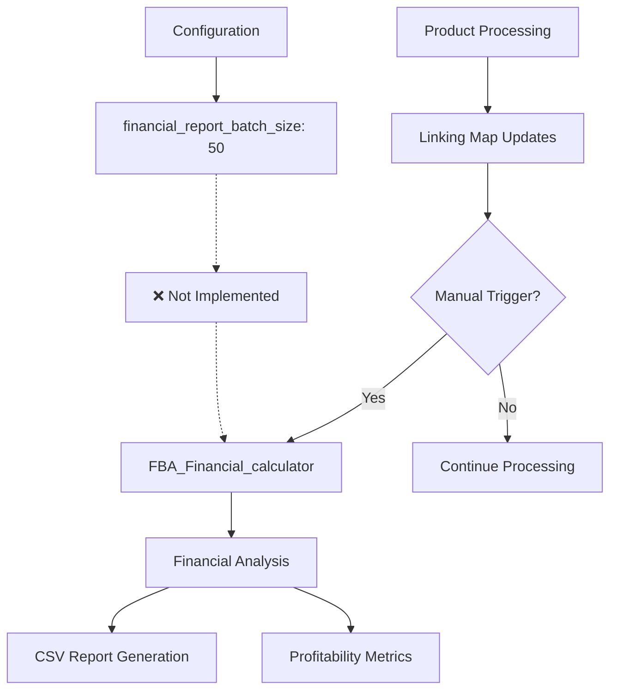

# Financial Report Automation Enhancement

## Overview

The Amazon FBA Agent System v3.7+ includes financial analysis capabilities through the `FBA_Financial_calculator`, but lacks automated triggering based on linking map thresholds. This quest focuses on implementing intelligent financial report automation that triggers at configurable intervals and provides comprehensive profitability analysis.

## Current Financial Analysis Architecture

### Existing Components



### Current Configuration

**File**: `config/system_config.json`
```json
{
  "system": {
    "financial_report_batch_size": 50,
    "linking_map_batch_size": 1
  },
  "analysis": {
    "min_roi_percent": 15.0,
    "min_profit_per_unit": 0.25,
    "min_rating": 3.0,
    "min_reviews": 5,
    "max_sales_rank": 500000
  }
}
```

## Critical Issues Identified

### Issue 1: Missing Automated Triggering

**Problem**: Financial reports are not automatically generated at configured thresholds.

**Current State**: 
- `financial_report_batch_size: 50` is configured but not implemented
- Manual triggering only
- No monitoring of linking map entry count

**Impact**:
- No real-time profitability insights during processing
- Manual intervention required for financial analysis
- Missed opportunities for early profitable product identification

### Issue 2: Incomplete Integration

**Problem**: Financial calculator exists but is not integrated into main workflow.

**Location**: `tools/passive_extraction_workflow_latest.py:4580-4590`
**Status**: Logic commented out or misconfigured

**Current Code**:
```python
# TODO: Implement financial report triggering
# if len(self.linking_map) % financial_batch_size == 0:
#     # Trigger financial report
#     pass
```

### Issue 3: Limited Profitability Monitoring

**Problem**: No real-time profitability tracking during processing.

**Missing Features**:
- Running profitability counters
- Profitable product alerts
- ROI distribution analysis
- Category-wise profitability metrics

## Quest Objectives

### Primary Goals

1. **Automated Report Triggering**
   - Implement threshold-based financial report generation
   - Monitor linking map entry count automatically
   - Trigger reports at configurable intervals

2. **Enhanced Financial Analysis**
   - Integrate comprehensive profitability calculations
   - Add real-time profitable product tracking
   - Implement category-wise financial metrics

3. **Intelligent Reporting**
   - Generate detailed financial reports with insights
   - Provide profitability trend analysis
   - Create actionable recommendations

4. **Performance Optimization**
   - Minimize impact on main processing workflow
   - Implement efficient financial calculations
   - Optimize report generation performance

### Secondary Goals

1. **Advanced Analytics**
   - Implement profit margin distribution analysis
   - Add competitive analysis metrics
   - Create market opportunity identification

2. **Alert System**
   - High-profit product alerts
   - Market trend notifications
   - Risk assessment warnings

## Technical Implementation Plan

### Phase 1: Automated Trigger System

#### Financial Report Trigger Manager

```python
class FinancialReportTriggerManager:
    def __init__(self, config_loader, logger):
        self.config_loader = config_loader
        self.logger = logger
        self.last_report_count = 0
        self.report_history = []
        
        # Load configuration
        self.batch_size = config_loader.get_system_config().get("financial_report_batch_size", 50)
        self.min_entries_for_report = max(self.batch_size, 10)  # Minimum entries needed
        
    def should_trigger_report(self, current_linking_map_count: int) -> bool:
        """Determine if financial report should be triggered"""
        
        # Must have minimum entries
        if current_linking_map_count < self.min_entries_for_report:
            return False
        
        # Check if we've reached the batch threshold
        entries_since_last_report = current_linking_map_count - self.last_report_count
        
        if entries_since_last_report >= self.batch_size:
            return True
        
        return False
    
    def trigger_financial_report(self, supplier_name: str, linking_map_data: List[Dict]) -> Dict[str, Any]:
        """Trigger financial report generation"""
        
        self.logger.info(f"🚨 FINANCIAL REPORT TRIGGER: {len(linking_map_data)} entries (threshold: {self.batch_size})")
        
        try:
            # Import and run financial calculator
            from tools.FBA_Financial_calculator import run_comprehensive_analysis
            
            start_time = time.time()
            
            # Run financial analysis
            financial_results = run_comprehensive_analysis(
                supplier_name=supplier_name,
                linking_map_data=linking_map_data,
                config=self.config_loader.get_analysis_config()
            )
            
            analysis_time = time.time() - start_time
            
            # Record successful report
            self.last_report_count = len(linking_map_data)
            self.report_history.append({
                "timestamp": datetime.now().isoformat(),
                "entry_count": len(linking_map_data),
                "analysis_time": analysis_time,
                "profitable_products": financial_results.get("profitable_count", 0),
                "output_file": financial_results.get("output_file")
            })
            
            # Log results
            self.logger.info(f"✅ Financial report completed in {analysis_time:.2f}s")
            self.logger.info(f"📊 Found {financial_results.get('profitable_count', 0)} profitable products")
            
            if financial_results.get("output_file"):
                self.logger.info(f"📄 Report saved: {financial_results['output_file']}")
            
            return {
                "success": True,
                "results": financial_results,
                "analysis_time": analysis_time
            }
            
        except Exception as e:
            self.logger.error(f"❌ Financial report generation failed: {e}")
            return {
                "success": False,
                "error": str(e)
            }
    
    def get_trigger_status(self, current_count: int) -> Dict[str, Any]:
        """Get current trigger status information"""
        entries_since_last = current_count - self.last_report_count
        entries_until_next = self.batch_size - (entries_since_last % self.batch_size)
        
        return {
            "current_count": current_count,
            "last_report_count": self.last_report_count,
            "entries_since_last": entries_since_last,
            "entries_until_next": entries_until_next,
            "will_trigger_next": entries_until_next == 1,
            "batch_size": self.batch_size
        }
```

#### Enhanced FBA Financial Calculator Integration

```python
class EnhancedFBAFinancialCalculator:
    def __init__(self, config_loader):
        self.config_loader = config_loader
        self.analysis_config = config_loader.get_analysis_config()
        
    def run_comprehensive_analysis(self, supplier_name: str, linking_map_data: List[Dict], 
                                 config: Dict = None) -> Dict[str, Any]:
        """Run comprehensive financial analysis with enhanced metrics"""
        
        if config:
            self.analysis_config.update(config)
        
        # Initialize analysis results
        results = {
            "supplier_name": supplier_name,
            "analysis_timestamp": datetime.now().isoformat(),
            "total_products": len(linking_map_data),
            "profitable_products": [],
            "category_analysis": {},
            "profitability_distribution": {},
            "market_insights": {},
            "recommendations": []
        }
        
        profitable_count = 0
        total_potential_profit = 0
        roi_distribution = {"high": 0, "medium": 0, "low": 0}
        category_profits = defaultdict(list)
        
        # Analyze each product
        for entry in linking_map_data:
            if not self._has_required_data(entry):
                continue
            
            # Calculate financial metrics
            financial_metrics = self._calculate_product_financials(entry)
            
            if financial_metrics["is_profitable"]:
                profitable_count += 1
                total_potential_profit += financial_metrics["net_profit"]
                
                # Add to profitable products
                results["profitable_products"].append({
                    "supplier_url": entry.get("supplier_url"),
                    "amazon_asin": entry.get("amazon_asin"),
                    "title": entry.get("title", "Unknown"),
                    "supplier_price": financial_metrics["supplier_price"],
                    "amazon_price": financial_metrics["amazon_price"],
                    "net_profit": financial_metrics["net_profit"],
                    "roi_percent": financial_metrics["roi_percent"],
                    "profit_margin": financial_metrics["profit_margin"],
                    "monthly_sales_estimate": financial_metrics.get("monthly_sales", 0),
                    "competition_level": financial_metrics.get("competition_level", "unknown")
                })
                
                # Categorize ROI
                roi = financial_metrics["roi_percent"]
                if roi >= 50:
                    roi_distribution["high"] += 1
                elif roi >= 25:
                    roi_distribution["medium"] += 1
                else:
                    roi_distribution["low"] += 1
                
                # Category analysis
                category = entry.get("category", "Unknown")
                category_profits[category].append(financial_metrics["net_profit"])
        
        # Generate category analysis
        for category, profits in category_profits.items():
            results["category_analysis"][category] = {
                "product_count": len(profits),
                "total_profit": sum(profits),
                "average_profit": sum(profits) / len(profits),
                "max_profit": max(profits),
                "min_profit": min(profits)
            }
        
        # Generate profitability distribution
        results["profitability_distribution"] = {
            "total_analyzed": len(linking_map_data),
            "profitable_count": profitable_count,
            "profitability_rate": profitable_count / len(linking_map_data) if linking_map_data else 0,
            "total_potential_profit": total_potential_profit,
            "average_profit_per_product": total_potential_profit / profitable_count if profitable_count else 0,
            "roi_distribution": roi_distribution
        }
        
        # Generate market insights
        results["market_insights"] = self._generate_market_insights(results)
        
        # Generate recommendations
        results["recommendations"] = self._generate_recommendations(results)
        
        # Save detailed report
        output_file = self._save_financial_report(supplier_name, results)
        results["output_file"] = output_file
        
        return results
    
    def _calculate_product_financials(self, entry: Dict) -> Dict[str, Any]:
        """Calculate comprehensive financial metrics for a product"""
        
        # Extract pricing data
        supplier_price = float(entry.get("supplier_price", 0))
        amazon_price = float(entry.get("amazon_price", 0))
        
        # Calculate FBA fees
        fba_fees = self._calculate_fba_fees(entry)
        
        # Calculate net profit
        total_costs = supplier_price + fba_fees["total_fees"]
        net_profit = amazon_price - total_costs
        
        # Calculate ROI
        roi_percent = (net_profit / supplier_price * 100) if supplier_price > 0 else 0
        
        # Calculate profit margin
        profit_margin = (net_profit / amazon_price * 100) if amazon_price > 0 else 0
        
        # Determine if profitable
        is_profitable = (
            roi_percent >= self.analysis_config.get("min_roi_percent", 15) and
            net_profit >= self.analysis_config.get("min_profit_per_unit", 0.25) and
            amazon_price > 0 and
            supplier_price > 0
        )
        
        return {
            "supplier_price": supplier_price,
            "amazon_price": amazon_price,
            "fba_fees": fba_fees,
            "net_profit": net_profit,
            "roi_percent": roi_percent,
            "profit_margin": profit_margin,
            "is_profitable": is_profitable,
            "monthly_sales": entry.get("monthly_sales_estimate", 0),
            "competition_level": entry.get("seller_count", 0)
        }
    
    def _calculate_fba_fees(self, entry: Dict) -> Dict[str, float]:
        """Calculate FBA fees for a product"""
        amazon_price = float(entry.get("amazon_price", 0))
        
        # FBA fee structure (UK marketplace)
        referral_fee = amazon_price * 0.15  # 15% referral fee
        fulfillment_fee = 2.41  # Minimum fulfillment fee
        storage_fee = 0.75  # Monthly storage fee estimate
        prep_fee = 0.55  # Prep service fee
        
        total_fees = referral_fee + fulfillment_fee + storage_fee + prep_fee
        
        return {
            "referral_fee": referral_fee,
            "fulfillment_fee": fulfillment_fee,
            "storage_fee": storage_fee,
            "prep_fee": prep_fee,
            "total_fees": total_fees
        }
    
    def _generate_market_insights(self, results: Dict) -> Dict[str, Any]:
        """Generate market insights from analysis results"""
        
        insights = {}
        
        # Top performing categories
        if results["category_analysis"]:
            top_categories = sorted(
                results["category_analysis"].items(),
                key=lambda x: x[1]["total_profit"],
                reverse=True
            )[:5]
            
            insights["top_categories"] = [
                {
                    "category": cat,
                    "total_profit": data["total_profit"],
                    "product_count": data["product_count"],
                    "average_profit": data["average_profit"]
                }
                for cat, data in top_categories
            ]
        
        # Profitability trends
        distribution = results["profitability_distribution"]
        insights["profitability_summary"] = {
            "overall_rate": f"{distribution['profitability_rate']:.1%}",
            "average_profit": f"£{distribution['average_profit_per_product']:.2f}",
            "total_opportunity": f"£{distribution['total_potential_profit']:.2f}"
        }
        
        return insights
    
    def _generate_recommendations(self, results: Dict) -> List[str]:
        """Generate actionable recommendations"""
        recommendations = []
        
        distribution = results["profitability_distribution"]
        
        # Profitability rate recommendations
        if distribution["profitability_rate"] < 0.1:
            recommendations.append("Low profitability rate (<10%). Consider adjusting supplier or focusing on different categories.")
        elif distribution["profitability_rate"] > 0.3:
            recommendations.append("High profitability rate (>30%). Excellent supplier - consider increasing order volumes.")
        
        # Category recommendations
        if results["category_analysis"]:
            top_category = max(results["category_analysis"].items(), key=lambda x: x[1]["total_profit"])
            recommendations.append(f"Focus on '{top_category[0]}' category - highest profit potential (£{top_category[1]['total_profit']:.2f})")
        
        # ROI distribution recommendations
        roi_dist = distribution["roi_distribution"]
        if roi_dist["high"] > roi_dist["medium"] + roi_dist["low"]:
            recommendations.append("Strong high-ROI products. Consider premium pricing strategy.")
        
        return recommendations
    
    def _save_financial_report(self, supplier_name: str, results: Dict) -> str:
        """Save comprehensive financial report"""
        
        timestamp = datetime.now().strftime("%Y%m%d_%H%M%S")
        filename = f"comprehensive_financial_report_{supplier_name}_{timestamp}.json"
        
        output_dir = Path("OUTPUTS/FBA_ANALYSIS/financial_reports")
        output_dir.mkdir(parents=True, exist_ok=True)
        
        output_path = output_dir / filename
        
        # Save JSON report
        with open(output_path, 'w', encoding='utf-8') as f:
            json.dump(results, f, indent=2, ensure_ascii=False)
        
        # Also save CSV summary for easy analysis
        csv_filename = f"profitable_products_{supplier_name}_{timestamp}.csv"
        csv_path = output_dir / csv_filename
        
        if results["profitable_products"]:
            df = pd.DataFrame(results["profitable_products"])
            df.to_csv(csv_path, index=False)
        
        return str(output_path)
```

### Phase 2: Integration with Main Workflow

#### Workflow Integration Points

```python
def _check_and_trigger_financial_report(self, supplier_name: str):
    """Check if financial report should be triggered and execute if needed"""
    
    current_count = len(self.linking_map)
    
    # Check if trigger is needed
    if self.financial_trigger_manager.should_trigger_report(current_count):
        
        # Get trigger status for logging
        status = self.financial_trigger_manager.get_trigger_status(current_count)
        
        self.log.info(f"🚨 FINANCIAL TRIGGER ACTIVATED: {current_count} entries "
                      f"(+{status['entries_since_last']} since last report)")
        
        # Trigger financial report
        result = self.financial_trigger_manager.trigger_financial_report(
            supplier_name, 
            self.linking_map
        )
        
        if result["success"]:
            # Log successful report generation
            profitable_count = result["results"].get("profitable_count", 0)
            self.log.info(f"✅ Financial analysis complete: {profitable_count} profitable products found")
            
            # Alert for high-profit products
            if profitable_count > 10:
                self.log.info(f"🎯 HIGH OPPORTUNITY: {profitable_count} profitable products identified!")
            
            return True
        else:
            self.log.error(f"❌ Financial report failed: {result.get('error', 'Unknown error')}")
            return False
    
    else:
        # Log progress toward next trigger
        status = self.financial_trigger_manager.get_trigger_status(current_count)
        if status["entries_until_next"] <= 5:  # Alert when close to trigger
            self.log.info(f"📊 Financial report in {status['entries_until_next']} entries")
    
    return False

def _update_linking_map_with_financial_trigger(self, new_entry: Dict, supplier_name: str):
    """Update linking map and check for financial report trigger"""
    
    # Add entry to linking map
    self.linking_map.append(new_entry)
    
    # Save linking map atomically
    self._save_linking_map_atomic()
    
    # Check for financial report trigger
    self._check_and_trigger_financial_report(supplier_name)
    
    # Update hash indices if needed
    self._rebuild_hash_indices_if_needed()
```

#### Real-time Profitability Tracking

```python
class RealTimeProfitabilityTracker:
    def __init__(self, config_loader):
        self.config_loader = config_loader
        self.running_stats = {
            "total_analyzed": 0,
            "profitable_count": 0,
            "total_potential_profit": 0.0,
            "high_roi_count": 0,
            "category_stats": defaultdict(lambda: {"count": 0, "profitable": 0})
        }
    
    def analyze_product(self, entry: Dict) -> Dict[str, Any]:
        """Analyze single product and update running statistics"""
        
        self.running_stats["total_analyzed"] += 1
        
        # Calculate financial metrics
        calculator = EnhancedFBAFinancialCalculator(self.config_loader)
        metrics = calculator._calculate_product_financials(entry)
        
        # Update running statistics
        if metrics["is_profitable"]:
            self.running_stats["profitable_count"] += 1
            self.running_stats["total_potential_profit"] += metrics["net_profit"]
            
            if metrics["roi_percent"] >= 50:
                self.running_stats["high_roi_count"] += 1
        
        # Update category statistics
        category = entry.get("category", "Unknown")
        self.running_stats["category_stats"][category]["count"] += 1
        if metrics["is_profitable"]:
            self.running_stats["category_stats"][category]["profitable"] += 1
        
        return {
            "is_profitable": metrics["is_profitable"],
            "net_profit": metrics["net_profit"],
            "roi_percent": metrics["roi_percent"],
            "running_stats": self.get_current_stats()
        }
    
    def get_current_stats(self) -> Dict[str, Any]:
        """Get current running statistics"""
        stats = self.running_stats.copy()
        
        # Calculate rates
        if stats["total_analyzed"] > 0:
            stats["profitability_rate"] = stats["profitable_count"] / stats["total_analyzed"]
            stats["high_roi_rate"] = stats["high_roi_count"] / stats["total_analyzed"]
            stats["average_profit"] = stats["total_potential_profit"] / max(stats["profitable_count"], 1)
        else:
            stats["profitability_rate"] = 0
            stats["high_roi_rate"] = 0
            stats["average_profit"] = 0
        
        return stats
    
    def should_alert_high_profit(self) -> bool:
        """Check if high-profit alert should be triggered"""
        stats = self.get_current_stats()
        
        # Alert if profitability rate is very high
        if stats["profitability_rate"] > 0.5 and stats["total_analyzed"] >= 20:
            return True
        
        # Alert if high ROI rate is exceptional
        if stats["high_roi_rate"] > 0.3 and stats["total_analyzed"] >= 10:
            return True
        
        return False
```

## Performance Optimization

### Efficient Financial Calculations

```python
class OptimizedFinancialCalculator:
    def __init__(self):
        self.fee_cache = {}
        self.calculation_cache = {}
    
    def calculate_with_caching(self, entry: Dict) -> Dict[str, Any]:
        """Calculate financial metrics with caching for performance"""
        
        # Create cache key
        cache_key = self._create_cache_key(entry)
        
        if cache_key in self.calculation_cache:
            return self.calculation_cache[cache_key]
        
        # Calculate metrics
        metrics = self._calculate_product_financials(entry)
        
        # Cache result
        self.calculation_cache[cache_key] = metrics
        
        return metrics
    
    def _create_cache_key(self, entry: Dict) -> str:
        """Create cache key for financial calculations"""
        return f"{entry.get('supplier_price', 0)}_{entry.get('amazon_price', 0)}"
    
    def clear_cache(self):
        """Clear calculation cache to prevent memory buildup"""
        self.calculation_cache.clear()
        self.fee_cache.clear()
```

## Testing Strategy

### Unit Tests

```python
def test_financial_trigger_logic():
    """Test financial report triggering logic"""
    # Test threshold detection
    # Test trigger timing
    # Test configuration handling

def test_financial_calculations():
    """Test financial calculation accuracy"""
    # Test FBA fee calculations
    # Test ROI calculations
    # Test profitability determination

def test_report_generation():
    """Test report generation functionality"""
    # Test JSON report creation
    # Test CSV export
    # Test error handling
```

### Integration Tests

```python
def test_workflow_integration():
    """Test integration with main workflow"""
    # Test automatic triggering during processing
    # Test performance impact
    # Test error recovery

def test_real_time_tracking():
    """Test real-time profitability tracking"""
    # Test running statistics accuracy
    # Test alert triggering
    # Test memory usage
```

## Success Criteria

### Primary Objectives

- [ ] Automated financial report triggering at configured thresholds
- [ ] Comprehensive financial analysis with enhanced metrics
- [ ] Real-time profitability tracking during processing
- [ ] Intelligent reporting with actionable insights
- [ ] Performance optimization with minimal workflow impact

### Quality Metrics

- [ ] Financial reports generated within 30 seconds
- [ ] Calculation accuracy within 0.01% tolerance
- [ ] Memory usage increase <10% during analysis
- [ ] Zero processing interruptions due to financial analysis
- [ ] 100% configuration compliance

### Business Value

- [ ] Real-time identification of profitable products
- [ ] Category-wise profitability insights
- [ ] Market opportunity recommendations
- [ ] Automated profit tracking and reporting
- [ ] Enhanced decision-making capabilities

This quest provides a comprehensive framework for implementing automated financial report generation and enhanced profitability analysis in the Amazon FBA Agent System.