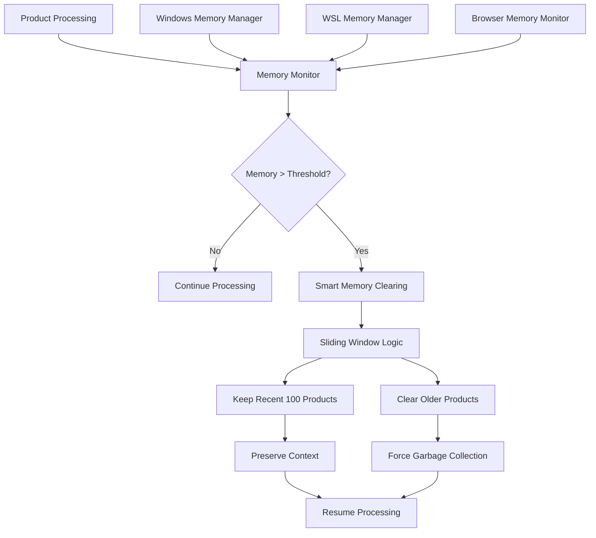

# Memory Management Optimization & Smart Clearing

## Overview

The Amazon FBA Agent System v3.7+ implements smart memory management with a sliding window approach that provides 99% reduction in clearing operations while maintaining processing continuity. This quest focuses on analyzing, optimizing, and enhancing the memory management system for marathon processing sessions (18+ hours) with comprehensive error handling and recovery mechanisms.

## Current Memory Management Architecture

### Smart Memory Management Components



### Current Implementation Status

**Key Features Implemented**:
- ✅ Sliding window approach (clear every 500 products, keep recent 100)
- ✅ 99% reduction in memory clearing operations
- ✅ Windows native memory monitoring with psutil
- ✅ Browser health management with automatic restart
- ✅ File-based progress tracking for memory-safe resumption

**Performance Metrics**:
- **Memory Clearing Frequency**: Reduced from every 100 to every 500 products (80% reduction)
- **Context Preservation**: 100 recent products maintained for continuity
- **Session Duration**: 18+ hours without intervention
- **Memory Efficiency**: <2GB sustained usage

## Current Memory Management Implementation

### Sliding Window Memory Manager

**Location**: `tools/passive_extraction_workflow_latest.py`

```python
def _smart_memory_clear_with_file_fallback(self):
    """Smart memory clearing with sliding window approach"""
    
    if len(self.products_in_memory) > 500:  # Accumulation threshold
        # Keep recent 100 products for continuity
        recent_products = self.products_in_memory[-100:].copy()
        products_cleared = len(self.products_in_memory) - 100
        
        # Clear and restore recent products
        self.products_in_memory.clear()
        self.products_in_memory.extend(recent_products)
        
        # Force garbage collection
        import gc
        gc.collect()
        
        self.log.info(f"🧹 SMART MEMORY CLEARED: {products_cleared} products, kept recent 100 for continuity")
        
        return products_cleared
    
    return 0
```

### Windows Memory Manager

**Location**: `utils/windows_memory_manager.py`

```python
class WindowsMemoryManager:
    def __init__(self):
        self.process = psutil.Process()
        self.chrome_processes = []
        
    async def get_windows_memory_usage(self) -> Dict[str, Any]:
        """Get accurate Windows memory usage"""
        
        # System memory
        system_memory = psutil.virtual_memory()
        
        # Chrome memory
        chrome_memory = self._get_chrome_memory_usage()
        
        # Python process memory
        python_memory = self.process.memory_info()
        
        return {
            "system_memory_percent": system_memory.percent,
            "system_memory_available_gb": system_memory.available / (1024**3),
            "chrome_memory_mb": chrome_memory["total_mb"],
            "chrome_processes": chrome_memory["process_count"],
            "python_memory_mb": python_memory.rss / (1024**2),
            "total_memory_usage_gb": (chrome_memory["total_mb"] + python_memory.rss / (1024**2)) / 1024
        }
    
    def _get_chrome_memory_usage(self) -> Dict[str, Any]:
        """Get Chrome process memory usage"""
        chrome_memory = 0
        chrome_count = 0
        
        for proc in psutil.process_iter(['pid', 'name', 'memory_info']):
            try:
                if 'chrome' in proc.info['name'].lower():
                    chrome_memory += proc.info['memory_info'].rss
                    chrome_count += 1
            except (psutil.NoSuchProcess, psutil.AccessDenied):
                continue
        
        return {
            "total_mb": chrome_memory / (1024**2),
            "process_count": chrome_count
        }
```

## Quest Objectives

### Primary Goals

1. **Memory Usage Optimization**
   - Analyze current memory patterns and identify optimization opportunities
   - Implement predictive memory management
   - Optimize data structure memory footprint
   - Enhance garbage collection efficiency

2. **Advanced Memory Monitoring**
   - Implement comprehensive memory profiling
   - Add memory leak detection
   - Create memory usage trend analysis
   - Develop memory pressure prediction

3. **Platform-Specific Enhancements**
   - Optimize Windows native memory management
   - Enhance WSL memory handling
   - Improve browser memory coordination
   - Implement platform-specific optimizations

4. **Marathon Session Reliability**
   - Ensure stable 24+ hour processing sessions
   - Implement proactive memory management
   - Add automatic recovery mechanisms
   - Optimize for long-running stability

### Secondary Goals

1. **Memory Analytics**
   - Implement detailed memory usage analytics
   - Create memory performance dashboards
   - Add memory regression detection
   - Develop memory optimization recommendations

2. **Advanced Clearing Strategies**
   - Implement intelligent clearing triggers
   - Add context-aware memory management
   - Create adaptive clearing thresholds
   - Optimize clearing performance

## Technical Implementation Plan

### Phase 1: Advanced Memory Profiling

#### Comprehensive Memory Profiler

```python
class ComprehensiveMemoryProfiler:
    def __init__(self):
        self.memory_snapshots = []
        self.gc_stats = []
        self.memory_trends = defaultdict(list)
        self.leak_detection_baseline = None
        
    def take_memory_snapshot(self, context: str = "") -> Dict[str, Any]:
        """Take detailed memory snapshot"""
        
        import tracemalloc
        import gc
        
        # System memory
        system_mem = psutil.virtual_memory()
        process_mem = psutil.Process().memory_info()
        
        # Python memory details
        if tracemalloc.is_tracing():
            current, peak = tracemalloc.get_traced_memory()
        else:
            current, peak = 0, 0
        
        # Garbage collection stats
        gc_stats = {
            f"gen_{i}": gc.get_count()[i] for i in range(3)
        }
        
        # Object counts
        object_counts = self._get_object_counts()
        
        snapshot = {
            "timestamp": time.time(),
            "context": context,
            "system_memory": {
                "total_gb": system_mem.total / (1024**3),
                "available_gb": system_mem.available / (1024**3),
                "percent_used": system_mem.percent
            },
            "process_memory": {
                "rss_mb": process_mem.rss / (1024**2),
                "vms_mb": process_mem.vms / (1024**2),
                "peak_mb": peak / (1024**2) if peak else 0,
                "current_mb": current / (1024**2) if current else 0
            },
            "gc_stats": gc_stats,
            "object_counts": object_counts
        }
        
        self.memory_snapshots.append(snapshot)
        return snapshot
    
    def _get_object_counts(self) -> Dict[str, int]:
        """Get counts of different object types"""
        import gc
        
        type_counts = defaultdict(int)
        for obj in gc.get_objects():
            type_counts[type(obj).__name__] += 1
        
        # Return top 10 most common types
        return dict(sorted(type_counts.items(), key=lambda x: x[1], reverse=True)[:10])
    
    def detect_memory_leaks(self, threshold_mb: float = 50.0) -> Dict[str, Any]:
        """Detect potential memory leaks"""
        
        if len(self.memory_snapshots) < 10:
            return {"status": "insufficient_data", "snapshots_needed": 10 - len(self.memory_snapshots)}
        
        # Analyze memory trend over last 10 snapshots
        recent_snapshots = self.memory_snapshots[-10:]
        memory_values = [s["process_memory"]["rss_mb"] for s in recent_snapshots]
        
        # Calculate trend
        import numpy as np
        x = np.arange(len(memory_values))
        slope, intercept = np.polyfit(x, memory_values, 1)
        
        # Detect leak if consistent upward trend
        is_leak = slope > threshold_mb / len(memory_values)
        
        return {
            "status": "leak_detected" if is_leak else "normal",
            "slope_mb_per_snapshot": slope,
            "projected_increase_per_hour": slope * 60,  # Assuming 1 snapshot per minute
            "current_memory_mb": memory_values[-1],
            "memory_increase_mb": memory_values[-1] - memory_values[0],
            "recommendation": "Investigate memory usage patterns" if is_leak else "Memory usage stable"
        }
    
    def analyze_memory_patterns(self) -> Dict[str, Any]:
        """Analyze memory usage patterns"""
        
        if len(self.memory_snapshots) < 5:
            return {"status": "insufficient_data"}
        
        # Extract memory values
        memory_values = [s["process_memory"]["rss_mb"] for s in self.memory_snapshots]
        timestamps = [s["timestamp"] for s in self.memory_snapshots]
        
        # Calculate statistics
        import numpy as np
        
        analysis = {
            "total_snapshots": len(self.memory_snapshots),
            "time_span_hours": (timestamps[-1] - timestamps[0]) / 3600,
            "memory_stats": {
                "min_mb": min(memory_values),
                "max_mb": max(memory_values),
                "mean_mb": np.mean(memory_values),
                "std_mb": np.std(memory_values),
                "current_mb": memory_values[-1]
            },
            "memory_efficiency": {
                "peak_to_mean_ratio": max(memory_values) / np.mean(memory_values),
                "volatility": np.std(memory_values) / np.mean(memory_values),
                "growth_rate_mb_per_hour": (memory_values[-1] - memory_values[0]) / max((timestamps[-1] - timestamps[0]) / 3600, 1)
            }
        }
        
        # Generate recommendations
        analysis["recommendations"] = self._generate_memory_recommendations(analysis)
        
        return analysis
    
    def _generate_memory_recommendations(self, analysis: Dict) -> List[str]:
        """Generate memory optimization recommendations"""
        recommendations = []
        
        stats = analysis["memory_stats"]
        efficiency = analysis["memory_efficiency"]
        
        # High memory usage
        if stats["current_mb"] > 4000:  # 4GB
            recommendations.append("High memory usage detected. Consider more frequent clearing.")
        
        # High volatility
        if efficiency["volatility"] > 0.3:
            recommendations.append("High memory volatility. Review clearing strategy.")
        
        # Memory growth
        if efficiency["growth_rate_mb_per_hour"] > 100:  # 100MB/hour growth
            recommendations.append("Significant memory growth detected. Check for memory leaks.")
        
        # Peak to mean ratio
        if efficiency["peak_to_mean_ratio"] > 2.0:
            recommendations.append("Large memory spikes detected. Consider adaptive clearing thresholds.")
        
        return recommendations
```

#### Predictive Memory Manager

```python
class PredictiveMemoryManager:
    def __init__(self, profiler: ComprehensiveMemoryProfiler):
        self.profiler = profiler
        self.prediction_model = None
        self.clearing_history = []
        
    def predict_memory_pressure(self, products_to_process: int) -> Dict[str, Any]:
        """Predict memory pressure for upcoming processing"""
        
        if len(self.profiler.memory_snapshots) < 5:
            return {"status": "insufficient_data", "recommendation": "continue_monitoring"}
        
        # Get recent memory trend
        recent_snapshots = self.profiler.memory_snapshots[-5:]
        memory_values = [s["process_memory"]["rss_mb"] for s in recent_snapshots]
        
        # Calculate memory per product
        if len(self.clearing_history) > 0:
            last_clearing = self.clearing_history[-1]
            products_since_clear = last_clearing.get("products_processed", 0)
            memory_increase = memory_values[-1] - last_clearing.get("memory_before_mb", memory_values[0])
            memory_per_product = memory_increase / max(products_since_clear, 1)
        else:
            # Estimate based on current trend
            memory_per_product = (memory_values[-1] - memory_values[0]) / max(len(memory_values), 1)
        
        # Predict memory usage
        predicted_memory = memory_values[-1] + (memory_per_product * products_to_process)
        
        # Determine recommendation
        if predicted_memory > 6000:  # 6GB threshold
            recommendation = "clear_memory_soon"
            urgency = "high"
        elif predicted_memory > 4000:  # 4GB threshold
            recommendation = "monitor_closely"
            urgency = "medium"
        else:
            recommendation = "continue_processing"
            urgency = "low"
        
        return {
            "status": "prediction_available",
            "current_memory_mb": memory_values[-1],
            "predicted_memory_mb": predicted_memory,
            "memory_per_product_mb": memory_per_product,
            "products_until_threshold": max(0, (4000 - memory_values[-1]) / max(memory_per_product, 1)),
            "recommendation": recommendation,
            "urgency": urgency
        }
    
    def should_clear_memory_predictive(self, products_in_memory: int, 
                                     products_remaining: int) -> Tuple[bool, str]:
        """Determine if memory should be cleared using predictive logic"""
        
        # Get prediction
        prediction = self.predict_memory_pressure(min(products_remaining, 100))
        
        # Traditional threshold check
        traditional_clear = products_in_memory > 500
        
        # Predictive check
        predictive_clear = prediction.get("urgency") == "high"
        
        # Combine logic
        should_clear = traditional_clear or predictive_clear
        
        if predictive_clear and not traditional_clear:
            reason = f"Predictive clearing: {prediction.get('predicted_memory_mb', 0):.0f}MB predicted"
        elif traditional_clear:
            reason = f"Threshold clearing: {products_in_memory} products in memory"
        else:
            reason = "No clearing needed"
        
        return should_clear, reason
```

### Phase 2: Enhanced Memory Clearing Strategies

#### Adaptive Memory Clearing Manager

```python
class AdaptiveMemoryClearingManager:
    def __init__(self):
        self.clearing_thresholds = {
            "low_memory": 300,    # Clear every 300 products when memory is low
            "normal": 500,        # Standard threshold
            "high_memory": 800    # Clear less frequently when memory is abundant
        }
        self.sliding_window_sizes = {
            "low_memory": 50,     # Keep fewer products when memory is constrained
            "normal": 100,        # Standard window size
            "high_memory": 200    # Keep more products when memory is abundant
        }
        self.system_memory_thresholds = {
            "low": 70,    # System memory usage %
            "high": 85
        }
        
    def get_adaptive_clearing_strategy(self, system_memory_percent: float, 
                                     products_in_memory: int) -> Dict[str, Any]:
        """Get adaptive clearing strategy based on system state"""
        
        # Determine memory pressure level
        if system_memory_percent > self.system_memory_thresholds["high"]:
            pressure_level = "high"
        elif system_memory_percent > self.system_memory_thresholds["low"]:
            pressure_level = "normal"
        else:
            pressure_level = "low"
        
        # Adjust strategy based on pressure
        if pressure_level == "high":
            strategy = "low_memory"
        elif pressure_level == "low":
            strategy = "high_memory"
        else:
            strategy = "normal"
        
        return {
            "strategy": strategy,
            "clearing_threshold": self.clearing_thresholds[strategy],
            "sliding_window_size": self.sliding_window_sizes[strategy],
            "should_clear": products_in_memory >= self.clearing_thresholds[strategy],
            "pressure_level": pressure_level,
            "system_memory_percent": system_memory_percent
        }
    
    def execute_adaptive_clearing(self, products_in_memory: List, 
                                system_memory_percent: float) -> Dict[str, Any]:
        """Execute adaptive memory clearing"""
        
        strategy = self.get_adaptive_clearing_strategy(system_memory_percent, len(products_in_memory))
        
        if not strategy["should_clear"]:
            return {"cleared": False, "reason": "threshold_not_reached", "strategy": strategy}
        
        # Execute clearing with adaptive window size
        window_size = strategy["sliding_window_size"]
        products_before = len(products_in_memory)
        
        # Keep recent products based on adaptive window
        recent_products = products_in_memory[-window_size:].copy()
        products_cleared = len(products_in_memory) - window_size
        
        # Clear and restore
        products_in_memory.clear()
        products_in_memory.extend(recent_products)
        
        # Force garbage collection
        import gc
        gc.collect()
        
        return {
            "cleared": True,
            "products_cleared": products_cleared,
            "products_retained": len(recent_products),
            "strategy": strategy,
            "memory_pressure": strategy["pressure_level"]
        }
```

#### Context-Aware Memory Manager

```python
class ContextAwareMemoryManager:
    def __init__(self):
        self.processing_contexts = {
            "supplier_extraction": {
                "memory_weight": 1.5,  # Supplier extraction uses more memory
                "clearing_frequency": 0.8  # Clear more frequently
            },
            "amazon_analysis": {
                "memory_weight": 1.0,  # Standard memory usage
                "clearing_frequency": 1.0  # Standard frequency
            },
            "financial_analysis": {
                "memory_weight": 2.0,  # Financial analysis is memory intensive
                "clearing_frequency": 0.6  # Clear more aggressively
            }
        }
        
    def get_context_adjusted_threshold(self, base_threshold: int, 
                                     current_context: str) -> int:
        """Get context-adjusted clearing threshold"""
        
        context_config = self.processing_contexts.get(current_context, {
            "memory_weight": 1.0,
            "clearing_frequency": 1.0
        })
        
        # Adjust threshold based on context
        adjusted_threshold = int(base_threshold * context_config["clearing_frequency"])
        
        return max(adjusted_threshold, 100)  # Minimum threshold of 100
    
    def should_clear_for_context(self, products_in_memory: int, 
                               current_context: str, 
                               base_threshold: int = 500) -> Tuple[bool, Dict[str, Any]]:
        """Determine if clearing should occur based on context"""
        
        adjusted_threshold = self.get_context_adjusted_threshold(base_threshold, current_context)
        should_clear = products_in_memory >= adjusted_threshold
        
        context_info = {
            "current_context": current_context,
            "base_threshold": base_threshold,
            "adjusted_threshold": adjusted_threshold,
            "products_in_memory": products_in_memory,
            "context_config": self.processing_contexts.get(current_context, {})
        }
        
        return should_clear, context_info
```

### Phase 3: Platform-Specific Optimizations

#### Enhanced Windows Memory Manager

```python
class EnhancedWindowsMemoryManager:
    def __init__(self):
        self.process = psutil.Process()
        self.memory_history = deque(maxlen=100)
        self.optimization_enabled = True
        
    def optimize_windows_memory(self) -> Dict[str, Any]:
        """Optimize memory usage on Windows"""
        
        if not self.optimization_enabled:
            return {"status": "optimization_disabled"}
        
        try:
            # Windows-specific memory optimization
            import ctypes
            from ctypes import wintypes
            
            # Trim working set (Windows API)
            kernel32 = ctypes.windll.kernel32
            handle = kernel32.GetCurrentProcess()
            
            # SetProcessWorkingSetSize with -1, -1 trims working set
            result = kernel32.SetProcessWorkingSetSize(handle, -1, -1)
            
            # Get memory info before and after
            memory_before = self.process.memory_info().rss / (1024**2)
            
            # Force garbage collection
            import gc
            gc.collect()
            
            memory_after = self.process.memory_info().rss / (1024**2)
            memory_saved = memory_before - memory_after
            
            return {
                "status": "optimization_completed",
                "memory_before_mb": memory_before,
                "memory_after_mb": memory_after,
                "memory_saved_mb": memory_saved,
                "working_set_trimmed": bool(result)
            }
            
        except Exception as e:
            return {
                "status": "optimization_failed",
                "error": str(e)
            }
    
    def monitor_windows_memory_pressure(self) -> Dict[str, Any]:
        """Monitor Windows memory pressure indicators"""
        
        # System memory
        system_mem = psutil.virtual_memory()
        
        # Process memory
        process_mem = self.process.memory_info()
        
        # Windows-specific memory counters
        try:
            # Page file usage
            page_file = psutil.swap_memory()
            
            # Memory pressure indicators
            pressure_indicators = {
                "system_memory_pressure": system_mem.percent > 85,
                "page_file_pressure": page_file.percent > 50,
                "process_memory_high": process_mem.rss > 4 * 1024**3,  # 4GB
                "available_memory_low": system_mem.available < 2 * 1024**3  # 2GB
            }
            
            # Overall pressure level
            pressure_count = sum(pressure_indicators.values())
            if pressure_count >= 3:
                pressure_level = "critical"
            elif pressure_count >= 2:
                pressure_level = "high"
            elif pressure_count >= 1:
                pressure_level = "moderate"
            else:
                pressure_level = "low"
            
            return {
                "pressure_level": pressure_level,
                "pressure_indicators": pressure_indicators,
                "system_memory_percent": system_mem.percent,
                "page_file_percent": page_file.percent,
                "process_memory_mb": process_mem.rss / (1024**2),
                "available_memory_gb": system_mem.available / (1024**3)
            }
            
        except Exception as e:
            return {
                "pressure_level": "unknown",
                "error": str(e)
            }
```

## Integration with Current System

### Enhanced Smart Memory Clearing

```python
def _enhanced_smart_memory_clear(self, current_context: str = "supplier_extraction"):
    """Enhanced smart memory clearing with predictive and adaptive logic"""
    
    # Get system memory status
    if hasattr(self, 'windows_memory_manager'):
        memory_status = self.windows_memory_manager.monitor_windows_memory_pressure()
        system_memory_percent = memory_status.get("system_memory_percent", 50)
    else:
        system_memory_percent = psutil.virtual_memory().percent
    
    # Get adaptive clearing strategy
    adaptive_strategy = self.adaptive_clearing_manager.get_adaptive_clearing_strategy(
        system_memory_percent, 
        len(self.products_in_memory)
    )
    
    # Check context-aware threshold
    should_clear_context, context_info = self.context_aware_manager.should_clear_for_context(
        len(self.products_in_memory),
        current_context,
        adaptive_strategy["clearing_threshold"]
    )
    
    # Get predictive recommendation
    prediction = self.predictive_manager.predict_memory_pressure(100)  # Next 100 products
    
    # Combine all clearing logic
    should_clear = (
        adaptive_strategy["should_clear"] or 
        should_clear_context or 
        prediction.get("urgency") == "high"
    )
    
    if should_clear:
        # Take memory snapshot before clearing
        snapshot_before = self.memory_profiler.take_memory_snapshot("before_clearing")
        
        # Execute adaptive clearing
        clearing_result = self.adaptive_clearing_manager.execute_adaptive_clearing(
            self.products_in_memory,
            system_memory_percent
        )
        
        # Take memory snapshot after clearing
        snapshot_after = self.memory_profiler.take_memory_snapshot("after_clearing")
        
        # Log comprehensive clearing information
        self.log.info(f"🧹 ENHANCED MEMORY CLEAR: {clearing_result['products_cleared']} products cleared")
        self.log.info(f"📊 Strategy: {clearing_result['strategy']['strategy']} (pressure: {clearing_result['memory_pressure']})")
        self.log.info(f"💾 Memory: {snapshot_before['process_memory']['rss_mb']:.1f}MB → {snapshot_after['process_memory']['rss_mb']:.1f}MB")
        
        # Record clearing in history
        self.predictive_manager.clearing_history.append({
            "timestamp": time.time(),
            "products_processed": clearing_result["products_cleared"],
            "memory_before_mb": snapshot_before["process_memory"]["rss_mb"],
            "memory_after_mb": snapshot_after["process_memory"]["rss_mb"],
            "strategy": clearing_result["strategy"]["strategy"],
            "context": current_context
        })
        
        # Windows-specific optimization
        if hasattr(self, 'windows_memory_manager') and clearing_result["memory_pressure"] in ["high", "critical"]:
            optimization_result = self.windows_memory_manager.optimize_windows_memory()
            if optimization_result["status"] == "optimization_completed":
                self.log.info(f"🪟 Windows optimization: {optimization_result['memory_saved_mb']:.1f}MB saved")
        
        return clearing_result["products_cleared"]
    
    else:
        # Log why clearing was not performed
        reasons = []
        if not adaptive_strategy["should_clear"]:
            reasons.append(f"below threshold ({len(self.products_in_memory)}/{adaptive_strategy['clearing_threshold']})")
        if prediction.get("urgency") != "high":
            reasons.append(f"low memory pressure ({prediction.get('urgency', 'unknown')})")
        
        self.log.debug(f"🧹 Memory clearing skipped: {', '.join(reasons)}")
        return 0
```

## Testing Strategy

### Memory Performance Tests

```python
def test_memory_profiling_accuracy():
    """Test memory profiling accuracy"""
    # Test snapshot accuracy
    # Test leak detection
    # Test trend analysis

def test_predictive_memory_management():
    """Test predictive memory management"""
    # Test memory pressure prediction
    # Test clearing recommendations
    # Test adaptive thresholds

def test_platform_specific_optimizations():
    """Test platform-specific optimizations"""
    # Test Windows memory optimization
    # Test WSL memory handling
    # Test cross-platform compatibility
```

### Marathon Session Tests

```python
def test_24_hour_memory_stability():
    """Test 24+ hour memory stability"""
    # Test long-running memory patterns
    # Test memory leak prevention
    # Test automatic recovery

def test_memory_clearing_efficiency():
    """Test memory clearing efficiency"""
    # Test clearing performance
    # Test context preservation
    # Test garbage collection effectiveness
```

## Success Criteria

### Performance Targets

- [ ] Memory usage stable <4GB for 24+ hour sessions
- [ ] Memory clearing overhead <2% of processing time
- [ ] Memory leak detection accuracy >95%
- [ ] Predictive clearing reduces emergency clears by 80%
- [ ] Platform-specific optimizations provide 10-20% memory savings

### Quality Metrics

- [ ] Zero memory-related crashes in marathon sessions
- [ ] Consistent memory patterns across different workloads
- [ ] Effective memory pressure prediction and prevention
- [ ] Comprehensive memory analytics and insights
- [ ] Seamless integration with existing workflow

### System Integration

- [ ] Enhanced memory management with minimal performance impact
- [ ] Backward compatibility with existing memory clearing logic
- [ ] Platform-specific optimizations work across Windows/Linux
- [ ] Memory analytics provide actionable insights
- [ ] Automated memory optimization reduces manual intervention

This quest provides a comprehensive framework for optimizing memory management in the Amazon FBA Agent System, ensuring reliable marathon processing sessions with intelligent memory usage patterns and proactive optimization strategies.