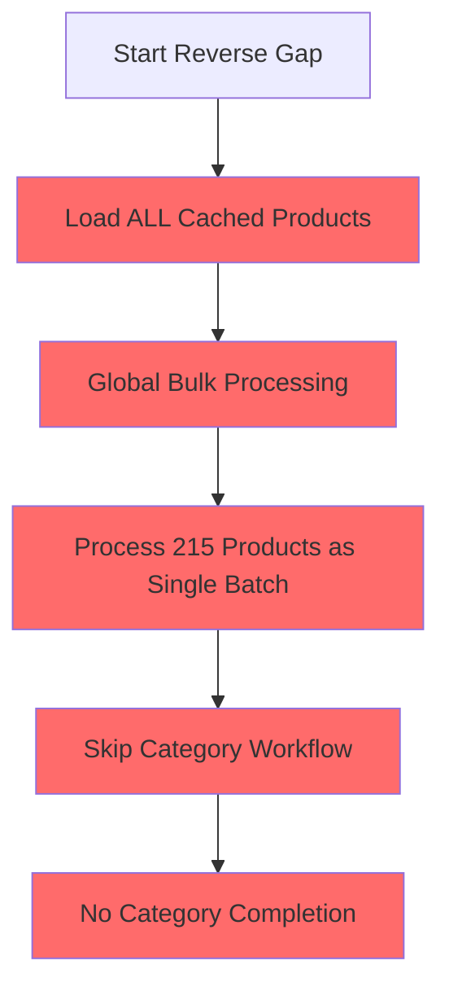
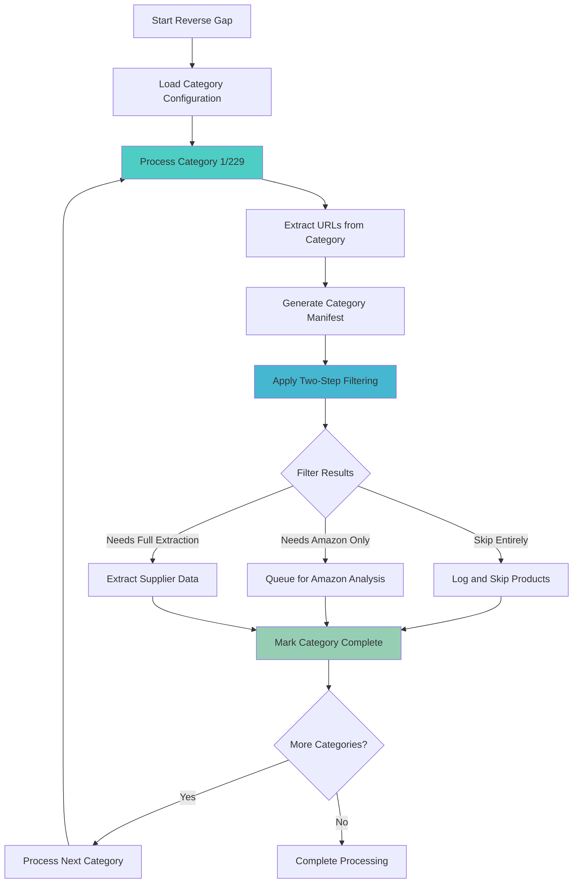
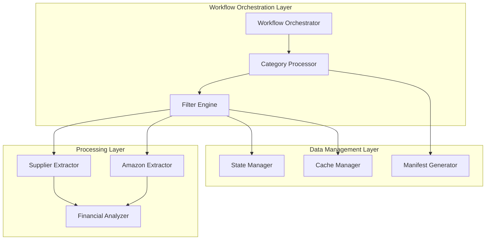
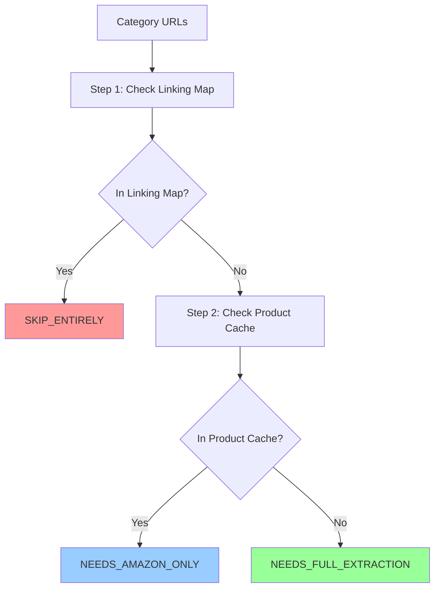
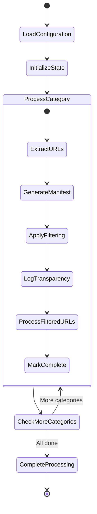
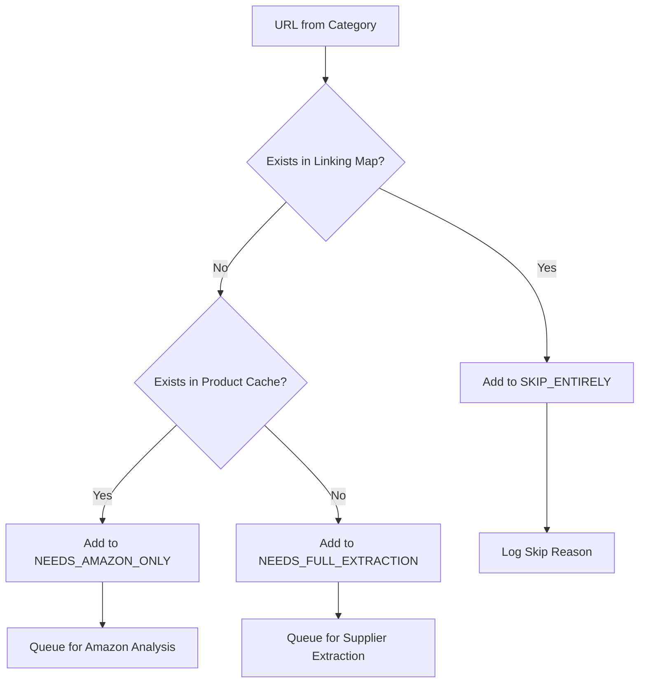

# Reverse Gap Processing Workflow Fix

## Overview

The Amazon FBA Agent System currently exhibits critical architectural violations in reverse gap processing scenarios. Instead of following the documented category-by-category workflow, the system incorrectly processes all cached products as a bulk operation, bypassing essential filtering mechanisms and category completion tracking.

## Technology Stack & Dependencies

- **Core Framework**: Python 3.8+ with Playwright browser automation
- **State Management**: Enhanced State Manager with atomic file operations
- **Configuration**: JSON-based system configuration with feature toggles
- **Cache Management**: Hash-optimized product cache with O(1) lookup
- **Browser Automation**: Chrome with remote debugging protocol
- **Data Persistence**: File-based manifests and linking maps

## Architecture

### Current Problematic Architecture



### Corrected Architecture



### Component Architecture



## Detailed Component Design

### 1. Category Processing Engine

**Purpose**: Manages sequential category-by-category processing with proper state tracking.

**Key Responsibilities**:
- Load categories from configuration in sequential order
- Track category completion status
- Maintain accurate progression metrics
- Handle category resumption after interruptions

**Interface Design**:
```python
class CategoryProcessor:
    def process_categories_sequentially(self, categories: List[str]) -> ProcessingResult
    def get_current_category_index(self) -> int
    def mark_category_complete(self, category_url: str) -> None
    def resume_from_last_category(self) -> str
```

### 2. Two-Step Filter Engine

**Purpose**: Implements the documented filtering logic with proper categorization.

**Filtering Logic**:


**Interface Design**:
```python
class FilterEngine:
    def apply_two_step_filtering(self, urls: List[str]) -> FilterResult
    def filter_against_linking_map(self, urls: List[str]) -> List[str]
    def filter_against_product_cache(self, urls: List[str]) -> List[str]
    def categorize_urls(self, urls: List[str]) -> FilterCategories
```

**Filter Categories Data Model**:
```python
@dataclass
class FilterCategories:
    skip_entirely: List[str]        # Already in linking map
    needs_amazon_only: List[str]    # Has supplier data, needs Amazon
    needs_full_extraction: List[str] # Needs fresh supplier extraction
```

### 3. Manifest Generator

**Purpose**: Creates category manifests before filtering to ensure data integrity.

**Responsibilities**:
- Generate manifests per category before any filtering
- Provide atomic file operations for manifest storage
- Enable filter invariant validation
- Support resumption scenarios

**Interface Design**:
```python
class ManifestGenerator:
    def generate_category_manifest(self, category_url: str, urls: List[str]) -> str
    def save_manifest_atomically(self, manifest_path: str, data: Dict) -> None
    def load_manifest_for_category(self, category_url: str) -> Optional[Dict]
```

### 4. Enhanced State Manager Integration

**Purpose**: Provides accurate category progression tracking and resumption capability.

**State Data Model**:
```python
@dataclass
class SystemProgression:
    total_categories: int
    current_category_index: int
    current_category_url: str
    categories_completed: List[str]
    category_completion_status: Dict[str, CategoryStatus]
```

**Interface Extensions**:
```python
class EnhancedStateManager:
    def update_category_progression(self, category_index: int, category_url: str) -> None
    def mark_category_complete(self, category_url: str, metrics: CategoryMetrics) -> None
    def get_resumption_category(self) -> Optional[str]
    def is_category_completed(self, category_url: str) -> bool
```

## API Endpoints Reference

### Core Workflow API

#### `_run_hybrid_processing_mode()`
**Current Issues**:
- Bypasses category-by-category processing in reverse gap scenarios
- Loads all cached products globally instead of per-category processing
- Missing two-step filtering implementation

**Required Changes**:
```python
async def _run_hybrid_processing_mode_fixed(self, ...):
    """Fixed hybrid processing with proper reverse gap handling"""
    # Remove global product cache loading
    # Implement category-by-category processing for all scenarios
    # Apply two-step filtering per category
    # Track category completion properly
```

#### `_extract_supplier_products()`
**Enhancement Requirements**:
- Generate category manifest before filtering
- Apply two-step filtering logic
- Implement filter transparency logging
- Track category-specific metrics

#### `_process_chunk_with_main_workflow_logic()`
**Integration Requirements**:
- Accept filter-categorized URLs
- Process only non-skipped products
- Maintain category context throughout processing
- Update progression state accurately

### Filter API

#### `apply_two_step_filtering()`
```python
def apply_two_step_filtering(self, category_url: str, urls: List[str]) -> FilterResult:
    """
    Apply documented two-step filtering process
    
    Args:
        category_url: Current category being processed
        urls: URLs extracted from category
        
    Returns:
        FilterResult with categorized URLs and metrics
    """
```

#### `log_filter_transparency()`
```python
def log_filter_transparency(self, filter_result: FilterResult) -> None:
    """
    Log detailed breakdown of filtering decisions
    
    Expected Output:
    ✅ SKIP_ENTIRELY (2): Products already in linking map
    🚀 NEEDS_AMAZON_ONLY (14): Products with cached supplier data  
    📊 NEEDS_FULL_EXTRACTION (0): Products needing fresh extraction
    """
```

## Data Models & Schemas

### Category Processing State Model

```python
@dataclass
class CategoryStatus:
    url: str
    index: int
    status: Literal['pending', 'processing', 'completed', 'failed']
    urls_discovered: int
    urls_processed: int
    skip_entirely_count: int
    needs_amazon_only_count: int
    needs_full_extraction_count: int
    started_at: Optional[datetime] = None
    completed_at: Optional[datetime] = None
    error_message: Optional[str] = None
```

### Filter Result Model

```python
@dataclass
class FilterResult:
    category_url: str
    total_urls: int
    skip_entirely: List[str]
    needs_amazon_only: List[str] 
    needs_full_extraction: List[str]
    efficiency_metrics: FilterMetrics
    
@dataclass
class FilterMetrics:
    skip_percentage: float
    cache_utilization_percentage: float
    extraction_needed_percentage: float
```

### Category Manifest Schema

```json
{
  "category_url": "https://www.poundwholesale.co.uk/electrical/...",
  "category_index": 1,
  "total_categories": 229,
  "discovered_urls": ["url1", "url2", "..."],
  "discovered_count": 16,
  "created_at": "2024-01-15T10:30:00Z",
  "filter_applied": false,
  "processing_status": "manifest_generated"
}
```

## Routing & Navigation

### Category Processing Flow



### Filter Decision Tree



## State Management

### Category Progression Tracking

The system must maintain accurate category progression state to enable proper resumption and logging:

```python
class CategoryProgressionManager:
    def __init__(self, state_manager: EnhancedStateManager):
        self.state_manager = state_manager
        
    def start_category_processing(self, category_index: int, category_url: str):
        """Initialize category processing state"""
        progression = self.state_manager.get_system_progression()
        progression.current_category_index = category_index
        progression.current_category_url = category_url
        self.state_manager.save_state()
        
    def complete_category_processing(self, category_url: str, metrics: CategoryMetrics):
        """Mark category as completed with metrics"""
        progression = self.state_manager.get_system_progression()
        progression.categories_completed.append(category_url)
        progression.category_completion_status[category_url] = CategoryStatus(
            url=category_url,
            status='completed',
            completed_at=datetime.now(),
            **metrics.to_dict()
        )
        self.state_manager.save_state()
```

### Resumption Logic

```python
def determine_resumption_category(self) -> Optional[str]:
    """Determine which category to resume from"""
    progression = self.state_manager.get_system_progression()
    
    # Use system_progression as single source of truth
    current_index = progression.current_category_index
    completed_categories = set(progression.categories_completed)
    
    # Find first uncompleted category from current index
    for i, category_url in enumerate(self.category_urls[current_index:], current_index):
        if category_url not in completed_categories:
            return category_url
            
    return None  # All categories completed
```

## Implementation Priority

### P0 - Critical Fixes (Must Implement First)

#### 1. Fix Reverse Gap Category Processing
**Location**: `tools/passive_extraction_workflow_latest.py:_run_hybrid_processing_mode()`

**Required Changes**:
```python
# REMOVE: Global product cache loading
# unprocessed_products = self._filter_unprocessed_products_with_hash_lookup(all_products, supplier_name)

# IMPLEMENT: Category-by-category processing
for category_index, category_url in enumerate(category_urls_to_scrape, 1):
    self.log.info(f"🔄 Processing category {category_index}/{len(category_urls_to_scrape)}: {category_url}")
    
    # Extract URLs from category
    category_urls = await self._extract_urls_from_category(category_url)
    
    # Generate manifest BEFORE filtering
    manifest_path = self._generate_category_manifest(category_url, category_urls)
    
    # Apply two-step filtering
    filter_result = self._apply_two_step_filtering(category_url, category_urls)
    
    # Log transparency
    self._log_filter_transparency(filter_result)
    
    # Process only non-skipped URLs
    if filter_result.needs_amazon_only or filter_result.needs_full_extraction:
        await self._process_category_urls(filter_result)
    
    # Mark category complete
    self._mark_category_complete(category_url, filter_result)
```

#### 2. Implement Two-Step Filtering
**New Method**: `_apply_two_step_filtering()`

```python
def _apply_two_step_filtering(self, category_url: str, urls: List[str]) -> FilterResult:
    """Apply documented two-step filtering with proper categorization"""
    
    # Step 1: Filter against linking map
    skip_entirely_urls = []
    remaining_urls = []
    
    for url in urls:
        if self._is_in_linking_map(url):
            skip_entirely_urls.append(url)
        else:
            remaining_urls.append(url)
    
    # Step 2: Filter against product cache  
    needs_amazon_only_urls = []
    needs_full_extraction_urls = []
    
    for url in remaining_urls:
        if self._is_in_product_cache(url):
            needs_amazon_only_urls.append(url)
        else:
            needs_full_extraction_urls.append(url)
    
    return FilterResult(
        category_url=category_url,
        total_urls=len(urls),
        skip_entirely=skip_entirely_urls,
        needs_amazon_only=needs_amazon_only_urls,
        needs_full_extraction=needs_full_extraction_urls,
        efficiency_metrics=self._calculate_filter_metrics(urls, skip_entirely_urls, needs_amazon_only_urls)
    )
```

#### 3. Add Filter Transparency Logging
**New Method**: `_log_filter_transparency()`

```python
def _log_filter_transparency(self, filter_result: FilterResult) -> None:
    """Log detailed breakdown of filtering decisions"""
    
    self.log.info(f"✅ SKIP_ENTIRELY ({len(filter_result.skip_entirely)}): Products already in linking map")
    if filter_result.skip_entirely:
        self.log.info(f"   Sample URLs: {filter_result.skip_entirely[:3]}...")
    
    self.log.info(f"🚀 NEEDS_AMAZON_ONLY ({len(filter_result.needs_amazon_only)}): Products with cached supplier data")
    if filter_result.needs_amazon_only:
        self.log.info(f"   Sample URLs: {filter_result.needs_amazon_only[:3]}...")
    
    self.log.info(f"📊 NEEDS_FULL_EXTRACTION ({len(filter_result.needs_full_extraction)}): Products needing fresh extraction")
    if filter_result.needs_full_extraction:
        self.log.info(f"   Sample URLs: {filter_result.needs_full_extraction[:3]}...")
    
    # Efficiency metrics
    metrics = filter_result.efficiency_metrics
    self.log.info(f"📈 FILTERING EFFICIENCY: {metrics.skip_percentage:.1f}% already processed")
    self.log.info(f"💾 CACHE UTILIZATION: {metrics.cache_utilization_percentage:.1f}% have supplier data")
    self.log.info(f"📊 EXTRACTION NEEDED: {metrics.extraction_needed_percentage:.1f}% need fresh extraction")
```

### P1 - High Impact Improvements

#### 1. Implement Category Manifest Generation
**New Method**: `_generate_category_manifest()`

```python
def _generate_category_manifest(self, category_url: str, urls: List[str]) -> str:
    """Generate category manifest before filtering"""
    
    manifest_data = {
        "category_url": category_url,
        "category_index": self._get_category_index(category_url),
        "total_categories": len(self.category_urls),
        "discovered_urls": urls,
        "discovered_count": len(urls),
        "created_at": datetime.now().isoformat(),
        "filter_applied": False,
        "processing_status": "manifest_generated"
    }
    
    # Save manifest atomically
    manifest_filename = self._get_manifest_filename(category_url)
    manifest_path = self._get_manifest_path(manifest_filename)
    
    with open(manifest_path, 'w', encoding='utf-8') as f:
        json.dump(manifest_data, f, indent=2, ensure_ascii=False)
    
    self.log.info(f"📋 MANIFEST GENERATED: {manifest_filename} with {len(urls)} URLs")
    return manifest_path
```

#### 2. Fix State Management for Category Progression
**Enhancement**: Update `system_progression` tracking

```python
def _update_category_progression(self, category_index: int, category_url: str) -> None:
    """Update system progression with accurate category tracking"""
    
    if hasattr(self, 'state_manager') and self.state_manager:
        sp = self.state_manager.state_data.setdefault("system_progression", {})
        sp.update({
            "total_categories": len(self.category_urls),
            "current_category_index": category_index,
            "current_category_url": category_url,
            "processing_mode": "category_by_category",
            "last_updated": datetime.now().isoformat()
        })
        self.state_manager.save_state(preserve_interruption_state=True)
        
        self.log.info(f"🔄 STATE UPDATE: Category {category_index}/{len(self.category_urls)} - {category_url}")
```

#### 3. Add Category Completion Logic
**New Method**: `_mark_category_complete()`

```python
def _mark_category_complete(self, category_url: str, filter_result: FilterResult) -> None:
    """Mark category as completed with comprehensive metrics"""
    
    completion_data = {
        "category_url": category_url,
        "completed_at": datetime.now().isoformat(),
        "urls_discovered": filter_result.total_urls,
        "skip_entirely_count": len(filter_result.skip_entirely),
        "needs_amazon_only_count": len(filter_result.needs_amazon_only),
        "needs_full_extraction_count": len(filter_result.needs_full_extraction),
        "efficiency_metrics": filter_result.efficiency_metrics.__dict__
    }
    
    # Update state manager
    if hasattr(self, 'state_manager') and self.state_manager:
        completed_categories = self.state_manager.state_data.setdefault("completed_categories", [])
        completed_categories.append(completion_data)
        self.state_manager.save_state(preserve_interruption_state=True)
    
    self.log.info(f"🏁 CATEGORY COMPLETED: {category_url}")
    self.log.info(f"   📊 Summary: {filter_result.total_urls} URLs → {len(filter_result.skip_entirely)} skipped, "
                 f"{len(filter_result.needs_amazon_only)} Amazon analysis, {len(filter_result.needs_full_extraction)} extraction")
```

### P2 - System Robustness

#### 1. Implement Financial Report Triggering
**Enhancement**: Add threshold monitoring with actual triggering

```python
def _check_financial_report_trigger(self) -> bool:
    """Check if financial report should be triggered based on thresholds"""
    
    linking_map_count = len(self.linking_map)
    trigger_threshold = self.system_config.get("financial_analysis", {}).get("trigger_threshold", 500)
    
    if linking_map_count >= trigger_threshold and linking_map_count % trigger_threshold == 0:
        self.log.info(f"💰 FINANCIAL REPORT TRIGGER: {linking_map_count} products reached (threshold: {trigger_threshold})")
        return True
    return False

def _trigger_financial_report(self, supplier_name: str) -> None:
    """Generate and save financial report"""
    
    try:
        # Generate financial report
        profitable_products = self._analyze_profitable_products()
        report_data = self._generate_financial_report(profitable_products)
        
        # Save report with timestamp
        report_filename = f"financial_report_{supplier_name}_{datetime.now().strftime('%Y%m%d_%H%M%S')}.json"
        report_path = self._get_report_path(report_filename)
        
        with open(report_path, 'w', encoding='utf-8') as f:
            json.dump(report_data, f, indent=2, ensure_ascii=False)
        
        self.log.info(f"💰 FINANCIAL REPORT GENERATED: {report_filename}")
        
    except Exception as e:
        self.log.error(f"❌ FINANCIAL REPORT GENERATION FAILED: {e}")
```

#### 2. Add Category Summary Metrics
**Enhancement**: Comprehensive category completion metrics

```python
def _log_category_summary_metrics(self, category_url: str, metrics: CategoryMetrics) -> None:
    """Log comprehensive category completion metrics"""
    
    self.log.info(f"📊 CATEGORY SUMMARY: {category_url}")
    self.log.info(f"   🔍 Discovered: {metrics.urls_discovered} products")
    self.log.info(f"   ✅ Skipped: {metrics.skip_entirely_count} (already processed)")
    self.log.info(f"   🚀 Amazon Analysis: {metrics.needs_amazon_only_count} (cached supplier data)")
    self.log.info(f"   📊 Full Extraction: {metrics.needs_full_extraction_count} (fresh extraction)")
    self.log.info(f"   ⏱️ Processing Time: {metrics.processing_duration}")
    self.log.info(f"   📈 Efficiency: {metrics.efficiency_percentage:.1f}% cache utilization")
```

## Testing Strategy

### Unit Testing Requirements

#### Filter Engine Tests
```python
class TestFilterEngine:
    def test_two_step_filtering_all_categories(self):
        """Test correct categorization into SKIP_ENTIRELY, NEEDS_AMAZON_ONLY, NEEDS_FULL_EXTRACTION"""
        
    def test_filter_transparency_logging(self):
        """Test detailed logging output format"""
        
    def test_filter_efficiency_metrics(self):
        """Test calculation of efficiency percentages"""
```

#### Category Processing Tests  
```python
class TestCategoryProcessor:
    def test_sequential_category_processing(self):
        """Test categories processed in correct order 1→2→3..."""
        
    def test_category_completion_tracking(self):
        """Test accurate category completion state management"""
        
    def test_resumption_from_last_category(self):
        """Test workflow resumes from correct category after interruption"""
```

#### State Management Tests
```python
class TestStateManagement:
    def test_system_progression_accuracy(self):
        """Test system_progression reflects actual category being processed"""
        
    def test_category_manifest_generation(self):
        """Test manifests generated before filtering"""
        
    def test_filter_invariant_validation(self):
        """Test invariant validation works per-category"""
```

### Integration Testing Requirements

#### End-to-End Workflow Tests
```python
class TestReverseGapWorkflow:
    def test_reverse_gap_category_by_category_processing(self):
        """Test complete reverse gap workflow follows documented process"""
        
    def test_filter_categorization_accuracy(self):
        """Test two-step filtering produces correct categorization"""
        
    def test_financial_report_triggering(self):
        """Test reports triggered at documented thresholds"""
```

### Expected Test Output

After implementation, the system should demonstrate:

#### 1. Category Sequential Processing
```
🔄 Processing category 1/229: https://www.poundwholesale.co.uk/electrical/wholesale-computer-accessories
📊 Extracted 16 URLs from category
✅ SKIP_ENTIRELY (2): Products already in linking map
🚀 NEEDS_AMAZON_ONLY (14): Products with cached supplier data  
📊 NEEDS_FULL_EXTRACTION (0): Products needing fresh extraction
🏁 Category 1 completed → Moving to category 2

🔄 Processing category 2/229: https://www.poundwholesale.co.uk/electrical/wholesale-tv-accessories
📊 Extracted 8 URLs from category
✅ SKIP_ENTIRELY (0): Products already in linking map
🚀 NEEDS_AMAZON_ONLY (3): Products with cached supplier data
📊 NEEDS_FULL_EXTRACTION (5): Products needing fresh extraction  
🏁 Category 2 completed → Moving to category 3
```

#### 2. Accurate State Tracking
```
🔄 STATE UPDATE: Category 1/229 - Processing electrical accessories
📋 MANIFEST GENERATED: category_1_manifest.json with 16 URLs
💾 PERIODIC CACHE SAVE: Saved 25 products to cache (every 10 products)
🏁 CATEGORY COMPLETED: Category 1/229 → 16 URLs processed
```

#### 3. Filter Transparency
```
📈 FILTERING EFFICIENCY: 12.5% already processed (2/16 URLs)
💾 CACHE UTILIZATION: 87.5% have supplier data (14/16 URLs)  
📊 EXTRACTION NEEDED: 0.0% need fresh extraction (0/16 URLs)
```