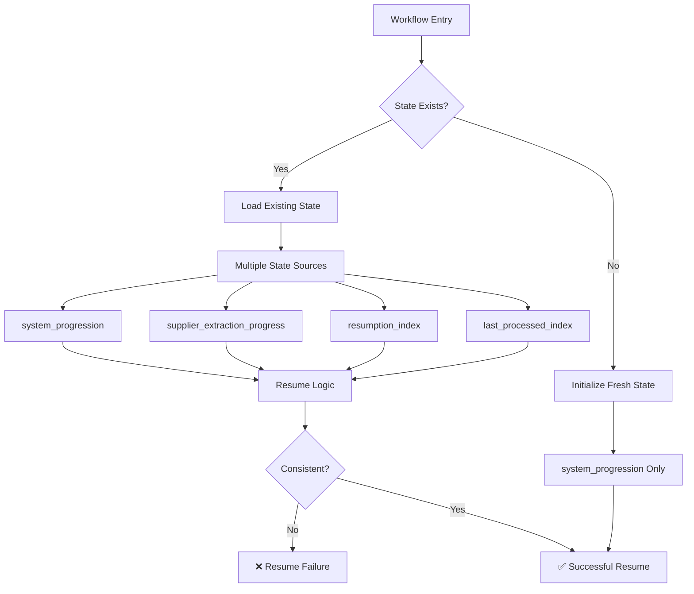

# State Management Consistency Audit & Remediation

## Overview

The Amazon FBA Agent System v3.7+ uses multiple state management approaches that have created inconsistencies in resumption logic. This quest focuses on auditing the current state management implementation, identifying inconsistencies, and implementing a unified approach using `system_progression` as the single source of truth.

## Current State Management Architecture

### State Management Components



### Current State Data Structures

#### system_progression (Target - Single Source of Truth)
```json
{
  "system_progression": {
    "current_phase": "supplier|amazon_analysis",
    "current_category_index": 0,
    "current_category_url": "https://...",
    "total_categories": 233,
    "current_product_index_in_category": 0,
    "total_products_in_current_category": 150,
    "supplier_extraction_resumption_index": 45,
    "amazon_analysis_resumption_index": 23,
    "last_updated": "2025-01-15T14:30:22Z"
  }
}
```

#### supplier_extraction_progress (Legacy - To Be Deprecated)
```json
{
  "supplier_extraction_progress": {
    "current_category_index": 0,
    "current_product_index_within_category": 45,
    "resumption_index": 45,
    "last_processed_index": 44
  }
}
```

## Critical Issues Identified

### Issue 1: Mixed Resumption Sources

**Problem**: Different parts of the system use different state sources for resumption.

**Locations**:
- `passive_extraction_workflow_latest.py:1891` - Uses `supplier_extraction_progress`
- `passive_extraction_workflow_latest.py:3741-3759` - Mixed usage
- `fixed_enhanced_state_manager.py:484-507` - Dual updates

**Impact**: 
- Inconsistent resume behavior
- Data corruption during interruptions
- Failed resumptions requiring manual intervention

### Issue 2: Dual State Updates

**Problem**: Both `system_progression` and legacy structures are updated simultaneously.

**Code Example** (Lines 484-507 in `fixed_enhanced_state_manager.py`):
```python
# PROBLEMATIC: Dual updates
def update_progression_unified(self, **kwargs):
    # Updates system_progression
    self.state_data.setdefault("system_progression", {}).update(kwargs)
    
    # ALSO updates legacy structure (WRONG)
    if "current_product_index_in_category" in kwargs:
        self.state_data.setdefault("supplier_extraction_progress", {})["current_product_index_within_category"] = kwargs["current_product_index_in_category"]
```

**Impact**:
- State drift between structures
- Unclear which source is authoritative
- Debugging complexity

### Issue 3: Detection-Based Resume Logic

**Problem**: Some resume logic uses heuristic detection instead of explicit state.

**Example**:
```python
# PROBLEMATIC: Detection-based logic
if len(processed_urls) > 0:
    # Assume we're resuming
    resume_index = len(processed_urls)
else:
    # Assume fresh start
    resume_index = 0
```

**Impact**:
- Unreliable resume detection
- Potential data loss
- Inconsistent behavior

## Quest Objectives

### Primary Goals

1. **State Source Unification**
   - Migrate all resumption logic to use `system_progression` exclusively
   - Deprecate legacy state structures
   - Ensure single source of truth

2. **Resume Point Validation**
   - Implement integrity checks before resumption
   - Add bounds validation for indices
   - Provide fallback mechanisms for corrupted state

3. **Deterministic Phase Management**
   - Replace detection-based logic with explicit phase tracking
   - Ensure consistent phase transitions
   - Validate phase consistency during resume

4. **State Persistence Reliability**
   - Implement atomic state saves
   - Add state backup and recovery
   - Ensure state consistency across interruptions

### Secondary Goals

1. **Enhanced Monitoring**
   - Add state consistency validation
   - Implement state change logging
   - Create state health dashboards

2. **Migration Strategy**
   - Provide backward compatibility during transition
   - Implement gradual migration from legacy structures
   - Ensure zero-downtime migration

## Technical Implementation Plan

### Phase 1: State Consistency Audit

#### State Consistency Validator

```python
class StateConsistencyValidator:
    def __init__(self, state_data: Dict):
        self.state_data = state_data
        self.validation_errors = []
        self.warnings = []
    
    def validate_system_progression(self) -> Dict[str, Any]:
        """Validate system_progression structure and data"""
        sp = self.state_data.get("system_progression", {})
        
        # Required fields validation
        required_fields = [
            "current_phase",
            "current_category_index", 
            "current_product_index_in_category",
            "total_categories"
        ]
        
        for field in required_fields:
            if field not in sp:
                self.validation_errors.append(f"Missing required field: system_progression.{field}")
        
        # Data type validation
        if "current_category_index" in sp and not isinstance(sp["current_category_index"], int):
            self.validation_errors.append("current_category_index must be integer")
        
        if "current_product_index_in_category" in sp and not isinstance(sp["current_product_index_in_category"], int):
            self.validation_errors.append("current_product_index_in_category must be integer")
        
        # Bounds validation
        if sp.get("current_category_index", 0) < 0:
            self.validation_errors.append("current_category_index cannot be negative")
        
        if sp.get("current_product_index_in_category", 0) < 0:
            self.validation_errors.append("current_product_index_in_category cannot be negative")
        
        # Phase validation
        valid_phases = ["supplier", "amazon_analysis"]
        if sp.get("current_phase") not in valid_phases:
            self.validation_errors.append(f"Invalid phase: {sp.get('current_phase')}")
        
        return {
            "valid": len(self.validation_errors) == 0,
            "errors": self.validation_errors,
            "warnings": self.warnings
        }
    
    def detect_state_conflicts(self) -> Dict[str, Any]:
        """Detect conflicts between system_progression and legacy structures"""
        sp = self.state_data.get("system_progression", {})
        sep = self.state_data.get("supplier_extraction_progress", {})
        
        conflicts = []
        
        # Check category index consistency
        sp_cat_idx = sp.get("current_category_index")
        sep_cat_idx = sep.get("current_category_index")
        
        if sp_cat_idx is not None and sep_cat_idx is not None and sp_cat_idx != sep_cat_idx:
            conflicts.append({
                "field": "category_index",
                "system_progression": sp_cat_idx,
                "supplier_extraction_progress": sep_cat_idx
            })
        
        # Check product index consistency
        sp_prod_idx = sp.get("current_product_index_in_category")
        sep_prod_idx = sep.get("current_product_index_within_category")
        
        if sp_prod_idx is not None and sep_prod_idx is not None and sp_prod_idx != sep_prod_idx:
            conflicts.append({
                "field": "product_index",
                "system_progression": sp_prod_idx,
                "supplier_extraction_progress": sep_prod_idx
            })
        
        return {
            "has_conflicts": len(conflicts) > 0,
            "conflicts": conflicts,
            "recommendation": "Use system_progression as authoritative source"
        }
    
    def generate_audit_report(self) -> Dict[str, Any]:
        """Generate comprehensive state audit report"""
        validation_result = self.validate_system_progression()
        conflict_result = self.detect_state_conflicts()
        
        return {
            "timestamp": datetime.now().isoformat(),
            "validation": validation_result,
            "conflicts": conflict_result,
            "state_structures_present": list(self.state_data.keys()),
            "recommendations": self._generate_recommendations(validation_result, conflict_result)
        }
    
    def _generate_recommendations(self, validation: Dict, conflicts: Dict) -> List[str]:
        """Generate actionable recommendations"""
        recommendations = []
        
        if not validation["valid"]:
            recommendations.append("Fix system_progression validation errors before resuming")
        
        if conflicts["has_conflicts"]:
            recommendations.append("Resolve state conflicts by using system_progression as single source")
        
        if "supplier_extraction_progress" in self.state_data:
            recommendations.append("Migrate from supplier_extraction_progress to system_progression")
        
        return recommendations
```

#### State Migration Tool

```python
class StateMigrationTool:
    def __init__(self, state_manager):
        self.state_manager = state_manager
        self.migration_log = []
    
    def migrate_legacy_to_system_progression(self) -> bool:
        """Migrate legacy state structures to system_progression"""
        state_data = self.state_manager.state_data
        
        # Check if migration needed
        if "system_progression" in state_data and self._is_system_progression_complete(state_data["system_progression"]):
            self.migration_log.append("system_progression already complete, no migration needed")
            return True
        
        # Initialize system_progression if missing
        if "system_progression" not in state_data:
            state_data["system_progression"] = {}
        
        sp = state_data["system_progression"]
        
        # Migrate from supplier_extraction_progress
        if "supplier_extraction_progress" in state_data:
            sep = state_data["supplier_extraction_progress"]
            
            # Migrate category index
            if "current_category_index" in sep and "current_category_index" not in sp:
                sp["current_category_index"] = sep["current_category_index"]
                self.migration_log.append("Migrated current_category_index from supplier_extraction_progress")
            
            # Migrate product index
            if "current_product_index_within_category" in sep and "current_product_index_in_category" not in sp:
                sp["current_product_index_in_category"] = sep["current_product_index_within_category"]
                self.migration_log.append("Migrated product index from supplier_extraction_progress")
            
            # Set default phase if missing
            if "current_phase" not in sp:
                sp["current_phase"] = "supplier"
                self.migration_log.append("Set default phase to 'supplier'")
        
        # Set defaults for missing required fields
        if "current_category_index" not in sp:
            sp["current_category_index"] = 0
            self.migration_log.append("Set default current_category_index to 0")
        
        if "current_product_index_in_category" not in sp:
            sp["current_product_index_in_category"] = 0
            self.migration_log.append("Set default current_product_index_in_category to 0")
        
        if "current_phase" not in sp:
            sp["current_phase"] = "supplier"
            self.migration_log.append("Set default current_phase to 'supplier'")
        
        # Save migrated state
        self.state_manager.save_state(preserve_interruption_state=True)
        self.migration_log.append("Saved migrated state")
        
        return True
    
    def _is_system_progression_complete(self, sp: Dict) -> bool:
        """Check if system_progression has all required fields"""
        required_fields = [
            "current_phase",
            "current_category_index",
            "current_product_index_in_category"
        ]
        
        return all(field in sp for field in required_fields)
    
    def cleanup_legacy_structures(self) -> bool:
        """Remove legacy state structures after successful migration"""
        state_data = self.state_manager.state_data
        
        # Only cleanup if system_progression is complete
        if not self._is_system_progression_complete(state_data.get("system_progression", {})):
            self.migration_log.append("Cannot cleanup: system_progression incomplete")
            return False
        
        # Remove legacy structures
        legacy_keys = ["supplier_extraction_progress", "resumption_index", "last_processed_index"]
        
        for key in legacy_keys:
            if key in state_data:
                del state_data[key]
                self.migration_log.append(f"Removed legacy structure: {key}")
        
        # Save cleaned state
        self.state_manager.save_state(preserve_interruption_state=True)
        self.migration_log.append("Saved cleaned state")
        
        return True
```

### Phase 2: Unified Resume Logic

#### Canonical Resume Point Provider

```python
class CanonicalResumeProvider:
    def __init__(self, state_manager):
        self.state_manager = state_manager
        self.validator = StateConsistencyValidator(state_manager.state_data)
    
    def get_resume_point(self) -> Dict[str, Any]:
        """Get canonical resume point from system_progression"""
        # Validate state first
        validation_result = self.validator.validate_system_progression()
        if not validation_result["valid"]:
            raise ValueError(f"Invalid state: {validation_result['errors']}")
        
        sp = self.state_manager.state_data.get("system_progression", {})
        
        # Get phase-specific resume index
        current_phase = sp.get("current_phase", "supplier")
        current_product_index = sp.get("current_product_index_in_category", 0)
        
        if current_phase == "supplier":
            resume_index = sp.get("supplier_extraction_resumption_index", current_product_index)
        elif current_phase == "amazon_analysis":
            resume_index = sp.get("amazon_analysis_resumption_index", current_product_index)
        else:
            resume_index = current_product_index
        
        return {
            "phase": current_phase,
            "category_index": sp.get("current_category_index", 0),
            "category_url": sp.get("current_category_url", ""),
            "product_index": resume_index,
            "total_categories": sp.get("total_categories", 0),
            "total_products_in_category": sp.get("total_products_in_current_category", 0)
        }
    
    def validate_resume_point(self, resume_point: Dict[str, Any]) -> Tuple[bool, List[str]]:
        """Validate resume point integrity"""
        errors = []
        
        # Bounds validation
        if resume_point["category_index"] < 0:
            errors.append("category_index cannot be negative")
        
        if resume_point["product_index"] < 0:
            errors.append("product_index cannot be negative")
        
        if resume_point["total_categories"] > 0 and resume_point["category_index"] >= resume_point["total_categories"]:
            errors.append("category_index exceeds total_categories")
        
        if resume_point["total_products_in_category"] > 0 and resume_point["product_index"] > resume_point["total_products_in_category"]:
            errors.append("product_index exceeds total_products_in_category")
        
        # Phase validation
        valid_phases = ["supplier", "amazon_analysis"]
        if resume_point["phase"] not in valid_phases:
            errors.append(f"Invalid phase: {resume_point['phase']}")
        
        return len(errors) == 0, errors
    
    def get_safe_resume_point(self) -> Dict[str, Any]:
        """Get resume point with fallback to safe defaults"""
        try:
            resume_point = self.get_resume_point()
            is_valid, errors = self.validate_resume_point(resume_point)
            
            if is_valid:
                return resume_point
            else:
                # Log validation errors
                for error in errors:
                    logging.error(f"Resume validation error: {error}")
                
                # Return safe defaults
                return self._get_safe_defaults()
        
        except Exception as e:
            logging.error(f"Failed to get resume point: {e}")
            return self._get_safe_defaults()
    
    def _get_safe_defaults(self) -> Dict[str, Any]:
        """Get safe default resume point"""
        return {
            "phase": "supplier",
            "category_index": 0,
            "category_url": "",
            "product_index": 0,
            "total_categories": 0,
            "total_products_in_category": 0
        }
```

#### Unified State Update Manager

```python
class UnifiedStateUpdateManager:
    def __init__(self, state_manager):
        self.state_manager = state_manager
    
    def update_category_progress(self, category_index: int, category_url: str, 
                               total_products: int = None):
        """Update category-level progress in system_progression only"""
        sp = self.state_manager.state_data.setdefault("system_progression", {})
        
        sp["current_category_index"] = category_index
        sp["current_category_url"] = category_url
        sp["current_product_index_in_category"] = 0  # Reset product index for new category
        
        if total_products is not None:
            sp["total_products_in_current_category"] = total_products
        
        sp["last_updated"] = datetime.now().isoformat()
        
        # Save state atomically
        self.state_manager.save_state(preserve_interruption_state=True)
        
        logging.info(f"📊 Category progress updated: C{category_index} ({total_products} products)")
    
    def update_product_progress(self, product_index: int, phase: str = None):
        """Update product-level progress in system_progression only"""
        sp = self.state_manager.state_data.setdefault("system_progression", {})
        
        sp["current_product_index_in_category"] = product_index
        
        if phase:
            sp["current_phase"] = phase
            
            # Update phase-specific resumption index
            if phase == "supplier":
                sp["supplier_extraction_resumption_index"] = product_index
            elif phase == "amazon_analysis":
                sp["amazon_analysis_resumption_index"] = product_index
        
        sp["last_updated"] = datetime.now().isoformat()
        
        # Save state atomically
        self.state_manager.save_state(preserve_interruption_state=True)
        
        logging.debug(f"📊 Product progress updated: P{product_index} (phase: {phase})")
    
    def transition_phase(self, new_phase: str, reset_product_index: bool = True):
        """Transition between processing phases"""
        sp = self.state_manager.state_data.setdefault("system_progression", {})
        
        old_phase = sp.get("current_phase", "unknown")
        sp["current_phase"] = new_phase
        
        if reset_product_index:
            sp["current_product_index_in_category"] = 0
        
        sp["last_updated"] = datetime.now().isoformat()
        
        # Save state atomically
        self.state_manager.save_state(preserve_interruption_state=True)
        
        logging.info(f"📊 Phase transition: {old_phase} → {new_phase}")
    
    def complete_category(self, category_index: int):
        """Mark category as complete and prepare for next"""
        sp = self.state_manager.state_data.setdefault("system_progression", {})
        
        # Move to next category
        next_category_index = category_index + 1
        sp["current_category_index"] = next_category_index
        sp["current_product_index_in_category"] = 0
        sp["current_phase"] = "supplier"  # Reset to supplier phase for next category
        
        # Clear category-specific data
        sp.pop("current_category_url", None)
        sp.pop("total_products_in_current_category", None)
        
        sp["last_updated"] = datetime.now().isoformat()
        
        # Save state atomically
        self.state_manager.save_state(preserve_interruption_state=True)
        
        logging.info(f"📊 Category C{category_index} completed, moving to C{next_category_index}")
```

### Phase 3: Integration with Main Workflow

#### Updated Resume Logic in Main Workflow

```python
def _get_canonical_resume_point(self):
    """Get resume point using unified state management"""
    resume_provider = CanonicalResumeProvider(self.state_manager)
    
    # Get safe resume point (with validation and fallbacks)
    resume_point = resume_provider.get_safe_resume_point()
    
    # Log resume information
    self.log.info(f"📊 RESUME POINT: phase={resume_point['phase']} "
                  f"cat={resume_point['category_index']}/{resume_point['total_categories']} "
                  f"prod={resume_point['product_index']}/{resume_point['total_products_in_category']}")
    
    return resume_point

def _update_progress_unified(self, **kwargs):
    """Update progress using unified state manager"""
    update_manager = UnifiedStateUpdateManager(self.state_manager)
    
    if "category_index" in kwargs:
        update_manager.update_category_progress(
            kwargs["category_index"],
            kwargs.get("category_url", ""),
            kwargs.get("total_products", None)
        )
    
    if "product_index" in kwargs:
        update_manager.update_product_progress(
            kwargs["product_index"],
            kwargs.get("phase", None)
        )
    
    if "new_phase" in kwargs:
        update_manager.transition_phase(
            kwargs["new_phase"],
            kwargs.get("reset_product_index", True)
        )
```

## Testing Strategy

### State Consistency Tests

```python
def test_state_validation():
    """Test state validation logic"""
    # Test valid system_progression
    # Test invalid system_progression
    # Test missing required fields
    # Test bounds validation

def test_state_migration():
    """Test migration from legacy structures"""
    # Test migration from supplier_extraction_progress
    # Test handling of missing legacy data
    # Test cleanup of legacy structures

def test_resume_point_validation():
    """Test resume point integrity"""
    # Test valid resume points
    # Test invalid resume points
    # Test fallback mechanisms
```

### Integration Tests

```python
def test_unified_resume_logic():
    """Test unified resume logic in main workflow"""
    # Test resume from various states
    # Test phase transitions
    # Test category completion

def test_state_persistence():
    """Test state persistence across interruptions"""
    # Test atomic state saves
    # Test state recovery after crashes
    # Test state consistency
```

## Success Criteria

### Primary Objectives

- [ ] All resumption logic uses `system_progression` exclusively
- [ ] Legacy state structures deprecated and removed
- [ ] Resume point validation prevents corrupted state resumption
- [ ] Deterministic phase management eliminates detection-based logic
- [ ] Atomic state persistence ensures consistency

### Quality Metrics

- [ ] Zero resume failures due to state inconsistency
- [ ] 100% state validation coverage
- [ ] Successful migration from all legacy structures
- [ ] Consistent behavior across interruption scenarios
- [ ] Enhanced monitoring provides state health visibility

### System Integration

- [ ] Seamless integration with existing workflow
- [ ] Backward compatibility during migration period
- [ ] Zero data loss during state migration
- [ ] Performance impact <5% overhead
- [ ] Enhanced debugging capabilities for state issues

This quest provides a comprehensive framework for auditing and fixing state management inconsistencies in the Amazon FBA Agent System, ensuring reliable resumption and consistent behavior across all processing scenarios.