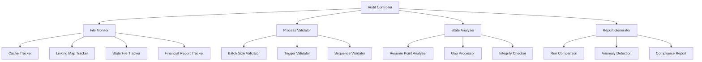
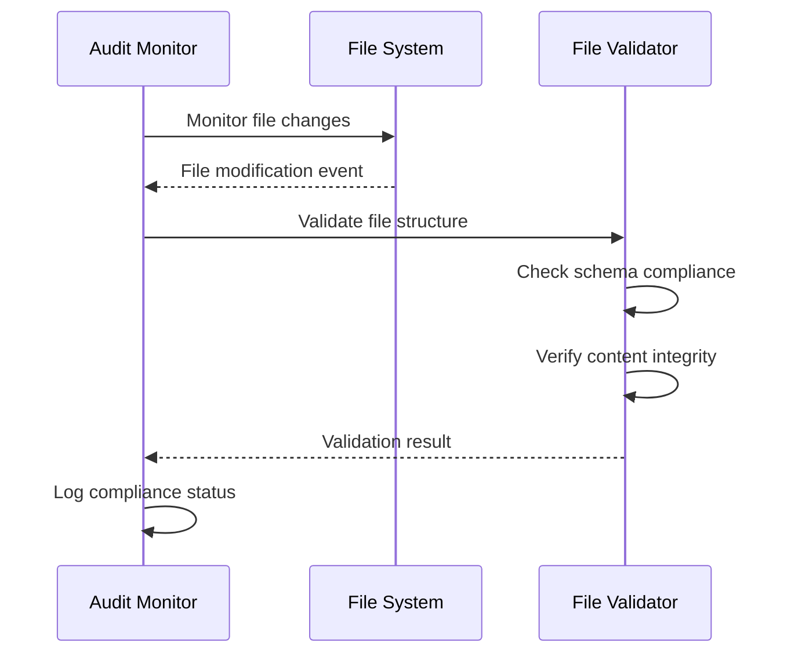
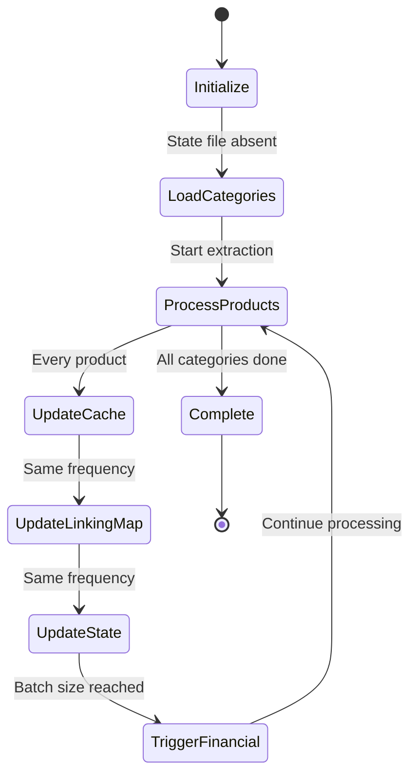
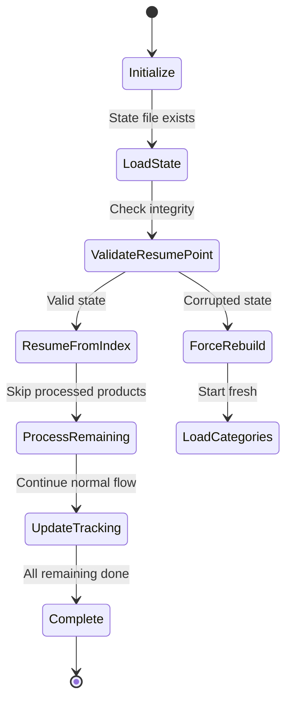
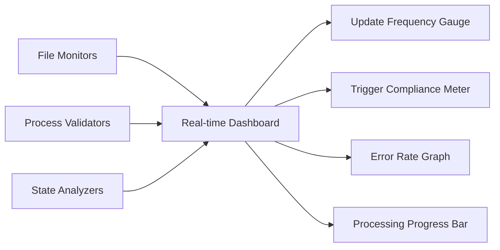

# System Audit Monitor Design

## Overview

The System Audit Monitor is a comprehensive validation and analysis framework designed to monitor, validate, and analyze the operation of the Amazon FBA Agent System across multiple execution runs. The monitor functions as an autonomous auditing agent that methodically tracks file updates, output sequences, intermediate states, and process compliance to ensure system reliability and data integrity.

## Architecture

### Core Components



### Monitoring Scope

The audit monitor tracks the following critical system components:

1. **Product Cache Files** - Frequency and content validation
2. **Linking Map Files** - Entry tracking and update sequences  
3. **Processing State Files** - State transitions and resumption logic
4. **Financial Reports** - Trigger validation and content analysis
5. **System Logs** - Error detection and process flow verification

## File Monitoring System

### File Update Frequency Validation

| File Type | Expected Frequency | Configuration Source | Validation Method |
|-----------|-------------------|---------------------|------------------|
| Product Cache | Every 1 product | `supplier_cache_control.update_frequency_products: 1` | Timestamp diff analysis |
| Linking Map | Every 1 product | `system.linking_map_batch_size: 1` | Entry count tracking |
| Processing State | Every 1 product | `supplier_extraction_progress.batch_save_frequency: 1` | State change monitoring |
| Financial Report | Every 50 products | `system.financial_report_batch_size: 50` | Trigger point validation |

### File Structure Monitoring



## Process Validation Framework

### Batch Trigger Validation

The monitor validates that financial reports are triggered at exact intervals:

```python
# Expected trigger points for financial_report_batch_size: 50
trigger_points = [50, 100, 150, 200, 250, ...]

# Validation logic
def validate_financial_trigger(linking_map_count: int, batch_size: int) -> bool:
    return linking_map_count > 0 and linking_map_count % batch_size == 0
```

### Output Content Validation

| Output Type | Required Columns | Content Validation |
|-------------|------------------|-------------------|
| Product Cache | `url`, `title`, `price`, `ean`, `supplier_category` | Non-null validation, data type checking |
| Linking Map | `supplier_ean`, `amazon_asin`, `supplier_price`, `amazon_price` | EAN format, ASIN format, price validation |
| Financial Report | `roi_percent`, `net_profit`, `breakeven_price`, `fba_fees` | Calculation validation, threshold checking |
| Processing State | `current_category_index`, `resumption_index`, `system_progression` | Index bounds, state consistency |

## State Transition Monitoring

### First Run Analysis (Fresh Processing)



### Second Run Analysis (Resume Processing)



## Audit Procedures

### Pre-Run Setup

1. **Environment Validation**
   - Verify configuration file integrity
   - Check batch size settings alignment
   - Validate output directory structure
   - Clear previous audit logs

2. **Baseline Establishment**
   - Record initial file states
   - Document expected trigger points
   - Set monitoring thresholds
   - Initialize tracking counters

### During-Run Monitoring

1. **Real-time File Tracking**
   ```bash
   # Monitor file changes in real-time
   tail -f logs/debug/run_custom_poundwholesale_*.txt | grep -E "CACHE|LINKING|STATE|FINANCIAL"
   ```

2. **Batch Trigger Verification**
   - Track linking map entry count
   - Validate financial report generation at expected intervals
   - Monitor state file updates

3. **Content Validation**
   - Verify file schemas on each update
   - Check data integrity and consistency
   - Validate calculation accuracy

### Post-Run Analysis

1. **Compliance Summary**
   - File update frequency compliance
   - Trigger point accuracy
   - Content validation results
   - Error and anomaly count

2. **State Integrity Check**
   - Processing state consistency
   - Resume point validation
   - Gap processing verification

## Critical Validation Points

### Financial Report Trigger Validation

```python
class FinancialTriggerValidator:
    def __init__(self, batch_size: int = 50):
        self.batch_size = batch_size
        self.expected_triggers = []
        self.actual_triggers = []
    
    def validate_trigger(self, linking_map_count: int, triggered: bool):
        expected = linking_map_count % self.batch_size == 0
        if expected != triggered:
            self.log_anomaly(f"Trigger mismatch at count {linking_map_count}")
        
    def generate_report(self):
        return {
            "expected_triggers": len(self.expected_triggers),
            "actual_triggers": len(self.actual_triggers),
            "missed_triggers": self.find_missed_triggers(),
            "false_triggers": self.find_false_triggers()
        }
```

### Cache Update Frequency Monitoring

```python
class CacheFrequencyMonitor:
    def __init__(self):
        self.last_update_time = None
        self.update_intervals = []
        self.expected_frequency = 1  # Every 1 product
    
    def record_update(self, product_count: int, timestamp: float):
        if self.last_update_time:
            interval = timestamp - self.last_update_time
            self.update_intervals.append(interval)
            
        self.validate_frequency(product_count)
        self.last_update_time = timestamp
    
    def validate_frequency(self, product_count: int):
        if product_count % self.expected_frequency != 0:
            self.log_anomaly(f"Unexpected cache update at product {product_count}")
```

## Resumption Logic Validation

### State Persistence Verification

The monitor validates that processing state is correctly maintained across interruptions:

1. **Pre-Interruption State Capture**
   - Record current processing indices
   - Document processed product URLs
   - Capture system progression state

2. **Post-Resumption Validation**
   - Verify resumption index accuracy
   - Check for duplicate processing
   - Validate gap processing logic

### Resume Point Integrity

```python
class ResumePointValidator:
    def validate_resume_integrity(self, state_data: dict):
        validation_results = {
            "bounds_check": self.validate_index_bounds(state_data),
            "progression_consistency": self.validate_progression(state_data),
            "gap_handling": self.validate_gap_processing(state_data),
            "category_completion": self.validate_category_status(state_data)
        }
        return validation_results
    
    def validate_index_bounds(self, state_data: dict):
        resumption_index = state_data.get("resumption_index", 0)
        linking_map_count = self.get_linking_map_count()
        return 0 <= resumption_index <= linking_map_count
```

## Error Detection and Alerting

### Critical Error Patterns

| Error Type | Detection Pattern | Alert Level | Action Required |
|------------|------------------|-------------|-----------------|
| File Corruption | Schema validation failure | CRITICAL | Stop processing, manual review |
| Missed Triggers | Batch count without trigger | HIGH | Investigate trigger logic |
| Duplicate Processing | Same product processed twice | MEDIUM | Check resumption logic |
| State Inconsistency | Index out of bounds | HIGH | Validate state integrity |

### Anomaly Detection

```python
class AnomalyDetector:
    def __init__(self):
        self.anomalies = []
        self.thresholds = {
            "update_frequency_variance": 0.1,
            "trigger_timing_tolerance": 1,
            "state_consistency_score": 0.95
        }
    
    def detect_update_frequency_anomaly(self, intervals: list):
        variance = self.calculate_variance(intervals)
        if variance > self.thresholds["update_frequency_variance"]:
            self.record_anomaly("UPDATE_FREQUENCY", variance)
    
    def detect_trigger_timing_anomaly(self, expected: int, actual: int):
        if abs(expected - actual) > self.thresholds["trigger_timing_tolerance"]:
            self.record_anomaly("TRIGGER_TIMING", abs(expected - actual))
```

## Testing Scenarios

### Two-Run Test Protocol

#### Run 1: Fresh Processing
1. **Setup**: Delete existing processing state files
2. **Execute**: Run complete workflow from beginning
3. **Monitor**: 
   - File update sequences
   - Trigger point accuracy
   - Content validation
   - Performance metrics

#### Run 2: Resume Processing
1. **Setup**: Preserve processing state from Run 1
2. **Execute**: Resume workflow from last checkpoint
3. **Monitor**:
   - Resume point accuracy
   - Duplicate processing detection
   - Gap processing validation
   - State consistency

### Validation Checklist

- [ ] Cache files update every 1 product
- [ ] Linking map entries increment correctly
- [ ] Financial reports trigger every 50 products
- [ ] Processing state saves atomically
- [ ] Resume logic skips processed products
- [ ] No duplicate product processing
- [ ] All expected columns present in outputs
- [ ] Calculation accuracy within tolerance
- [ ] Error handling graceful
- [ ] Performance within acceptable limits

## Reporting Framework

### Real-time Dashboard



### Comprehensive Audit Report

```json
{
  "audit_summary": {
    "run_id": "audit_20250115_143022",
    "execution_time": "2025-01-15T14:30:22Z",
    "total_products_processed": 1247,
    "audit_duration_seconds": 3847
  },
  "compliance_metrics": {
    "cache_update_frequency": {
      "expected": 1,
      "actual_average": 1.0,
      "compliance_rate": 100.0,
      "anomalies": []
    },
    "financial_report_triggers": {
      "expected_triggers": 24,
      "actual_triggers": 24,
      "compliance_rate": 100.0,
      "missed_triggers": [],
      "false_triggers": []
    }
  },
  "file_validation": {
    "cache_files": {
      "total_updates": 1247,
      "schema_violations": 0,
      "content_errors": 0
    },
    "linking_map": {
      "total_entries": 1247,
      "invalid_entries": 0,
      "duplicate_entries": 0
    }
  },
  "resumption_validation": {
    "state_integrity_score": 1.0,
    "resume_point_accuracy": true,
    "gap_processing_correct": true
  },
  "anomalies": [],
  "recommendations": [
    "System operating within all specified parameters",
    "No critical issues detected",
    "Continue with current configuration"
  ]
}
```

## Implementation Monitoring

### System Resource Tracking

Monitor system resources during audit execution:

- **CPU Usage**: Track processing overhead
- **Memory Consumption**: Monitor audit memory footprint  
- **Disk I/O**: Measure file monitoring impact
- **Network Usage**: Track any external validation calls

### Performance Impact Assessment

Ensure audit monitoring does not significantly impact system performance:

- Maximum 5% CPU overhead
- Maximum 100MB additional memory usage
- Minimal disk I/O interference
- No network bottlenecks

The System Audit Monitor provides comprehensive validation and analysis capabilities to ensure the Amazon FBA Agent System operates reliably across multiple execution scenarios while maintaining data integrity and process compliance.