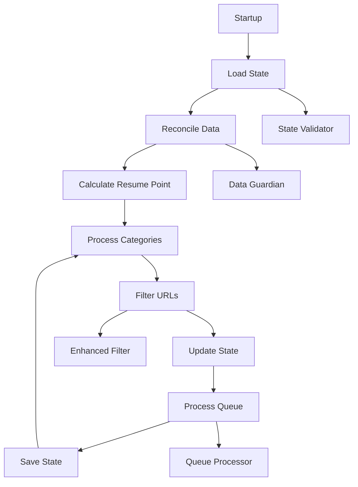

# Design Document

## Overview

This design addresses the critical systemic failures in the FBA Data Extraction System by implementing a comprehensive state management overhaul, filter-workflow synchronization, and robust resume functionality. The solution focuses on eliminating state drift, ensuring data consistency, and providing reliable interruption recovery.

## Architecture

### Core Components

1. **Unified State Manager** - Centralized state tracking with consistency guarantees
2. **Enhanced URL Filter** - Synchronized filtering with state reconciliation
3. **Resume Controller** - Intelligent resume point calculation and validation
4. **Data Integrity Guardian** - Automatic inconsistency detection and repair
5. **Queue Processor** - Accurate processing with separate phases

### Component Interactions



## Components and Interfaces

### 1. Unified State Manager

**Purpose:** Eliminate state drift by providing a single source of truth for all progress tracking with deterministic accumulator resets.

**Interface:**
```python
class UnifiedStateManager:
    def update_progression(self, **kwargs) -> None
    def get_resume_point(self) -> Dict[str, Any]
    def validate_state(self) -> Tuple[bool, List[str]]
    def save_state_atomic(self) -> bool
    def load_state_with_validation(self) -> bool
    def reset_category_accumulators(self, category_index: int) -> None
    def log_breadcrumb_guarded(self) -> None
```

**Key Methods:**

- `update_progression()`: Updates both `system_progression` and `supplier_extraction_progress` atomically
- `get_resume_point()`: Calculates accurate resume point with validation
- `validate_state()`: Checks for regression and inconsistencies
- `save_state_atomic()`: Atomic save with backup rotation
- `reset_category_accumulators()`: Deterministic reset of per-category state on completion/resume
- `log_breadcrumb_guarded()`: Only logs breadcrumbs when all required fields are populated

### 2. Enhanced URL Filter with Invariant Enforcement

**Purpose:** Provide consistent filtering with mandatory invariant validation and denominator calculation.

**Interface:**
```python
def filter_urls_enhanced(
    product_urls: List[str],
    linking_map: List[Dict[str, Any]],
    cached_products: List[Dict[str, Any]],
    processed_urls_set: Set[str],
    category_id: str
) -> Dict[str, List[str]]
```

**Logic Flow:**
1. Check linking map (skip entirely)
2. Check supplier cache (needs Amazon only)
3. Check processed products state
4. Reconcile inconsistencies
5. **MANDATORY: Validate invariant skip + needs_amazon + needs_full == total_input**
6. **Calculate denominator: discovered_urls - linking_map_hits**
7. **Log invariant status with category ID**
8. **Gate queue construction on passing invariant**
9. Return classified URLs with denominator

**Invariant Enforcement:**
```python
def validate_filter_invariant(result: Dict) -> bool:
    total_classified = len(result['skip_entirely']) + len(result['needs_amazon_only']) + len(result['needs_full_extraction'])
    invariant_passed = total_classified == result['total_input']
    
    if not invariant_passed:
        log.error(f"INVARIANT FAILURE: {total_classified} != {result['total_input']}")
        # Snapshot offending URLs for debugging
        snapshot_filter_failure(result)
        # Enter repair mode or halt
        return False
    return True
```

### 3. Resume Controller

**Purpose:** Intelligent resume point calculation with validation and error recovery.

**Interface:**
```python
class ResumeController:
    def calculate_resume_point(self, total_categories: int) -> Dict[str, Any]
    def validate_resume_point(self, resume_point: Dict) -> bool
    def get_safe_fallback_point(self) -> Dict[str, Any]
```

**Resume Logic:**
1. Load system_progression data
2. Validate indices against current totals
3. Check for logical consistency
4. Provide safe fallback if validation fails

### 4. Data Integrity Guardian with Sequenced Startup

**Purpose:** Automatic detection and repair of data inconsistencies with mandatory pre-resume reconciliation.

**Interface:**
```python
class DataIntegrityGuardian:
    def reconcile_on_startup_prereq(self) -> Tuple[bool, List[str]]
    def hydrate_linking_map_entry(self, url: str) -> bool
    def validate_data_consistency(self) -> List[str]
    def repair_inconsistencies(self, issues: List[str]) -> int
    def persist_reconciled_state_atomic(self) -> bool
```

**MANDATORY Startup Reconciliation Sequence:**
1. **BEFORE resume-point calculation**
2. **BEFORE any filtering operations**
3. Compare processed_products vs linking_map
4. Identify missing linking map entries
5. Attempt hydration from supplier cache
6. Mark unhydratable items for needs_amazon
7. **Persist reconciled state atomically**
8. **ONLY THEN proceed to resume point calculation**

**Reconciliation Logic:**
```python
def reconcile_on_startup_prereq(self) -> Tuple[bool, List[str]]:
    """MUST be called before resume calculation and filtering."""
    processed_urls = set(self.state_data.get("processed_products", {}).keys())
    linking_map_urls = {normalize_url(entry.get("supplier_url")) for entry in self.linking_map}
    
    missing_entries = processed_urls - linking_map_urls
    reconciled_items = []
    
    for url in missing_entries:
        if self.hydrate_linking_map_entry(url):
            reconciled_items.append(f"hydrated:{url}")
        else:
            # Mark for Amazon analysis
            self.mark_for_amazon_analysis(url)
            reconciled_items.append(f"marked_amazon:{url}")
    
    # Atomic persistence before proceeding
    success = self.persist_reconciled_state_atomic()
    return success, reconciled_items
```

### 5. Queue Processor with Denominator Formula

**Purpose:** Accurate queue processing with formal denominator calculation and accumulator resets.

**Interface:**
```python
class QueueProcessor:
    def process_supplier_phase(self, urls: List[str]) -> int
    def process_amazon_phase(self, urls: List[str]) -> int
    def update_phase_progress(self, phase: str, index: int, total: int) -> None
    def calculate_category_denominator(self, filter_result: Dict) -> int
    def reset_category_state_on_entry(self, category_index: int) -> None
    def reset_category_state_on_completion(self, category_index: int) -> None
```

**Formal Denominator Specification:**
```python
def calculate_category_denominator(self, filter_result: Dict) -> int:
    """
    Denominator = discovered_urls - linking_map_hits
    This represents the actual work items for the current category.
    """
    discovered_urls = filter_result['total_input']
    linking_map_hits = len(filter_result['skip_entirely'])
    denominator = discovered_urls - linking_map_hits
    
    # Log with category ID for traceability
    log.info(f"DENOMINATOR[{self.current_category_id}]: {denominator} = {discovered_urls} - {linking_map_hits}")
    
    return denominator
```

**Deterministic Accumulator Reset:**
```python
def reset_category_state_on_entry(self, category_index: int) -> None:
    """Reset all per-category state before processing."""
    self.current_manifest = None
    self.current_filtered_queues = {'skip_entirely': [], 'needs_amazon_only': [], 'needs_full_extraction': []}
    self.category_counters = {'processed': 0, 'total': 0, 'errors': 0}
    self.in_memory_trackers = {}
    log.info(f"🔄 RESET: Category {category_index} accumulators cleared")

def reset_category_state_on_completion(self, category_index: int) -> None:
    """Reset all per-category state after completion."""
    self.reset_category_state_on_entry(category_index + 1)
    log.info(f"✅ RESET: Category {category_index} completed, accumulators cleared")
```

## Data Models

### Enhanced State Structure

```python
{
    "schema_version": "2.0_UNIFIED",
    "created_at": "ISO timestamp",
    "last_updated": "ISO timestamp",
    
    # Unified progression tracking
    "system_progression": {
        "current_category_index": int,
        "total_categories": int,
        "current_product_index_in_category": int,
        "total_products_in_current_category": int,
        "current_phase": "supplier|amazon|complete",
        "current_category_url": str,
        "phase_start_time": "ISO timestamp"
    },
    
    # Legacy compatibility (kept in sync)
    "supplier_extraction_progress": {
        "current_category_index": int,
        "last_processed_index": int,
        "progress_index": int
    },
    
    # Protected global counters
    "global_counters": {
        "total_products_discovered": int,
        "total_products_processed": int,
        "total_categories_completed": int
    },
    
    # Data integrity tracking
    "integrity_status": {
        "last_reconciliation": "ISO timestamp",
        "items_reconciled": int,
        "consistency_score": float
    }
}
```

### Filter Result Structure with Denominator

```python
{
    "skip_entirely": List[str],
    "needs_amazon_only": List[str], 
    "needs_full_extraction": List[str],
    "reconciled_items": List[str],  # Items moved during reconciliation
    "total_input": int,
    "invariant_check": bool,  # skip + needs_amazon + needs_full == total_input
    "denominator": int,  # discovered_urls - linking_map_hits (formal specification)
    "category_id": str,  # For traceability in logs
    "linking_map_hits": int,  # Number of URLs found in linking map
    "invariant_details": {  # Detailed breakdown for debugging
        "skip_count": int,
        "amazon_count": int, 
        "full_count": int,
        "total_classified": int,
        "invariant_passed": bool
    }
}
```

### Guarded Breadcrumb Logging Structure

```python
def log_breadcrumb_guarded(self) -> None:
    """Only log breadcrumbs when all required fields are populated."""
    sp = self.state_data.get("system_progression", {})
    
    required_fields = [
        "current_category_index",
        "total_categories", 
        "current_product_index_in_category",
        "total_products_in_current_category",
        "current_phase"
    ]
    
    missing_fields = [field for field in required_fields if not sp.get(field)]
    
    if missing_fields:
        log.warning(f"🚨 BREADCRUMB DELAYED: Missing fields {missing_fields}")
        return
    
    # All fields present and valid
    if sp["total_categories"] > 0 and sp["total_products_in_current_category"] > 0:
        log.info(
            f"RESUME PTR: phase={sp['current_phase']} "
            f"cat_idx={sp['current_category_index']}/{sp['total_categories']} "
            f"url={sp.get('current_category_url', '')} "
            f"prod_idx={sp['current_product_index_in_category']}/{sp['total_products_in_current_category']}"
        )
    else:
        log.warning(f"🚨 BREADCRUMB INVALID: Zero denominators detected")
```

## Error Handling

### State Regression Protection

```python
class StateRegressionError(Exception):
    """Raised when state would regress without explicit permission."""
    pass

def validate_state_progression(old_state, new_state):
    if new_state.resumption_index < old_state.resumption_index:
        if not os.getenv('ALLOW_STATE_REGRESSION'):
            raise StateRegressionError(
                f"Resumption index would regress: {new_state.resumption_index} < {old_state.resumption_index}"
            )
```

### Data Inconsistency Recovery

```python
class DataInconsistencyWarning(Warning):
    """Warning for non-critical data inconsistencies."""
    pass

def handle_inconsistency(issue_type, details):
    if issue_type == "missing_linking_entry":
        # Attempt automatic repair
        if repair_linking_entry(details):
            log.warning(f"Repaired missing linking entry: {details}")
        else:
            log.error(f"Failed to repair linking entry: {details}")
    elif issue_type == "queue_count_mismatch":
        # Log and continue with best effort
        log.warning(f"Queue count mismatch detected: {details}")
```

## Testing Strategy

### Unit Tests

1. **State Manager Tests**
   - Test unified progression updates
   - Test regression protection
   - Test atomic save operations

2. **Filter Tests**
   - Test reconciliation logic
   - Test invariant validation
   - Test edge cases (empty inputs, all skipped, etc.)

3. **Resume Controller Tests**
   - Test resume point calculation
   - Test validation logic
   - Test fallback mechanisms

### Integration Tests

1. **End-to-End Resume Test**
   - Process categories 1-3
   - Interrupt during category 2
   - Resume and verify continuation

2. **Data Consistency Test**
   - Create inconsistent state
   - Run reconciliation
   - Verify repairs

3. **Queue Processing Test**
   - Mixed category (skip/amazon/full)
   - Verify accurate counts
   - Verify separate phase processing

### Performance Tests

1. **Large State File Loading**
   - Test with 10k+ processed products
   - Measure load time and memory usage

2. **Reconciliation Performance**
   - Test with 1k+ inconsistent items
   - Measure repair time

## Implementation Plan with Sequencing Requirements

### Phase 1: Core Infrastructure with Sequencing (Week 1)

1. **FIRST: Implement DataIntegrityGuardian with mandatory startup sequence**
   - Must run BEFORE resume calculation
   - Must run BEFORE any filtering
   - Atomic state persistence after reconciliation

2. **SECOND: Implement UnifiedStateManager with accumulator resets**
   - Deterministic per-category accumulator reset
   - Guarded breadcrumb logging
   - State regression protection

3. **THIRD: Create enhanced URL filter with invariant enforcement**
   - Mandatory invariant validation
   - Formal denominator calculation
   - Gate queue construction on invariant pass

### Phase 2: Resume Functionality with Prerequisites (Week 2)

1. **Implement ResumeController (depends on Phase 1 completion)**
   - Resume point calculation AFTER reconciliation
   - Validation against reconciled state
   - Safe fallback mechanisms

2. **Add startup sequence orchestration**
   - Reconcile → Resume → Filter → Process
   - Atomic state saves between phases
   - Comprehensive sequence logging

### Phase 3: Queue Processing with Formal Specifications (Week 3)

1. **Implement QueueProcessor with denominator formula**
   - discovered_urls - linking_map_hits calculation
   - Separate phase processing with accurate counts
   - Per-category state resets on entry/completion

2. **Add invariant enforcement throughout pipeline**
   - Filter invariant validation
   - Queue count verification
   - Progress tracking accuracy

### Phase 4: Error Handling and Recovery (Week 4)

1. **Implement comprehensive error recovery**
   - Invariant failure handling
   - State corruption detection
   - Automatic repair mechanisms

2. **Add diagnostic capabilities**
   - Filter failure snapshots
   - State inconsistency logging
   - Recovery procedure documentation

### Phase 5: Testing with Sequence Validation (Week 5)

1. **Test startup sequence integrity**
   - Reconcile → Resume → Filter order
   - Atomic state transitions
   - Sequence failure recovery

2. **Test invariant enforcement**
   - Filter invariant validation
   - Queue count accuracy
   - Denominator calculation correctness

3. **Performance and deployment**
   - Large state file handling
   - Gradual rollout with feature flags
   - Monitoring and alerting setup

## Migration Strategy

### Backward Compatibility

- Keep existing state structure fields
- Add new unified fields alongside legacy ones
- Gradually migrate to new structure
- Provide conversion utilities

### Rollback Plan

- Feature flags for each component
- Ability to disable new logic
- Fallback to legacy behavior
- State backup and restore procedures

## Monitoring and Observability

### Key Metrics

1. **Resume Success Rate** - Percentage of successful resumes
2. **State Consistency Score** - Measure of data integrity
3. **Reconciliation Items** - Number of items repaired per run
4. **Processing Accuracy** - Filter vs actual processing counts

### Alerts

1. **State Regression Detected** - Critical alert
2. **High Inconsistency Rate** - Warning alert
3. **Resume Failure** - Error alert
4. **Queue Count Mismatch** - Warning alert

### Dashboards

1. **System Health** - Overall system status
2. **Processing Progress** - Real-time progress tracking
3. **Data Integrity** - Consistency metrics
4. **Performance** - Processing speed and efficiency

This design provides a comprehensive solution to the identified issues while maintaining backward compatibility and providing robust error handling and recovery mechanisms.