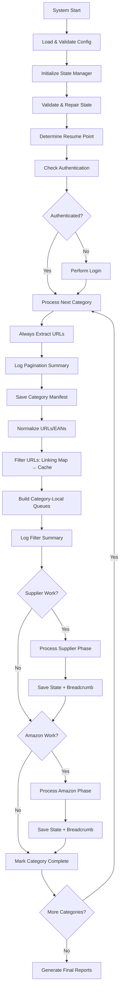

# Design Document

## Overview

This design implements a production-ready Amazon FBA Agent System that enforces per-category Always-Extract workflow, robust supplier login, precise resume pointers, clean logs, and per-category manifests. The solution addresses critical issues in the current system including cache short-circuiting, unreliable authentication, noisy logging, and inconsistent state management.

The design focuses on five core architectural changes:
1. **Always-Extract Enforcement**: Remove cache-based URL enumeration shortcuts
2. **Robust Authentication**: DOM-based login detection with PoundWholesale-specific selectors
3. **Category-Local Processing**: Build per-category queues and complete both phases before advancing
4. **Clean Logging**: Single-line summaries with breadcrumb tracking
5. **Atomic State Management**: Precise resume pointers with validation and repair

## Architecture

### Current System Issues

The existing system has several architectural problems that prevent reliable production operation:

1. **Cache Short-Circuiting**: The system uses "CHUNK CACHE HIT" logic that skips URL extraction when cache data exists, leading to incomplete category processing
2. **Authentication Brittleness**: Login detection relies on broad text matches like "hi " and "hello " rather than robust DOM indicators
3. **Global Processing Queues**: Cross-category queues make it difficult to track progress and resume processing
4. **Noisy Logging**: Per-item cache hit messages and repeated filtering blocks obscure important information
5. **State Drift**: Resume pointers lack validation and can become inconsistent with actual file contents
6. **Pagination Incompleteness**: No systematic tracking of page coverage or verification of complete extraction
7. **Normalization Inconsistency**: URL and EAN matching uses different normalization approaches across components

### Proposed System Flow



## Components and Interfaces

### 1. Enhanced Authentication System

**Purpose**: Provide reliable supplier login with DOM-based detection and PoundWholesale-specific selectors.

**Key Files**:
- `tools/supplier_authentication_service.py`
- `tools/standalone_playwright_login.py`

**Interface Changes**:
```python
class SupplierAuthenticationService:
    async def ensure_authenticated_session(
        self, 
        page: Page, 
        credentials: Dict[str, str]
    ) -> Tuple[bool, str]:
        """Returns (success, method_used)"""
        
    def _is_session_authenticated(self, page: Page) -> bool:
        """DOM-based authentication detection"""

class StandalonePlaywrightLogin:
    def __init__(self, cdp_port: int = 9222, email: str = None, password: str = None):
        """Accept credentials in constructor"""
        
    async def verify_price_access(self, page: Page) -> bool:
        """Verify authentication by checking price element visibility"""
```

**Authentication Detection Strategy**:
1. **Logout Link Detection**: Query for `a[href*="logout"], a[href*="signout"], a[href*="sign-out"]`
2. **Account UI Detection**: Check for `.customer-welcome` or account menu elements
3. **Price Access Verification**: Navigate to known product and verify price element with '£' symbol

**Pagination Architecture**:
Pages are enumerated using next/last navigation or explicit stop conditions. The system builds a `urls_per_page` list tracking URLs found on each page and logs the complete pagination summary before manifest generation. Stop criteria include: no next page button found, maximum pages reached, or extraction errors. The PAGINATION log is emitted immediately after URL extraction and before manifest save.

**Resume Idempotency Flow**:
On re-run mid-category, the system atomically overwrites the existing manifest using WindowsSaveGuardian. The per-category denominator is reset from the new manifest count, ensuring filter summaries use the updated total. This prevents double-counting and maintains state consistency across interruptions and restarts.

### 2. Always-Extract Category Processor

**Purpose**: Enforce URL extraction for every category regardless of cache state.

**Key Files**:
- `tools/passive_extraction_workflow_latest.py`

**Interface Changes**:
```python
class PassiveExtractionWorkflow:
    def _extract_supplier_products(self, categories: List[str]) -> Dict[str, List[str]]:
        """Always extract URLs, never short-circuit on cache"""
        
    def _save_category_manifest(self, supplier_name: str, category_url: str, urls: List[str]) -> str:
        """Save atomic manifest with WindowsSaveGuardian"""
        
    def _process_category_local_queues(self, category_url: str, filtered_urls: Dict[str, List[str]]):
        """Process supplier then Amazon for single category"""
```

**Processing Flow Changes**:
1. **Remove Cache Short-Circuits**: Eliminate "CHUNK CACHE HIT" and "CHUNK CACHE REFERENCE" branches
2. **Always Extract**: Call supplier scraper for every category regardless of cache state
3. **Pagination Tracking**: Log complete page enumeration with per-page URL counts
4. **Category-Local Queues**: Build `to_amazon` queue per category, not globally
5. **Sequential Processing**: Complete supplier → Amazon → next category
6. **Resume Idempotency**: Handle re-runs by atomically overwriting manifests and resetting denominators

### 3. Clean Logging System

**Purpose**: Provide actionable, non-spammy logs with single-line summaries.

**Log Format Specifications**:
```
# Authentication
🔧 Using standalone playwright authentication
✅ Standalone authentication successful: selector_fallback
✅ Already logged in! Price access verified: True

# Pagination Tracking
PAGINATION[C5 wholesale-hand-tools]: pages=3 urls_page=166,166,166 total=498

# Category Processing
📝 MANIFEST: 498 URLs → C:\...\OUTPUTS\manifests\poundwholesale.co.uk\wholesale-hand-tools.json
MANIFEST UPDATE[C5 wholesale-hand-tools]: overwritten=true prev=450 curr=498
FILTER[C5 wholesale-hand-tools]: in=498 skip=491 needs_amz=0 needs_full=7

# Coverage Delta (optional)
COVERAGE[C5 wholesale-hand-tools]: prev=450 curr=498 added=48 removed=0

# Resume Tracking
RESUME PTR: phase=supplier cat_idx=5/119 url=https://...wholesale-hand-tools prod_idx=3/498
RESUME PTR: phase=amazon cat_idx=5/119 url=https://...wholesale-hand-tools prod_idx=2/498

# Financial Triggers
🚨 FINANCIAL REPORT TRIGGER: Reached 1000 linking map entries (trigger every 500)

# Gap Processing (startup only)
GAP PROCESSING: Found 23 unprocessed products across 5 categories
```

**Eliminated Log Patterns**:
- Individual "Cache hit (EAN): ... skipping extraction" messages
- Repeated "Enhanced Filtering Results" blocks per category
- Per-category gap processing messages

### 4. State Management with Validation

**Purpose**: Maintain precise resume pointers with automatic validation and repair.

**Key Files**:
- `utils/fixed_enhanced_state_manager.py`

**Interface Additions**:
```python
class FixedEnhancedStateManager:
    def validate_and_repair_state(self) -> Tuple[bool, List[str]]:
        """Validate state consistency and repair issues"""
        
    def save_state_atomic(self):
        """Save state with resume breadcrumbs"""
        
    def get_resume_breadcrumb(self) -> str:
        """Generate current resume pointer string"""
```

**Validation Checks**:
1. **Key Presence**: Ensure all required state keys exist
2. **Index Bounds**: Verify category/product indices are within valid ranges
3. **Monotonic Progression**: Ensure resumption_index doesn't decrease
4. **File Alignment**: Check state aligns with actual linking_map/cache counts

### 5. Configuration Normalization

**Purpose**: Provide single source of truth for configuration access.

**Key Files**:
- `config/system_config_loader.py`

**Interface Additions**:
```python
class SystemConfigLoader:
    def get_full_config(self) -> Dict[str, Any]:
        """Return complete configuration structure"""
        
    def get_financial_batch_size(self) -> int:
        """Single accessor for financial_report_batch_size with consistent default"""
```

**Configuration Access Pattern**:
- Use `get_system_config()` for system subsection only
- Use `get_full_config()` for ai_features, performance, etc.
- Centralized financial_report_batch_size access eliminates duplicate defaults

### 6. Normalization Utilities

**Purpose**: Ensure consistent URL and EAN normalization across all system components.

**Key Components**:
```python
def normalize_url(url: str) -> str:
    """Normalize URL: lowercase host, strip tracking params, normalize trailing slashes, stable query ordering"""
    
def normalize_ean(ean: str) -> str:
    """Normalize EAN: string type, preserve leading zeros, trim whitespace"""
```

**Application Points**:
- Filtering against linking-map and product cache
- Resume point checks and state validation
- Manifest generation and comparison
- All cache key operations

## Data Models

### CategoryManifest
```python
@dataclass
class CategoryManifest:
    category_url: str
    scraped_at: str  # ISO timestamp
    product_urls: List[str]
    count: int
    supplier_name: str
    slug: str
    pages_scraped: int
    urls_per_page: List[int]
```

### PaginationResult
```python
@dataclass
class PaginationResult:
    pages_scraped: int
    urls_per_page: List[int]
    total_urls: int
    stop_reason: str  # "no_next_page", "max_pages_reached", "error"
```

### FilterResults
```python
@dataclass
class FilterResults:
    input_count: int
    skip_entirely: List[str]
    needs_amazon_only: List[str] 
    needs_full_extraction: List[str]
    
    @property
    def skip_count(self) -> int:
        return len(self.skip_entirely)
        
    @property
    def needs_amz_count(self) -> int:
        return len(self.needs_amazon_only)
        
    @property
    def needs_full_count(self) -> int:
        return len(self.needs_full_extraction)
```

### AuthenticationResult
```python
@dataclass
class AuthenticationResult:
    success: bool
    method_used: str
    price_access_verified: bool = False
    error_message: str = ""
```

### StateValidationResult
```python
@dataclass
class StateValidationResult:
    is_valid: bool
    repairs_made: List[str]
    errors_found: List[str]
    resumption_index: int
    category_index: int

### CoverageComparison
```python
@dataclass
class CoverageComparison:
    previous_count: int
    current_count: int
    added_urls: List[str]
    removed_urls: List[str]
    
    @property
    def added_count(self) -> int:
        return len(self.added_urls)
        
    @property
    def removed_count(self) -> int:
        return len(self.removed_urls)
```

## Error Handling

### Authentication Failures
- **Detection**: Use multiple DOM indicators to avoid false negatives
- **Recovery**: Attempt login with detailed error logging
- **Fallback**: Provide manual intervention guidance

### State Corruption
- **Detection**: Validate state on load with bounds checking
- **Recovery**: Automatic repair of common issues (missing keys, invalid indices)
- **Logging**: Clear explanation of repairs made

### Category Processing Failures
- **Detection**: Monitor for extraction failures or empty results
- **Recovery**: Skip problematic categories with detailed logging
- **Continuation**: Continue processing remaining categories

### File System Issues
- **Detection**: Check for write permissions and disk space
- **Recovery**: Use atomic writes with rollback capability
- **Logging**: Clear error messages with suggested actions

## Testing Strategy

### Unit Tests
1. **Authentication Tests**
   - Mock DOM scenarios for login detection
   - Test selector fallback chains
   - Verify price access validation

2. **State Manager Tests**
   - Test validation and repair logic
   - Verify breadcrumb generation
   - Test atomic save operations

3. **Filter Logic Tests**
   - Verify invariant: skip + needs_amz + needs_full = input
   - Test edge cases with empty caches
   - Validate URL deduplication

### Integration Tests
1. **End-to-End Category Processing**
   - Test complete category workflow
   - Verify manifest generation and content
   - Check log output format compliance

2. **Resume Functionality**
   - Test interruption and resumption
   - Verify state consistency after resume
   - Check breadcrumb accuracy

### Acceptance Tests
Based on the requirements, implement tests for:
- TST-LOGIN-001/002: Authentication logging
- TST-CAT-001/002/003/004: Category processing and logging
- TST-RESUME-001/002: Resume breadcrumbs
- TST-STATE-001: State validation
- TST-FIN-001: Financial triggers
- TST-IMPORT-001: Import hygiene

## Implementation Phases

### Phase 1: Authentication Hardening (High Priority)
1. Update `standalone_playwright_login.py` with credentials and Magento selectors
2. Enhance `supplier_authentication_service.py` with DOM-based detection
3. Add price access verification with verify_price_access()
4. Implement clean authentication logging

### Phase 2: Always-Extract Implementation (High Priority)
1. Remove cache short-circuit logic from `passive_extraction_workflow_latest.py`
2. Add pagination tracking with PAGINATION log emission
3. Implement category manifest saving with atomic writes
4. Add single-line filter summary logging
5. Build category-local processing queues

### Phase 3: Normalization and Resume Idempotency (High Priority)
1. Implement URL/EAN normalization utilities
2. Apply normalization consistently across filtering and caching
3. Add resume idempotency with manifest overwrite handling
4. Implement coverage delta logging (optional)

### Phase 4: State Management Enhancement (High Priority)
1. Add `validate_and_repair_state()` to state manager with startup usage
2. Implement resume breadcrumb logging on every save
3. Add state consistency checks and automatic repair
4. Ensure atomic state saves with proper error handling

### Phase 5: Configuration Normalization (Medium Priority)
1. Add `get_full_config()` method to config loader
2. Centralize financial batch size access with single accessor
3. Fix import paths and eliminate stale copies
4. Add configuration validation

### Phase 6: Testing and Validation (Medium Priority)
1. Implement acceptance test suite covering all TST-* cases
2. Add log format validation and invariant checking
3. Create canary testing framework with rollout flags
4. Add performance monitoring and alerting

## Monitoring and Observability

### Key Metrics
- **Authentication Success Rate**: Track login success/failure ratios
- **Category Processing Rate**: Monitor categories processed per hour
- **Manifest Accuracy**: Verify manifest counts match extracted URLs
- **Resume Reliability**: Track successful resumptions after interruption
- **Log Cleanliness**: Monitor for spam patterns and noise

### Alerting Thresholds
- Authentication failure rate > 10%
- Category processing failures > 5%
- State validation failures > 1%
- Manifest count mismatches > 2%
- Resume failures > 1%

### Performance Targets
- Category processing: < 30 seconds per category
- Authentication: < 10 seconds for login
- State saves: < 1 second for atomic operations
- Manifest generation: < 2 seconds per category
- Log volume: < 100 lines per category processed

## Security Considerations

### Credential Handling
- Read credentials from configuration files, not hardcoded
- Avoid logging sensitive authentication data
- Use secure storage for session tokens where applicable

### File System Security
- Use atomic writes to prevent corruption
- Validate file paths to prevent directory traversal
- Implement proper error handling for permission issues

### Browser Security
- Use CDP connections to shared browser instances
- Implement proper cleanup of browser resources
- Handle browser crashes gracefully

## Deployment Strategy

### Feature Flags and Configuration
- **EXTRACT_POLICY=ALWAYS**: Enforce always-extract workflow (default ON)
- **MANIFEST_WRITE=ON**: Enable per-category manifest generation (default ON)  
- **LOG_BREADCRUMBS=ON**: Enable resume pointer logging (default ON)

### Canary Deployment (T+1)
- **Scope**: Test with 2-3 categories with known product overlaps
- **Validation**:
  - Verify pagination logs show complete page coverage (PAGINATION lines)
  - Confirm manifest counts match extracted URL totals
  - Check filter invariant holds (skip + needs_amz + needs_full = in)
  - Validate resume breadcrumbs appear on every save
  - Verify authentication flow with real credentials
- **Success Criteria**: All acceptance tests pass, no cache hit spam in logs

### Staged Rollout (T+3)
- **Scope**: Process 10-20 categories to validate resume functionality
- **Validation**:
  - Monitor state consistency and breadcrumb accuracy
  - Check financial trigger timing and accuracy
  - Validate filter invariants across multiple categories
  - Test resume idempotency with mid-category re-runs
- **Success Criteria**: Consistent behavior across category set

### Full Production (T+7)
- **Scope**: Complete supplier run with all categories, sampling ≥10%
- **Validation**:
  - Monitor manifest vs filter invariants across all processed categories
  - Confirm resume breadcrumbs maintain density throughout run
  - Verify financial triggers fire at exact configured intervals
  - Check log cleanliness (no spam patterns)
  - Validate end-to-end workflow reliability
- **Success Criteria**: System completes full run with consistent behavior

### State Validator Usage
- **Startup**: Call `validate_and_repair_state()` during system initialization
- **Repairs**: Automatically fix missing keys, invalid indices, and bounds issues
- **Logging**: Sample breadcrumb on save: "RESUME PTR: phase=supplier cat_idx=5/119 url=... prod_idx=3/498"

### Configuration Access Consolidation
- **Single Accessor**: Use centralized `get_financial_batch_size()` with consistent default
- **Config Separation**: `get_system_config()` for system subsection, `get_full_config()` for complete structure
- **Import Hygiene**: Ensure canonical imports from tools/ directory, eliminate stale copies