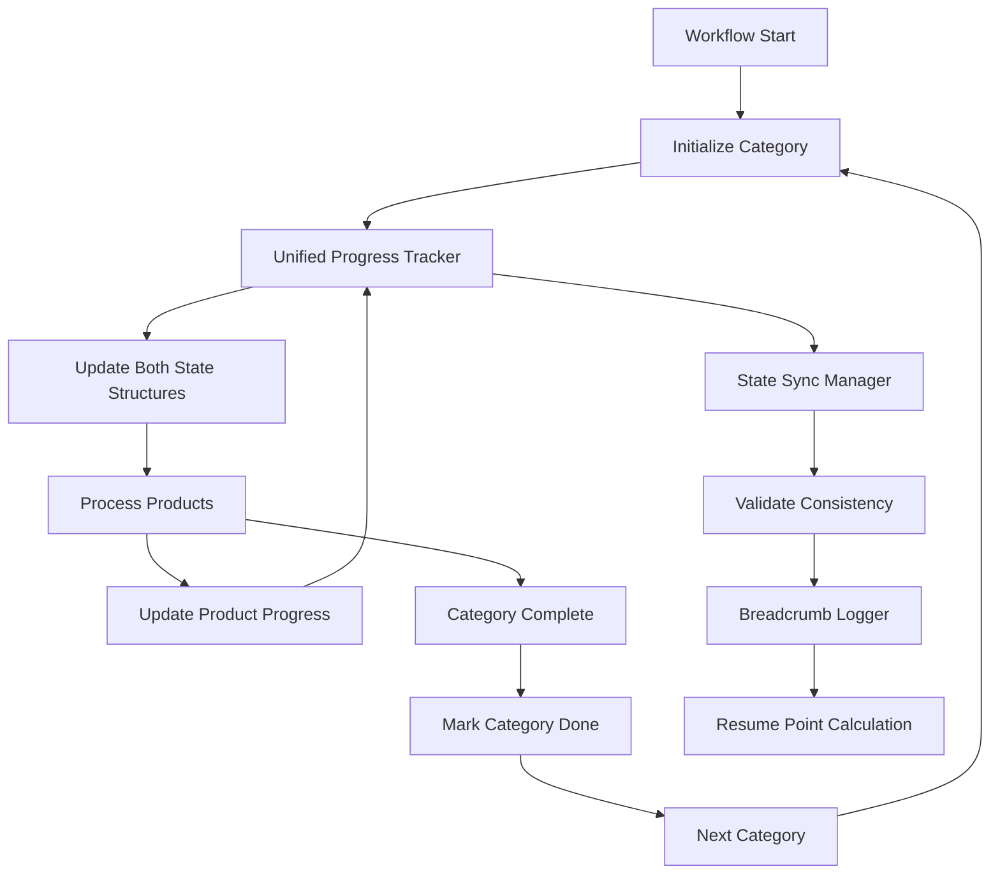

# Design Document

## Overview

This design addresses the breadcrumb tracking and resumption system issues by implementing comprehensive field population, state synchronization, workflow integration, and index-based resumption capabilities. The solution focuses on eliminating persistent breadcrumb warnings while maintaining backward compatibility and improving performance.

## Architecture

### Core Components

1. **Unified Progress Tracker** - Centralized tracking with dual-structure synchronization
2. **Workflow Integration Layer** - Seamless integration with existing workflow
3. **Index-Based Resumption Engine** - Efficient category and product-level resumption
4. **State Synchronization Manager** - Automatic synchronization between state structures
5. **Breadcrumb Enhancement System** - Intelligent breadcrumb logging with field validation

### Component Interactions



## Components and Interfaces

### 1. Unified Progress Tracker

**Purpose:** Centralized progress tracking that maintains both state structures in perfect synchronization.

**Interface:**
```python
class UnifiedProgressTracker:
    def initialize_category_processing(self, category_index: int, category_url: str, total_categories: int) -> None
    def update_product_progress(self, product_index: int, total_products: int, product_url: str) -> None
    def complete_category_processing(self, category_index: int) -> None
    def transition_phase(self, new_phase: str) -> None
    def get_resumption_point(self) -> Dict[str, Any]
    def validate_and_repair_state(self) -> Tuple[bool, List[str]]
```

**Key Methods:**

- `initialize_category_processing()`: Sets up tracking for new category with proper field population
- `update_product_progress()`: Updates product-level progress in both state structures
- `complete_category_processing()`: Marks category as completed and resets accumulators
- `transition_phase()`: Handles phase changes (supplier → amazon → complete)
- `get_resumption_point()`: Calculates exact resumption point with validation
- `validate_and_repair_state()`: Ensures state consistency and repairs issues

### 2. Workflow Integration Layer

**Purpose:** Seamless integration with existing workflow without breaking changes.

**Interface:**
```python
class WorkflowIntegrationLayer:
    def on_category_start(self, category_index: int, category_url: str, total_categories: int) -> None
    def on_product_processed(self, product_index: int, product_url: str, total_products: int) -> None
    def on_category_complete(self, category_index: int) -> None
    def on_phase_transition(self, new_phase: str) -> None
    def ensure_fields_populated(self) -> None
```

**Integration Points:**
1. **Category Loop Start**: Inject `on_category_start()` call
2. **Product Processing**: Inject `on_product_processed()` call  
3. **Category Completion**: Inject `on_category_complete()` call
4. **Phase Changes**: Inject `on_phase_transition()` call
5. **State Saves**: Inject `ensure_fields_populated()` call

### 3. Index-Based Resumption Engine

**Purpose:** Efficient resumption using category and product indices with URL-based fallback.

**Interface:**
```python
class IndexBasedResumptionEngine:
    def calculate_resume_point(self) -> Dict[str, Any]
    def should_skip_category(self, category_index: int) -> bool
    def should_skip_product(self, category_index: int, product_index: int) -> bool
    def validate_resume_indices(self, category_index: int, product_index: int) -> bool
    def fallback_to_url_resumption(self) -> Dict[str, Any]
```

**Resumption Logic:**
```python
def calculate_resume_point(self) -> Dict[str, Any]:
    """Calculate exact resumption point with validation and fallback."""
    sp = self.state_data.get("system_progression", {})
    
    # Get current indices
    category_index = sp.get("current_category_index", 0)
    product_index = sp.get("current_product_index_in_category", 0)
    total_categories = sp.get("total_categories", 0)
    
    # Validate indices
    if self.validate_resume_indices(category_index, product_index):
        return {
            "method": "index_based",
            "category_index": category_index,
            "product_index": product_index,
            "category_url": sp.get("current_category_url", ""),
            "phase": sp.get("current_phase", "supplier")
        }
    else:
        # Fallback to URL-based resumption
        return self.fallback_to_url_resumption()
```

### 4. State Synchronization Manager

**Purpose:** Automatic synchronization between `system_progression` and `supplier_extraction_progress`.

**Interface:**
```python
class StateSynchronizationManager:
    def sync_structures(self) -> None
    def validate_consistency(self) -> Tuple[bool, List[str]]
    def repair_inconsistencies(self, issues: List[str]) -> int
    def ensure_field_population(self) -> None
```

**Synchronization Logic:**
```python
def sync_structures(self) -> None:
    """Ensure both state structures contain consistent values."""
    sp = self.state_data.setdefault("system_progression", {})
    sep = self.state_data.setdefault("supplier_extraction_progress", {})
    
    # Sync category-level fields
    if "current_category_index" in sp:
        sep["current_category_index"] = sp["current_category_index"]
    if "total_categories" in sp:
        sep["total_categories"] = sp["total_categories"]
    
    # Sync product-level fields
    if "current_product_index_in_category" in sp:
        sep["current_product_index_in_category"] = sp["current_product_index_in_category"]
    if "total_products_in_current_category" in sp:
        sep["total_products_in_current_category"] = sp["total_products_in_current_category"]
    
    # Sync URL and phase
    if "current_category_url" in sp:
        sep["current_category_url"] = sp["current_category_url"]
```

### 5. Breadcrumb Enhancement System

**Purpose:** Intelligent breadcrumb logging with field validation and population.

**Interface:**
```python
class BreadcrumbEnhancementSystem:
    def log_breadcrumb_enhanced(self) -> None
    def ensure_fields_populated(self) -> bool
    def reconstruct_missing_fields(self) -> Dict[str, Any]
    def validate_breadcrumb_data(self) -> Tuple[bool, List[str]]
```

**Enhanced Breadcrumb Logic:**
```python
def log_breadcrumb_enhanced(self) -> None:
    """Enhanced breadcrumb logging with automatic field population."""
    # Ensure all fields are populated
    if not self.ensure_fields_populated():
        # Attempt to reconstruct missing fields
        reconstructed = self.reconstruct_missing_fields()
        if reconstructed:
            log.info(f"🔧 BREADCRUMB: Reconstructed missing fields: {list(reconstructed.keys())}")
    
    sp = self.state_data.get("system_progression", {})
    
    # Validate data before logging
    is_valid, issues = self.validate_breadcrumb_data()
    if not is_valid:
        log.warning(f"🚨 BREADCRUMB: Data validation issues: {issues}")
        return
    
    # Log comprehensive breadcrumb
    phase = sp.get("current_phase", "unknown")
    cat_idx = sp.get("current_category_index", 0)
    total_cats = sp.get("total_categories", 0)
    prod_idx = sp.get("current_product_index_in_category", 0)
    total_prods = sp.get("total_products_in_current_category", 0)
    cat_url = sp.get("current_category_url", "")
    
    # Calculate progress percentages
    cat_progress = (cat_idx / total_cats * 100) if total_cats > 0 else 0
    prod_progress = (prod_idx / total_prods * 100) if total_prods > 0 else 0
    
    log.info(
        f"RESUME PTR: phase={phase} "
        f"cat={cat_idx}/{total_cats} ({cat_progress:.1f}%) "
        f"prod={prod_idx}/{total_prods} ({prod_progress:.1f}%) "
        f"url={cat_url[:50]}..."
    )
```

## Data Models

### Enhanced State Structure

```python
{
    "schema_version": "2.1_BREADCRUMB_ENHANCED",
    "created_at": "ISO timestamp",
    "last_updated": "ISO timestamp",
    
    # Enhanced system progression with complete tracking
    "system_progression": {
        "current_phase": "supplier|amazon|complete",
        "current_category_index": int,           # ✅ Always populated
        "total_categories": int,                 # ✅ Always populated
        "current_product_index_in_category": int, # ✅ Always populated
        "total_products_in_current_category": int, # ✅ Always populated
        "current_category_url": str,             # ✅ Always populated
        "phase_start_time": "ISO timestamp",
        "category_start_time": "ISO timestamp",
        "estimated_completion": "ISO timestamp"
    },
    
    # Synchronized supplier extraction progress
    "supplier_extraction_progress": {
        "current_category_index": int,           # ✅ Synchronized
        "total_categories": int,                 # ✅ Synchronized
        "current_product_index_in_category": int, # ✅ Synchronized
        "total_products_in_current_category": int, # ✅ Synchronized
        "current_category_url": str,             # ✅ Synchronized
        "discovered_products_in_current_category": int,
        "pages_scraped_in_session": int,
        "extraction_phase": str,
        "categories_completed": List[str]
    },
    
    # Category completion tracking
    "category_completion_status": {
        "category_url": {
            "status": "not_started|in_progress|completed",
            "products_discovered": int,
            "products_processed": int,
            "completion_percentage": float,
            "start_time": "ISO timestamp",
            "end_time": "ISO timestamp"
        }
    },
    
    # Breadcrumb metadata
    "breadcrumb_metadata": {
        "last_breadcrumb_time": "ISO timestamp",
        "breadcrumb_count": int,
        "field_reconstruction_count": int,
        "validation_failures": int
    }
}
```

### Resumption Point Structure

```python
{
    "resumption_method": "index_based|url_based|hybrid",
    "category_index": int,
    "product_index": int,
    "category_url": str,
    "phase": str,
    "total_categories": int,
    "total_products_in_category": int,
    "estimated_remaining_work": int,
    "confidence_score": float,  # 0.0-1.0 confidence in resumption accuracy
    "fallback_available": bool,
    "validation_passed": bool
}
```

## Implementation Strategy

### Phase 1: State Structure Enhancement

**Week 1: Core Infrastructure**
1. **Unified Progress Tracker Implementation**
   - Create centralized tracking class
   - Implement dual-structure synchronization
   - Add field validation and population

2. **State Synchronization Manager**
   - Automatic synchronization between structures
   - Consistency validation and repair
   - Field reconstruction capabilities

### Phase 2: Workflow Integration

**Week 2: Seamless Integration**
1. **Integration Layer Development**
   - Non-breaking workflow integration points
   - Automatic method injection at key points
   - Backward compatibility preservation

2. **Category and Product Tracking**
   - Category initialization integration
   - Product progress update integration
   - Category completion tracking

### Phase 3: Index-Based Resumption

**Week 3: Advanced Resumption**
1. **Resumption Engine Implementation**
   - Index-based resumption logic
   - Category-level skipping optimization
   - URL-based fallback mechanism

2. **Performance Optimization**
   - Efficient category skipping
   - Product-level resumption within categories
   - Progress calculation optimization

### Phase 4: Enhanced Breadcrumb System

**Week 4: Intelligent Logging**
1. **Breadcrumb Enhancement**
   - Intelligent field population
   - Enhanced logging with progress percentages
   - Error recovery and validation

2. **Monitoring and Diagnostics**
   - Comprehensive progress tracking
   - Error detection and recovery
   - Performance monitoring

## Error Handling

### Field Population Failures

```python
class FieldPopulationError(Exception):
    """Raised when critical fields cannot be populated."""
    pass

def handle_field_population_failure(missing_fields: List[str]) -> None:
    """Handle cases where fields cannot be populated."""
    if "total_categories" in missing_fields:
        # Attempt to calculate from category list
        total_categories = len(self.get_category_list())
        self.state_data["system_progression"]["total_categories"] = total_categories
    
    if "current_category_index" in missing_fields:
        # Attempt to calculate from current category URL
        current_url = self.state_data["system_progression"].get("current_category_url")
        if current_url:
            category_index = self.find_category_index(current_url)
            self.state_data["system_progression"]["current_category_index"] = category_index
```

### State Synchronization Failures

```python
def handle_sync_failure(sync_errors: List[str]) -> None:
    """Handle synchronization failures between state structures."""
    for error in sync_errors:
        if "category_index_mismatch" in error:
            # Use system_progression as source of truth
            sp_value = self.state_data["system_progression"]["current_category_index"]
            self.state_data["supplier_extraction_progress"]["current_category_index"] = sp_value
            log.info(f"🔧 SYNC REPAIR: Fixed category index mismatch")
```

### Resumption Validation Failures

```python
def handle_resumption_validation_failure(validation_errors: List[str]) -> Dict[str, Any]:
    """Handle resumption validation failures with fallback."""
    log.warning(f"🚨 RESUMPTION: Validation failed: {validation_errors}")
    
    # Attempt repair
    if "category_index_out_of_bounds" in validation_errors:
        self.state_data["system_progression"]["current_category_index"] = 0
        log.info("🔧 RESUMPTION: Reset category index to 0")
    
    if "product_index_out_of_bounds" in validation_errors:
        self.state_data["system_progression"]["current_product_index_in_category"] = 0
        log.info("🔧 RESUMPTION: Reset product index to 0")
    
    # Fallback to URL-based resumption
    return self.fallback_to_url_resumption()
```

## Testing Strategy

### Unit Tests

1. **Progress Tracker Tests**
   - Field population accuracy
   - State synchronization
   - Error recovery mechanisms

2. **Resumption Engine Tests**
   - Index-based resumption accuracy
   - Fallback mechanism reliability
   - Edge case handling

3. **Integration Layer Tests**
   - Workflow integration points
   - Backward compatibility
   - Performance impact

### Integration Tests

1. **End-to-End Resumption Tests**
   - Complete workflow interruption and resumption
   - Category-level resumption accuracy
   - Product-level resumption accuracy

2. **State Consistency Tests**
   - Dual-structure synchronization
   - Field population under various conditions
   - Error recovery effectiveness

3. **Performance Tests**
   - Category skipping efficiency
   - Progress tracking overhead
   - Large-scale resumption performance

### Stress Tests

1. **Large Dataset Tests**
   - 1000+ categories with resumption
   - 10k+ products per category
   - Memory usage optimization

2. **Error Injection Tests**
   - Simulated field corruption
   - State inconsistency scenarios
   - Recovery mechanism validation

## Migration Strategy

### Backward Compatibility

- Maintain existing URL-based resumption as fallback
- Preserve all existing state structure fields
- Ensure existing workflow methods continue to work
- Provide gradual migration path

### Rollout Plan

1. **Phase 1**: Deploy with feature flags (disabled by default)
2. **Phase 2**: Enable for testing environments
3. **Phase 3**: Gradual rollout to production with monitoring
4. **Phase 4**: Full deployment with legacy fallback removal

## Monitoring and Observability

### Key Metrics

1. **Breadcrumb Success Rate** - Percentage of successful breadcrumb logs
2. **Field Population Rate** - Percentage of state saves with all fields populated
3. **Resumption Accuracy** - Accuracy of index-based resumption
4. **State Consistency Score** - Measure of dual-structure synchronization

### Alerts

1. **Field Population Failure** - Critical alert for missing fields
2. **State Inconsistency** - Warning for synchronization issues
3. **Resumption Failure** - Error alert for resumption problems
4. **Performance Degradation** - Warning for tracking overhead

### Dashboards

1. **Progress Tracking** - Real-time progress with accurate percentages
2. **Resumption Health** - Resumption success rates and accuracy
3. **State Consistency** - Synchronization metrics and health
4. **Performance Impact** - Overhead and optimization metrics

This design provides a comprehensive solution for breadcrumb tracking and resumption issues while maintaining system performance and backward compatibility.