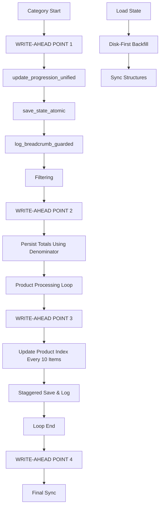

# Design Document

## Overview

This design implements write-ahead field population at 4 precise workflow integration points to eliminate "BREADCRUMB DELAYED" warnings through timing fixes rather than complex reconstruction.

## Architecture - Write-Ahead Integration Points

### Point 1: Category Start (Before Filtering)
**Purpose:** Populate all category-level fields before any processing begins
**Integration:** `tools/passive_extraction_workflow_latest.py` category loop
**Method:** `state_manager.update_progression_unified()` with category fields

### Point 2: Post-Filter (Persist Totals)
**Purpose:** Store accurate product totals using filter denominator
**Integration:** Immediately after `filter_urls()` call
**Method:** Use `filter_result["denominator"]` for `total_products_in_current_category`

### Point 3: Product Processing (Staggered Updates)
**Purpose:** Update product index before each product's side-effects
**Integration:** Within product processing loops (supplier and Amazon)
**Method:** Index updates every item, saves every 10 items with timing gaps

### Point 4: Phase Transitions (Complete Sync)
**Purpose:** Update phase field and sync state at workflow transitions
**Integration:** Supplier→Amazon phase change and loop completion
**Method:** `current_phase` updates with final state synchronization

## Data Flow

Category Start → [Point 1] → Fields Populated → Filter → [Point 2] → Totals Set →
Product Loop → [Point 3] → Index Updates → Phase Change → [Point 4] → Final Sync

## Error Handling

- Use `hasattr()` checks for graceful fallback when methods unavailable
- Maintain existing ErrorHandler path for filter invariant failures
- Continue processing even if breadcrumb logging fails
- Feature flags enable safe rollback via environment variables

### Write-Ahead Workflow Integration



## Implementation Points

### 1. Write-Ahead Point 1: Category Start (Before Filtering)

**Purpose:** Populate all breadcrumb fields before any filtering or side-effects occur.

**Location:** `tools/passive_extraction_workflow_latest.py` - Category processing loop

**Implementation:**
```python
# 🚨 WRITE-AHEAD POINT 1: Category start (before any filtering)
if hasattr(self.state_manager, 'update_progression_unified'):
    self.state_manager.update_progression_unified(
        current_category_index=category_index - 1,
        total_categories=len(category_urls),
        current_product_index_in_category=0,
        total_products_in_current_category=0,
        current_phase="supplier",
        current_category_url=category_url
    )
    self.state_manager.save_state_atomic()
    self.state_manager.log_breadcrumb_guarded()
```

### 2. Write-Ahead Point 2: After Filtering (Persist Totals Using Denominator)

**Purpose:** Immediately persist accurate totals using filter denominator after filtering completes.

**Location:** `tools/passive_extraction_workflow_latest.py` - After URL filtering

**Implementation:**
```python
# 🚨 WRITE-AHEAD POINT 2: Immediately after filtering (persist totals using denominator)
if not filtered.get("invariant_check", False):
    # Keep existing error handling path
    try:
        from utils.fixed_enhanced_state_manager import ErrorHandler
        error_handler = ErrorHandler(self.state_manager, self.log)
        recovery = error_handler.handle_invariant_failure(filtered, category_id)
    except ImportError:
        self.log.warning(f"⚠️ ErrorHandler not available for {category_id}")
else:
    # Use denominator from filter result for accurate totals
    denominator = filtered.get("denominator", len(filtered['needs_amazon_only']) + len(filtered['needs_full_extraction']))
    if hasattr(self.state_manager, 'update_progression_unified'):
        self.state_manager.update_progression_unified(
            current_product_index_in_category=0,
            total_products_in_current_category=denominator
        )
        self.state_manager.save_state_atomic()
        self.state_manager.log_breadcrumb_guarded()
```

### 3. Write-Ahead Point 3: During Product Processing (Supplier Phase with Throttling)

**Purpose:** Update product index BEFORE side-effects with staggered writes to prevent file conflicts.

**Location:** `tools/passive_extraction_workflow_latest.py` - Product processing loops

**Implementation:**
```python
# 🚨 WRITE-AHEAD POINT 3: During per-product processing (supplier phase) with throttling
if hasattr(self.state_manager, 'update_progression_unified'):
    # BEFORE side-effects; update pointer
    self.state_manager.update_progression_unified(current_product_index_in_category=current_index)
    if (current_index) % 10 == 0:  # staggered write pattern
        self.state_manager.save_state_atomic()
        self.state_manager.log_breadcrumb_guarded()
```

### 4. Write-Ahead Point 4: Final Sync at Loop End

**Purpose:** Ensure all state is saved when processing loops complete.

**Location:** `tools/passive_extraction_workflow_latest.py` - End of product processing loops

**Implementation:**
```python
# 🚨 WRITE-AHEAD POINT 4: Ensure final sync at loop end
if hasattr(self.state_manager, 'update_progression_unified'):
    self.state_manager.save_state_atomic()
    self.state_manager.log_breadcrumb_guarded()
```

### 5. Enhanced State Manager: Single Update Surface

**Purpose:** Provide atomic updates to both state structures with validation and regression protection.

**Location:** `utils/fixed_enhanced_state_manager.py`

**Enhanced `update_progression_unified` Method:**
```python
def update_progression_unified(self, **kwargs) -> None:
    """🚨 WRITE-AHEAD: Unified progression update that keeps both state structures synchronized."""
    sp = self.state_data.setdefault("system_progression", {})
    sep = self.state_data.setdefault("supplier_extraction_progress", {})
    
    # Basic validation: Non-negative indices/totals
    for key, value in kwargs.items():
        if key in ["current_category_index", "total_categories", "current_product_index_in_category", 
                  "total_products_in_current_category"] and isinstance(value, (int, float)):
            if value < 0:
                log.warning(f"🚨 VALIDATION: Negative value for {key}: {value}, setting to 0")
                kwargs[key] = 0
    
    # Prevent regression when STATE_STRICT_MODE=1 (unless ALLOW_STATE_REGRESSION=1)
    if os.getenv('STATE_STRICT_MODE') == '1' and os.getenv('ALLOW_STATE_REGRESSION') != '1':
        if "current_category_index" in kwargs:
            current_val = sp.get("current_category_index", 0)
            if kwargs["current_category_index"] < current_val:
                log.warning(f"🚨 REGRESSION GUARD: category_index {kwargs['current_category_index']} < {current_val}")
                kwargs["current_category_index"] = current_val
    
    # Update both structures atomically
    for key, value in kwargs.items():
        if key in ["current_category_index", "total_categories", "current_product_index_in_category", 
                  "total_products_in_current_category", "current_phase", "current_category_url"]:
            sp[key] = value
    
    # Sync with supplier_extraction_progress for backward compatibility
    sync_fields = {
        "current_category_index": "current_category_index",
        "total_products_in_current_category": "total_products_in_current_category",
        "current_product_index_in_category": "current_product_index_in_category",
        "current_category_url": "current_category_url"
    }
    
    for sp_key, sep_key in sync_fields.items():
        if sp_key in kwargs:
            sep[sep_key] = kwargs[sp_key]
```

### 6. Disk-First Load-Time Backfill

**Purpose:** Ensure structure synchronization from disk state at load time.

**Location:** `utils/fixed_enhanced_state_manager.py` - `load_state()` method

**Implementation:**
```python
# 🚨 DISK-FIRST BACKFILL: Sync structures from disk state
sp = self.state_data.setdefault("system_progression", {})
sep = self.state_data.setdefault("supplier_extraction_progress", {})

# Backfill missing fields from system_progression to supplier_extraction_progress
for k_sp, k_sep in [
    ("current_category_index", "current_category_index"),
    ("current_product_index_in_category", "current_product_index_in_category"),
    ("total_products_in_current_category", "total_products_in_current_category"),
]:
    if k_sp in sp and not sep.get(k_sep):
        sep[k_sep] = sp[k_sp]
        log.debug(f"🔧 BACKFILL: {k_sep} = {sp[k_sp]} from system_progression")
```

### 7. Strict Guarded Breadcrumb Logging

**Purpose:** Log only when all fields are present and denominators > 0, otherwise warn once and continue.

**Location:** `utils/fixed_enhanced_state_manager.py` - `log_breadcrumb_guarded()` method

**Behavior:**
- ✅ Logs complete breadcrumb when all 4 fields + phase present and denominators > 0
- ⚠️ Warns once when fields missing, then continues processing
- ❌ No complex reconstruction, no percentages, no ETA
- 🔄 Existing strict implementation maintained

### 8. URL Filter Outputs

**Purpose:** Ensure filter returns required fields for accurate totals.

**Location:** `utils/url_filter.py` - `filter_urls()` function

**Required Outputs:**
- `invariant_check: bool` - Whether filter invariant passed
- `denominator: int` - Accurate count (discovered_urls - linking_map_hits)
- `linking_map_hits: int` - Count of URLs found in linking map

## Error Handling

### Graceful Fallbacks

1. **Method Unavailable**: `hasattr()` checks for graceful degradation
2. **Filter Invariant Failure**: Existing ErrorHandler path maintained
3. **State Corruption**: Disk-first backfill provides recovery
4. **Feature Flag Safety**: `STATE_STRICT_MODE` and `ALLOW_STATE_REGRESSION` for rollout control

## Success Criteria

- ✅ Zero "BREADCRUMB DELAYED" warnings after first filter per category
- ✅ All required breadcrumb fields exist with denominators > 0
- ✅ Monotonic indices across restarts
- ✅ Filter invariant enforced with denominator-based totals
- ✅ Throttled saves/logs (every 10 items) prevent file conflicts
- ✅ Safe rollback via feature flags

## Implementation Files (Only 3)

1. **`tools/passive_extraction_workflow_latest.py`** - Add 4 write-ahead points
2. **`utils/fixed_enhanced_state_manager.py`** - Enhance unified updates and load-time backfill
3. **`utils/url_filter.py`** - Verify/ensure required outputs (minimal change)

This write-ahead approach fixes timing root cause with minimal edits, uses existing architecture, and supports safe rollback.