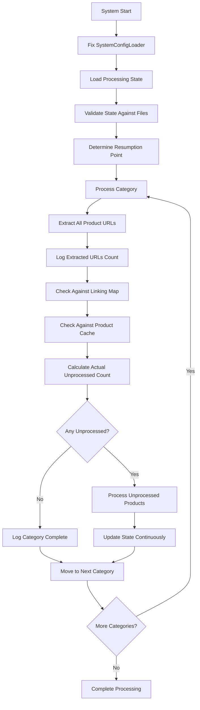

# Design Document

## Overview

This design addresses the critical system behavior issues identified in the Amazon FBA Agent System. The solution involves architectural changes to improve transparency, accuracy, and reliability of the category processing workflow. The design focuses on fixing the SystemConfigLoader, enhancing logging visibility, correcting product counting logic, and ensuring reliable state management.

## Architecture

### Current System Flow Issues
The current system has several architectural problems:
1. SystemConfigLoader missing essential methods
2. Category URL extraction happens silently without logging
3. Product counting relies on cached estimates rather than actual extraction
4. State management doesn't properly track resumption points
5. Cache hit logic is opaque and confusing

### Proposed System Flow


## Components and Interfaces

### 1. Enhanced SystemConfigLoader

**Purpose:** Fix the missing `load_config()` method and ensure proper configuration loading.

**Interface:**
```python
class SystemConfigLoader:
    def __init__(self, config_path: str = None)
    def load_config(self) -> Dict[str, Any]  # NEW METHOD
    def get_system_config(self) -> Dict[str, Any]
    def get_supplier_config(self, supplier_name: str) -> Dict[str, Any]
    def reload_config(self) -> bool  # NEW METHOD
```

**Key Changes:**
- Add missing `load_config()` method that returns the full configuration
- Add `reload_config()` method for dynamic configuration updates
- Ensure all existing methods continue to work without breaking changes

### 2. Transparent Category Processor

**Purpose:** Make category URL extraction visible and ensure accurate product counting.

**Interface:**
```python
class TransparentCategoryProcessor:
    def extract_category_urls(self, category_url: str) -> List[str]
    def log_extraction_results(self, category_url: str, extracted_urls: List[str])
    def check_against_caches(self, urls: List[str]) -> CacheCheckResult
    def calculate_unprocessed_count(self, extracted_urls: List[str], cache_results: CacheCheckResult) -> int
    def explain_processing_decision(self, category_url: str, results: ProcessingResults)
```

**Key Features:**
- Always extract URLs first, then check caches
- Log every step with clear explanations
- Provide detailed breakdowns of cache hits and misses
- Calculate accurate unprocessed counts based on actual extraction

### 3. Enhanced State Manager Integration

**Purpose:** Ensure reliable resumption and accurate state tracking.

**Interface:**
```python
class ReliableStateManager:
    def validate_state_against_files(self) -> ValidationResult
    def calculate_accurate_resumption_point(self) -> ResumptionPoint
    def update_category_progress(self, category_url: str, progress: CategoryProgress)
    def mark_category_complete(self, category_url: str)
    def get_next_category_to_process(self) -> Optional[str]
    def save_resumption_checkpoint(self, category_url: str, product_index: int)
```

**Key Features:**
- Validate internal state against actual file contents on startup
- Track category completion accurately
- Provide reliable resumption points
- Continuous checkpoint saving

### 4. Diagnostic Logger

**Purpose:** Provide comprehensive diagnostic information for troubleshooting.

**Interface:**
```python
class DiagnosticLogger:
    def log_extraction_phase(self, category_url: str, extracted_count: int)
    def log_cache_check_details(self, cache_type: str, hits: List[str], misses: List[str])
    def log_processing_decision(self, decision: str, reasoning: str)
    def log_state_validation(self, validation_results: ValidationResult)
    def log_discrepancy_analysis(self, expected: int, actual: int, explanation: str)
```

## Data Models

### CacheCheckResult
```python
@dataclass
class CacheCheckResult:
    linking_map_hits: List[str]
    product_cache_hits: List[str]
    ean_cache_hits: List[str]
    total_hits: int
    unprocessed_urls: List[str]
    hit_details: Dict[str, str]  # URL -> cache_type mapping
```

### ProcessingResults
```python
@dataclass
class ProcessingResults:
    category_url: str
    extracted_urls: List[str]
    cache_results: CacheCheckResult
    unprocessed_count: int
    processing_decision: str
    explanation: str
```

### ValidationResult
```python
@dataclass
class ValidationResult:
    is_valid: bool
    discrepancies: List[str]
    corrective_actions: List[str]
    file_based_totals: Dict[str, int]
    state_based_totals: Dict[str, int]
```

### ResumptionPoint
```python
@dataclass
class ResumptionPoint:
    category_index: int
    category_url: str
    product_index: int
    total_categories: int
    explanation: str
    validation_passed: bool
```

## Error Handling

### Configuration Loading Errors
- **Issue:** SystemConfigLoader fails to load configuration
- **Handling:** Provide detailed error messages, fallback to defaults where possible, fail gracefully with clear instructions

### State Validation Errors
- **Issue:** Processing state doesn't match file contents
- **Handling:** Log discrepancies, attempt automatic correction, provide manual correction guidance

### Category Processing Errors
- **Issue:** Unable to extract URLs from category
- **Handling:** Log detailed error information, skip category with explanation, continue processing other categories

### Cache Inconsistency Errors
- **Issue:** Cache files contain inconsistent data
- **Handling:** Validate cache integrity, rebuild if necessary, log all corrective actions

## Testing Strategy

### Unit Tests
1. **SystemConfigLoader Tests**
   - Test `load_config()` method with valid and invalid configurations
   - Test backward compatibility with existing code
   - Test error handling for missing or corrupted config files

2. **Category Processor Tests**
   - Test URL extraction with various category page structures
   - Test cache checking logic with different cache states
   - Test accurate counting with overlapping products

3. **State Manager Tests**
   - Test state validation against mock file contents
   - Test resumption point calculation
   - Test checkpoint saving and loading

### Integration Tests
1. **End-to-End Processing Tests**
   - Test complete category processing workflow
   - Test interruption and resumption scenarios
   - Test multi-category processing with state persistence

2. **Cache Interaction Tests**
   - Test interaction between different cache types
   - Test cache hit/miss scenarios
   - Test cache consistency validation

### Performance Tests
1. **Large Dataset Tests**
   - Test processing with thousands of products
   - Test memory usage during large category processing
   - Test state file performance with large datasets

## Implementation Phases

### Phase 1: Core Fixes (High Priority)
1. Fix SystemConfigLoader `load_config()` method
2. Implement transparent category URL extraction logging
3. Fix product counting logic to use actual extraction results
4. Add basic diagnostic logging

### Phase 2: State Management (High Priority)
1. Implement state validation against files
2. Fix resumption point calculation
3. Add category completion tracking
4. Implement continuous checkpoint saving

### Phase 3: Enhanced Diagnostics (Medium Priority)
1. Add comprehensive cache hit/miss logging
2. Implement discrepancy analysis and reporting
3. Add processing decision explanations
4. Enhance error reporting with actionable information

### Phase 4: Testing and Validation (Medium Priority)
1. Implement comprehensive test suite
2. Add performance monitoring
3. Create diagnostic tools for troubleshooting
4. Add configuration validation utilities

## Monitoring and Observability

### Key Metrics to Track
- Category processing success rate
- Product extraction accuracy
- Cache hit/miss ratios
- State validation success rate
- Resumption reliability

### Logging Enhancements
- Structured logging with consistent format
- Log levels appropriate for different audiences
- Searchable log entries for troubleshooting
- Performance metrics in logs

### Alerting
- Alert on configuration loading failures
- Alert on state validation failures
- Alert on significant processing discrepancies
- Alert on resumption failures