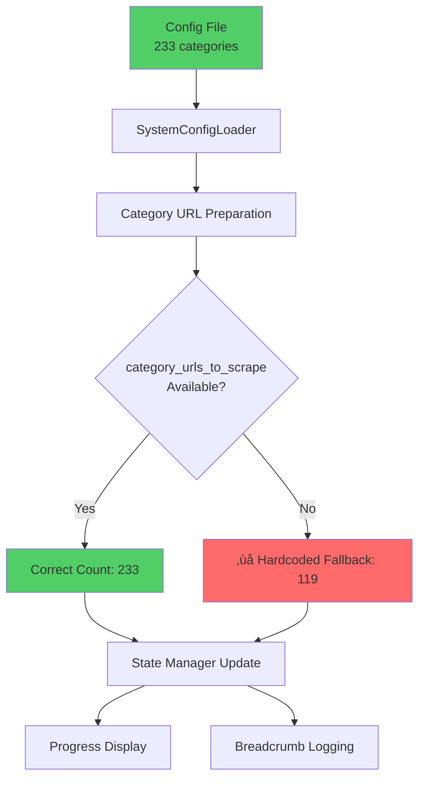

# Category Count Investigation & Fix Design

## Overview

This document outlines the investigation and resolution of a critical category count discrepancy affecting the Amazon FBA Agent System. The system incorrectly reports 119 categories instead of the actual 233 categories defined in the configuration, impacting progress tracking, user experience, and system accuracy.

## Problem Statement

### Issue Description
The processing state shows an incorrect total categories count:
- **Reported Value**: `"total_categories": 119`
- **Actual Value**: `233 categories` (verified from configuration file)
- **Impact Level**: 🔴 **Critical** - affects progress calculations, breadcrumb logging, and user experience

### Root Cause Analysis

#### Investigation Results

**1. Configuration File Analysis**
- **File**: `config/poundwholesale_categories.json`
- **Structure**: JSON object with `category_urls` array
- **Actual Count**: **233 category URLs** (verified by manual inspection)
- **Data Structure**: Valid JSON with properly formatted category URLs

**2. Hardcoded Fallback Discovery**
The primary root cause was identified in `tools/passive_extraction_workflow_latest.py` at line 3760:

```python
# Set total categories from config
total_categories = len(category_urls_to_scrape) if hasattr(self, 'category_urls_to_scrape') else 119
```

**Critical Issue**: The fallback value of `119` is hardcoded and outdated. When `category_urls_to_scrape` is not available or accessible, the system defaults to the incorrect value of 119.

#### Technical Analysis

**Category Loading Chain**:
1. **Configuration Loading**: `SystemConfigLoader` loads categories from JSON
2. **Category URL Preparation**: Categories are prepared for processing 
3. **State Initialization**: `total_categories` is set during state management
4. **Fallback Logic**: When category data is unavailable, system uses hardcoded `119`

**Multiple Assignment Points**:
- `passive_extraction_workflow_latest.py:3760` - Primary assignment with fallback
- `fixed_enhanced_state_manager.py:816-820` - File-grounded calculation (correct)
- `fixed_enhanced_state_manager.py:500` - Category processing initialization
- `fixed_enhanced_state_manager.py:641` - Progression update method

## Architecture Impact

### Affected Components

#### State Management System
- **Component**: `utils/fixed_enhanced_state_manager.py`
- **Methods**: 
  - `initialize_category_processing()`
  - `update_progression_unified()`
  - `_calculate_file_grounded_totals()`
- **Impact**: Inconsistent total category values across different calculation methods

#### Workflow Orchestration  
- **Component**: `tools/passive_extraction_workflow_latest.py`
- **Methods**:
  - Category initialization during hybrid processing
  - Breadcrumb logging and progress display
- **Impact**: Incorrect progress ratios and user feedback

#### Progress Tracking
- **Component**: System progression metrics
- **Fields**:
  - `system_progression.total_categories`
  - `supplier_extraction_progress.total_categories`
- **Impact**: Misleading progress calculations

### Data Flow Architecture



## Solution Design

### Primary Fix Strategy

#### 1. Remove Hardcoded Fallback
**Target**: `tools/passive_extraction_workflow_latest.py:3760`

Replace:
```python
total_categories = len(category_urls_to_scrape) if hasattr(self, 'category_urls_to_scrape') else 119
```

With dynamic configuration loading:
```python
# Load total categories directly from config as authoritative source
try:
    from config.system_config_loader import SystemConfigLoader
    config_loader = SystemConfigLoader()
    config_data = config_loader.load_config()
    supplier_config = config_data.get("supplier_configs", {}).get(self.supplier_name, {})
    category_urls_from_config = supplier_config.get("category_urls", [])
    total_categories = len(category_urls_from_config)
    
    if total_categories == 0:
        # Fallback to file-grounded calculation if config loading fails
        from pathlib import Path
        import json
        config_path = Path(__file__).parent.parent / "config" / "poundwholesale_categories.json"
        if config_path.exists():
            with open(config_path, 'r', encoding='utf-8') as f:
                config_data = json.load(f)
            total_categories = len(config_data.get("category_urls", []))
        else:
            total_categories = len(category_urls_to_scrape) if hasattr(self, 'category_urls_to_scrape') else 0
            
except Exception as e:
    self.log.warning(f"Failed to load total categories from config: {e}")
    total_categories = len(category_urls_to_scrape) if hasattr(self, 'category_urls_to_scrape') else 0
```

#### 2. Validate State Manager Methods
**Target**: `utils/fixed_enhanced_state_manager.py`

Ensure consistency across all category count calculation methods:
- Line 816-820: File-grounded calculation (already correct)
- Line 500: Category processing initialization
- Line 641: Progression update method

#### 3. Add Validation Logic
Implement validation to detect and warn about category count discrepancies:

```python
def validate_category_count_consistency(self):
    """Validate that all category count sources are consistent"""
    sp = self.state_data.get("system_progression", {})
    current_total = sp.get("total_categories", 0)
    
    # Get file-grounded count as authoritative source
    file_grounded = self._calculate_file_grounded_totals()
    authoritative_total = file_grounded.get("total_categories", 0)
    
    if current_total != authoritative_total and authoritative_total > 0:
        self.log.warning(f"⚠️ Category count discrepancy detected: current={current_total}, authoritative={authoritative_total}")
        sp["total_categories"] = authoritative_total
        self.save_state_atomic()
        return False
    return True
```

### Implementation Plan

#### Phase 1: Critical Fix Implementation
1. **Update Hardcoded Fallback** in `passive_extraction_workflow_latest.py`
2. **Add Dynamic Config Loading** with proper error handling
3. **Implement Validation Logic** in state manager
4. **Test Category Count Accuracy** across all assignment points

#### Phase 2: System Validation
1. **Run System Startup** to verify correct total categories display
2. **Check Breadcrumb Logging** for accurate ratios (e.g., "cat_idx=X/233")
3. **Validate Progress Calculations** show correct percentages
4. **Test Resume Logic** maintains correct category totals

#### Phase 3: Monitoring & Prevention
1. **Add Startup Validation** to detect discrepancies early
2. **Implement Config Change Detection** to prevent future issues
3. **Add Unit Tests** for category count calculation methods
4. **Document Authoritative Source** for future development

### Testing Strategy

#### Unit Testing
```python
def test_category_count_accuracy():
    """Test that all category count methods return consistent values"""
    # Load actual config file
    config_path = Path("config/poundwholesale_categories.json")
    with open(config_path, 'r') as f:
        config_data = json.load(f)
    expected_count = len(config_data["category_urls"])
    
    # Test state manager calculation
    state_manager = FixedEnhancedStateManager()
    file_grounded = state_manager._calculate_file_grounded_totals()
    assert file_grounded["total_categories"] == expected_count
    
    # Test workflow calculation
    workflow = PassiveExtractionWorkflow()
    calculated_count = workflow.get_total_categories_from_config()
    assert calculated_count == experipts/passive_extractor2.py5Ç:solder version/good/utils/url_aware_state_manager.pyPÇ9Å'older version/good/tools/archive/experimental_helpers/vision_ean_bootstrap.pyJÇ8Åbackup/surgical_implementation_20250722/tools/product_data_extractor.py}Ç7Çarchive_new/backup_files_archive/backup/passive_extraction_workflow_latest_before_removing_cycle_limits_20250603_212945.py@Ç6Åbackup/gap_processing_fixes_20250726_191317/utils/__init__.pyKÇ5Åolder version/good/tools/archive/utilities/homepage_category_analyzer.py∏\õjSQLite format 3@  "
‰
◊4-".r†
Ï˚Ω
+	@¿n±7ΩC…n∏QÏc-Åindexidx_stageworkspace_recordCREATE UNIQUE INDEX idx_stage
    ON workspace_record (stage)e'#Å
indexidx_file_pathfile_recordCREATE UNIQUE INDEX idx_file_path
    ON file_record (file_path)Y1{indexidx_edge_file_pathedgeCREATE INDEX idx_edge_file_path
    ON edge (file_path)Y1{indexidx_edge_target_idedgeCREATE INDEX idx_edge_target_id
    ON edge (target_id)Y
1{indexidx_edge_source_idedgeCREATE INDEX idx_edge_source_id
    ON edge (source_id)xEÅ#indexidx_node_segmentation_field4nodeCREATE INDEX idx_node_segmentation_field4
    ON node (segmentation_field4)xEÅ#indexidx_node_segmentation_field3node
CREATE INDEX idx_node_segmentation_field3
    ON node (segmentation_field3)x
EÅ#indexidx_node_segmentation_field2nodeCREATE INDEX idx_node_segmentation_field2
    ON node (segmentation_field2)x	EÅ#indexidx_node_segmentation_field1nodeCREATE INDEX idx_node_segmentation_field1
    ON node (segmentation_field1)`5Åindexidx_node_simple_namenode
CREATE INDEX idx_node_simple_name
    ON node (simple_name)Y1{indexidx_node_file_pathnode