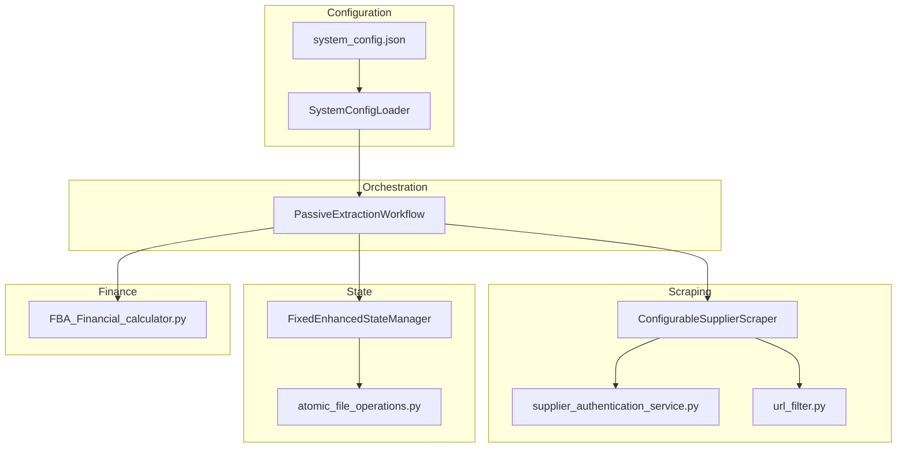
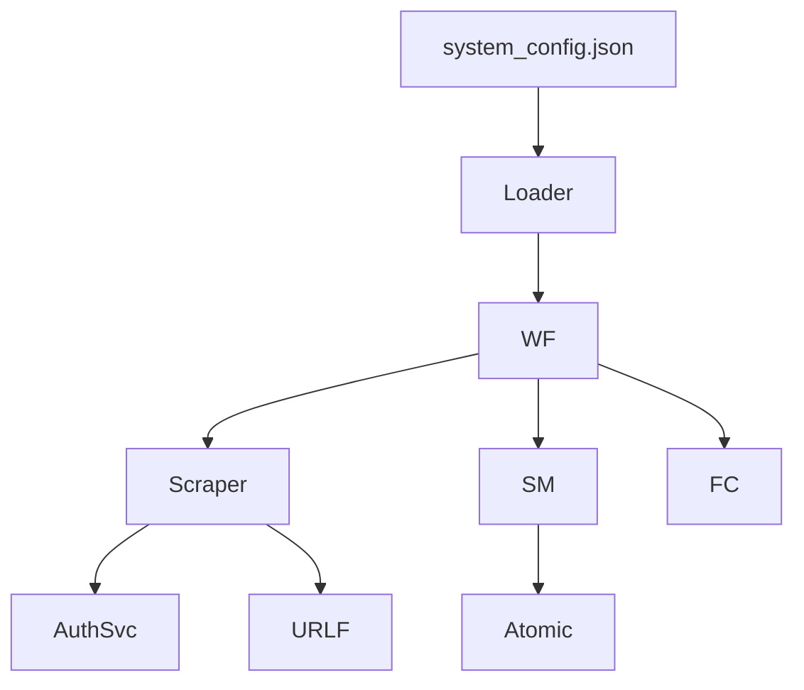
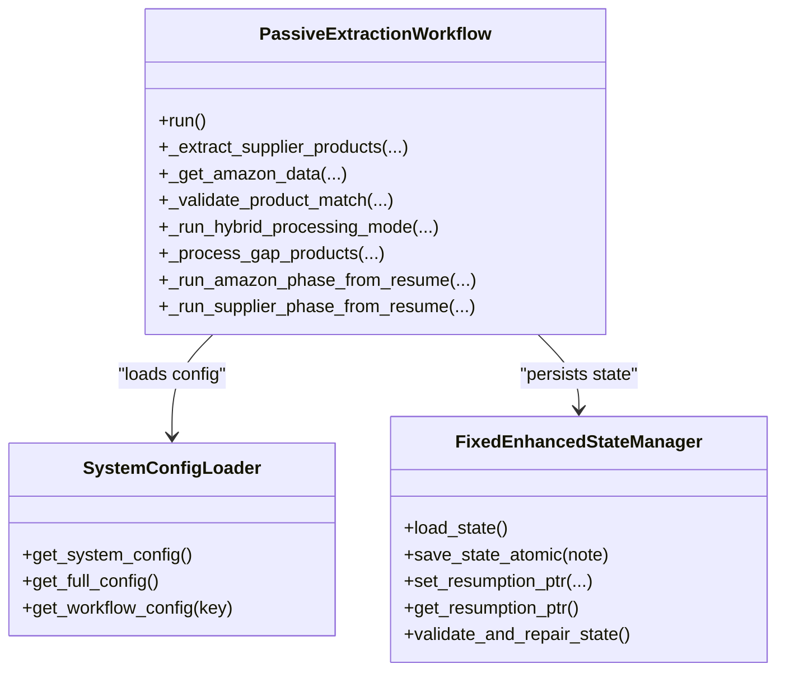
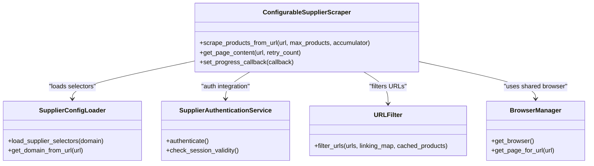
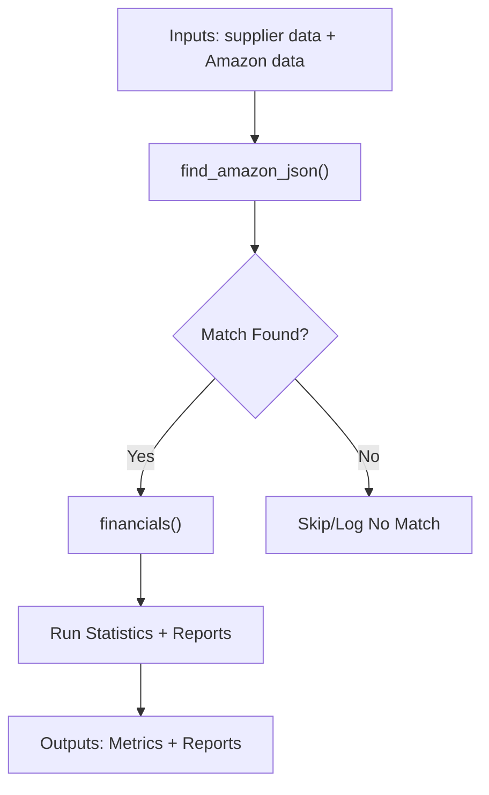
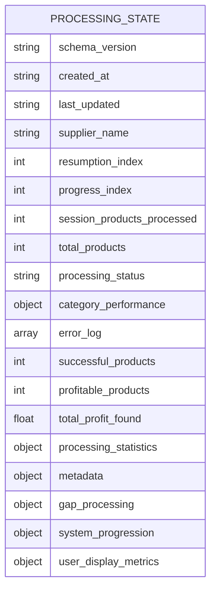
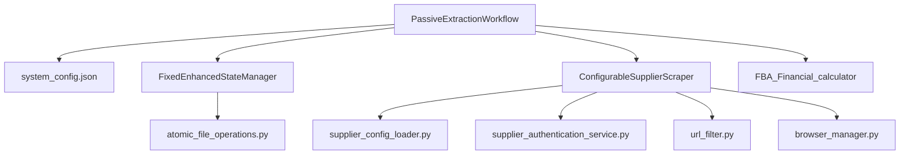
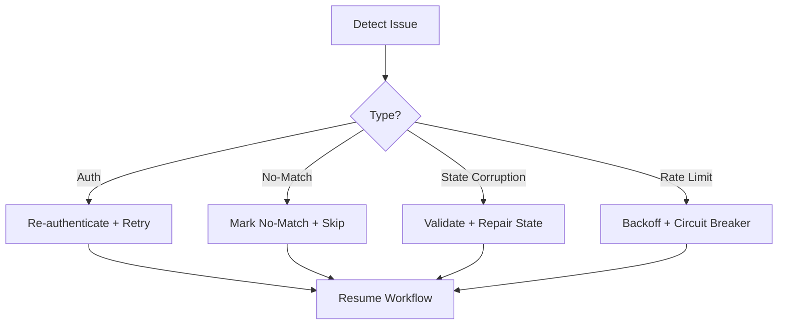

# API Reference

<cite>
**Referenced Files in This Document**
- [10.1. Workflow Orchestration Api.md](file://wiki-dec-3/10. Api Reference/10.1. Workflow Orchestration Api.md)
- [10.2. Supplier Scraper Api.md](file://wiki-dec-3/10. Api Reference/10.2. Supplier Scraper Api.md)
- [10.3. Financial Analysis Api.md](file://wiki-dec-3/10. Api Reference/10.3. Financial Analysis Api.md)
- [10.4. State Management Api.md](file://wiki-dec-3/10. Api Reference/10.4. State Management Api.md)
- [system_config.json](file://config/system_config.json)
- [system_config_loader.py](file://config/system_config_loader.py)
- [passive_extraction_workflow_latest.py](file://tools/passive_extraction_workflow_latest.py)
- [fixed_enhanced_state_manager.py](file://utils/fixed_enhanced_state_manager.py)
- [configurable_supplier_scraper.py](file://tools/configurable_supplier_scraper.py)
- [FBA_Financial_calculator.py](file://tools/FBA_Financial_calculator.py)
- [supplier_config_loader.py](file://config/supplier_config_loader.py)
- [supplier_authentication_service.py](file://tools/supplier_authentication_service.py)
- [url_filter.py](file://utils/url_filter.py)
- [browser_manager.py](file://utils/browser_manager.py)
- [atomic_file_operations.py](file://utils/atomic_file_operations.py)
- [processing_state.json](file://processing_states/poundwholesale_co_uk_processing_state.json)
- [API_REFERENCE.md](file://docs/API_REFERENCE.md)
- [system-config-toggle-v2.md](file://config/system-config-toggle-v2.md)
- [browser_circuit_breaker.py](file://utils/browser_circuit_breaker.py)
- [Security Challenges.md](file://wiki-dec-3/11. Troubleshooting Guide/11.5. Authentication Issues/11.5.3. Security Challenges.md)
</cite>

## Table of Contents
1. [Introduction](#introduction)
2. [Project Structure](#project-structure)
3. [Core Components](#core-components)
4. [Architecture Overview](#architecture-overview)
5. [Detailed Component Analysis](#detailed-component-analysis)
6. [Dependency Analysis](#dependency-analysis)
7. [Performance Considerations](#performance-considerations)
8. [Troubleshooting Guide](#troubleshooting-guide)
9. [Conclusion](#conclusion)
10. [Appendices](#appendices)

## Introduction
This document provides comprehensive API documentation for the Amazon FBA Agent System, focusing on four primary domains:
- Workflow Orchestration APIs: Orchestrate end-to-end product sourcing from supplier discovery to Amazon matching and financial analysis.
- Supplier Scraper APIs: Extract product data from supplier websites with configurable selectors, authentication, and anti-detection strategies.
- Financial Analysis APIs: Compute profitability metrics (ROI, net profit, breakeven) using supplier and Amazon data.
- State Management APIs: Persist and recover processing state with atomic writes, thread safety, and resumption pointers.

The system emphasizes resilience, configurability, and performance through file-grounded state, hash-based deduplication, and structured workflows.

## Project Structure
The system is organized into modular components:
- Orchestrator: Workflow orchestration and phase management
- Scraper: Supplier data extraction with Playwright and selector-based parsing
- State Manager: Persistent, atomic state with resumption and validation
- Financial Calculator: Profitability computations and report generation
- Configuration: Centralized JSON configuration and loader utilities
- Utilities: URL filtering, normalization, atomic file operations, and browser management

**Diagram sources**
- [system_config.json](file://config/system_config.json#L1-L200)
- [system_config_loader.py](file://config/system_config_loader.py#L1-L84)
- [passive_extraction_workflow_latest.py](file://tools/passive_extraction_workflow_latest.py#L851-L2650)
- [configurable_supplier_scraper.py](file://tools/configurable_supplier_scraper.py#L1-L3938)
- [supplier_authentication_service.py](file://tools/supplier_authentication_service.py#L1-L114)
- [url_filter.py](file://utils/url_filter.py#L1-L40)
- [fixed_enhanced_state_manager.py](file://utils/fixed_enhanced_state_manager.py#L1-L100)
- [atomic_file_operations.py](file://utils/atomic_file_operations.py#L1-L100)
- [FBA_Financial_calculator.py](file://tools/FBA_Financial_calculator.py#L1-L200)

**Section sources**
- [10.1. Workflow Orchestration Api.md](file://wiki-dec-3/10. Api Reference/10.1. Workflow Orchestration Api.md#L17-L64)
- [10.2. Supplier Scraper Api.md](file://wiki-dec-3/10. Api Reference/10.2. Supplier Scraper Api.md#L16-L53)
- [10.3. Financial Analysis Api.md](file://wiki-dec-3/10. Api Reference/10.3. Financial Analysis Api.md#L15-L36)
- [10.4. State Management Api.md](file://wiki-dec-3/10. Api Reference/10.4. State Management Api.md#L17-L51)

## Core Components
- PassiveExtractionWorkflow: Orchestrates supplier extraction, Amazon matching, gap processing, and financial analysis with phase-aware execution and resumption.
- ConfigurableSupplierScraper: Extracts supplier product data using Playwright, configurable selectors, and authentication callbacks.
- FixedEnhancedStateManager: Manages resilient, atomic state persistence with resumption pointers, progress tracking, and validation.
- FBA_Financial_calculator: Computes profitability metrics using supplier and Amazon data, with VAT handling and linking-map-based matching.
- SystemConfigLoader: Loads and exposes system configuration for workflows, limits, performance, and financial parameters.

**Section sources**
- [10.1. Workflow Orchestration Api.md](file://wiki-dec-3/10. Api Reference/10.1. Workflow Orchestration Api.md#L20-L64)
- [10.2. Supplier Scraper Api.md](file://wiki-dec-3/10. Api Reference/10.2. Supplier Scraper Api.md#L44-L50)
- [10.3. Financial Analysis Api.md](file://wiki-dec-3/10. Api Reference/10.3. Financial Analysis Api.md#L15-L36)
- [10.4. State Management Api.md](file://wiki-dec-3/10. Api Reference/10.4. State Management Api.md#L17-L51)

## Architecture Overview
The system follows a layered architecture:
- Configuration layer: Centralized JSON configuration and loader
- Orchestration layer: Workflow phases and resumption logic
- Extraction layer: Supplier scraping with authentication and URL filtering
- State layer: Atomic persistence and validation
- Finance layer: Profitability computation and reporting

**Diagram sources**
- [system_config.json](file://config/system_config.json#L1-L200)
- [system_config_loader.py](file://config/system_config_loader.py#L1-L84)
- [passive_extraction_workflow_latest.py](file://tools/passive_extraction_workflow_latest.py#L851-L2650)
- [configurable_supplier_scraper.py](file://tools/configurable_supplier_scraper.py#L1-L3938)
- [supplier_authentication_service.py](file://tools/supplier_authentication_service.py#L1-L114)
- [url_filter.py](file://utils/url_filter.py#L1-L40)
- [fixed_enhanced_state_manager.py](file://utils/fixed_enhanced_state_manager.py#L1-L100)
- [atomic_file_operations.py](file://utils/atomic_file_operations.py#L1-L100)
- [FBA_Financial_calculator.py](file://tools/FBA_Financial_calculator.py#L1-L200)

## Detailed Component Analysis

### Workflow Orchestration API
- Purpose: End-to-end orchestration of supplier extraction, Amazon matching, gap processing, and financial analysis.
- Key methods and responsibilities:
  - run(): Executes the workflow with hash optimization and file-based progress tracking.
  - _extract_supplier_products(): Scrapes supplier products in batches with rate limiting.
  - _get_amazon_data(): Two-step matching using EAN then title similarity.
  - _validate_product_match(): Confidence scoring for matched products.
  - _run_hybrid_processing_mode(): Alternates supplier and Amazon phases.
  - _process_gap_products(): Handles unmatched entries and resumption.
  - _run_amazon_phase_from_resume(), _run_supplier_phase_from_resume(): Resume points by phase.
- Configuration: Loaded via SystemConfigLoader with sections for system, processing_limits, performance, cache, monitoring, output, and analysis.
- State management: Uses FixedEnhancedStateManager for atomic saves, resumption pointers, and validation.

**Diagram sources**
- [passive_extraction_workflow_latest.py](file://tools/passive_extraction_workflow_latest.py#L851-L2650)
- [system_config_loader.py](file://config/system_config_loader.py#L1-L84)
- [fixed_enhanced_state_manager.py](file://utils/fixed_enhanced_state_manager.py#L1-L100)

**Section sources**
- [10.1. Workflow Orchestration Api.md](file://wiki-dec-3/10. Api Reference/10.1. Workflow Orchestration Api.md#L28-L64)
- [API_REFERENCE.md](file://docs/API_REFERENCE.md#L15-L120)

### Supplier Scraper API
- Purpose: Extract supplier product data with configurable selectors, authentication, and anti-detection.
- Core components:
  - ConfigurableSupplierScraper: Playwright-based scraper with AI fallbacks, rate limiting, and progress callbacks.
  - SupplierConfigLoader: Loads domain-specific selector configurations from JSON.
  - URLFilter: Filters URLs based on linking map and product cache presence.
  - SupplierAuthenticationService: Maintains valid sessions and handles authentication fallbacks.
  - BrowserManager: Centralized Chrome CDP management for shared browser instances.
- Key capabilities:
  - Configurable selector-based extraction with AI-powered fallbacks.
  - Intelligent URL filtering to avoid redundant processing.
  - Proactive authentication checks to prevent session expiration.
  - Shared Chrome instance for efficient resource utilization.

**Diagram sources**
- [configurable_supplier_scraper.py](file://tools/configurable_supplier_scraper.py#L1-L3938)
- [supplier_config_loader.py](file://config/supplier_config_loader.py#L1-L187)
- [supplier_authentication_service.py](file://tools/supplier_authentication_service.py#L1-L114)
- [url_filter.py](file://utils/url_filter.py#L1-L40)
- [browser_manager.py](file://utils/browser_manager.py)

**Section sources**
- [10.2. Supplier Scraper Api.md](file://wiki-dec-3/10. Api Reference/10.2. Supplier Scraper Api.md#L44-L86)

### Financial Analysis API
- Purpose: Compute profitability metrics (ROI, net profit, breakeven) using supplier and Amazon data.
- Core methods:
  - financials(): Calculates metrics including supplier price (inc/ex VAT), selling price, referral fee, FBA fee, HMRC obligations, net profit, ROI, breakeven, and profit margin.
  - run_calculations(): Executes the core workflow for a supplier, generating financial reports and statistics.
  - find_amazon_json(): Hierarchical matching using linking map, ASIN, filename, and fuzzy title matching.
- Inputs:
  - purchase_price, shipping_costs, amazon_fees, selling_price, supplier_name, optional paths for supplier cache, output directory, and Amazon scrape data.
- Outputs:
  - Dictionary with financial metrics and statistics; CSV/JSON reports in supplier-specific directories.

**Diagram sources**
- [FBA_Financial_calculator.py](file://tools/FBA_Financial_calculator.py#L210-L555)

**Section sources**
- [10.3. Financial Analysis Api.md](file://wiki-dec-3/10. Api Reference/10.3. Financial Analysis Api.md#L21-L103)

### State Management API
- Purpose: Persist and recover processing state with atomic writes, thread safety, and resumption pointers.
- Key methods:
  - load_state(), save_state_atomic(), save_debounced(): Atomic persistence with file locking.
  - set_resumption_ptr(), get_resumption_ptr(): Phase-aware resumption with monotonicity validation.
  - update_processing_progress(), initialize_category_processing(), mark_category_completed(): Progress tracking.
  - validate_and_repair_state(), force_cache_rebuild(): Error recovery and cache rebuild.
- Data schema:
  - Fields include schema_version, timestamps, supplier_name, resumption_index, progress_index, session_products_processed, total_products, processing_status, category_performance, error_log, and structured sections for system_progression, gap_processing, metadata, and user_display_metrics.

**Diagram sources**
- [fixed_enhanced_state_manager.py](file://utils/fixed_enhanced_state_manager.py#L138-L200)
- [processing_state.json](file://processing_states/poundwholesale_co_uk_processing_state.json#L1-L100)

**Section sources**
- [10.4. State Management Api.md](file://wiki-dec-3/10. Api Reference/10.4. State Management Api.md#L134-L177)

## Dependency Analysis
- Workflow Orchestration depends on:
  - SystemConfigLoader for configuration
  - FixedEnhancedStateManager for state persistence
  - ConfigurableSupplierScraper for supplier data
  - FBA_Financial_calculator for profitability analysis
- Supplier Scraper depends on:
  - SupplierConfigLoader for selectors
  - SupplierAuthenticationService for sessions
  - URLFilter for deduplication
  - BrowserManager for shared Chrome
- State Manager depends on:
  - AtomicFileOperations for atomic writes
  - Normalization utilities for URL handling

**Diagram sources**
- [passive_extraction_workflow_latest.py](file://tools/passive_extraction_workflow_latest.py#L851-L2650)
- [system_config.json](file://config/system_config.json#L1-L200)
- [fixed_enhanced_state_manager.py](file://utils/fixed_enhanced_state_manager.py#L1-L100)
- [configurable_supplier_scraper.py](file://tools/configurable_supplier_scraper.py#L1-L3938)
- [supplier_config_loader.py](file://config/supplier_config_loader.py#L1-L187)
- [supplier_authentication_service.py](file://tools/supplier_authentication_service.py#L1-L114)
- [url_filter.py](file://utils/url_filter.py#L1-L40)
- [browser_manager.py](file://utils/browser_manager.py)
- [atomic_file_operations.py](file://utils/atomic_file_operations.py#L1-L100)

**Section sources**
- [10.1. Workflow Orchestration Api.md](file://wiki-dec-3/10. Api Reference/10.1. Workflow Orchestration Api.md#L178-L203)
- [10.2. Supplier Scraper Api.md](file://wiki-dec-3/10. Api Reference/10.2. Supplier Scraper Api.md#L176-L203)
- [10.4. State Management Api.md](file://wiki-dec-3/10. Api Reference/10.4. State Management Api.md#L178-L207)

## Performance Considerations
- Hash-based deduplication: Reduces processing time by filtering duplicates across categories using O(1) lookups.
- File-grounded progress tracking: Ensures accuracy and avoids memory pressure.
- Sliding window memory management: Keeps recent items in memory while persisting progress to files.
- Rate limiting and backoff: Controlled delays between requests to avoid supplier throttling.
- Shared Chrome via CDP: Minimizes browser startup overhead and improves throughput.
- Atomic state persistence: Prevents corruption and supports crash recovery without manual intervention.

**Section sources**
- [API_REFERENCE.md](file://docs/API_REFERENCE.md#L64-L120)
- [10.2. Supplier Scraper Api.md](file://wiki-dec-3/10. Api Reference/10.2. Supplier Scraper Api.md#L204-L206)
- [10.4. State Management Api.md](file://wiki-dec-3/10. Api Reference/10.4. State Management Api.md#L178-L207)

## Troubleshooting Guide
- Authentication failures: Trigger re-login attempts and session validation; proactive checks every N products.
- No-match handling: Creates no-match entries to prevent infinite reprocessing loops.
- State corruption: Automatic validation and repair; can force cache rebuild when needed.
- IP blocking and rate limiting: Implement exponential backoff, random delays, proxy rotation, and circuit breakers.
- Security challenges: Monitor for suspicious patterns; apply preventive security checks and configuration validation.

**Diagram sources**
- [passive_extraction_workflow_latest.py](file://tools/passive_extraction_workflow_latest.py#L2700-L2800)
- [fixed_enhanced_state_manager.py](file://utils/fixed_enhanced_state_manager.py#L2000-L2200)
- [browser_circuit_breaker.py](file://utils/browser_circuit_breaker.py#L0-L213)

**Section sources**
- [10.1. Workflow Orchestration Api.md](file://wiki-dec-3/10. Api Reference/10.1. Workflow Orchestration Api.md#L352-L395)
- [10.4. State Management Api.md](file://wiki-dec-3/10. Api Reference/10.4. State Management Api.md#L208-L232)
- [Security Challenges.md](file://wiki-dec-3/11. Troubleshooting Guide/11.5. Authentication Issues/11.5.3. Security Challenges.md#L94-L116)

## Conclusion
The Amazon FBA Agent System provides robust, configurable APIs for workflow orchestration, supplier scraping, financial analysis, and state management. Its emphasis on atomic state persistence, hash-based deduplication, and resilient error handling enables reliable, high-performance operations across long-running product sourcing workflows.

## Appendices

### Configuration and Versioning
- Configuration structure: system, processing_limits, supplier_extraction_progress, hybrid_processing, batch_synchronization, performance, cache, monitoring, output, chrome, analysis, amazon, supplier, credentials, workflows, ai_features, integrations, authentication, surgical_fixes.
- Versioning: Schema versioning and migration logic in state management; configuration loader provides fallbacks for missing parameters.

**Section sources**
- [system_config.json](file://config/system_config.json#L1-L200)
- [system_config_loader.py](file://config/system_config_loader.py#L1-L84)
- [10.1. Workflow Orchestration Api.md](file://wiki-dec-3/10. Api Reference/10.1. Workflow Orchestration Api.md#L396-L420)

### Authentication and Security
- Authentication fallbacks during scraping and session validation.
- Rate limiting strategies and circuit breaker patterns to mitigate IP blocking.
- Security checks for sensitive data exposure and configuration validation.

**Section sources**
- [10.1. Workflow Orchestration Api.md](file://wiki-dec-3/10. Api Reference/10.1. Workflow Orchestration Api.md#L352-L381)
- [Security Challenges.md](file://wiki-dec-3/11. Troubleshooting Guide/11.5. Authentication Issues/11.5.3. Security Challenges.md#L94-L116)
- [system-config-toggle-v2.md](file://config/system-config-toggle-v2.md#L136-L182)