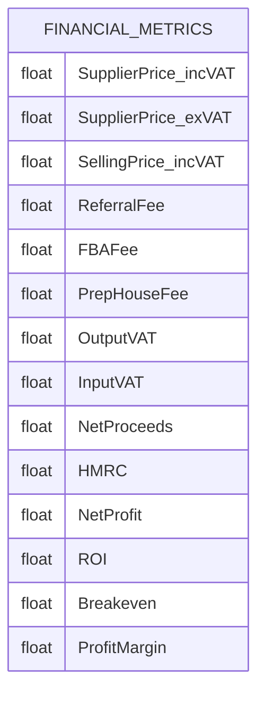

# Financial Analysis API

<cite>
**Referenced Files in This Document**   
- [FBA_Financial_calculator.py](file://tools/FBA_Financial_calculator.py)
- [system_config.json](file://config/system_config.json)
</cite>

## Table of Contents
1. [Introduction](#introduction)
2. [Core Methods](#core-methods)
3. [Input Parameters](#input-parameters)
4. [Return Structure](#return-structure)
5. [Practical Examples](#practical-examples)
6. [VAT Adjustment and Investment Screening](#vat-adjustment-and-investment-screening)
7. [Error Conditions](#error-conditions)
8. [Extensibility](#extensibility)

## Introduction
The FBA_Financial_calculator.py module provides a comprehensive financial analysis system for Amazon FBA product profitability. It calculates key financial metrics including ROI, net profit, and breakeven points by integrating supplier pricing data with Amazon marketplace information. The calculator uses configuration from system_config.json to determine VAT rates, fee structures, and other financial parameters. It supports supplier-specific path generation and enhanced product matching through linking maps. The system processes supplier product data, matches it with Amazon listing information, and generates detailed financial reports with profitability analysis.

**Section sources**
- [FBA_Financial_calculator.py](file://tools/FBA_Financial_calculator.py#L1-L50)

## Core Methods

### financials()
Calculates comprehensive financial metrics for Amazon FBA products. This function takes supplier and Amazon product data along with the supplier price (including VAT) to compute profitability indicators. It extracts Amazon pricing from multiple possible fields ('current_price', 'price', 'original_price', 'amazon_price') and retrieves referral and FBA fees from Keepa data when available. The function handles VAT calculations based on the supplier's pricing configuration and computes net proceeds, HMRC obligations, net profit, ROI, breakeven point, and profit margin.

### run_calculations()
Executes the core financial calculation workflow for a supplier. This function requires a supplier name to generate supplier-specific paths and can optionally accept custom paths for the supplier cache, output directory, and Amazon scrape data. It processes all supplier products, matches them with Amazon data using multiple lookup methods (linking map, ASIN, EAN, URL, and fuzzy title matching), and generates financial calculations for each matched product. The function returns a comprehensive results dictionary containing the analysis dataframe, statistics, and processing information.

### find_amazon_json()
Finds Amazon product data by searching through multiple methods in order of reliability. The primary method uses a linking map to match supplier products (by EAN or URL) to Amazon ASINs. If no linking map match is found, it attempts direct ASIN lookup, followed by filename matching (with EAN enhancement, standard ASIN format, or partial matching), and finally fuzzy title matching. This hierarchical approach ensures maximum product matching success across different data quality scenarios.

**Section sources**
- [FBA_Financial_calculator.py](file://tools/FBA_Financial_calculator.py#L318-L390)
- [FBA_Financial_calculator.py](file://tools/FBA_Financial_calculator.py#L392-L555)
- [FBA_Financial_calculator.py](file://tools/FBA_Financial_calculator.py#L210-L288)

## Input Parameters
The financial calculator accepts the following input parameters for profitability analysis:

- **purchase_price**: The cost of acquiring the product from the supplier, provided as a float value in GBP. This represents the base cost before any additional fees or taxes.
- **shipping_costs**: Transportation expenses from supplier to Amazon fulfillment center, represented as a float in GBP. Currently set to 0.0 in the configuration but can be customized.
- **amazon_fees**: A dictionary containing Amazon fee information extracted from Keepa data, including referral fees and FBA fulfillment fees. These are automatically calculated based on the Amazon product listing.
- **selling_price**: The intended selling price on Amazon, which can be derived from 'current_price', 'price', 'original_price', or 'amazon_price' fields in the Amazon data. The system attempts to find the most accurate price from these sources.
- **supplier_name**: A required string identifier used to generate supplier-specific paths for cache files, financial reports, linking maps, and AI categories. This ensures data isolation between different suppliers.
- **supplier_cache_path**: Optional string path to the supplier's product cache JSON file. If not provided, the system generates a default path based on the supplier name.
- **output_dir**: Optional string path to save financial reports. If not specified, uses the default financial reports directory for the supplier.
- **amazon_scrape_dir**: Optional string path to the directory containing Amazon scrape data. Defaults to the standard Amazon cache directory if not provided.

All input parameters are validated, with supplier_name being required and other parameters having default values or fallback mechanisms.

**Section sources**
- [FBA_Financial_calculator.py](file://tools/FBA_Financial_calculator.py#L392-L555)
- [FBA_Financial_calculator.py](file://tools/FBA_Financial_calculator.py#L318-L390)

## Return Structure
The financial calculator returns a comprehensive dictionary structure containing financial metrics and risk indicators:

The return structure includes:
- **SupplierPrice_incVAT**: Supplier cost including VAT
- **SupplierPrice_exVAT**: Supplier cost excluding VAT
- **SellingPrice_incVAT**: Amazon selling price including VAT
- **ReferralFee**: Amazon's commission fee
- **FBAFee**: Fulfillment by Amazon fee
- **PrepHouseFee**: Fixed preparation house fee (configurable)
- **OutputVAT**: VAT collected on sales
- **InputVAT**: VAT paid on purchases
- **NetProceeds**: Revenue after fees and VAT but before HMRC and prep costs
- **HMRC**: VAT payable to tax authorities (output VAT minus input VAT)
- **NetProfit**: Final profit after all costs and fees
- **ROI**: Return on Investment percentage
- **Breakeven**: Minimum selling price to avoid losses
- **ProfitMargin**: Profit as percentage of revenue

The run_calculations function returns additional statistics including processed counts, match statistics, and top-performing products.

**Diagram sources**
- [FBA_Financial_calculator.py](file://tools/FBA_Financial_calculator.py#L318-L390)

**Section sources**
- [FBA_Financial_calculator.py](file://tools/FBA_Financial_calculator.py#L318-L390)

## Practical Examples

### Electronics Product Analysis
For an electronics item with a supplier price of £5.00 (including VAT), the calculator would:
1. Retrieve the Amazon selling price (e.g., £12.99)
2. Extract referral fee (15% of selling price) and FBA fee from Keepa data
3. Calculate input VAT based on 20% VAT rate
4. Compute net profit after all fees and taxes
5. Determine ROI based on ex-VAT supplier cost plus prep and shipping fees
6. Generate a complete financial profile showing profitability metrics

### Home Goods Product Analysis
For a home goods item with supplier price of £3.50 (excluding VAT as per supplier configuration):
1. Calculate input VAT (20% of £3.50 = £0.70)
2. Determine total supplier cost including VAT (£4.20)
3. Use Amazon selling price (e.g., £9.99) to calculate referral fee
4. Apply standard FBA fee or extract specific fee from Keepa data
5. Calculate net proceeds, HMRC obligation, and final net profit
6. Compute ROI based on ex-VAT cost basis

The system automatically handles different supplier pricing configurations (whether prices include VAT or not) and applies the appropriate VAT calculations.

**Section sources**
- [FBA_Financial_calculator.py](file://tools/FBA_Financial_calculator.py#L318-L390)
- [system_config.json](file://config/system_config.json#L250-L260)

## VAT Adjustment and Investment Screening
The financial calculator integrates with VAT adjustment logic through configuration settings in system_config.json. The VAT rate is loaded from the configuration (defaulting to 0.2 if not specified) and applied to all calculations. The system respects the supplier's pricing model through the SUPPLIER_PRICES_INCLUDE_VAT setting, which determines whether supplier prices are treated as inclusive or exclusive of VAT.

For investment screening workflows, the calculator provides the foundational financial data used by screening scripts like UK_VAT_Adjusted_Investment_Screening.py. The run_calculations function generates comprehensive financial reports that can be used to categorize products into investment tiers based on ROI, net profit, and sales volume. The output includes statistics that support investment decisions, such as the count of profitable products (ROI > 30%), marginal products (0-30% ROI), and unprofitable products (ROI ≤ 0).

The integration allows for sophisticated investment screening that considers both profitability metrics and market factors, enabling data-driven decisions about which products to source and sell on Amazon FBA.

**Section sources**
- [FBA_Financial_calculator.py](file://tools/FBA_Financial_calculator.py#L25-L30)
- [FBA_Financial_calculator.py](file://tools/FBA_Financial_calculator.py#L392-L555)
- [system_config.json](file://config/system_config.json#L250-L260)

## Error Conditions
The financial calculator handles several error conditions:

- **Missing supplier_name**: Raises ValueError if supplier_name is not provided, as it's required for path generation
- **Invalid file paths**: Raises FileNotFoundError if specified directories do not exist, with specific debugging for amazon_dir
- **Cache reading errors**: Raises Exception for FileNotFoundError or JSONDecodeError when reading supplier cache
- **Missing price data**: Returns empty dictionary if no price is found in Amazon data, with warning messages
- **No matching records**: Raises Exception if no matching Amazon records are found after processing all supplier products
- **Invalid input ranges**: Handles edge cases like zero total cost in ROI calculation by returning 0 instead of division by zero

The system includes comprehensive logging and debugging information, particularly for the amazon_dir validation, to help diagnose path-related issues. It also provides detailed warnings when price data is missing from Amazon listings, including information about available fields and data keys.

**Section sources**
- [FBA_Financial_calculator.py](file://tools/FBA_Financial_calculator.py#L410-L425)
- [FBA_Financial_calculator.py](file://tools/FBA_Financial_calculator.py#L450-L455)
- [FBA_Financial_calculator.py](file://tools/FBA_Financial_calculator.py#L530-L535)
- [FBA_Financial_calculator.py](file://tools/FBA_Financial_calculator.py#L330-L335)

## Extensibility
The financial calculator can be extended in several ways:

### Custom Financial Models
Developers can extend the system by:
- Creating subclasses of the core calculation functions
- Implementing alternative ROI calculation methods
- Adding new financial metrics to the return structure
- Integrating additional fee structures or cost factors
- Modifying the VAT calculation logic for different tax regimes

### Marketplace-Specific Fee Structures
The system supports marketplace-specific configurations through:
- Custom fee schedules in system_config.json
- Marketplace-specific prep cost settings
- Variable referral fee rates based on category
- Localized VAT/tax handling for different countries
- Currency conversion integration

### Integration Points
Key extension points include:
- The financials() function for custom profit calculations
- The run_calculations() function for workflow customization
- The find_amazon_json() chain for alternative product matching strategies
- The configuration loading system for custom parameters
- The output generation for alternative report formats

Developers can also extend the system by implementing new data sources, adding machine learning models for price prediction, or integrating with external financial systems.

**Section sources**
- [FBA_Financial_calculator.py](file://tools/FBA_Financial_calculator.py#L25-L30)
- [FBA_Financial_calculator.py](file://tools/FBA_Financial_calculator.py#L318-L390)
- [system_config.json](file://config/system_config.json#L250-L260)