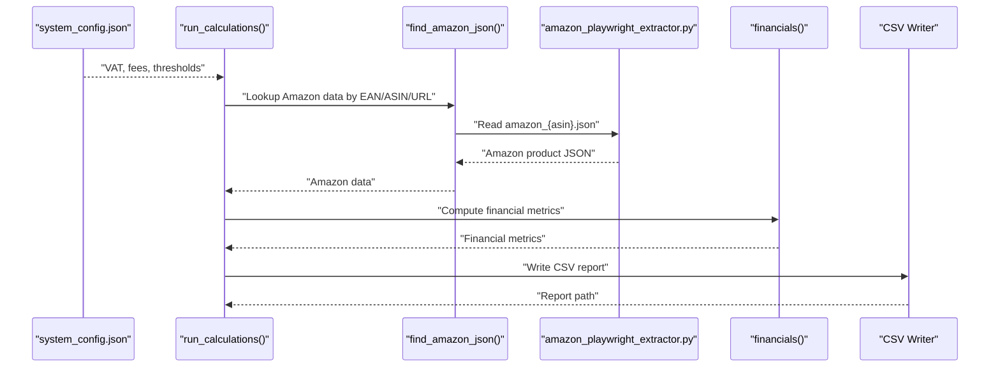
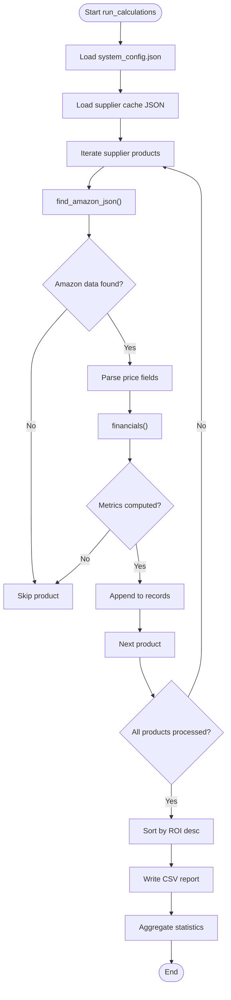
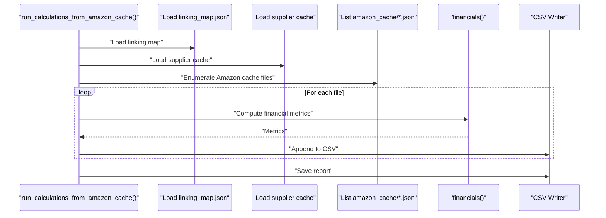
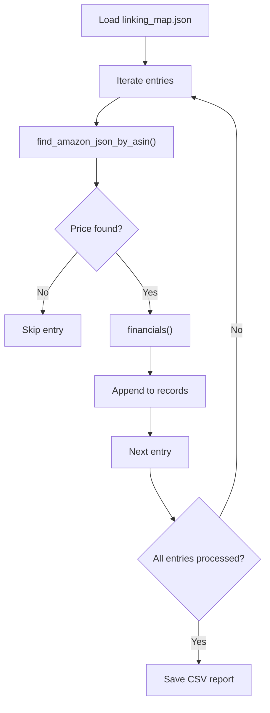
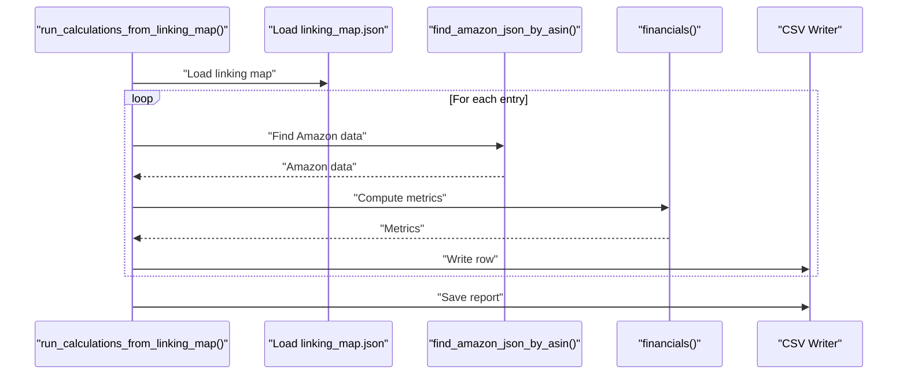
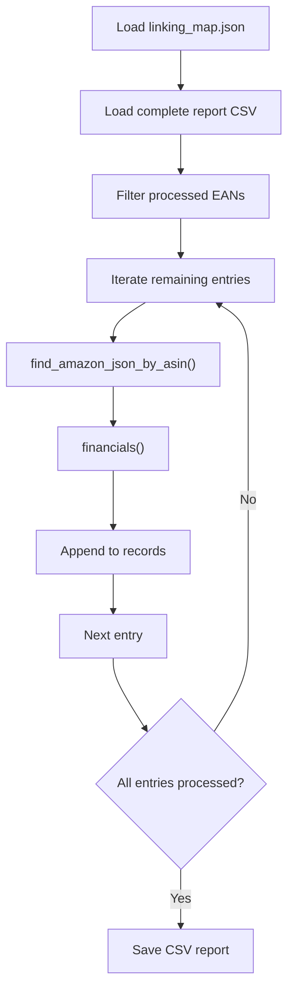
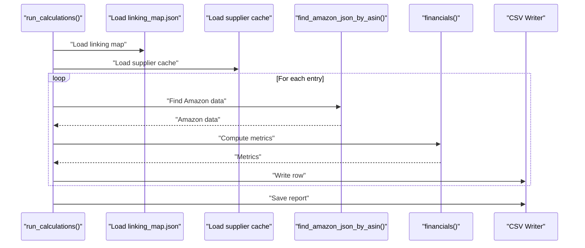
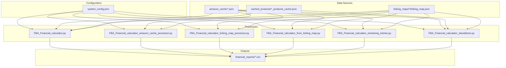

# Financial Analysis API

<cite>
**Referenced Files in This Document**
- [FBA_Financial_calculator.py](file://tools/FBA_Financial_calculator.py)
- [FBA_Financial_calculator_amazon_cache_processor.py](file://tools/FBA_Financial_calculator_amazon_cache_processor.py)
- [FBA_Financial_calculator_linking_map_processor.py](file://tools/FBA_Financial_calculator_linking_map_processor.py)
- [FBA_Financial_calculator_from_linking_map.py](file://tools/FBA_Financial_calculator_from_linking_map.py)
- [FBA_Financial_calculator_remaining_entries.py](file://tools/FBA_Financial_calculator_remaining_entries.py)
- [FBA_Financial_calculator_standalone.py](file://tools/FBA_Financial_calculator_standalone.py)
- [system_config.json](file://config/system_config.json)
- [amazon_playwright_extractor.py](file://tools/amazon_playwright_extractor.py)
</cite>

## Table of Contents
1. [Introduction](#introduction)
2. [Project Structure](#project-structure)
3. [Core Components](#core-components)
4. [Architecture Overview](#architecture-overview)
5. [Detailed Component Analysis](#detailed-component-analysis)
6. [Dependency Analysis](#dependency-analysis)
7. [Performance Considerations](#performance-considerations)
8. [Troubleshooting Guide](#troubleshooting-guide)
9. [Conclusion](#conclusion)
10. [Appendices](#appendices)

## Introduction
This document provides API documentation for the Financial Analysis module that powers FBA (Fulfillment by Amazon) profitability analysis. It covers the FBA_Financial_calculator class and related financial processing functions, including fee calculation methods, ROI analysis, and profit margin calculations. It also documents the amazon_cache_processor functionality for processing Amazon product data and linking maps, along with practical examples for financial scenario modeling, profitability analysis, investment screening, currency conversion, tax calculations, and financial reporting generation. Finally, it includes performance optimization tips for large-scale financial computations.

## Project Structure
The Financial Analysis API is implemented as a suite of Python scripts under the tools directory, each focused on a specific processing mode:
- FBA_Financial_calculator.py: Core financial calculations and report generation
- FBA_Financial_calculator_amazon_cache_processor.py: Processes all Amazon cache files and generates financial reports
- FBA_Financial_calculator_linking_map_processor.py: Uses linking maps as the primary data source
- FBA_Financial_calculator_from_linking_map.py: Generates complete financial reports from linking maps
- FBA_Financial_calculator_remaining_entries.py: Processes remaining entries after a complete report
- FBA_Financial_calculator_standalone.py: Standalone processor for a specific linking map
- system_config.json: Centralized configuration for VAT rates, fee defaults, and analysis thresholds
- amazon_playwright_extractor.py: Produces Amazon cache files consumed by the financial calculators

```mermaid
graph TB
subgraph "Financial Analysis API"
A["FBA_Financial_calculator.py"]
B["FBA_Financial_calculator_amazon_cache_processor.py"]
C["FBA_Financial_calculator_linking_map_processor.py"]
D["FBA_Financial_calculator_from_linking_map.py"]
E["FBA_Financial_calculator_remaining_entries.py"]
F["FBA_Financial_calculator_standalone.py"]
end
subgraph "Configuration"
G["system_config.json"]
end
subgraph "Data Sources"
H["OUTPUTS/FBA_ANALYSIS/amazon_cache/*.json"]
I["OUTPUTS/cached_products/*_products_cache.json"]
J["OUTPUTS/FBA_ANALYSIS/linking_maps/*/linking_map.json"]
K["OUTPUTS/FBA_ANALYSIS/financial_reports/"]
end
A --> H
A --> I
A --> J
A --> K
B --> H
B --> I
B --> J
B --> K
C --> H
C --> J
C --> K
D --> H
D --> J
D --> K
E --> H
E --> J
E --> K
F --> H
F --> I
F --> J
F --> K
A --> G
B --> G
C --> G
D --> G
E --> G
F --> G
```

**Diagram sources**
- [FBA_Financial_calculator.py](file://tools/FBA_Financial_calculator.py#L1-L712)
- [FBA_Financial_calculator_amazon_cache_processor.py](file://tools/FBA_Financial_calculator_amazon_cache_processor.py#L1-L455)
- [FBA_Financial_calculator_linking_map_processor.py](file://tools/FBA_Financial_calculator_linking_map_processor.py#L1-L429)
- [FBA_Financial_calculator_from_linking_map.py](file://tools/FBA_Financial_calculator_from_linking_map.py#L1-L408)
- [FBA_Financial_calculator_remaining_entries.py](file://tools/FBA_Financial_calculator_remaining_entries.py#L1-L465)
- [FBA_Financial_calculator_standalone.py](file://tools/FBA_Financial_calculator_standalone.py#L1-L561)
- [system_config.json](file://config/system_config.json#L1-L384)

**Section sources**
- [FBA_Financial_calculator.py](file://tools/FBA_Financial_calculator.py#L1-L712)
- [system_config.json](file://config/system_config.json#L1-L384)

## Core Components
This section documents the primary financial calculation functions and their roles in computing FBA profitability.

- financials(supplier_price_inc_vat, amazon):
  - Computes referral fee, FBA fee, VAT, net proceeds, net profit, ROI, breakeven price, and profit margin
  - Handles supplier price inclusion of VAT based on configuration
  - Parses Keepa product details for actual fee values when available
  - Returns a dictionary of financial metrics

- run_calculations(supplier_name, supplier_cache_path=None, output_dir=None, amazon_scrape_dir=None):
  - Orchestrates supplier cache loading, Amazon data lookup, financial calculations, and CSV report generation
  - Supports supplier-specific paths and validates Amazon cache directory existence
  - Aggregates statistics including processed, matched, and profitability counts

- find_amazon_json(ean, asin, title, url=None, supplier_name=None):
  - Enhanced lookup using linking map, direct ASIN, legacy filename patterns, and fuzzy title matching
  - Returns Amazon product JSON for subsequent financial calculations

- extract_keepa_fees(product_details):
  - Parses Keepa product details tab to extract referral and FBA fees
  - Skips percentage fields and currency symbols, returning numeric values

- extract_enhanced_metrics(amazon_data):
  - Extracts monthly sales badge, total offer count, and FBA/FBM seller counts from Keepa data

- get_supplier_specific_paths(supplier_name):
  - Generates normalized paths for supplier cache, financial reports, linking maps, and AI categories

- load_system_config():
  - Loads configuration from system_config.json including VAT rate, prep house fee, referral fee rate, and analysis thresholds

- load_linking_map(supplier_name=None):
  - Caches and loads linking map with supplier-specific and generic fallbacks

- find_amazon_json_by_linking_map(ean, title, url, supplier_name=None):
  - Uses linking map to find Amazon data by EAN or URL

- find_amazon_json_by_asin(asin, ean=None):
  - Locates Amazon JSON by ASIN with EAN-enhanced filename support

- run_calculations_from_amazon_cache(supplier_name):
  - Processes all Amazon cache files and matches with supplier prices via linking map and supplier cache

- run_calculations_from_linking_map(supplier_name):
  - Uses linking map as the primary data source, embedding supplier price and metadata

- run_calculations():
  - Standalone processor for a specific linking map file

- run_calculations() (remaining entries):
  - Processes remaining entries from a complete linking map, generating a comprehensive report

**Section sources**
- [FBA_Financial_calculator.py](file://tools/FBA_Financial_calculator.py#L375-L470)
- [FBA_Financial_calculator.py](file://tools/FBA_Financial_calculator.py#L472-L664)
- [FBA_Financial_calculator.py](file://tools/FBA_Financial_calculator.py#L211-L261)
- [FBA_Financial_calculator.py](file://tools/FBA_Financial_calculator.py#L264-L311)
- [FBA_Financial_calculator.py](file://tools/FBA_Financial_calculator.py#L314-L372)
- [FBA_Financial_calculator.py](file://tools/FBA_Financial_calculator.py#L16-L36)
- [FBA_Financial_calculator.py](file://tools/FBA_Financial_calculator.py#L44-L54)
- [FBA_Financial_calculator.py](file://tools/FBA_Financial_calculator.py#L77-L132)
- [FBA_Financial_calculator.py](file://tools/FBA_Financial_calculator.py#L169-L205)
- [FBA_Financial_calculator_amazon_cache_processor.py](file://tools/FBA_Financial_calculator_amazon_cache_processor.py#L191-L409)
- [FBA_Financial_calculator_linking_map_processor.py](file://tools/FBA_Financial_calculator_linking_map_processor.py#L227-L382)
- [FBA_Financial_calculator_from_linking_map.py](file://tools/FBA_Financial_calculator_from_linking_map.py#L219-L360)
- [FBA_Financial_calculator_remaining_entries.py](file://tools/FBA_Financial_calculator_remaining_entries.py#L269-L424)
- [FBA_Financial_calculator_standalone.py](file://tools/FBA_Financial_calculator_standalone.py#L393-L529)

## Architecture Overview
The Financial Analysis API follows a modular architecture:
- Configuration-driven: VAT rates, fee defaults, and analysis thresholds are loaded from system_config.json
- Data sourcing: Amazon cache files (*.json) produced by amazon_playwright_extractor.py serve as the primary source of product pricing and marketplace metrics
- Matching: Linking maps connect supplier EANs/URLs to Amazon ASINs, enabling robust cross-referencing
- Calculation: The financials function computes all profitability metrics using consistent economic assumptions
- Reporting: CSV reports are generated per supplier with aggregated statistics

**Diagram sources**
- [FBA_Financial_calculator.py](file://tools/FBA_Financial_calculator.py#L472-L664)
- [FBA_Financial_calculator.py](file://tools/FBA_Financial_calculator.py#L211-L261)
- [system_config.json](file://config/system_config.json#L233-L246)
- [amazon_playwright_extractor.py](file://tools/amazon_playwright_extractor.py#L1-L200)

## Detailed Component Analysis

### FBA_Financial_calculator Module
The core financial computation engine resides in FBA_Financial_calculator.py. It defines:
- Configuration loading and defaults for VAT, referral fee rate, and prep house fee
- Enhanced Amazon data lookup using linking maps, ASIN, and legacy filename patterns
- Financial metric computation including referral fee, FBA fee, VAT, net proceeds, net profit, ROI, breakeven, and profit margin
- Supplier price handling for both inclusive and exclusive VAT scenarios
- Supplier-specific path generation and report writing

Key functions and their responsibilities:
- financials(): Central computation function returning a comprehensive set of financial metrics
- run_calculations(): Orchestration of supplier cache loading, Amazon data lookup, calculations, and CSV generation
- find_amazon_json(): Robust lookup supporting linking map, ASIN, and legacy patterns
- extract_keepa_fees(): Parses Keepa product details for accurate fee extraction
- extract_enhanced_metrics(): Extracts marketplace competition and sales metrics
- load_system_config(): Loads configuration with fallbacks
- load_linking_map(): Caches and loads linking maps with supplier-specific and generic fallbacks
- get_supplier_specific_paths(): Normalizes supplier names and generates output paths

**Diagram sources**
- [FBA_Financial_calculator.py](file://tools/FBA_Financial_calculator.py#L472-L664)
- [FBA_Financial_calculator.py](file://tools/FBA_Financial_calculator.py#L375-L470)

**Section sources**
- [FBA_Financial_calculator.py](file://tools/FBA_Financial_calculator.py#L1-L712)

### Amazon Cache Processor
The amazon cache processor in FBA_Financial_calculator_amazon_cache_processor.py processes all Amazon cache files and matches them with supplier prices to generate a complete financial report. It:
- Loads supplier cache and linking map
- Iterates through all Amazon cache files
- Matches products by EAN, linking map EAN->ASIN, or linking map URL->ASIN
- Extracts price and calculates financial metrics
- Writes a CSV report sorted by ROI

**Diagram sources**
- [FBA_Financial_calculator_amazon_cache_processor.py](file://tools/FBA_Financial_calculator_amazon_cache_processor.py#L191-L409)

**Section sources**
- [FBA_Financial_calculator_amazon_cache_processor.py](file://tools/FBA_Financial_calculator_amazon_cache_processor.py#L1-L455)

### Linking Map Processor
The linking map processor in FBA_Financial_calculator_linking_map_processor.py uses the linking map as the primary data source, eliminating the need for supplier cache. It:
- Loads linking map entries
- Finds Amazon data by ASIN with EAN-enhanced filename support
- Extracts price and computes financial metrics
- Generates a CSV report with aggregated statistics

**Diagram sources**
- [FBA_Financial_calculator_linking_map_processor.py](file://tools/FBA_Financial_calculator_linking_map_processor.py#L227-L382)

**Section sources**
- [FBA_Financial_calculator_linking_map_processor.py](file://tools/FBA_Financial_calculator_linking_map_processor.py#L1-L429)

### Linking Map as Source
The linking map as source processor in FBA_Financial_calculator_from_linking_map.py generates complete financial reports using linking maps as the primary data source. It:
- Loads linking map entries
- Uses embedded supplier price and metadata
- Finds Amazon data by ASIN and computes financial metrics
- Produces a comprehensive CSV report

**Diagram sources**
- [FBA_Financial_calculator_from_linking_map.py](file://tools/FBA_Financial_calculator_from_linking_map.py#L219-L360)

**Section sources**
- [FBA_Financial_calculator_from_linking_map.py](file://tools/FBA_Financial_calculator_from_linking_map.py#L1-L408)

### Remaining Entries Processor
The remaining entries processor in FBA_Financial_calculator_remaining_entries.py processes entries from a complete linking map that were not included in a prior financial report. It:
- Loads the complete linking map
- Optionally filters out entries already processed in a previous report
- Computes financial metrics for remaining entries
- Generates a comprehensive report

**Diagram sources**
- [FBA_Financial_calculator_remaining_entries.py](file://tools/FBA_Financial_calculator_remaining_entries.py#L269-L424)

**Section sources**
- [FBA_Financial_calculator_remaining_entries.py](file://tools/FBA_Financial_calculator_remaining_entries.py#L1-L465)

### Standalone Processor
The standalone processor in FBA_Financial_calculator_standalone.py demonstrates a specific workflow for a given linking map file and supplier cache. It:
- Hardcodes paths for demonstration
- Loads linking map and supplier cache
- Matches entries by EAN and finds Amazon data
- Computes financial metrics and writes a CSV report

**Diagram sources**
- [FBA_Financial_calculator_standalone.py](file://tools/FBA_Financial_calculator_standalone.py#L393-L529)

**Section sources**
- [FBA_Financial_calculator_standalone.py](file://tools/FBA_Financial_calculator_standalone.py#L1-L561)

## Dependency Analysis
The Financial Analysis API components share common dependencies and configuration:
- Configuration: system_config.json supplies VAT rate, referral fee rate, prep house fee, and analysis thresholds
- Data sources: OUTPUTS/FBA_ANALYSIS/amazon_cache/*.json, OUTPUTS/cached_products/*_products_cache.json, OUTPUTS/FBA_ANALYSIS/linking_maps/*/linking_map.json
- Output: OUTPUTS/FBA_ANALYSIS/financial_reports/ with CSV reports

**Diagram sources**
- [system_config.json](file://config/system_config.json#L233-L246)
- [FBA_Financial_calculator.py](file://tools/FBA_Financial_calculator.py#L1-L712)
- [FBA_Financial_calculator_amazon_cache_processor.py](file://tools/FBA_Financial_calculator_amazon_cache_processor.py#L1-L455)
- [FBA_Financial_calculator_linking_map_processor.py](file://tools/FBA_Financial_calculator_linking_map_processor.py#L1-L429)
- [FBA_Financial_calculator_from_linking_map.py](file://tools/FBA_Financial_calculator_from_linking_map.py#L1-L408)
- [FBA_Financial_calculator_remaining_entries.py](file://tools/FBA_Financial_calculator_remaining_entries.py#L1-L465)
- [FBA_Financial_calculator_standalone.py](file://tools/FBA_Financial_calculator_standalone.py#L1-L561)

**Section sources**
- [system_config.json](file://config/system_config.json#L1-L384)
- [FBA_Financial_calculator.py](file://tools/FBA_Financial_calculator.py#L1-L712)

## Performance Considerations
- Batch processing: Use linking map processors to avoid iterating through all supplier cache entries when linking map coverage is sufficient
- Caching: The load_linking_map function caches the linking map to reduce repeated disk reads
- File enumeration: Prefer linking map-based processing for large datasets to minimize file system overhead
- Memory management: For very large runs, consider splitting linking maps into chunks and processing incrementally
- Parallelization: Where safe, leverage asynchronous I/O for Amazon cache file reads and CSV writes
- Rate limiting: Respect system_config.json performance settings for concurrent requests and timeouts
- Filtering: Apply analysis thresholds early to reduce downstream computation

## Troubleshooting Guide
Common issues and resolutions:
- Missing Amazon data: The find_amazon_json function attempts multiple lookup strategies; verify linking map accuracy and cache filenames
- No price data: Ensure Amazon cache files contain current_price or price fields; check extractor configuration
- Supplier price not found: Verify supplier cache contains price fields and EAN alignment
- Configuration errors: Confirm system_config.json paths and values; ensure VAT and fee defaults are appropriate
- File path errors: Use get_supplier_specific_paths to generate normalized paths; validate directory existence
- Large-scale failures: Implement incremental processing and monitor processing statistics for partial results

**Section sources**
- [FBA_Financial_calculator.py](file://tools/FBA_Financial_calculator.py#L518-L520)
- [FBA_Financial_calculator.py](file://tools/FBA_Financial_calculator.py#L576-L583)
- [FBA_Financial_calculator_amazon_cache_processor.py](file://tools/FBA_Financial_calculator_amazon_cache_processor.py#L275-L277)
- [FBA_Financial_calculator_linking_map_processor.py](file://tools/FBA_Financial_calculator_linking_map_processor.py#L295-L298)

## Conclusion
The Financial Analysis API provides a robust, configuration-driven framework for FBA profitability analysis. By leveraging linking maps, Amazon cache files, and supplier data, it computes comprehensive financial metrics including referral fees, FBA fees, VAT, net proceeds, net profit, ROI, breakeven price, and profit margin. The modular design supports multiple processing modes, from linking map-centric analysis to full cache processing, enabling scalable and maintainable financial reporting.

## Appendices

### Parameter Specifications
- Cost inputs:
  - supplier_price_inc_vat: Supplier price including VAT (float)
  - PREP_COST: Prep house fixed fee (float)
  - SHIP_COST: Shipping cost (float)
- Pricing strategies:
  - selling_price_inc_vat: Amazon selling price including VAT (float)
  - referral_fee: Referral fee (float)
  - fba_fee: FBA fulfillment fee (float)
- Market conditions:
  - VAT_RATE: VAT rate (float)
  - Enhanced metrics: bought_in_past_month, fba_seller_count, fbm_seller_count, total_offer_count

**Section sources**
- [FBA_Financial_calculator.py](file://tools/FBA_Financial_calculator.py#L375-L470)
- [FBA_Financial_calculator.py](file://tools/FBA_Financial_calculator.py#L314-L372)
- [system_config.json](file://config/system_config.json#L233-L246)

### Examples

#### Financial Scenario Modeling
- Example: Compare profitability across different supplier price tiers while keeping Amazon price constant
- Example: Model ROI impact of reducing prep house fees or negotiating lower referral rates

#### Profitability Analysis
- Example: Rank top 5 items by ROI and export to CSV for stakeholder review
- Example: Segment products into profitable, marginal, and unprofitable categories based on configured thresholds

#### Investment Screening
- Example: Screen products meeting minimum ROI threshold and positive profit margin
- Example: Filter by marketplace competition metrics (FBA/FBM seller counts) from enhanced metrics

#### Currency Conversion and Tax Calculations
- Example: Convert supplier prices to GBP using configured currency and VAT rate
- Example: Separate input VAT (supplier) and output VAT (Amazon) for HMRC reporting

#### Financial Reporting Generation
- Example: Generate daily financial reports per supplier with aggregated statistics and top performers
- Example: Produce comprehensive reports from linking maps for historical analysis

**Section sources**
- [FBA_Financial_calculator.py](file://tools/FBA_Financial_calculator.py#L634-L664)
- [FBA_Financial_calculator_amazon_cache_processor.py](file://tools/FBA_Financial_calculator_amazon_cache_processor.py#L388-L409)
- [FBA_Financial_calculator_linking_map_processor.py](file://tools/FBA_Financial_calculator_linking_map_processor.py#L362-L382)
- [FBA_Financial_calculator_from_linking_map.py](file://tools/FBA_Financial_calculator_from_linking_map.py#L338-L360)
- [FBA_Financial_calculator_remaining_entries.py](file://tools/FBA_Financial_calculator_remaining_entries.py#L400-L424)