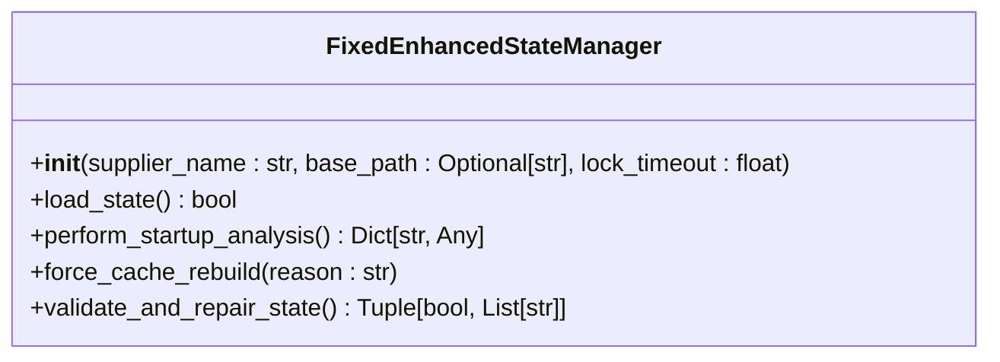
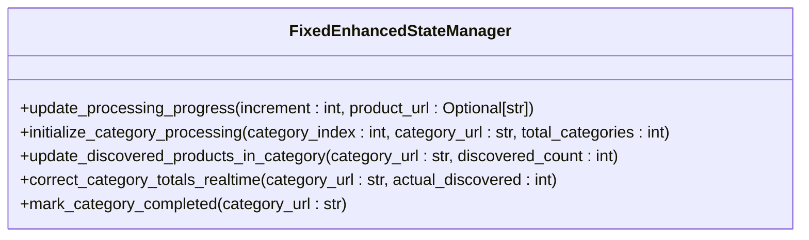
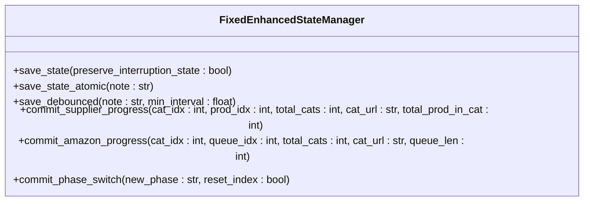
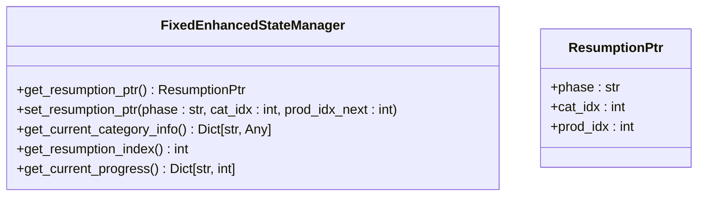
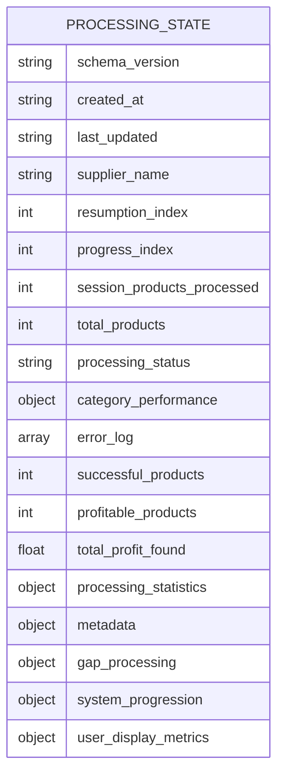
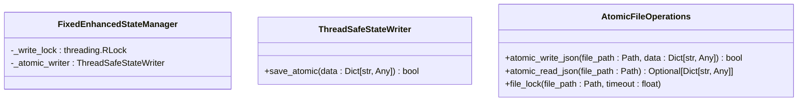
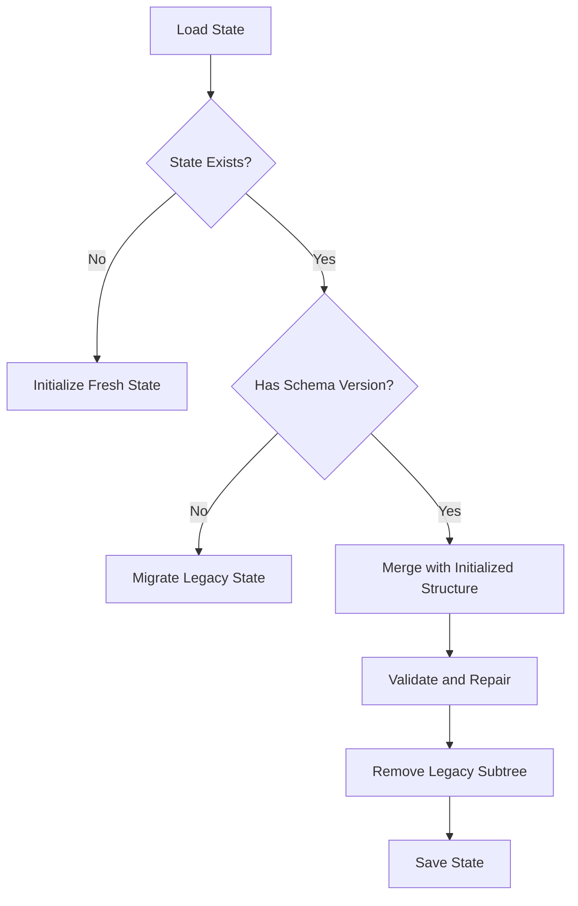

# State Management API

<cite>
**Referenced Files in This Document**   
- [fixed_enhanced_state_manager.py](file://utils/fixed_enhanced_state_manager.py)
- [atomic_file_operations.py](file://utils/atomic_file_operations.py)
- [processing_state.json](file://processing_states/poundwholesale_co_uk_processing_state.json)
- [normalization.py](file://utils/normalization.py)
</cite>

## Table of Contents
1. [Introduction](#introduction)
2. [State Initialization](#state-initialization)
3. [Progress Tracking](#progress-tracking)
4. [Checkpoint Creation](#checkpoint-creation)
5. [Session Resumption](#session-resumption)
6. [JSON Schema and State Persistence](#json-schema-and-state-persistence)
7. [Thread Safety and Atomic Operations](#thread-safety-and-atomic-operations)
8. [Error Recovery and Version Migration](#error-recovery-and-version-migration)
9. [Best Practices for Integration](#best-practices-for-integration)
10. [Code Examples](#code-examples)

## Introduction
The `FixedEnhancedStateManager` provides a robust solution for managing processing state with resumable capabilities. It addresses critical issues in state management including index resets, product count mismatches, metric placement errors, and state corruption. The system ensures reliable interruption recovery through atomic operations and thread-safe design, making it suitable for long-running processing workflows. This API documentation details the public methods, parameter requirements, JSON schema, and best practices for integrating state management into new modules.

**Section sources**
- [fixed_enhanced_state_manager.py](file://utils/fixed_enhanced_state_manager.py#L1-L100)

## State Initialization
State initialization is handled through the `FixedEnhancedStateManager` constructor and associated methods. The system creates a comprehensive state structure upon initialization, ensuring all required fields are present.



**Diagram sources**
- [fixed_enhanced_state_manager.py](file://utils/fixed_enhanced_state_manager.py#L100-L200)

The constructor initializes the state with default values and establishes the file path for state persistence. Key parameters include:
- `supplier_name`: Identifier for the supplier being processed
- `base_path`: Optional base path for state files (defaults to project root)
- `lock_timeout`: Timeout for file locking operations (default 5.0 seconds)

The `load_state()` method attempts to load existing state from disk, returning `True` if successful or `False` if starting fresh. It handles backward compatibility with legacy state formats through automatic migration.

**Section sources**
- [fixed_enhanced_state_manager.py](file://utils/fixed_enhanced_state_manager.py#L200-L350)

## Progress Tracking
Progress tracking is implemented through several methods that update the current processing state. The system separates progress tracking from resumption indexing to prevent data corruption.



**Diagram sources**
- [fixed_enhanced_state_manager.py](file://utils/fixed_enhanced_state_manager.py#L350-L450)

The `update_processing_progress()` method updates both session progress and resumption index for exact interruption recovery. It accepts:
- `increment`: Number of products processed (default 1)
- `product_url`: Optional URL of the processed product

Category-level tracking is managed through `initialize_category_processing()` which sets up tracking for a new category with parameters for category index, URL, and total categories. When the scraper discovers more products than expected, `update_discovered_products_in_category()` updates the category totals in real-time.

**Section sources**
- [fixed_enhanced_state_manager.py](file://utils/fixed_enhanced_state_manager.py#L450-L550)

## Checkpoint Creation
Checkpoint creation is handled through atomic save operations that ensure data integrity. The system provides multiple methods for creating checkpoints at different stages of processing.



**Diagram sources**
- [fixed_enhanced_state_manager.py](file://utils/fixed_enhanced_state_manager.py#L550-L650)

The `save_state()` method performs a thread-safe atomic save with file locking. The `preserve_interruption_state` parameter determines whether current state is preserved for resumption. For phase-specific operations, `commit_supplier_progress()` and `commit_amazon_progress()` provide atomic commits for different processing phases.

**Section sources**
- [fixed_enhanced_state_manager.py](file://utils/fixed_enhanced_state_manager.py#L650-L750)

## Session Resumption
Session resumption is managed through resumption pointers that track the exact point to resume processing after interruption.



**Diagram sources**
- [fixed_enhanced_state_manager.py](file://utils/fixed_enhanced_state_manager.py#L750-L850)

The `get_resumption_ptr()` method returns a `ResumptionPtr` object containing the phase, category index, and product index for resumption. The `set_resumption_ptr()` method atomically sets the resumption pointer with monotonicity validation to prevent backward moves. The system ensures resumption pointers never decrease between runs by comparing against a persisted "high-water mark."

**Section sources**
- [fixed_enhanced_state_manager.py](file://utils/fixed_enhanced_state_manager.py#L850-L950)

## JSON Schema and State Persistence
The state data is persisted in JSON format with a defined schema that ensures consistency across sessions.



**Diagram sources**
- [processing_state.json](file://processing_states/poundwholesale_co_uk_processing_state.json#L1-L50)

The JSON schema includes several key sections:
- **system_progression**: Contains current phase, category and product indices, and totals
- **gap_processing**: Tracks gap processing status and category completion
- **metadata**: Includes version information and system configuration
- **user_display_metrics**: Provides user-facing metrics not used for resumption logic

The state file is stored in the `processing_states` directory with a filename pattern of `{supplier_name}_processing_state.json`.

**Section sources**
- [processing_state.json](file://processing_states/poundwholesale_co_uk_processing_state.json#L1-L100)

## Thread Safety and Atomic Operations
The state manager implements comprehensive thread safety and atomic operations to prevent data corruption.



**Diagram sources**
- [fixed_enhanced_state_manager.py](file://utils/fixed_enhanced_state_manager.py#L950-L1000)
- [atomic_file_operations.py](file://utils/atomic_file_operations.py#L1-L50)

The system uses re-entrant locks (`threading.RLock`) to prevent deadlocks during nested saves. The `ThreadSafeStateWriter` class provides atomic write operations with file locking, while `AtomicFileOperations` offers cross-platform file locking and atomic JSON operations. On Windows, file locking uses `msvcrt.locking`, while Unix systems use `fcntl.flock`.

**Section sources**
- [atomic_file_operations.py](file://utils/atomic_file_operations.py#L1-L100)

## Error Recovery and Version Migration
The state manager includes robust error recovery mechanisms and handles version migration automatically.



**Diagram sources**
- [fixed_enhanced_state_manager.py](file://utils/fixed_enhanced_state_manager.py#L1000-L1100)

The system automatically detects and repairs state corruption through the `validate_and_repair_state()` method, which checks for missing keys, out-of-bounds indices, and structural integrity. For version migration, legacy state formats are converted to the enhanced format with proper index migration. The `force_cache_rebuild()` method allows explicit cache rebuilding when needed.

**Section sources**
- [fixed_enhanced_state_manager.py](file://utils/fixed_enhanced_state_manager.py#L1100-L1200)

## Best Practices for Integration
When integrating the state manager into new modules, follow these best practices:

```mermaid
flowchart LR
A[Initialize Manager] --> B[Load Existing State]
B --> C{State Loaded?}
C --> |Yes| D[Perform Startup Analysis]
C --> |No| E[Initialize New Processing]
D --> F[Process Categories]
E --> F
F --> G[Update Progress Regularly]
G --> H{Interrupted?}
H --> |Yes| I[State Automatically Saved]
H --> |No| J[Complete Processing]
J --> K[Call complete_processing()]
```

**Diagram sources**
- [fixed_enhanced_state_manager.py](file://utils/fixed_enhanced_state_manager.py#L1200-L1300)

Key integration practices include:
- Always use phase-specific atomic commit methods instead of deprecated methods
- Call `perform_startup_analysis()` at the beginning of each session
- Use `commit_supplier_progress()` and `commit_amazon_progress()` for phase-specific commits
- Never directly modify the state data dictionary; use provided methods
- Handle the `ThreadSafeStateWriter` dependency appropriately in different environments

**Section sources**
- [fixed_enhanced_state_manager.py](file://utils/fixed_enhanced_state_manager.py#L1300-L1400)

## Code Examples
The following examples demonstrate common usage patterns for the state manager.

### Initialize and Load State
```python
# Initialize state manager
state_manager = FixedEnhancedStateManager("poundwholesale.co.uk")

# Load existing state or start fresh
if state_manager.load_state():
    print("Resuming from previous state")
else:
    print("Starting fresh processing")
```

### Process Categories with Progress Tracking
```python
# Perform startup analysis
category_status = state_manager.perform_startup_analysis()

# Process each category
for category_idx, category_url in enumerate(category_urls):
    # Initialize tracking for new category
    state_manager.initialize_category_processing(
        category_index=category_idx,
        category_url=category_url,
        total_categories=len(category_urls)
    )
    
    # Update discovered product count if different from expected
    discovered_count = scraper.get_product_count(category_url)
    state_manager.correct_category_totals_realtime(category_url, discovered_count)
    
    # Process products in category
    for product in scraper.get_products(category_url):
        # Update progress for each processed product
        state_manager.update_processing_progress()
        
        # Save state periodically
        if state_manager.state_data["session_products_processed"] % 10 == 0:
            state_manager.save_state_atomic()
    
    # Mark category as completed
    state_manager.mark_category_completed(category_url)
```

### Handle Processing Interruption and Resumption
```python
# Get resumption pointer to determine where to resume
resumption_ptr = state_manager.get_resumption_ptr()
print(f"Resuming at phase: {resumption_ptr.phase}, "
      f"category: {resumption_ptr.cat_idx}, "
      f"product: {resumption_ptr.prod_idx}")

# Set up processing to resume from correct point
current_category_info = state_manager.get_current_category_info()
print(f"Current category: {current_category_info['cat_url']} "
      f"({current_category_info['cat_idx']+1}/{current_category_info['total_cats']})")
```

### Complete Processing Session
```python
# Mark processing as complete
state_manager.complete_processing()
print("Processing completed successfully")

# Get final progress summary
progress = state_manager.get_current_progress()
print(f"Total processed: {progress['resumption_index']} products")
```

**Section sources**
- [fixed_enhanced_state_manager.py](file://utils/fixed_enhanced_state_manager.py#L1400-L2400)