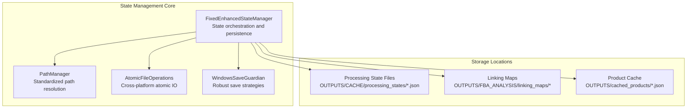
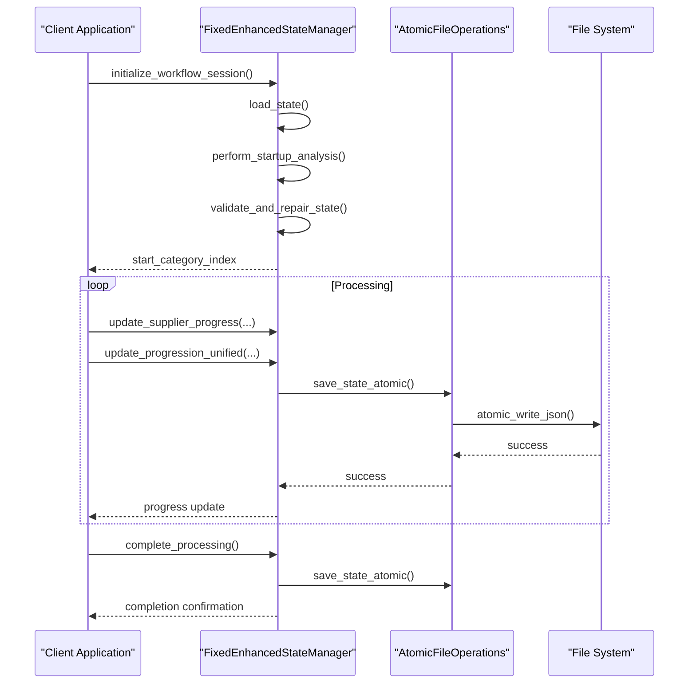
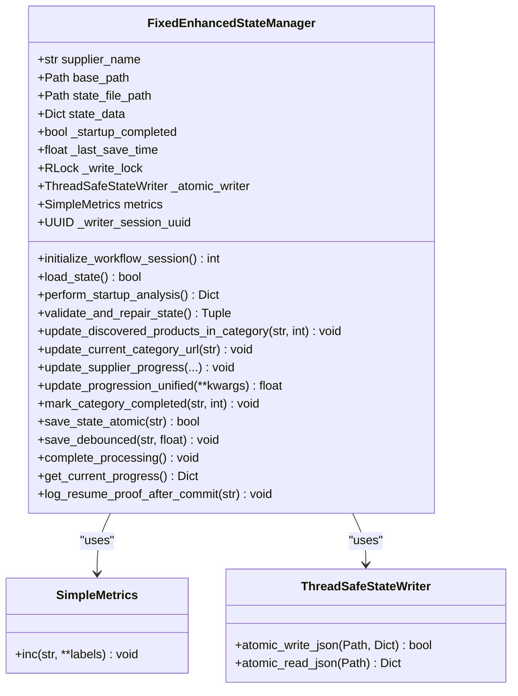
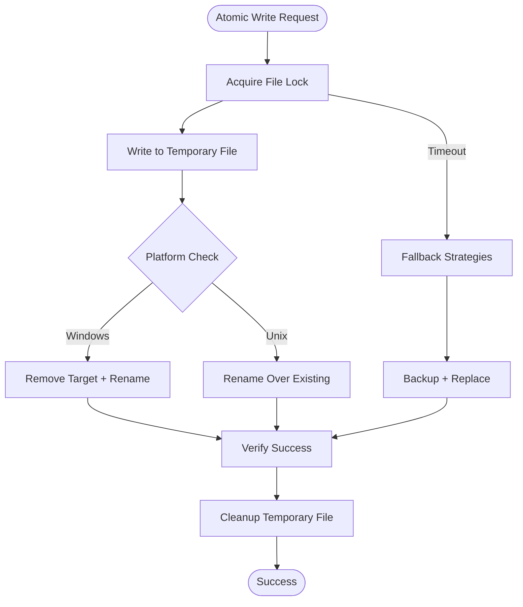
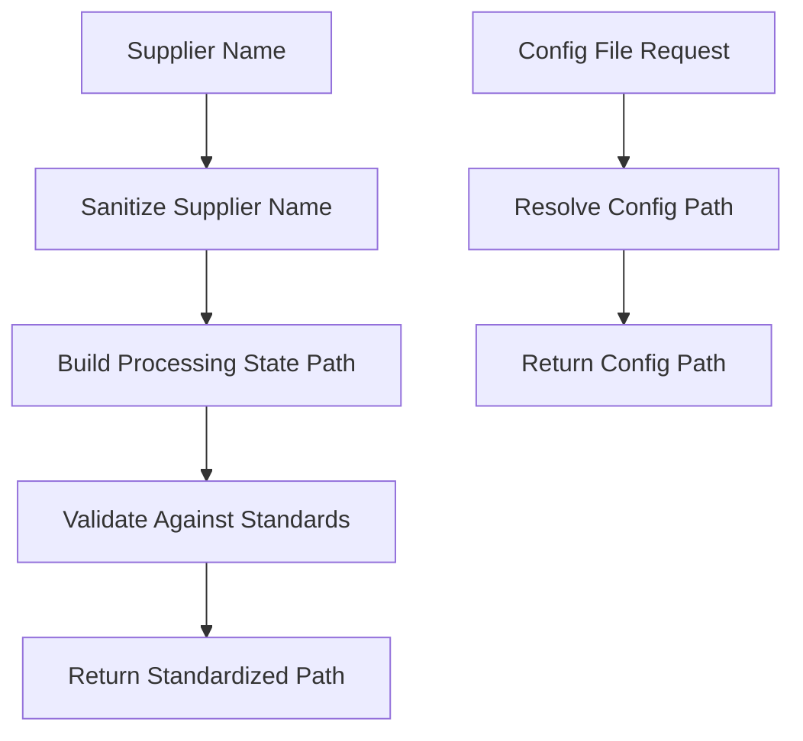
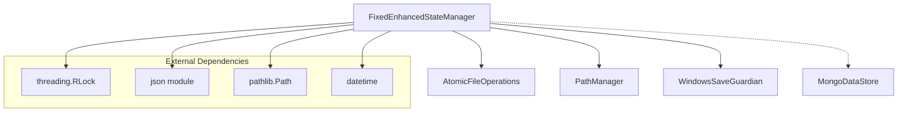
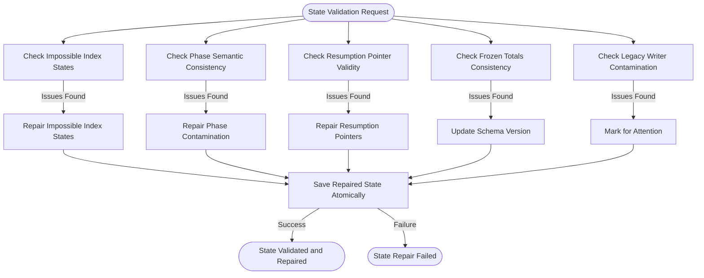

# State Management API

<cite>
**Referenced Files in This Document**
- [fixed_enhanced_state_manager.py](file://utils/fixed_enhanced_state_manager.py)
- [atomic_file_operations.py](file://utils/atomic_file_operations.py)
- [path_manager.py](file://utils/path_manager.py)
- [data_store.py](file://utils/data_store.py)
- [windows_save_guardian.py](file://utils/windows_save_guardian.py)
- [State Management System.md](file://wiki repo 19 nov/6. State Management System/6.2. Fixedenhancedstatemanager Implementation.md)
- [Resumption Logic And Recovery.md](file://wiki repo 19 nov/6. State Management System/6.3. Resumption Logic And Recovery.md)
- [State Corruption.md](file://wiki repo 19 nov/11. Troubleshooting Guide/11.3. State Management Issues/11.3.1. State Corruption.md)
- [State Management API.md](file://wiki repo 19 nov/10. Api Reference/10.4. State Management Api.md)
</cite>

## Table of Contents
1. [Introduction](#introduction)
2. [Project Structure](#project-structure)
3. [Core Components](#core-components)
4. [Architecture Overview](#architecture-overview)
5. [Detailed Component Analysis](#detailed-component-analysis)
6. [Dependency Analysis](#dependency-analysis)
7. [Performance Considerations](#performance-considerations)
8. [Troubleshooting Guide](#troubleshooting-guide)
9. [Conclusion](#conclusion)

## Introduction
This document provides comprehensive API documentation for the State Management API, centered on the FixedEnhancedStateManager class and its data persistence mechanisms. It covers state tracking, progress monitoring, resume capability, validation procedures, file-based state management, progress checkpointing, recovery mechanisms, and cache management. It also includes guidance for implementing custom state handlers, monitoring processing progress, handling system interruptions, state consistency guarantees, conflict resolution, and performance optimization for large-scale state management.

## Project Structure
The State Management API is implemented primarily in the FixedEnhancedStateManager class with supporting modules for atomic file operations, path management, and optional data store integration. The system organizes state files under the OUTPUTS/CACHE/processing_states directory and uses a schema-versioned JSON format for persistence.

**Diagram sources**
- [fixed_enhanced_state_manager.py](file://utils/fixed_enhanced_state_manager.py#L103-L123)
- [path_manager.py](file://utils/path_manager.py#L1-L120)
- [atomic_file_operations.py](file://utils/atomic_file_operations.py#L17-L57)

**Section sources**
- [fixed_enhanced_state_manager.py](file://utils/fixed_enhanced_state_manager.py#L103-L123)
- [path_manager.py](file://utils/path_manager.py#L1-L120)

## Core Components
- FixedEnhancedStateManager: Central orchestrator for state lifecycle, resumption logic, progress tracking, and validation.
- AtomicFileOperations: Provides cross-platform atomic JSON read/write with file locking.
- PathManager: Centralized path resolution following project standards.
- WindowsSaveGuardian: Robust save strategies for Windows environments with fallbacks.
- MongoDataStore: Placeholder for future MongoDB integration.

Key capabilities:
- Thread-safe atomic state writes with file locking
- File-grounded totals calculation using linking maps and cache
- Reverse gap detection and cache rebuild policies
- Resume-proof logging and audit trails
- State validation and automatic repair
- Category-based progress tracking with monotonic guarantees

**Section sources**
- [fixed_enhanced_state_manager.py](file://utils/fixed_enhanced_state_manager.py#L86-L138)
- [atomic_file_operations.py](file://utils/atomic_file_operations.py#L17-L57)
- [path_manager.py](file://utils/path_manager.py#L1-L120)
- [data_store.py](file://utils/data_store.py#L12-L23)

## Architecture Overview
The State Management API follows a layered architecture with clear separation of concerns:

**Diagram sources**
- [fixed_enhanced_state_manager.py](file://utils/fixed_enhanced_state_manager.py#L247-L283)
- [atomic_file_operations.py](file://utils/atomic_file_operations.py#L58-L93)

**Section sources**
- [fixed_enhanced_state_manager.py](file://utils/fixed_enhanced_state_manager.py#L247-L283)
- [atomic_file_operations.py](file://utils/atomic_file_operations.py#L58-L93)

## Detailed Component Analysis

### FixedEnhancedStateManager Class
The FixedEnhancedStateManager is the central component responsible for managing processing state with thread safety and atomic persistence.

**Diagram sources**
- [fixed_enhanced_state_manager.py](file://utils/fixed_enhanced_state_manager.py#L86-L138)

#### State Lifecycle Methods
- initialize_workflow_session(): Primary entry point for workflow initialization and resumption determination
- load_state(): Loads existing state with backward compatibility and migration
- perform_startup_analysis(): Performs comprehensive startup analysis including reverse gap detection
- validate_and_repair_state(): Validates state integrity and repairs detected issues

#### Progress Tracking Methods
- update_supplier_progress(): Updates system_progression with debounced persistence
- update_progression_unified(): Extended unified progression with dual phase index tracking
- update_discovered_products_in_category(): Real-time category total updates
- get_current_progress(): Retrieves current session progress metrics

#### Resume and Recovery Methods
- force_cache_rebuild(): Explicit cache rebuild with reset policy
- mark_category_completed(): Advances persistent category index and prepares next category
- log_resume_proof_after_commit(): Audit trail logging for resume verification

**Section sources**
- [fixed_enhanced_state_manager.py](file://utils/fixed_enhanced_state_manager.py#L247-L328)
- [fixed_enhanced_state_manager.py](file://utils/fixed_enhanced_state_manager.py#L469-L645)
- [fixed_enhanced_state_manager.py](file://utils/fixed_enhanced_state_manager.py#L2811-L2830)
- [fixed_enhanced_state_manager.py](file://utils/fixed_enhanced_state_manager.py#L2769-L2810)

### Atomic File Operations
The atomic file operations module provides cross-platform atomic JSON read/write with file locking and multiple fallback strategies.

**Diagram sources**
- [atomic_file_operations.py](file://utils/atomic_file_operations.py#L58-L93)

Key features:
- Cross-platform file locking with platform-specific implementations
- Atomic JSON serialization with temporary file staging
- Fallback strategies for Windows-specific file locking issues
- Safe backup creation before modifications

**Section sources**
- [atomic_file_operations.py](file://utils/atomic_file_operations.py#L17-L93)

### Path Management
The PathManager provides standardized path resolution following project standards, ensuring consistent file organization across the system.

**Diagram sources**
- [path_manager.py](file://utils/path_manager.py#L1-L120)

**Section sources**
- [path_manager.py](file://utils/path_manager.py#L1-L120)

### Data Store Functionality
The MongoDataStore provides a placeholder interface for MongoDB integration, designed for future expansion of persistent storage options.

**Section sources**
- [data_store.py](file://utils/data_store.py#L12-L23)

## Dependency Analysis
The State Management API has well-defined dependencies that support scalability and maintainability:

**Diagram sources**
- [fixed_enhanced_state_manager.py](file://utils/fixed_enhanced_state_manager.py#L23-L72)
- [atomic_file_operations.py](file://utils/atomic_file_operations.py#L7-L15)

**Section sources**
- [fixed_enhanced_state_manager.py](file://utils/fixed_enhanced_state_manager.py#L23-L72)

## Performance Considerations
The State Management API incorporates several performance optimizations for large-scale state management:

- Debounced persistence: Progress updates are debounced to reduce I/O frequency
- File-grounded calculations: Totals are calculated from actual files rather than in-memory structures
- Monotonic progression: Category indices only advance, preventing unnecessary reprocessing
- Cross-run monotonicity: Validates progress never decreases between runs
- Thread-safe operations: Re-entrant locks prevent contention during concurrent access
- Atomic operations: Minimizes partial writes and corruption risks

Best practices for large-scale deployments:
- Use debounced updates for frequent progress reporting
- Implement proper error handling around file operations
- Monitor state file sizes and consider partitioning for very large catalogs
- Utilize the built-in validation and repair mechanisms proactively

[No sources needed since this section provides general guidance]

## Troubleshooting Guide

### State Validation and Repair Flow
The system includes comprehensive state validation and automatic repair mechanisms:

**Diagram sources**
- [fixed_enhanced_state_manager.py](file://utils/fixed_enhanced_state_manager.py#L1864-L1932)

### Common Issues and Solutions
- **Index Regression**: Detected when progress decreases between runs; automatically clamped to valid ranges
- **Phase Contamination**: Category fields overwritten with global values; reset to safe defaults
- **Legacy Writer Contamination**: Deprecated write patterns causing state corruption; flagged for migration
- **Windows File Locking Issues**: Multiple fallback strategies to handle WinError 5 and permission issues

### Recovery Procedures
1. **Automatic Repair**: Use `validate_and_repair_state()` to detect and fix common corruption patterns
2. **Force Cache Rebuild**: Call `force_cache_rebuild()` to reset resume index and rebuild cache
3. **Manual Intervention**: For severe corruption, examine state files and apply targeted corrections
4. **Audit Trail Review**: Use resume proof logs to verify state consistency across commits

**Section sources**
- [State Corruption.md](file://wiki repo 19 nov/11. Troubleshooting Guide/11.3. State Management Issues/11.3.1. State Corruption.md#L91-L118)
- [Resumption Logic And Recovery.md](file://wiki repo 19 nov/6. State Management System/6.3. Resumption Logic And Recovery.md#L107-L128)

## Conclusion
The State Management API provides a robust, thread-safe, and atomic state management solution for large-scale processing workflows. The FixedEnhancedStateManager class centralizes state lifecycle management with comprehensive validation, recovery, and resume capabilities. The atomic file operations ensure data integrity across platforms, while the path management system maintains consistent file organization. The system's design supports scalability, reliability, and maintainability for enterprise-grade state management requirements.

Key strengths:
- Comprehensive state validation and automatic repair
- Robust resume capabilities with audit trails
- Thread-safe atomic operations with cross-platform support
- File-grounded calculations for accuracy
- Extensible architecture supporting future enhancements

The API enables reliable state management for complex processing workflows while providing clear mechanisms for monitoring, validation, and recovery when issues arise.