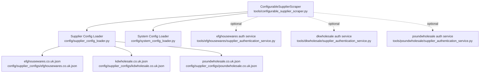
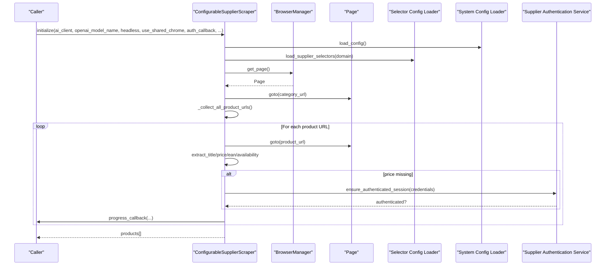
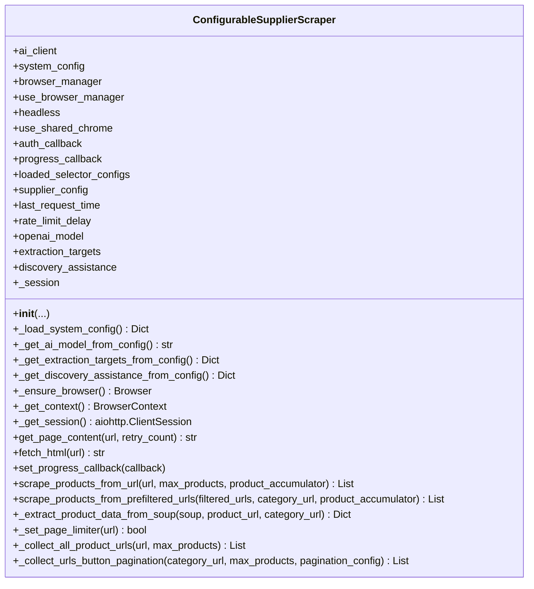
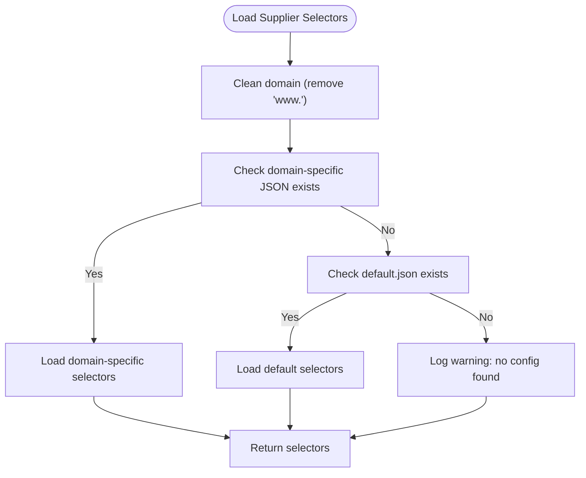
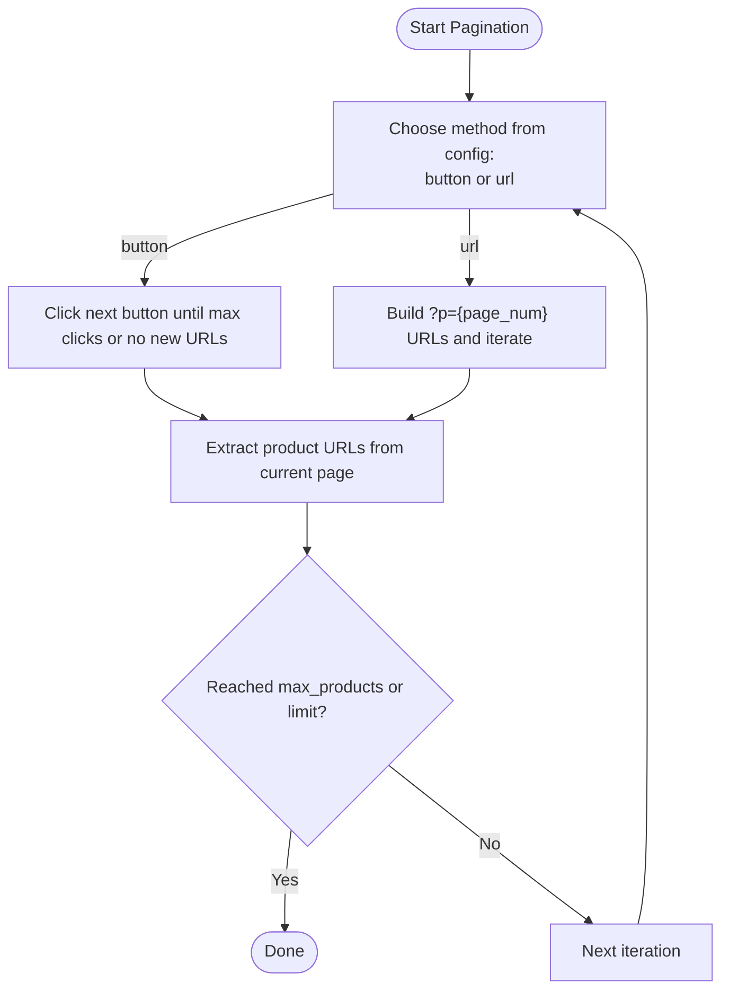
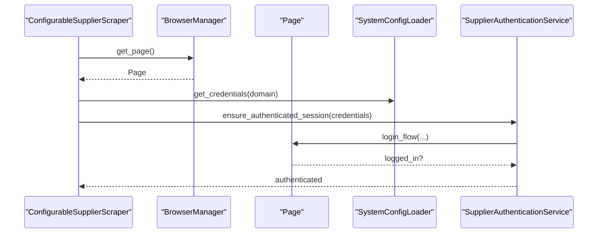
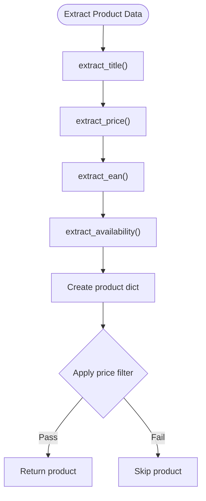
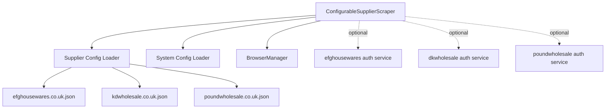

# Supplier Scraping API

<cite>
**Referenced Files in This Document**
- [configurable_supplier_scraper.py](file://tools/configurable_supplier_scraper.py)
- [supplier_config_loader.py](file://config/supplier_config_loader.py)
- [system_config_loader.py](file://config/system_config_loader.py)
- [efghousewares.co.uk.json](file://config/supplier_configs/efghousewares.co.uk.json)
- [kdwholesale.co.uk.json](file://config/supplier_configs/kdwholesale.co.uk.json)
- [poundwholesale.co.uk.json](file://config/supplier_configs/poundwholesale.co.uk.json)
- [supplier_authentication_service.py](file://tools/efghousewares/supplier_authentication_service.py)
- [supplier_authentication_service.py](file://tools/poundwholesale/supplier_authentication_service.py)
- [supplier_authentication_service.py](file://tools/dkwholesale/supplier_authentication_service.py)
</cite>

## Table of Contents
1. [Introduction](#introduction)
2. [Project Structure](#project-structure)
3. [Core Components](#core-components)
4. [Architecture Overview](#architecture-overview)
5. [Detailed Component Analysis](#detailed-component-analysis)
6. [Dependency Analysis](#dependency-analysis)
7. [Performance Considerations](#performance-considerations)
8. [Troubleshooting Guide](#troubleshooting-guide)
9. [Conclusion](#conclusion)
10. [Appendices](#appendices)

## Introduction
This document describes the Supplier Scraping API, focusing on the ConfigurableSupplierScraper class and supplier-specific authentication services. It explains how product extraction, category navigation, and authentication are configured and executed, and how selector management, pagination, and session handling work. It also provides practical guidance for integrating new suppliers, configuring scraping parameters, handling authentication failures, and recovering from errors.

## Project Structure
The Supplier Scraping API spans several modules:
- ConfigurableSupplierScraper orchestrates scraping with Playwright, selector-driven extraction, and pagination.
- Supplier configuration loader reads domain-specific selector configurations from JSON files.
- System configuration loader provides global settings and credentials.
- Supplier-specific authentication services encapsulate per-supplier login flows.
- Supplier configuration JSON files define selectors, pagination, and authentication metadata.

**Diagram sources**
- [configurable_supplier_scraper.py](file://tools/configurable_supplier_scraper.py#L82-L167)
- [supplier_config_loader.py](file://config/supplier_config_loader.py#L23-L70)
- [system_config_loader.py](file://config/system_config_loader.py#L9-L87)
- [efghousewares.co.uk.json](file://config/supplier_configs/efghousewares.co.uk.json#L1-L85)
- [kdwholesale.co.uk.json](file://config/supplier_configs/kdwholesale.co.uk.json#L1-L39)
- [poundwholesale.co.uk.json](file://config/supplier_configs/poundwholesale.co.uk.json#L1-L137)
- [supplier_authentication_service.py](file://tools/efghousewares/supplier_authentication_service.py)
- [supplier_authentication_service.py](file://tools/dkwholesale/supplier_authentication_service.py)
- [supplier_authentication_service.py](file://tools/poundwholesale/supplier_authentication_service.py)

**Section sources**
- [configurable_supplier_scraper.py](file://tools/configurable_supplier_scraper.py#L82-L167)
- [supplier_config_loader.py](file://config/supplier_config_loader.py#L23-L70)
- [system_config_loader.py](file://config/system_config_loader.py#L9-L87)

## Core Components
- ConfigurableSupplierScraper: Central orchestrator for supplier scraping with Playwright, selector-driven extraction, pagination, rate limiting, retries, and progress callbacks.
- Supplier Config Loader: Loads domain-specific selector configurations and defaults.
- System Config Loader: Provides system-wide configuration and credentials.
- Supplier Authentication Services: Per-supplier login helpers integrated optionally into scraping flows.

Key responsibilities:
- Selector-driven extraction using domain-specific JSON configurations.
- Pagination via URL parameters or button clicks.
- Authentication checks and re-authentication triggers.
- Real-time progress reporting and debounced persistence hooks.
- Memory-conscious processing with periodic cleanup.

**Section sources**
- [configurable_supplier_scraper.py](file://tools/configurable_supplier_scraper.py#L82-L167)
- [supplier_config_loader.py](file://config/supplier_config_loader.py#L23-L70)
- [system_config_loader.py](file://config/system_config_loader.py#L9-L87)

## Architecture Overview
The scraping pipeline is configuration-driven and browser-managed centrally:
- ConfigurableSupplierScraper initializes with system configuration and optional authentication callback.
- It loads supplier selectors from JSON files keyed by domain.
- It uses a centralized BrowserManager for Playwright sessions and pages.
- It performs category pagination and product extraction with retry and rate-limiting logic.
- It optionally triggers supplier-specific authentication services when pricing fails or periodically.

**Diagram sources**
- [configurable_supplier_scraper.py](file://tools/configurable_supplier_scraper.py#L243-L467)
- [configurable_supplier_scraper.py](file://tools/configurable_supplier_scraper.py#L477-L880)
- [supplier_config_loader.py](file://config/supplier_config_loader.py#L23-L70)
- [system_config_loader.py](file://config/system_config_loader.py#L9-L87)
- [supplier_authentication_service.py](file://tools/efghousewares/supplier_authentication_service.py)

## Detailed Component Analysis

### ConfigurableSupplierScraper Class
Responsibilities:
- Initialize with AI client, model name, headless mode, shared Chrome, and optional authentication callback.
- Load system configuration and extraction targets.
- Manage Playwright browser and page lifecycle via BrowserManager.
- Fetch HTML content with rate limiting, retries, and anti-bot evasion.
- Collect product URLs across paginated category pages (URL or button-based).
- Extract product data using selector-driven methods.
- Apply price filtering and real-time progress reporting.
- Integrate optional supplier-specific authentication checks.

Key methods and flows:
- Initialization and configuration loading
- Page retrieval and navigation with rate limiting and retries
- Pagination collection (URL-based and button-based)
- Product extraction and validation
- Authentication callback integration
- Progress reporting and debounced persistence

**Diagram sources**
- [configurable_supplier_scraper.py](file://tools/configurable_supplier_scraper.py#L82-L167)
- [configurable_supplier_scraper.py](file://tools/configurable_supplier_scraper.py#L243-L467)
- [configurable_supplier_scraper.py](file://tools/configurable_supplier_scraper.py#L477-L880)
- [configurable_supplier_scraper.py](file://tools/configurable_supplier_scraper.py#L1327-L1599)

**Section sources**
- [configurable_supplier_scraper.py](file://tools/configurable_supplier_scraper.py#L82-L167)
- [configurable_supplier_scraper.py](file://tools/configurable_supplier_scraper.py#L243-L467)
- [configurable_supplier_scraper.py](file://tools/configurable_supplier_scraper.py#L477-L880)
- [configurable_supplier_scraper.py](file://tools/configurable_supplier_scraper.py#L1327-L1599)

### Supplier Configuration Loading
- Domain-specific selector configuration files are stored under config/supplier_configs/.
- The loader supports domain-specific files and falls back to a default.json if present.
- Utility functions extract domains from URLs and save configurations.

**Diagram sources**
- [supplier_config_loader.py](file://config/supplier_config_loader.py#L23-L70)

**Section sources**
- [supplier_config_loader.py](file://config/supplier_config_loader.py#L23-L70)

### Selector Management and Field Mappings
Supplier configuration JSON files define:
- field_mappings: CSS selectors for product_item, title, price, url, image, availability, barcode, SKU, EAN, out_of_stock, stock_status.
- pagination: next_button_selector or next_page_button for URL-based pagination; pagination_method and next_button_javascript for button-based pagination.
- page_limiter: selector and value to increase products per page.
- authentication_required and authentication/login_config for login flows.
- navigation_configuration for predefined categories and homepage reliability flags.

Examples:
- efghousewares.co.uk.json: authentication_required, login_selectors, price selectors, category pagination via button click.
- kdwholesale.co.uk.json: field_mappings for product elements, pagination via next_page_button.
- poundwholesale.co.uk.json: extensive field_mappings, predefined categories, page_limiter, and navigation configuration.

**Section sources**
- [efghousewares.co.uk.json](file://config/supplier_configs/efghousewares.co.uk.json#L1-L85)
- [kdwholesale.co.uk.json](file://config/supplier_configs/kdwholesale.co.uk.json#L1-L39)
- [poundwholesale.co.uk.json](file://config/supplier_configs/poundwholesale.co.uk.json#L1-L137)

### Pagination Handling
Two supported strategies:
- URL-based pagination: constructs URLs with page number parameters and follows next links when available.
- Button-based pagination: clicks “Next” or “Load More” buttons using either CSS selectors or JavaScript evaluation.

**Diagram sources**
- [configurable_supplier_scraper.py](file://tools/configurable_supplier_scraper.py#L1389-L1599)
- [poundwholesale.co.uk.json](file://config/supplier_configs/poundwholesale.co.uk.json#L119-L132)
- [efghousewares.co.uk.json](file://config/supplier_configs/efghousewares.co.uk.json#L71-L80)

**Section sources**
- [configurable_supplier_scraper.py](file://tools/configurable_supplier_scraper.py#L1389-L1599)
- [poundwholesale.co.uk.json](file://config/supplier_configs/poundwholesale.co.uk.json#L119-L132)
- [efghousewares.co.uk.json](file://config/supplier_configs/efghousewares.co.uk.json#L71-L80)

### Authentication Mechanisms and Credential Management
- ConfigurableSupplierScraper optionally invokes an auth_callback for multi-tier authentication evaluation.
- For scenarios where pricing fails, the scraper can trigger supplier-specific authentication services to verify or restore session state.
- Credentials are retrieved from SystemConfigLoader.get_credentials(supplier_domain).
- Supplier-specific authentication services live under tools/<supplier>/supplier_authentication_service.py and are integrated via dynamic import.

**Diagram sources**
- [configurable_supplier_scraper.py](file://tools/configurable_supplier_scraper.py#L772-L845)
- [system_config_loader.py](file://config/system_config_loader.py#L42-L47)
- [supplier_authentication_service.py](file://tools/efghousewares/supplier_authentication_service.py)

**Section sources**
- [configurable_supplier_scraper.py](file://tools/configurable_supplier_scraper.py#L772-L845)
- [system_config_loader.py](file://config/system_config_loader.py#L42-L47)
- [supplier_authentication_service.py](file://tools/efghousewares/supplier_authentication_service.py)

### Product Extraction Methods
- Title extraction uses selector-driven logic with fallbacks.
- Price extraction uses selector-driven logic with login-required indicators and fallbacks.
- EAN/Barcode/SKU extraction uses structured selectors and optional regex processing.
- Availability extraction uses selectors for stock status.
- Image extraction is intentionally omitted to reduce cross-supplier variance.

**Diagram sources**
- [configurable_supplier_scraper.py](file://tools/configurable_supplier_scraper.py#L659-L771)

**Section sources**
- [configurable_supplier_scraper.py](file://tools/configurable_supplier_scraper.py#L659-L771)

### Session Handling and Browser Management
- Centralized BrowserManager is used for launching and managing Playwright browsers and pages.
- The scraper connects via BrowserManager singleton and reuses pages when available.
- HTTP session for lightweight validations is handled via aiohttp.

**Section sources**
- [configurable_supplier_scraper.py](file://tools/configurable_supplier_scraper.py#L243-L327)

## Dependency Analysis
- ConfigurableSupplierScraper depends on:
  - Supplier Config Loader for domain-specific selectors.
  - System Config Loader for credentials and system-wide limits.
  - BrowserManager for page lifecycle.
  - Supplier authentication services for per-supplier login flows.
- Supplier configuration JSON files define selectors and pagination behavior.
- Authentication services are dynamically imported by supplier slug derived from the domain.

**Diagram sources**
- [configurable_supplier_scraper.py](file://tools/configurable_supplier_scraper.py#L82-L167)
- [supplier_config_loader.py](file://config/supplier_config_loader.py#L23-L70)
- [system_config_loader.py](file://config/system_config_loader.py#L9-L87)
- [efghousewares.co.uk.json](file://config/supplier_configs/efghousewares.co.uk.json#L1-L85)
- [kdwholesale.co.uk.json](file://config/supplier_configs/kdwholesale.co.uk.json#L1-L39)
- [poundwholesale.co.uk.json](file://config/supplier_configs/poundwholesale.co.uk.json#L1-L137)
- [supplier_authentication_service.py](file://tools/efghousewares/supplier_authentication_service.py)
- [supplier_authentication_service.py](file://tools/dkwholesale/supplier_authentication_service.py)
- [supplier_authentication_service.py](file://tools/poundwholesale/supplier_authentication_service.py)

**Section sources**
- [configurable_supplier_scraper.py](file://tools/configurable_supplier_scraper.py#L82-L167)
- [supplier_config_loader.py](file://config/supplier_config_loader.py#L23-L70)
- [system_config_loader.py](file://config/system_config_loader.py#L9-L87)

## Performance Considerations
- Rate limiting: enforced between page requests to avoid throttling.
- Retries with exponential backoff for transient failures.
- Memory-conscious processing: periodic garbage collection and forced cleanup at intervals.
- URL pre-filtering: filters known URLs against cache and linking maps to avoid redundant page visits.
- Products-per-page limiter: increases throughput by reducing pagination overhead.
- Debounced persistence: progress callback and state manager integration to persist partial results.

[No sources needed since this section provides general guidance]

## Troubleshooting Guide
Common issues and resolutions:
- Authentication failures during product extraction:
  - The scraper triggers an authentication check and attempts re-authentication using supplier-specific authentication services.
  - If login expires mid-run, restart the system or re-authenticate manually.
- Pricing extraction failures:
  - When price extraction fails, the scraper verifies authentication status and logs recommendations.
- Navigation and pagination errors:
  - For button-based pagination, ensure next_button_selector or next_button_javascript is configured.
  - For URL-based pagination, confirm next_page_button selectors and pagination patterns.
- Memory pressure:
  - The scraper performs periodic memory checks and forced cleanup; monitor logs for warnings and adjust batch sizes accordingly.
- Selector mismatches:
  - Update supplier configuration JSON files with accurate selectors and regex processing steps.

**Section sources**
- [configurable_supplier_scraper.py](file://tools/configurable_supplier_scraper.py#L772-L845)
- [configurable_supplier_scraper.py](file://tools/configurable_supplier_scraper.py#L1389-L1599)

## Conclusion
The Supplier Scraping API provides a robust, configuration-driven framework for extracting supplier product data. By externalizing selectors and pagination logic, it enables rapid adaptation to new suppliers while maintaining consistent browser automation, authentication, and progress tracking. Proper configuration of supplier JSON files, credentials, and pagination strategies ensures reliable and efficient scraping across diverse supplier platforms.

[No sources needed since this section summarizes without analyzing specific files]

## Appendices

### Integrating a New Supplier
Steps:
- Create a supplier configuration JSON file under config/supplier_configs/<domain>.json with field_mappings, pagination, and optional authentication sections.
- Define selectors for product_item, title, price, url, availability, and identifiers (EAN/Barcode/SKU).
- Configure pagination_method ("url" or "button"), next selectors, and page_limiter if applicable.
- If authentication is required, implement or reuse a supplier-specific authentication service under tools/<supplier>/supplier_authentication_service.py.
- Provide credentials via SystemConfigLoader.get_credentials(domain) and bind an auth_callback if needed.
- Run scraping with ConfigurableSupplierScraper and monitor logs for selector and pagination feedback.

**Section sources**
- [supplier_config_loader.py](file://config/supplier_config_loader.py#L23-L70)
- [system_config_loader.py](file://config/system_config_loader.py#L42-L47)
- [efghousewares.co.uk.json](file://config/supplier_configs/efghousewares.co.uk.json#L1-L85)
- [poundwholesale.co.uk.json](file://config/supplier_configs/poundwholesale.co.uk.json#L1-L137)
- [kdwholesale.co.uk.json](file://config/supplier_configs/kdwholesale.co.uk.json#L1-L39)
- [supplier_authentication_service.py](file://tools/efghousewares/supplier_authentication_service.py)

### Example: Configuring Scraping Parameters
- Set processing limits (e.g., max_price_gbp) via system_config.json.
- Adjust pagination safety limits and products-per-page via system_config.json.
- Bind a progress_callback to receive incremental updates and trigger debounced persistence.

**Section sources**
- [system_config_loader.py](file://config/system_config_loader.py#L9-L87)
- [configurable_supplier_scraper.py](file://tools/configurable_supplier_scraper.py#L692-L701)

### Example: Handling Authentication Failures
- When price extraction fails, the scraper triggers an authentication check using the supplier’s authentication service.
- If login is expired, log recommendations to restart or re-authenticate.
- Periodic authentication checks can be enabled to maintain session validity during long runs.

**Section sources**
- [configurable_supplier_scraper.py](file://tools/configurable_supplier_scraper.py#L772-L845)