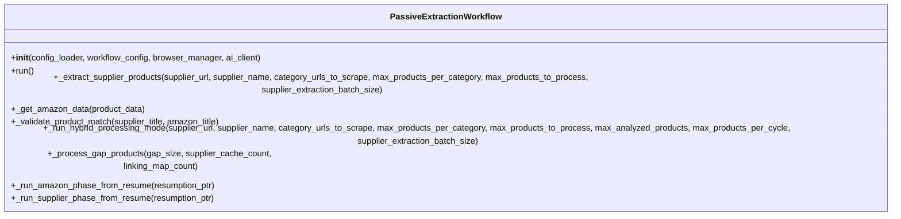
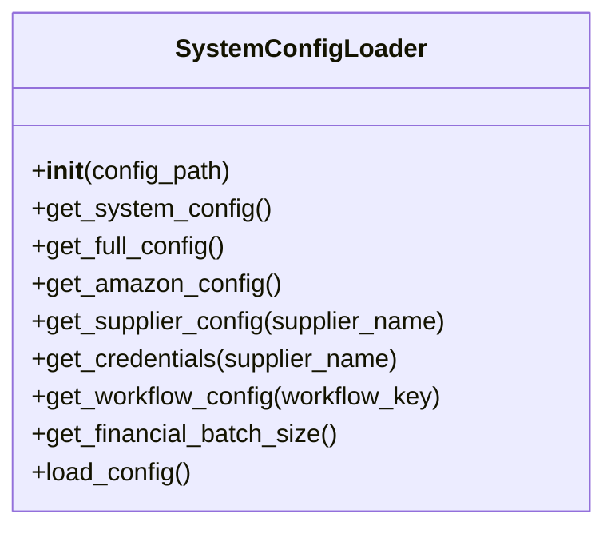
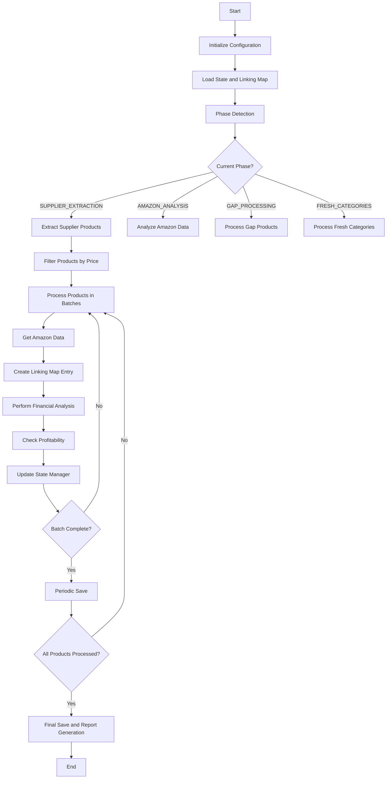
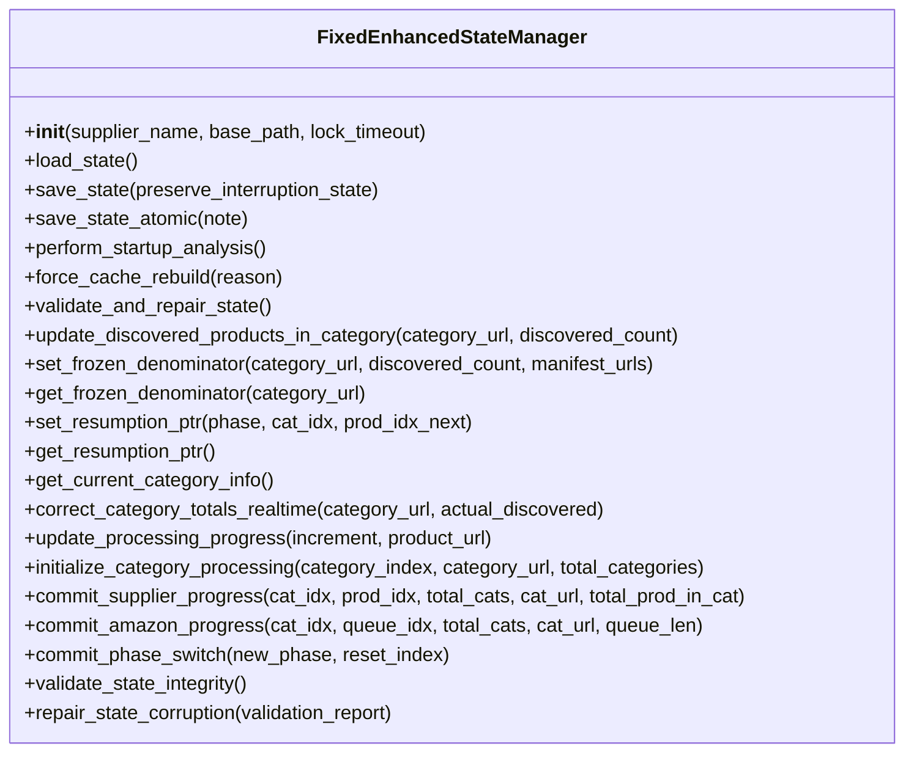
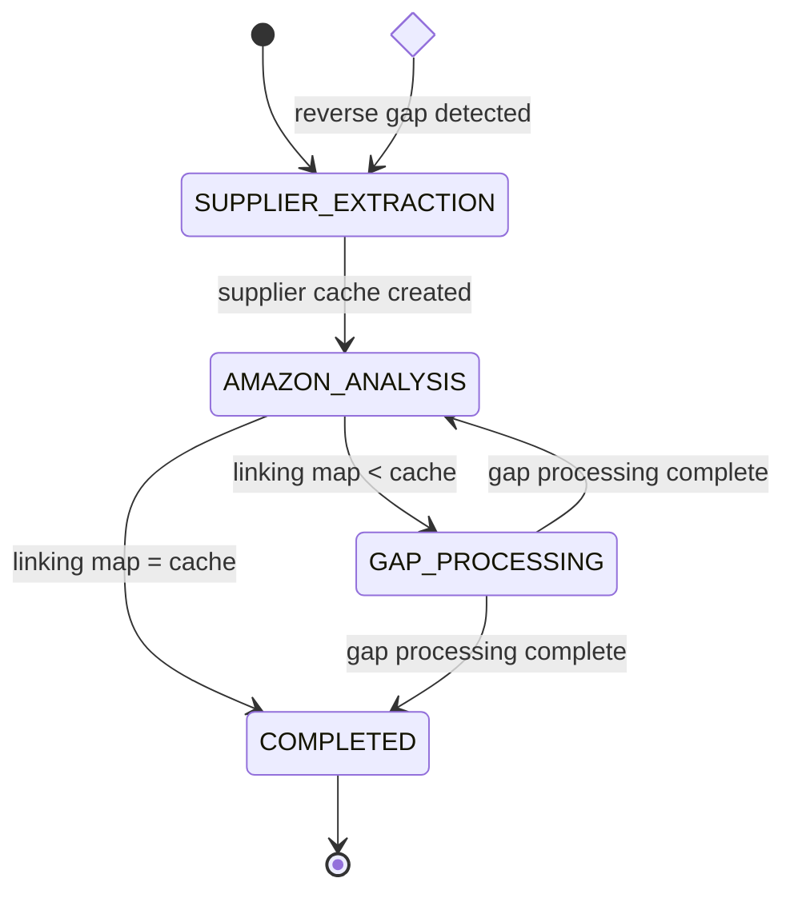

# Workflow Orchestration API

<cite>
**Referenced Files in This Document**   
- [passive_extraction_workflow_latest.py](file://tools/passive_extraction_workflow_latest.py)
- [fixed_enhanced_state_manager.py](file://utils/fixed_enhanced_state_manager.py)
- [system_config_loader.py](file://config/system_config_loader.py)
- [system_config.json](file://config/system_config.json)
- [run_custom_poundwholesale.py](file://run_custom_poundwholesale.py)
</cite>

## Table of Contents
1. [Introduction](#introduction)
2. [Core Components](#core-components)
3. [Workflow Initialization](#workflow-initialization)
4. [Configuration Management](#configuration-management)
5. [Execution Phases](#execution-phases)
6. [State Management](#state-management)
7. [Event Lifecycle Management](#event-lifecycle-management)
8. [Usage Examples](#usage-examples)
9. [Error Handling](#error-handling)
10. [Versioning and Compatibility](#versioning-and-compatibility)

## Introduction
The `passive_extraction_workflow_latest.py` module serves as the central orchestrator for the Amazon FBA Agent System, managing the complete workflow for identifying profitable products. This API documentation details the public classes and methods that control workflow initialization, configuration loading, execution phases (scraping, matching, analysis), and event lifecycle management. The system is designed for resilience and statefulness, allowing interruption and resumption of long-running processes. It integrates with state management and browser automation components to provide a robust product sourcing solution.

## Core Components

The Amazon FBA Agent System is built around several core components that work together to extract, analyze, and validate profitable products from supplier websites and Amazon. The main orchestrator is the `PassiveExtractionWorkflow` class, which coordinates the entire process from configuration loading to final report generation.

**Section sources**
- [passive_extraction_workflow_latest.py](file://tools/passive_extraction_workflow_latest.py#L851-L2650)
- [fixed_enhanced_state_manager.py](file://utils/fixed_enhanced_state_manager.py#L150-L2412)

## Workflow Initialization

### PassiveExtractionWorkflow Class
The `PassiveExtractionWorkflow` class is the primary orchestrator of the Amazon FBA agent system. It manages the complete workflow from initialization to final report generation.



**Diagram sources**
- [passive_extraction_workflow_latest.py](file://tools/passive_extraction_workflow_latest.py#L851-L2650)

### Initialization Parameters
The workflow initialization accepts the following parameters:

- `config_loader`: Configuration loader instance for loading system settings
- `workflow_config`: Workflow-specific configuration dictionary
- `browser_manager`: Optional browser manager for shared browser instance
- `ai_client`: Optional AI client for enhanced product matching

The constructor initializes all core components including the state manager, Amazon extractor, supplier scraper, and various optimization systems.

**Section sources**
- [passive_extraction_workflow_latest.py](file://tools/passive_extraction_workflow_latest.py#L860-L989)

## Configuration Management

### Configuration Loading
The workflow loads configuration from multiple sources, with `system_config.json` serving as the single source of truth. The configuration is loaded through the `SystemConfigLoader` class, which provides access to various configuration sections.



**Diagram sources**
- [system_config_loader.py](file://config/system_config_loader.py#L1-L84)

### Configuration Structure
The system configuration is structured as a hierarchical JSON object with the following key sections:

- `system`: Core system parameters and operational toggles
- `processing_limits`: Price and quantity limits for product filtering
- `supplier_extraction_progress`: Progress tracking and persistence settings
- `hybrid_processing`: Configuration for hybrid processing modes
- `batch_synchronization`: Settings for synchronizing batch sizes
- `performance`: Performance and timeout settings
- `cache`: Cache management configuration
- `monitoring`: System monitoring and alerting settings
- `output`: Output directory and file naming configuration
- `chrome`: Chrome browser configuration
- `analysis`: Product analysis criteria (ROI, profit, ratings)
- `amazon`: Amazon marketplace settings
- `supplier`: Supplier-specific settings
- `credentials`: Supplier login credentials
- `workflows`: Predefined workflow configurations
- `ai_features`: AI feature toggles
- `integrations`: Third-party service integrations
- `authentication`: Authentication and session management
- `surgical_fixes`: System fix and enhancement toggles

**Section sources**
- [system_config.json](file://config/system_config.json#L1-L300)

## Execution Phases

### Main Execution Flow
The workflow execution follows a structured sequence of phases, each handling a specific aspect of the product sourcing process.



**Diagram sources**
- [passive_extraction_workflow_latest.py](file://tools/passive_extraction_workflow_latest.py#L1970-L2316)

### Supplier Product Extraction
The supplier product extraction phase retrieves product data from supplier websites using configurable batch sizes.

```python
[passive_extraction_workflow_latest.py](file://tools/passive_extraction_workflow_latest.py#L2318-L2435)
```

This method processes category URLs in batches controlled by the `supplier_extraction_batch_size` configuration parameter, providing memory management and stability for suppliers with many categories.

**Section sources**
- [passive_extraction_workflow_latest.py](file://tools/passive_extraction_workflow_latest.py#L2318-L2435)

### Amazon Data Retrieval
The Amazon data retrieval phase implements a two-step matching strategy to find supplier products on Amazon.

```python
[passive_extraction_workflow_latest.py](file://tools/passive_extraction_workflow_latest.py#L2437-L2525)
```

The process first attempts to match by EAN for high-confidence results, then falls back to title-based search with similarity scoring when EAN matching fails.

**Section sources**
- [passive_extraction_workflow_latest.py](file://tools/passive_extraction_workflow_latest.py#L2437-L2525)

### Product Matching Validation
The product matching validation ensures that matched products are genuinely similar by calculating a confidence score based on title similarity.

```python
[passive_extraction_workflow_latest.py](file://tools/passive_extraction_workflow_latest.py#L2548-L2563)
```

This method uses word overlap scoring to validate that the matched Amazon product is a rational match for the supplier product.

**Section sources**
- [passive_extraction_workflow_latest.py](file://tools/passive_extraction_workflow_latest.py#L2548-L2563)

## State Management

### Enhanced State Manager
The `FixedEnhancedStateManager` class provides robust state management with thread safety and atomic operations.



**Diagram sources**
- [fixed_enhanced_state_manager.py](file://utils/fixed_enhanced_state_manager.py#L150-L2412)

### State Data Structure
The state manager maintains a comprehensive state structure with the following key fields:

- `schema_version`: Version of the state schema
- `created_at`: Timestamp when state was created
- `last_updated`: Timestamp of last state update
- `supplier_name`: Name of the supplier being processed
- `resumption_index`: Index where processing should resume after interruption
- `progress_index`: Current progress in active session
- `session_products_processed`: Number of products processed in current session
- `total_products`: Total number of products to process
- `processing_status`: Current processing status
- `is_fresh_start`: Flag indicating if this is a fresh start
- `category_performance`: Performance metrics for categories
- `error_log`: Log of processing errors
- `successful_products`: Count of successful products
- `profitable_products`: Count of profitable products
- `total_profit_found`: Total profit found
- `processing_statistics`: Various processing statistics
- `metadata`: Additional metadata
- `gap_processing`: Gap processing state and metrics
- `system_progression`: System progression tracking
- `user_display_metrics`: User-facing metrics

**Section sources**
- [fixed_enhanced_state_manager.py](file://utils/fixed_enhanced_state_manager.py#L200-L500)

## Event Lifecycle Management

### Phase-Aware Processing
The workflow implements phase-aware processing with automatic detection of the current phase based on file-grounded totals.



**Diagram sources**
- [passive_extraction_workflow_latest.py](file://tools/passive_extraction_workflow_latest.py#L2100-L2150)

### Atomic State Persistence
The system uses atomic state persistence to ensure data integrity during crashes or interruptions.

```python
[fixed_enhanced_state_manager.py](file://utils/fixed_enhanced_state_manager.py#L1000-L1200)
```

The state is saved using a temp-then-replace pattern, ensuring that the state file is never in a corrupted state.

**Section sources**
- [fixed_enhanced_state_manager.py](file://utils/fixed_enhanced_state_manager.py#L1000-L1200)

## Usage Examples

### Programmatic Workflow Control
The workflow can be programmatically started, paused, and resumed using the `PassiveExtractionWorkflow` class.

#### Starting a Workflow
```python
from config.system_config_loader import SystemConfigLoader
from passive_extraction_workflow_latest import PassiveExtractionWorkflow

# Load configuration
config_loader = SystemConfigLoader()
workflow_config = config_loader.get_workflow_config("poundwholesale_workflow")

# Initialize and run workflow
workflow = PassiveExtractionWorkflow(config_loader, workflow_config)
results = await workflow.run()
```

#### Pausing and Resuming
The workflow automatically handles pausing and resuming through its state management system. To pause, simply interrupt the process (Ctrl+C). To resume, run the same code again:

```python
# The workflow will automatically detect the previous state and resume
workflow = PassiveExtractionWorkflow(config_loader, workflow_config)
results = await workflow.run()  # Will resume from last processed product
```

#### Custom Configuration Injection
Custom configurations can be injected by modifying the system configuration:

```python
# Load and modify configuration
config_loader = SystemConfigLoader()
full_config = config_loader.get_full_config()

# Modify specific settings
full_config["system"]["max_products"] = 100
full_config["system"]["max_products_per_category"] = 10
full_config["analysis"]["min_roi_percent"] = 25.0

# Initialize workflow with modified configuration
workflow = PassiveExtractionWorkflow(config_loader, workflow_config)
results = await workflow.run()
```

**Section sources**
- [passive_extraction_workflow_latest.py](file://tools/passive_extraction_workflow_latest.py#L1970-L2316)
- [run_custom_poundwholesale.py](file://run_custom_poundwholesale.py)

## Error Handling

### Authentication Fallback
The system implements an authentication fallback mechanism to handle session timeouts.

```python
[passive_extraction_workflow_latest.py](file://tools/passive_extraction_workflow_latest.py#L2700-L2750)
```

When authentication is needed, the system triggers a re-login attempt and continues processing.

**Section sources**
- [passive_extraction_workflow_latest.py](file://tools/passive_extraction_workflow_latest.py#L2700-L2750)

### No-Match Handling
When a product cannot be matched on Amazon, the system creates a no-match entry to prevent infinite reprocessing loops.

```python
[passive_extraction_workflow_latest.py](file://tools/passive_extraction_workflow_latest.py#L2750-L2800)
```

This ensures that products that cannot be found on Amazon are marked as processed and not re-analyzed in subsequent runs.

**Section sources**
- [passive_extraction_workflow_latest.py](file://tools/passive_extraction_workflow_latest.py#L2750-L2800)

### State Validation and Repair
The state manager includes comprehensive validation and repair capabilities to handle corrupted state files.

```python
[fixed_enhanced_state_manager.py](file://utils/fixed_enhanced_state_manager.py#L2000-L2200)
```

The system can detect and repair various corruption patterns, including impossible index states and phase semantic mixing.

**Section sources**
- [fixed_enhanced_state_manager.py](file://utils/fixed_enhanced_state_manager.py#L2000-L2200)

## Versioning and Compatibility

### Backward Compatibility
The system maintains backward compatibility through several mechanisms:

1. **Schema Versioning**: The state manager uses schema versioning to handle changes in the state structure.
2. **Migration Logic**: Legacy state formats are automatically migrated to the current format.
3. **Fallback Configurations**: Default values are provided for missing configuration parameters.

### Versioning Considerations
When integrating with external systems, consider the following versioning aspects:

- **State File Format**: The state file format may change between versions, but migration logic is provided.
- **Configuration Structure**: The configuration structure is stable, but new optional fields may be added.
- **API Stability**: The public methods of the `PassiveExtractionWorkflow` class are considered stable and backward compatible.
- **Event Signatures**: Event signatures (log messages, state updates) may change, so external integrations should use structured data rather than parsing log output.

External integrations should use the configuration loader and state manager APIs rather than directly reading configuration or state files to ensure compatibility across versions.

**Section sources**
- [passive_extraction_workflow_latest.py](file://tools/passive_extraction_workflow_latest.py)
- [fixed_enhanced_state_manager.py](file://utils/fixed_enhanced_state_manager.py)
- [system_config_loader.py](file://config/system_config_loader.py)
- [system_config.json](file://config/system_config.json)