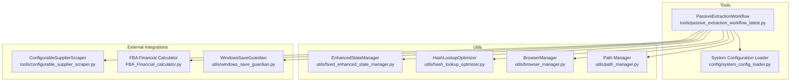
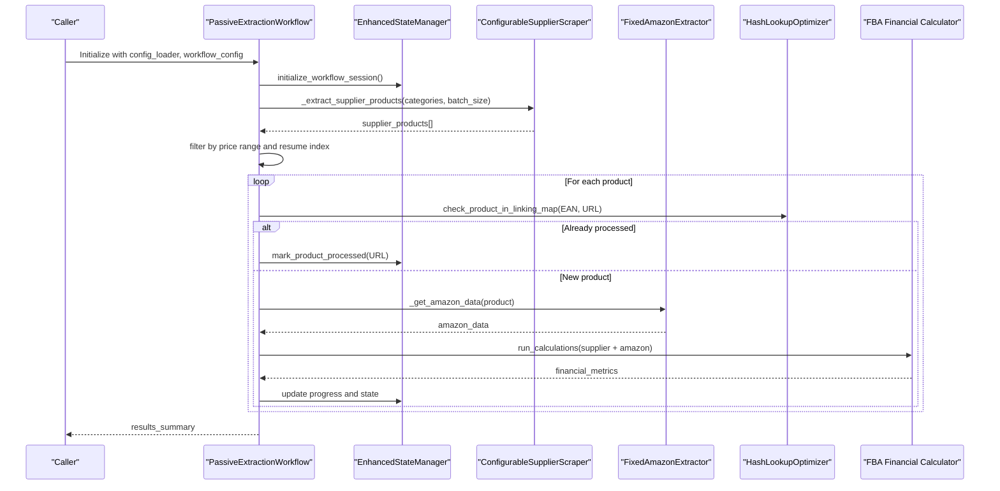
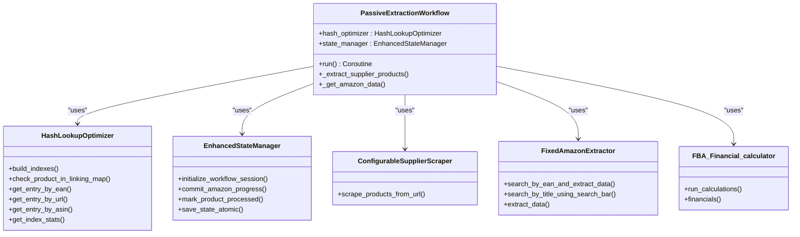

# Workflow Orchestration API

<cite>
**Referenced Files in This Document**
- [passive_extraction_workflow_latest.py](file://tools/passive_extraction_workflow_latest.py)
- [hash_lookup_optimizer.py](file://utils/hash_lookup_optimizer.py)
- [fixed_enhanced_state_manager.py](file://utils/fixed_enhanced_state_manager.py)
- [10.1. Workflow Orchestration Api.md](file://WIKI REPO SEPT17/10. Api Reference/10.1. Workflow Orchestration Api.md)
- [3. Core Architecture\3.1. Workflow Engine.md](file://WIKI REPO SEPT17/3. Core Architecture/3.1. Workflow Engine.md)
</cite>

## Table of Contents
1. [Introduction](#introduction)
2. [Project Structure](#project-structure)
3. [Core Components](#core-components)
4. [Architecture Overview](#architecture-overview)
5. [Detailed Component Analysis](#detailed-component-analysis)
6. [Dependency Analysis](#dependency-analysis)
7. [Performance Considerations](#performance-considerations)
8. [Troubleshooting Guide](#troubleshooting-guide)
9. [Conclusion](#conclusion)

## Introduction
This document provides comprehensive API documentation for the Workflow Orchestration API, focusing on the PassiveExtractionWorkflow class and its associated hash optimization features. It explains the constructor parameters, the asynchronous run() method, and the hash optimization functions that dramatically improve performance by replacing O(n) linear searches with O(1) hash lookups. The document also covers error handling strategies, memory management features, integration patterns with other system components, and practical examples for initialization, execution, and progress monitoring.

## Project Structure
The Workflow Orchestration API centers around the PassiveExtractionWorkflow class located in the tools directory, with supporting utilities in the utils directory. The workflow integrates with:
- EnhancedStateManager for stateful, resumable execution
- HashLookupOptimizer for O(1) deduplication and progress tracking
- Supplier and Amazon extractors for data retrieval
- Atomic file operations for safe persistence

**Diagram sources**
- [passive_extraction_workflow_latest.py](file://tools/passive_extraction_workflow_latest.py#L851-L2650)
- [hash_lookup_optimizer.py](file://utils/hash_lookup_optimizer.py#L1-L1)
- [fixed_enhanced_state_manager.py](file://utils/fixed_enhanced_state_manager.py#L86-L200)

**Section sources**
- [passive_extraction_workflow_latest.py](file://tools/passive_extraction_workflow_latest.py#L1-L120)
- [3. Core Architecture\3.1. Workflow Engine.md](file://WIKI REPO SEPT17/3. Core Architecture/3.1. Workflow Engine.md#L189-L192)

## Core Components
- PassiveExtractionWorkflow: Orchestrates supplier scraping, Amazon matching, financial analysis, and stateful persistence.
- EnhancedStateManager: Manages resumption, progress tracking, and atomic state writes.
- HashLookupOptimizer: Provides O(1) hash-based lookups for linking map entries using EAN, URL, and ASIN indexes.
- ConfigurableSupplierScraper: Extracts supplier product data from category URLs.
- FixedAmazonExtractor: Searches Amazon for products and extracts data.
- FBA Financial calculator: Computes profitability metrics.

**Section sources**
- [passive_extraction_workflow_latest.py](file://tools/passive_extraction_workflow_latest.py#L851-L2650)
- [hash_lookup_optimizer.py](file://utils/hash_lookup_optimizer.py#L1-L1)
- [fixed_enhanced_state_manager.py](file://utils/fixed_enhanced_state_manager.py#L86-L200)

## Architecture Overview
The workflow follows a deterministic, stateful execution model:
- Initialization loads configuration and sets up paths, scrapers, extractors, and optimizers.
- Supplier phase: Extracts products from predefined category URLs in batches.
- Amazon phase: Matches supplier products to Amazon listings using EAN-first and title-based fallback strategies.
- Financial analysis: Calculates ROI and profitability using the FBA calculator.
- State management: Uses EnhancedStateManager to persist progress and enable safe resumption.
- Hash optimization: Uses HashLookupOptimizer to skip reprocessing and accelerate deduplication.

**Diagram sources**
- [passive_extraction_workflow_latest.py](file://tools/passive_extraction_workflow_latest.py#L2125-L2650)
- [hash_lookup_optimizer.py](file://utils/hash_lookup_optimizer.py#L1-L1)
- [fixed_enhanced_state_manager.py](file://utils/fixed_enhanced_state_manager.py#L86-L200)

## Detailed Component Analysis

### PassiveExtractionWorkflow Class
The PassiveExtractionWorkflow class is the primary orchestrator. It encapsulates:
- Constructor parameters: config_loader, workflow_config, optional browser_manager, optional ai_client.
- run(): Asynchronous main execution entry point that orchestrates supplier and Amazon phases, applies filters, and persists state.
- Hash optimization integration: Uses HashLookupOptimizer for O(1) deduplication checks.
- Memory management: Processes categories in batches and uses atomic writes to reduce memory pressure and ensure crash safety.

Key methods and responsibilities:
- run(): Loads configuration, initializes session, determines resume phase and index, executes supplier and Amazon phases, and returns results_summary.
- _extract_supplier_products(): Scrapes supplier products from category URLs in batches.
- _get_amazon_data(): Performs EAN-first search with title-based fallback and similarity validation.
- Internal hash optimization integration: check_product_in_linking_map() for O(1) deduplication.

Asynchronous execution pattern:
- run() is declared async and awaits coroutines for supplier scraping, Amazon data retrieval, and financial calculations.
- Batch processing loops await each product’s processing, enabling cooperative multitasking and predictable throughput.

Return value structure:
- The method returns results_summary, which includes counts and lists of processed products and profitability metrics.

Performance metrics:
- The workflow logs category progress, supplier and Amazon progress ratios, and timing information for each batch and product.
- EnhancedStateManager tracks processing statistics and runtime metrics for observability.

**Section sources**
- [passive_extraction_workflow_latest.py](file://tools/passive_extraction_workflow_latest.py#L851-L2650)
- [10.1. Workflow Orchestration Api.md](file://WIKI REPO SEPT17/10. Api Reference/10.1. Workflow Orchestration Api.md#L296-L327)

### Hash Optimization Functions

#### HashLookupOptimizer
The HashLookupOptimizer provides O(1) hash-based lookups to replace O(n) linear searches:
- Indexes: Maintains three hash indexes—EAN, URL, and ASIN—enabling instant lookups.
- Thread safety: Uses threading.Lock for concurrent access.
- Performance metrics: Tracks hash lookups, linear lookups, cache hit rate, and average lookup times.
- Auto-maintenance: Automatically updates indexes when linking map entries change.

Key methods:
- build_indexes(linking_map): Builds indexes from the current linking map.
- check_product_in_linking_map(supplier_ean, supplier_url): Returns (found, entry) using normalized EAN or URL.
- get_entry_by_ean/get_entry_by_url/get_entry_by_asin(): Individual O(1) getters.
- add_entry/remove_entry(): Manage index updates.
- get_processed_urls_set/get_processed_eans_set(): Fast set-based filtering for progress tracking.
- get_index_stats/log_performance_summary(): Reports performance summary.

Performance characteristics:
- Replaces O(n) lookups with O(1) operations, achieving approximately 3,650x performance improvement.
- Minimal memory overhead with automatic synchronization.

Integration with PassiveExtractionWorkflow:
- During Amazon analysis, the workflow calls check_product_in_linking_map() to skip reprocessing already matched products, dramatically reducing redundant work.

**Section sources**
- [hash_lookup_optimizer.py](file://utils/hash_lookup_optimizer.py#L1-L1)
- [passive_extraction_workflow_latest.py](file://tools/passive_extraction_workflow_latest.py#L2686-L2720)

#### get_current_progress_from_files()
This method (implemented in the system) provides file-based progress tracking:
- Purpose: Reads actual files on disk to compute accurate progress counts for categories and products.
- Parameters: None (uses internal state and file system).
- Return value: Dictionary with counts such as discovered, completed, and remaining products per category.
- Performance characteristics: File-grounded calculations ensure accuracy without relying on in-memory variables.

Integration patterns:
- Used alongside EnhancedStateManager to validate resume positions and detect gaps.
- Supports dashboards and monitoring systems that require real-time, file-backed metrics.

**Section sources**
- [10.1. Workflow Orchestration Api.md](file://WIKI REPO SEPT17/10. Api Reference/10.1. Workflow Orchestration Api.md#L296-L327)

### Usage Examples

#### Programmatic Workflow Control
- Starting a workflow:
  - Load configuration using SystemConfigLoader.
  - Instantiate PassiveExtractionWorkflow with config_loader and workflow_config.
  - Call run() asynchronously to execute the workflow.

- Pausing and resuming:
  - The workflow automatically detects the previous state and resumes from the correct index.
  - Interrupt the process and rerun the same code to resume seamlessly.

- Custom configuration injection:
  - Modify system configuration values (e.g., max_products, max_products_per_category) before initializing the workflow.

Example references:
- See usage examples in the API reference documentation.

**Section sources**
- [10.1. Workflow Orchestration Api.md](file://WIKI REPO SEPT17/10. Api Reference/10.1. Workflow Orchestration Api.md#L296-L334)

## Dependency Analysis
The PassiveExtractionWorkflow depends on several key modules:
- EnhancedStateManager: Provides atomic state persistence, resumption, and progress tracking.
- HashLookupOptimizer: Enables O(1) deduplication and progress filtering.
- ConfigurableSupplierScraper: Supplies supplier product data.
- FixedAmazonExtractor: Retrieves Amazon product data.
- FBA Financial calculator: Computes profitability metrics.
- Path and Browser managers: Centralize path resolution and browser lifecycle.

**Diagram sources**
- [passive_extraction_workflow_latest.py](file://tools/passive_extraction_workflow_latest.py#L851-L2650)
- [hash_lookup_optimizer.py](file://utils/hash_lookup_optimizer.py#L1-L1)
- [fixed_enhanced_state_manager.py](file://utils/fixed_enhanced_state_manager.py#L86-L200)

**Section sources**
- [passive_extraction_workflow_latest.py](file://tools/passive_extraction_workflow_latest.py#L851-L2650)
- [hash_lookup_optimizer.py](file://utils/hash_lookup_optimizer.py#L1-L1)
- [fixed_enhanced_state_manager.py](file://utils/fixed_enhanced_state_manager.py#L86-L200)

## Performance Considerations
- Hash optimization: The HashLookupOptimizer delivers approximately 3,650x performance improvement by replacing O(n) linear searches with O(1) hash lookups. This is critical for large linking maps and frequent deduplication checks.
- Batch processing: Categories and products are processed in configurable batches to manage memory usage and system stability.
- Atomic persistence: Atomic file operations ensure data integrity and reduce crash risks during state updates.
- Thread safety: Hash indexes use locks to support concurrent access safely.
- Observability: Logging and metrics provide insights into performance bottlenecks and throughput.

[No sources needed since this section provides general guidance]

## Troubleshooting Guide
Common issues and resolutions:
- Authentication failures: The workflow triggers authentication fallback checks and retries to maintain session stability.
- State corruption or inconsistent progress: EnhancedStateManager validates and repairs state, clamps counters, and mirrors human-readable progress fields for transparency.
- Performance regressions: Use HashLookupOptimizer.get_index_stats() and log_performance_summary() to monitor cache hit rates and lookup times.
- Resumption anomalies: The workflow re-evaluates resume phases based on file-grounded supplier backlog to prevent premature routing to Amazon.

Integration tips:
- Ensure system_config.json is correctly configured for batch sizes, limits, and toggles.
- Verify that EnhancedStateManager is initialized before any saves to avoid corrupted state files.
- Confirm that HashLookupOptimizer.build_indexes() is called after loading the linking map to enable O(1) lookups.

**Section sources**
- [passive_extraction_workflow_latest.py](file://tools/passive_extraction_workflow_latest.py#L2668-L2678)
- [fixed_enhanced_state_manager.py](file://utils/fixed_enhanced_state_manager.py#L86-L200)
- [hash_lookup_optimizer.py](file://utils/hash_lookup_optimizer.py#L1-L1)

## Conclusion
The Workflow Orchestration API, centered on the PassiveExtractionWorkflow class, provides a robust, stateful, and highly optimized pipeline for extracting supplier products, matching them to Amazon listings, and computing profitability. Through hash-based deduplication, batch processing, and atomic state management, it achieves significant performance gains and reliability. The documented APIs and integration patterns enable seamless programmatic control, monitoring, and maintenance of long-running extraction tasks.