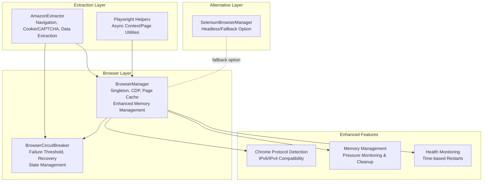
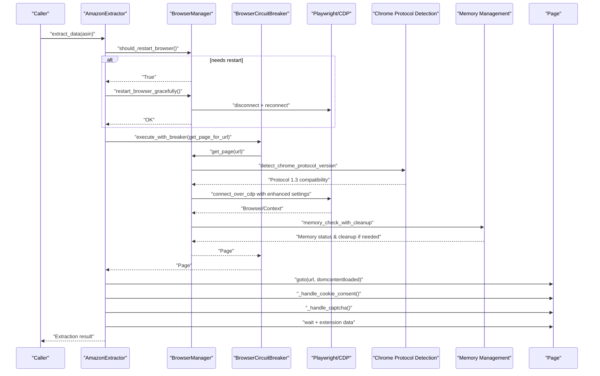
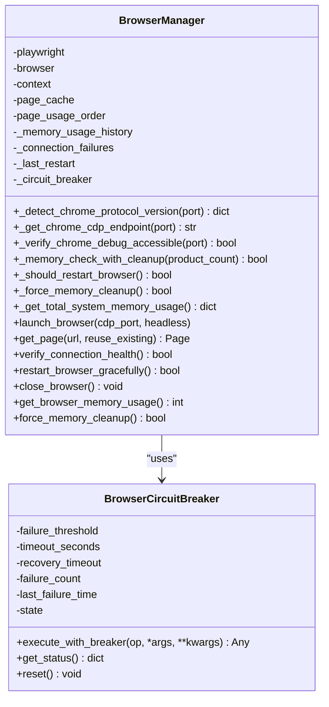
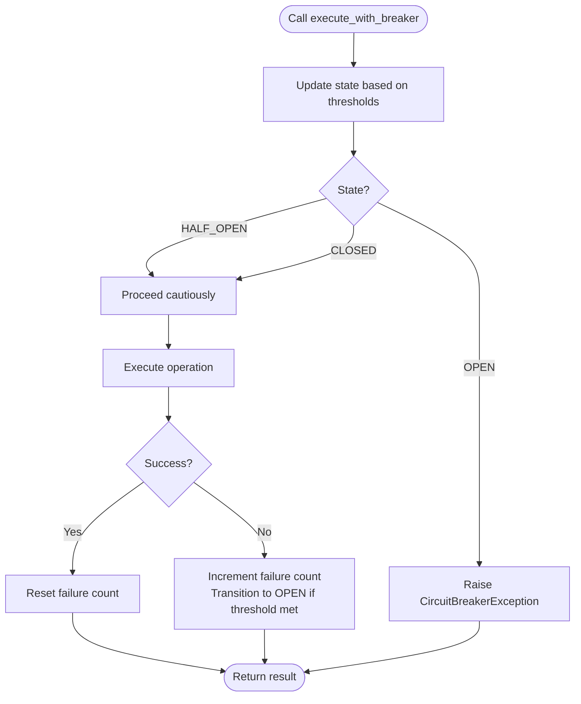
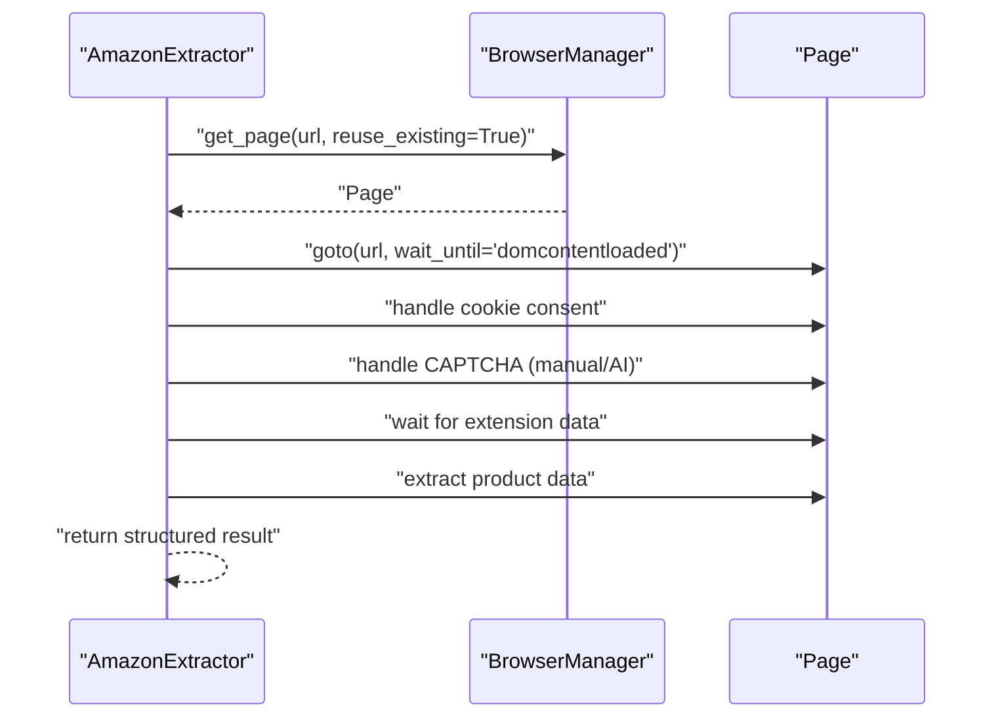
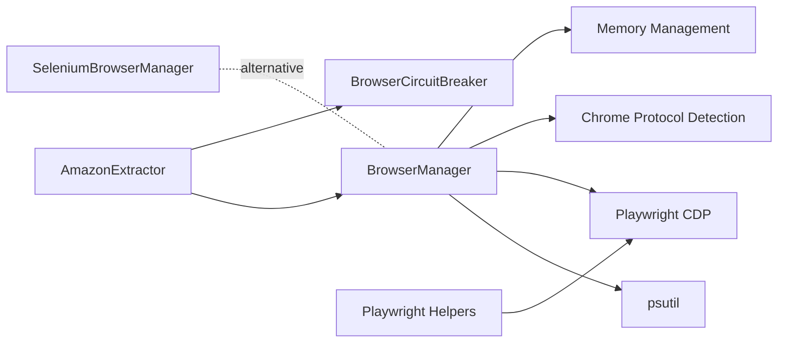

# Browser Automation

<cite>
**Referenced Files in This Document**
- [browser_manager.py](file://utils/browser_manager.py)
- [browser_circuit_breaker.py](file://utils/browser_circuit_breaker.py)
- [amazon_playwright_extractor.py](file://tools/amazon_playwright_extractor.py)
- [playwright_helpers.py](file://tools/legacy_utils/playwright_helpers.py)
- [selenium_browser_manager.py](file://tools/selenium_browser_manager.py)
- [TROUBLESHOOTING.md](file://docs/TROUBLESHOOTING.md)
- [SYSTEM_MEMORY_AND_BROWSER_MANAGEMENT_REPORT.md](file://SYSTEM_MEMORY_AND_BROWSER_MANAGEMENT_REPORT.md)
- [2. Installation And Setup.md](file://WIKI REPO SEPT17/2. Installation And Setup.md)
- [CHROME_CDP_CONNECTIVITY_TROUBLESHOOTING_REPORT.md](file://CHROME_CDP_CONNECTIVITY_TROUBLESHOOTING_REPORT.md)
- [CHROME_DEBUG_TROUBLESHOOTING_PROMPT.md](file://CHROME_DEBUG_TROUBLESHOOTING_PROMPT.md)
</cite>

## Update Summary
**Changes Made**
- Enhanced Chrome management with improved connection strategies for Chrome 139+ compatibility
- Added comprehensive memory monitoring and cleanup capabilities
- Implemented sophisticated health management with time-based restart policies
- Expanded troubleshooting guides for Chrome debug port issues and memory optimization
- Added protocol version detection and compatibility handling
- Integrated enhanced memory pressure detection for supplier scraping scenarios

## Table of Contents
1. [Introduction](#introduction)
2. [Project Structure](#project-structure)
3. [Core Components](#core-components)
4. [Architecture Overview](#architecture-overview)
5. [Detailed Component Analysis](#detailed-component-analysis)
6. [Dependency Analysis](#dependency-analysis)
7. [Performance Considerations](#performance-considerations)
8. [Troubleshooting Guide](#troubleshooting-guide)
9. [Conclusion](#conclusion)

## Introduction
This document explains the browser automation subsystem used by the Amazon FBA Agent System. It covers Chrome management via Playwright's CDP connection, page caching, circuit breaker protection, and Playwright integration. The system now features enhanced Chrome management with improved connection strategies, sophisticated memory monitoring, and comprehensive health management. It documents browser health monitoring, automatic restart capabilities, failure recovery mechanisms, configuration options for Chrome debugging and memory thresholds, and practical examples of browser initialization, page navigation, and data extraction workflows. The system includes new troubleshooting guides for Chrome debug port issues and memory management optimization.

## Project Structure
The browser automation stack centers around a singleton BrowserManager that orchestrates a persistent Chrome instance via CDP, caches pages for reuse, and enforces health checks and restart policies. The Amazon extractor integrates with the BrowserManager to perform robust navigation and data extraction, while helpers and a circuit breaker provide resilience and observability. The system now includes enhanced Chrome 139+ compatibility, sophisticated memory management, and comprehensive troubleshooting capabilities.

**Diagram sources**
- [browser_manager.py](file://utils/browser_manager.py#L35-L120)
- [browser_circuit_breaker.py](file://utils/browser_circuit_breaker.py#L37-L71)
- [amazon_playwright_extractor.py](file://tools/amazon_playwright_extractor.py#L63-L122)
- [playwright_helpers.py](file://tools/legacy_utils/playwright_helpers.py#L44-L98)
- [selenium_browser_manager.py](file://tools/selenium_browser_manager.py#L17-L79)

**Section sources**
- [browser_manager.py](file://utils/browser_manager.py#L1-L120)
- [amazon_playwright_extractor.py](file://tools/amazon_playwright_extractor.py#L63-L122)
- [playwright_helpers.py](file://tools/legacy_utils/playwright_helpers.py#L44-L98)
- [selenium_browser_manager.py](file://tools/selenium_browser_manager.py#L17-L79)

## Core Components
- **BrowserManager**: Centralized singleton managing a persistent Chrome instance via CDP, page caching, health checks, and graceful restarts. Now includes enhanced Chrome 139+ compatibility, memory pressure detection, and sophisticated restart policies.
- **BrowserCircuitBreaker**: Protects long-running operations against cascading failures with threshold-based open/half-open/closed states and comprehensive state management.
- **AmazonExtractor**: Orchestrates navigation, cookie consent, CAPTCHA handling, and extraction of product data, integrating with BrowserManager and the circuit breaker.
- **Playwright Helpers**: Utility functions for launching contexts/pages and connecting to Chrome debug ports.
- **SeleniumBrowserManager**: Alternative browser manager using Selenium/undetected-chromedriver for environments where Playwright CDP is not feasible.
- **Chrome Protocol Detection**: Enhanced compatibility layer for Chrome 139+ with Protocol 1.3, supporting both IPv6 and IPv4 endpoints.
- **Memory Management System**: Sophisticated memory monitoring with pressure detection, cleanup triggers, and system-wide resource tracking.
- **Health Monitoring**: Comprehensive health checks including connection validation, memory usage tracking, and automatic restart triggers.

**Section sources**
- [browser_manager.py](file://utils/browser_manager.py#L35-L120)
- [browser_circuit_breaker.py](file://utils/browser_circuit_breaker.py#L37-L71)
- [amazon_playwright_extractor.py](file://tools/amazon_playwright_extractor.py#L63-L122)
- [playwright_helpers.py](file://tools/legacy_utils/playwright_helpers.py#L44-L98)
- [selenium_browser_manager.py](file://tools/selenium_browser_manager.py#L17-L79)

## Architecture Overview
The system connects to an existing Chrome instance using CDP, ensuring session continuity and extension persistence. The BrowserManager maintains a small page cache and enforces health checks with enhanced memory monitoring. The AmazonExtractor performs navigation and extraction with circuit breaker protection and background-mode safeguards to avoid browser focus interference. The system now includes sophisticated Chrome 139+ compatibility detection, memory pressure monitoring, and automatic restart capabilities.

**Diagram sources**
- [amazon_playwright_extractor.py](file://tools/amazon_playwright_extractor.py#L317-L466)
- [browser_manager.py](file://utils/browser_manager.py#L848-L938)
- [browser_circuit_breaker.py](file://utils/browser_circuit_breaker.py#L72-L111)

## Detailed Component Analysis

### BrowserManager: Enhanced Chrome Management and Memory Monitoring
- **Singleton orchestration** of a persistent Chrome instance via CDP, avoiding new Chromium launches.
- **Enhanced Chrome 139+ compatibility** with protocol version detection and IPv6/IPv4 endpoint selection.
- **Sophisticated memory management** with pressure detection, cleanup triggers, and system-wide monitoring.
- **Time-based restart policies** with configurable intervals to prevent connection degradation.
- **Health monitoring** including connection failure counters, memory usage history, and automatic restart triggers.
- **Graceful restart capabilities** that preserve the external Chrome instance while reconnecting.

**Diagram sources**
- [browser_manager.py](file://utils/browser_manager.py#L35-L120)
- [browser_circuit_breaker.py](file://utils/browser_circuit_breaker.py#L37-L71)

**Section sources**
- [browser_manager.py](file://utils/browser_manager.py#L77-L140)
- [browser_manager.py](file://utils/browser_manager.py#L141-L198)
- [browser_manager.py](file://utils/browser_manager.py#L477-L542)
- [browser_manager.py](file://utils/browser_manager.py#L566-L621)
- [browser_manager.py](file://utils/browser_manager.py#L848-L938)
- [browser_manager.py](file://utils/browser_manager.py#L940-L978)
- [browser_manager.py](file://utils/browser_manager.py#L985-L1068)

### Enhanced Chrome Protocol Detection and Compatibility
- **Protocol version detection** for Chrome 139+ with Protocol 1.3 compatibility assessment.
- **Dual-stack endpoint support** with IPv6 preference for Chrome 139+ and IPv4 fallback.
- **Progressive connection attempts** with increasing timeouts and conservative timing for Chrome 139+.
- **WebSocket fallback approach** for maximum compatibility with various Chrome versions.
- **Dynamic configuration** based on detected Chrome version and protocol compatibility.

**Section sources**
- [browser_manager.py](file://utils/browser_manager.py#L477-L542)
- [browser_manager.py](file://utils/browser_manager.py#L566-L621)
- [browser_manager.py](file://utils/browser_manager.py#L398-L428)
- [browser_manager.py](file://utils/browser_manager.py#L430-L454)
- [browser_manager.py](file://utils/browser_manager.py#L456-L475)

### Sophisticated Memory Management System
- **Memory pressure detection** with thresholds for Chrome, Python, and system memory.
- **Automatic cleanup triggers** at 1.5GB Chrome, 2GB Python, or 80% system memory usage.
- **Enhanced memory cleanup** with page cache clearing, garbage collection, and memory statistics.
- **Supplier scraping optimization** with reduced memory thresholds for extended operations.
- **System-wide monitoring** including Node.js process detection and platform-specific features.

**Section sources**
- [browser_manager.py](file://utils/browser_manager.py#L940-L978)
- [browser_manager.py](file://utils/browser_manager.py#L658-L720)
- [browser_manager.py](file://utils/browser_manager.py#L721-L800)
- [browser_manager.py](file://utils/browser_manager.py#L902-L932)

### BrowserCircuitBreaker: Advanced Protection and Recovery
- Implements a classic circuit breaker with CLOSED/OPEN/HALF_OPEN states.
- Enhanced state management with recovery timeout and automatic state transitions.
- Integration with BrowserManager for comprehensive operation protection.
- Support for both browser operations and authentication circuit breakers.

**Diagram sources**
- [browser_circuit_breaker.py](file://utils/browser_circuit_breaker.py#L72-L184)

**Section sources**
- [browser_circuit_breaker.py](file://utils/browser_circuit_breaker.py#L37-L71)
- [browser_circuit_breaker.py](file://utils/browser_circuit_breaker.py#L72-L111)
- [browser_circuit_breaker.py](file://utils/browser_circuit_breaker.py#L112-L184)

### AmazonExtractor: Navigation and Data Extraction
- Connects to BrowserManager singleton and retrieves pages with circuit breaker protection.
- Handles cookie consent and CAPTCHA with manual fallback and optional AI assistance.
- Implements background-mode safeguards to prevent browser focus interference.
- Extracts product details, prices, images, sales rank, ratings, features, descriptions, specifications, and integrates Keepa/SellerAmp data with fallbacks.

**Diagram sources**
- [amazon_playwright_extractor.py](file://tools/amazon_playwright_extractor.py#L317-L466)

**Section sources**
- [amazon_playwright_extractor.py](file://tools/amazon_playwright_extractor.py#L97-L122)
- [amazon_playwright_extractor.py](file://tools/amazon_playwright_extractor.py#L317-L466)
- [amazon_playwright_extractor.py](file://tools/amazon_playwright_extractor.py#L467-L776)

### Playwright Helpers: Context and Page Utilities
- Provides standardized async functions to launch browsers, contexts, and pages.
- Supports connecting to Chrome debug ports and persistent contexts.
- Useful for auxiliary tasks and testing.

**Section sources**
- [playwright_helpers.py](file://tools/legacy_utils/playwright_helpers.py#L44-L98)
- [playwright_helpers.py](file://tools/legacy_utils/playwright_helpers.py#L122-L154)
- [playwright_helpers.py](file://tools/legacy_utils/playwright_helpers.py#L157-L182)

### SeleniumBrowserManager: Alternative Browser Manager
- Offers a Selenium-based manager using undetected-chromedriver for environments where Playwright CDP is not applicable.
- Includes stealth options, headless mode, and anti-detection measures.

**Section sources**
- [selenium_browser_manager.py](file://tools/selenium_browser_manager.py#L17-L79)
- [selenium_browser_manager.py](file://tools/selenium_browser_manager.py#L80-L158)

## Dependency Analysis
- BrowserManager depends on Playwright's CDP to connect to an existing Chrome instance and on psutil for memory monitoring.
- Enhanced with Chrome protocol detection for Chrome 139+ compatibility.
- AmazonExtractor depends on BrowserManager for page lifecycle and on BrowserCircuitBreaker for operation protection.
- Playwright Helpers provide reusable utilities for context/page creation and CDP connection.
- SeleniumBrowserManager is an alternative path for environments requiring Selenium.
- Memory management system integrates with system monitoring and health management.

**Diagram sources**
- [browser_manager.py](file://utils/browser_manager.py#L19-L26)
- [amazon_playwright_extractor.py](file://tools/amazon_playwright_extractor.py#L21-L29)
- [playwright_helpers.py](file://tools/legacy_utils/playwright_helpers.py#L13-L14)
- [selenium_browser_manager.py](file://tools/selenium_browser_manager.py#L8-L15)

**Section sources**
- [browser_manager.py](file://utils/browser_manager.py#L19-L26)
- [amazon_playwright_extractor.py](file://tools/amazon_playwright_extractor.py#L21-L29)
- [playwright_helpers.py](file://tools/legacy_utils/playwright_helpers.py#L13-L14)
- [selenium_browser_manager.py](file://tools/selenium_browser_manager.py#L8-L15)

## Performance Considerations
- **Enhanced Page Caching**: Reduced to 1 cached page to prevent Keepa extension failures and improve stability.
- **Memory Pressure Detection**: Automatic cleanup at 1.5GB Chrome, 2GB Python, or 80% system memory usage.
- **Time-based Restarts**: Every 2.5 hours to prevent Chrome CDP connection degradation and accumulated state drift.
- **Background-mode Safeguards**: Prevent focus-induced UI changes that could disrupt automation.
- **Supplier Scraping Optimization**: Reduced memory thresholds for extended operations with supplier scraping.
- **Protocol 1.3 Compatibility**: Enhanced handling for Chrome 139+ with progressive timeouts and conservative timing.

## Troubleshooting Guide
**Updated** Enhanced troubleshooting with comprehensive Chrome debug port issues and memory management optimization.

### Chrome Debug Port Issues
- **Port Accessibility**: Ensure Chrome is launched with correct debug flags and port; verify with curl tests.
- **Protocol Version Mismatch**: Chrome 139+ introduces Protocol 1.3 requiring enhanced compatibility handling.
- **IPv6/IPv4 Binding**: Chrome 139+ prefers IPv6 binding; system automatically detects and uses appropriate endpoint.
- **Connection Timeouts**: Progressive timeout increases for Chrome 139+ with up to 60-second timeouts.
- **Process Conflicts**: Check for conflicting Chrome processes using netstat or tasklist commands.

### Memory Management Optimization
- **Memory Pressure Detection**: System automatically triggers cleanup at 1.5GB Chrome, 2GB Python, or 80% system usage.
- **Automatic Cleanup**: Force memory cleanup with page cache clearing and garbage collection.
- **Supplier Scraping Memory**: Reduced thresholds for extended supplier scraping operations.
- **System Monitoring**: Monitor memory usage through system logs in `logs/health/`.

### Enhanced Troubleshooting Procedures
- **Chrome Protocol Detection**: Use `_detect_chrome_protocol_version()` to identify Chrome version and protocol compatibility.
- **Endpoint Verification**: Test both IPv6 and IPv4 endpoints for Chrome 139+ compatibility.
- **Connection Strategies**: Implement progressive connection attempts with increasing timeouts.
- **Memory Monitoring**: Use `get_total_system_memory_usage()` for comprehensive system resource tracking.

**Section sources**
- [browser_manager.py](file://utils/browser_manager.py#L242-L314)
- [browser_manager.py](file://utils/browser_manager.py#L302-L314)
- [browser_manager.py](file://utils/browser_manager.py#L477-L542)
- [browser_manager.py](file://utils/browser_manager.py#L566-L621)
- [browser_manager.py](file://utils/browser_manager.py#L940-L978)
- [TROUBLESHOOTING.md](file://docs/TROUBLESHOOTING.md#L111-L145)
- [CHROME_CDP_CONNECTIVITY_TROUBLESHOOTING_REPORT.md](file://CHROME_CDP_CONNECTIVITY_TROUBLESHOOTING_REPORT.md#L1-L126)
- [CHROME_DEBUG_TROUBLESHOOTING_PROMPT.md](file://CHROME_DEBUG_TROUBLESHOOTING_PROMPT.md#L1-L33)

## Conclusion
The browser automation subsystem is built around a resilient, persistent Chrome connection via CDP with enhanced compatibility for Chrome 139+ and sophisticated memory management. The system now includes comprehensive health monitoring, automatic restart capabilities, and advanced troubleshooting procedures. The AmazonExtractor leverages these foundations to deliver robust navigation and extraction with background-mode safeguards and fallback strategies. Enhanced Chrome protocol detection, memory pressure monitoring, and time-based restarts ensure long-running sessions remain stable, while comprehensive troubleshooting pathways support rapid recovery from common issues including Chrome debug port accessibility and memory management optimization.