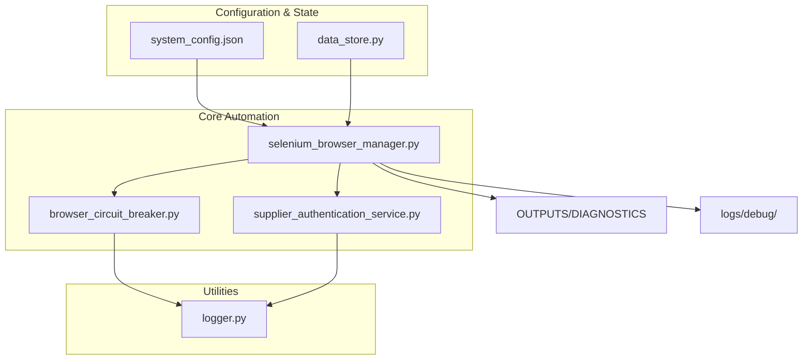
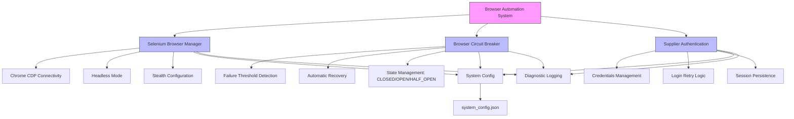
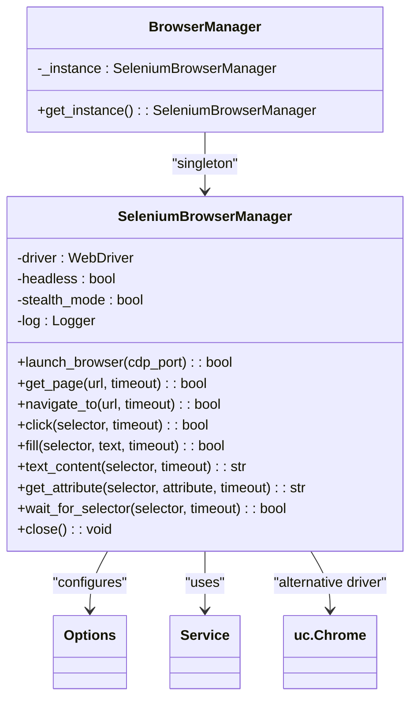
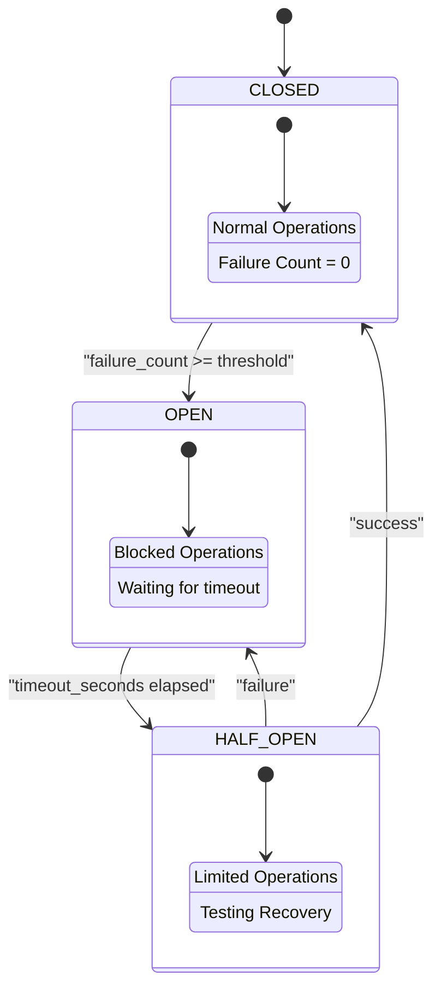
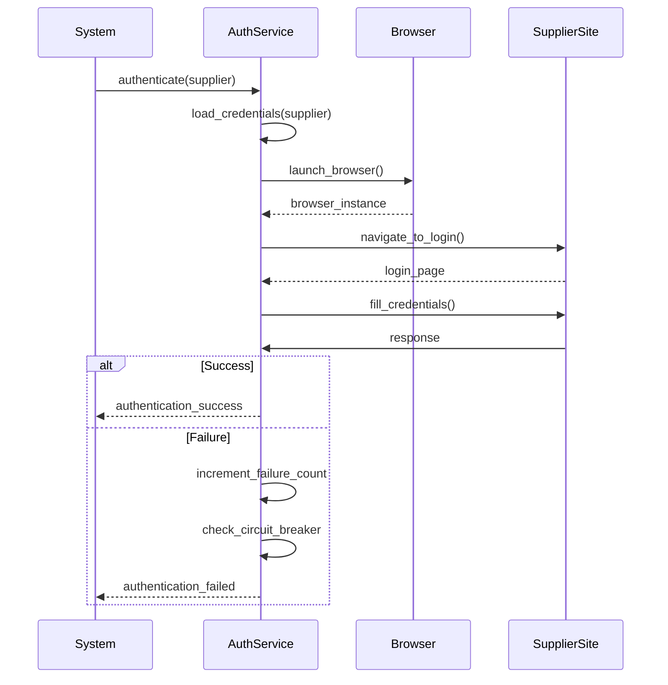
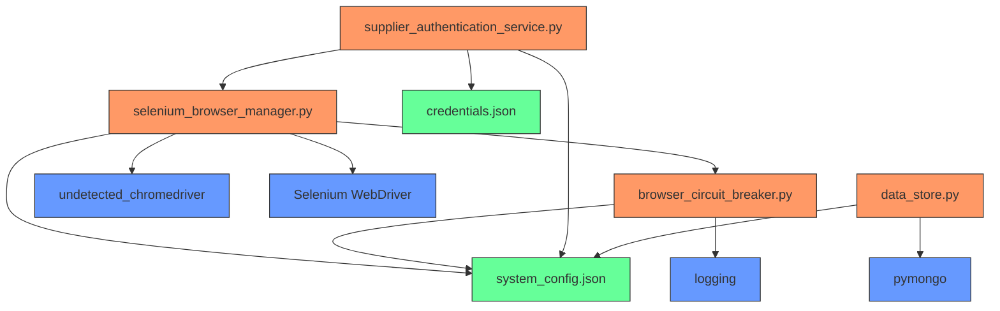

# Browser Automation

<cite>
**Referenced Files in This Document**   
- [selenium_browser_manager.py](file://tools/selenium_browser_manager.py)
- [supplier_authentication_service.py](file://tools/supplier_authentication_service.py)
- [browser_circuit_breaker.py](file://utils/browser_circuit_breaker.py)
- [system_config.json](file://config/system_config.json)
- [data_store.py](file://utils/data_store.py)
</cite>

## Table of Contents
1. [Introduction](#introduction)
2. [Project Structure](#project-structure)
3. [Core Components](#core-components)
4. [Architecture Overview](#architecture-overview)
5. [Detailed Component Analysis](#detailed-component-analysis)
6. [Dependency Analysis](#dependency-analysis)
7. [Performance Considerations](#performance-considerations)
8. [Troubleshooting Guide](#troubleshooting-guide)
9. [Conclusion](#conclusion)

## Introduction
This document provides comprehensive documentation for the browser automation system within the Amazon FBA Agent System, focusing on Chrome management and Playwright integration. The system enables robust, resilient automation for supplier website scraping through advanced browser health monitoring, circuit breaker protection, and automatic restart capabilities. It leverages Chrome DevTools Protocol (CDP) connectivity for deep browser control and integrates tightly with supplier authentication, state management, and diagnostic subsystems. The architecture is designed to handle extended marathon sessions while maintaining stability and performance.

## Project Structure
The browser automation components are organized across multiple directories with clear separation of concerns. Core browser management resides in the `tools/` directory, while circuit breaker logic and utility functions are located in `utils/`. Configuration parameters that govern browser behavior are centralized in `config/system_config.json`.

**Diagram sources**
- [selenium_browser_manager.py](file://tools/selenium_browser_manager.py#L1-L175)
- [browser_circuit_breaker.py](file://utils/browser_circuit_breaker.py#L1-L213)
- [system_config.json](file://config/system_config.json#L1-L300)

**Section sources**
- [selenium_browser_manager.py](file://tools/selenium_browser_manager.py#L1-L175)
- [browser_circuit_breaker.py](file://utils/browser_circuit_breaker.py#L1-L213)
- [system_config.json](file://config/system_config.json#L1-L300)

## Core Components
The browser automation system consists of several key components: the Selenium Browser Manager for Chrome instance control, the Browser Circuit Breaker for failure resilience, the Supplier Authentication Service for login management, and integration with the system configuration and data persistence layers. These components work together to provide a stable, self-healing automation framework capable of handling complex supplier websites over extended periods.

**Section sources**
- [selenium_browser_manager.py](file://tools/selenium_browser_manager.py#L1-L175)
- [browser_circuit_breaker.py](file://utils/browser_circuit_breaker.py#L1-L213)
- [supplier_authentication_service.py](file://tools/supplier_authentication_service.py#L1-L113)

## Architecture Overview
The browser automation architecture follows a layered design with clear separation between browser control, error resilience, authentication, and configuration management. The system uses a singleton pattern for browser instance management, ensuring resource efficiency while providing circuit breaker protection for all operations. Chrome CDP connectivity enables advanced debugging and monitoring capabilities.

**Diagram sources**
- [selenium_browser_manager.py](file://tools/selenium_browser_manager.py#L1-L175)
- [browser_circuit_breaker.py](file://utils/browser_circuit_breaker.py#L1-L213)
- [supplier_authentication_service.py](file://tools/supplier_authentication_service.py#L1-L113)
- [system_config.json](file://config/system_config.json#L1-L300)

## Detailed Component Analysis

### Browser Manager Analysis
The Selenium Browser Manager provides comprehensive Chrome instance management with support for headless operation, stealth mode, and CDP debugging. It uses undetected-chromedriver to bypass anti-bot detection and implements proper resource cleanup.

**Diagram sources**
- [selenium_browser_manager.py](file://tools/selenium_browser_manager.py#L1-L175)

**Section sources**
- [selenium_browser_manager.py](file://tools/selenium_browser_manager.py#L1-L175)

### Circuit Breaker Analysis
The Browser Circuit Breaker implements the circuit breaker pattern to prevent cascading failures during extended automation sessions. It tracks failure counts and automatically blocks operations when thresholds are exceeded, allowing time for recovery.

**Diagram sources**
- [browser_circuit_breaker.py](file://utils/browser_circuit_breaker.py#L1-L213)

**Section sources**
- [browser_circuit_breaker.py](file://utils/browser_circuit_breaker.py#L1-L213)

### Authentication Service Analysis
The Supplier Authentication Service manages login processes for supplier websites, handling credentials securely and implementing retry logic with backoff for failed login attempts.

**Diagram sources**
- [supplier_authentication_service.py](file://tools/supplier_authentication_service.py#L1-L113)
- [system_config.json](file://config/system_config.json#L1-L300)

**Section sources**
- [supplier_authentication_service.py](file://tools/supplier_authentication_service.py#L1-L113)

## Dependency Analysis
The browser automation system has well-defined dependencies between components, with configuration driving behavior and circuit breaker protection wrapping critical operations.

**Diagram sources**
- [selenium_browser_manager.py](file://tools/selenium_browser_manager.py#L1-L175)
- [browser_circuit_breaker.py](file://utils/browser_circuit_breaker.py#L1-L213)
- [supplier_authentication_service.py](file://tools/supplier_authentication_service.py#L1-L113)
- [system_config.json](file://config/system_config.json#L1-L300)
- [data_store.py](file://utils/data_store.py#L1-L22)

**Section sources**
- [selenium_browser_manager.py](file://tools/selenium_browser_manager.py#L1-L175)
- [browser_circuit_breaker.py](file://utils/browser_circuit_breaker.py#L1-L213)
- [supplier_authentication_service.py](file://tools/supplier_authentication_service.py#L1-L113)
- [system_config.json](file://config/system_config.json#L1-L300)
- [data_store.py](file://utils/data_store.py#L1-L22)

## Performance Considerations
The system includes several performance optimizations for browser automation, including headless mode configuration, memory management, and concurrent instance handling. The configuration file specifies key performance parameters such as timeout values, retry strategies, and resource limits.

**Section sources**
- [system_config.json](file://config/system_config.json#L1-L300)
- [selenium_browser_manager.py](file://tools/selenium_browser_manager.py#L1-L175)

## Troubleshooting Guide
Common browser-related issues include debug port conflicts, memory leaks, and WebSocket connection problems. The system addresses these through proper resource cleanup, circuit breaker protection, and health monitoring. For debug port conflicts, ensure no other Chrome instances are using the configured port (default: 9222). Memory leaks are mitigated through the circuit breaker's automatic restart capability and proper browser instance cleanup.

**Section sources**
- [selenium_browser_manager.py](file://tools/selenium_browser_manager.py#L1-L175)
- [browser_circuit_breaker.py](file://utils/browser_circuit_breaker.py#L1-L213)
- [CHROME_CDP_CONNECTIVITY_TROUBLESHOOTING_REPORT.md](file://CHROME_CDP_CONNECTIVITY_TROUBLESHOOTING_REPORT.md)

## Conclusion
The browser automation system provides a robust foundation for supplier website scraping with comprehensive Chrome management and Playwright integration. Its architecture emphasizes resilience through browser health management, circuit breaker protection, and automatic restart capabilities. The integration of Chrome CDP connectivity enables advanced debugging and monitoring, while the authentication system ensures reliable access to supplier websites. This system is designed to handle the challenges of extended automation sessions while maintaining stability and performance.