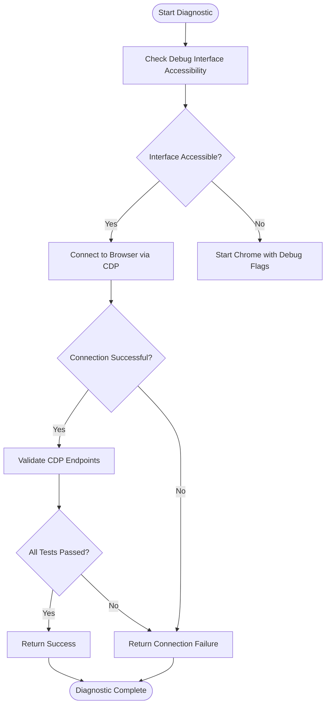
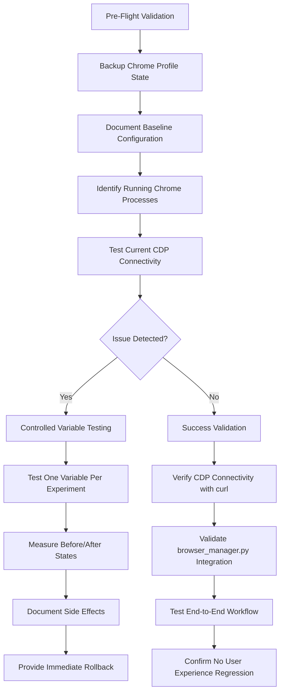
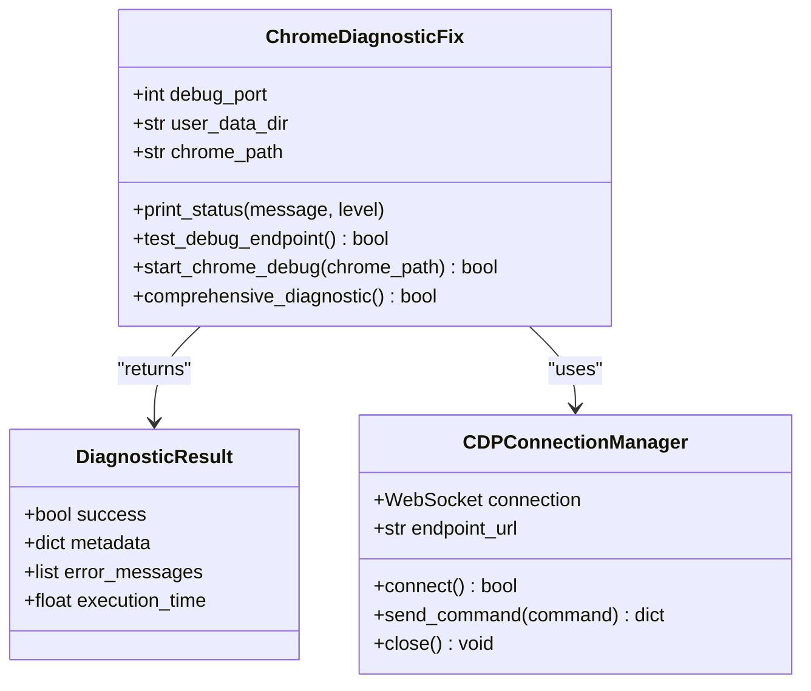
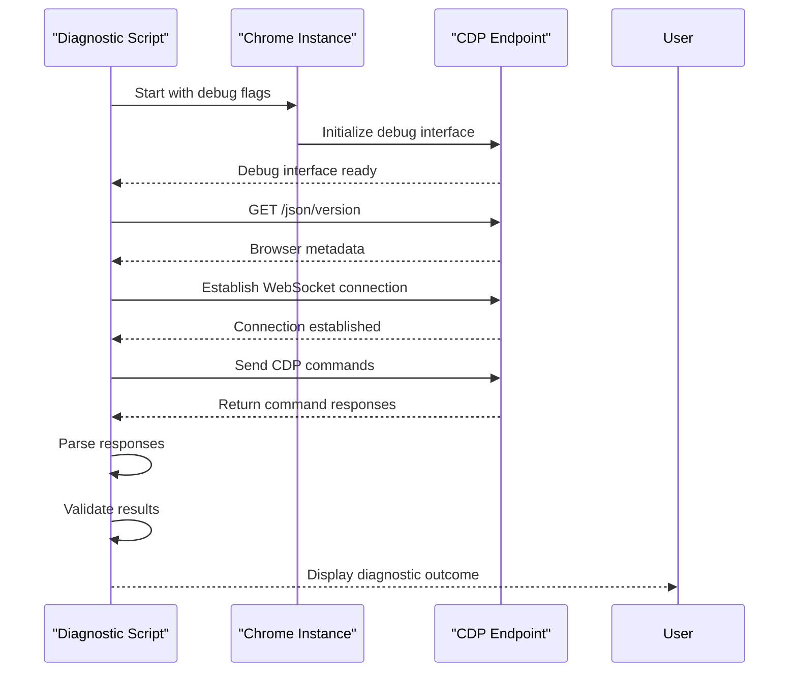
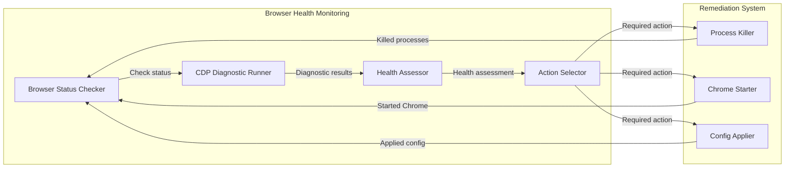

# Chrome DevTools Protocol Diagnostics

<cite>
**Referenced Files in This Document**   
- [chrome_cdp_diagnostic.py](file://chrome_cdp_diagnostic.py)
- [chrome_cdp_diagnostic_fix.py](file://chrome_cdp_diagnostic_fix.py)
- [CHROME_CDP_CONNECTIVITY_TROUBLESHOOTING_REPORT.md](file://CHROME_CDP_CONNECTIVITY_TROUBLESHOOTING_REPORT.md)
- [chrome_cdp_final_fix.py](file://chrome_cdp_final_fix.py)
- [chrome_quick_fix.py](file://chrome_quick_fix.py)
</cite>

## Table of Contents
1. [Introduction](#introduction)
2. [CDP Diagnostic Implementation](#cdp-diagnostic-implementation)
3. [Common Failure Modes](#common-failure-modes)
4. [Diagnostic Procedures](#diagnostic-procedures)
5. [Fix Implementation](#fix-implementation)
6. [CDP Command Execution](#cdp-command-execution)
7. [Integration with Browser Health Monitoring](#integration-with-browser-health-monitoring)
8. [Performance Considerations](#performance-considerations)

## Introduction
The Chrome DevTools Protocol (CDP) diagnostics system provides comprehensive tools for establishing WebSocket connections to Chrome instances, retrieving browser metadata, and validating CDP endpoints. This documentation details the implementation across multiple diagnostic and fix scripts, addressing connectivity issues that impact the Amazon FBA Agent System's browser automation capabilities.

## CDP Diagnostic Implementation

The diagnostic implementation in chrome_cdp_diagnostic.py establishes WebSocket connections to Chrome instances through a systematic process that verifies connectivity at multiple levels. The system retrieves browser metadata by querying the debug interface endpoint and validates CDP endpoints through comprehensive testing protocols.

**Diagram sources**
- [chrome_cdp_diagnostic.py](file://chrome_cdp_diagnostic.py#L1-L420)

**Section sources**
- [chrome_cdp_diagnostic.py](file://chrome_cdp_diagnostic.py#L1-L420)

## Common Failure Modes

The system addresses several common failure modes that prevent successful CDP connectivity:

### WebSocket Connection Timeouts
WebSocket connection timeouts occur when the diagnostic cannot establish a connection to the Chrome debug port within the specified timeout period. This typically happens when Chrome is not running or the debug interface has not fully initialized.

### Invalid Debug Ports
Invalid debug ports occur when the configured debug port is either unavailable due to conflicts with other processes or when Chrome fails to bind to the specified port. The default port 9222 may be hijacked by system services or other applications.

### Protocol Version Mismatches
Protocol version mismatches arise when there are incompatibilities between the Chrome browser version and the CDP client implementation. Recent Chrome updates, particularly version 139, have introduced changes affecting the debug protocol that require specific handling.

**Section sources**
- [CHROME_CDP_CONNECTIVITY_TROUBLESHOOTING_REPORT.md](file://CHROME_CDP_CONNECTIVITY_TROUBLESHOOTING_REPORT.md#L33-L69)
- [chrome_cdp_diagnostic.py](file://chrome_cdp_diagnostic.py#L1-L420)

## Diagnostic Procedures

The diagnostic procedures from CHROME_CDP_CONNECTIVITY_TROUBLESHOOTING_REPORT.md provide a systematic approach to identifying and resolving CDP connectivity issues. The process begins with investigating potential causes such as Chrome version changes, system environment modifications, and profile directory conflicts.

**Diagram sources**
- [CHROME_CDP_CONNECTIVITY_TROUBLESHOOTING_REPORT.md](file://CHROME_CDP_CONNECTIVITY_TROUBLESHOOTING_REPORT.md#L33-L69)
- [diagnostics/state_events/state_1757011359.json](file://diagnostics/state_events/state_1757011359.json#L247-L309)

**Section sources**
- [CHROME_CDP_CONNECTIVITY_TROUBLESHOOTING_REPORT.md](file://CHROME_CDP_CONNECTIVITY_TROUBLESHOOTING_REPORT.md#L33-L76)
- [diagnostics/state_events/state_1757011359.json](file://diagnostics/state_events/state_1757011359.json#L247-L309)

## Fix Implementation

The fix implementation in chrome_cdp_diagnostic_fix.py addresses CDP connectivity issues through retry logic, port scanning, and fallback strategies. The solution includes comprehensive error handling for various connection failure scenarios.

**Diagram sources**
- [chrome_cdp_diagnostic_fix.py](file://chrome_cdp_diagnostic_fix.py#L1-L214)

**Section sources**
- [chrome_cdp_diagnostic_fix.py](file://chrome_cdp_diagnostic_fix.py#L1-L214)
- [chrome_cdp_final_fix.py](file://chrome_cdp_final_fix.py#L1-L54)

## CDP Command Execution

The system implements CDP command execution with proper response parsing and error handling. The diagnostic scripts demonstrate how to execute commands against the Chrome DevTools Protocol, parse responses, and handle various error conditions that may occur during communication.

**Diagram sources**
- [chrome_cdp_diagnostic.py](file://chrome_cdp_diagnostic.py#L1-L420)
- [chrome_cdp_diagnostic_fix.py](file://chrome_cdp_diagnostic_fix.py#L1-L214)

**Section sources**
- [chrome_cdp_diagnostic.py](file://chrome_cdp_diagnostic.py#L1-L420)
- [chrome_cdp_diagnostic_fix.py](file://chrome_cdp_diagnostic_fix.py#L1-L214)

## Integration with Browser Health Monitoring

The CDP diagnostics integrate with the broader browser health monitoring system by providing status updates and diagnostic results that inform the overall system health assessment. The diagnostic outcomes are used to determine whether browser automation can proceed or if remediation steps are required.

**Diagram sources**
- [chrome_cdp_diagnostic.py](file://chrome_cdp_diagnostic.py#L1-L420)
- [chrome_cdp_diagnostic_fix.py](file://chrome_cdp_diagnostic_fix.py#L1-L214)

**Section sources**
- [chrome_cdp_diagnostic.py](file://chrome_cdp_diagnostic.py#L1-L420)
- [chrome_cdp_diagnostic_fix.py](file://chrome_cdp_diagnostic_fix.py#L1-L214)

## Performance Considerations

The system addresses performance considerations for CDP communication overhead and strategies to minimize diagnostic impact on scraping operations. The diagnostic scripts are designed to be efficient and non-intrusive, ensuring minimal disruption to ongoing scraping activities.

**Section sources**
- [chrome_cdp_diagnostic.py](file://chrome_cdp_diagnostic.py#L1-L420)
- [chrome_cdp_diagnostic_fix.py](file://chrome_cdp_diagnostic_fix.py#L1-L214)