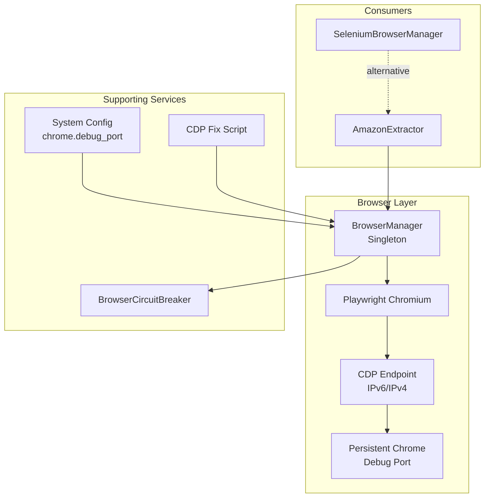
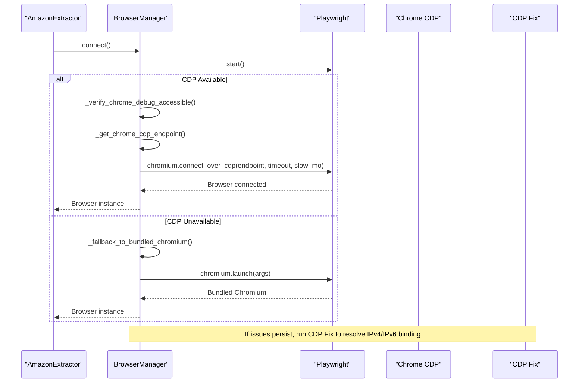
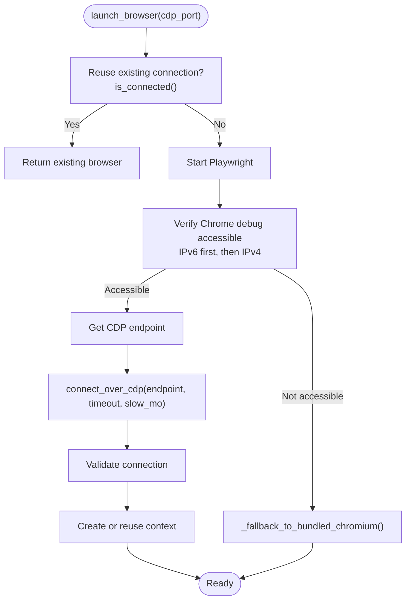
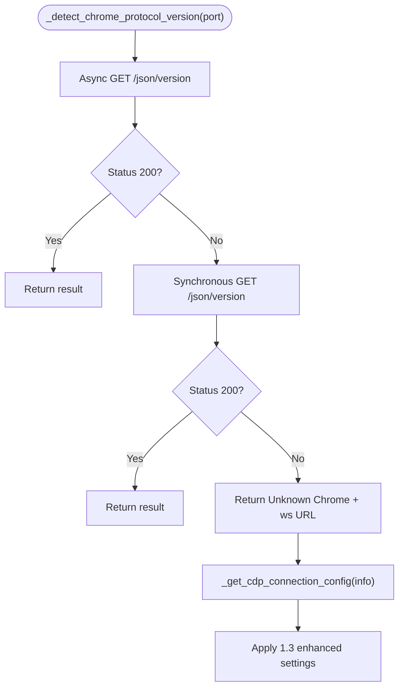
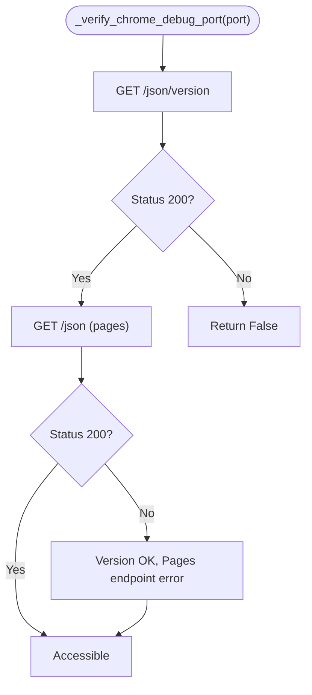
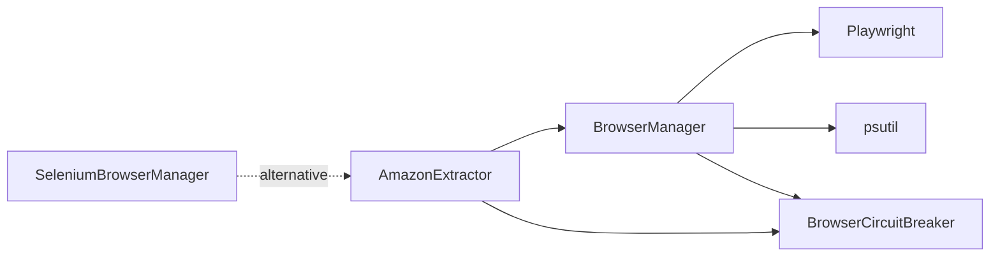

# Browser Connection Strategies

<cite>
**Referenced Files in This Document**
- [browser_manager.py](file://utils/browser_manager.py)
- [browser_circuit_breaker.py](file://utils/browser_circuit_breaker.py)
- [amazon_playwright_extractor.py](file://tools/amazon_playwright_extractor.py)
- [selenium_browser_manager.py](file://tools/selenium_browser_manager.py)
- [chrome_cdp_final_fix.py](file://chrome_cdp_final_fix.py)
- [system_config.json](file://config/system_config.json)
- [TROUBLESHOOTING.md](file://docs/TROUBLESHOOTING.md)
</cite>

## Table of Contents
1. [Introduction](#introduction)
2. [Project Structure](#project-structure)
3. [Core Components](#core-components)
4. [Architecture Overview](#architecture-overview)
5. [Detailed Component Analysis](#detailed-component-analysis)
6. [Dependency Analysis](#dependency-analysis)
7. [Performance Considerations](#performance-considerations)
8. [Troubleshooting Guide](#troubleshooting-guide)
9. [Conclusion](#conclusion)

## Introduction
This document explains the browser connection strategies used by the Amazon FBA Agent System. It focuses on the dual-mode connection approach that connects to an existing Chrome instance via Chrome DevEditor Protocol (CDP) and falls back to Playwright’s bundled Chromium when necessary. It covers enhanced compatibility mode for Chrome 139.x with Protocol 1.3, IPv6/IPv4 endpoint detection, progressive timeout handling, connection verification, error handling, and troubleshooting. Practical examples illustrate initialization, protocol detection, and fallback scenarios, along with configuration options for debugging ports, user data directories, and connection parameters.

## Project Structure
The browser connection logic is primarily implemented in a centralized singleton manager that orchestrates Playwright’s Chromium connections, maintains page caching, and enforces health checks and restart policies. Supporting components include a circuit breaker for resilience, a Selenium-based manager for alternative environments, and a dedicated fix script for IPv4/IPv6 CDP connectivity issues.

**Diagram sources**
- [browser_manager.py](file://utils/browser_manager.py#L35-L140)
- [browser_circuit_breaker.py](file://utils/browser_circuit_breaker.py#L37-L110)
- [amazon_playwright_extractor.py](file://tools/amazon_playwright_extractor.py#L63-L122)
- [selenium_browser_manager.py](file://tools/selenium_browser_manager.py#L17-L80)
- [chrome_cdp_final_fix.py](file://chrome_cdp_final_fix.py#L28-L86)
- [system_config.json](file://config/system_config.json#L200-L207)

**Section sources**
- [browser_manager.py](file://utils/browser_manager.py#L35-L140)
- [system_config.json](file://config/system_config.json#L200-L207)

## Core Components
- Centralized BrowserManager singleton that:
  - Connects to an existing Chrome instance via CDP (preferred).
  - Detects Chrome version and Protocol 1.3 for Chrome 139.x.
  - Implements IPv6/IPv4 endpoint selection with fallback.
  - Applies progressive timeout handling for enhanced compatibility.
  - Provides graceful restart and health monitoring.
- BrowserCircuitBreaker that protects long-running sessions from cascading failures.
- AmazonExtractor that consumes BrowserManager for page navigation and data extraction.
- SeleniumBrowserManager as an alternative browser manager for environments where Playwright/CWP is not feasible.
- CDP Fix script to diagnose and resolve IPv4/IPv6 binding issues in Chrome v139.

**Section sources**
- [browser_manager.py](file://utils/browser_manager.py#L35-L140)
- [browser_circuit_breaker.py](file://utils/browser_circuit_breaker.py#L37-L110)
- [amazon_playwright_extractor.py](file://tools/amazon_playwright_extractor.py#L63-L122)
- [selenium_browser_manager.py](file://tools/selenium_browser_manager.py#L17-L80)
- [chrome_cdp_final_fix.py](file://chrome_cdp_final_fix.py#L28-L86)

## Architecture Overview
The system uses a dual-mode connection strategy:
- Primary: Connect to an existing Chrome instance using CDP with IPv6/IPv4 detection and enhanced compatibility mode for Chrome 139.x.
- Fallback: Launch Playwright’s bundled Chromium when CDP is unavailable or incompatible.

**Diagram sources**
- [browser_manager.py](file://utils/browser_manager.py#L77-L140)
- [browser_manager.py](file://utils/browser_manager.py#L209-L241)
- [chrome_cdp_final_fix.py](file://chrome_cdp_final_fix.py#L57-L118)

## Detailed Component Analysis

### BrowserManager: Dual-Mode Connection and Enhanced Compatibility
- Launch and reuse existing Chrome via CDP:
  - Verifies debug port accessibility using IPv6 first, then IPv4.
  - Determines the correct endpoint dynamically for Chrome 139.x Protocol 1.3.
  - Uses progressive timeout and slow motion settings for reliability.
- Fallback to bundled Chromium:
  - Launches headless Chromium with anti-detection and compatibility arguments.
  - Preserves automation functionality while acknowledging missing Chrome profile and extensions.
- Health management and restart:
  - Periodic health checks and time-based restarts to prevent resource exhaustion.
  - Memory-aware cleanup and circuit breaker integration.
- Page caching and reuse:
  - Maintains a small LRU cache to reduce overhead and improve throughput.

**Diagram sources**
- [browser_manager.py](file://utils/browser_manager.py#L77-L140)
- [browser_manager.py](file://utils/browser_manager.py#L209-L241)
- [browser_manager.py](file://utils/browser_manager.py#L242-L301)

**Section sources**
- [browser_manager.py](file://utils/browser_manager.py#L77-L140)
- [browser_manager.py](file://utils/browser_manager.py#L209-L241)
- [browser_manager.py](file://utils/browser_manager.py#L242-L301)
- [browser_manager.py](file://utils/browser_manager.py#L398-L429)
- [browser_manager.py](file://utils/browser_manager.py#L430-L454)
- [browser_manager.py](file://utils/browser_manager.py#L456-L476)

### Enhanced Compatibility Mode for Chrome 139.x with Protocol 1.3
- Protocol detection:
  - Attempts to fetch `/json/version` via IPv4/IPv6 to determine Chrome version and Protocol-Version.
  - Falls back to synchronous detection if async fails.
- Dynamic configuration:
  - For Chrome 139.x with Protocol 1.3, increases timeout and slow motion progressively across attempts.
- Endpoint selection:
  - Prefers IPv6 for Chrome 139+; defaults to IPv6 if both IPv4 and IPv6 checks fail.
- Progressive retries:
  - Increases delays and timeouts per attempt to accommodate slower initialization.

**Diagram sources**
- [browser_manager.py](file://utils/browser_manager.py#L477-L513)
- [browser_manager.py](file://utils/browser_manager.py#L514-L526)
- [browser_manager.py](file://utils/browser_manager.py#L527-L543)

**Section sources**
- [browser_manager.py](file://utils/browser_manager.py#L477-L513)
- [browser_manager.py](file://utils/browser_manager.py#L527-L543)
- [browser_manager.py](file://utils/browser_manager.py#L398-L429)

### Connection Verification and Error Handling
- Port verification:
  - Validates debug port accessibility and lists pages/tabs for diagnostics.
- Troubleshooting guidance:
  - Provides actionable steps for launching Chrome with debug flags, checking port usage, and resolving version mismatches.
- Enhanced troubleshooting:
  - Includes version-specific guidance for Chrome 139.x Protocol 1.3 and Playwright compatibility.

**Diagram sources**
- [browser_manager.py](file://utils/browser_manager.py#L566-L622)

**Section sources**
- [browser_manager.py](file://utils/browser_manager.py#L566-L622)
- [browser_manager.py](file://utils/browser_manager.py#L302-L315)
- [browser_manager.py](file://utils/browser_manager.py#L555-L565)

### Practical Examples

#### Example 1: Connection Initialization with CDP
- Start Chrome with debug flags and user data directory.
- Initialize BrowserManager and connect to the existing Chrome instance.
- Validate connection and handle exceptions with troubleshooting guidance.

**Section sources**
- [browser_manager.py](file://utils/browser_manager.py#L77-L140)
- [browser_manager.py](file://utils/browser_manager.py#L302-L315)

#### Example 2: Protocol Detection and Enhanced Compatibility
- Detect Chrome version and Protocol-Version.
- Apply enhanced settings for Chrome 139.x Protocol 1.3 with progressive timeouts.

**Section sources**
- [browser_manager.py](file://utils/browser_manager.py#L477-L513)
- [browser_manager.py](file://utils/browser_manager.py#L398-L429)

#### Example 3: Fallback to Bundled Chromium
- On CDP failure, launch Playwright’s bundled Chromium headlessly.
- Preserve automation functionality while noting missing Chrome profile and extensions.

**Section sources**
- [browser_manager.py](file://utils/browser_manager.py#L209-L241)

#### Example 4: IPv4/IPv6 Binding Fix for Chrome 139
- Kill existing browsers, start Chrome with forced IPv4 binding, test interfaces, and update configuration.

**Section sources**
- [chrome_cdp_final_fix.py](file://chrome_cdp_final_fix.py#L13-L56)
- [chrome_cdp_final_fix.py](file://chrome_cdp_final_fix.py#L57-L86)
- [chrome_cdp_final_fix.py](file://chrome_cdp_final_fix.py#L119-L156)

### Configuration Options
- Debug port and Chrome settings:
  - chrome.debug_port: Default 9222; used by BrowserManager to connect to persistent Chrome.
  - chrome.headless: Controls whether Chrome is launched headless (consumer-facing setting).
  - chrome.extensions: Enables Keepa and SellerAmp for enhanced data extraction.
- Timeouts and performance:
  - navigation_timeout_ms, selector_wait_timeout_ms, and other performance settings influence extraction reliability.
- Environment variables:
  - CHROME_DEBUG_PORT: Overrides default debug port at runtime.

**Section sources**
- [system_config.json](file://config/system_config.json#L200-L207)
- [system_config.json](file://config/system_config.json#L155-L162)
- [browser_manager.py](file://utils/browser_manager.py#L29-L32)

## Dependency Analysis
- BrowserManager depends on:
  - Playwright for CDP connections and fallback browser launches.
  - aiohttp/requests for protocol detection and port verification.
  - psutil for memory monitoring and process detection.
  - BrowserCircuitBreaker for resilience.
- AmazonExtractor depends on BrowserManager for page acquisition and navigation.
- SeleniumBrowserManager is an alternative manager for environments without Playwright/CWP.

**Diagram sources**
- [amazon_playwright_extractor.py](file://tools/amazon_playwright_extractor.py#L63-L122)
- [browser_manager.py](file://utils/browser_manager.py#L23-L26)
- [browser_circuit_breaker.py](file://utils/browser_circuit_breaker.py#L37-L110)
- [selenium_browser_manager.py](file://tools/selenium_browser_manager.py#L17-L80)

**Section sources**
- [amazon_playwright_extractor.py](file://tools/amazon_playwright_extractor.py#L63-L122)
- [browser_manager.py](file://utils/browser_manager.py#L23-L26)
- [browser_circuit_breaker.py](file://utils/browser_circuit_breaker.py#L37-L110)
- [selenium_browser_manager.py](file://tools/selenium_browser_manager.py#L17-L80)

## Performance Considerations
- Progressive timeout and slow motion increase reliability for Chrome 139.x.
- LRU page caching reduces repeated navigation overhead.
- Time-based browser restarts mitigate resource drift and connection instability.
- Memory monitoring and cleanup help sustain long-running sessions.

[No sources needed since this section provides general guidance]

## Troubleshooting Guide
Common issues and resolutions:
- Chrome debug port not accessible:
  - Ensure Chrome is launched with `--remote-debugging-port=<port>` and `--user-data-dir=<path>`.
  - Use the built-in verification and troubleshooting helpers to diagnose port conflicts and process status.
- IPv4/IPv6 binding issues in Chrome 139:
  - Use the CDP Fix script to force IPv4 binding and validate connectivity.
- Protocol 1.3 compatibility:
  - Rely on enhanced compatibility mode with progressive timeouts and endpoint detection.
- Circuit breaker activation:
  - Automatic recovery after failures; monitor logs and wait for recovery.
- Memory pressure:
  - Utilize memory cleanup and restart mechanisms; monitor system memory usage.

**Section sources**
- [browser_manager.py](file://utils/browser_manager.py#L302-L315)
- [browser_manager.py](file://utils/browser_manager.py#L555-L565)
- [browser_manager.py](file://utils/browser_manager.py#L566-L622)
- [chrome_cdp_final_fix.py](file://chrome_cdp_final_fix.py#L13-L56)
- [TROUBLESHOOTING.md](file://docs/TROUBLESHOOTING.md#L127-L145)

## Conclusion
The Amazon FBA Agent System employs a robust dual-mode browser connection strategy: connect to an existing Chrome instance via CDP with IPv6/IPv4 detection and enhanced compatibility for Chrome 139.x, and fall back to Playwright’s bundled Chromium when necessary. Health monitoring, circuit breaking, and memory management ensure resilient, long-running operations. The included troubleshooting tools and configuration options provide practical guidance for diagnosing and resolving connection issues.