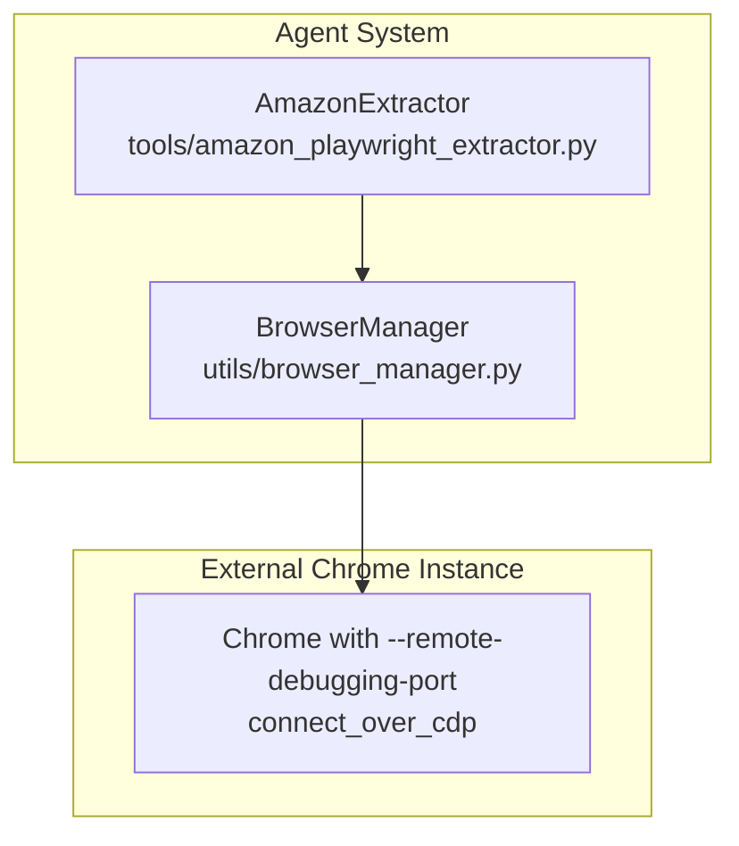
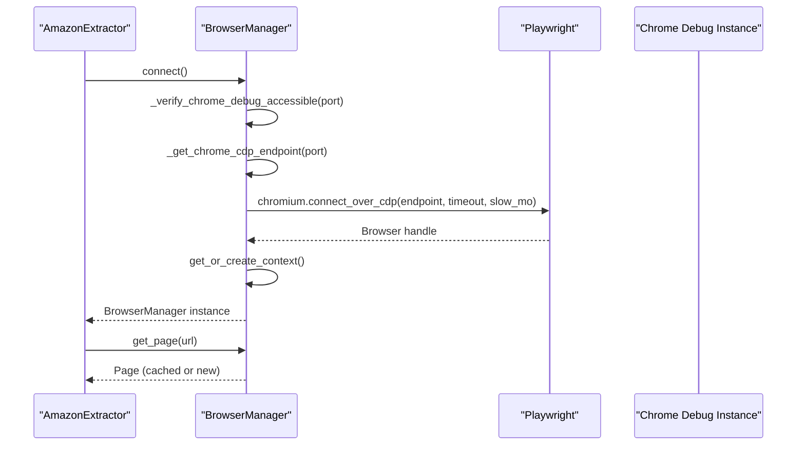
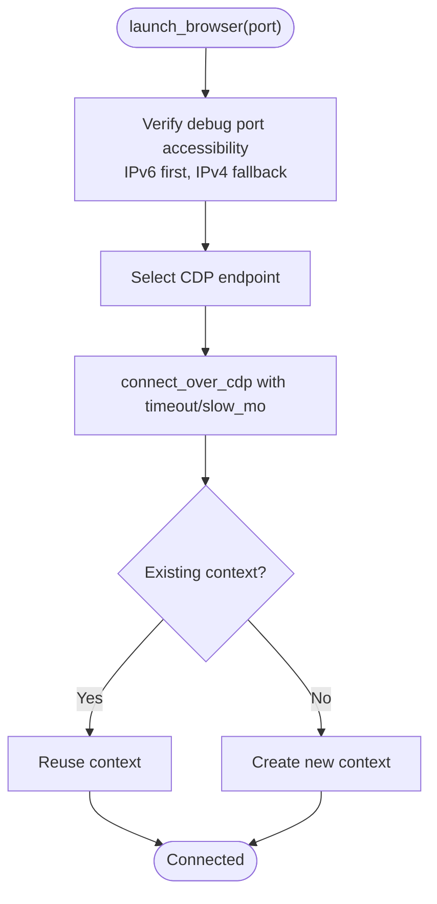
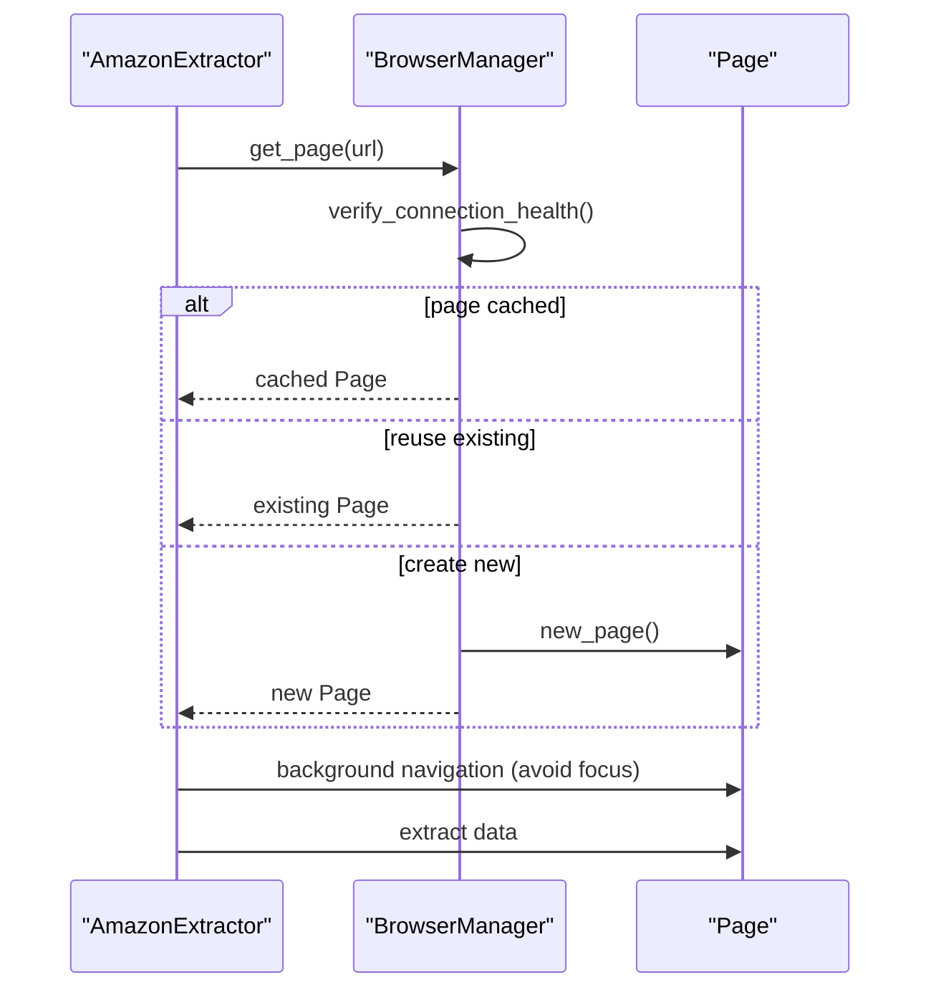
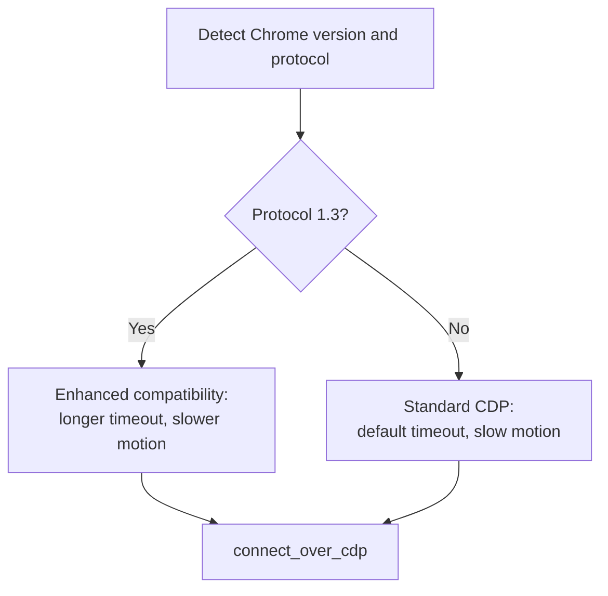
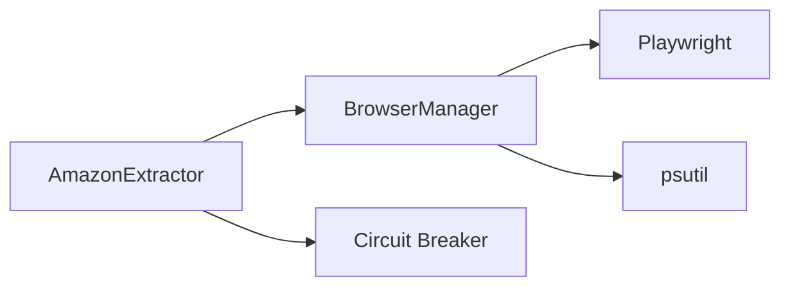

# Existing Chrome Connection

<cite>
**Referenced Files in This Document**
- [browser_manager.py](file://utils/browser_manager.py)
- [amazon_playwright_extractor.py](file://tools/amazon_playwright_extractor.py)
- [chrome_cdp_final_fix.py](file://chrome_cdp_final_fix.py)
- [chrome_quick_fix.py](file://chrome_quick_fix.py)
- [CHROME_CDP_CONNECTIVITY_TROUBLESHOOTING_REPORT.md](file://CHROME_CDP_CONNECTIVITY_TROUBLESHOOTING_REPORT.md)
</cite>

## Table of Contents
1. [Introduction](#introduction)
2. [Project Structure](#project-structure)
3. [Core Components](#core-components)
4. [Architecture Overview](#architecture-overview)
5. [Detailed Component Analysis](#detailed-component-analysis)
6. [Dependency Analysis](#dependency-analysis)
7. [Performance Considerations](#performance-considerations)
8. [Troubleshooting Guide](#troubleshooting-guide)
9. [Conclusion](#conclusion)

## Introduction
This document explains the existing Chrome connection strategy used by the Amazon FBA Agent System to connect to a user’s running Chrome instance via Playwright’s connect_over_cdp method. It covers dual-stack endpoint detection for IPv6/IPv4 compatibility with Chrome 139.x, automatic protocol version detection, connection verification, timeout handling, slow motion configuration, persistent context management, page caching, and practical manual launch examples. It also documents common connection issues and their resolutions.

## Project Structure
The existing Chrome connection relies on a centralized browser manager that:
- Validates the Chrome debug port accessibility (IPv6/IPv4)
- Determines the correct CDP endpoint
- Connects to an existing Chrome instance using connect_over_cdp
- Manages a persistent context and a small page cache
- Implements health checks, restart policies, and graceful cleanup

**Diagram sources**
- [browser_manager.py](file://utils/browser_manager.py#L77-L140)
- [amazon_playwright_extractor.py](file://tools/amazon_playwright_extractor.py#L97-L122)

**Section sources**
- [browser_manager.py](file://utils/browser_manager.py#L35-L140)
- [amazon_playwright_extractor.py](file://tools/amazon_playwright_extractor.py#L63-L122)

## Core Components
- BrowserManager: Centralized singleton managing Playwright, Chrome connection, persistent context, and page caching. It verifies the debug port, selects IPv6/IPv4 endpoints, and applies stability settings (slow motion, timeouts).
- AmazonExtractor: Orchestrates extraction against Amazon product pages using the shared BrowserManager instance and enforces background-friendly navigation and page reuse.

Key behaviors:
- Connects to an existing Chrome debug instance (never launches a new Chromium)
- Dual-stack endpoint detection for Chrome 139.x compatibility
- Automatic protocol version detection and enhanced compatibility modes
- Connection verification and troubleshooting guidance
- Persistent context and minimal page cache for stability

**Section sources**
- [browser_manager.py](file://utils/browser_manager.py#L35-L140)
- [browser_manager.py](file://utils/browser_manager.py#L242-L301)
- [browser_manager.py](file://utils/browser_manager.py#L477-L542)
- [amazon_playwright_extractor.py](file://tools/amazon_playwright_extractor.py#L63-L122)

## Architecture Overview
The system connects to an existing Chrome instance using Playwright’s connect_over_cdp. The BrowserManager:
- Verifies debug port accessibility (IPv6 preferred, IPv4 fallback)
- Detects Chrome version and protocol version
- Chooses appropriate connection parameters (timeout, slow motion)
- Establishes a persistent context and manages a small page cache

**Diagram sources**
- [browser_manager.py](file://utils/browser_manager.py#L77-L140)
- [browser_manager.py](file://utils/browser_manager.py#L242-L301)
- [browser_manager.py](file://utils/browser_manager.py#L477-L542)
- [amazon_playwright_extractor.py](file://tools/amazon_playwright_extractor.py#L97-L122)

## Detailed Component Analysis

### BrowserManager: Existing Chrome Connection and Caching
- Connection lifecycle:
  - Validates debug port accessibility using dual-stack detection (IPv6 first, IPv4 fallback)
  - Determines the correct CDP endpoint dynamically
  - Uses connect_over_cdp with timeout and slow motion for stability
  - Reuses existing context and minimizes page churn
- Health management:
  - Periodic health checks and time-based restart policy
  - Memory monitoring and cleanup hooks
- Persistent context and page caching:
  - Maintains a small LRU cache of pages
  - Avoids aggressive focus changes to preserve user Chrome state

**Diagram sources**
- [browser_manager.py](file://utils/browser_manager.py#L77-L140)
- [browser_manager.py](file://utils/browser_manager.py#L242-L301)

**Section sources**
- [browser_manager.py](file://utils/browser_manager.py#L77-L140)
- [browser_manager.py](file://utils/browser_manager.py#L242-L301)
- [browser_manager.py](file://utils/browser_manager.py#L141-L198)

### AmazonExtractor: Integration and Background Navigation
- Uses the BrowserManager singleton to ensure a shared Chrome connection
- Applies background-friendly navigation to avoid bringing Chrome to front
- Performs health checks and dead page detection before extraction
- Keeps pages open to preserve extension state (Keepa, SellerAmp)

**Diagram sources**
- [amazon_playwright_extractor.py](file://tools/amazon_playwright_extractor.py#L317-L466)
- [browser_manager.py](file://utils/browser_manager.py#L141-L198)

**Section sources**
- [amazon_playwright_extractor.py](file://tools/amazon_playwright_extractor.py#L63-L122)
- [amazon_playwright_extractor.py](file://tools/amazon_playwright_extractor.py#L317-L466)

### Dual-Stack Endpoint Detection and Protocol Version Handling
- IPv6/IPv4 detection:
  - Tests IPv6 binding first (Chrome 139.x preference)
  - Falls back to IPv4 for compatibility
- Protocol detection:
  - Retrieves Chrome version and protocol version asynchronously
  - Applies enhanced compatibility settings for Chrome 139.x Protocol 1.3
- Endpoint selection:
  - Chooses endpoint based on detection results

**Diagram sources**
- [browser_manager.py](file://utils/browser_manager.py#L477-L542)
- [browser_manager.py](file://utils/browser_manager.py#L398-L454)

**Section sources**
- [browser_manager.py](file://utils/browser_manager.py#L242-L301)
- [browser_manager.py](file://utils/browser_manager.py#L477-L542)
- [browser_manager.py](file://utils/browser_manager.py#L398-L454)

### Persistent Context and Page Caching
- Persistent context:
  - Reuses the existing Chrome instance and context
  - Avoids launching new processes
- Page caching:
  - LRU cache with small capacity to reduce overhead
  - Avoids bringing pages to front to prevent focus interference

**Section sources**
- [browser_manager.py](file://utils/browser_manager.py#L116-L123)
- [browser_manager.py](file://utils/browser_manager.py#L141-L198)

### Timeout Handling and Slow Motion Configuration
- Connection-level:
  - Configurable timeout and slow motion for stability
  - Progressive retries with increasing timeouts for Chrome 139.x
- Navigation-level:
  - Circuit breaker and retry logic for page navigation
  - Post-navigation stabilization waits

**Section sources**
- [browser_manager.py](file://utils/browser_manager.py#L108-L112)
- [browser_manager.py](file://utils/browser_manager.py#L398-L454)
- [amazon_playwright_extractor.py](file://tools/amazon_playwright_extractor.py#L396-L420)

### Practical Manual Chrome Launch Commands
Examples of manual Chrome launch commands compatible with the system:
- Headed Chrome with debug port and user data directory
- IPv4 binding enforced for compatibility scenarios

These commands demonstrate the flags used by the system and can be adapted for troubleshooting or standalone runs.

**Section sources**
- [chrome_cdp_final_fix.py](file://chrome_cdp_final_fix.py#L28-L56)
- [chrome_quick_fix.py](file://chrome_quick_fix.py#L88-L106)

## Dependency Analysis
- BrowserManager depends on:
  - Playwright async API for connect_over_cdp
  - aiohttp for HTTP probing of debug endpoints
  - psutil for memory monitoring
- AmazonExtractor depends on:
  - BrowserManager singleton for shared connection
  - Circuit breaker for navigation resilience

**Diagram sources**
- [browser_manager.py](file://utils/browser_manager.py#L23-L24)
- [browser_manager.py](file://utils/browser_manager.py#L658-L720)
- [amazon_playwright_extractor.py](file://tools/amazon_playwright_extractor.py#L21-L29)

**Section sources**
- [browser_manager.py](file://utils/browser_manager.py#L23-L24)
- [browser_manager.py](file://utils/browser_manager.py#L658-L720)
- [amazon_playwright_extractor.py](file://tools/amazon_playwright_extractor.py#L21-L29)

## Performance Considerations
- Stability over speed:
  - Conservative slow motion and extended timeouts for Chrome 139.x
  - Minimal page cache to reduce memory pressure
- Memory management:
  - Periodic memory checks and cleanup
  - Time-based restarts to prevent long-running instability
- Background-friendly navigation:
  - Prevents Chrome from coming to front, reducing UI overhead

[No sources needed since this section provides general guidance]

## Troubleshooting Guide

Common issues and remedies:
- Port conflicts:
  - Ensure no other process occupies the debug port
  - Kill existing Chrome processes and verify port availability
- Chrome version incompatibilities:
  - Use the provided scripts to enforce IPv4 binding or start Chrome with required flags
- Network configuration problems:
  - Confirm IPv6/IPv4 binding and endpoint accessibility
  - Use diagnostic scripts to test endpoints and Playwright connectivity

Manual launch examples:
- Enforce IPv4 binding and disable features for compatibility
- Start Chrome with debug flags and verify the debug endpoint responds

Diagnostic and quick-fix scripts:
- Final fix script: kills browsers, starts Chrome with IPv4 binding, tests endpoints, and updates configuration
- Quick fix script: kills Chrome processes, checks port, ensures profile directory, starts Chrome with debug flags, and tests the endpoint

Validation:
- The system includes a troubleshooting report artifact demonstrating extraction results and statuses.

**Section sources**
- [chrome_cdp_final_fix.py](file://chrome_cdp_final_fix.py#L13-L27)
- [chrome_cdp_final_fix.py](file://chrome_cdp_final_fix.py#L57-L86)
- [chrome_cdp_final_fix.py](file://chrome_cdp_final_fix.py#L157-L205)
- [chrome_quick_fix.py](file://chrome_quick_fix.py#L40-L51)
- [chrome_quick_fix.py](file://chrome_quick_fix.py#L113-L118)
- [CHROME_CDP_CONNECTIVITY_TROUBLESHOOTING_REPORT.md](file://CHROME_CDP_CONNECTIVITY_TROUBLESHOOTING_REPORT.md#L1-L126)

## Conclusion
The existing Chrome connection strategy centers on connecting to a user-managed Chrome instance via connect_over_cdp, with robust dual-stack endpoint detection, protocol-aware compatibility handling, and persistent context/page caching for stability. The system emphasizes reliability through health checks, time-based restarts, and background-friendly navigation, while providing practical manual launch commands and automated diagnostic scripts to resolve common connection issues.