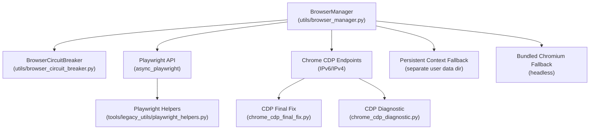
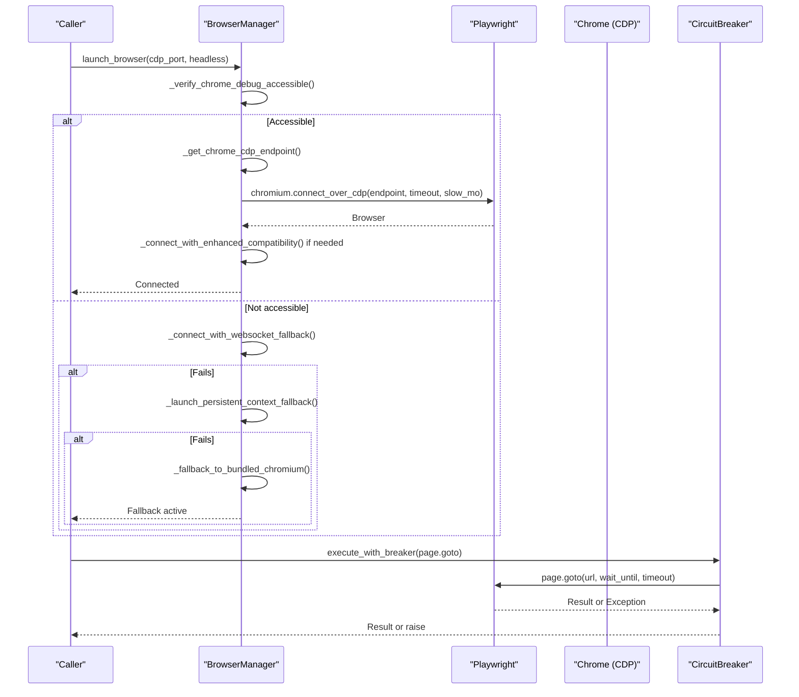
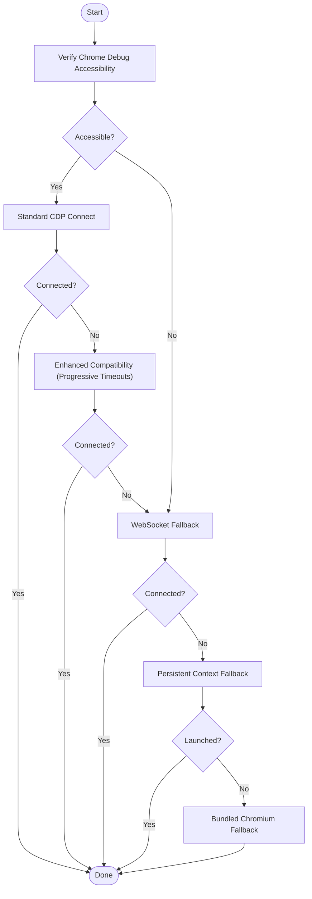
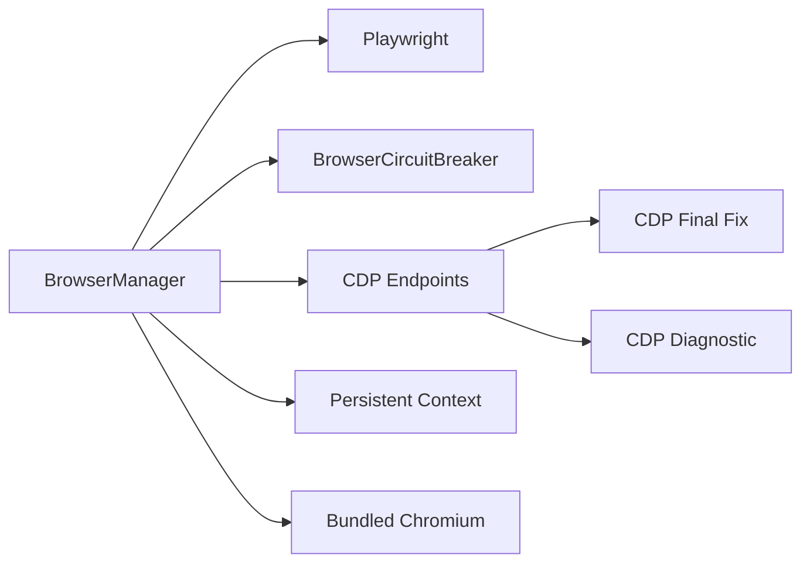

# Fallback Mechanisms

<cite>
**Referenced Files in This Document**
- [browser_manager.py](file://utils/browser_manager.py)
- [browser_circuit_breaker.py](file://utils/browser_circuit_breaker.py)
- [playwright_helpers.py](file://tools/legacy_utils/playwright_helpers.py)
- [chrome_cdp_final_fix.py](file://chrome_cdp_final_fix.py)
- [chrome_cdp_diagnostic.py](file://chrome_cdp_diagnostic.py)
- [Browser Management.md](file://WIKI REPO SEPT17/8. Browser Automation/8.1. Browser Management.md)
</cite>

## Table of Contents
1. [Introduction](#introduction)
2. [Project Structure](#project-structure)
3. [Core Components](#core-components)
4. [Architecture Overview](#architecture-overview)
5. [Detailed Component Analysis](#detailed-component-analysis)
6. [Dependency Analysis](#dependency-analysis)
7. [Performance Considerations](#performance-considerations)
8. [Troubleshooting Guide](#troubleshooting-guide)
9. [Conclusion](#conclusion)

## Introduction
This document explains the fallback mechanisms implemented in the Amazon FBA Agent System’s browser management for robust, long-running automation. It covers:
- Playwright bundled Chromium fallback when Chrome CDP connection fails
- Headless mode configuration and argument optimization
- Persistent context fallback with separate user data directories
- WebSocket direct fallback method for maximum compatibility
- Circuit breaker pattern for navigation reliability
- Progressive timeout handling for Chrome 139.x Protocol 1.3 compatibility
- Practical fallback sequences, error handling, recovery procedures, and performance implications

## Project Structure
The fallback logic is primarily implemented in the browser manager and integrated with a circuit breaker. Supporting utilities provide Playwright helpers and CDP diagnostics/final fixes.

**Diagram sources**
- [browser_manager.py](file://utils/browser_manager.py#L77-L140)
- [browser_circuit_breaker.py](file://utils/browser_circuit_breaker.py#L37-L111)
- [playwright_helpers.py](file://tools/legacy_utils/playwright_helpers.py#L44-L99)
- [chrome_cdp_final_fix.py](file://chrome_cdp_final_fix.py#L28-L87)
- [chrome_cdp_diagnostic.py](file://chrome_cdp_diagnostic.py#L1-L421)

**Section sources**
- [browser_manager.py](file://utils/browser_manager.py#L1-L120)
- [browser_circuit_breaker.py](file://utils/browser_circuit_breaker.py#L1-L60)
- [playwright_helpers.py](file://tools/legacy_utils/playwright_helpers.py#L1-L40)
- [chrome_cdp_final_fix.py](file://chrome_cdp_final_fix.py#L1-L60)
- [chrome_cdp_diagnostic.py](file://chrome_cdp_diagnostic.py#L1-L60)

## Core Components
- BrowserManager: Centralized singleton managing Playwright, Chrome CDP connections, page caching, and fallback strategies.
- BrowserCircuitBreaker: Protects operations from cascading failures with CLOSED/OPEN/HALF_OPEN states and progressive recovery.
- Playwright Helpers: Provides standardized browser launch and context management utilities.
- CDP Final Fix and Diagnostic: Tools to enforce IPv4 binding for Chrome v139 and validate connectivity.

Key responsibilities:
- Detect Chrome version and protocol version for compatibility
- Choose appropriate connection strategy (standard, enhanced compatibility, WebSocket fallback)
- Apply headless mode and optimized arguments for bundled Chromium
- Manage persistent context with isolated user data directories
- Enforce circuit breaker around navigation operations

**Section sources**
- [browser_manager.py](file://utils/browser_manager.py#L35-L140)
- [browser_circuit_breaker.py](file://utils/browser_circuit_breaker.py#L37-L111)
- [playwright_helpers.py](file://tools/legacy_utils/playwright_helpers.py#L44-L99)
- [chrome_cdp_final_fix.py](file://chrome_cdp_final_fix.py#L28-L87)

## Architecture Overview
The browser management system implements layered fallbacks:
1. Connect to existing Chrome via CDP (IPv6 preferred, IPv4 fallback)
2. Enhanced compatibility mode for Chrome 139.x Protocol 1.3 with progressive timeouts
3. WebSocket direct fallback for maximum compatibility
4. Persistent context fallback with separate user data directory
5. Bundled Chromium fallback in headless mode with optimized arguments
6. Circuit breaker wrapping navigation operations

**Diagram sources**
- [browser_manager.py](file://utils/browser_manager.py#L77-L140)
- [browser_manager.py](file://utils/browser_manager.py#L209-L241)
- [browser_manager.py](file://utils/browser_manager.py#L342-L374)
- [browser_manager.py](file://utils/browser_manager.py#L456-L476)
- [browser_manager.py](file://utils/browser_manager.py#L398-L429)
- [browser_circuit_breaker.py](file://utils/browser_circuit_breaker.py#L72-L111)

## Detailed Component Analysis

### Playwright Bundled Chromium Fallback
Purpose: Provide a fully functional browser when Chrome CDP is unavailable or unstable.

Behavior:
- Launches bundled Chromium in headless mode to avoid popup interference
- Applies optimized arguments for automation and compatibility
- Creates a new context and page for subsequent operations
- Cleans up Playwright resources if all methods fail

Headless mode configuration and argument optimization:
- Headless enabled to prevent popups and reduce resource contention
- Arguments include disabling web security, sandbox, and enabling automation features
- Prevents display compositor issues and maintains visibility for debugging

Recovery procedure:
- On failure, stops Playwright and raises a consolidated error
- Caller should trigger higher-level recovery (restart browser, switch modes)

Performance implications:
- Headless mode reduces CPU/GPU usage
- Bundled Chromium avoids profile conflicts but loses extension support
- Suitable for short-term fallback; prefer persistent Chrome for long-running sessions

**Section sources**
- [browser_manager.py](file://utils/browser_manager.py#L209-L241)

### Persistent Context Fallback with Separate User Data Directory
Purpose: Launch a Playwright-managed Chrome instance without interfering with the user’s existing Chrome.

Behavior:
- Uses a dedicated user data directory to avoid conflicts
- Forces headless mode to prevent popups
- Configures remote debugging port, window positioning, and automation flags
- Returns a persistent context bound to a separate Chrome instance

Recovery procedure:
- On failure, logs error and returns False to caller
- Caller should attempt bundled Chromium fallback

Performance implications:
- Isolated profile prevents extension and sync conflicts
- Slightly heavier than bundled Chromium due to full Chrome instance
- Useful when Chrome profile sync or extensions are required

**Section sources**
- [browser_manager.py](file://utils/browser_manager.py#L342-L374)

### WebSocket Direct Fallback Method
Purpose: Maximize compatibility by using the most permissive connection parameters.

Behavior:
- Attempts CDP connection with maximum timeout and very slow timing
- Designed for environments where strict timeouts or protocol mismatches cause failures
- Validates connection stability post-establishment

Recovery procedure:
- On success, proceeds with normal operations
- On failure, caller evaluates whether to fall back to persistent context or bundled Chromium

Performance implications:
- Long timeouts and slow motion reduce responsiveness
- Useful for unstable networks or legacy environments
- Not recommended for production under normal conditions

**Section sources**
- [browser_manager.py](file://utils/browser_manager.py#L456-L476)

### Circuit Breaker Pattern for Navigation Reliability
Purpose: Prevent cascading failures during extended sessions by gating operations.

States and transitions:
- CLOSED: Operations allowed; failure count resets on success
- OPEN: Blocks operations after threshold failures; waits for timeout
- HALF_OPEN: Tests recovery with limited operations; transitions to CLOSED on success or back to OPEN on failure

Integration with navigation:
- Wraps page.goto with execute_with_breaker
- Automatically retries after recovery timeout
- Exposes status for monitoring and diagnostics

Operational parameters:
- Failure threshold: 3
- Timeout: 300 seconds (5 minutes)
- Recovery timeout: 60 seconds

**Section sources**
- [browser_circuit_breaker.py](file://utils/browser_circuit_breaker.py#L37-L111)
- [browser_manager.py](file://utils/browser_manager.py#L180-L184)

### Progressive Timeout Handling for Chrome 139.x Protocol 1.3 Compatibility
Purpose: Improve reliability with Chrome 139.x and Protocol 1.3 by dynamically increasing timeouts and slowdown.

Behavior:
- Iterative connection attempts with increasing timeout and slow_mo
- Uses dynamic endpoint detection (IPv6/IPv4) tailored for v139+
- Includes progressive delays between attempts

Recovery procedure:
- On success, establishes a stable connection
- On repeated failure, caller should consider WebSocket fallback or persistent context

Performance implications:
- Higher timeouts and slower motion improve stability at the cost of latency
- Recommended for environments where Chrome 139.x is present

**Section sources**
- [browser_manager.py](file://utils/browser_manager.py#L398-L429)

### End-to-End Fallback Sequence Execution
Typical flow:
1. Verify Chrome debug accessibility (IPv6 preferred, IPv4 fallback)
2. Attempt standard CDP connection
3. If unsuccessful, try enhanced compatibility mode (progressive timeouts)
4. If still failing, attempt WebSocket fallback
5. If WebSocket fails, launch persistent context fallback
6. If persistent context fails, activate bundled Chromium fallback
7. Wrap navigation with circuit breaker

**Diagram sources**
- [browser_manager.py](file://utils/browser_manager.py#L242-L301)
- [browser_manager.py](file://utils/browser_manager.py#L398-L429)
- [browser_manager.py](file://utils/browser_manager.py#L456-L476)
- [browser_manager.py](file://utils/browser_manager.py#L342-L374)
- [browser_manager.py](file://utils/browser_manager.py#L209-L241)

## Dependency Analysis
- BrowserManager depends on Playwright for browser automation and on BrowserCircuitBreaker for operation gating.
- Chrome CDP connectivity relies on IPv6/IPv4 endpoint detection and protocol version awareness.
- Persistent context and bundled Chromium fallbacks are independent strategies that bypass CDP.
- CDP Final Fix and Diagnostic scripts support environment remediation.

**Diagram sources**
- [browser_manager.py](file://utils/browser_manager.py#L20-L25)
- [browser_circuit_breaker.py](file://utils/browser_circuit_breaker.py#L25-L32)
- [chrome_cdp_final_fix.py](file://chrome_cdp_final_fix.py#L1-L20)
- [chrome_cdp_diagnostic.py](file://chrome_cdp_diagnostic.py#L1-L20)

**Section sources**
- [browser_manager.py](file://utils/browser_manager.py#L20-L25)
- [browser_circuit_breaker.py](file://utils/browser_circuit_breaker.py#L25-L32)
- [chrome_cdp_final_fix.py](file://chrome_cdp_final_fix.py#L1-L20)
- [chrome_cdp_diagnostic.py](file://chrome_cdp_diagnostic.py#L1-L20)

## Performance Considerations
- Headless mode reduces CPU/GPU usage compared to visible browser automation.
- Progressive timeouts and slow motion improve reliability at the expense of latency.
- Persistent context isolates profiles but introduces overhead of a full Chrome instance.
- Circuit breaker prevents cascading failures but may temporarily suspend operations.
- IPv4 binding enforcement for Chrome v139 can improve connectivity but may conflict with IPv6-only environments.

[No sources needed since this section provides general guidance]

## Troubleshooting Guide
Common scenarios and remedies:
- Chrome debug port not accessible:
  - Verify IPv4/IPv6 binding and port availability
  - Use CDP Final Fix to enforce IPv4 binding
  - Confirm no conflicting processes on the port
- Chrome 139.x Protocol 1.3 issues:
  - Enable enhanced compatibility mode with progressive timeouts
  - Validate protocol version and adjust timeouts accordingly
- Navigation failures:
  - Wrap operations with circuit breaker to isolate transient issues
  - Monitor circuit breaker status and recovery timing
- Fallback activation:
  - Prefer persistent context or bundled Chromium when CDP fails
  - Review logs for detailed error messages and endpoint selection decisions

**Section sources**
- [browser_manager.py](file://utils/browser_manager.py#L242-L301)
- [browser_manager.py](file://utils/browser_manager.py#L398-L429)
- [browser_manager.py](file://utils/browser_manager.py#L456-L476)
- [chrome_cdp_final_fix.py](file://chrome_cdp_final_fix.py#L57-L87)
- [Browser Management.md](file://WIKI REPO SEPT17/8. Browser Automation/8.1. Browser Management.md#L103-L164)

## Conclusion
The Amazon FBA Agent System’s browser management implements a robust, layered fallback strategy:
- CDP connectivity with IPv6/IPv4 detection and Chrome 139.x compatibility
- Circuit breaker protection for navigation reliability
- Persistent context and bundled Chromium fallbacks for isolation and resilience
- Optimized headless configurations and argument sets for performance and stability

These mechanisms collectively ensure reliable, long-running automation under diverse environments and evolving Chrome versions.