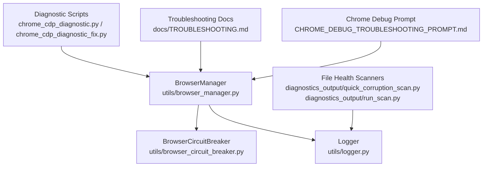
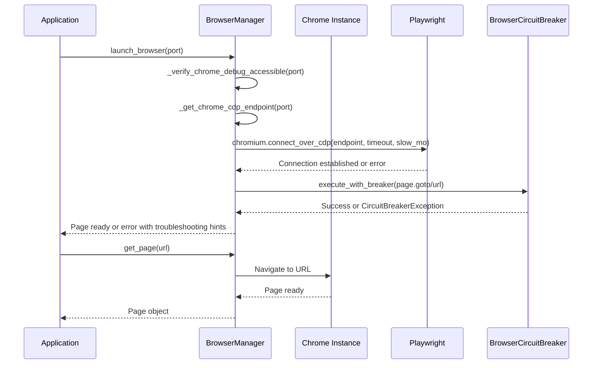
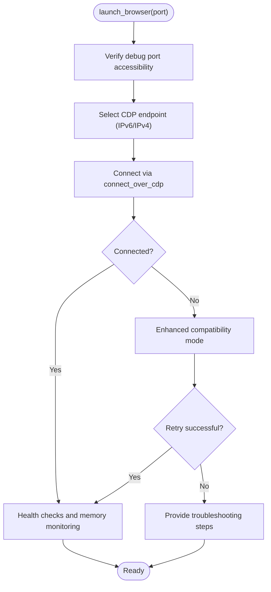
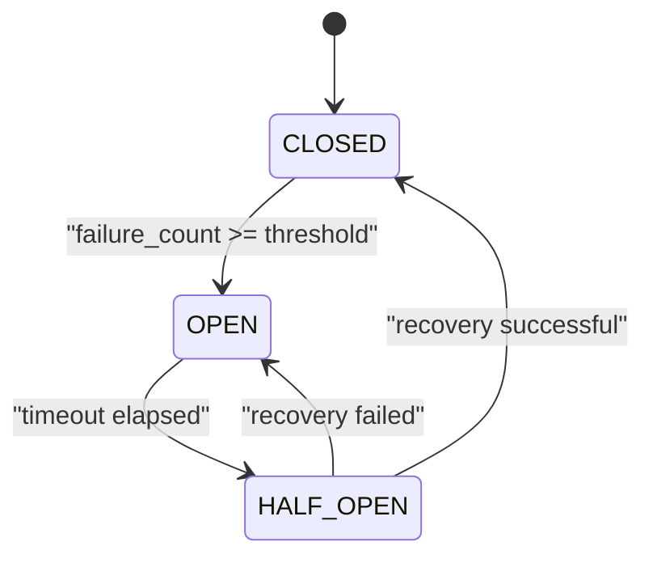
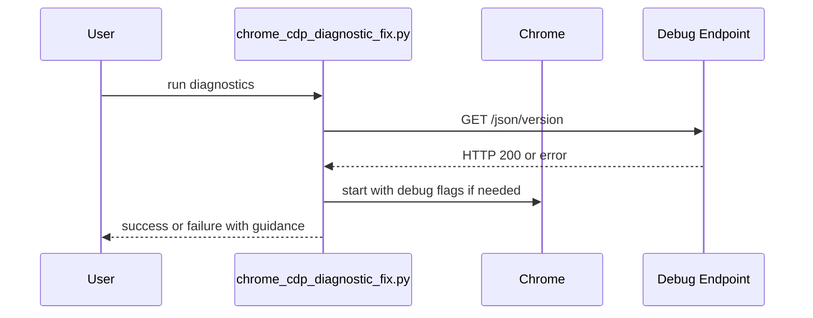
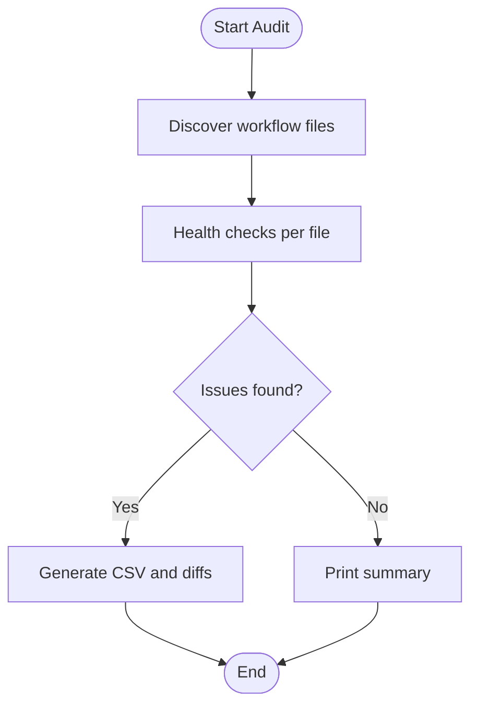
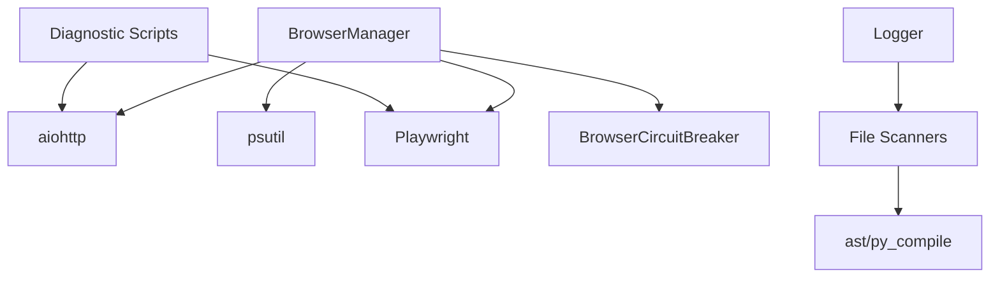
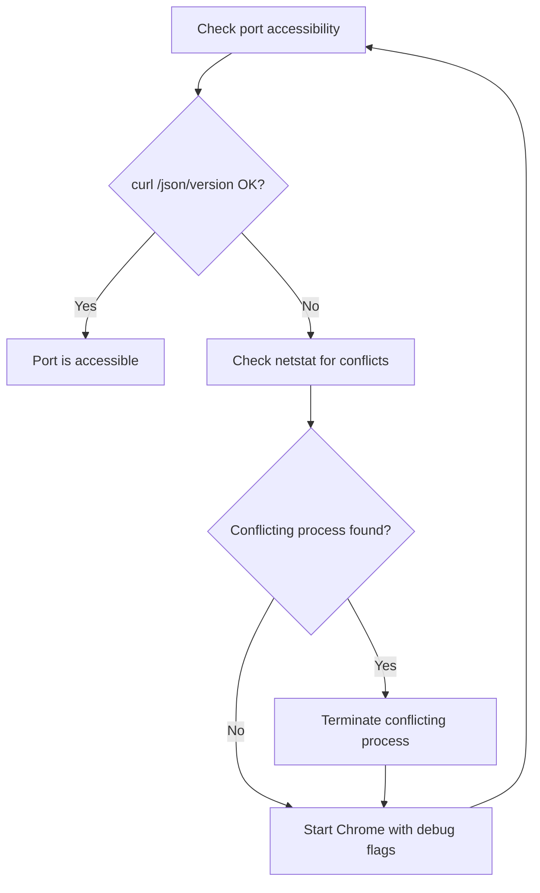
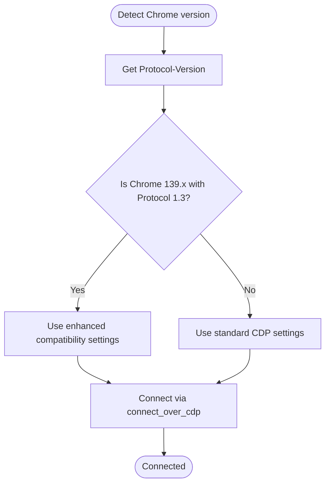
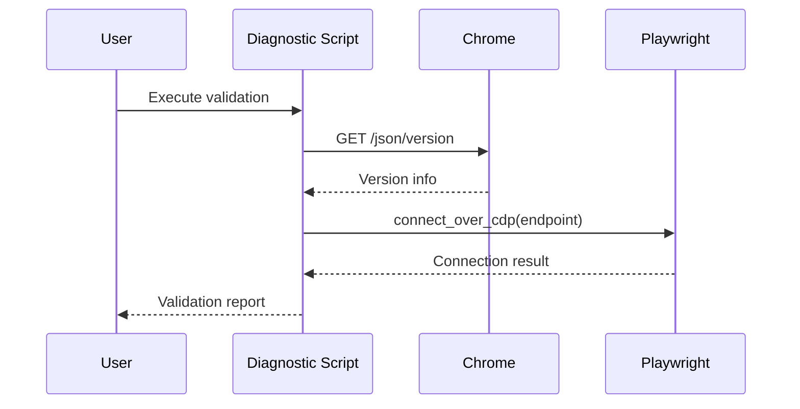

# Troubleshooting Procedures

<cite>
**Referenced Files in This Document**
- [docs/TROUBLESHOOTING.md](file://docs/TROUBLESHOOTING.md)
- [utils/browser_manager.py](file://utils/browser_manager.py)
- [utils/browser_circuit_breaker.py](file://utils/browser_circuit_breaker.py)
- [CHROME_DEBUG_TROUBLESHOOTING_PROMPT.md](file://CHROME_DEBUG_TROUBLESHOOTING_PROMPT.md)
- [chrome_cdp_diagnostic.py](file://chrome_cdp_diagnostic.py)
- [chrome_cdp_diagnostic_fix.py](file://chrome_cdp_diagnostic_fix.py)
- [diagnostics_output/quick_corruption_scan.py](file://diagnostics_output/quick_corruption_scan.py)
- [diagnostics_output/run_scan.py](file://diagnostics_output/run_scan.py)
- [utils/logger.py](file://utils/logger.py)
</cite>

## Table of Contents
1. [Introduction](#introduction)
2. [Project Structure](#project-structure)
3. [Core Components](#core-components)
4. [Architecture Overview](#architecture-overview)
5. [Detailed Component Analysis](#detailed-component-analysis)
6. [Dependency Analysis](#dependency-analysis)
7. [Performance Considerations](#performance-considerations)
8. [Troubleshooting Guide](#troubleshooting-guide)
9. [Conclusion](#conclusion)

## Introduction
This document provides comprehensive troubleshooting procedures for the Amazon FBA Agent System’s browser connection strategies, focusing on Chrome debug port connectivity. It covers port verification, process detection, conflict resolution, version-specific guidance for Chrome 139.x Protocol 1.3 compatibility, diagnostic procedures for connection validation, protocol detection, and endpoint verification. Practical command-line tool usage is included for environment diagnosis, alongside automated troubleshooting logging and error reporting mechanisms. Common scenarios such as Chrome process conflicts, firewall restrictions, and Playwright version compatibility are addressed.

## Project Structure
The troubleshooting system integrates several components:
- Centralized browser management with health monitoring and protocol detection
- Circuit breaker for resilience during long-running sessions
- Automated diagnostic scripts for environment and file health
- Logging infrastructure for observability and error reporting

**Diagram sources**
- [utils/browser_manager.py](file://utils/browser_manager.py#L35-L140)
- [utils/browser_circuit_breaker.py](file://utils/browser_circuit_breaker.py#L37-L110)
- [utils/logger.py](file://utils/logger.py#L7-L47)
- [chrome_cdp_diagnostic.py](file://chrome_cdp_diagnostic.py#L1-L421)
- [chrome_cdp_diagnostic_fix.py](file://chrome_cdp_diagnostic_fix.py#L1-L215)
- [diagnostics_output/quick_corruption_scan.py](file://diagnostics_output/quick_corruption_scan.py#L1-L159)
- [diagnostics_output/run_scan.py](file://diagnostics_output/run_scan.py#L1-L542)
- [docs/TROUBLESHOOTING.md](file://docs/TROUBLESHOOTING.md#L1-L934)
- [CHROME_DEBUG_TROUBLESHOOTING_PROMPT.md](file://CHROME_DEBUG_TROUBLESHOOTING_PROMPT.md#L1-L77)

**Section sources**
- [docs/TROUBLESHOOTING.md](file://docs/TROUBLESHOOTING.md#L1-L934)
- [utils/browser_manager.py](file://utils/browser_manager.py#L1-L1153)
- [utils/browser_circuit_breaker.py](file://utils/browser_circuit_breaker.py#L1-L214)
- [utils/logger.py](file://utils/logger.py#L1-L47)
- [chrome_cdp_diagnostic.py](file://chrome_cdp_diagnostic.py#L1-L421)
- [chrome_cdp_diagnostic_fix.py](file://chrome_cdp_diagnostic_fix.py#L1-L215)
- [diagnostics_output/quick_corruption_scan.py](file://diagnostics_output/quick_corruption_scan.py#L1-L159)
- [diagnostics_output/run_scan.py](file://diagnostics_output/run_scan.py#L1-L542)
- [CHROME_DEBUG_TROUBLESHOOTING_PROMPT.md](file://CHROME_DEBUG_TROUBLESHOOTING_PROMPT.md#L1-L77)

## Core Components
- BrowserManager: Centralized browser resource management with LRU page caching, health monitoring, and protocol detection for Chrome 139.x Protocol 1.3 compatibility.
- BrowserCircuitBreaker: Implements circuit breaker pattern to prevent cascading failures during long sessions.
- Diagnostic Scripts: Automated tools to validate Chrome debug port accessibility and assist in fixing connectivity issues.
- File Health Scanners: Utilities to detect corruption and inconsistencies in workflow files.
- Logging Infrastructure: Structured logging for diagnostics and error reporting.

**Section sources**
- [utils/browser_manager.py](file://utils/browser_manager.py#L35-L140)
- [utils/browser_circuit_breaker.py](file://utils/browser_circuit_breaker.py#L37-L110)
- [chrome_cdp_diagnostic.py](file://chrome_cdp_diagnostic.py#L1-L421)
- [chrome_cdp_diagnostic_fix.py](file://chrome_cdp_diagnostic_fix.py#L1-L215)
- [diagnostics_output/quick_corruption_scan.py](file://diagnostics_output/quick_corruption_scan.py#L1-L159)
- [diagnostics_output/run_scan.py](file://diagnostics_output/run_scan.py#L1-L542)
- [utils/logger.py](file://utils/logger.py#L7-L47)

## Architecture Overview
The browser connection architecture centers on connecting to an existing Chrome instance via Chrome DevTools Protocol (CDP). The system supports IPv6 and IPv4 endpoints for compatibility, with enhanced handling for Chrome 139.x Protocol 1.3. It includes health checks, memory monitoring, and circuit breaker protection.

**Diagram sources**
- [utils/browser_manager.py](file://utils/browser_manager.py#L77-L140)
- [utils/browser_manager.py](file://utils/browser_manager.py#L242-L301)
- [utils/browser_manager.py](file://utils/browser_manager.py#L398-L454)
- [utils/browser_manager.py](file://utils/browser_manager.py#L180-L198)
- [utils/browser_circuit_breaker.py](file://utils/browser_circuit_breaker.py#L72-L110)

## Detailed Component Analysis

### BrowserManager: Chrome Debug Port Connectivity
- Port verification: Dual-stack endpoint selection (IPv6 preferred for Chrome 139.x, IPv4 fallback).
- Connection attempts: Enhanced compatibility mode with progressive timeouts and slow motion settings for Chrome 139.x Protocol 1.3.
- Protocol detection: Retrieves Chrome version and protocol version for compatibility assessment.
- Troubleshooting logging: Provides detailed steps for manual resolution when connections fail.

**Diagram sources**
- [utils/browser_manager.py](file://utils/browser_manager.py#L77-L140)
- [utils/browser_manager.py](file://utils/browser_manager.py#L242-L301)
- [utils/browser_manager.py](file://utils/browser_manager.py#L398-L454)
- [utils/browser_manager.py](file://utils/browser_manager.py#L555-L565)

**Section sources**
- [utils/browser_manager.py](file://utils/browser_manager.py#L77-L140)
- [utils/browser_manager.py](file://utils/browser_manager.py#L242-L301)
- [utils/browser_manager.py](file://utils/browser_manager.py#L398-L454)
- [utils/browser_manager.py](file://utils/browser_manager.py#L555-L565)

### BrowserCircuitBreaker: Resilience During Long Sessions
- State management: CLOSED, OPEN, HALF_OPEN with automatic transitions.
- Failure threshold: Defaults to 3 failures with 5-minute recovery timeout.
- Integration: Wraps navigation and other browser operations to prevent cascading failures.

**Diagram sources**
- [utils/browser_circuit_breaker.py](file://utils/browser_circuit_breaker.py#L37-L133)

**Section sources**
- [utils/browser_circuit_breaker.py](file://utils/browser_circuit_breaker.py#L37-L133)

### Diagnostic Scripts: Automated Environment Validation
- chrome_cdp_diagnostic.py: Provides consultation-based issue creation guidance and workflow for GitHub issues.
- chrome_cdp_diagnostic_fix.py: Validates debug endpoint accessibility, starts Chrome with appropriate flags, and reports outcomes.

**Diagram sources**
- [chrome_cdp_diagnostic.py](file://chrome_cdp_diagnostic.py#L1-L421)
- [chrome_cdp_diagnostic_fix.py](file://chrome_cdp_diagnostic_fix.py#L80-L103)

**Section sources**
- [chrome_cdp_diagnostic.py](file://chrome_cdp_diagnostic.py#L1-L421)
- [chrome_cdp_diagnostic_fix.py](file://chrome_cdp_diagnostic_fix.py#L1-L215)

### File Health Scanners: Detecting Corruption and Inconsistencies
- quick_corruption_scan.py: Fast binary/ZIP corruption detection and encoding checks.
- run_scan.py: Comprehensive audit of workflow files, including syntax validation and differences against backups.

**Diagram sources**
- [diagnostics_output/quick_corruption_scan.py](file://diagnostics_output/quick_corruption_scan.py#L1-L159)
- [diagnostics_output/run_scan.py](file://diagnostics_output/run_scan.py#L46-L340)

**Section sources**
- [diagnostics_output/quick_corruption_scan.py](file://diagnostics_output/quick_corruption_scan.py#L1-L159)
- [diagnostics_output/run_scan.py](file://diagnostics_output/run_scan.py#L1-L542)

## Dependency Analysis
The troubleshooting system relies on:
- aiohttp for asynchronous HTTP requests to the Chrome debug endpoint
- psutil for process and memory monitoring
- Playwright for CDP connections and fallback browser launches
- Logging infrastructure for structured diagnostics

**Diagram sources**
- [utils/browser_manager.py](file://utils/browser_manager.py#L1-L30)
- [utils/browser_manager.py](file://utils/browser_manager.py#L477-L512)
- [utils/browser_circuit_breaker.py](file://utils/browser_circuit_breaker.py#L25-L31)
- [diagnostics_output/run_scan.py](file://diagnostics_output/run_scan.py#L11-L17)
- [utils/logger.py](file://utils/logger.py#L1-L7)

**Section sources**
- [utils/browser_manager.py](file://utils/browser_manager.py#L1-L30)
- [utils/browser_manager.py](file://utils/browser_manager.py#L477-L512)
- [utils/browser_circuit_breaker.py](file://utils/browser_circuit_breaker.py#L25-L31)
- [diagnostics_output/run_scan.py](file://diagnostics_output/run_scan.py#L11-L17)
- [utils/logger.py](file://utils/logger.py#L1-L7)

## Performance Considerations
- Prefer IPv6 endpoints for Chrome 139.x to reduce connection latency.
- Use enhanced compatibility mode with progressive timeouts for unstable connections.
- Monitor Chrome memory usage to prevent resource exhaustion during long sessions.
- Leverage the circuit breaker to avoid cascading failures and enable recovery.

## Troubleshooting Guide

### Chrome Debug Port Connectivity
- Verify port accessibility using curl to the /json/version endpoint.
- Check for port conflicts using netstat and terminate conflicting processes if necessary.
- Ensure Chrome is started with the correct flags: --remote-debugging-port and --user-data-dir.

**Diagram sources**
- [docs/TROUBLESHOOTING.md](file://docs/TROUBLESHOOTING.md#L55-L90)

**Section sources**
- [docs/TROUBLESHOOTING.md](file://docs/TROUBLESHOOTING.md#L48-L90)

### Version-Specific Guidance: Chrome 139.x Protocol 1.3
- Enhanced compatibility mode increases timeouts and slow motion settings for Chrome 139.x Protocol 1.3.
- The system dynamically selects IPv6 endpoints for newer Chrome versions and falls back to IPv4 when needed.
- Protocol detection retrieves Chrome version and protocol version to tailor connection parameters.

**Diagram sources**
- [utils/browser_manager.py](file://utils/browser_manager.py#L477-L512)
- [utils/browser_manager.py](file://utils/browser_manager.py#L527-L542)
- [utils/browser_manager.py](file://utils/browser_manager.py#L398-L454)

**Section sources**
- [utils/browser_manager.py](file://utils/browser_manager.py#L477-L512)
- [utils/browser_manager.py](file://utils/browser_manager.py#L527-L542)
- [utils/browser_manager.py](file://utils/browser_manager.py#L398-L454)

### Diagnostic Procedures: Connection Validation, Protocol Detection, Endpoint Verification
- Use curl to validate the /json/version endpoint and optionally /json for page/tab listings.
- Employ the diagnostic scripts to automate validation and remediation steps.
- Confirm Playwright version compatibility and reinstall browsers if needed.

**Diagram sources**
- [chrome_cdp_diagnostic_fix.py](file://chrome_cdp_diagnostic_fix.py#L67-L78)
- [utils/browser_manager.py](file://utils/browser_manager.py#L108-L112)

**Section sources**
- [chrome_cdp_diagnostic_fix.py](file://chrome_cdp_diagnostic_fix.py#L67-L78)
- [utils/browser_manager.py](file://utils/browser_manager.py#L108-L112)

### Practical Command-Line Tools Usage
- netstat: Check port usage and resolve conflicts.
- taskkill: Terminate conflicting Chrome processes.
- curl: Validate debug endpoint accessibility.
- PowerShell/Linux equivalents: Use equivalent commands for process and network inspection.

**Section sources**
- [docs/TROUBLESHOOTING.md](file://docs/TROUBLESHOOTING.md#L55-L90)

### Automated Troubleshooting Logging and Error Reporting
- Logger sets up structured logging with timestamped files for diagnostics.
- BrowserManager logs detailed troubleshooting steps when connections fail.
- File scanners produce CSV reports and diffs for corrupted or inconsistent files.

**Section sources**
- [utils/logger.py](file://utils/logger.py#L7-L47)
- [utils/browser_manager.py](file://utils/browser_manager.py#L302-L314)
- [diagnostics_output/quick_corruption_scan.py](file://diagnostics_output/quick_corruption_scan.py#L117-L159)
- [diagnostics_output/run_scan.py](file://diagnostics_output/run_scan.py#L434-L463)

### Common Scenarios and Resolutions
- Chrome process conflicts: Use taskkill to terminate conflicting processes, then restart Chrome with debug flags.
- Firewall restrictions: Ensure the debug port is allowed through the firewall; validate with curl.
- Playwright version compatibility: Reinstall Playwright and browsers to align with required versions.

**Section sources**
- [docs/TROUBLESHOOTING.md](file://docs/TROUBLESHOOTING.md#L48-L90)
- [docs/TROUBLESHOOTING.md](file://docs/TROUBLESHOOTING.md#L531-L558)

## Conclusion
The Amazon FBA Agent System’s troubleshooting framework combines robust browser management, protocol-aware connection strategies, and automated diagnostics to maintain reliable Chrome debug port connectivity. By leveraging IPv6/IPv4 dual-stack endpoints, enhanced compatibility modes for Chrome 139.x Protocol 1.3, and comprehensive logging, operators can quickly diagnose and resolve connectivity issues. Automated scripts and file health scanners further streamline troubleshooting, while the circuit breaker ensures resilience during extended operations.