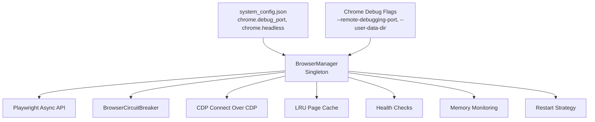
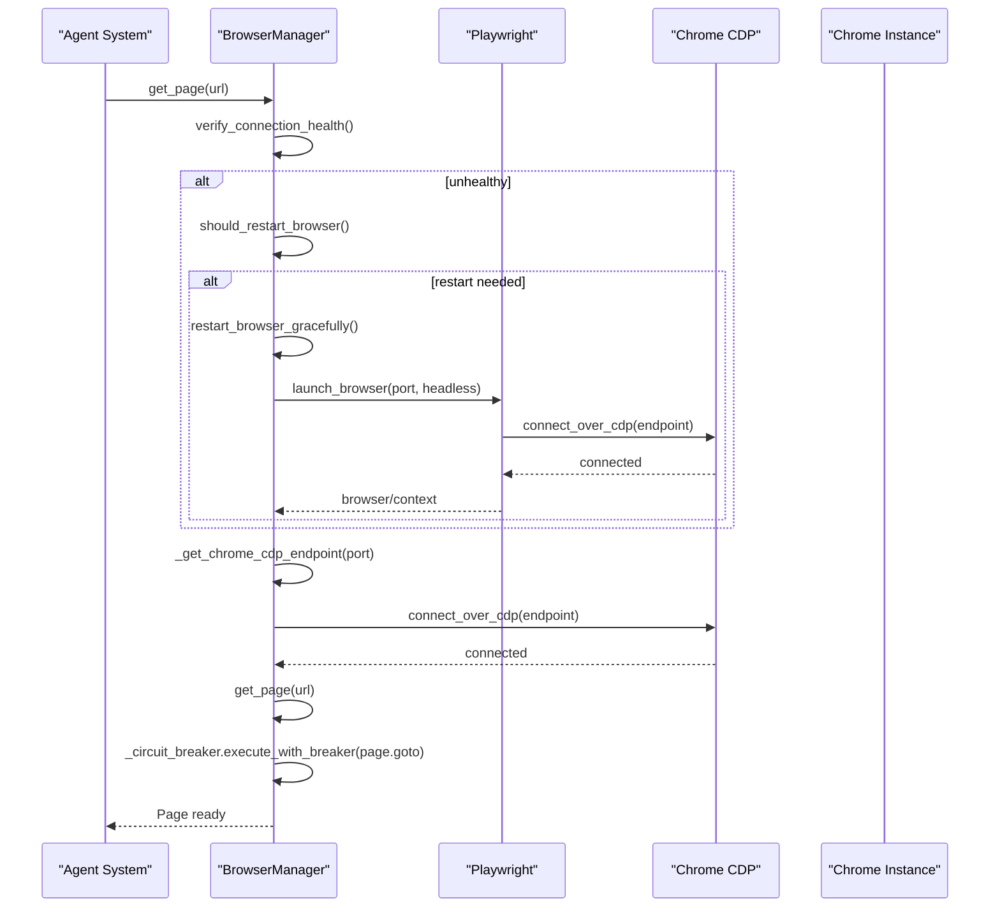
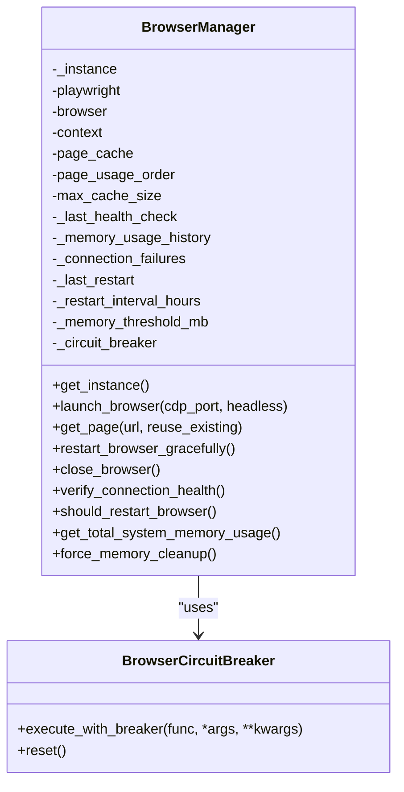
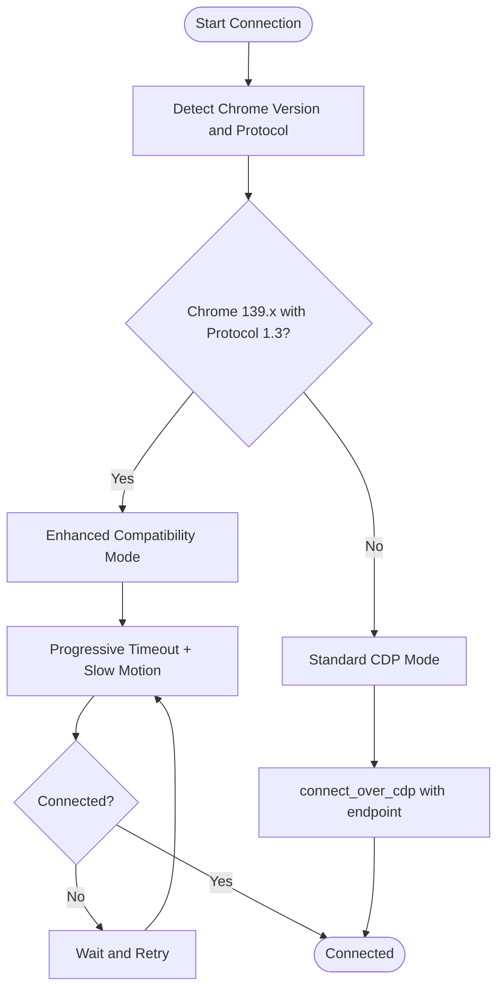
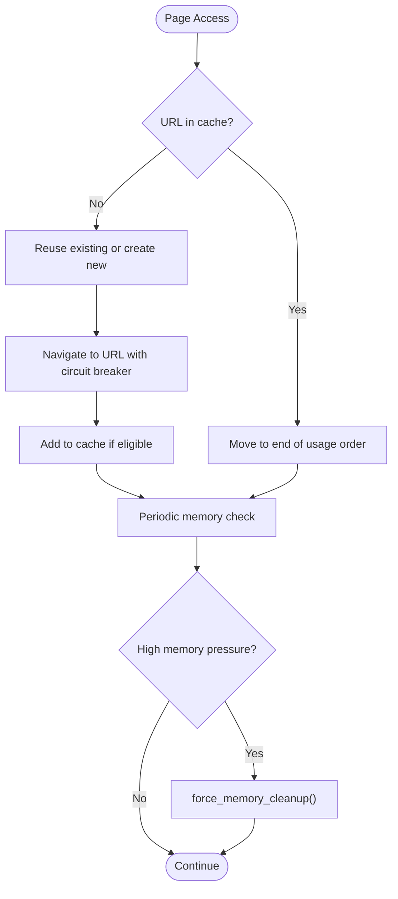
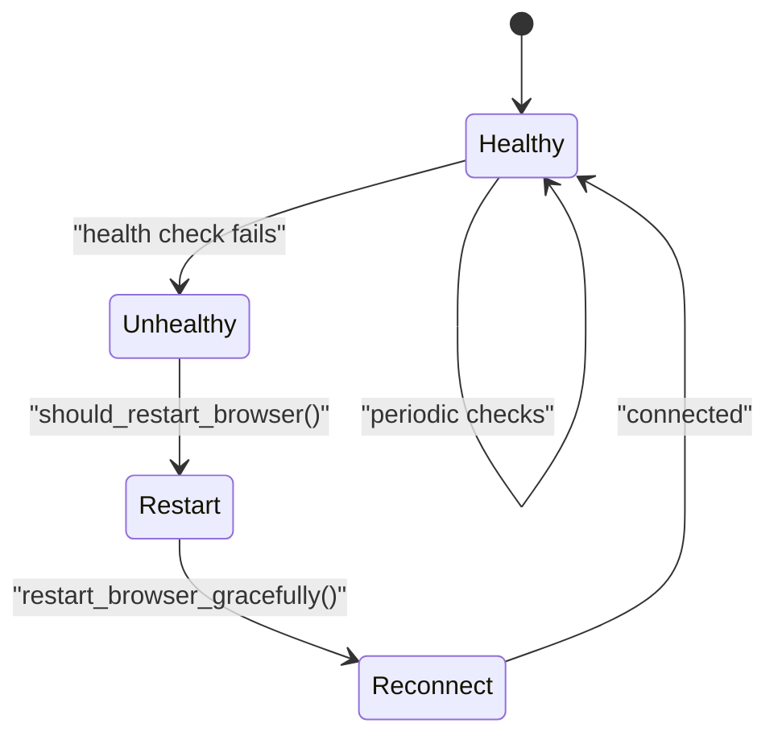
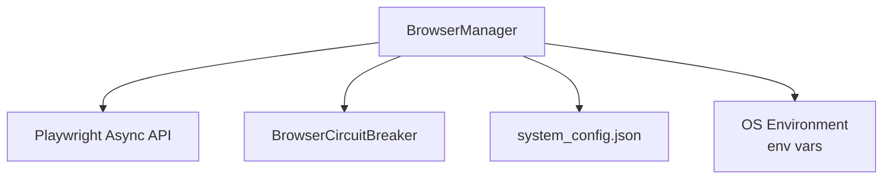

# Chrome Management

<cite>
**Referenced Files in This Document**
- [browser_manager.py](file://utils/browser_manager.py)
- [browser_circuit_breaker.py](file://utils/browser_circuit_breaker.py)
- [system_config.json](file://config/system_config.json)
- [chrome_cdp_final_fix.py](file://chrome_cdp_final_fix.py)
- [chrome_cdp_diagnostic.py](file://chrome_cdp_diagnostic.py)
- [CHROME_DEBUG_TROUBLESHOOTING_PROMPT.md](file://CHROME_DEBUG_TROUBLESHOOTING_PROMPT.md)
</cite>

## Table of Contents
1. [Introduction](#introduction)
2. [Project Structure](#project-structure)
3. [Core Components](#core-components)
4. [Architecture Overview](#architecture-overview)
5. [Detailed Component Analysis](#detailed-component-analysis)
6. [Dependency Analysis](#dependency-analysis)
7. [Performance Considerations](#performance-considerations)
8. [Troubleshooting Guide](#troubleshooting-guide)
9. [Conclusion](#conclusion)

## Introduction
This document explains the Chrome browser management subsystem for the Amazon FBA Agent System. It focuses on the singleton BrowserManager class, dual-mode connection strategies (existing Chrome and Playwright bundled Chromium), Chrome DevTools Protocol (CDP) integration, IPv6/IPv4 endpoint detection for Chrome 139.x, enhanced compatibility mode, memory management with LRU page caching, connection health monitoring, and automatic restart capabilities. Practical examples demonstrate initialization, connection verification, and troubleshooting procedures, along with configuration options for debugging ports, user data directories, and connection parameters.

## Project Structure
The Chrome management implementation centers on a singleton BrowserManager that orchestrates Playwright’s CDP connections to an existing Chrome instance. Supporting utilities include a circuit breaker for navigation resilience and system configuration for Chrome-related parameters.

**Diagram sources**
- [browser_manager.py](file://utils/browser_manager.py#L35-L140)
- [browser_circuit_breaker.py](file://utils/browser_circuit_breaker.py)
- [system_config.json](file://config/system_config.json#L200-L207)

**Section sources**
- [browser_manager.py](file://utils/browser_manager.py#L35-L140)
- [system_config.json](file://config/system_config.json#L200-L207)

## Core Components
- BrowserManager (singleton): Centralized browser lifecycle, CDP connection, page caching, health checks, memory monitoring, and restart logic.
- BrowserCircuitBreaker: Wraps navigation operations to mitigate transient failures.
- Configuration: Chrome debug port, headless mode, and extension preferences are defined in system_config.json.

Key responsibilities:
- Dual-mode connection: Prefer existing Chrome debug instance; fallback to Playwright bundled Chromium when necessary.
- CDP endpoint selection: IPv6 preferred for Chrome 139.x, IPv4 fallback for compatibility.
- Enhanced compatibility mode: Progressive timeouts and retry strategies for Chrome 139.x Protocol 1.3.
- Memory management: LRU page cache with eviction, periodic cleanup, and system memory pressure monitoring.
- Health monitoring: Connection health checks, failure counters, and automatic restart triggers.

**Section sources**
- [browser_manager.py](file://utils/browser_manager.py#L35-L140)
- [browser_manager.py](file://utils/browser_manager.py#L141-L199)
- [browser_manager.py](file://utils/browser_manager.py#L242-L301)
- [browser_manager.py](file://utils/browser_manager.py#L398-L476)
- [browser_manager.py](file://utils/browser_manager.py#L566-L622)
- [browser_manager.py](file://utils/browser_manager.py#L658-L804)
- [browser_manager.py](file://utils/browser_manager.py#L848-L939)
- [browser_manager.py](file://utils/browser_manager.py#L985-L1018)
- [browser_manager.py](file://utils/browser_manager.py#L1020-L1068)
- [browser_circuit_breaker.py](file://utils/browser_circuit_breaker.py)
- [system_config.json](file://config/system_config.json#L200-L207)

## Architecture Overview
The BrowserManager integrates with Playwright’s CDP to connect to an existing Chrome instance. It supports IPv6/IPv4 endpoint detection and enhanced compatibility mode for Chrome 139.x. Health monitoring and restart logic maintain long-running stability.

**Diagram sources**
- [browser_manager.py](file://utils/browser_manager.py#L141-L199)
- [browser_manager.py](file://utils/browser_manager.py#L398-L429)
- [browser_manager.py](file://utils/browser_manager.py#L566-L622)

## Detailed Component Analysis

### BrowserManager Singleton
- Singleton pattern ensures a single persistent browser context across the system.
- Maintains a page cache with LRU eviction and a usage order list.
- Uses BrowserCircuitBreaker for navigation reliability.

Connection strategies:
- Prefer existing Chrome debug instance via connect_over_cdp.
- Verify accessibility using IPv6/IPv4 detection.
- Enhanced compatibility mode for Chrome 139.x with Protocol 1.3 using progressive timeouts.
- Fallback to Playwright bundled Chromium when CDP fails.

Health and restart:
- Periodic health checks and failure counters.
- Automatic restart every 2.5 hours to prevent connection drift.
- Memory pressure monitoring and cleanup routines.

**Diagram sources**
- [browser_manager.py](file://utils/browser_manager.py#L35-L140)
- [browser_manager.py](file://utils/browser_manager.py#L141-L199)
- [browser_manager.py](file://utils/browser_manager.py#L848-L939)
- [browser_manager.py](file://utils/browser_manager.py#L985-L1018)
- [browser_manager.py](file://utils/browser_manager.py#L1020-L1068)
- [browser_circuit_breaker.py](file://utils/browser_circuit_breaker.py)

**Section sources**
- [browser_manager.py](file://utils/browser_manager.py#L35-L140)
- [browser_manager.py](file://utils/browser_manager.py#L141-L199)
- [browser_manager.py](file://utils/browser_manager.py#L242-L301)
- [browser_manager.py](file://utils/browser_manager.py#L398-L476)
- [browser_manager.py](file://utils/browser_manager.py#L566-L622)
- [browser_manager.py](file://utils/browser_manager.py#L658-L804)
- [browser_manager.py](file://utils/browser_manager.py#L848-L939)
- [browser_manager.py](file://utils/browser_manager.py#L985-L1018)
- [browser_manager.py](file://utils/browser_manager.py#L1020-L1068)

### CDP Endpoint Detection and Enhanced Compatibility Mode
- IPv6 preferred for Chrome 139.x; IPv4 fallback for older versions.
- Dynamic endpoint determination with short timeouts.
- Enhanced compatibility mode retries with progressive timeout and slow motion increases.

**Diagram sources**
- [browser_manager.py](file://utils/browser_manager.py#L398-L429)
- [browser_manager.py](file://utils/browser_manager.py#L430-L454)
- [browser_manager.py](file://utils/browser_manager.py#L456-L476)
- [browser_manager.py](file://utils/browser_manager.py#L477-L542)

**Section sources**
- [browser_manager.py](file://utils/browser_manager.py#L273-L301)
- [browser_manager.py](file://utils/browser_manager.py#L398-L476)
- [browser_manager.py](file://utils/browser_manager.py#L477-L542)

### Memory Management and LRU Page Caching
- LRU cache with a configurable maximum size; oldest entries evicted first.
- Aggressive cleanup routines and periodic memory pressure checks.
- System-wide memory monitoring including Chrome, Python, and Node.js processes.

**Diagram sources**
- [browser_manager.py](file://utils/browser_manager.py#L141-L199)
- [browser_manager.py](file://utils/browser_manager.py#L200-L208)
- [browser_manager.py](file://utils/browser_manager.py#L816-L847)
- [browser_manager.py](file://utils/browser_manager.py#L940-L978)

**Section sources**
- [browser_manager.py](file://utils/browser_manager.py#L200-L208)
- [browser_manager.py](file://utils/browser_manager.py#L816-L847)
- [browser_manager.py](file://utils/browser_manager.py#L940-L978)

### Connection Health Monitoring and Automatic Restart
- Health checks validate browser connectivity without heavy operations.
- Failure counters and time-based restarts (every 2.5 hours) prevent connection degradation.
- Graceful restart preserves session state by reconnecting to the persistent Chrome instance.

**Diagram sources**
- [browser_manager.py](file://utils/browser_manager.py#L848-L884)
- [browser_manager.py](file://utils/browser_manager.py#L885-L939)
- [browser_manager.py](file://utils/browser_manager.py#L985-L1018)

**Section sources**
- [browser_manager.py](file://utils/browser_manager.py#L848-L884)
- [browser_manager.py](file://utils/browser_manager.py#L885-L939)
- [browser_manager.py](file://utils/browser_manager.py#L985-L1018)

### Practical Examples

- Browser initialization and connection verification
  - Use the convenience function to ensure a browser is available and navigate to a URL.
  - The system auto-launches the browser if not present, connecting to the configured debug port.

- Troubleshooting procedures
  - Use the diagnostic scripts to validate IPv4/IPv6 binding and Playwright connectivity.
  - Apply the final fix script to force IPv4 binding and update system configuration.

- Configuration options
  - Set the Chrome debug port and headless mode in system configuration.
  - Define user data directory and startup flags externally when launching Chrome.

**Section sources**
- [browser_manager.py](file://utils/browser_manager.py#L1093-L1108)
- [chrome_cdp_final_fix.py](file://chrome_cdp_final_fix.py#L157-L206)
- [chrome_cdp_diagnostic.py](file://chrome_cdp_diagnostic.py)
- [CHROME_DEBUG_TROUBLESHOOTING_PROMPT.md](file://CHROME_DEBUG_TROUBLESHOOTING_PROMPT.md#L51-L77)
- [system_config.json](file://config/system_config.json#L200-L207)

## Dependency Analysis
The BrowserManager depends on Playwright for CDP connections and integrates with a circuit breaker for navigation resilience. Configuration is externalized via system_config.json.

**Diagram sources**
- [browser_manager.py](file://utils/browser_manager.py#L19-L26)
- [browser_manager.py](file://utils/browser_manager.py#L23-L26)
- [system_config.json](file://config/system_config.json#L200-L207)

**Section sources**
- [browser_manager.py](file://utils/browser_manager.py#L19-L26)
- [browser_manager.py](file://utils/browser_manager.py#L23-L26)
- [system_config.json](file://config/system_config.json#L200-L207)

## Performance Considerations
- Prefer existing Chrome instances to avoid overhead of launching bundled Chromium.
- Use LRU caching to reduce repeated navigations and improve throughput.
- Apply enhanced compatibility mode with progressive timeouts for Chrome 139.x to balance reliability and latency.
- Monitor memory usage and trigger cleanup proactively to prevent slowdowns.

## Troubleshooting Guide
Common scenarios and resolutions:
- Chrome debug port listening but HTTP interface unresponsive
  - Validate IPv4/IPv6 binding and use the final fix script to force IPv4 binding.
  - Confirm Chrome startup flags and user data directory configuration.

- Connection failures or intermittent CDP issues
  - Use the enhanced compatibility mode with progressive timeouts.
  - Check network/firewall rules and ensure the debug port is free.

- Memory pressure and browser instability
  - Trigger memory cleanup and monitor system memory usage.
  - Consider reducing tab count and cache size if needed.

- Automated restarts
  - Rely on time-based restarts to prevent connection drift; investigate frequent failures if restarts become necessary.

**Section sources**
- [CHROME_DEBUG_TROUBLESHOOTING_PROMPT.md](file://CHROME_DEBUG_TROUBLESHOOTING_PROMPT.md#L22-L77)
- [browser_manager.py](file://utils/browser_manager.py#L398-L476)
- [browser_manager.py](file://utils/browser_manager.py#L658-L804)
- [browser_manager.py](file://utils/browser_manager.py#L985-L1018)
- [chrome_cdp_final_fix.py](file://chrome_cdp_final_fix.py#L157-L206)

## Conclusion
The BrowserManager provides robust Chrome management for the Amazon FBA Agent System. By prioritizing existing Chrome instances, implementing IPv6/IPv4 endpoint detection, and employing enhanced compatibility mode for Chrome 139.x, it achieves reliable CDP connectivity. Memory management, health monitoring, and automatic restarts ensure sustained operation. The provided configuration options and troubleshooting procedures enable smooth integration and maintenance.