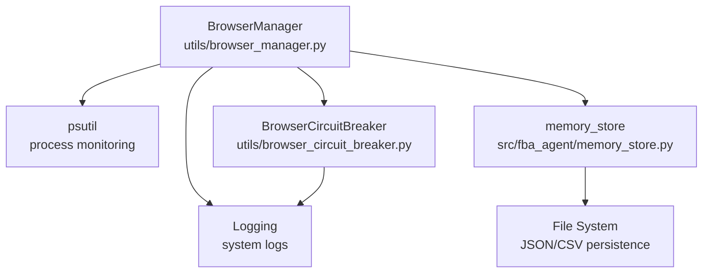
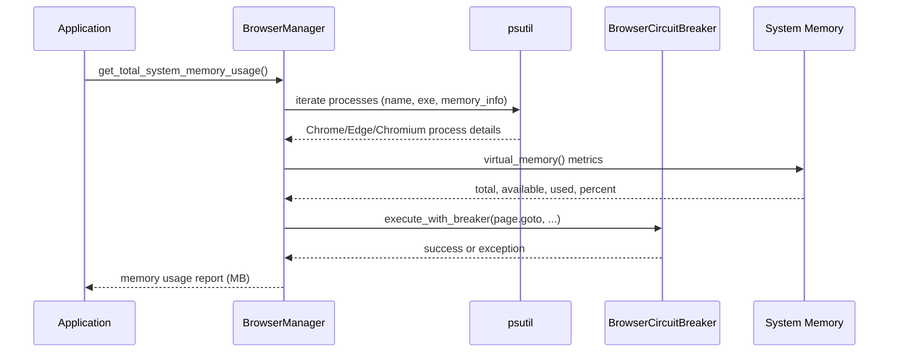
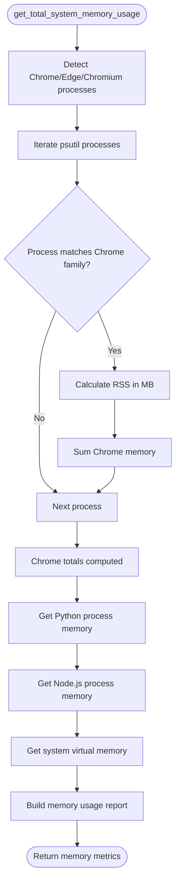
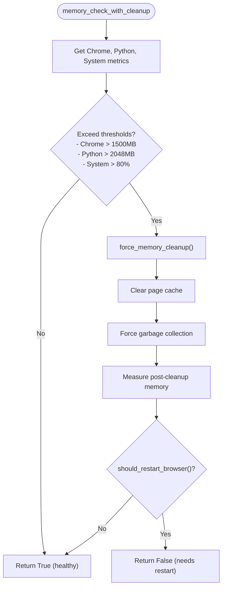
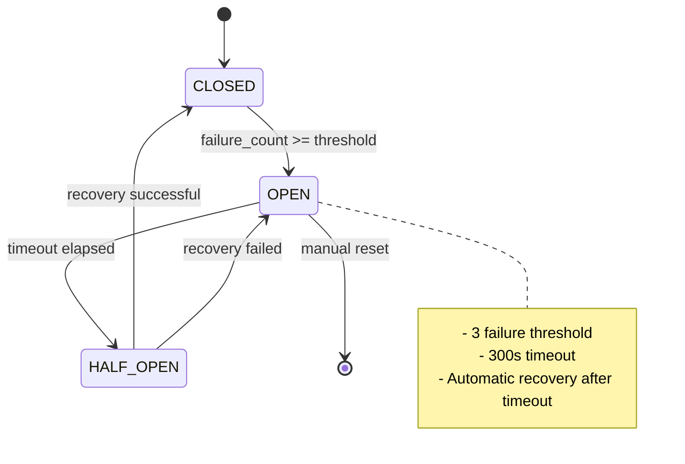
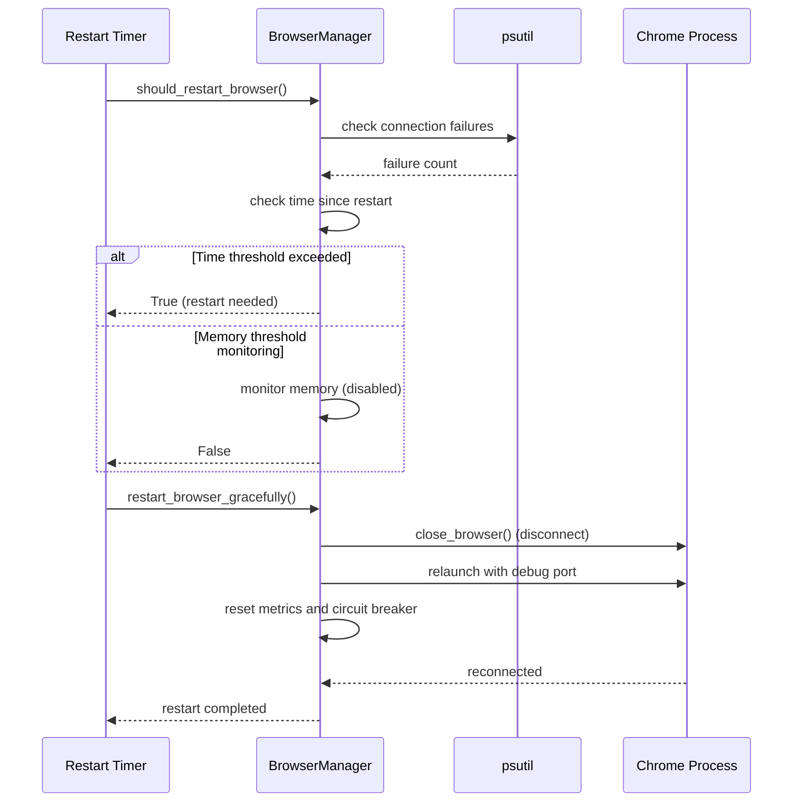
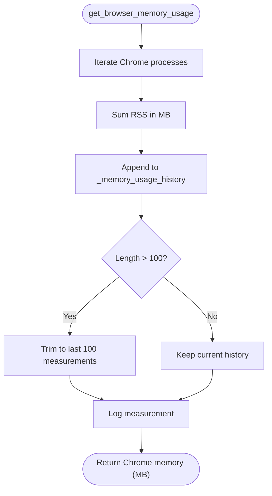
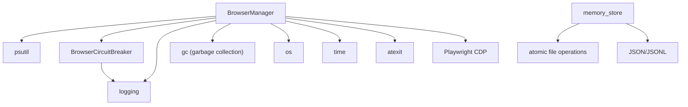

# Browser Memory Monitoring

<cite>
**Referenced Files in This Document**
- [browser_manager.py](file://utils/browser_manager.py)
- [browser_circuit_breaker.py](file://utils/browser_circuit_breaker.py)
- [SYSTEM_MEMORY_AND_BROWSER_MANAGEMENT_REPORT.md](file://SYSTEM_MEMORY_AND_BROWSER_MANAGEMENT_REPORT.md)
- [TROUBLESHOOTING.md](file://docs/TROUBLESHOOTING.md)
- [memory_store.py](file://src/fba_agent/memory_store.py)
</cite>

## Table of Contents
1. [Introduction](#introduction)
2. [Project Structure](#project-structure)
3. [Core Components](#core-components)
4. [Architecture Overview](#architecture-overview)
5. [Detailed Component Analysis](#detailed-component-analysis)
6. [Dependency Analysis](#dependency-analysis)
7. [Performance Considerations](#performance-considerations)
8. [Troubleshooting Guide](#troubleshooting-guide)
9. [Conclusion](#conclusion)

## Introduction
This document describes the browser memory monitoring system in the Amazon FBA Agent System. It covers Chrome process detection with enhanced Windows compatibility, memory usage calculation in MB, historical memory tracking for trend analysis, and the integration with psutil-based process monitoring across platforms. It also documents the memory threshold system with configurable limits, automatic cleanup triggers, and memory usage reporting. Practical examples demonstrate memory usage analysis, system resource monitoring, and performance optimization techniques, along with integration details for browser circuit breaker protection and automatic restart mechanisms based on memory thresholds.

## Project Structure
The browser memory monitoring system is implemented primarily in the BrowserManager utility, with supporting components for circuit breaker protection and system-wide memory management. The key files are:
- BrowserManager: Centralized browser resource management with LRU page caching, memory monitoring, and restart logic
- BrowserCircuitBreaker: Implements circuit breaker pattern for browser operations to prevent cascading failures
- SYSTEM_MEMORY_AND_BROWSER_MANAGEMENT_REPORT: Operational report detailing memory management and restart behavior
- TROUBLESHOOTING: Operational guidance for memory monitoring and cleanup
- memory_store: Persistent storage layer for supplier data and calibration

**Diagram sources**
- [browser_manager.py](file://utils/browser_manager.py#L658-L814)
- [browser_circuit_breaker.py](file://utils/browser_circuit_breaker.py#L37-L191)
- [memory_store.py](file://src/fba_agent/memory_store.py#L104-L130)

**Section sources**
- [browser_manager.py](file://utils/browser_manager.py#L1-L1153)
- [browser_circuit_breaker.py](file://utils/browser_circuit_breaker.py#L1-L214)
- [SYSTEM_MEMORY_AND_BROWSER_MANAGEMENT_REPORT.md](file://SYSTEM_MEMORY_AND_BROWSER_MANAGEMENT_REPORT.md#L1-L246)
- [TROUBLESHOOTING.md](file://docs/TROUBLESHOOTING.md#L111-L145)
- [memory_store.py](file://src/fba_agent/memory_store.py#L1-L265)

## Core Components
- BrowserManager: Singleton class managing Chrome connections via Playwright CDP, with integrated memory monitoring and restart logic. It tracks Chrome process memory usage, maintains a sliding window of historical measurements, and provides memory-aware restart triggers.
- BrowserCircuitBreaker: Implements the circuit breaker pattern to prevent cascading failures during extended browser sessions, with configurable thresholds and recovery timeouts.
- memory_store: Provides persistent storage for supplier calibration and run history, complementing the memory management strategy by ensuring data integrity during memory clearing operations.

Key capabilities:
- Cross-platform Chrome process detection with enhanced Windows compatibility
- Memory usage calculation in MB for Chrome, Python, and system processes
- Historical memory tracking for trend analysis
- Configurable memory thresholds and automatic cleanup triggers
- Integration with circuit breaker protection and automatic restart mechanisms

**Section sources**
- [browser_manager.py](file://utils/browser_manager.py#L35-L1153)
- [browser_circuit_breaker.py](file://utils/browser_circuit_breaker.py#L37-L191)
- [memory_store.py](file://src/fba_agent/memory_store.py#L104-L130)

## Architecture Overview
The browser memory monitoring architecture integrates process-level memory tracking with application-level memory management and operational safeguards.

**Diagram sources**
- [browser_manager.py](file://utils/browser_manager.py#L721-L814)
- [browser_circuit_breaker.py](file://utils/browser_circuit_breaker.py#L72-L111)

## Detailed Component Analysis

### BrowserManager Memory Monitoring
The BrowserManager provides comprehensive memory monitoring for Chrome, Python, and system processes, with enhanced detection for Windows environments.

**Diagram sources**
- [browser_manager.py](file://utils/browser_manager.py#L721-L814)

Key features:
- Cross-platform detection of Chrome, Edge, and Chromium processes
- Windows-specific fallback detection using executable paths
- Memory calculation in MB using RSS values
- Historical memory tracking with sliding window (last 100 measurements)
- Comprehensive system memory metrics including total, available, used, and percentage

**Section sources**
- [browser_manager.py](file://utils/browser_manager.py#L658-L814)

### Memory Threshold System and Automatic Cleanup
The system implements configurable memory thresholds and automatic cleanup triggers to maintain system stability during long-running operations.

**Diagram sources**
- [browser_manager.py](file://utils/browser_manager.py#L940-L977)
- [browser_manager.py](file://utils/browser_manager.py#L816-L846)

Configurable thresholds:
- Chrome memory: >1500MB triggers cleanup
- Python memory: >2048MB triggers cleanup
- System memory: >80% triggers cleanup

Cleanup actions:
- Clear page cache and usage order
- Force garbage collection
- Measure memory after cleanup

**Section sources**
- [browser_manager.py](file://utils/browser_manager.py#L940-L977)
- [browser_manager.py](file://utils/browser_manager.py#L816-L846)

### Browser Circuit Breaker Protection
The BrowserCircuitBreaker implements the circuit breaker pattern to prevent cascading failures during extended browser sessions.

**Diagram sources**
- [browser_circuit_breaker.py](file://utils/browser_circuit_breaker.py#L37-L191)

Operational characteristics:
- Failure threshold: 3 failures
- Timeout: 300 seconds (5 minutes)
- Recovery timeout: 60 seconds
- State transitions: CLOSED → OPEN → HALF_OPEN → CLOSED
- Integration with browser operations via execute_with_breaker()

**Section sources**
- [browser_circuit_breaker.py](file://utils/browser_circuit_breaker.py#L37-L191)

### Automatic Restart Mechanisms
The system implements automatic browser restart mechanisms based on time intervals and operational conditions.

**Diagram sources**
- [browser_manager.py](file://utils/browser_manager.py#L885-L938)
- [browser_manager.py](file://utils/browser_manager.py#L985-L1018)

Restart triggers:
- Time-based restart: Every 2.5 hours (primary)
- Connection failures: >3 consecutive failures
- Memory-based restart: Currently disabled (monitored only)

**Section sources**
- [browser_manager.py](file://utils/browser_manager.py#L885-L938)
- [browser_manager.py](file://utils/browser_manager.py#L985-L1018)
- [SYSTEM_MEMORY_AND_BROWSER_MANAGEMENT_REPORT.md](file://SYSTEM_MEMORY_AND_BROWSER_MANAGEMENT_REPORT.md#L76-L109)

### Historical Memory Tracking
The BrowserManager maintains a sliding window of memory usage measurements for trend analysis and anomaly detection.

**Diagram sources**
- [browser_manager.py](file://utils/browser_manager.py#L658-L719)

Historical tracking features:
- Sliding window of 100 measurements (~3 hours at 2-minute intervals)
- Timestamped memory usage records
- Support for trend analysis and anomaly detection

**Section sources**
- [browser_manager.py](file://utils/browser_manager.py#L658-L719)

## Dependency Analysis
The browser memory monitoring system has clear dependencies and integration points across components.

**Diagram sources**
- [browser_manager.py](file://utils/browser_manager.py#L8-L26)
- [browser_circuit_breaker.py](file://utils/browser_circuit_breaker.py#L25-L31)
- [memory_store.py](file://src/fba_agent/memory_store.py#L7-L8)

Key dependencies:
- psutil: Process enumeration and memory statistics
- Playwright CDP: Browser connection and page management
- logging: Operational logging and debugging
- gc: Garbage collection for memory cleanup
- atexit: Graceful shutdown procedures

**Section sources**
- [browser_manager.py](file://utils/browser_manager.py#L8-L26)
- [browser_circuit_breaker.py](file://utils/browser_circuit_breaker.py#L25-L31)
- [memory_store.py](file://src/fba_agent/memory_store.py#L7-L8)

## Performance Considerations
The memory monitoring system is designed for efficient operation during long-running tasks:

- Process enumeration uses psutil with filtered iteration to minimize overhead
- Memory calculations use RSS values for accurate MB measurements
- Historical tracking maintains bounded memory usage with sliding window
- Cleanup operations are triggered only when thresholds are exceeded
- Circuit breaker prevents cascading failures during extended sessions
- Automatic restarts maintain connection health without manual intervention

Optimization recommendations:
- Monitor memory usage trends to adjust thresholds as needed
- Use historical data for capacity planning and alerting
- Consider adjusting restart intervals based on workload patterns
- Implement additional logging for memory pressure events

## Troubleshooting Guide
Common issues and resolutions for browser memory monitoring:

### Memory Monitoring Issues
- **Symptoms**: Memory usage reporting shows -1 or inconsistent values
- **Diagnosis**: Check Chrome debug port accessibility and process permissions
- **Solutions**: 
  - Verify Chrome is running with remote debugging enabled
  - Ensure sufficient permissions for process enumeration
  - Check network connectivity to Chrome debug port

### Automatic Cleanup Problems
- **Symptoms**: Memory not being cleared despite exceeding thresholds
- **Diagnosis**: Review cleanup trigger conditions and logging output
- **Solutions**:
  - Confirm memory thresholds are properly configured
  - Verify garbage collection is executing successfully
  - Check for exceptions during cleanup operations

### Browser Restart Failures
- **Symptoms**: Automatic restarts not occurring or failing
- **Diagnosis**: Examine restart trigger conditions and error logs
- **Solutions**:
  - Verify Chrome debug port is accessible after restart
  - Check circuit breaker state and failure counts
  - Review connection failure thresholds

**Section sources**
- [TROUBLESHOOTING.md](file://docs/TROUBLESHOOTING.md#L111-L145)
- [SYSTEM_MEMORY_AND_BROWSER_MANAGEMENT_REPORT.md](file://SYSTEM_MEMORY_AND_BROWSER_MANAGEMENT_REPORT.md#L216-L228)

## Conclusion
The Amazon FBA Agent System's browser memory monitoring provides a robust foundation for long-running automation tasks. The psutil-based process monitoring delivers accurate memory usage metrics across platforms, while the historical tracking enables trend analysis and proactive management. The configurable threshold system, combined with automatic cleanup and restart mechanisms, ensures system stability and reliability. The integration with browser circuit breaker protection adds an additional layer of resilience against extended session failures. Together, these components enable continuous, unattended operation with automatic recovery from common failure modes.