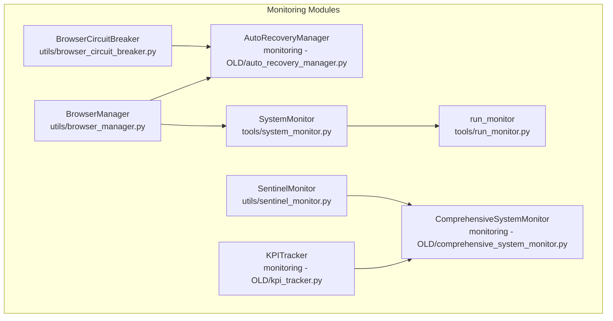
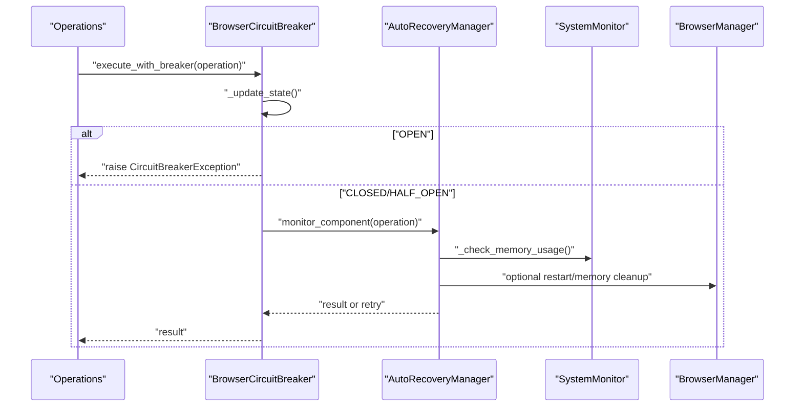
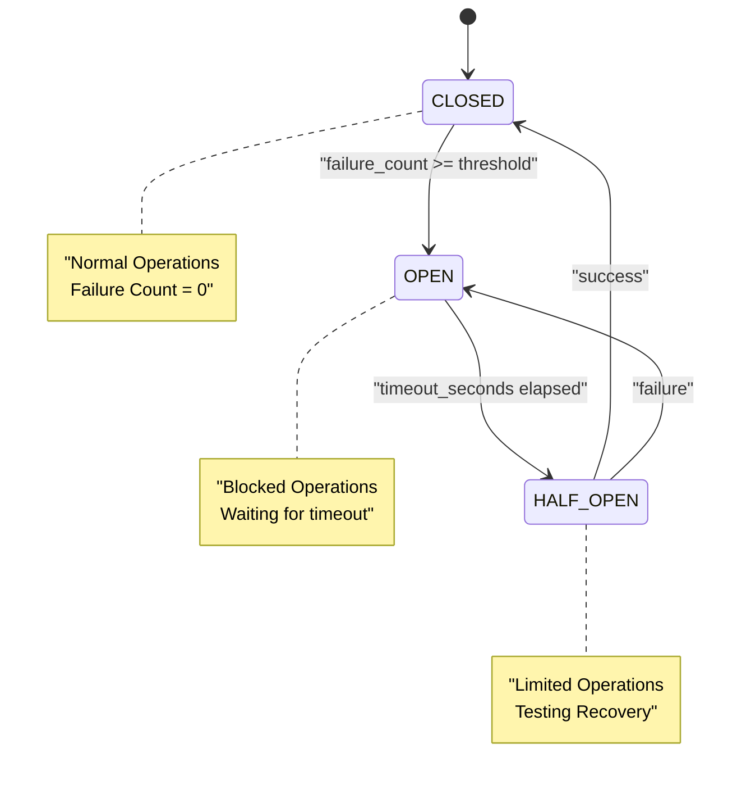
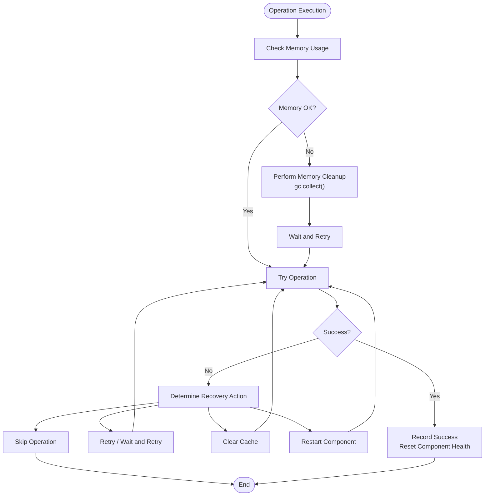
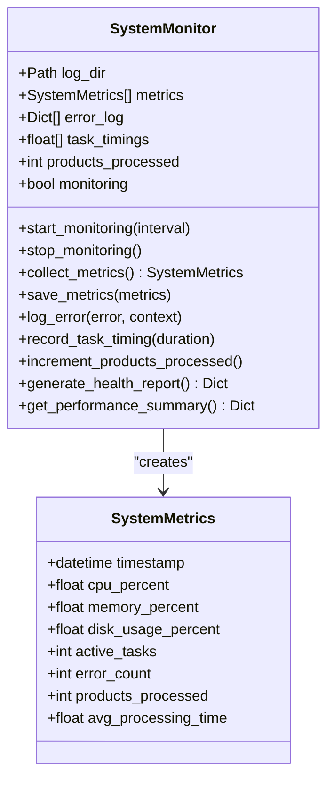
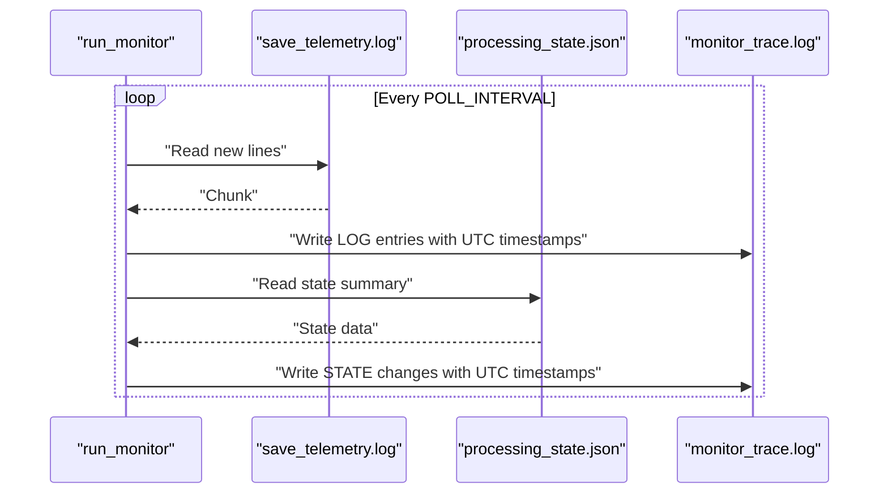
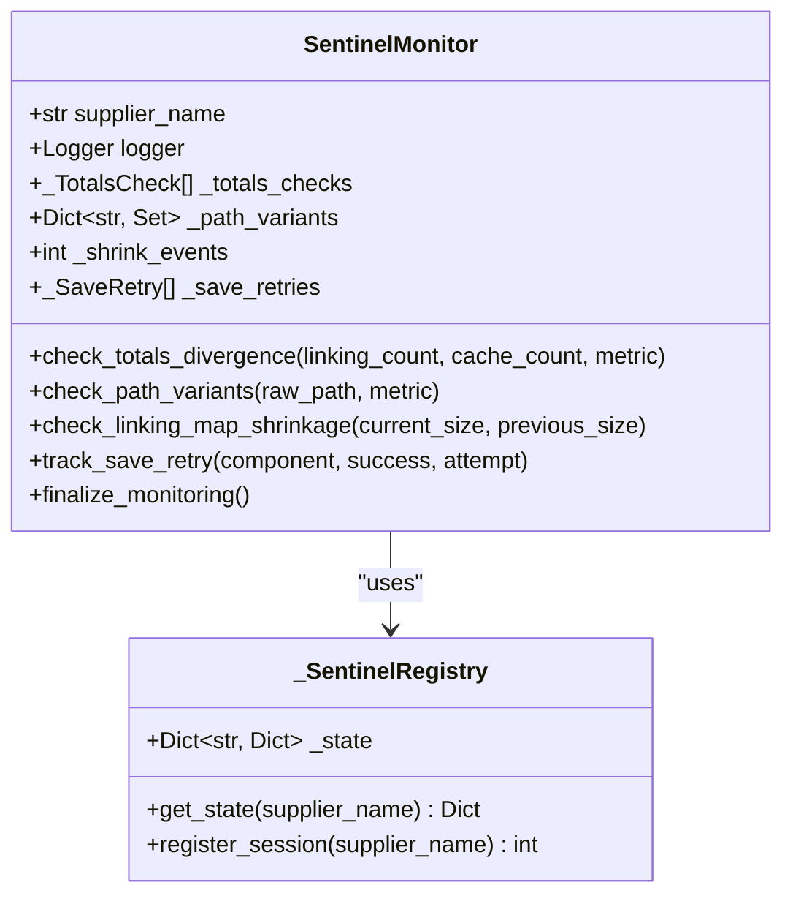
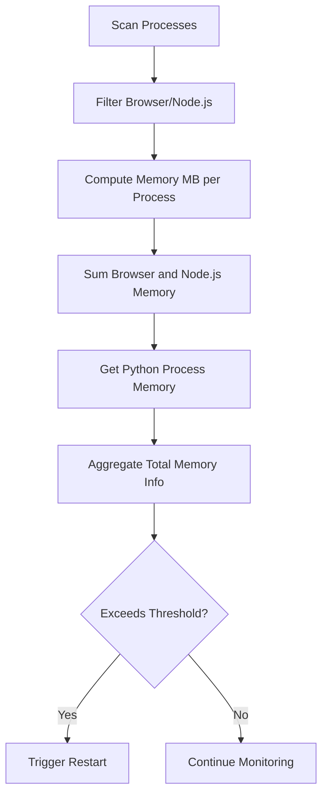
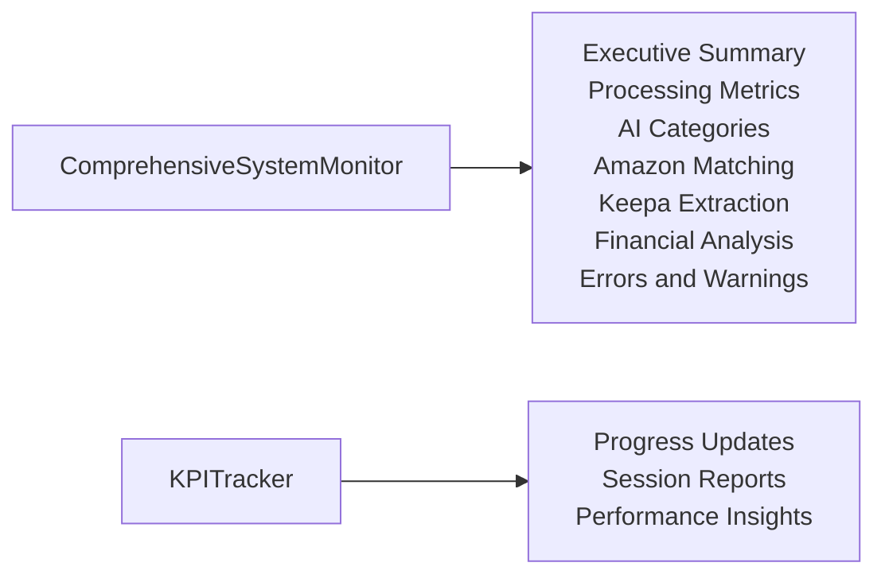
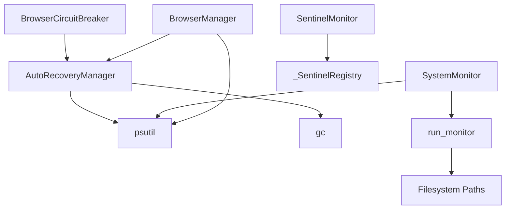

# Health Monitoring System

<cite>
**Referenced Files in This Document**
- [browser_circuit_breaker.py](file://utils/browser_circuit_breaker.py)
- [sentinel_monitor.py](file://utils/sentinel_monitor.py)
- [system_monitor.py](file://tools/system_monitor.py)
- [run_monitor.py](file://tools/run_monitor.py)
- [comprehensive_system_monitor.py](file://monitoring - OLD/comprehensive_system_monitor.py)
- [kpi_tracker.py](file://monitoring - OLD/kpi_tracker.py)
- [auto_recovery_manager.py](file://monitoring - OLD/auto_recovery_manager.py)
- [browser_manager.py](file://utils/browser_manager.py)
- [SYSTEM_MEMORY_AND_BROWSER_MANAGEMENT_REPORT.md](file://SYSTEM_MEMORY_AND_BROWSER_MANAGEMENT_REPORT.md)
- [Browser Automation.md](file://repowiki 12 dec & 20 jan/en/content/Browser Automation/Browser Automation.md)
</cite>

## Table of Contents
1. [Introduction](#introduction)
2. [Project Structure](#project-structure)
3. [Core Components](#core-components)
4. [Architecture Overview](#architecture-overview)
5. [Detailed Component Analysis](#detailed-component-analysis)
6. [Dependency Analysis](#dependency-analysis)
7. [Performance Considerations](#performance-considerations)
8. [Troubleshooting Guide](#troubleshooting-guide)
9. [Conclusion](#conclusion)

## Introduction
This document describes the comprehensive health monitoring system of the Amazon FBA Agent System. It explains the multi-layered health checking mechanism, including connection stability verification, memory usage monitoring, and automated restart capabilities. It documents the BrowserCircuitBreaker implementation with failure threshold configuration, timeout management, and automatic recovery procedures. It also details health metrics tracking such as connection failure counts, restart intervals, memory usage history, and performance degradation detection. Practical examples of health check configuration, automated recovery scenarios, and troubleshooting are included, along with the integration between health monitoring and system-wide reliability features.

## Project Structure
The health monitoring system spans several modules:
- Circuit breaker and recovery: BrowserCircuitBreaker, AutoRecoveryManager
- System health and telemetry: SystemMonitor, run_monitor
- Sentinel-style monitoring: SentinelMonitor
- Legacy comprehensive monitoring: ComprehensiveSystemMonitor, KPITracker
- Browser lifecycle management: BrowserManager (with memory and restart triggers)

**Diagram sources**
- [browser_circuit_breaker.py](file://utils/browser_circuit_breaker.py#L1-L213)
- [auto_recovery_manager.py](file://monitoring - OLD/auto_recovery_manager.py#L1-L427)
- [system_monitor.py](file://tools/system_monitor.py#L1-L180)
- [run_monitor.py](file://tools/run_monitor.py#L1-L97)
- [sentinel_monitor.py](file://utils/sentinel_monitor.py#L1-L201)
- [comprehensive_system_monitor.py](file://monitoring - OLD/comprehensive_system_monitor.py#L1-L461)
- [kpi_tracker.py](file://monitoring - OLD/kpi_tracker.py#L1-L461)
- [browser_manager.py](file://utils/browser_manager.py#L745-L774)

**Section sources**
- [browser_circuit_breaker.py](file://utils/browser_circuit_breaker.py#L1-L213)
- [system_monitor.py](file://tools/system_monitor.py#L1-L180)
- [run_monitor.py](file://tools/run_monitor.py#L1-L97)
- [sentinel_monitor.py](file://utils/sentinel_monitor.py#L1-L201)
- [comprehensive_system_monitor.py](file://monitoring - OLD/comprehensive_system_monitor.py#L1-L461)
- [kpi_tracker.py](file://monitoring - OLD/kpi_tracker.py#L1-L461)
- [auto_recovery_manager.py](file://monitoring - OLD/auto_recovery_manager.py#L1-L427)
- [browser_manager.py](file://utils/browser_manager.py#L745-L774)

## Core Components
- BrowserCircuitBreaker: Implements the circuit breaker pattern to protect long-running browser operations from cascading failures. It tracks failure counts, enforces timeouts, and supports manual reset.
- AutoRecoveryManager: Provides automatic recovery strategies including retries, waits, cache clearing, and component restarts. Integrates memory checks and component health tracking.
- SystemMonitor: Collects system metrics (CPU, memory, disk, tasks), logs errors, records task timings, and generates health reports.
- run_monitor: Live monitoring utility that tails logs and tracks processing state changes for diagnostics.
- SentinelMonitor: Lightweight runtime monitor surfacing suspicious state transitions and aggregating metrics across sessions.
- ComprehensiveSystemMonitor and KPITracker: Legacy modules that generate comprehensive system reports and track KPIs such as processing rates, success metrics, and business intelligence.

**Section sources**
- [browser_circuit_breaker.py](file://utils/browser_circuit_breaker.py#L37-L214)
- [auto_recovery_manager.py](file://monitoring - OLD/auto_recovery_manager.py#L63-L427)
- [system_monitor.py](file://tools/system_monitor.py#L34-L180)
- [run_monitor.py](file://tools/run_monitor.py#L51-L97)
- [sentinel_monitor.py](file://utils/sentinel_monitor.py#L63-L201)
- [comprehensive_system_monitor.py](file://monitoring - OLD/comprehensive_system_monitor.py#L15-L461)
- [kpi_tracker.py](file://monitoring - OLD/kpi_tracker.py#L67-L461)

## Architecture Overview
The health monitoring system integrates multiple layers:
- Operational resilience via BrowserCircuitBreaker and AutoRecoveryManager
- Continuous system telemetry via SystemMonitor
- Live diagnostics via run_monitor
- Sentinel-style anomaly detection via SentinelMonitor
- Historical reporting via ComprehensiveSystemMonitor and KPITracker
- Browser lifecycle management via BrowserManager with restart triggers

**Diagram sources**
- [browser_circuit_breaker.py](file://utils/browser_circuit_breaker.py#L72-L173)
- [auto_recovery_manager.py](file://monitoring - OLD/auto_recovery_manager.py#L126-L310)
- [system_monitor.py](file://tools/system_monitor.py#L61-L85)
- [browser_manager.py](file://utils/browser_manager.py#L745-L774)

## Detailed Component Analysis

### BrowserCircuitBreaker
The BrowserCircuitBreaker implements the circuit breaker pattern with three states:
- CLOSED: Normal operation; operations allowed; failure count resets on success.
- OPEN: Circuit breaker active; operations blocked; enforced by timeout.
- HALF_OPEN: Testing recovery; limited operations allowed; transitions to CLOSED on success or back to OPEN on failure.

Key configuration:
- failure_threshold: Number of failures before opening the circuit.
- timeout_seconds: Duration to keep circuit open before testing recovery.
- recovery_timeout: Additional time to wait in HALF_OPEN before full recovery.

Operational flow:
- On each operation, the state is updated based on elapsed time and failure count.
- Failures increment failure_count and may transition to OPEN.
- After timeout, state moves to HALF_OPEN; subsequent success transitions to CLOSED.
- Manual reset returns to CLOSED with cleared counters.

**Diagram sources**
- [browser_circuit_breaker.py](file://utils/browser_circuit_breaker.py#L112-L133)

**Section sources**
- [browser_circuit_breaker.py](file://utils/browser_circuit_breaker.py#L37-L214)
- [Browser Automation.md](file://repowiki 12 dec & 20 jan/en/content/Browser Automation/Browser Automation.md#L139-L164)

### AutoRecoveryManager
AutoRecoveryManager provides intelligent recovery strategies:
- Automatic retry with exponential backoff
- Component health monitoring with status tracking
- Memory management and periodic cleanup
- Failure pattern detection mapped to recovery actions
- Recovery statistics and health reports

Recovery actions include:
- RETRY: Immediate retry with small delay
- WAIT_AND_RETRY: Exponential backoff
- CLEAR_CACHE: Garbage collection and cache cleanup
- RESTART_COMPONENT: Component-specific restart
- SKIP: Skip the operation and continue
- ESCALATE: Final escalation after all retries

Memory management:
- Periodic memory checks using psutil
- Cleanup interval and thresholds
- Post-cleanup verification

**Diagram sources**
- [auto_recovery_manager.py](file://monitoring - OLD/auto_recovery_manager.py#L286-L310)
- [auto_recovery_manager.py](file://monitoring - OLD/auto_recovery_manager.py#L240-L284)

**Section sources**
- [auto_recovery_manager.py](file://monitoring - OLD/auto_recovery_manager.py#L63-L427)

### SystemMonitor
SystemMonitor collects and reports system metrics:
- CPU, memory, disk usage via psutil (fallbacks when unavailable)
- Active tasks count
- Error logging with context
- Task timing recording and averaging
- Health report generation based on recent metrics
- Performance summary with processing statistics

Health thresholds:
- High CPU usage (> 80%)
- High memory usage (> 85%)
- High error rate (> 10 recent errors; critical if > 50)

**Diagram sources**
- [system_monitor.py](file://tools/system_monitor.py#L22-L85)
- [system_monitor.py](file://tools/system_monitor.py#L34-L180)

**Section sources**
- [system_monitor.py](file://tools/system_monitor.py#L22-L180)

### run_monitor
run_monitor provides live diagnostics by:
- Tailing the API logs and writing structured entries to a trace file
- Polling the processing state JSON to detect changes and log state transitions
- Writing timestamps and contextual information for troubleshooting

**Diagram sources**
- [run_monitor.py](file://tools/run_monitor.py#L51-L97)

**Section sources**
- [run_monitor.py](file://tools/run_monitor.py#L1-L97)

### SentinelMonitor
SentinelMonitor tracks suspicious state transitions and aggregates metrics:
- Totals divergence checks between linking and cache counts
- Path variant tracking for resources
- Linking map shrinkage detection
- Save retry tracking
- Session summaries and registry aggregation across runs

**Diagram sources**
- [sentinel_monitor.py](file://utils/sentinel_monitor.py#L63-L192)
- [sentinel_monitor.py](file://utils/sentinel_monitor.py#L34-L61)

**Section sources**
- [sentinel_monitor.py](file://utils/sentinel_monitor.py#L1-L201)

### BrowserManager Memory and Restart Triggers
BrowserManager includes memory monitoring and restart triggers:
- Iterates processes to compute memory usage for browser and related processes
- Tracks Python process and Node.js runtime memory
- Provides total memory info via psutil
- Restart triggers include time-based restarts to prevent connection degradation

**Diagram sources**
- [browser_manager.py](file://utils/browser_manager.py#L745-L774)
- [SYSTEM_MEMORY_AND_BROWSER_MANAGEMENT_REPORT.md](file://SYSTEM_MEMORY_AND_BROWSER_MANAGEMENT_REPORT.md#L72-L83)

**Section sources**
- [browser_manager.py](file://utils/browser_manager.py#L745-L774)
- [SYSTEM_MEMORY_AND_BROWSER_MANAGEMENT_REPORT.md](file://SYSTEM_MEMORY_AND_BROWSER_MANAGEMENT_REPORT.md#L72-L83)

### Legacy: ComprehensiveSystemMonitor and KPITracker
These modules provide historical and business intelligence reporting:
- ComprehensiveSystemMonitor analyzes processing state, AI categories, Amazon cache, Keepa extraction, financial reports, and error patterns to produce a comprehensive report.
- KPITracker tracks product processing metrics, business intelligence KPIs, system performance, and generates progress updates and session reports.

**Diagram sources**
- [comprehensive_system_monitor.py](file://monitoring - OLD/comprehensive_system_monitor.py#L30-L449)
- [kpi_tracker.py](file://monitoring - OLD/kpi_tracker.py#L103-L354)

**Section sources**
- [comprehensive_system_monitor.py](file://monitoring - OLD/comprehensive_system_monitor.py#L1-L461)
- [kpi_tracker.py](file://monitoring - OLD/kpi_tracker.py#L1-L461)

## Dependency Analysis
The health monitoring system exhibits layered dependencies:
- BrowserCircuitBreaker depends on time and logging; it orchestrates AutoRecoveryManager.
- AutoRecoveryManager depends on psutil for memory checks and uses gc for cleanup.
- SystemMonitor depends on psutil for metrics and writes to JSONL logs.
- run_monitor depends on filesystem paths and reads state JSON for diagnostics.
- SentinelMonitor maintains a global registry and thread locks for safe aggregation.
- BrowserManager integrates memory monitoring and restart triggers.

**Diagram sources**
- [browser_circuit_breaker.py](file://utils/browser_circuit_breaker.py#L25-L31)
- [auto_recovery_manager.py](file://monitoring - OLD/auto_recovery_manager.py#L8-L27)
- [system_monitor.py](file://tools/system_monitor.py#L12-L18)
- [run_monitor.py](file://tools/run_monitor.py#L8-L12)
- [sentinel_monitor.py](file://utils/sentinel_monitor.py#L34-L38)
- [browser_manager.py](file://utils/browser_manager.py#L745-L774)

**Section sources**
- [browser_circuit_breaker.py](file://utils/browser_circuit_breaker.py#L25-L31)
- [auto_recovery_manager.py](file://monitoring - OLD/auto_recovery_manager.py#L8-L27)
- [system_monitor.py](file://tools/system_monitor.py#L12-L18)
- [run_monitor.py](file://tools/run_monitor.py#L8-L12)
- [sentinel_monitor.py](file://utils/sentinel_monitor.py#L34-L38)
- [browser_manager.py](file://utils/browser_manager.py#L745-L774)

## Performance Considerations
- Circuit breaker thresholds and timeouts should be tuned for workload characteristics to balance safety and throughput.
- Memory cleanup intervals and thresholds should be adjusted based on observed memory growth patterns.
- SystemMonitor sampling intervals should align with the desired resolution versus overhead trade-off.
- run_monitor polling interval affects responsiveness and I/O load; tune based on log volume and diagnostic needs.
- SentinelMonitor aggregations use thread locks; minimize contention by reducing shared state updates frequency.

## Troubleshooting Guide
Common scenarios and resolutions:
- Circuit breaker OPEN state:
  - Cause: Exceeded failure threshold within timeout window.
  - Resolution: Allow timeout to elapse; verify underlying issues; consider lowering failure threshold or improving operation robustness.
  - Verification: Use get_status to inspect current state and time_until_retry.

- High memory usage:
  - Cause: Memory exceeding configured threshold.
  - Resolution: Trigger cleanup; adjust cleanup interval; investigate memory leaks; reduce concurrent operations.
  - Verification: Check SystemMonitor health report thresholds and AutoRecoveryManager memory cleanup logs.

- Frequent component failures:
  - Cause: Recurring error patterns.
  - Resolution: Review error patterns and adjust recovery actions; escalate when retries fail.
  - Verification: Use AutoRecoveryManager health report to identify failing components and recent recovery attempts.

- Browser connection degradation:
  - Cause: Extended sessions leading to connection instability.
  - Resolution: Enable time-based restarts; monitor memory usage; consider BrowserCircuitBreaker to limit operations during instability.
  - Verification: Confirm restart triggers and BrowserManager memory metrics.

- Live diagnostics:
  - Use run_monitor to tail logs and state changes; correlate with SystemMonitor metrics and AutoRecoveryManager logs.

**Section sources**
- [browser_circuit_breaker.py](file://utils/browser_circuit_breaker.py#L174-L191)
- [auto_recovery_manager.py](file://monitoring - OLD/auto_recovery_manager.py#L311-L354)
- [system_monitor.py](file://tools/system_monitor.py#L119-L154)
- [run_monitor.py](file://tools/run_monitor.py#L51-L97)
- [SYSTEM_MEMORY_AND_BROWSER_MANAGEMENT_REPORT.md](file://SYSTEM_MEMORY_AND_BROWSER_MANAGEMENT_REPORT.md#L72-L83)

## Conclusion
The Amazon FBA Agent System’s health monitoring system combines circuit breaking, intelligent recovery, continuous telemetry, and sentinel-style anomaly detection to ensure reliability during long-running operations. BrowserCircuitBreaker and AutoRecoveryManager protect against cascading failures and manage memory pressure. SystemMonitor and run_monitor provide real-time visibility, while SentinelMonitor detects subtle state inconsistencies. Legacy modules offer comprehensive reporting and KPI tracking. Together, these components form a robust foundation for system-wide reliability and observability.