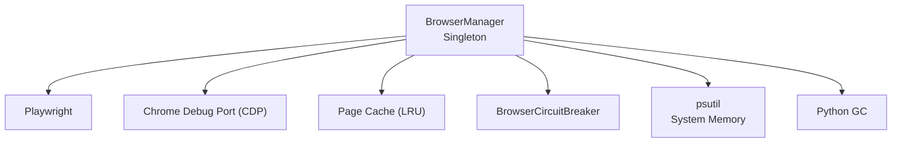
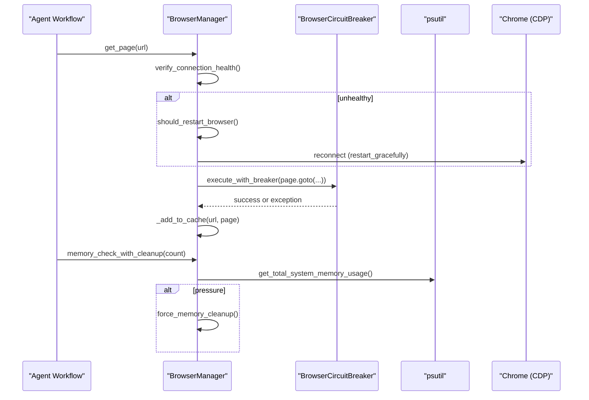
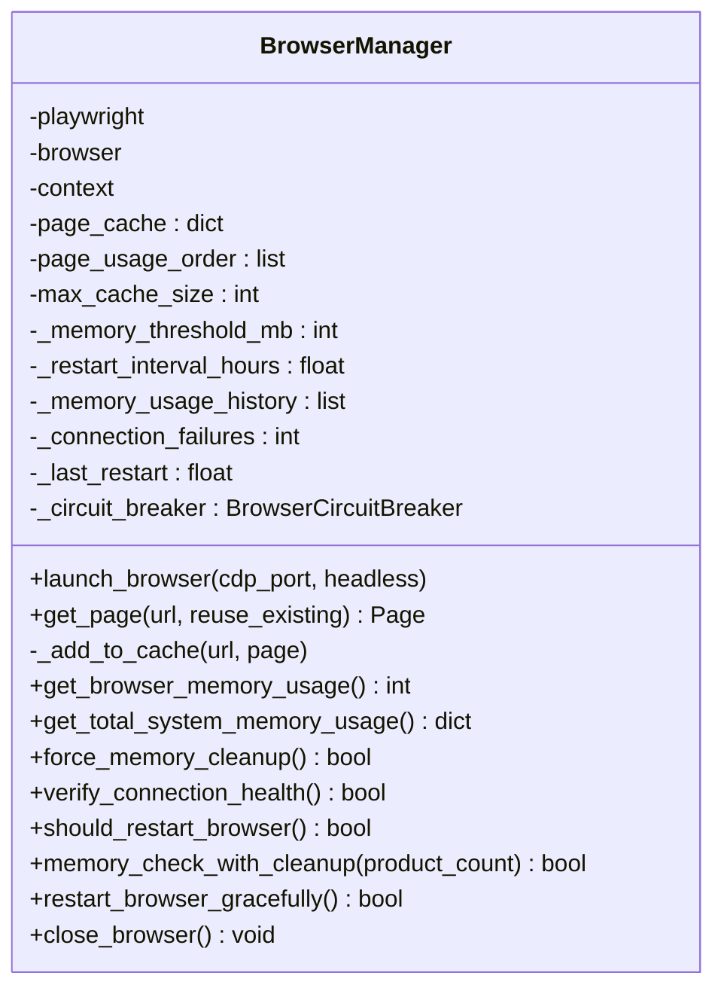
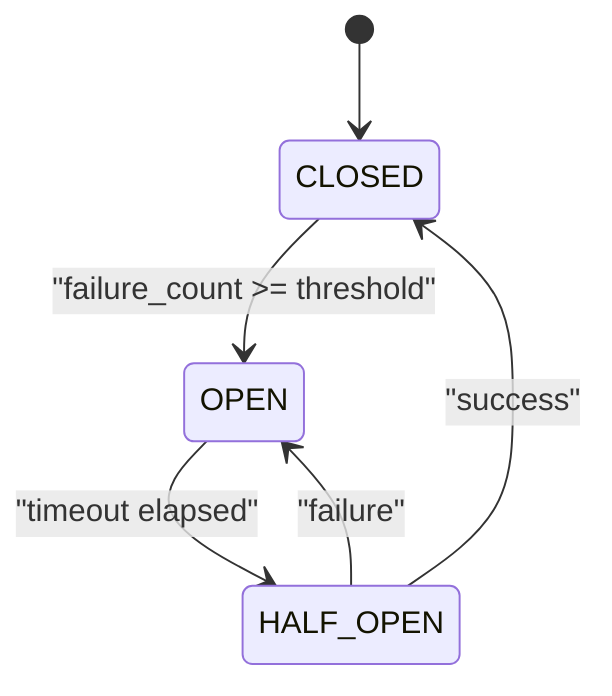
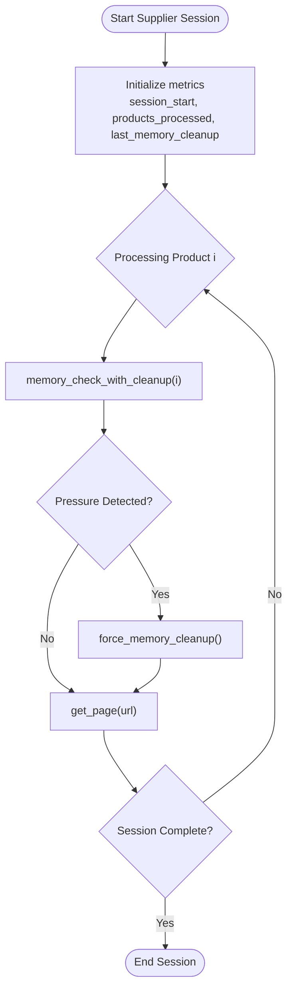
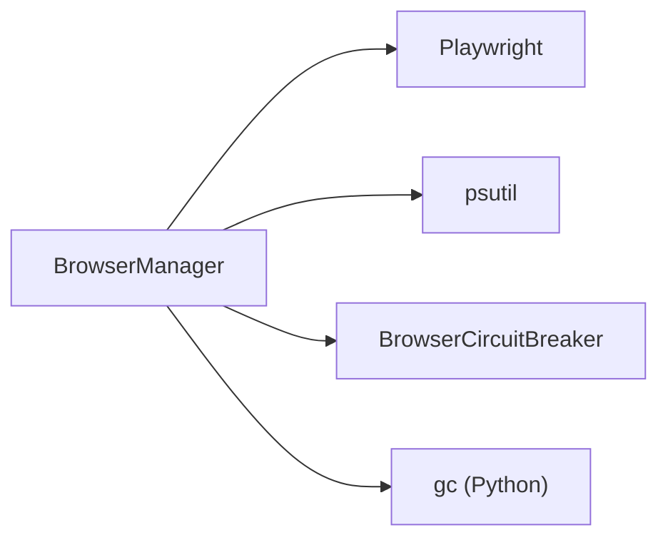

# Memory Management

<cite>
**Referenced Files in This Document**
- [browser_manager.py](file://utils/browser_manager.py)
- [browser_circuit_breaker.py](file://utils/browser_circuit_breaker.py)
- [memory_store.py](file://src/fba_agent/memory_store.py)
</cite>

## Table of Contents
1. [Introduction](#introduction)
2. [Project Structure](#project-structure)
3. [Core Components](#core-components)
4. [Architecture Overview](#architecture-overview)
5. [Detailed Component Analysis](#detailed-component-analysis)
6. [Dependency Analysis](#dependency-analysis)
7. [Performance Considerations](#performance-considerations)
8. [Troubleshooting Guide](#troubleshooting-guide)
9. [Conclusion](#conclusion)
10. [Appendices](#appendices)

## Introduction
This document explains the memory management subsystem for the Amazon FBA Agent System’s browser management. It covers:
- LRU page caching with configurable cache sizes
- Memory usage monitoring integrated with psutil
- Automatic cleanup procedures and restart strategies
- Health monitoring including memory thresholds, restart intervals, and circuit breaker protection
- Supplier session tracking with product processing metrics and memory cleanup triggers
- Practical examples and configuration options for tuning memory behavior

## Project Structure
The memory management system centers around a singleton browser manager that orchestrates:
- A Playwright-driven persistent connection to an existing Chrome instance via CDP
- An LRU page cache to reduce repeated navigations
- Health checks, memory monitoring, and controlled restarts
- A circuit breaker to protect operations under stress

**Diagram sources**
- [browser_manager.py](file://utils/browser_manager.py#L35-L120)
- [browser_circuit_breaker.py](file://utils/browser_circuit_breaker.py#L37-L71)

**Section sources**
- [browser_manager.py](file://utils/browser_manager.py#L1-L120)

## Core Components
- BrowserManager: Centralized singleton managing a persistent Chrome connection, LRU page cache, health monitoring, memory checks, and restart logic.
- BrowserCircuitBreaker: Protects operations from cascading failures with state transitions and recovery timeouts.
- memory_store: Supplier memory persistence utilities (not directly involved in runtime memory management, but part of the broader memory-related subsystem).

**Section sources**
- [browser_manager.py](file://utils/browser_manager.py#L35-L120)
- [browser_circuit_breaker.py](file://utils/browser_circuit_breaker.py#L37-L71)
- [memory_store.py](file://src/fba_agent/memory_store.py#L104-L131)

## Architecture Overview
The browser manager integrates with Chrome via CDP, maintains a small page cache, monitors memory, and applies cleanup and restart strategies to maintain stability during long-running supplier sessions.

**Diagram sources**
- [browser_manager.py](file://utils/browser_manager.py#L141-L198)
- [browser_manager.py](file://utils/browser_manager.py#L848-L978)
- [browser_circuit_breaker.py](file://utils/browser_circuit_breaker.py#L72-L111)

## Detailed Component Analysis

### BrowserManager: LRU Page Caching and Health Monitoring
- Singleton design ensures a single persistent Chrome connection and unified cache across tools.
- LRU page cache keyed by URL with an ordered usage list; eviction removes the oldest entry when capacity is exceeded.
- Configurable cache size controls maximum cached pages.
- Memory monitoring:
  - Uses psutil to track Chrome process memory and system-wide memory usage.
  - Maintains a rolling memory history for trend analysis.
- Restart policy:
  - Time-based restart interval is enforced.
  - Memory thresholds are monitored but restarts are disabled in favor of cleanup and GC.
- Cleanup:
  - Aggressive cleanup clears the page cache and invokes Python garbage collection.
- Supplier session tracking:
  - Tracks session start, products processed, and last cleanup timestamps.
  - Periodic memory checks trigger cleanup at defined thresholds.

**Diagram sources**
- [browser_manager.py](file://utils/browser_manager.py#L35-L120)
- [browser_manager.py](file://utils/browser_manager.py#L200-L208)
- [browser_manager.py](file://utils/browser_manager.py#L816-L847)
- [browser_manager.py](file://utils/browser_manager.py#L848-L938)
- [browser_manager.py](file://utils/browser_manager.py#L940-L978)
- [browser_manager.py](file://utils/browser_manager.py#L985-L1018)
- [browser_manager.py](file://utils/browser_manager.py#L1020-L1068)

**Section sources**
- [browser_manager.py](file://utils/browser_manager.py#L35-L120)
- [browser_manager.py](file://utils/browser_manager.py#L200-L208)
- [browser_manager.py](file://utils/browser_manager.py#L658-L720)
- [browser_manager.py](file://utils/browser_manager.py#L721-L814)
- [browser_manager.py](file://utils/browser_manager.py#L816-L847)
- [browser_manager.py](file://utils/browser_manager.py#L848-L938)
- [browser_manager.py](file://utils/browser_manager.py#L940-L978)
- [browser_manager.py](file://utils/browser_manager.py#L985-L1018)
- [browser_manager.py](file://utils/browser_manager.py#L1020-L1068)

### BrowserCircuitBreaker: Protection for Long Sessions
- Implements CLOSED/OPEN/HALF_OPEN states with failure thresholds and recovery timeouts.
- Wraps operations (e.g., page navigation) to prevent cascading failures.
- Integrates with BrowserManager to guard navigation operations.

**Diagram sources**
- [browser_circuit_breaker.py](file://utils/browser_circuit_breaker.py#L37-L71)
- [browser_circuit_breaker.py](file://utils/browser_circuit_breaker.py#L112-L133)
- [browser_circuit_breaker.py](file://utils/browser_circuit_breaker.py#L147-L165)

**Section sources**
- [browser_circuit_breaker.py](file://utils/browser_circuit_breaker.py#L37-L71)
- [browser_circuit_breaker.py](file://utils/browser_circuit_breaker.py#L72-L111)
- [browser_circuit_breaker.py](file://utils/browser_circuit_breaker.py#L112-L165)

### Supplier Session Tracking and Metrics
- Tracks session start, product counts, and cleanup cadence.
- Uses memory checks to decide when to force cleanup.
- Maintains a rolling memory usage history for trend analysis.

**Diagram sources**
- [browser_manager.py](file://utils/browser_manager.py#L64-L67)
- [browser_manager.py](file://utils/browser_manager.py#L940-L978)
- [browser_manager.py](file://utils/browser_manager.py#L816-L847)

**Section sources**
- [browser_manager.py](file://utils/browser_manager.py#L64-L67)
- [browser_manager.py](file://utils/browser_manager.py#L940-L978)

## Dependency Analysis
- BrowserManager depends on:
  - Playwright for CDP connections
  - psutil for memory telemetry
  - BrowserCircuitBreaker for operation protection
  - Python GC for cleanup
- The singleton ensures consistent cache and health state across all consumers.

**Diagram sources**
- [browser_manager.py](file://utils/browser_manager.py#L13-L23)
- [browser_manager.py](file://utils/browser_manager.py#L816-L847)
- [browser_circuit_breaker.py](file://utils/browser_circuit_breaker.py#L25-L31)

**Section sources**
- [browser_manager.py](file://utils/browser_manager.py#L13-L23)
- [browser_circuit_breaker.py](file://utils/browser_circuit_breaker.py#L25-L31)

## Performance Considerations
- LRU cache sizing: Tune max_cache_size to balance navigation speed versus memory footprint.
- Restart intervals: Time-based restarts prevent resource drift; adjust restart_interval_hours to match workload duration.
- Memory thresholds: While automatic restarts are disabled, cleanup and GC are triggered at defined thresholds to mitigate memory pressure.
- Circuit breaker: Reduces cascading failures during extended sessions; tune thresholds and timeouts for your environment.

[No sources needed since this section provides general guidance]

## Troubleshooting Guide
Common issues and remedies:
- Chrome debug port accessibility: Ensure Chrome is launched with the correct flags and port; verify with the built-in diagnostic helpers.
- Connection instability: Use health checks and circuit breaker to detect and recover from transient failures.
- Memory pressure: Monitor system memory and trigger cleanup proactively; confirm cleanup effectiveness.
- Persistent browser lifecycle: The manager disconnects rather than closing the persistent Chrome instance to preserve the debug session.

**Section sources**
- [browser_manager.py](file://utils/browser_manager.py#L242-L272)
- [browser_manager.py](file://utils/browser_manager.py#L302-L315)
- [browser_manager.py](file://utils/browser_manager.py#L848-L884)
- [browser_manager.py](file://utils/browser_manager.py#L1020-L1068)

## Conclusion
The memory management subsystem combines a compact LRU page cache, robust health monitoring, and disciplined restart/cleanup strategies to sustain long-running supplier sessions. The circuit breaker adds resilience, while psutil-backed telemetry enables proactive mitigation of memory pressure.

[No sources needed since this section summarizes without analyzing specific files]

## Appendices

### Configuration Options
- Cache size
  - max_cache_size: Controls the maximum number of pages retained in the LRU cache.
  - Typical value: Defined in the singleton initialization.
  - Reference: [browser_manager.py](file://utils/browser_manager.py#L52-L52)
- Memory thresholds
  - _memory_threshold_mb: Threshold used for monitoring (automatic restarts are disabled; cleanup is used instead).
  - Reference: [browser_manager.py](file://utils/browser_manager.py#L60-L60)
- Restart intervals
  - _restart_interval_hours: Time interval that triggers a graceful restart.
  - Reference: [browser_manager.py](file://utils/browser_manager.py#L59-L59)
- Circuit breaker
  - failure_threshold: Number of failures before opening the circuit.
  - timeout_seconds: Duration the circuit remains open before half-open testing.
  - recovery_timeout: Duration spent in half-open before full recovery.
  - Reference: [browser_circuit_breaker.py](file://utils/browser_circuit_breaker.py#L51-L62)

### Practical Examples and Techniques
- Memory usage analysis
  - Use get_total_system_memory_usage() to retrieve Chrome, Python, and system memory metrics.
  - Reference: [browser_manager.py](file://utils/browser_manager.py#L721-L814)
- Cache eviction policy
  - LRU eviction occurs when cache exceeds max_cache_size; oldest entry is removed.
  - Reference: [browser_manager.py](file://utils/browser_manager.py#L200-L208)
- Performance optimization
  - Proactive cleanup: force_memory_cleanup() clears the cache and invokes Python GC.
  - Reference: [browser_manager.py](file://utils/browser_manager.py#L816-L847)
  - Time-based restarts: restart_browser_gracefully() reconnects to the persistent Chrome instance.
  - Reference: [browser_manager.py](file://utils/browser_manager.py#L985-L1018)