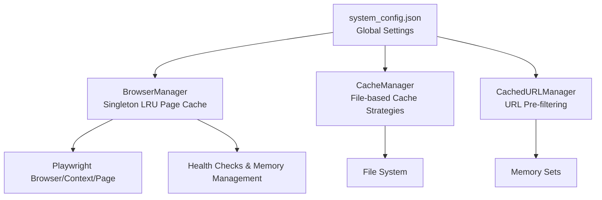
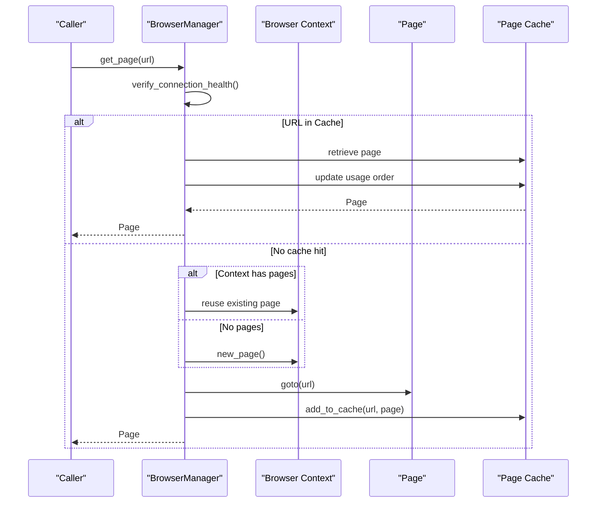
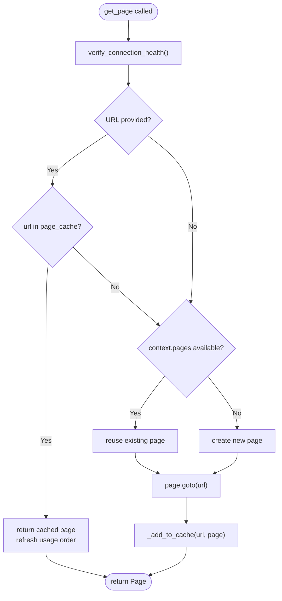
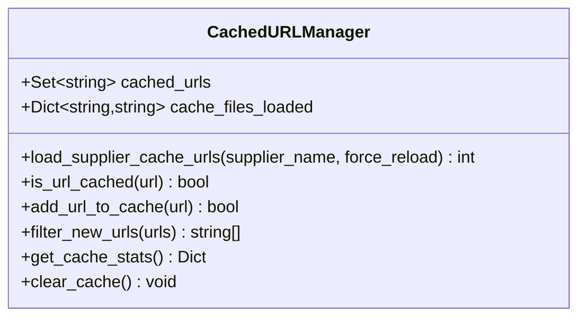
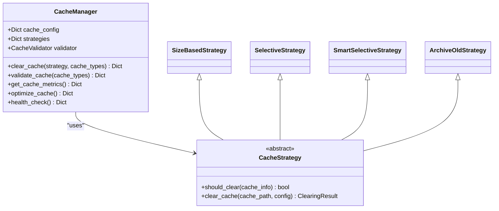
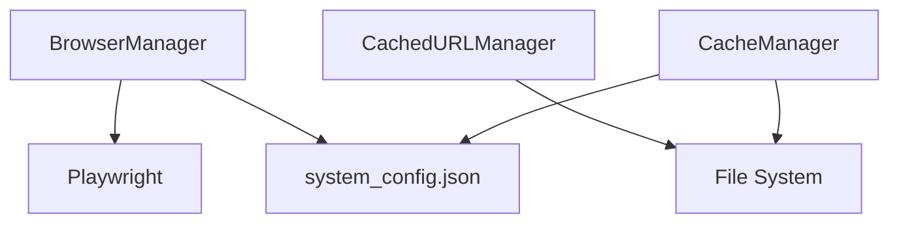

# Page Cache Management

<cite>
**Referenced Files in This Document**
- [browser_manager.py](file://utils/browser_manager.py)
- [cache_manager.py](file://tools/cache_manager.py)
- [url_cache_filter.py](file://utils/url_cache_filter.py)
- [system_config.json](file://config/system_config.json)
- [constants.py](file://src/fba_agent/constants.py)
</cite>

## Table of Contents
1. [Introduction](#introduction)
2. [Project Structure](#project-structure)
3. [Core Components](#core-components)
4. [Architecture Overview](#architecture-overview)
5. [Detailed Component Analysis](#detailed-component-analysis)
6. [Dependency Analysis](#dependency-analysis)
7. [Performance Considerations](#performance-considerations)
8. [Troubleshooting Guide](#troubleshooting-guide)
9. [Conclusion](#conclusion)

## Introduction
This document explains the page cache management system in the Amazon FBA Agent System's browser manager. It focuses on the LRU (Least Recently Used) caching algorithm implementation, configurable cache sizes, page reuse strategies, automatic eviction policies, and integration with browser context management. The system leverages an OrderedDict-like usage tracking mechanism to maintain cache order and supports memory-efficient operations for long-running supplier scraping workflows.

## Project Structure
The page cache management spans several modules:
- Browser manager: Centralized singleton managing a persistent Chrome instance and an LRU page cache
- Cache manager: File-based cache management with multiple clearing strategies and validation
- URL cache filter: Pre-filtering of product URLs using in-memory sets for O(1) duplicate detection
- System configuration: Global settings controlling cache behavior and limits

**Diagram sources**
- [browser_manager.py](file://utils/browser_manager.py#L35-L120)
- [cache_manager.py](file://tools/cache_manager.py#L1-L120)
- [url_cache_filter.py](file://utils/url_cache_filter.py#L31-L50)
- [system_config.json](file://config/system_config.json#L164-L175)

**Section sources**
- [browser_manager.py](file://utils/browser_manager.py#L1-L120)
- [cache_manager.py](file://tools/cache_manager.py#L1-L120)
- [url_cache_filter.py](file://utils/url_cache_filter.py#L1-L50)
- [system_config.json](file://config/system_config.json#L164-L175)

## Core Components
- BrowserManager singleton maintains a persistent Chrome connection and an LRU page cache. It tracks page usage via an ordered list and evicts the least recently used entries when capacity is exceeded.
- CacheManager provides file-based cache strategies (size-based LRU eviction, selective TTL-based clearing, smart selective clearing, archive old files) with validation and optimization capabilities.
- CachedURLManager performs URL pre-filtering using in-memory sets for O(1) lookup, reducing unnecessary page navigations.

**Section sources**
- [browser_manager.py](file://utils/browser_manager.py#L35-L120)
- [cache_manager.py](file://tools/cache_manager.py#L1-L120)
- [url_cache_filter.py](file://utils/url_cache_filter.py#L31-L50)

## Architecture Overview
The page cache integrates tightly with browser context management to ensure stable extension behavior and efficient resource usage. The system connects to an existing Chrome instance (debug port) and reuses pages within a persistent context. When a URL is requested, the manager checks the LRU cache; if present, it refreshes usage order and returns the cached page. Otherwise, it reuses an existing page or creates a new one, then navigates to the URL and adds it to the cache.

**Diagram sources**
- [browser_manager.py](file://utils/browser_manager.py#L141-L198)
- [browser_manager.py](file://utils/browser_manager.py#L200-L208)

## Detailed Component Analysis

### BrowserManager LRU Page Cache
- Singleton pattern ensures a single persistent Chrome instance and unified cache across tools.
- Page cache stores Page objects keyed by URL with an ordered usage list to support LRU eviction.
- Automatic eviction occurs when cache capacity is reached, removing the oldest entry based on usage order.
- Reuse strategies:
  - URL-based lookup: If the requested URL is already cached, the page is reused and moved to the end of the usage list.
  - Existing page reuse: If no URL is specified, the first available page in the context is reused.
  - New page creation: If no pages exist, a new page is created within the persistent context.
- Memory management includes periodic cleanup and forced memory cleanup for supplier scraping operations.

**Diagram sources**
- [browser_manager.py](file://utils/browser_manager.py#L141-L198)
- [browser_manager.py](file://utils/browser_manager.py#L200-L208)

**Section sources**
- [browser_manager.py](file://utils/browser_manager.py#L35-L120)
- [browser_manager.py](file://utils/browser_manager.py#L141-L198)
- [browser_manager.py](file://utils/browser_manager.py#L200-L208)

### Cache Configuration Options
- MAX_CACHED_PAGES: Controls the maximum number of pages retained in the LRU cache. The implementation uses an internal max_cache_size attribute to enforce eviction policy.
- Cache size limits: Enforced by checking cache length against max_cache_size before adding new entries.
- Performance impact considerations:
  - Reusing pages reduces overhead from repeated page creation and navigation.
  - LRU eviction prevents unbounded growth of cached pages.
  - Memory cleanup routines help mitigate memory pressure during intensive scraping sessions.

**Section sources**
- [browser_manager.py](file://utils/browser_manager.py#L29-L32)
- [browser_manager.py](file://utils/browser_manager.py#L52-L61)
- [browser_manager.py](file://utils/browser_manager.py#L200-L208)

### URL Cache Filter (Pre-filtering)
- Uses an in-memory set for O(1) URL lookup to avoid redundant page visits.
- Loads supplier cache files to populate the URL set and supports real-time updates.
- Provides filtering functions to exclude already-cached URLs from processing lists.

**Diagram sources**
- [url_cache_filter.py](file://utils/url_cache_filter.py#L31-L207)

**Section sources**
- [url_cache_filter.py](file://utils/url_cache_filter.py#L31-L207)

### CacheManager Strategies and File-based Caching
- Multiple clearing strategies:
  - Size-based LRU eviction: Removes oldest files until under size limits.
  - Selective TTL-based clearing: Removes expired files based on configured TTL.
  - Smart selective clearing: Filters processed items using a linking map.
  - Archive old files: Moves files older than a threshold to an archive directory.
- Validation and optimization:
  - Validates cache files for corruption and structure consistency.
  - Optimizes cache by compressing old files.
  - Provides health checks and metrics collection.

**Diagram sources**
- [cache_manager.py](file://tools/cache_manager.py#L1-L120)
- [cache_manager.py](file://tools/cache_manager.py#L120-L300)

**Section sources**
- [cache_manager.py](file://tools/cache_manager.py#L1-L120)
- [cache_manager.py](file://tools/cache_manager.py#L120-L300)

## Dependency Analysis
- BrowserManager depends on Playwright for browser control and integrates with system configuration for Chrome debug port and timeouts.
- URL cache filter relies on supplier cache files located under the configured output root.
- CacheManager coordinates with file system operations and uses configuration for cache directories and thresholds.

**Diagram sources**
- [browser_manager.py](file://utils/browser_manager.py#L19-L26)
- [system_config.json](file://config/system_config.json#L200-L207)
- [url_cache_filter.py](file://utils/url_cache_filter.py#L43-L47)
- [cache_manager.py](file://tools/cache_manager.py#L1-L120)

**Section sources**
- [browser_manager.py](file://utils/browser_manager.py#L19-L26)
- [system_config.json](file://config/system_config.json#L200-L207)
- [url_cache_filter.py](file://utils/url_cache_filter.py#L43-L47)
- [cache_manager.py](file://tools/cache_manager.py#L1-L120)

## Performance Considerations
- LRU eviction keeps the cache bounded and prevents memory bloat during extended scraping sessions.
- Reusing pages avoids repeated navigation overhead and improves throughput.
- Memory cleanup routines and health checks help maintain stable performance under heavy loads.
- URL pre-filtering reduces unnecessary page visits, lowering network and rendering costs.

[No sources needed since this section provides general guidance]

## Troubleshooting Guide
Common issues and resolutions:
- Cache hit/miss analysis:
  - Monitor logs for cache reuse messages and navigation triggers to understand hit rates.
  - Use memory cleanup routines to reset cache state when encountering stale pages.
- Memory usage optimization:
  - Trigger forced memory cleanup during intensive scraping to reduce Chrome and Python memory pressure.
  - Adjust cache size limits and TTL settings in system configuration to balance performance and memory footprint.
- Browser connection problems:
  - Ensure Chrome is launched with the correct debug port and user data directory.
  - Use health checks and restart mechanisms to recover from transient connection failures.

**Section sources**
- [browser_manager.py](file://utils/browser_manager.py#L848-L938)
- [browser_manager.py](file://utils/browser_manager.py#L816-L847)
- [system_config.json](file://config/system_config.json#L200-L207)

## Conclusion
The page cache management system combines an LRU-based page cache within the BrowserManager singleton with complementary file-based cache strategies and URL pre-filtering. Together, these components provide efficient page reuse, automatic eviction, and memory-conscious operations tailored for long-running supplier scraping workflows. Configuration controls enable tuning of cache behavior to meet performance and resource constraints.