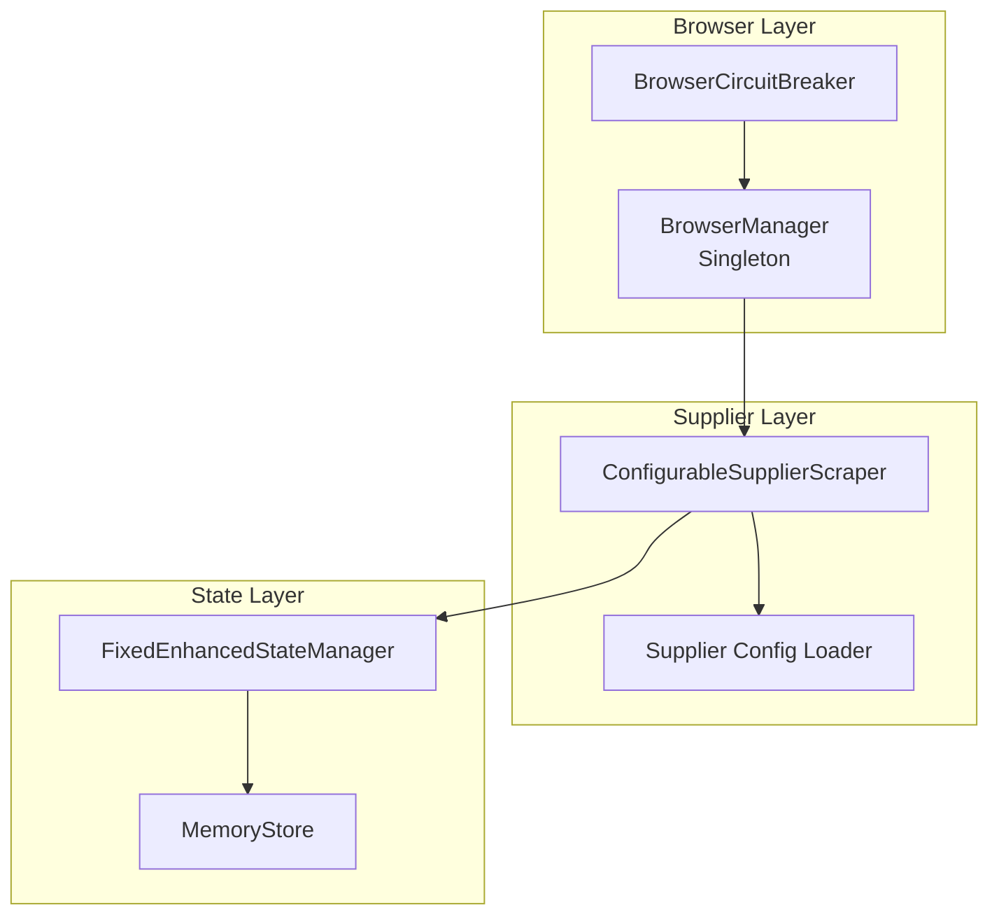
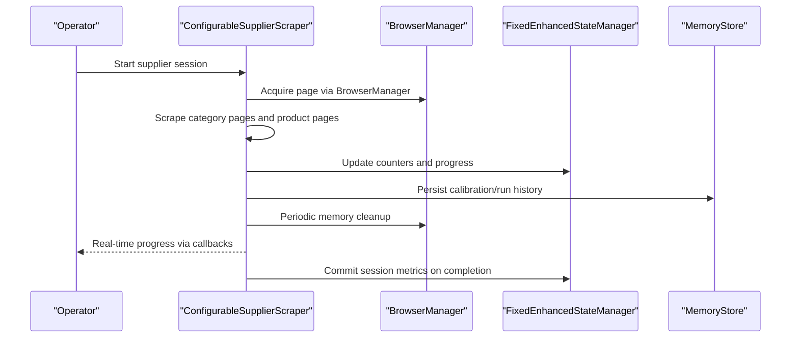
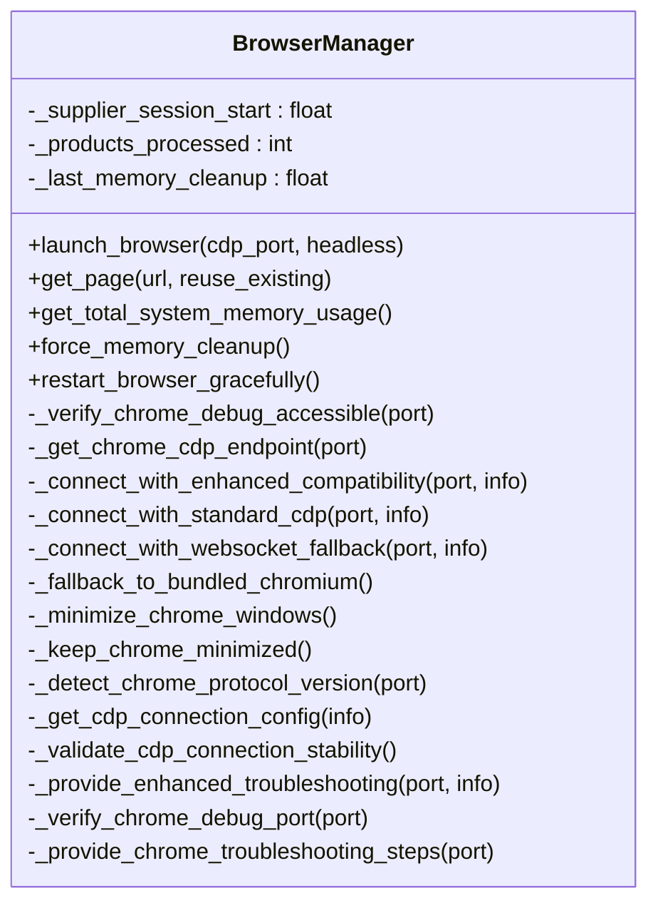
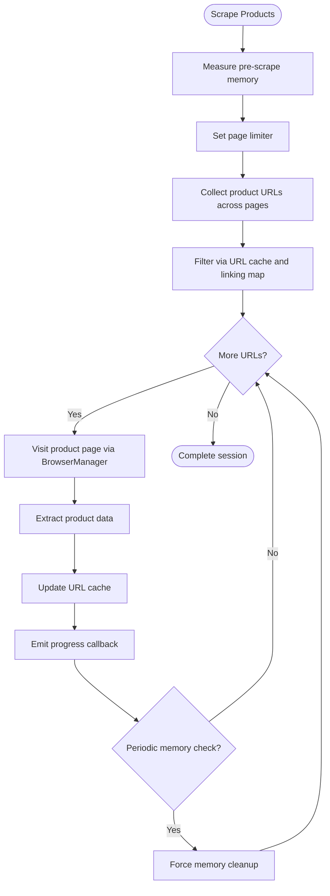
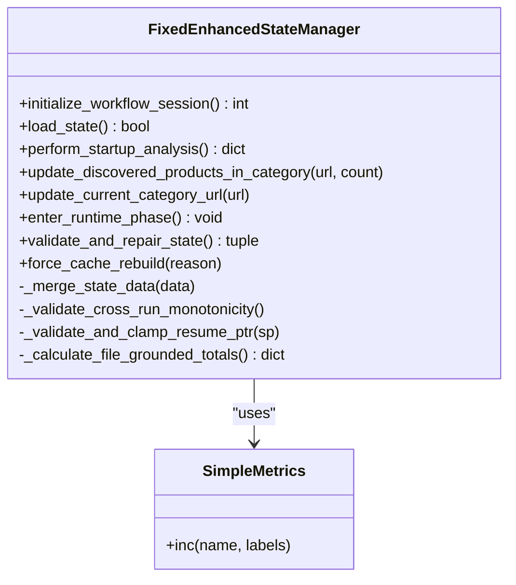
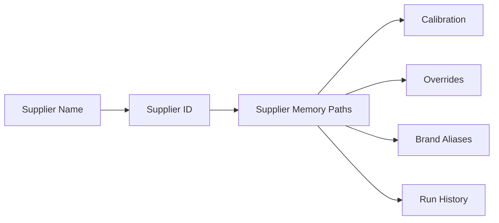
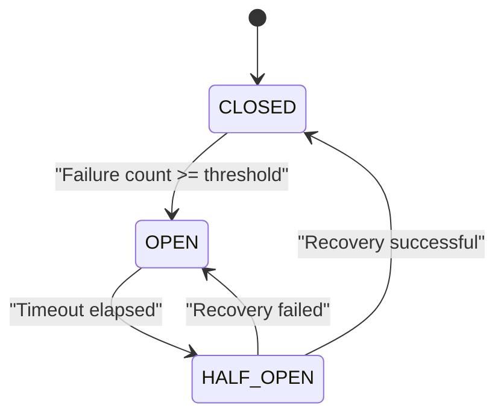
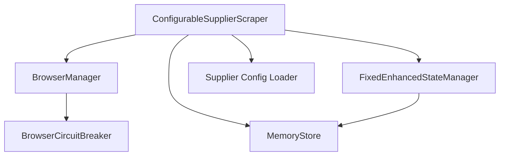

# Supplier Session Tracking

<cite>
**Referenced Files in This Document**
- [browser_manager.py](file://utils/browser_manager.py)
- [configurable_supplier_scraper.py](file://tools/configurable_supplier_scraper.py)
- [fixed_enhanced_state_manager.py](file://utils/fixed_enhanced_state_manager.py)
- [supplier_config_loader.py](file://config/supplier_config_loader.py)
- [browser_circuit_breaker.py](file://utils/browser_circuit_breaker.py)
- [memory_store.py](file://src/fba_agent/memory_store.py)
- [SMART_MEMORY_MANAGEMENT_UPDATE_SUMMARY.md](file://SMART_MEMORY_MANAGEMENT_UPDATE_SUMMARY.md)
- [test_supplier_processing_state.json](file://OUTPUTS/CACHE/processing_states/test_supplier_processing_state.json)
</cite>

## Table of Contents
1. [Introduction](#introduction)
2. [Project Structure](#project-structure)
3. [Core Components](#core-components)
4. [Architecture Overview](#architecture-overview)
5. [Detailed Component Analysis](#detailed-component-analysis)
6. [Dependency Analysis](#dependency-analysis)
7. [Performance Considerations](#performance-considerations)
8. [Troubleshooting Guide](#troubleshooting-guide)
9. [Conclusion](#conclusion)

## Introduction
This document explains supplier session tracking in the Amazon FBA Agent System's browser management. It covers supplier-specific session metrics (product processing counts, session duration, resource allocation), session lifecycle management (start/end timestamps, state persistence, cleanup), integration with memory management (cleanup triggers, resource isolation), and practical monitoring/performance analysis. The goal is to enable operators and developers to understand, monitor, and troubleshoot supplier sessions reliably.

## Project Structure
The supplier session tracking spans three primary areas:
- Browser management: centralized Chrome/Playwright control with health and memory monitoring
- Supplier scraping: session-aware extraction with URL caching and progress callbacks
- State management: persistent, atomic supplier session state with metrics and resumption logic

**Diagram sources**
- [browser_manager.py](file://utils/browser_manager.py#L35-L120)
- [configurable_supplier_scraper.py](file://tools/configurable_supplier_scraper.py#L82-L167)
- [fixed_enhanced_state_manager.py](file://utils/fixed_enhanced_state_manager.py#L86-L238)
- [supplier_config_loader.py](file://config/supplier_config_loader.py#L23-L70)
- [browser_circuit_breaker.py](file://utils/browser_circuit_breaker.py#L37-L71)

**Section sources**
- [browser_manager.py](file://utils/browser_manager.py#L35-L120)
- [configurable_supplier_scraper.py](file://tools/configurable_supplier_scraper.py#L82-L167)
- [fixed_enhanced_state_manager.py](file://utils/fixed_enhanced_state_manager.py#L86-L238)
- [supplier_config_loader.py](file://config/supplier_config_loader.py#L23-L70)
- [browser_circuit_breaker.py](file://utils/browser_circuit_breaker.py#L37-L71)

## Core Components
- BrowserManager: Centralized singleton managing a persistent Chrome/Playwright instance, page caching, health checks, memory monitoring, and restart policies. It tracks supplier session metrics internally.
- ConfigurableSupplierScraper: Supplier session orchestrator that uses BrowserManager, integrates URL caching, and emits progress callbacks for real-time monitoring.
- FixedEnhancedStateManager: Atomic, thread-safe state manager for supplier sessions, including session counters, category progress, and resumption logic.
- Supplier Config Loader: Supplies supplier-specific selectors and configuration for scraping.
- BrowserCircuitBreaker: Protects long-running sessions from cascading failures.
- MemoryStore: Supplier-specific memory persistence for calibration, overrides, and run history.

**Section sources**
- [browser_manager.py](file://utils/browser_manager.py#L35-L120)
- [configurable_supplier_scraper.py](file://tools/configurable_supplier_scraper.py#L82-L167)
- [fixed_enhanced_state_manager.py](file://utils/fixed_enhanced_state_manager.py#L86-L238)
- [supplier_config_loader.py](file://config/supplier_config_loader.py#L23-L70)
- [browser_circuit_breaker.py](file://utils/browser_circuit_breaker.py#L37-L71)
- [memory_store.py](file://src/fba_agent/memory_store.py#L25-L143)

## Architecture Overview
The supplier session lifecycle integrates browser orchestration, scraping, state persistence, and memory management:

**Diagram sources**
- [configurable_supplier_scraper.py](file://tools/configurable_supplier_scraper.py#L477-L771)
- [browser_manager.py](file://utils/browser_manager.py#L141-L198)
- [fixed_enhanced_state_manager.py](file://utils/fixed_enhanced_state_manager.py#L737-L787)
- [memory_store.py](file://src/fba_agent/memory_store.py#L104-L131)

## Detailed Component Analysis

### BrowserManager: Supplier Session Metrics and Lifecycle
- Session metrics:
  - Products processed: tracked via internal counters
  - Session start timestamp: supplier session start time
  - Memory usage: periodic measurement and history tracking
  - Restart policy: scheduled restarts to maintain stability
- Lifecycle:
  - Launch browser with CDP connection to existing Chrome instance
  - Page caching with LRU eviction
  - Health checks and circuit breaker integration
  - Graceful restarts and fallback to bundled Chromium
- Cleanup:
  - Memory pressure detection and cleanup triggers
  - Periodic forced cleanup for long sessions

**Diagram sources**
- [browser_manager.py](file://utils/browser_manager.py#L35-L120)
- [browser_manager.py](file://utils/browser_manager.py#L658-L800)

**Section sources**
- [browser_manager.py](file://utils/browser_manager.py#L64-L68)
- [browser_manager.py](file://utils/browser_manager.py#L658-L800)

### ConfigurableSupplierScraper: Session-Aware Scraping
- Session awareness:
  - Uses BrowserManager singleton for page acquisition
  - Integrates URL caching and linking map filtering to avoid redundant work
  - Emits progress callbacks for real-time monitoring
- Resource management:
  - Periodic memory cleanup every N products
  - Local product list clearing to prevent accumulation
  - Rate limiting and retries with backoff
- Supplier-specific configuration:
  - Loads selectors per domain from JSON configs
  - Supports default fallback configuration

**Diagram sources**
- [configurable_supplier_scraper.py](file://tools/configurable_supplier_scraper.py#L477-L771)

**Section sources**
- [configurable_supplier_scraper.py](file://tools/configurable_supplier_scraper.py#L82-L167)
- [configurable_supplier_scraper.py](file://tools/configurable_supplier_scraper.py#L477-L771)
- [supplier_config_loader.py](file://config/supplier_config_loader.py#L23-L70)

### FixedEnhancedStateManager: Session State Persistence and Metrics
- Session counters:
  - Supplier products needing extraction and completed
  - Successful products and profitability metrics
  - Processing statistics (start/end times, runtime, throughput)
- Resumption and consistency:
  - Authoritative resumption index derived from linking map
  - Cross-run monotonicity guard
  - Category denominator freezing to preserve session integrity
- Atomic persistence:
  - Thread-safe, atomic state writes with file locking
  - Structured schema with metadata and runtime settings

**Diagram sources**
- [fixed_enhanced_state_manager.py](file://utils/fixed_enhanced_state_manager.py#L86-L238)
- [fixed_enhanced_state_manager.py](file://utils/fixed_enhanced_state_manager.py#L737-L787)

**Section sources**
- [fixed_enhanced_state_manager.py](file://utils/fixed_enhanced_state_manager.py#L148-L284)
- [fixed_enhanced_state_manager.py](file://utils/fixed_enhanced_state_manager.py#L469-L646)
- [fixed_enhanced_state_manager.py](file://utils/fixed_enhanced_state_manager.py#L737-L787)

### MemoryStore: Supplier-Specific Resource Allocation
- Supplier identity:
  - Generates stable supplier IDs from domain names
  - Organizes memory under supplier-specific directories
- Persistence:
  - Calibration, brand aliases, overrides, and run history
  - Atomic JSON writes for reliability
- Integration:
  - Supplies calibration and overrides to naming convention merging
  - Supports supplier-specific traps and global traps

**Diagram sources**
- [memory_store.py](file://src/fba_agent/memory_store.py#L11-L34)
- [memory_store.py](file://src/fba_agent/memory_store.py#L104-L143)

**Section sources**
- [memory_store.py](file://src/fba_agent/memory_store.py#L11-L34)
- [memory_store.py](file://src/fba_agent/memory_store.py#L104-L143)

### BrowserCircuitBreaker: Session Stability Guard
- Purpose:
  - Prevents cascading failures during long sessions
  - Enforces thresholds and timeouts for recovery
- Integration:
  - Used by BrowserManager for navigation and page operations
  - Transitions between CLOSED, OPEN, and HALF_OPEN states

**Diagram sources**
- [browser_circuit_breaker.py](file://utils/browser_circuit_breaker.py#L37-L71)
- [browser_circuit_breaker.py](file://utils/browser_circuit_breaker.py#L112-L133)

**Section sources**
- [browser_circuit_breaker.py](file://utils/browser_circuit_breaker.py#L37-L71)
- [browser_circuit_breaker.py](file://utils/browser_circuit_breaker.py#L112-L133)

## Dependency Analysis
Supplier session tracking depends on coordinated interactions among browser, scraping, state, and memory components:

**Diagram sources**
- [configurable_supplier_scraper.py](file://tools/configurable_supplier_scraper.py#L32-L41)
- [browser_manager.py](file://utils/browser_manager.py#L23-L26)
- [fixed_enhanced_state_manager.py](file://utils/fixed_enhanced_state_manager.py#L140-L146)
- [memory_store.py](file://src/fba_agent/memory_store.py#L7-L8)

**Section sources**
- [configurable_supplier_scraper.py](file://tools/configurable_supplier_scraper.py#L32-L41)
- [browser_manager.py](file://utils/browser_manager.py#L23-L26)
- [fixed_enhanced_state_manager.py](file://utils/fixed_enhanced_state_manager.py#L140-L146)
- [memory_store.py](file://src/fba_agent/memory_store.py#L7-L8)

## Performance Considerations
- Memory management:
  - Sliding window approach reduces memory clearing frequency while preserving continuity
  - Periodic forced cleanup prevents memory pressure during long sessions
- Session stability:
  - Circuit breaker protects against cascading failures
  - Scheduled browser restarts mitigate connection drift
- Throughput:
  - URL caching and linking map filtering reduce redundant page visits
  - Rate limiting and retries balance speed with reliability

**Section sources**
- [SMART_MEMORY_MANAGEMENT_UPDATE_SUMMARY.md](file://SMART_MEMORY_MANAGEMENT_UPDATE_SUMMARY.md#L95-L203)
- [browser_manager.py](file://utils/browser_manager.py#L658-L800)
- [configurable_supplier_scraper.py](file://tools/configurable_supplier_scraper.py#L477-L771)
- [browser_circuit_breaker.py](file://utils/browser_circuit_breaker.py#L37-L71)

## Troubleshooting Guide
- Chrome connection issues:
  - Verify debug port accessibility and Chrome profile flags
  - Use built-in troubleshooting helpers for port checks and restart guidance
- Memory pressure:
  - Monitor system and Chrome memory usage
  - Trigger forced cleanup when thresholds are exceeded
- Session resumption:
  - Validate state consistency and cross-run monotonicity
  - Use linking map as the single source of truth for resumption decisions
- Supplier configuration:
  - Confirm domain-specific selector configuration exists or fall back to defaults

**Section sources**
- [browser_manager.py](file://utils/browser_manager.py#L302-L314)
- [browser_manager.py](file://utils/browser_manager.py#L623-L657)
- [fixed_enhanced_state_manager.py](file://utils/fixed_enhanced_state_manager.py#L469-L646)
- [supplier_config_loader.py](file://config/supplier_config_loader.py#L23-L70)

## Conclusion
Supplier session tracking in the Amazon FBA Agent System combines centralized browser management, session-aware scraping, atomic state persistence, and supplier-specific memory storage. Together, these components provide reliable session metrics, robust lifecycle management, and integrated memory/resource controls suitable for long-running supplier workflows.