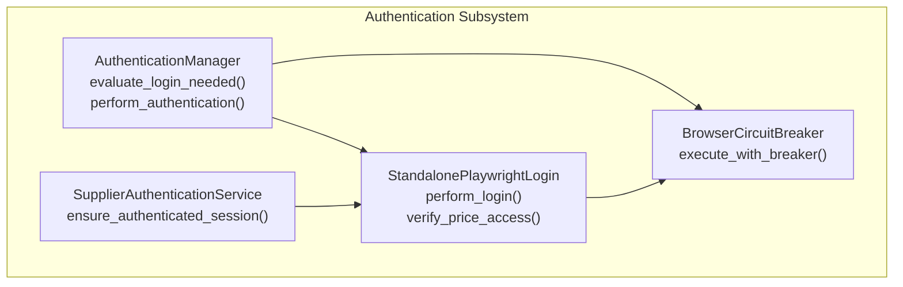
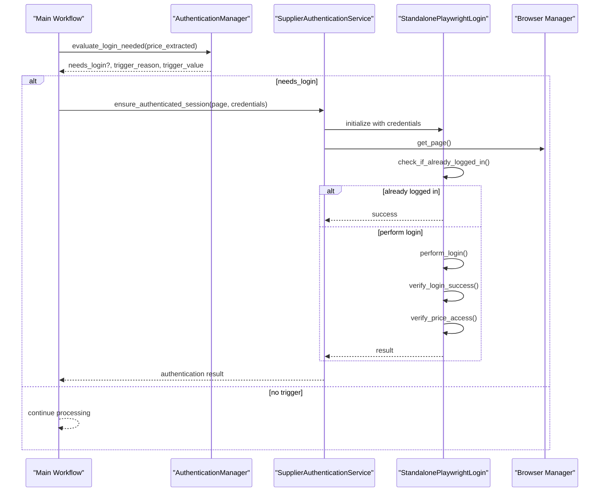
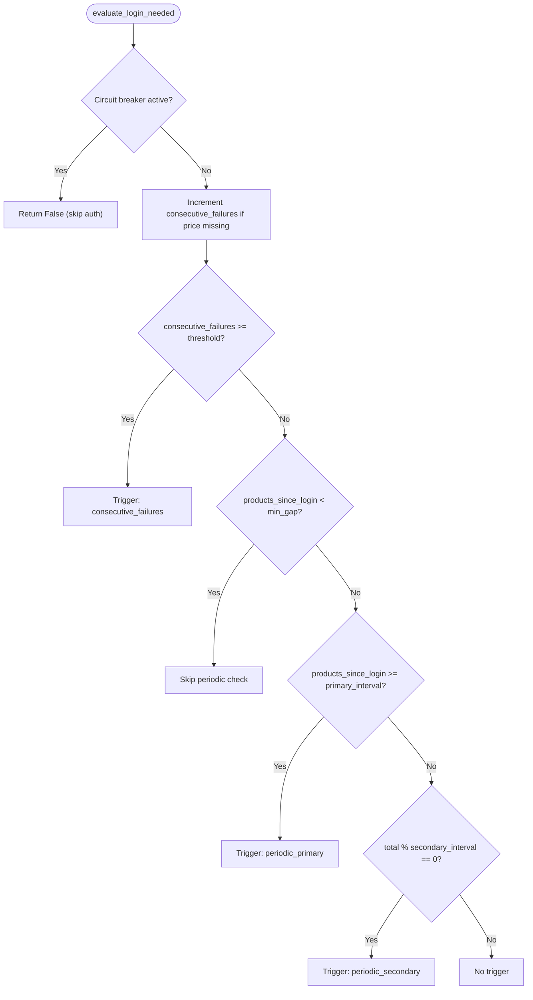
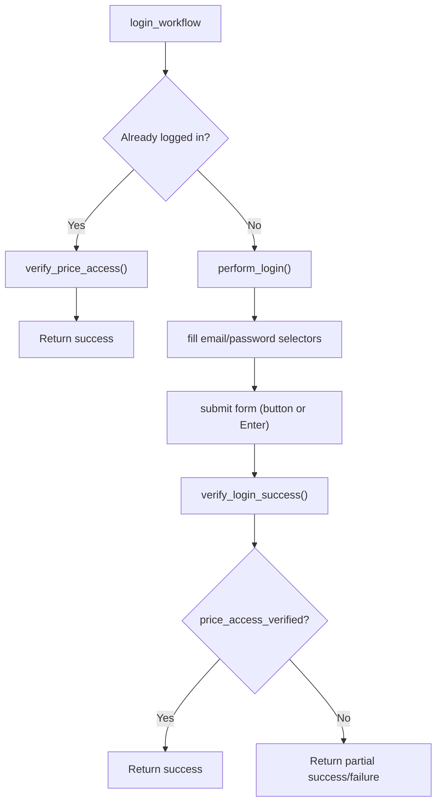
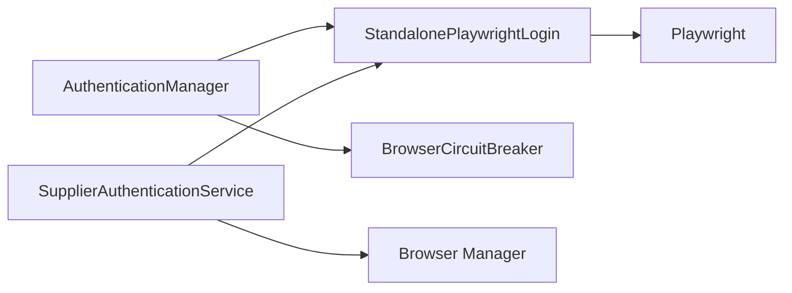

# Authentication Issues

<cite>
**Referenced Files in This Document**
- [authentication_manager.py](file://tools/authentication_manager.py)
- [standalone_playwright_login.py](file://tools/standalone_playwright_login.py)
- [TROUBLESHOOTING.md](file://docs/TROUBLESHOOTING.md)
- [Supplier Website Authentication.md](file://WIKI REPO SEPT17/8. Browser Automation/8.2. Supplier Website Authentication.md)
- [browser_circuit_breaker.py](file://utils/browser_circuit_breaker.py)
- [Security Challenges.md](file://WIKI REPO SEPT17/11. Troubleshooting Guide/11.5. Authentication Issues/11.5.3. Security Challenges.md)
</cite>

## Table of Contents
1. [Introduction](#introduction)
2. [Project Structure](#project-structure)
3. [Core Components](#core-components)
4. [Architecture Overview](#architecture-overview)
5. [Detailed Component Analysis](#detailed-component-analysis)
6. [Dependency Analysis](#dependency-analysis)
7. [Performance Considerations](#performance-considerations)
8. [Troubleshooting Guide](#troubleshooting-guide)
9. [Conclusion](#conclusion)

## Introduction
This document provides a comprehensive troubleshooting guide for supplier website authentication problems in the Amazon FBA Agent System. It focuses on diagnosing and resolving login failures, session timeouts, authentication token expiration, CAPTCHA challenges, and account lockout scenarios. It also documents credential verification, session persistence, diagnostic tools, manual verification procedures, and automated retry mechanisms tailored to the system’s authentication architecture.

## Project Structure
The authentication subsystem is composed of:
- An Authentication Manager that evaluates when authentication is needed and tracks statistics and circuit breaker state
- A Standalone Playwright Login handler that performs reliable login flows and verifies price access
- A Supplier Authentication Service that orchestrates session checks and readiness markers
- A Browser Circuit Breaker that protects long-running browser operations
- Documentation and troubleshooting procedures for authentication issues

**Diagram sources**
- [authentication_manager.py](file://tools/authentication_manager.py#L97-L144)
- [standalone_playwright_login.py](file://tools/standalone_playwright_login.py#L183-L390)
- [Supplier Website Authentication.md](file://WIKI REPO SEPT17/8. Browser Automation/8.2. Supplier Website Authentication.md#L72-L99)
- [browser_circuit_breaker.py](file://utils/browser_circuit_breaker.py#L72-L111)

**Section sources**
- [authentication_manager.py](file://tools/authentication_manager.py#L48-L96)
- [standalone_playwright_login.py](file://tools/standalone_playwright_login.py#L33-L96)
- [Supplier Website Authentication.md](file://WIKI REPO SEPT17/8. Browser Automation/8.2. Supplier Website Authentication.md#L19-L46)

## Core Components
- AuthenticationManager: Implements multi-tier triggers (startup, consecutive failures, periodic intervals) and a circuit breaker to prevent cascading authentication failures. It tracks statistics and logs session summaries.
- StandalonePlaywrightLogin: Performs login using robust selector strategies, verifies login success, and confirms price access on product pages. It handles retries and error reporting.
- SupplierAuthenticationService: Orchestrates session validation, readiness file creation, and integration with the browser manager and login handler.
- BrowserCircuitBreaker: Protects browser operations with stateful failure handling and automatic recovery.

**Section sources**
- [authentication_manager.py](file://tools/authentication_manager.py#L48-L96)
- [standalone_playwright_login.py](file://tools/standalone_playwright_login.py#L33-L96)
- [Supplier Website Authentication.md](file://WIKI REPO SEPT17/8. Browser Automation/8.2. Supplier Website Authentication.md#L22-L46)
- [browser_circuit_breaker.py](file://utils/browser_circuit_breaker.py#L37-L69)

## Architecture Overview
The authentication architecture integrates a multi-tier trigger system with a robust login handler and session persistence. It uses Playwright to automate login, verifies access to pricing data, and persists authentication state across browser restarts.

**Diagram sources**
- [authentication_manager.py](file://tools/authentication_manager.py#L97-L144)
- [Supplier Website Authentication.md](file://WIKI REPO SEPT17/8. Browser Automation/8.2. Supplier Website Authentication.md#L72-L99)
- [standalone_playwright_login.py](file://tools/standalone_playwright_login.py#L183-L390)

## Detailed Component Analysis

### AuthenticationManager
- Multi-tier trigger logic:
  - Consecutive failure detection: resets on successful price extraction
  - Periodic triggers: primary every N products and secondary every M products
  - Minimum gap enforcement between logins to avoid redundancy
- Circuit breaker:
  - Activates after a configurable number of consecutive failures
  - Enforces a cooldown period before re-enabling authentication attempts
- Statistics and session tracking:
  - Tracks total attempts, successes, failures, and trigger breakdowns
  - Provides session summary logs for diagnostics

**Diagram sources**
- [authentication_manager.py](file://tools/authentication_manager.py#L97-L144)

**Section sources**
- [authentication_manager.py](file://tools/authentication_manager.py#L97-L144)
- [authentication_manager.py](file://tools/authentication_manager.py#L240-L258)
- [authentication_manager.py](file://tools/authentication_manager.py#L266-L294)

### StandalonePlaywrightLogin
- Robust login flow:
  - Connects to a shared Chrome instance via CDP
  - Checks existing login state by navigating to a test product and detecting price visibility
  - Fills email/password using supplier-specific or fallback selectors
  - Submits login via explicit button or Enter key fallback
  - Verifies success via URL change, error indicators, and success indicators
  - Confirms price access using currency-aware selectors and retry logic
- Error handling:
  - Captures and reports detailed error messages without leaking credentials
  - Handles navigation interruptions gracefully

**Diagram sources**
- [standalone_playwright_login.py](file://tools/standalone_playwright_login.py#L543-L579)
- [standalone_playwright_login.py](file://tools/standalone_playwright_login.py#L183-L390)

**Section sources**
- [standalone_playwright_login.py](file://tools/standalone_playwright_login.py#L98-L131)
- [standalone_playwright_login.py](file://tools/standalone_playwright_login.py#L132-L182)
- [standalone_playwright_login.py](file://tools/standalone_playwright_login.py#L183-L390)
- [standalone_playwright_login.py](file://tools/standalone_playwright_login.py#L449-L542)

### SupplierAuthenticationService
- Ensures authenticated sessions by orchestrating:
  - Session validation using DOM indicators (logout links, account UI, price access)
  - Supplier-specific configuration and selector mappings
  - Ready-file creation upon successful authentication
- Integrates with the browser manager and login handler

**Section sources**
- [Supplier Website Authentication.md](file://WIKI REPO SEPT17/8. Browser Automation/8.2. Supplier Website Authentication.md#L22-L46)
- [Supplier Website Authentication.md](file://WIKI REPO SEPT17/8. Browser Automation/8.2. Supplier Website Authentication.md#L108-L120)

### Browser Circuit Breaker
- State machine:
  - CLOSED: normal operation
  - OPEN: blocks operations after threshold failures, enforces timeout
  - HALF_OPEN: tests recovery with limited operations
- Automatic recovery:
  - Transitions to HALF_OPEN after timeout, then to CLOSED on success or back to OPEN on failure

**Section sources**
- [browser_circuit_breaker.py](file://utils/browser_circuit_breaker.py#L37-L69)
- [browser_circuit_breaker.py](file://utils/browser_circuit_breaker.py#L72-L111)
- [browser_circuit_breaker.py](file://utils/browser_circuit_breaker.py#L112-L165)

## Dependency Analysis
- AuthenticationManager depends on:
  - StandalonePlaywrightLogin for performing authentication
  - BrowserCircuitBreaker for protecting repeated login attempts
- StandalonePlaywrightLogin depends on:
  - Playwright for browser automation
  - Supplier configuration for selectors and URLs
- SupplierAuthenticationService coordinates:
  - Browser manager for page context
  - Authentication manager for trigger decisions

**Diagram sources**
- [authentication_manager.py](file://tools/authentication_manager.py#L146-L221)
- [standalone_playwright_login.py](file://tools/standalone_playwright_login.py#L36-L96)
- [Supplier Website Authentication.md](file://WIKI REPO SEPT17/8. Browser Automation/8.2. Supplier Website Authentication.md#L22-L46)

**Section sources**
- [authentication_manager.py](file://tools/authentication_manager.py#L146-L221)
- [standalone_playwright_login.py](file://tools/standalone_playwright_login.py#L36-L96)
- [Supplier Website Authentication.md](file://WIKI REPO SEPT17/8. Browser Automation/8.2. Supplier Website Authentication.md#L22-L46)

## Performance Considerations
- Minimizing redundant logins:
  - The AuthenticationManager enforces minimum gaps between logins to reduce overhead
- Efficient selector strategies:
  - StandalonePlaywrightLogin uses supplier-specific and fallback selectors to reduce flakiness
- Circuit breaker protection:
  - Prevents cascading failures during extended runs by pausing operations after repeated failures

[No sources needed since this section provides general guidance]

## Troubleshooting Guide

### Diagnostic Procedures
- Quick system checks:
  - Verify Chrome debug port accessibility and browser health
  - Confirm dependencies and configuration validity
  - Check authentication logs and fallback counts
- Manual login test:
  - Launch a browser with the debug port and run a targeted authentication script against the supplier login page
- Session state inspection:
  - Validate presence of authentication readiness files and DOM indicators (logout links, account UI, price access)

**Section sources**
- [TROUBLESHOOTING.md](file://docs/TROUBLESHOOTING.md#L15-L42)
- [TROUBLESHOOTING.md](file://docs/TROUBLESHOOTING.md#L261-L360)

### Common Authentication Errors and Resolutions
- Invalid credentials
  - Verify credentials in supplier configuration
  - Manually test login using the standalone login script
  - Clear authentication cache and restart the browser
- Expired sessions and session timeouts
  - Rely on the AuthenticationManager’s periodic triggers to refresh sessions
  - Ensure the browser context is preserved across operations
  - Confirm price access verification after login
- Authentication token expiration
  - The system proactively renews sessions based on thresholds; monitor trigger breakdowns
  - If failures persist, reset the authentication circuit breaker
- Blocked access attempts and rate limiting
  - Respect supplier rate limits and delays configured in supplier settings
  - Allow the circuit breaker to recover after failures
- CAPTCHA challenges
  - The system detects CAPTCHA indicators and flags authentication attempts accordingly
  - Capture page artifacts for AI-assisted diagnosis and recommend manual intervention

**Section sources**
- [TROUBLESHOOTING.md](file://docs/TROUBLESHOOTING.md#L261-L360)
- [Security Challenges.md](file://WIKI REPO SEPT17/11. Troubleshooting Guide/11.5. Authentication Issues/11.5.3. Security Challenges.md#L54-L68)
- [Supplier Website Authentication.md](file://WIKI REPO SEPT17/8. Browser Automation/8.2. Supplier Website Authentication.md#L163-L182)

### Verification and Remediation Strategies
- Credential rotation
  - Update supplier configuration with new credentials
  - Re-run authentication tests to confirm success
- Session management
  - Clear authentication state files and restart the browser
  - Confirm session persistence via ready files and DOM indicators
- Authentication bypass techniques
  - Use the standalone login script to bypass workflow-level checks for isolated testing
  - Leverage the SupplierAuthenticationService’s readiness file to mark sessions as ready
- Automated retry mechanisms
  - Rely on the AuthenticationManager’s trigger logic and circuit breaker to manage retries
  - Monitor authentication statistics and adjust thresholds as needed

**Section sources**
- [TROUBLESHOOTING.md](file://docs/TROUBLESHOOTING.md#L286-L360)
- [authentication_manager.py](file://tools/authentication_manager.py#L266-L294)
- [standalone_playwright_login.py](file://tools/standalone_playwright_login.py#L596-L621)

### Diagnostic Tools and Manual Procedures
- Built-in diagnostics:
  - Authentication statistics and session summaries
  - Circuit breaker status and recovery timers
- Manual verification:
  - Run the standalone login script against the supplier login page
  - Inspect readiness files and DOM indicators for authentication state
- Automated retry:
  - Adjust thresholds in the AuthenticationManager configuration
  - Reset the authentication circuit breaker when appropriate

**Section sources**
- [authentication_manager.py](file://tools/authentication_manager.py#L296-L317)
- [browser_circuit_breaker.py](file://utils/browser_circuit_breaker.py#L174-L192)
- [TROUBLESHOOTING.md](file://docs/TROUBLESHOOTING.md#L352-L359)

## Conclusion
The Amazon FBA Agent System employs a robust, multi-layered authentication architecture designed for reliability in long-running supplier scraping tasks. By combining intelligent trigger logic, resilient login automation, session persistence, and protective circuit breakers, the system minimizes downtime and provides clear diagnostics for troubleshooting. Use the procedures and tools outlined above to diagnose and resolve authentication issues efficiently, and leverage the built-in statistics and circuit breaker mechanisms to maintain stability during extended operations.