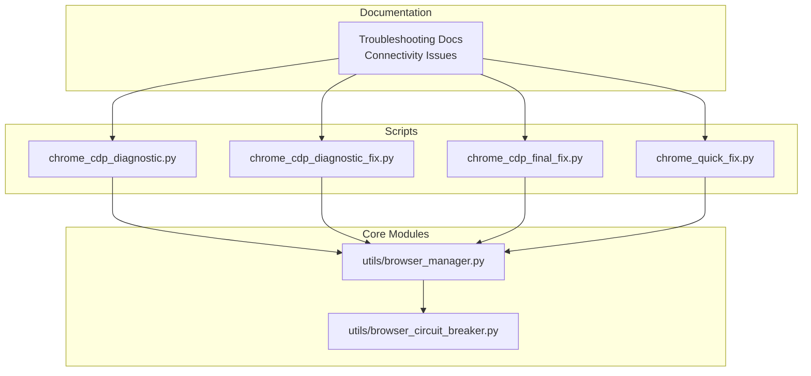
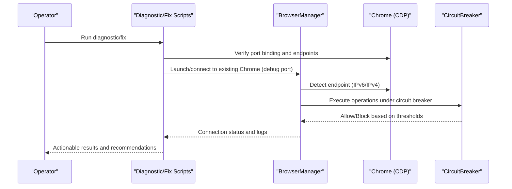
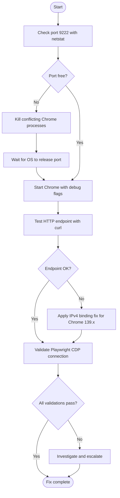
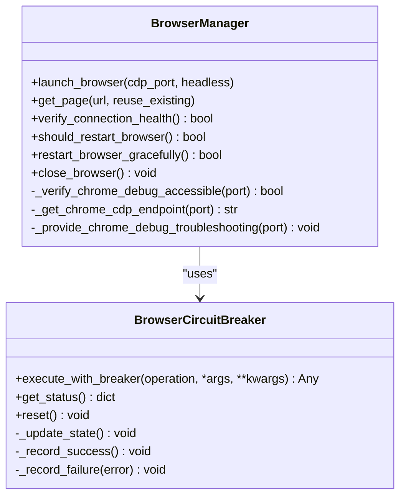
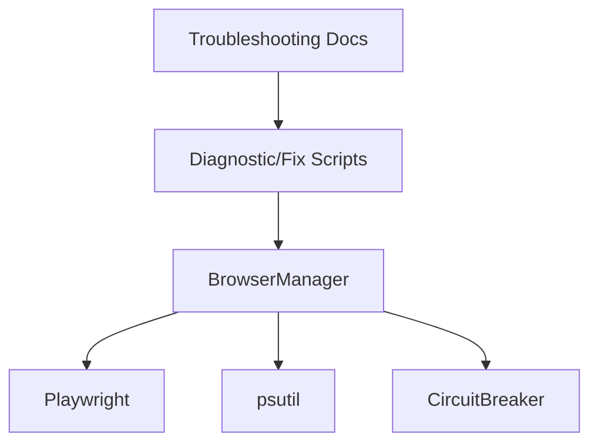

# Chrome Debug Port Issues

<cite>
**Referenced Files in This Document**
- [CHROME_CDP_CONNECTIVITY_TROUBLESHOOTING_REPORT.md](file://CHROME_CDP_CONNECTIVITY_TROUBLESHOOTING_REPORT.md)
- [chrome_cdp_diagnostic.py](file://chrome_cdp_diagnostic.py)
- [chrome_cdp_diagnostic_fix.py](file://chrome_cdp_diagnostic_fix.py)
- [chrome_cdp_final_fix.py](file://chrome_cdp_final_fix.py)
- [chrome_quick_fix.py](file://chrome_quick_fix.py)
- [utils/browser_manager.py](file://utils/browser_manager.py)
- [utils/browser_circuit_breaker.py](file://utils/browser_circuit_breaker.py)
- [WIKI REPO SEPT17/11. Troubleshooting Guide/11.1. Browser Issues/11.1.1. Connectivity Issues.md](file://WIKI REPO SEPT17/11. Troubleshooting Guide/11.1. Browser Issues/11.1.1. Connectivity Issues.md)
- [wiki-dec-3/11. Troubleshooting Guide/11.1. Browser Issues/11.1.1. Connectivity Issues.md](file://wiki-dec-3/11. Troubleshooting Guide/11.1. Browser Issues/11.1.1. Connectivity Issues.md)
</cite>

## Table of Contents
1. [Introduction](#introduction)
2. [Project Structure](#project-structure)
3. [Core Components](#core-components)
4. [Architecture Overview](#architecture-overview)
5. [Detailed Component Analysis](#detailed-component-analysis)
6. [Dependency Analysis](#dependency-analysis)
7. [Performance Considerations](#performance-considerations)
8. [Troubleshooting Guide](#troubleshooting-guide)
9. [Conclusion](#conclusion)

## Introduction
This document provides a comprehensive troubleshooting guide for Chrome debug port connectivity issues in the Amazon FBA Agent System. It focuses on diagnosing and resolving port binding conflicts, Chrome version compatibility problems (notably Chrome 139.x), and connection timeout errors. The guide includes step-by-step diagnostic commands, log analysis techniques, and automated verification scripts. Practical examples of common port-related errors—such as “Address already in use,” “Connection refused,” and “Port not available”—are explained alongside resolution strategies, including port switching, Chrome restart procedures, and system resource cleanup.

## Project Structure
The repository contains dedicated scripts and documentation for diagnosing and fixing Chrome CDP connectivity issues:
- Automated diagnostic and fix scripts for Chrome debug port problems
- Centralized browser management with robust connection handling and health checks
- Troubleshooting documentation covering port verification, endpoint testing, process conflicts, and version compatibility
- Circuit breaker integration to stabilize long-running browser sessions

**Diagram sources**
- [chrome_cdp_diagnostic.py](file://chrome_cdp_diagnostic.py#L1-L421)
- [chrome_cdp_diagnostic_fix.py](file://chrome_cdp_diagnostic_fix.py#L1-L215)
- [chrome_cdp_final_fix.py](file://chrome_cdp_final_fix.py#L1-L218)
- [chrome_quick_fix.py](file://chrome_quick_fix.py#L1-L124)
- [utils/browser_manager.py](file://utils/browser_manager.py#L1-L1153)
- [utils/browser_circuit_breaker.py](file://utils/browser_circuit_breaker.py#L1-L214)
- [WIKI REPO SEPT17/11. Troubleshooting Guide/11.1. Browser Issues/11.1.1. Connectivity Issues.md](file://WIKI REPO SEPT17/11. Troubleshooting Guide/11.1. Browser Issues/11.1.1. Connectivity Issues.md#L1-L230)

**Section sources**
- [WIKI REPO SEPT17/11. Troubleshooting Guide/11.1. Browser Issues/11.1.1. Connectivity Issues.md](file://WIKI REPO SEPT17/11. Troubleshooting Guide/11.1. Browser Issues/11.1.1. Connectivity Issues.md#L1-L230)
- [wiki-dec-3/11. Troubleshooting Guide/11.1. Browser Issues/11.1.1. Connectivity Issues.md](file://wiki-dec-3/11. Troubleshooting Guide/11.1. Browser Issues/11.1.1. Connectivity Issues.md#L1-L230)

## Core Components
- Chrome CDP diagnostic and fix scripts:
  - chrome_cdp_diagnostic.py: Automated diagnostic flow with endpoint testing and error handling
  - chrome_cdp_diagnostic_fix.py: JSON payload and debug endpoint test logic
  - chrome_cdp_final_fix.py: IPv4 binding fix, process cleanup, and Playwright validation
  - chrome_quick_fix.py: Minimal, repeatable fix steps for port 9222
- Browser management and resilience:
  - utils/browser_manager.py: Centralized connection handling, endpoint detection (IPv6/IPv4), health checks, and restart logic
  - utils/browser_circuit_breaker.py: Circuit breaker pattern to prevent cascading failures during long sessions

These components collectively enable systematic diagnosis, targeted fixes, and resilient runtime behavior for Chrome CDP connectivity.

**Section sources**
- [chrome_cdp_diagnostic.py](file://chrome_cdp_diagnostic.py#L1-L421)
- [chrome_cdp_diagnostic_fix.py](file://chrome_cdp_diagnostic_fix.py#L1-L215)
- [chrome_cdp_final_fix.py](file://chrome_cdp_final_fix.py#L1-L218)
- [chrome_quick_fix.py](file://chrome_quick_fix.py#L1-L124)
- [utils/browser_manager.py](file://utils/browser_manager.py#L1-L1153)
- [utils/browser_circuit_breaker.py](file://utils/browser_circuit_breaker.py#L1-L214)

## Architecture Overview
The Chrome CDP connectivity architecture integrates diagnostic scripts, a central browser manager, and a circuit breaker to maintain stability during long-running operations. The browser manager connects to an existing Chrome instance (debug port) and validates endpoints, while the scripts provide automated verification and remediation.

**Diagram sources**
- [chrome_cdp_diagnostic.py](file://chrome_cdp_diagnostic.py#L1-L421)
- [chrome_cdp_final_fix.py](file://chrome_cdp_final_fix.py#L1-L218)
- [utils/browser_manager.py](file://utils/browser_manager.py#L77-L140)
- [utils/browser_circuit_breaker.py](file://utils/browser_circuit_breaker.py#L72-L111)

## Detailed Component Analysis

### Diagnostic and Fix Scripts
- chrome_cdp_diagnostic.py
  - Implements automated diagnostic flow with endpoint testing and error handling for connection errors, timeouts, and HTTP response issues
  - Provides structured output to pinpoint failure points in the CDP chain
- chrome_cdp_diagnostic_fix.py
  - Contains JSON payload and debug endpoint test logic
  - Validates connectivity and returns status for further action
- chrome_cdp_final_fix.py
  - Forces IPv4 binding for Chrome 139.x compatibility
  - Terminates conflicting browser processes, starts Chrome with specific flags, and validates Playwright CDP connection
  - Updates system configuration for future compatibility
- chrome_quick_fix.py
  - Executes minimal, repeatable steps: kill Chrome processes, verify port 9222, create profile directory, start Chrome with debug flags, wait, and test endpoint

**Diagram sources**
- [chrome_cdp_diagnostic.py](file://chrome_cdp_diagnostic.py#L1-L421)
- [chrome_cdp_final_fix.py](file://chrome_cdp_final_fix.py#L1-L218)
- [chrome_quick_fix.py](file://chrome_quick_fix.py#L1-L124)

**Section sources**
- [chrome_cdp_diagnostic.py](file://chrome_cdp_diagnostic.py#L1-L421)
- [chrome_cdp_diagnostic_fix.py](file://chrome_cdp_diagnostic_fix.py#L1-L215)
- [chrome_cdp_final_fix.py](file://chrome_cdp_final_fix.py#L1-L218)
- [chrome_quick_fix.py](file://chrome_quick_fix.py#L1-L124)

### Browser Manager and Circuit Breaker
- utils/browser_manager.py
  - Connects to an existing Chrome instance via CDP (debug port), with IPv6/IPv4 endpoint detection
  - Provides health checks, memory monitoring, and restart logic to maintain stability
  - Implements fallback to bundled Chromium when CDP fails
- utils/browser_circuit_breaker.py
  - Enforces failure thresholds and recovery timeouts to prevent cascading failures
  - Integrates with browser operations to protect against prolonged instability

**Diagram sources**
- [utils/browser_manager.py](file://utils/browser_manager.py#L35-L140)
- [utils/browser_circuit_breaker.py](file://utils/browser_circuit_breaker.py#L37-L111)

**Section sources**
- [utils/browser_manager.py](file://utils/browser_manager.py#L1-L1153)
- [utils/browser_circuit_breaker.py](file://utils/browser_circuit_breaker.py#L1-L214)

## Dependency Analysis
The diagnostic and fix scripts depend on the browser manager for connection validation and on the circuit breaker for resilience. The browser manager itself depends on Playwright and system utilities for process and memory monitoring.

**Diagram sources**
- [chrome_cdp_diagnostic.py](file://chrome_cdp_diagnostic.py#L1-L421)
- [chrome_cdp_final_fix.py](file://chrome_cdp_final_fix.py#L1-L218)
- [utils/browser_manager.py](file://utils/browser_manager.py#L1-L1153)
- [utils/browser_circuit_breaker.py](file://utils/browser_circuit_breaker.py#L1-L214)
- [WIKI REPO SEPT17/11. Troubleshooting Guide/11.1. Browser Issues/11.1.1. Connectivity Issues.md](file://WIKI REPO SEPT17/11. Troubleshooting Guide/11.1. Browser Issues/11.1.1. Connectivity Issues.md#L1-L230)

**Section sources**
- [utils/browser_manager.py](file://utils/browser_manager.py#L1-L1153)
- [utils/browser_circuit_breaker.py](file://utils/browser_circuit_breaker.py#L1-L214)
- [WIKI REPO SEPT17/11. Troubleshooting Guide/11.1. Browser Issues/11.1.1. Connectivity Issues.md](file://WIKI REPO SEPT17/11. Troubleshooting Guide/11.1. Browser Issues/11.1.1. Connectivity Issues.md#L1-L230)

## Performance Considerations
- Connection timeouts and retries: The browser manager progressively increases timeout and slow motion settings for Chrome 139.x compatibility to improve reliability
- Memory monitoring: Periodic checks and cleanup prevent resource exhaustion during long-running sessions
- Circuit breaker: Limits cascading failures by temporarily blocking operations after threshold failures, with controlled recovery

[No sources needed since this section provides general guidance]

## Troubleshooting Guide

### Step-by-Step Diagnostic Commands
- Verify Chrome debug port status:
  - netstat -an | findstr :9222
  - Expected: TCP 127.0.0.1:9222 LISTENING
- Test HTTP endpoint responsiveness:
  - curl http://localhost:9222/json/version
  - Successful response indicates a fully functional CDP interface
- Resolve process conflicts:
  - netstat -ano | findstr :9222
  - taskkill /PID <process_id> /F
  - Or kill all Chromium-based browsers:
    - taskkill /f /im chrome.exe
    - taskkill /f /im msedge.exe
    - taskkill /f /im comet.exe
    - taskkill /f /im chromium.exe
- Address Chrome version compatibility (Chrome 139.x):
  - Start Chrome with forced IPv4 binding:
    - chrome.exe --remote-debugging-port=9222 --remote-debugging-address=127.0.0.1 --user-data-dir=C:\ChromeDebugProfile
- Validate CDP connectivity:
  - python test_cdp_fix.py

**Section sources**
- [WIKI REPO SEPT17/11. Troubleshooting Guide/11.1. Browser Issues/11.1.1. Connectivity Issues.md](file://WIKI REPO SEPT17/11. Troubleshooting Guide/11.1. Browser Issues/11.1.1. Connectivity Issues.md#L28-L218)
- [wiki-dec-3/11. Troubleshooting Guide/11.1. Browser Issues/11.1.1. Connectivity Issues.md](file://wiki-dec-3/11. Troubleshooting Guide/11.1. Browser Issues/11.1.1. Connectivity Issues.md#L28-L218)

### Log Analysis Techniques
- Use the diagnostic scripts’ structured output to identify:
  - Port binding conflicts (“Address already in use”)
  - HTTP endpoint failures (“Connection refused”)
  - Timeout errors (“Port not available”)
- Monitor browser manager logs for:
  - Connection health checks
  - Memory usage trends
  - Restart triggers and reasons

**Section sources**
- [chrome_cdp_diagnostic.py](file://chrome_cdp_diagnostic.py#L1-L421)
- [utils/browser_manager.py](file://utils/browser_manager.py#L566-L656)

### Automated Verification Scripts
- chrome_cdp_diagnostic.py: Automated diagnostic flow with endpoint testing and error handling
- chrome_cdp_final_fix.py: Complete fix including process cleanup, IPv4 binding, endpoint testing, and configuration updates
- chrome_quick_fix.py: Minimal, repeatable steps for port 9222

**Section sources**
- [chrome_cdp_diagnostic.py](file://chrome_cdp_diagnostic.py#L1-L421)
- [chrome_cdp_final_fix.py](file://chrome_cdp_final_fix.py#L1-L218)
- [chrome_quick_fix.py](file://chrome_quick_fix.py#L1-L124)

### Common Port-Related Errors and Resolutions
- “Address already in use”
  - Cause: Another process binds to port 9222
  - Resolution: Kill conflicting processes and restart Chrome with debug flags
- “Connection refused”
  - Cause: No process actively listens on the port
  - Resolution: Ensure Chrome is started with debug flags and verify endpoint accessibility
- “Port not available”
  - Cause: Binding conflicts or system-level restrictions
  - Resolution: Force IPv4 binding for Chrome 139.x and validate with curl

**Section sources**
- [WIKI REPO SEPT17/11. Troubleshooting Guide/11.1. Browser Issues/11.1.1. Connectivity Issues.md](file://WIKI REPO SEPT17/11. Troubleshooting Guide/11.1. Browser Issues/11.1.1. Connectivity Issues.md#L60-L154)
- [wiki-dec-3/11. Troubleshooting Guide/11.1. Browser Issues/11.1.1. Connectivity Issues.md](file://wiki-dec-3/11. Troubleshooting Guide/11.1. Browser Issues/11.1.1. Connectivity Issues.md#L60-L154)

### Resolution Strategies
- Port switching: Use a different debug port and update environment variables accordingly
- Chrome restart procedures: Kill all browser processes, wait for OS to release the port, then start Chrome with debug flags
- System resource cleanup: Monitor memory usage, trigger cleanup when thresholds are exceeded, and restart browser periodically

**Section sources**
- [utils/browser_manager.py](file://utils/browser_manager.py#L884-L938)
- [utils/browser_manager.py](file://utils/browser_manager.py#L940-L977)
- [utils/browser_manager.py](file://utils/browser_manager.py#L985-L1018)

## Conclusion
By combining automated diagnostic scripts, a robust browser manager with health checks, and a circuit breaker for resilience, the Amazon FBA Agent System provides a comprehensive approach to resolving Chrome debug port connectivity issues. The troubleshooting guide outlines actionable steps for diagnosing port binding conflicts, addressing Chrome version compatibility (especially Chrome 139.x), and validating fixes. Operators can rely on structured commands, log analysis, and automated verification to quickly restore and maintain stable CDP connectivity.