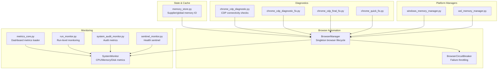
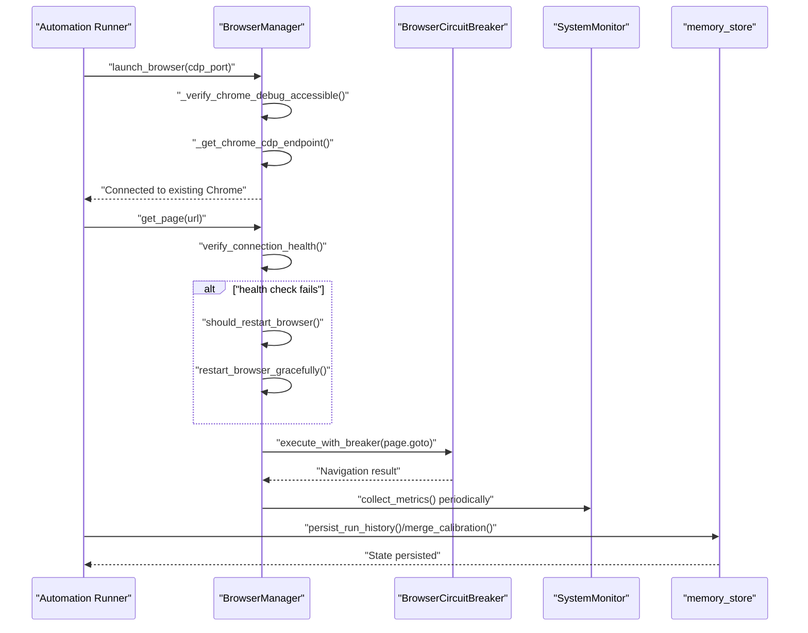
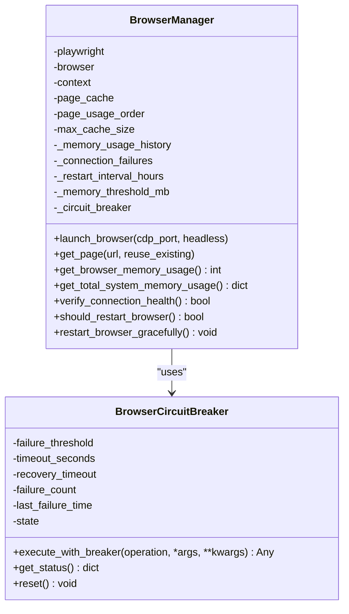
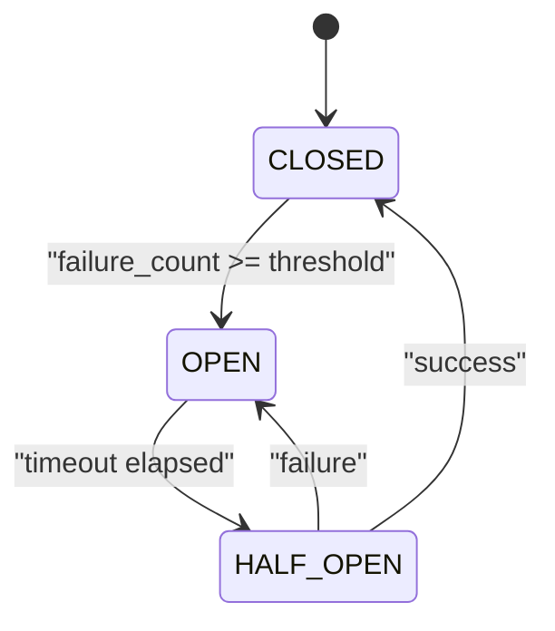
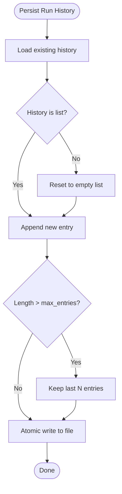
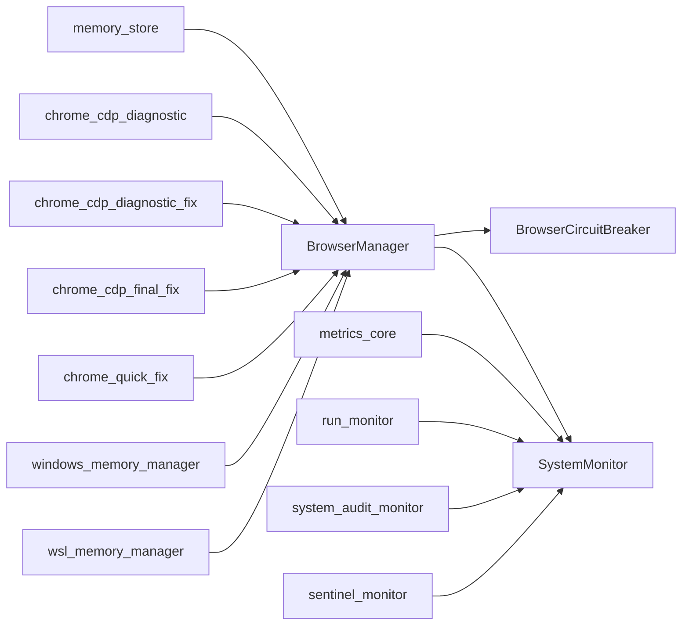

# Memory Management Issues

<cite>
**Referenced Files in This Document**
- [enhanced_memory_fix.py](file://enhanced_memory_fix.py)
- [memory_store.py](file://src/fba_agent/memory_store.py)
- [browser_manager.py](file://utils/browser_manager.py)
- [browser_circuit_breaker.py](file://utils/browser_circuit_breaker.py)
- [system_monitor.py](file://tools/system_monitor.py)
- [metrics_core.py](file://dashboard/metrics_core.py)
- [SMART_MEMORY_MANAGEMENT_TECHNICAL_GUIDE.md](file://docs/SMART_MEMORY_MANAGEMENT_TECHNICAL_GUIDE.md)
- [chrome_cdp_diagnostic.py](file://chrome_cdp_diagnostic.py)
- [chrome_cdp_diagnostic_fix.py](file://chrome_cdp_diagnostic_fix.py)
- [chrome_cdp_final_fix.py](file://chrome_cdp_final_fix.py)
- [chrome_quick_fix.py](file://chrome_quick_fix.py)
- [run_monitor.py](file://tools/run_monitor.py)
- [system_audit_monitor.py](file://tools/system_audit_monitor.py)
- [sentinel_monitor.py](file://utils/sentinel_monitor.py)
- [windows_memory_manager.py](file://utils/windows_memory_manager.py)
- [wsl_memory_manager.py](file://utils/wsl_memory_manager.py)
</cite>

## Table of Contents
1. [Introduction](#introduction)
2. [Project Structure](#project-structure)
3. [Core Components](#core-components)
4. [Architecture Overview](#architecture-overview)
5. [Detailed Component Analysis](#detailed-component-analysis)
6. [Dependency Analysis](#dependency-analysis)
7. [Performance Considerations](#performance-considerations)
8. [Troubleshooting Guide](#troubleshooting-guide)
9. [Conclusion](#conclusion)
10. [Appendices](#appendices)

## Introduction
This document focuses on diagnosing and resolving memory management issues in the Chrome browser automation subsystem. It covers:
- Identifying memory leaks, excessive memory consumption, and browser instance accumulation
- Monitoring Chrome process memory usage and detecting leak patterns
- Analyzing state persistence issues and cache strategies
- Practical examples of symptoms such as increasing RAM usage, browser crashes, and performance degradation over time
- Resolution strategies including memory cleanup, browser instance recycling, and state file optimization
- Automated monitoring scripts and manual inspection techniques

## Project Structure
The memory management and monitoring capabilities are distributed across several modules:
- Browser lifecycle and memory monitoring: BrowserManager, BrowserCircuitBreaker
- State and cache persistence: memory_store
- System-wide metrics and monitoring: SystemMonitor, metrics_core
- Diagnostic utilities: chrome_cdp_diagnostic family, run_monitor, system_audit_monitor, sentinel_monitor
- Platform-specific memory managers: windows_memory_manager, wsl_memory_manager

**Diagram sources**
- [browser_manager.py](file://utils/browser_manager.py#L35-L120)
- [browser_circuit_breaker.py](file://utils/browser_circuit_breaker.py#L37-L71)
- [memory_store.py](file://src/fba_agent/memory_store.py#L25-L44)
- [system_monitor.py](file://tools/system_monitor.py#L34-L85)
- [metrics_core.py](file://dashboard/metrics_core.py#L15-L33)
- [chrome_cdp_diagnostic.py](file://chrome_cdp_diagnostic.py)
- [chrome_cdp_diagnostic_fix.py](file://chrome_cdp_diagnostic_fix.py)
- [chrome_cdp_final_fix.py](file://chrome_cdp_final_fix.py)
- [chrome_quick_fix.py](file://chrome_quick_fix.py)
- [run_monitor.py](file://tools/run_monitor.py)
- [system_audit_monitor.py](file://tools/system_audit_monitor.py)
- [sentinel_monitor.py](file://utils/sentinel_monitor.py)
- [windows_memory_manager.py](file://utils/windows_memory_manager.py)
- [wsl_memory_manager.py](file://utils/wsl_memory_manager.py)

**Section sources**
- [browser_manager.py](file://utils/browser_manager.py#L35-L120)
- [memory_store.py](file://src/fba_agent/memory_store.py#L25-L44)
- [system_monitor.py](file://tools/system_monitor.py#L34-L85)
- [metrics_core.py](file://dashboard/metrics_core.py#L15-L33)

## Core Components
- BrowserManager: Centralized singleton managing a persistent Chrome CDP connection, page caching, and health monitoring. It tracks memory usage history and enforces periodic restarts to prevent accumulation.
- BrowserCircuitBreaker: Implements a circuit breaker to prevent cascading failures during extended runs by temporarily blocking operations after repeated failures.
- memory_store: Provides structured IO for supplier and global memory artifacts (calibration, run history, trap libraries), enabling safe persistence and retrieval.
- SystemMonitor: Collects and persists system metrics (CPU, memory, disk, tasks) for trend analysis and health reporting.
- metrics_core: Loads and aggregates metrics from state, linking maps, financial reports, caches, and logs for dashboard consumption.
- chrome_cdp_diagnostic family: Connectivity and protocol detection utilities for Chrome debugging port and CDP compatibility.
- Platform memory managers: Helpers for Windows and WSL memory management behaviors.

**Section sources**
- [browser_manager.py](file://utils/browser_manager.py#L35-L120)
- [browser_circuit_breaker.py](file://utils/browser_circuit_breaker.py#L37-L71)
- [memory_store.py](file://src/fba_agent/memory_store.py#L104-L131)
- [system_monitor.py](file://tools/system_monitor.py#L34-L85)
- [metrics_core.py](file://dashboard/metrics_core.py#L602-L615)

## Architecture Overview
The memory management architecture integrates browser lifecycle control, health monitoring, and state persistence to mitigate long-running automation risks.

**Diagram sources**
- [browser_manager.py](file://utils/browser_manager.py#L77-L140)
- [browser_manager.py](file://utils/browser_manager.py#L141-L198)
- [browser_circuit_breaker.py](file://utils/browser_circuit_breaker.py#L72-L111)
- [system_monitor.py](file://tools/system_monitor.py#L48-L85)
- [memory_store.py](file://src/fba_agent/memory_store.py#L104-L131)

## Detailed Component Analysis

### BrowserManager: Memory-Aware Browser Lifecycle
Key responsibilities:
- Single persistent Chrome CDP connection with health checks
- Page caching with bounded size and eviction
- Memory usage tracking and history
- Periodic restart thresholds to prevent resource exhaustion
- IPv6/IPv4 endpoint selection for Chrome 139+ compatibility

Diagnostic indicators:
- Memory usage history growth suggests accumulation or leaks
- Frequent restarts indicate instability or resource pressure
- Navigation failures under circuit breaker suggest degraded state

Resolution strategies:
- Enforce restart cadence based on memory thresholds
- Limit cached pages and evict aggressively when memory pressure is detected
- Use circuit breaker around navigation to prevent cascading failures

**Diagram sources**
- [browser_manager.py](file://utils/browser_manager.py#L35-L120)
- [browser_manager.py](file://utils/browser_manager.py#L658-L720)
- [browser_circuit_breaker.py](file://utils/browser_circuit_breaker.py#L37-L71)

**Section sources**
- [browser_manager.py](file://utils/browser_manager.py#L35-L120)
- [browser_manager.py](file://utils/browser_manager.py#L658-L720)
- [browser_manager.py](file://utils/browser_manager.py#L721-L800)
- [browser_circuit_breaker.py](file://utils/browser_circuit_breaker.py#L37-L71)

### BrowserCircuitBreaker: Failure Containment
Purpose:
- Prevent cascading failures by blocking operations after repeated failures
- Provide recovery timeouts and half-open testing

Operational states:
- CLOSED: Normal operation
- OPEN: Temporarily block operations
- HALF_OPEN: Test recovery with limited operations

**Diagram sources**
- [browser_circuit_breaker.py](file://utils/browser_circuit_breaker.py#L112-L133)
- [browser_circuit_breaker.py](file://utils/browser_circuit_breaker.py#L147-L165)

**Section sources**
- [browser_circuit_breaker.py](file://utils/browser_circuit_breaker.py#L72-L111)
- [browser_circuit_breaker.py](file://utils/browser_circuit_breaker.py#L174-L184)

### memory_store: State Persistence and Cache IO
Responsibilities:
- Supplier and global memory path resolution
- Safe loading of JSON/JSONL artifacts
- Atomic persistence of run history and calibration
- Merge precedence for calibration and traps

Memory implications:
- Large JSON arrays in caches can inflate memory
- Frequent writes increase disk IO pressure
- Proper merging avoids redundant recalculations

**Diagram sources**
- [memory_store.py](file://src/fba_agent/memory_store.py#L104-L131)

**Section sources**
- [memory_store.py](file://src/fba_agent/memory_store.py#L25-L44)
- [memory_store.py](file://src/fba_agent/memory_store.py#L104-L131)
- [memory_store.py](file://src/fba_agent/memory_store.py#L146-L236)
- [memory_store.py](file://src/fba_agent/memory_store.py#L239-L248)

### SystemMonitor: Continuous System Metrics
Capabilities:
- Periodic collection of CPU, memory, disk usage
- Active task and error counters
- Aggregated health reports and performance summaries

Use cases:
- Detect rising memory usage trends
- Correlate errors with resource spikes
- Generate periodic health snapshots

**Section sources**
- [system_monitor.py](file://tools/system_monitor.py#L48-L85)
- [system_monitor.py](file://tools/system_monitor.py#L119-L180)

### metrics_core: Metrics Loader for Dashboards
Features:
- Robust file path resolution for state, linking maps, financial reports, logs, caches
- Chunked and streaming JSON processing for large files
- Column inference for ROI/profit metrics
- Latest-file selection for financial reports

Memory impact:
- Efficient streaming reduces peak memory for large JSON arrays
- Tail-log reading avoids loading entire log archives

**Section sources**
- [metrics_core.py](file://dashboard/metrics_core.py#L34-L142)
- [metrics_core.py](file://dashboard/metrics_core.py#L457-L515)
- [metrics_core.py](file://dashboard/metrics_core.py#L331-L424)

### Chrome CDP Diagnostics: Connectivity and Protocol Detection
Functions:
- Endpoint detection (IPv6/IPv4) for Chrome 139+
- Protocol version detection and compatibility modes
- Enhanced troubleshooting guidance for connection failures

Impact:
- Ensures stable CDP connections to prevent automation stalls
- Reduces memory pressure from failed retries and unstable sessions

**Section sources**
- [chrome_cdp_diagnostic.py](file://chrome_cdp_diagnostic.py)
- [chrome_cdp_diagnostic_fix.py](file://chrome_cdp_diagnostic_fix.py)
- [chrome_cdp_final_fix.py](file://chrome_cdp_final_fix.py)
- [chrome_cdp_diagnostic.py](file://chrome_cdp_diagnostic.py#L273-L301)
- [chrome_cdp_diagnostic.py](file://chrome_cdp_diagnostic.py#L477-L513)

### Platform Memory Managers: Windows and WSL
- windows_memory_manager.py: Windows-specific memory detection and process enumeration
- wsl_memory_manager.py: WSL-specific memory management behaviors

These modules complement BrowserManager’s memory detection and help tailor monitoring to the runtime environment.

**Section sources**
- [windows_memory_manager.py](file://utils/windows_memory_manager.py)
- [wsl_memory_manager.py](file://utils/wsl_memory_manager.py)

## Dependency Analysis
The following diagram highlights key dependencies among memory-critical components.

**Diagram sources**
- [browser_manager.py](file://utils/browser_manager.py#L35-L120)
- [browser_circuit_breaker.py](file://utils/browser_circuit_breaker.py#L37-L71)
- [memory_store.py](file://src/fba_agent/memory_store.py#L104-L131)
- [system_monitor.py](file://tools/system_monitor.py#L34-L85)
- [metrics_core.py](file://dashboard/metrics_core.py#L602-L615)
- [chrome_cdp_diagnostic.py](file://chrome_cdp_diagnostic.py)
- [chrome_cdp_diagnostic_fix.py](file://chrome_cdp_diagnostic_fix.py)
- [chrome_cdp_final_fix.py](file://chrome_cdp_final_fix.py)
- [chrome_quick_fix.py](file://chrome_quick_fix.py)
- [windows_memory_manager.py](file://utils/windows_memory_manager.py)
- [wsl_memory_manager.py](file://utils/wsl_memory_manager.py)

**Section sources**
- [browser_manager.py](file://utils/browser_manager.py#L35-L120)
- [browser_circuit_breaker.py](file://utils/browser_circuit_breaker.py#L37-L71)
- [memory_store.py](file://src/fba_agent/memory_store.py#L104-L131)
- [system_monitor.py](file://tools/system_monitor.py#L34-L85)
- [metrics_core.py](file://dashboard/metrics_core.py#L602-L615)

## Performance Considerations
- Prefer single-page mode and bounded page cache to reduce memory footprint.
- Use circuit breaker around expensive operations to prevent cascading failures.
- Persist state frequently and cap retention to limit in-memory accumulation.
- Stream large JSON files to avoid peak memory spikes.
- Monitor system metrics continuously and correlate with automation stages.

[No sources needed since this section provides general guidance]

## Troubleshooting Guide

### Symptoms and Indicators
- Increasing RAM usage over time
- Browser crashes or automation stalls
- Slower processing times and higher error rates
- Elevated memory usage reported by SystemMonitor
- Frequent browser restarts triggered by BrowserManager

### Diagnostic Procedures
1. Monitor system metrics
   - Use SystemMonitor to collect CPU, memory, and disk usage
   - Generate health reports and performance summaries
   - Correlate spikes with automation stages

2. Inspect browser memory usage
   - Use BrowserManager’s memory APIs to track Chrome process memory
   - Review memory usage history and thresholds

3. Validate CDP connectivity
   - Run Chrome CDP diagnostic scripts to confirm endpoint accessibility
   - Check protocol version and compatibility modes

4. Analyze state persistence
   - Verify run history and calibration persistence
   - Confirm atomic writes and retention limits

5. Manual inspection techniques
   - Inspect state files and cache counts via metrics_core
   - Tail logs for recent errors and patterns
   - Cross-reference with system audit metrics

### Automated Monitoring Scripts
- SystemMonitor: Start continuous monitoring and generate periodic reports
- run_monitor: Orchestrates run-level metrics collection
- system_audit_monitor: Aggregates audit metrics for long-term trends
- sentinel_monitor: Health sentinel for proactive alerts

**Section sources**
- [system_monitor.py](file://tools/system_monitor.py#L48-L85)
- [system_monitor.py](file://tools/system_monitor.py#L119-L180)
- [run_monitor.py](file://tools/run_monitor.py)
- [system_audit_monitor.py](file://tools/system_audit_monitor.py)
- [sentinel_monitor.py](file://utils/sentinel_monitor.py)

### Resolution Strategies
- Memory cleanup procedures
  - Enforce frequent cache saves and sliding window eviction
  - Trigger garbage collection after significant clearing
  - Reduce page cache size and enforce stricter eviction

- Browser instance recycling
  - Set restart intervals based on memory thresholds
  - Gracefully restart browser when health checks fail
  - Use circuit breaker to prevent failing operations

- State file optimization
  - Persist run history with capped entries
  - Merge calibration with strict precedence to avoid duplication
  - Stream large JSON arrays to reduce memory usage

- Platform-specific tuning
  - Use Windows memory manager for accurate process detection
  - Leverage WSL memory manager for WSL environments

**Section sources**
- [enhanced_memory_fix.py](file://enhanced_memory_fix.py#L2-L60)
- [browser_manager.py](file://utils/browser_manager.py#L658-L720)
- [browser_manager.py](file://utils/browser_manager.py#L721-L800)
- [memory_store.py](file://src/fba_agent/memory_store.py#L104-L131)
- [memory_store.py](file://src/fba_agent/memory_store.py#L146-L236)
- [windows_memory_manager.py](file://utils/windows_memory_manager.py)
- [wsl_memory_manager.py](file://utils/wsl_memory_manager.py)

## Conclusion
Effective memory management in Chrome automation requires a combination of:
- Robust browser lifecycle control with health monitoring
- Failure containment via circuit breakers
- Efficient state persistence and cache strategies
- Continuous system metrics and diagnostics
- Platform-aware memory management

By applying the diagnostic procedures and resolution strategies outlined above, teams can reliably detect and mitigate memory leaks, excessive consumption, and browser instance accumulation in long-running automation scenarios.

[No sources needed since this section summarizes without analyzing specific files]

## Appendices

### Practical Examples of Memory-Related Symptoms
- Increasing RAM usage over time indicates accumulating state or unreleased resources
- Browser crashes often signal resource exhaustion or unstable CDP connections
- Performance degradation correlates with growing memory pressure and reduced throughput

### Memory Management Best Practices
- Keep page cache bounded and evict aggressively under pressure
- Persist state frequently with capped retention
- Use circuit breaker around navigation and other expensive operations
- Stream large JSON files and avoid loading entire datasets into memory
- Monitor system metrics continuously and act on early warning signs

[No sources needed since this section provides general guidance]