# Performance Optimization

<cite>
**Referenced Files in This Document**
- [utils/browser_manager.py](file://utils/browser_manager.py)
- [utils/browser_circuit_breaker.py](file://utils/browser_circuit_breaker.py)
- [config/system_config.json](file://config/system_config.json)
- [tools/run_monitor.py](file://tools/run_monitor.py)
- [tools/system_monitor.py](file://tools/system_monitor.py)
- [dashboard/metrics_core.py](file://dashboard/metrics_core.py)
- [dashboard/run_dashboard.py](file://dashboard/run_dashboard.py)
- [utils/sentinel_monitor.py](file://utils/sentinel_monitor.py)
- [repowiki 12 dec & 20 jan\en\content\Troubleshooting Guide\Performance Optimization\Performance Optimization.md](file://repowiki 12 dec & 20 jan\en\content\Troubleshooting Guide\Performance Optimization\Performance Optimization.md)
- [repowiki 12 dec & 20 jan\en\content\Browser Automation\Browser Management.md](file://repowiki 12 dec & 20 jan\en\content\Browser Automation\Browser Management.md)
- [repowiki 12 dec & 20 jan\en\content\Browser Automation\Browser Automation.md](file://repowiki 12 dec & 20 jan\en\content\Browser Automation\Browser Automation.md)
- [wiki-dec-3\11. Troubleshooting Guide\11.1. Browser Issues\11.1.3. Performance And Stability.md](file://wiki-dec-3\11. Troubleshooting Guide\11.1. Browser Issues\11.1.3. Performance And Stability.md)
- [wiki-dec-3\3. Core Architecture\3.3. Browser Manager.md](file://wiki-dec-3\3. Core Architecture\3.3. Browser Manager.md)
- [WIKI REPO SEPT17\12. Supplier Integration Guide\12.1. Supplier Configuration\12.1.4. Limiter Configuration.md](file://WIKI REPO SEPT17\12. Supplier Integration Guide\12.1. Supplier Configuration\12.1.4. Limiter Configuration.md)
- [MASTER_ISSUE_RESOLUTION_DOCUMENTATION.md](file://MASTER_ISSUE_RESOLUTION_DOCUMENTATION.md)
</cite>

## Table of Contents
1. [Introduction](#introduction)
2. [Project Structure](#project-structure)
3. [Core Components](#core-components)
4. [Architecture Overview](#architecture-overview)
5. [Detailed Component Analysis](#detailed-component-analysis)
6. [Dependency Analysis](#dependency-analysis)
7. [Performance Considerations](#performance-considerations)
8. [Troubleshooting Guide](#troubleshooting-guide)
9. [Conclusion](#conclusion)
10. [Appendices](#appendices)

## Introduction
This document provides a comprehensive performance troubleshooting and optimization guide for Chrome browser automation in the Amazon FBA Agent System. It focuses on identifying bottlenecks, reducing page load times, minimizing resource consumption, and maintaining long-running stability. It covers diagnostic procedures, automated monitoring, manual profiling techniques, and benchmarking. Practical optimization strategies include browser caching, page rendering tuning, concurrency limits, and memory management.

## Project Structure
The performance-critical subsystems are organized around:
- Centralized browser management with caching and health monitoring
- Circuit breaker for resilience during extended sessions
- System-wide configuration controlling concurrency, timeouts, and rate limiting
- Automated telemetry and dashboards for runtime observability
- Supplier-specific optimization guidance for pagination and product density

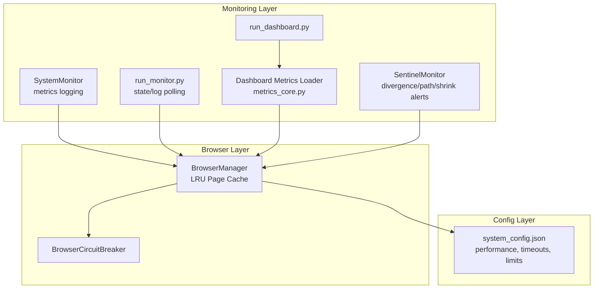

**Diagram sources**
- [utils/browser_manager.py](file://utils/browser_manager.py#L35-L120)
- [utils/browser_circuit_breaker.py](file://utils/browser_circuit_breaker.py#L37-L70)
- [config/system_config.json](file://config/system_config.json#L139-L163)
- [tools/system_monitor.py](file://tools/system_monitor.py#L34-L85)
- [tools/run_monitor.py](file://tools/run_monitor.py#L51-L96)
- [dashboard/metrics_core.py](file://dashboard/metrics_core.py#L15-L33)
- [dashboard/run_dashboard.py](file://dashboard/run_dashboard.py#L90-L166)
- [utils/sentinel_monitor.py](file://utils/sentinel_monitor.py#L63-L110)

**Section sources**
- [utils/browser_manager.py](file://utils/browser_manager.py#L1-L120)
- [config/system_config.json](file://config/system_config.json#L139-L163)
- [tools/system_monitor.py](file://tools/system_monitor.py#L34-L85)
- [tools/run_monitor.py](file://tools/run_monitor.py#L51-L96)
- [dashboard/metrics_core.py](file://dashboard/metrics_core.py#L15-L33)
- [dashboard/run_dashboard.py](file://dashboard/run_dashboard.py#L90-L166)
- [utils/sentinel_monitor.py](file://utils/sentinel_monitor.py#L63-L110)

## Core Components
- BrowserManager: Singleton browser controller with LRU page caching, connection health checks, memory tracking, and restart policies. It connects to an existing Chrome instance via CDP and enforces stability and resource limits.
- BrowserCircuitBreaker: Implements the circuit breaker pattern to prevent cascading failures during long sessions, with configurable thresholds and recovery states.
- system_config.json: Central configuration for performance, concurrency, timeouts, rate limiting, and memory thresholds.
- SystemMonitor: Periodic collection of system metrics (CPU, memory, disk, tasks) and error logging for health reporting.
- run_monitor.py: Continuous polling of state and logs for runtime diagnostics.
- metrics_core.py: Dashboard-side loader for processing state, linking maps, financial reports, caches, and logs with chunked and robust parsing.
- SentinelMonitor: Lightweight runtime sentinel that detects divergence, path variants, shrinking link maps, and save retries.

**Section sources**
- [utils/browser_manager.py](file://utils/browser_manager.py#L35-L120)
- [utils/browser_circuit_breaker.py](file://utils/browser_circuit_breaker.py#L37-L70)
- [config/system_config.json](file://config/system_config.json#L139-L163)
- [tools/system_monitor.py](file://tools/system_monitor.py#L34-L85)
- [tools/run_monitor.py](file://tools/run_monitor.py#L51-L96)
- [dashboard/metrics_core.py](file://dashboard/metrics_core.py#L15-L33)
- [utils/sentinel_monitor.py](file://utils/sentinel_monitor.py#L63-L110)

## Architecture Overview
The system integrates browser automation with resilient runtime controls and observability.

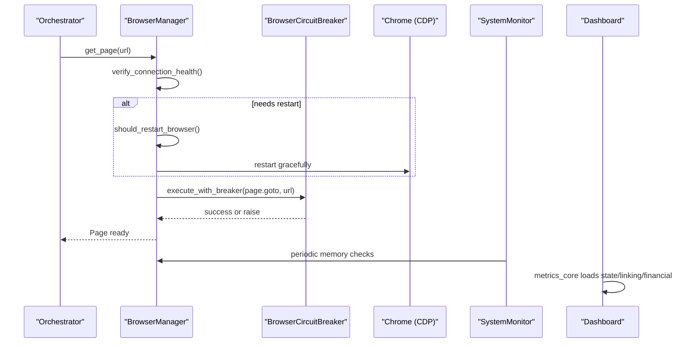

**Diagram sources**
- [utils/browser_manager.py](file://utils/browser_manager.py#L141-L198)
- [utils/browser_circuit_breaker.py](file://utils/browser_circuit_breaker.py#L72-L111)
- [tools/system_monitor.py](file://tools/system_monitor.py#L48-L85)
- [dashboard/metrics_core.py](file://dashboard/metrics_core.py#L602-L615)

## Detailed Component Analysis

### BrowserManager: Caching, Health, and Restart Policies
- LRU Page Cache: Maintains a bounded cache of pages to reduce repeated navigations. The cache size and eviction policy directly impact memory footprint and navigation latency.
- Connection Health: Periodic checks and memory history tracking enable proactive restarts before failures.
- Restart Policy: Time-based (every ~2.5 hours) and memory-based (Python/Node.js thresholds) restarts improve long-running stability.
- CDP Compatibility: Dual-stack endpoint selection (IPv6/IPv4) and enhanced compatibility modes for newer Chrome versions.

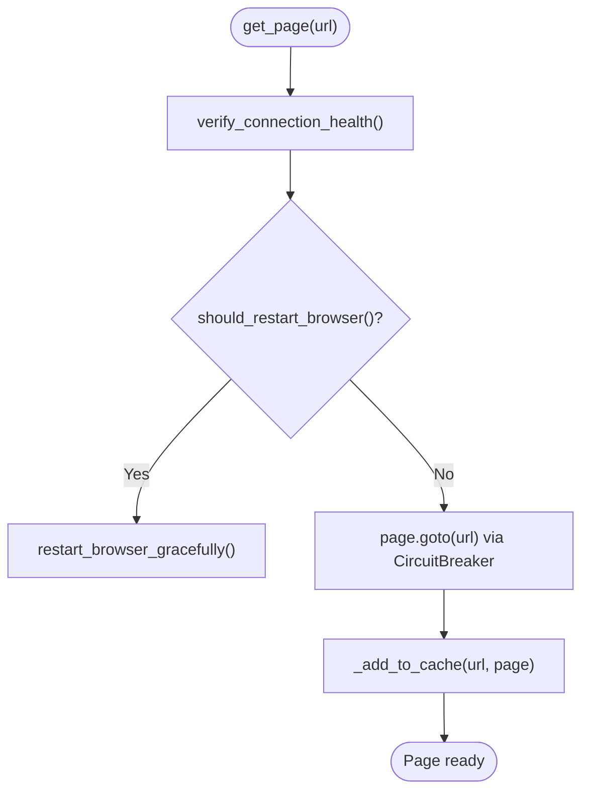

**Diagram sources**
- [utils/browser_manager.py](file://utils/browser_manager.py#L141-L208)

**Section sources**
- [utils/browser_manager.py](file://utils/browser_manager.py#L54-L68)
- [utils/browser_manager.py](file://utils/browser_manager.py#L658-L719)
- [utils/browser_manager.py](file://utils/browser_manager.py#L721-L800)
- [utils/browser_manager.py](file://utils/browser_manager.py#L375-L397)
- [utils/browser_manager.py](file://utils/browser_manager.py#L477-L542)

### BrowserCircuitBreaker: Resilience During Extended Sessions
- States: CLOSED → OPEN → HALF_OPEN → CLOSED
- Thresholds: Configurable failure count and timeout for recovery
- Integration: Wraps navigation and other critical operations to prevent cascading failures

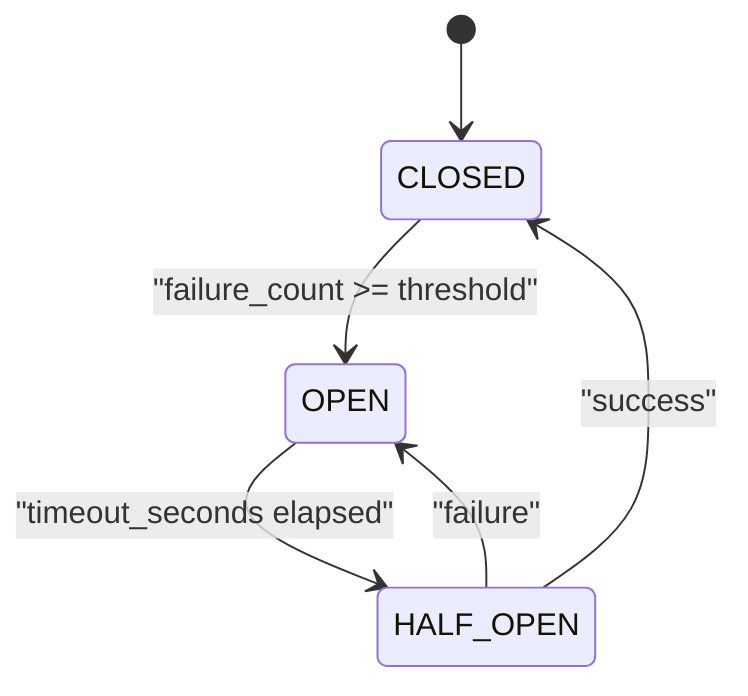

**Diagram sources**
- [utils/browser_circuit_breaker.py](file://utils/browser_circuit_breaker.py#L147-L165)

**Section sources**
- [utils/browser_circuit_breaker.py](file://utils/browser_circuit_breaker.py#L37-L70)
- [utils/browser_circuit_breaker.py](file://utils/browser_circuit_breaker.py#L72-L111)
- [utils/browser_circuit_breaker.py](file://utils/browser_circuit_breaker.py#L112-L165)

### System Configuration: Concurrency, Timeouts, and Rate Limits
- Concurrency: Max concurrent HTTP requests and batch sizes balance throughput and rate limiting.
- Tabs: Max tabs and browser reuse reduce overhead and stabilize long sessions.
- Timeouts: Navigation, selector waits, and page load timeouts prevent hangs.
- Rate limiting: Delays between requests and batches mitigate server-side throttling.

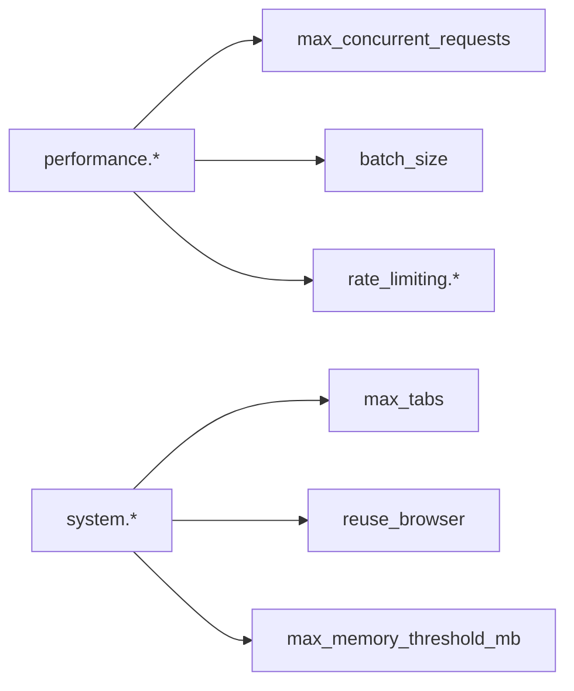

**Diagram sources**
- [config/system_config.json](file://config/system_config.json#L139-L163)
- [config/system_config.json](file://config/system_config.json#L114-L126)

**Section sources**
- [config/system_config.json](file://config/system_config.json#L139-L163)
- [repowiki 12 dec & 20 jan\en\content\Troubleshooting Guide\Performance Optimization\Performance Optimization.md](file://repowiki 12 dec & 20 jan\en\content\Troubleshooting Guide\Performance Optimization\Performance Optimization.md#L92-L109)

### SystemMonitor: Automated Telemetry and Health Reporting
- Collects CPU, memory, disk, active tasks, and error counts
- Logs metrics to JSONL files and generates health reports
- Tracks processing time distributions and product throughput

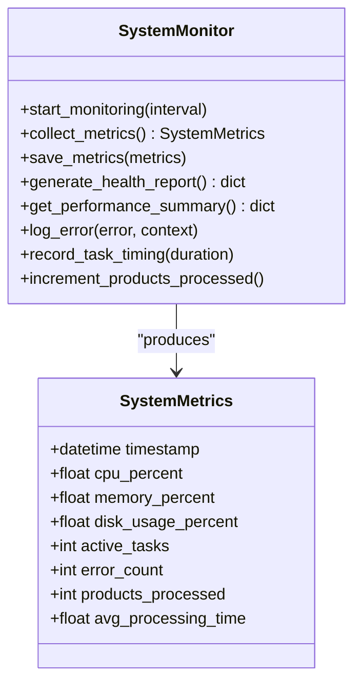

**Diagram sources**
- [tools/system_monitor.py](file://tools/system_monitor.py#L22-L46)
- [tools/system_monitor.py](file://tools/system_monitor.py#L34-L85)

**Section sources**
- [tools/system_monitor.py](file://tools/system_monitor.py#L34-L85)
- [tools/system_monitor.py](file://tools/system_monitor.py#L119-L180)

### run_monitor.py: Continuous State and Log Polling
- Monitors processing state and logs for live diagnostics
- Emits structured timestamps for correlation with system events

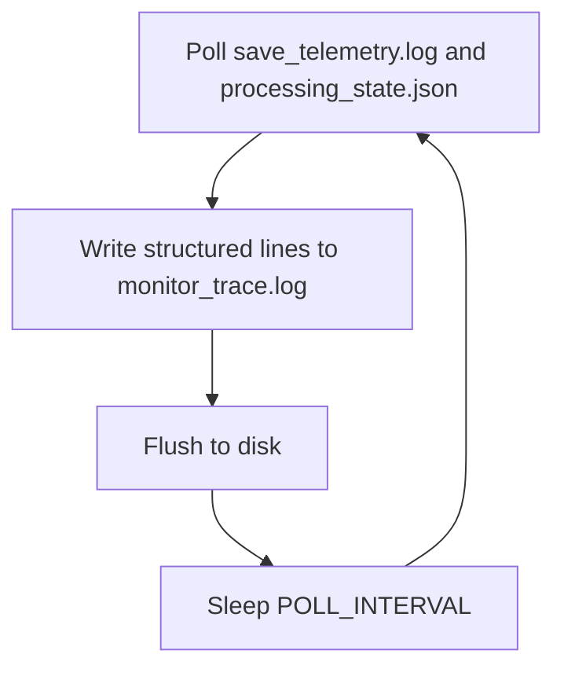

**Diagram sources**
- [tools/run_monitor.py](file://tools/run_monitor.py#L51-L96)

**Section sources**
- [tools/run_monitor.py](file://tools/run_monitor.py#L51-L96)

### Dashboard Metrics Loader: Robust Data Access
- Loads processing state, linking maps, financial reports, caches, and logs
- Handles multiple supplier naming conventions and formats
- Efficient parsing with chunked and JSONL support

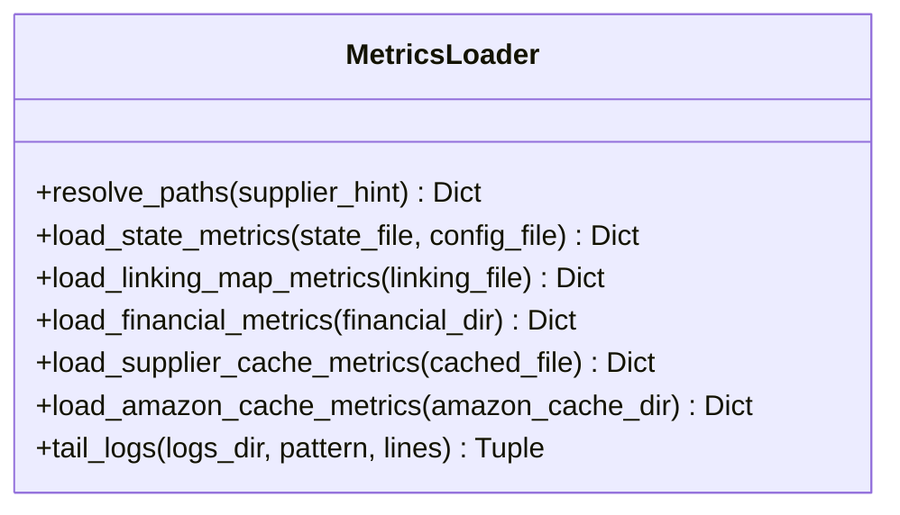

**Diagram sources**
- [dashboard/metrics_core.py](file://dashboard/metrics_core.py#L15-L33)
- [dashboard/metrics_core.py](file://dashboard/metrics_core.py#L426-L456)

**Section sources**
- [dashboard/metrics_core.py](file://dashboard/metrics_core.py#L15-L33)
- [dashboard/metrics_core.py](file://dashboard/metrics_core.py#L426-L456)

### SentinelMonitor: Runtime Integrity Checks
- Detects divergence between linking and cache counts
- Tracks path variants and unexpected shrinkage in link maps
- Records save retry attempts for diagnostics

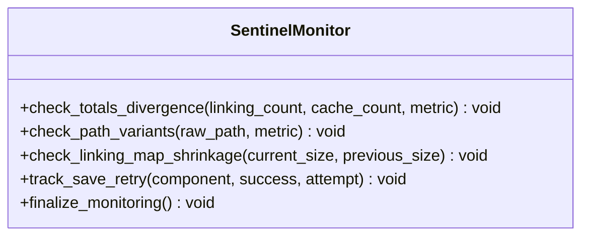

**Diagram sources**
- [utils/sentinel_monitor.py](file://utils/sentinel_monitor.py#L63-L110)
- [utils/sentinel_monitor.py](file://utils/sentinel_monitor.py#L158-L178)

**Section sources**
- [utils/sentinel_monitor.py](file://utils/sentinel_monitor.py#L63-L110)
- [utils/sentinel_monitor.py](file://utils/sentinel_monitor.py#L158-L178)

## Dependency Analysis
- BrowserManager depends on Playwright for CDP connections and psutil for memory monitoring.
- BrowserCircuitBreaker decorates critical operations to protect against failures.
- SystemMonitor relies on psutil for system metrics; falls back gracefully when unavailable.
- run_monitor.py depends on processing state and logs for runtime diagnostics.
- Dashboard metrics loader depends on filesystem paths and supports multiple supplier formats.

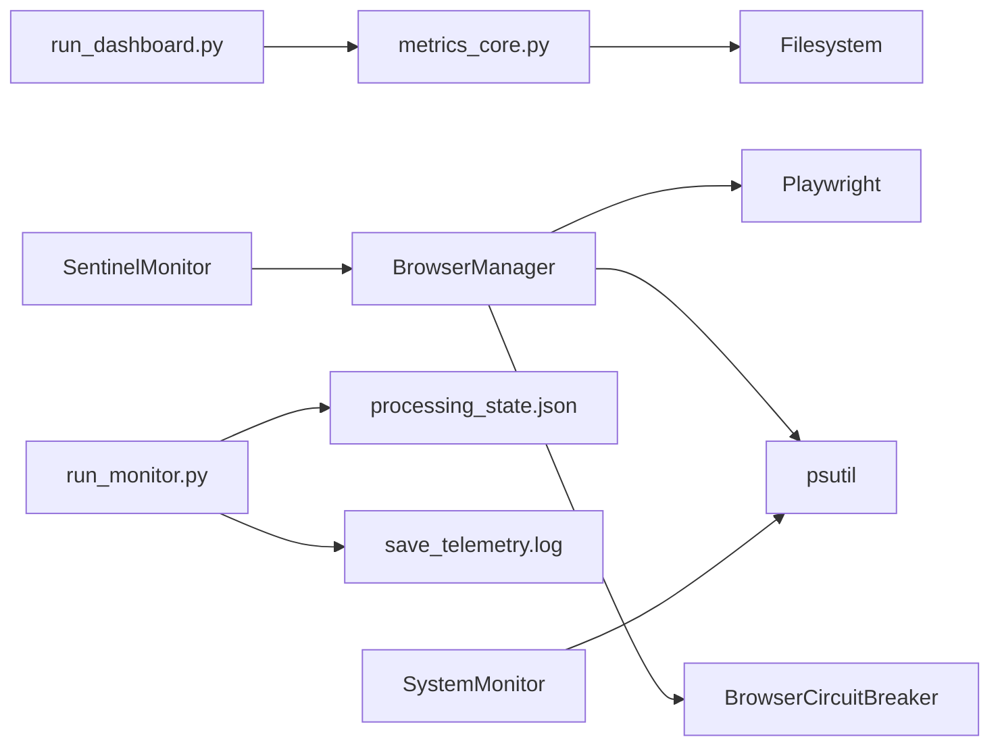

**Diagram sources**
- [utils/browser_manager.py](file://utils/browser_manager.py#L19-L26)
- [utils/browser_circuit_breaker.py](file://utils/browser_circuit_breaker.py#L25-L31)
- [tools/system_monitor.py](file://tools/system_monitor.py#L12-L18)
- [tools/run_monitor.py](file://tools/run_monitor.py#L8-L12)
- [dashboard/metrics_core.py](file://dashboard/metrics_core.py#L15-L33)
- [dashboard/run_dashboard.py](file://dashboard/run_dashboard.py#L90-L166)
- [utils/sentinel_monitor.py](file://utils/sentinel_monitor.py#L63-L110)

**Section sources**
- [utils/browser_manager.py](file://utils/browser_manager.py#L19-L26)
- [utils/browser_circuit_breaker.py](file://utils/browser_circuit_breaker.py#L25-L31)
- [tools/system_monitor.py](file://tools/system_monitor.py#L12-L18)
- [tools/run_monitor.py](file://tools/run_monitor.py#L8-L12)
- [dashboard/metrics_core.py](file://dashboard/metrics_core.py#L15-L33)
- [dashboard/run_dashboard.py](file://dashboard/run_dashboard.py#L90-L166)
- [utils/sentinel_monitor.py](file://utils/sentinel_monitor.py#L63-L110)

## Performance Considerations
- Browser caching and reuse: Enable reuse_browser and limit max_tabs to reduce launch overhead and stabilize long sessions.
- Concurrency and batching: Tune max_concurrent_requests and batch_size to balance throughput and rate limiting.
- Timeouts: Adjust navigation and page load timeouts to avoid premature failures while preventing hangs.
- Memory management: Use sliding window clearing and time-based restarts to keep memory growth in check.
- Supplier pagination: Increase products-per-page density to reduce page loads and JavaScript execution overhead.

[No sources needed since this section provides general guidance]

## Troubleshooting Guide

### Diagnostic Procedures
- Verify CDP connectivity and endpoints: Use curl to probe the debug port and confirm IPv6/IPv4 availability.
- Inspect memory usage: Monitor Chrome and Python memory via BrowserManager’s memory tracking and SystemMonitor.
- Correlate state and logs: Use run_monitor.py to poll processing state and telemetry logs for runtime insights.
- Validate dashboard data: Ensure metrics_core.py can resolve supplier paths and parse linking maps and financial reports.

**Section sources**
- [utils/browser_manager.py](file://utils/browser_manager.py#L242-L272)
- [utils/browser_manager.py](file://utils/browser_manager.py#L658-L719)
- [tools/system_monitor.py](file://tools/system_monitor.py#L61-L85)
- [tools/run_monitor.py](file://tools/run_monitor.py#L51-L96)
- [dashboard/metrics_core.py](file://dashboard/metrics_core.py#L426-L456)

### Identifying Slow-Loading Pages
- Use BrowserManager’s navigation with CircuitBreaker to surface failures quickly.
- Increase page load and navigation timeouts cautiously to accommodate heavy pages.
- Monitor memory spikes during navigation; consider restarting the browser proactively.

**Section sources**
- [utils/browser_manager.py](file://utils/browser_manager.py#L177-L198)
- [utils/browser_circuit_breaker.py](file://utils/browser_circuit_breaker.py#L72-L111)
- [config/system_config.json](file://config/system_config.json#L155-L162)

### Detecting Inefficient Automation Patterns
- Watch for frequent page churn: Excessive new_page() creation indicates poor caching or state management.
- Monitor error rates and task timing: High error counts and long processing times suggest suboptimal concurrency or timeouts.
- Use SentinelMonitor to catch divergence and shrinking link maps indicating data integrity issues.

**Section sources**
- [utils/browser_manager.py](file://utils/browser_manager.py#L164-L176)
- [tools/system_monitor.py](file://tools/system_monitor.py#L108-L118)
- [utils/sentinel_monitor.py](file://utils/sentinel_monitor.py#L79-L110)

### Reducing Page Load Times
- Increase products-per-page density to minimize pagination overhead.
- Optimize selectors and reduce DOM interactions; leverage wait_for_load_state appropriately.
- Use browser reuse and minimize tab switching to reduce context switching costs.

**Section sources**
- [WIKI REPO SEPT17\12. Supplier Integration Guide\12.1. Supplier Configuration\12.1.4. Limiter Configuration.md](file://WIKI REPO SEPT17\12. Supplier Integration Guide\12.1. Supplier Configuration\12.1.4. Limiter Configuration.md#L90-L109)
- [config/system_config.json](file://config/system_config.json#L139-L163)

### Minimizing Resource Consumption
- Enforce memory thresholds and restart cycles to prevent runaway memory growth.
- Use selective cache clearing and sliding windows to cap memory usage.
- Limit concurrent tabs and reuse the browser to reduce overhead.

**Section sources**
- [MASTER_ISSUE_RESOLUTION_DOCUMENTATION.md](file://MASTER_ISSUE_RESOLUTION_DOCUMENTATION.md#L395-L428)
- [config/system_config.json](file://config/system_config.json#L114-L126)
- [utils/browser_manager.py](file://utils/browser_manager.py#L59-L61)

### Automated Performance Monitoring Tools
- SystemMonitor: Periodic metrics logging and health reports.
- run_monitor.py: Continuous state/log polling for runtime diagnostics.
- Dashboard metrics loader: Robust parsing of state, linking maps, and financial reports.

**Section sources**
- [tools/system_monitor.py](file://tools/system_monitor.py#L34-L85)
- [tools/run_monitor.py](file://tools/run_monitor.py#L51-L96)
- [dashboard/metrics_core.py](file://dashboard/metrics_core.py#L602-L615)

### Manual Profiling Techniques
- Use curl and netstat to verify CDP connectivity and port availability.
- Inspect memory usage via psutil-backed monitors and BrowserManager’s memory tracking.
- Tail logs and correlate with state changes to identify regressions.

**Section sources**
- [utils/browser_manager.py](file://utils/browser_manager.py#L242-L272)
- [utils/browser_manager.py](file://utils/browser_manager.py#L658-L719)
- [tools/run_monitor.py](file://tools/run_monitor.py#L51-L96)

### Benchmarking Procedures
- Measure average processing time and throughput using SystemMonitor.
- Compare before/after scenarios with controlled concurrency and timeout settings.
- Validate dashboard metrics for consistency across runs.

**Section sources**
- [tools/system_monitor.py](file://tools/system_monitor.py#L156-L180)
- [dashboard/metrics_core.py](file://dashboard/metrics_core.py#L331-L424)

### Resolution Strategies
- Slow page loads: Increase products-per-page density and tune timeouts; reduce unnecessary DOM interactions.
- High CPU usage: Lower concurrency, increase batch delays, and optimize selectors.
- Memory pressure: Enforce restart policies, use sliding window clearing, and limit tabs.

**Section sources**
- [WIKI REPO SEPT17\12. Supplier Integration Guide\12.1. Supplier Configuration\12.1.4. Limiter Configuration.md](file://WIKI REPO SEPT17\12. Supplier Integration Guide\12.1. Supplier Configuration\12.1.4. Limiter Configuration.md#L90-L109)
- [config/system_config.json](file://config/system_config.json#L139-L163)
- [MASTER_ISSUE_RESOLUTION_DOCUMENTATION.md](file://MASTER_ISSUE_RESOLUTION_DOCUMENTATION.md#L395-L428)

## Conclusion
By combining resilient browser management, circuit breaker protections, disciplined configuration, and comprehensive monitoring, the Amazon FBA Agent System achieves reliable, high-throughput automation. Proactive memory management, optimized concurrency, and robust diagnostics enable sustained performance over long-running sessions.

[No sources needed since this section summarizes without analyzing specific files]

## Appendices

### Browser Lifecycle and CDP Compatibility
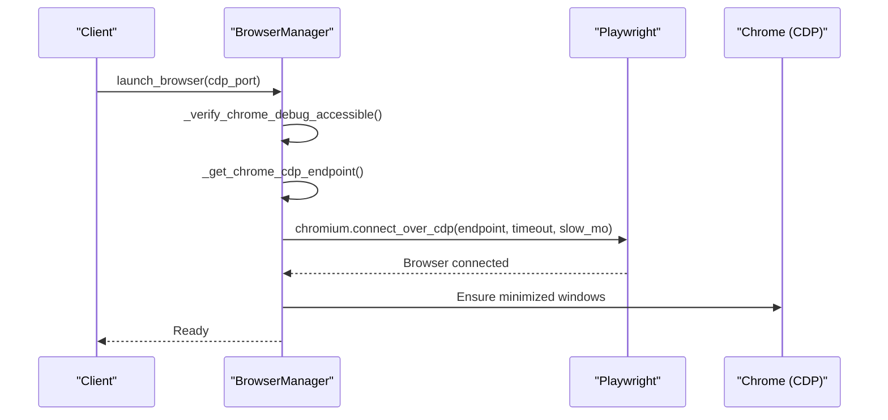

**Diagram sources**
- [utils/browser_manager.py](file://utils/browser_manager.py#L77-L140)
- [utils/browser_manager.py](file://utils/browser_manager.py#L242-L300)
- [utils/browser_manager.py](file://utils/browser_manager.py#L375-L397)

**Section sources**
- [wiki-dec-3\3. Core Architecture\3.3. Browser Manager.md](file://wiki-dec-3\3. Core Architecture\3.3. Browser Manager.md#L85-L108)
- [repowiki 12 dec & 20 jan\en\content\Browser Automation\Browser Management.md](file://repowiki 12 dec & 20 jan\en\content\Browser Automation\Browser Management.md#L281-L309)
- [repowiki 12 dec & 20 jan\en\content\Browser Automation\Browser Automation.md](file://repowiki 12 dec & 20 jan\en\content\Browser Automation\Browser Automation.md#L139-L170)