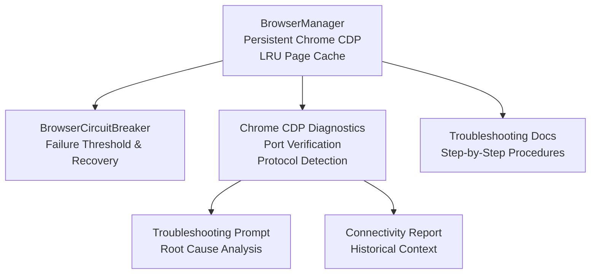
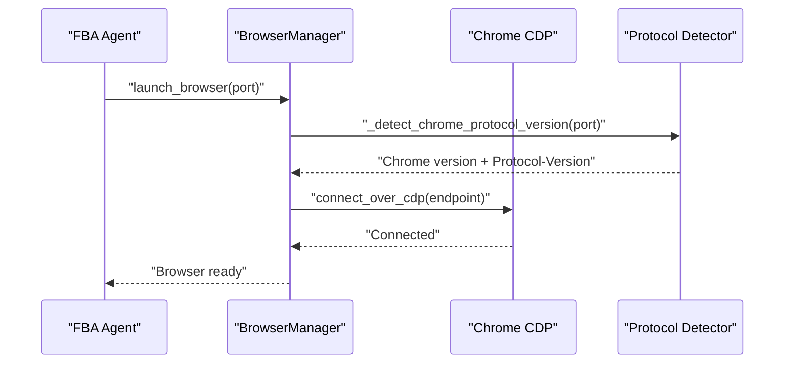
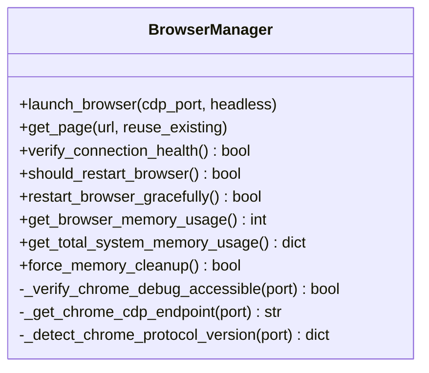
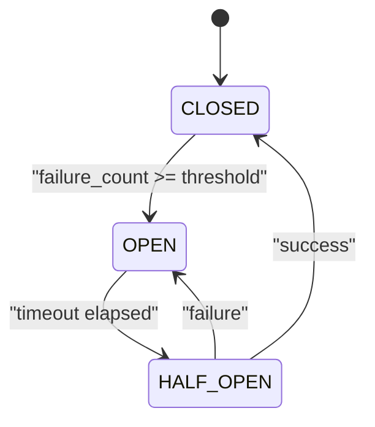
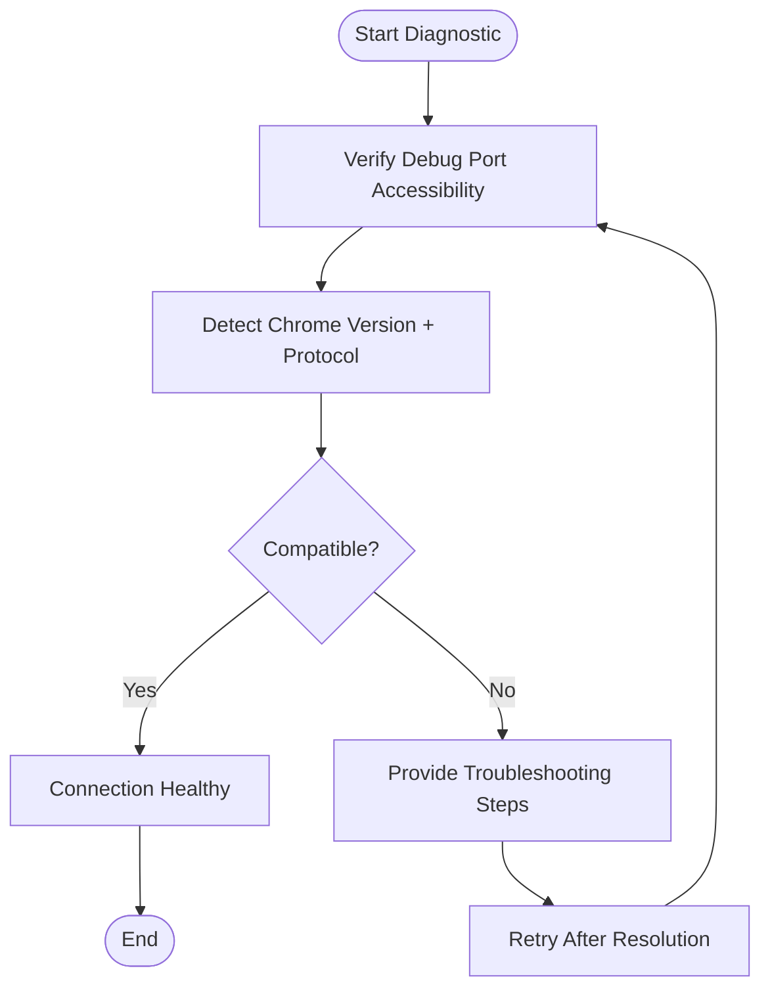
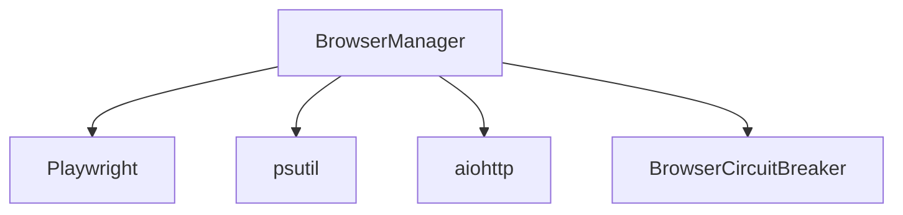
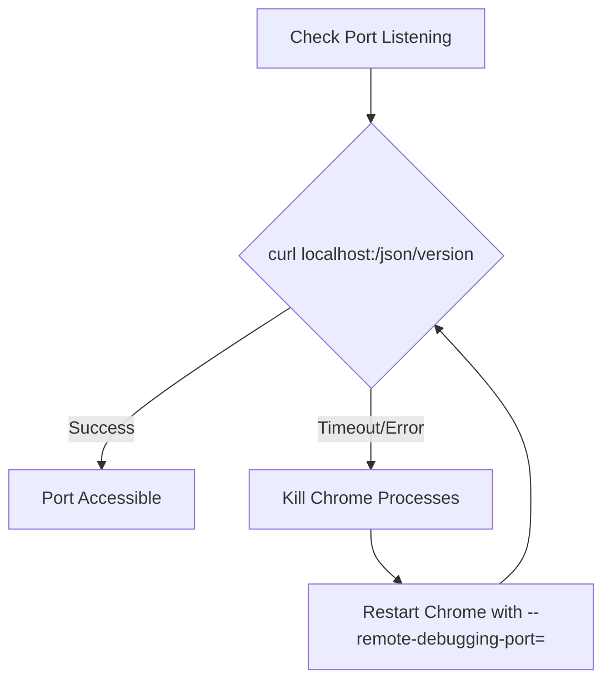
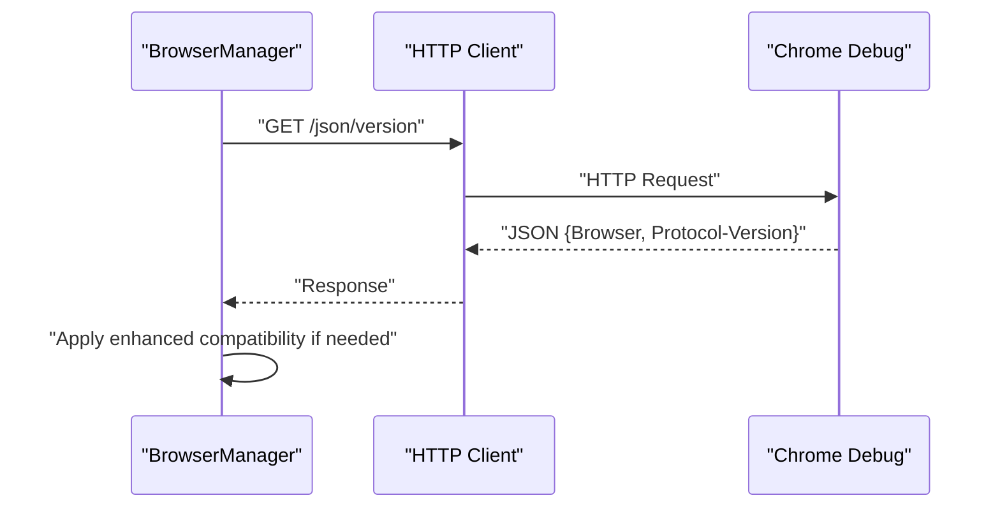
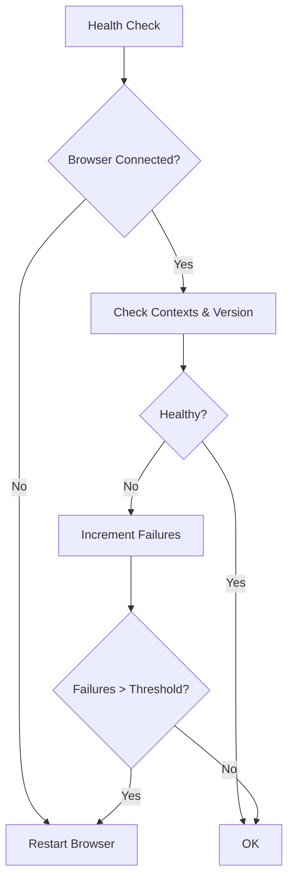

# Troubleshooting Guides

<cite>
**Referenced Files in This Document**
- [utils/browser_manager.py](file://utils/browser_manager.py)
- [utils/browser_circuit_breaker.py](file://utils/browser_circuit_breaker.py)
- [docs/TROUBLESHOOTING.md](file://docs/TROUBLESHOOTING.md)
- [CHROME_DEBUG_TROUBLESHOOTING_PROMPT.md](file://CHROME_DEBUG_TROUBLESHOOTING_PROMPT.md)
- [CHROME_CDP_CONNECTIVITY_TROUBLESHOOTING_REPORT.md](file://CHROME_CDP_CONNECTIVITY_TROUBLESHOOTING_REPORT.md)
- [chrome_cdp_diagnostic.py](file://chrome_cdp_diagnostic.py)
- [chrome_cdp_diagnostic_fix.py](file://chrome_cdp_diagnostic_fix.py)
- [chrome_cdp_final_fix.py](file://chrome_cdp_final_fix.py)
- [chrome_quick_fix.py](file://chrome_quick_fix.py)
</cite>

## Table of Contents
1. [Introduction](#introduction)
2. [Project Structure](#project-structure)
3. [Core Components](#core-components)
4. [Architecture Overview](#architecture-overview)
5. [Detailed Component Analysis](#detailed-component-analysis)
6. [Dependency Analysis](#dependency-analysis)
7. [Performance Considerations](#performance-considerations)
8. [Troubleshooting Guide](#troubleshooting-guide)
9. [Conclusion](#conclusion)

## Introduction
This document provides a comprehensive troubleshooting guide for Chrome browser management issues in the Amazon FBA Agent System. It focuses on diagnosing and resolving connection failures, memory leaks, and performance degradation with a strong emphasis on Chrome debug port verification, protocol version detection, and connection health assessment. It includes step-by-step procedures for port conflicts, Chrome version incompatibilities, and memory usage spikes, along with automated diagnostic tools, manual verification steps, escalation paths, and practical examples of error analysis and resolution strategies.

## Project Structure
The troubleshooting content centers around the browser management subsystem and supporting utilities:
- Centralized browser management with persistent Chrome connection and LRU page caching
- Circuit breaker for resilience during long-running sessions
- Diagnostic scripts and prompts for Chrome CDP connectivity
- System-wide troubleshooting documentation

**Diagram sources**
- [utils/browser_manager.py](file://utils/browser_manager.py#L35-L120)
- [utils/browser_circuit_breaker.py](file://utils/browser_circuit_breaker.py#L37-L70)
- [CHROME_DEBUG_TROUBLESHOOTING_PROMPT.md](file://CHROME_DEBUG_TROUBLESHOOTING_PROMPT.md#L1-L77)
- [CHROME_CDP_CONNECTIVITY_TROUBLESHOOTING_REPORT.md](file://CHROME_CDP_CONNECTIVITY_TROUBLESHOOTING_REPORT.md#L1-L126)
- [docs/TROUBLESHOOTING.md](file://docs/TROUBLESHOOTING.md#L46-L155)

**Section sources**
- [utils/browser_manager.py](file://utils/browser_manager.py#L35-L120)
- [utils/browser_circuit_breaker.py](file://utils/browser_circuit_breaker.py#L37-L70)
- [docs/TROUBLESHOOTING.md](file://docs/TROUBLESHOOTING.md#L46-L155)
- [CHROME_DEBUG_TROUBLESHOOTING_PROMPT.md](file://CHROME_DEBUG_TROUBLESHOOTING_PROMPT.md#L1-L77)
- [CHROME_CDP_CONNECTIVITY_TROUBLESHOOTING_REPORT.md](file://CHROME_CDP_CONNECTIVITY_TROUBLESHOOTING_REPORT.md#L1-L126)

## Core Components
- BrowserManager: Singleton responsible for connecting to an existing Chrome instance via CDP, managing a persistent context, and providing page caching with LRU eviction. It includes health checks, memory monitoring, and graceful restart mechanisms.
- BrowserCircuitBreaker: Implements a circuit breaker pattern to prevent cascading failures during long sessions, with configurable thresholds and recovery timeouts.
- Troubleshooting documentation: Provides step-by-step procedures for Chrome debug port accessibility, memory issues, and circuit breaker activation.
- Chrome CDP diagnostics: Automated scripts and prompts to verify ports, detect protocol versions, and validate connection stability.

**Section sources**
- [utils/browser_manager.py](file://utils/browser_manager.py#L35-L120)
- [utils/browser_circuit_breaker.py](file://utils/browser_circuit_breaker.py#L37-L70)
- [docs/TROUBLESHOOTING.md](file://docs/TROUBLESHOOTING.md#L46-L155)
- [CHROME_DEBUG_TROUBLESHOOTING_PROMPT.md](file://CHROME_DEBUG_TROUBLESHOOTING_PROMPT.md#L1-L77)

## Architecture Overview
The system connects to an existing Chrome instance using CDP over a debug port. The BrowserManager encapsulates connection logic, protocol detection, and health monitoring. The circuit breaker protects against prolonged failures. Diagnostics assist in verifying connectivity and protocol compatibility.

**Diagram sources**
- [utils/browser_manager.py](file://utils/browser_manager.py#L477-L542)
- [utils/browser_manager.py](file://utils/browser_manager.py#L107-L140)

## Detailed Component Analysis

### BrowserManager: Chrome CDP Connection and Health
Key responsibilities:
- Connect to an existing Chrome instance via CDP using IPv6/IPv4 endpoint detection
- Verify debug port accessibility and respond to version and page list queries
- Detect Chrome version and protocol version for compatibility assessment
- Manage persistent context and page caching with LRU eviction
- Provide health checks, memory monitoring, and graceful restarts

**Diagram sources**
- [utils/browser_manager.py](file://utils/browser_manager.py#L77-L140)
- [utils/browser_manager.py](file://utils/browser_manager.py#L242-L301)
- [utils/browser_manager.py](file://utils/browser_manager.py#L477-L542)
- [utils/browser_manager.py](file://utils/browser_manager.py#L848-L938)
- [utils/browser_manager.py](file://utils/browser_manager.py#L979-L1018)

**Section sources**
- [utils/browser_manager.py](file://utils/browser_manager.py#L77-L140)
- [utils/browser_manager.py](file://utils/browser_manager.py#L242-L301)
- [utils/browser_manager.py](file://utils/browser_manager.py#L477-L542)
- [utils/browser_manager.py](file://utils/browser_manager.py#L848-L938)
- [utils/browser_manager.py](file://utils/browser_manager.py#L979-L1018)

### BrowserCircuitBreaker: Resilience During Long Sessions
Key responsibilities:
- Enforce failure thresholds and recovery timeouts
- Manage state transitions (CLOSED/OPEN/HALF_OPEN)
- Provide status reporting and manual reset capability

**Diagram sources**
- [utils/browser_circuit_breaker.py](file://utils/browser_circuit_breaker.py#L112-L133)
- [utils/browser_circuit_breaker.py](file://utils/browser_circuit_breaker.py#L174-L191)

**Section sources**
- [utils/browser_circuit_breaker.py](file://utils/browser_circuit_breaker.py#L37-L70)
- [utils/browser_circuit_breaker.py](file://utils/browser_circuit_breaker.py#L112-L133)
- [utils/browser_circuit_breaker.py](file://utils/browser_circuit_breaker.py#L174-L191)

### Chrome CDP Diagnostics: Automated Verification
Automated scripts and prompts assist in:
- Verifying debug port accessibility
- Detecting Chrome version and protocol version
- Providing actionable troubleshooting steps
- Supporting manual verification procedures

**Diagram sources**
- [chrome_cdp_diagnostic.py](file://chrome_cdp_diagnostic.py#L1-L421)
- [chrome_cdp_diagnostic_fix.py](file://chrome_cdp_diagnostic_fix.py#L1-L215)
- [CHROME_DEBUG_TROUBLESHOOTING_PROMPT.md](file://CHROME_DEBUG_TROUBLESHOOTING_PROMPT.md#L1-L77)
- [CHROME_CDP_CONNECTIVITY_TROUBLESHOOTING_REPORT.md](file://CHROME_CDP_CONNECTIVITY_TROUBLESHOOTING_REPORT.md#L1-L126)

**Section sources**
- [chrome_cdp_diagnostic.py](file://chrome_cdp_diagnostic.py#L1-L421)
- [chrome_cdp_diagnostic_fix.py](file://chrome_cdp_diagnostic_fix.py#L1-L215)
- [CHROME_DEBUG_TROUBLESHOOTING_PROMPT.md](file://CHROME_DEBUG_TROUBLESHOOTING_PROMPT.md#L1-L77)
- [CHROME_CDP_CONNECTIVITY_TROUBLESHOOTING_REPORT.md](file://CHROME_CDP_CONNECTIVITY_TROUBLESHOOTING_REPORT.md#L1-L126)

## Dependency Analysis
The BrowserManager depends on:
- Playwright for CDP connections
- psutil for memory monitoring
- aiohttp for HTTP-based port verification and protocol detection
- BrowserCircuitBreaker for resilience

**Diagram sources**
- [utils/browser_manager.py](file://utils/browser_manager.py#L19-L26)
- [utils/browser_manager.py](file://utils/browser_manager.py#L21-L23)
- [utils/browser_circuit_breaker.py](file://utils/browser_circuit_breaker.py#L25-L31)

**Section sources**
- [utils/browser_manager.py](file://utils/browser_manager.py#L19-L26)
- [utils/browser_manager.py](file://utils/browser_manager.py#L21-L23)
- [utils/browser_circuit_breaker.py](file://utils/browser_circuit_breaker.py#L25-L31)

## Performance Considerations
- Connection stability: The BrowserManager implements enhanced compatibility modes for Chrome 139.x Protocol 1.3 with progressive timeouts and slow motion adjustments.
- Memory management: Built-in memory monitoring and forced cleanup routines help prevent memory leaks and reduce performance degradation.
- Circuit breaker: Prevents cascading failures during long sessions by suspending operations after threshold failures and automatically recovering after a timeout.

[No sources needed since this section provides general guidance]

## Troubleshooting Guide

### Step-by-Step: Chrome Debug Port Verification
- Confirm port listening and HTTP interface responsiveness
- Use curl to query the debug version endpoint
- Check for port conflicts and kill existing Chrome processes if necessary
- Restart Chrome with proper debug flags and verify connectivity

**Diagram sources**
- [docs/TROUBLESHOOTING.md](file://docs/TROUBLESHOOTING.md#L48-L90)

**Section sources**
- [docs/TROUBLESHOOTING.md](file://docs/TROUBLESHOOTING.md#L48-L90)

### Step-by-Step: Protocol Version Detection
- Query the debug version endpoint to retrieve Chrome version and protocol version
- Compare with Playwright compatibility requirements
- Apply enhanced compatibility settings for Chrome 139.x Protocol 1.3

**Diagram sources**
- [utils/browser_manager.py](file://utils/browser_manager.py#L477-L542)

**Section sources**
- [utils/browser_manager.py](file://utils/browser_manager.py#L477-L542)

### Step-by-Step: Connection Health Assessment
- Verify WebSocket connection health using lightweight operations
- Monitor connection failures and trigger restarts when thresholds are exceeded
- Perform graceful restarts to preserve session state

**Diagram sources**
- [utils/browser_manager.py](file://utils/browser_manager.py#L848-L884)
- [utils/browser_manager.py](file://utils/browser_manager.py#L885-L938)

**Section sources**
- [utils/browser_manager.py](file://utils/browser_manager.py#L848-L884)
- [utils/browser_manager.py](file://utils/browser_manager.py#L885-L938)

### Step-by-Step: Resolving Port Conflicts
- Identify conflicting processes using netstat
- Terminate conflicting Chrome processes
- Restart Chrome with a different debug port if necessary
- Verify port availability before proceeding

**Section sources**
- [docs/TROUBLESHOOTING.md](file://docs/TROUBLESHOOTING.md#L48-L90)

### Step-by-Step: Handling Chrome Version Incompatibilities
- Detect Chrome version and protocol version
- Apply enhanced compatibility settings for newer Chrome versions
- Upgrade Playwright if required for compatibility
- Validate connection stability after applying compatibility settings

**Section sources**
- [utils/browser_manager.py](file://utils/browser_manager.py#L477-L542)
- [utils/browser_manager.py](file://utils/browser_manager.py#L398-L428)
- [docs/TROUBLESHOOTING.md](file://docs/TROUBLESHOOTING.md#L531-L557)

### Step-by-Step: Managing Memory Usage Spikes
- Monitor Chrome and system memory usage
- Trigger forced memory cleanup when thresholds are exceeded
- Adjust thresholds and enable periodic restarts to prevent leaks
- Use built-in memory management utilities for safe cleanup

**Section sources**
- [utils/browser_manager.py](file://utils/browser_manager.py#L658-L720)
- [utils/browser_manager.py](file://utils/browser_manager.py#L940-L978)
- [utils/browser_manager.py](file://utils/browser_manager.py#L816-L847)
- [docs/TROUBLESHOOTING.md](file://docs/TROUBLESHOOTING.md#L91-L126)

### Automated Diagnostic Tools
- Use diagnostic scripts to verify debug port accessibility and protocol detection
- Execute connectivity tests and apply recommended troubleshooting steps
- Leverage troubleshooting prompts for root cause analysis and validation

**Section sources**
- [chrome_cdp_diagnostic.py](file://chrome_cdp_diagnostic.py#L1-L421)
- [chrome_cdp_diagnostic_fix.py](file://chrome_cdp_diagnostic_fix.py#L1-L215)
- [CHROME_DEBUG_TROUBLESHOOTING_PROMPT.md](file://CHROME_DEBUG_TROUBLESHOOTING_PROMPT.md#L1-L77)
- [CHROME_CDP_CONNECTIVITY_TROUBLESHOOTING_REPORT.md](file://CHROME_CDP_CONNECTIVITY_TROUBLESHOOTING_REPORT.md#L1-L126)

### Manual Verification Procedures
- Manually verify Chrome debug port accessibility using curl
- Inspect Chrome processes and memory usage
- Validate configuration files and environment settings
- Test authentication and session persistence

**Section sources**
- [docs/TROUBLESHOOTING.md](file://docs/TROUBLESHOOTING.md#L46-L155)

### Escalation Paths
- If automated diagnostics fail, escalate to manual verification and environment inspection
- Validate system environment changes that may affect Chrome debug interface
- Coordinate with system administrators for firewall and security software adjustments
- Document findings and apply targeted fixes based on protocol and version compatibility

**Section sources**
- [CHROME_DEBUG_TROUBLESHOOTING_PROMPT.md](file://CHROME_DEBUG_TROUBLESHOOTING_PROMPT.md#L20-L70)
- [CHROME_CDP_CONNECTIVITY_TROUBLESHOOTING_REPORT.md](file://CHROME_CDP_CONNECTIVITY_TROUBLESHOOTING_REPORT.md#L1-L126)

### Practical Examples: Error Analysis and Resolution
- Analyze connectivity timeouts and apply enhanced compatibility settings
- Review memory usage logs and trigger forced cleanup routines
- Interpret circuit breaker status and implement recovery strategies
- Validate protocol detection results and adjust configuration accordingly

**Section sources**
- [utils/browser_manager.py](file://utils/browser_manager.py#L477-L542)
- [utils/browser_manager.py](file://utils/browser_manager.py#L848-L938)
- [utils/browser_circuit_breaker.py](file://utils/browser_circuit_breaker.py#L174-L191)
- [docs/TROUBLESHOOTING.md](file://docs/TROUBLESHOOTING.md#L127-L155)

## Conclusion
The Amazon FBA Agent System provides robust mechanisms for diagnosing and resolving Chrome browser management issues. By leveraging the BrowserManager’s CDP connectivity, protocol detection, and health monitoring, combined with the BrowserCircuitBreaker’s resilience and the comprehensive troubleshooting documentation, teams can systematically address connection failures, memory leaks, and performance degradation. Automated diagnostics and manual verification procedures offer multiple pathways to resolution, supported by clear escalation paths and practical examples for error analysis and resolution.