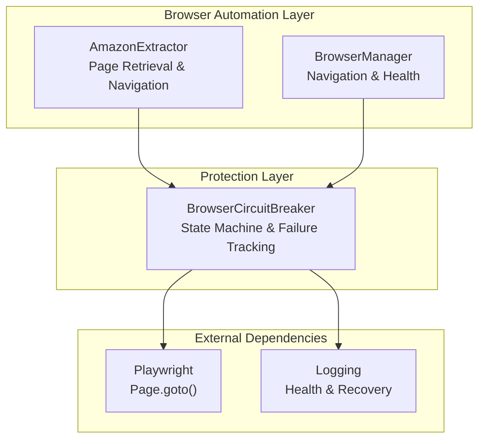
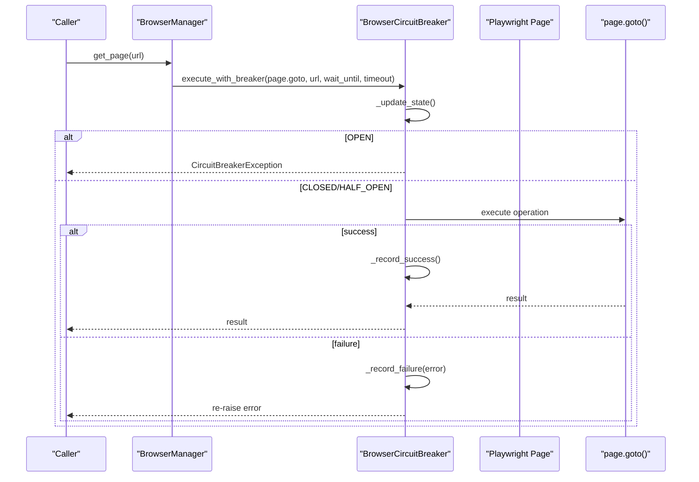
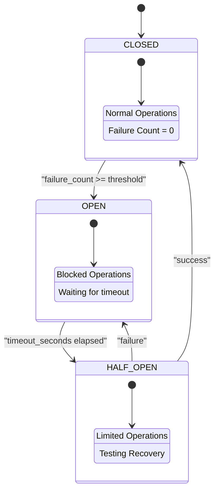
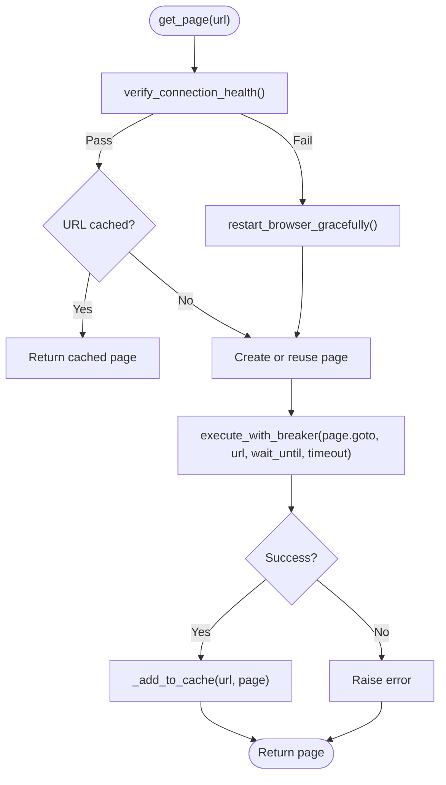
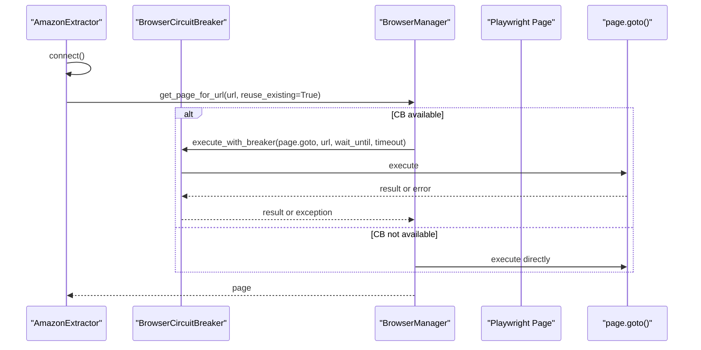
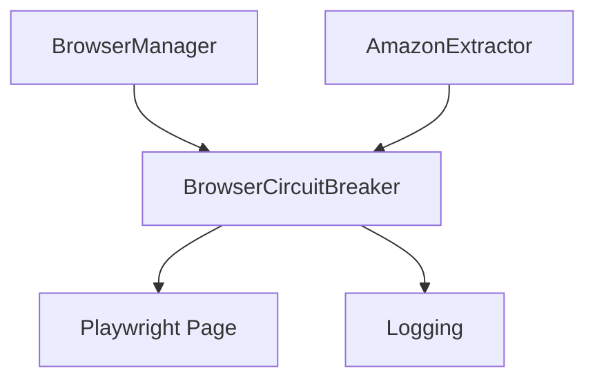

# Circuit Breaker Protection

<cite>
**Referenced Files in This Document**
- [browser_circuit_breaker.py](file://utils/browser_circuit_breaker.py)
- [browser_manager.py](file://utils/browser_manager.py)
- [amazon_playwright_extractor.py](file://backup/amazon_extract_fix_20250926_041307/amazon_playwright_extractor.py)
- [TROUBLESHOOTING.md](file://docs/TROUBLESHOOTING.md)
</cite>

## Table of Contents
1. [Introduction](#introduction)
2. [Project Structure](#project-structure)
3. [Core Components](#core-components)
4. [Architecture Overview](#architecture-overview)
5. [Detailed Component Analysis](#detailed-component-analysis)
6. [Dependency Analysis](#dependency-analysis)
7. [Performance Considerations](#performance-considerations)
8. [Troubleshooting Guide](#troubleshooting-guide)
9. [Conclusion](#conclusion)

## Introduction
This document explains the circuit breaker protection system designed to safeguard browser automation from cascading failures during long-running operations. It covers the BrowserCircuitBreaker implementation, including failure threshold configuration, timeout mechanisms, automatic recovery procedures, and integration with BrowserManager and AmazonExtractor. The protection strategies address browser connection failures, navigation timeouts, and page loading issues, ensuring system resilience and stability.

## Project Structure
The circuit breaker protection spans three key modules:
- utils/browser_circuit_breaker.py: Implements the circuit breaker pattern with state management, failure counting, and recovery logic.
- utils/browser_manager.py: Integrates the circuit breaker into browser operations, particularly navigation, and coordinates health checks and restarts.
- backup/amazon_extract_fix_20250926_041307/amazon_playwright_extractor.py: Demonstrates usage of the circuit breaker around navigation and page retrieval operations.

**Diagram sources**
- [browser_circuit_breaker.py](file://utils/browser_circuit_breaker.py#L37-L214)
- [browser_manager.py](file://utils/browser_manager.py#L170-L198)
- [amazon_playwright_extractor.py](file://backup/amazon_extract_fix_20250926_041307/amazon_playwright_extractor.py#L259-L315)

**Section sources**
- [browser_circuit_breaker.py](file://utils/browser_circuit_breaker.py#L1-L214)
- [browser_manager.py](file://utils/browser_manager.py#L1-L120)
- [amazon_playwright_extractor.py](file://backup/amazon_extract_fix_20250926_041307/amazon_playwright_extractor.py#L60-L120)

## Core Components
- BrowserCircuitBreaker: Central protection mechanism that tracks failures, transitions between CLOSED, OPEN, and HALF_OPEN states, and enforces timeouts for recovery.
- BrowserManager: Orchestrates browser lifecycle, applies circuit breaker protection during navigation, and coordinates health monitoring and restarts.
- AmazonExtractor: Uses the circuit breaker for page retrieval and navigation to mitigate transient failures during product extraction.

Key capabilities:
- Configurable failure threshold, timeout, and recovery timeout.
- Automatic state transitions and logging for observability.
- Integration hooks for navigation and page operations.

**Section sources**
- [browser_circuit_breaker.py](file://utils/browser_circuit_breaker.py#L37-L192)
- [browser_manager.py](file://utils/browser_manager.py#L54-L68)
- [amazon_playwright_extractor.py](file://backup/amazon_extract_fix_20250926_041307/amazon_playwright_extractor.py#L63-L96)

## Architecture Overview
The circuit breaker sits between browser operations and Playwright, gating potentially failing operations and enabling controlled recovery.

**Diagram sources**
- [browser_manager.py](file://utils/browser_manager.py#L177-L196)
- [browser_circuit_breaker.py](file://utils/browser_circuit_breaker.py#L72-L111)

**Section sources**
- [browser_manager.py](file://utils/browser_manager.py#L170-L198)
- [browser_circuit_breaker.py](file://utils/browser_circuit_breaker.py#L72-L133)

## Detailed Component Analysis

### BrowserCircuitBreaker
The circuit breaker implements a classic state machine with three states:
- CLOSED: Normal operation; failures increment counters.
- OPEN: After reaching the failure threshold, operations are blocked for a configured timeout.
- HALF_OPEN: After timeout, a limited number of operations are allowed to test recovery; success transitions back to CLOSED, failure returns to OPEN.

Configuration:
- failure_threshold: Number of failures before opening the circuit (default: 3).
- timeout_seconds: Duration the circuit remains OPEN before transitioning to HALF_OPEN (default: 300s/5 minutes).
- recovery_timeout: Duration to wait in HALF_OPEN before full recovery (default: 60s).

Behavior highlights:
- execute_with_breaker validates state, executes the operation, records outcomes, and raises exceptions when OPEN.
- _update_state transitions between states based on elapsed time.
- _record_success resets failure count and transitions to CLOSED upon success in HALF_OPEN.
- _record_failure increments failure count and transitions to OPEN when threshold is reached.
- get_status exposes current state, failure count, and retry timing.
- reset forces manual reset to CLOSED.

**Diagram sources**
- [browser_circuit_breaker.py](file://utils/browser_circuit_breaker.py#L112-L164)

**Section sources**
- [browser_circuit_breaker.py](file://utils/browser_circuit_breaker.py#L37-L192)

### BrowserManager Integration
BrowserManager embeds a BrowserCircuitBreaker instance and applies it to navigation operations to protect against transient failures. It also performs health checks and can restart the browser when needed.

Key integration points:
- Initialization: Creates a circuit breaker with default thresholds.
- Navigation: Wraps page.goto with execute_with_breaker to gate navigation failures.
- Health monitoring: Coordinates memory usage checks and restart triggers.

**Diagram sources**
- [browser_manager.py](file://utils/browser_manager.py#L141-L198)

**Section sources**
- [browser_manager.py](file://utils/browser_manager.py#L54-L68)
- [browser_manager.py](file://utils/browser_manager.py#L170-L198)

### AmazonExtractor Usage
AmazonExtractor optionally uses its own BrowserCircuitBreaker instance for page retrieval and navigation. It demonstrates:
- Conditional use of the circuit breaker based on availability.
- Integration with BrowserManager’s get_page_for_url to apply protection during navigation.
- Retry logic with backoff for navigation attempts.

**Diagram sources**
- [amazon_playwright_extractor.py](file://backup/amazon_extract_fix_20250926_041307/amazon_playwright_extractor.py#L259-L315)

**Section sources**
- [amazon_playwright_extractor.py](file://backup/amazon_extract_fix_20250926_041307/amazon_playwright_extractor.py#L63-L96)
- [amazon_playwright_extractor.py](file://backup/amazon_extract_fix_20250926_041307/amazon_playwright_extractor.py#L259-L315)

### Circuit Breaker Decorator
A convenience decorator is provided to wrap any async function with circuit breaker protection, attaching the underlying breaker instance for external access.

Usage pattern:
- Apply @circuit_breaker_decorator to async functions requiring protection.
- Access the attached breaker via wrapper.circuit_breaker for status or reset.

**Section sources**
- [browser_circuit_breaker.py](file://utils/browser_circuit_breaker.py#L193-L214)

## Dependency Analysis
The circuit breaker interacts with browser operations and logging subsystems. The following diagram shows the primary dependencies:

**Diagram sources**
- [browser_circuit_breaker.py](file://utils/browser_circuit_breaker.py#L25-L31)
- [browser_manager.py](file://utils/browser_manager.py#L22-L23)
- [amazon_playwright_extractor.py](file://backup/amazon_extract_fix_20250926_041307/amazon_playwright_extractor.py#L22-L23)

**Section sources**
- [browser_circuit_breaker.py](file://utils/browser_circuit_breaker.py#L25-L31)
- [browser_manager.py](file://utils/browser_manager.py#L22-L23)
- [amazon_playwright_extractor.py](file://backup/amazon_extract_fix_20250926_041307/amazon_playwright_extractor.py#L22-L23)

## Performance Considerations
- State transitions are time-based; timeouts balance protection against throughput.
- Logging overhead is minimal but essential for diagnostics; ensure appropriate log levels in production.
- Circuit breaker resets should be used sparingly; rely on automatic recovery for normal operation.
- Integration with BrowserManager’s health checks reduces repeated failures by proactively restarting browsers before operations.

[No sources needed since this section provides general guidance]

## Troubleshooting Guide
Common symptoms and resolutions for circuit breaker activation:
- Symptoms: “Circuit breaker OPENED” messages, suspended operations, automatic recovery attempts.
- Diagnosis: Use diagnostic commands to check circuit breaker status and recent events.
- Solutions:
  - Wait for automatic recovery (default 5 minutes after 3 failures).
  - Manually reset the breaker if needed.
  - Review logs for failure patterns and adjust thresholds if necessary.

Operational tips:
- Monitor health logs for recurring failures indicating deeper issues.
- Combine circuit breaker usage with BrowserManager’s restart logic for robust resilience.

**Section sources**
- [TROUBLESHOOTING.md](file://docs/TROUBLESHOOTING.md#L127-L155)

## Conclusion
The circuit breaker protection system provides robust safeguards for browser automation by preventing cascading failures, enforcing controlled recovery, and maintaining system stability during long-running operations. Its integration with BrowserManager and AmazonExtractor ensures navigation and page operations are resilient against transient failures, while logging and status reporting enable effective monitoring and troubleshooting.