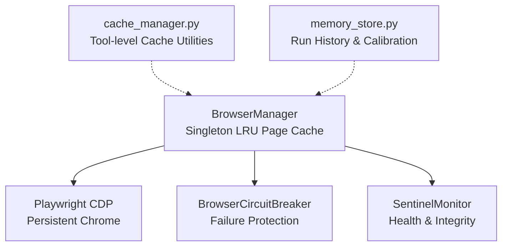
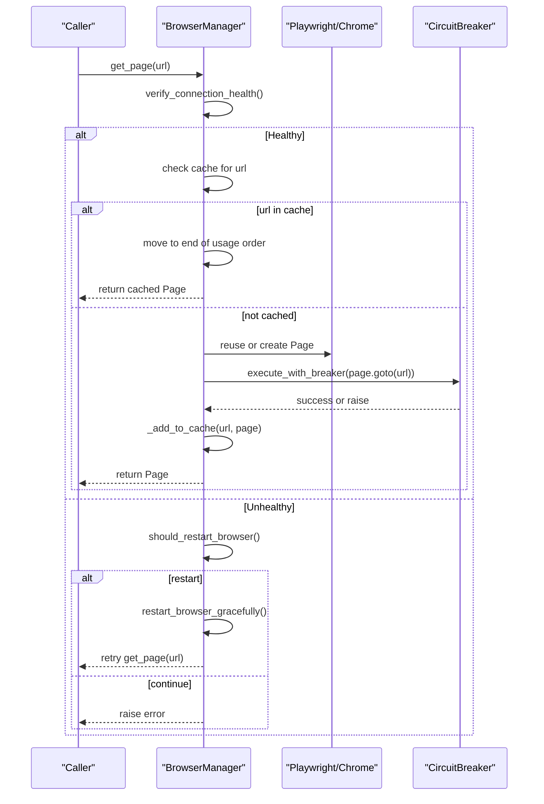
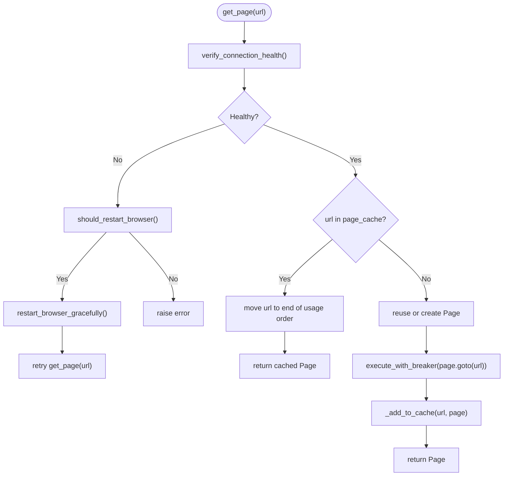
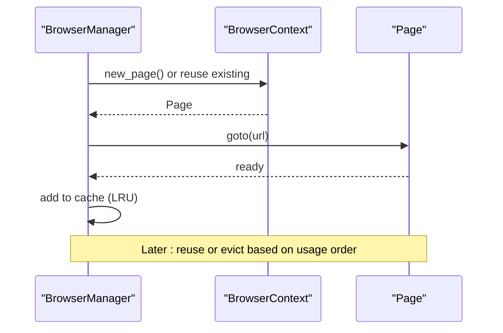
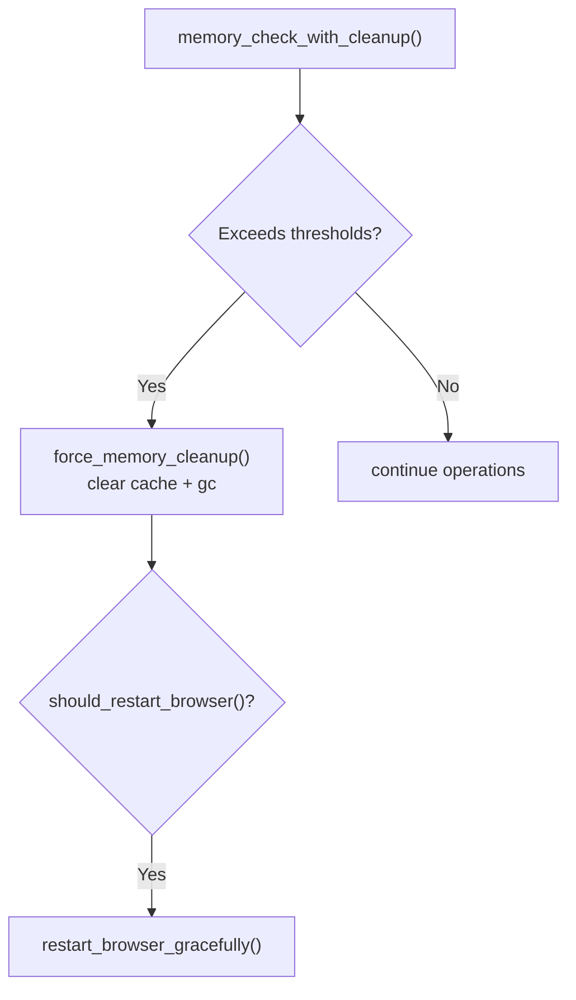
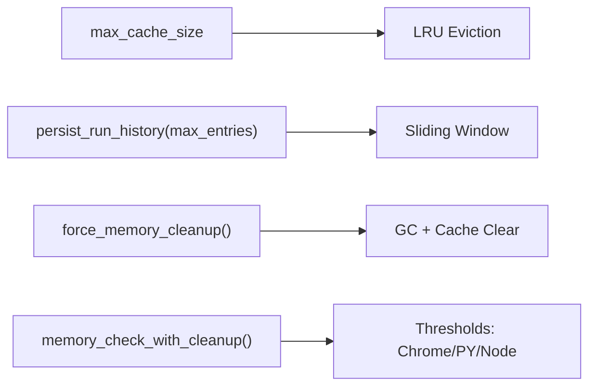
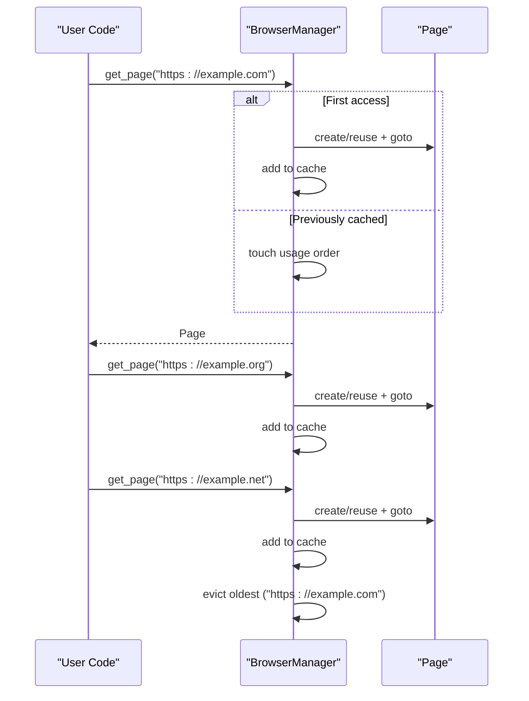
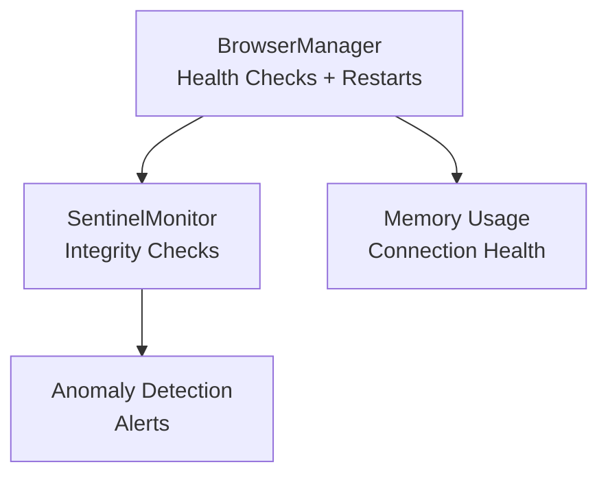
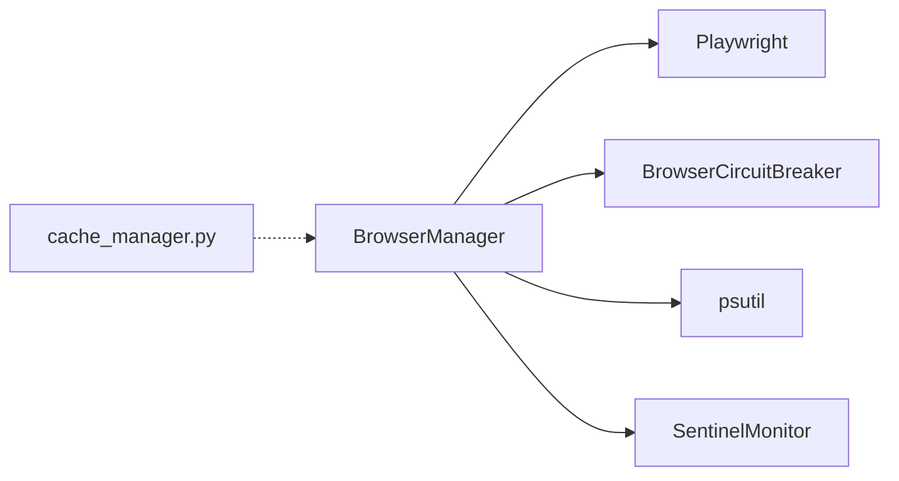

# Page Caching System

<cite>
**Referenced Files in This Document**
- [browser_manager.py](file://utils/browser_manager.py)
- [browser_circuit_breaker.py](file://utils/browser_circuit_breaker.py)
- [browser_manager.py](file://diagnostics/audit_bundle_20250905_001040/browser_manager.py)
- [cache_manager.py](file://tools/cache_manager.py)
- [sentinel_monitor.py](file://utils/sentinel_monitor.py)
- [memory_store.py](file://src/fba_agent/memory_store.py)
</cite>

## Table of Contents
1. [Introduction](#introduction)
2. [Project Structure](#project-structure)
3. [Core Components](#core-components)
4. [Architecture Overview](#architecture-overview)
5. [Detailed Component Analysis](#detailed-component-analysis)
6. [Dependency Analysis](#dependency-analysis)
7. [Performance Considerations](#performance-considerations)
8. [Troubleshooting Guide](#troubleshooting-guide)
9. [Conclusion](#conclusion)

## Introduction
This document explains the page caching system within the BrowserManager, focusing on the LRU (Least Recently Used) cache implementation, configurable cache sizing, page usage tracking, automatic eviction policies, and lifecycle management. It also covers cache invalidation strategies, memory optimization techniques, and performance considerations. Finally, it details how page caching relates to browser health monitoring and contributes to system stability and performance.

## Project Structure
The page caching system is centered around the BrowserManager singleton, which orchestrates a persistent Chrome instance via Playwright’s CDP connection and maintains a bounded LRU cache of pages. Supporting modules include a circuit breaker for resilience and a sentinel monitor for health tracking.

**Diagram sources**
- [browser_manager.py](file://utils/browser_manager.py#L35-L120)
- [browser_circuit_breaker.py](file://utils/browser_circuit_breaker.py#L37-L70)
- [cache_manager.py](file://tools/cache_manager.py)
- [sentinel_monitor.py](file://utils/sentinel_monitor.py#L1-L200)
- [memory_store.py](file://src/fba_agent/memory_store.py#L104-L131)

**Section sources**
- [browser_manager.py](file://utils/browser_manager.py#L35-L120)

## Core Components
- BrowserManager: Singleton that manages a persistent Chrome instance and an LRU page cache. It enforces a configurable maximum cache size and tracks usage order for eviction.
- BrowserCircuitBreaker: Protects long-running browser operations from cascading failures by gating operations after repeated failures.
- SentinelMonitor: Tracks system health and integrity metrics to detect anomalies that may impact browser stability.
- cache_manager.py: Provides tool-level cache utilities that complement BrowserManager’s page cache.
- memory_store.py: Supplies run history and calibration persistence used in conjunction with browser operations.

**Section sources**
- [browser_manager.py](file://utils/browser_manager.py#L35-L120)
- [browser_circuit_breaker.py](file://utils/browser_circuit_breaker.py#L37-L70)
- [sentinel_monitor.py](file://utils/sentinel_monitor.py#L1-L200)
- [cache_manager.py](file://tools/cache_manager.py)
- [memory_store.py](file://src/fba_agent/memory_store.py#L104-L131)

## Architecture Overview
The BrowserManager coordinates browser lifecycle and page caching. It connects to an existing Chrome instance via CDP, maintains a bounded LRU cache keyed by URL, and applies health checks and restart policies to maintain stability.

**Diagram sources**
- [browser_manager.py](file://utils/browser_manager.py#L141-L198)
- [browser_manager.py](file://utils/browser_manager.py#L200-L208)
- [browser_manager.py](file://utils/browser_manager.py#L848-L938)
- [browser_manager.py](file://utils/browser_manager.py#L985-L1018)
- [browser_circuit_breaker.py](file://utils/browser_circuit_breaker.py#L72-L111)

## Detailed Component Analysis

### LRU Page Cache Implementation
- Data structures:
  - page_cache: dictionary mapping URL to Page object.
  - page_usage_order: list maintaining insertion/recent access order for eviction.
- Eviction policy:
  - When cache reaches max size, the least recently used item (oldest in usage order) is removed.
- Configurable cache size:
  - max_cache_size controls the upper bound of cached pages.
- Usage tracking:
  - Accessing a cached URL moves it to the end of the usage order.
- Navigation integration:
  - Newly navigated pages are added to the cache after successful navigation.

**Diagram sources**
- [browser_manager.py](file://utils/browser_manager.py#L141-L198)
- [browser_manager.py](file://utils/browser_manager.py#L200-L208)
- [browser_manager.py](file://utils/browser_manager.py#L848-L938)
- [browser_manager.py](file://utils/browser_manager.py#L985-L1018)
- [browser_circuit_breaker.py](file://utils/browser_circuit_breaker.py#L72-L111)

**Section sources**
- [browser_manager.py](file://utils/browser_manager.py#L50-L61)
- [browser_manager.py](file://utils/browser_manager.py#L141-L198)
- [browser_manager.py](file://utils/browser_manager.py#L200-L208)

### Page Lifecycle Management
- Creation:
  - Pages are created within a persistent context; reused when available.
- Reuse:
  - Existing pages are reused to reduce overhead; URLs are tracked for LRU semantics.
- Navigation:
  - Navigations occur under circuit breaker protection to mitigate transient failures.
- Cleanup:
  - On restart or shutdown, the BrowserManager disconnects from the persistent browser and clears local references without closing the external Chrome instance.

**Diagram sources**
- [browser_manager.py](file://utils/browser_manager.py#L164-L198)
- [browser_manager.py](file://utils/browser_manager.py#L1020-L1068)

**Section sources**
- [browser_manager.py](file://utils/browser_manager.py#L164-L198)
- [browser_manager.py](file://utils/browser_manager.py#L1020-L1068)

### Cache Invalidation Strategies
- Time-based restart:
  - Periodic restarts (every 2.5 hours) proactively prevent CDP connection degradation and memory accumulation.
- Memory-based cleanup:
  - Aggressive cleanup clears the page cache and triggers garbage collection when thresholds are exceeded.
- Connection failure monitoring:
  - Excessive connection failures trigger restart decisions.

**Diagram sources**
- [browser_manager.py](file://utils/browser_manager.py#L940-L978)
- [browser_manager.py](file://utils/browser_manager.py#L816-L847)
- [browser_manager.py](file://utils/browser_manager.py#L885-L938)

**Section sources**
- [browser_manager.py](file://utils/browser_manager.py#L885-L938)
- [browser_manager.py](file://utils/browser_manager.py#L940-L978)
- [browser_manager.py](file://utils/browser_manager.py#L816-L847)

### Memory Optimization Techniques
- Bounded cache:
  - max_cache_size limits memory footprint of cached pages.
- Sliding window for run history:
  - Run history persistence keeps only recent entries to constrain memory growth.
- Garbage collection:
  - Explicit GC during cleanup reduces retained memory.
- System-aware thresholds:
  - Separate thresholds for Chrome, Python, and Node.js memory to balance resource usage.

**Diagram sources**
- [browser_manager.py](file://utils/browser_manager.py#L52-L61)
- [browser_manager.py](file://utils/browser_manager.py#L104-L131)
- [browser_manager.py](file://utils/browser_manager.py#L816-L847)
- [browser_manager.py](file://utils/browser_manager.py#L940-L978)

**Section sources**
- [browser_manager.py](file://utils/browser_manager.py#L52-L61)
- [memory_store.py](file://src/fba_agent/memory_store.py#L104-L131)
- [browser_manager.py](file://utils/browser_manager.py#L816-L847)
- [browser_manager.py](file://utils/browser_manager.py#L940-L978)

### Performance Considerations
- Connection stability:
  - Circuit breaker protects navigation operations from transient failures.
- Restart cadence:
  - Time-based restarts prevent long-running degradation.
- Minimal focus operations:
  - Avoid bringing pages to front to reduce aggressive browser focus and improve stability.
- IPv6/IPv4 endpoint selection:
  - Dynamic endpoint detection improves compatibility with newer Chrome versions.

**Section sources**
- [browser_circuit_breaker.py](file://utils/browser_circuit_breaker.py#L72-L111)
- [browser_manager.py](file://utils/browser_manager.py#L885-L938)
- [browser_manager.py](file://utils/browser_manager.py#L154-L172)
- [browser_manager.py](file://utils/browser_manager.py#L273-L300)

### Cache Workflows and Scenarios
- Cache hit:
  - Accessing a previously cached URL updates its position in the usage order and returns the cached Page.
- Cache miss:
  - A new Page is created or reused, navigated to the requested URL, and added to the cache.
- Eviction:
  - When adding a new page causes the cache to exceed max_cache_size, the oldest entry is removed.

**Diagram sources**
- [browser_manager.py](file://utils/browser_manager.py#L141-L198)
- [browser_manager.py](file://utils/browser_manager.py#L200-L208)
- [browser_manager.py](file://utils/browser_manager.py#L1125-L1153)

**Section sources**
- [browser_manager.py](file://utils/browser_manager.py#L141-L198)
- [browser_manager.py](file://utils/browser_manager.py#L200-L208)
- [browser_manager.py](file://utils/browser_manager.py#L1125-L1153)

### Relationship to Browser Health Monitoring
- SentinelMonitor tracks totals divergence, path variants, and save retries to detect anomalies that may correlate with browser instability.
- BrowserManager’s health checks and restart policies act as a first line of defense, while SentinelMonitor provides higher-level integrity signals.

**Diagram sources**
- [browser_manager.py](file://utils/browser_manager.py#L848-L938)
- [sentinel_monitor.py](file://utils/sentinel_monitor.py#L1-L200)

**Section sources**
- [browser_manager.py](file://utils/browser_manager.py#L848-L938)
- [sentinel_monitor.py](file://utils/sentinel_monitor.py#L1-L200)

## Dependency Analysis
- BrowserManager depends on:
  - Playwright for CDP connections and page management.
  - BrowserCircuitBreaker for resilient navigation.
  - psutil for memory telemetry.
  - SentinelMonitor for health signals.
- Tool-level cache utilities (cache_manager.py) complement BrowserManager’s page cache for broader caching needs.

**Diagram sources**
- [browser_manager.py](file://utils/browser_manager.py#L19-L26)
- [browser_circuit_breaker.py](file://utils/browser_circuit_breaker.py#L25-L31)
- [cache_manager.py](file://tools/cache_manager.py)

**Section sources**
- [browser_manager.py](file://utils/browser_manager.py#L19-L26)
- [browser_circuit_breaker.py](file://utils/browser_circuit_breaker.py#L25-L31)
- [cache_manager.py](file://tools/cache_manager.py)

## Performance Considerations
- Prefer reuse over recreation:
  - Reuse existing pages when available to minimize overhead.
- Limit cache size:
  - Keep max_cache_size aligned with workload concurrency and memory budget.
- Use circuit breaker for navigation:
  - Prevents cascading failures during unstable sessions.
- Proactive restarts:
  - Time-based restarts mitigate long-running connection degradation.
- Monitor memory:
  - Use memory_check_with_cleanup to trigger cleanup before thresholds are exceeded.

[No sources needed since this section provides general guidance]

## Troubleshooting Guide
- Connection failures:
  - Verify Chrome debug port accessibility and correct endpoint selection (IPv6/IPv4).
- Frequent restarts:
  - Investigate memory pressure and adjust thresholds or increase restart frequency.
- Navigation failures:
  - Use the circuit breaker status to diagnose recurring issues.
- Cleanup effectiveness:
  - Confirm force_memory_cleanup clears cache and invokes garbage collection.

**Section sources**
- [browser_manager.py](file://utils/browser_manager.py#L242-L300)
- [browser_manager.py](file://utils/browser_manager.py#L885-L938)
- [browser_circuit_breaker.py](file://utils/browser_circuit_breaker.py#L174-L183)
- [browser_manager.py](file://utils/browser_manager.py#L816-L847)

## Conclusion
The BrowserManager’s LRU page caching system, combined with health monitoring and restart policies, provides a robust foundation for long-running browser automation. By bounding memory usage, protecting operations with a circuit breaker, and proactively managing resources, the system maintains stability and performance across extended sessions. Integrating with SentinelMonitor further strengthens reliability by detecting anomalies that may impact browser health.