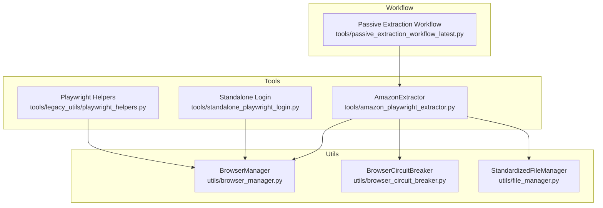
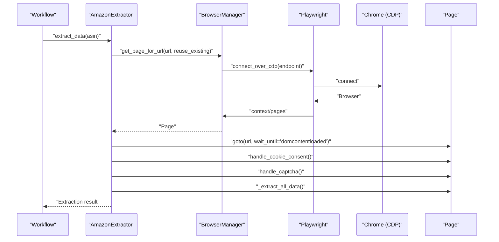
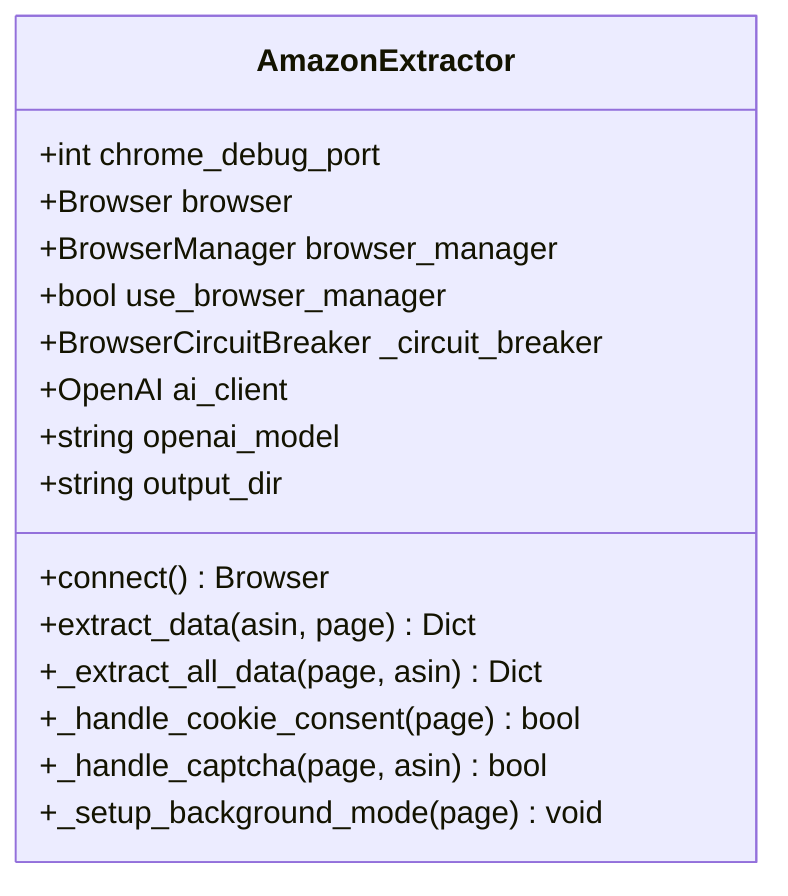
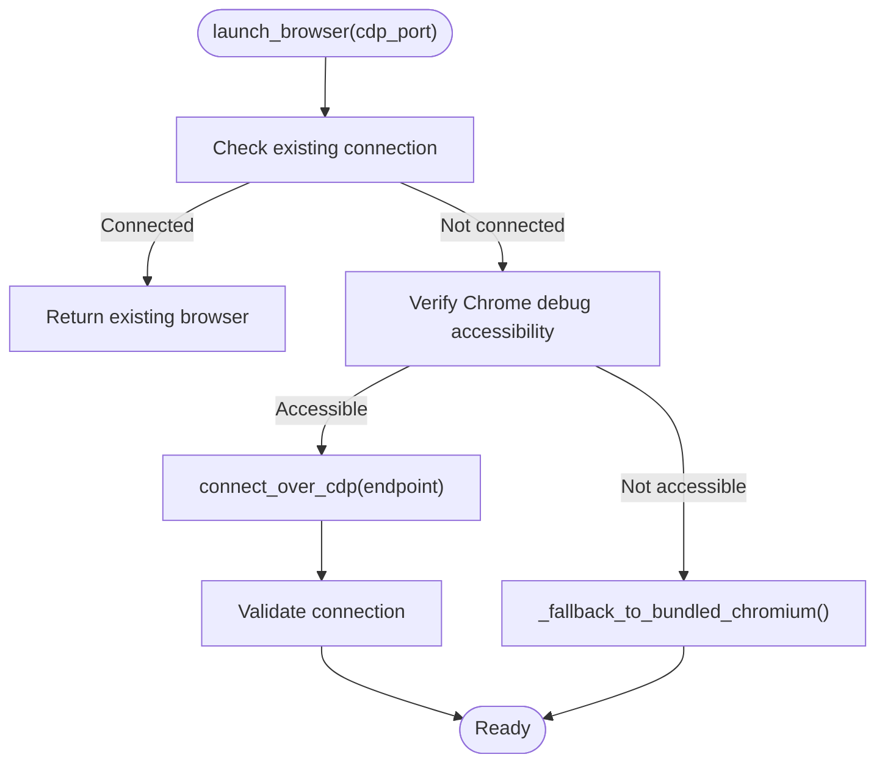
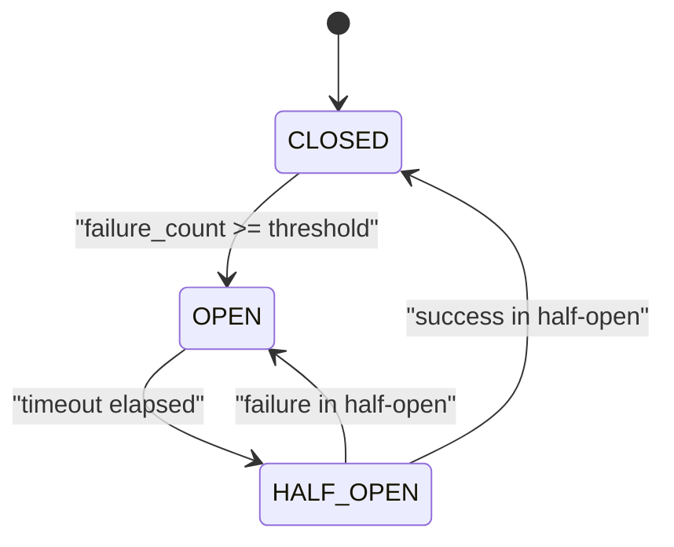
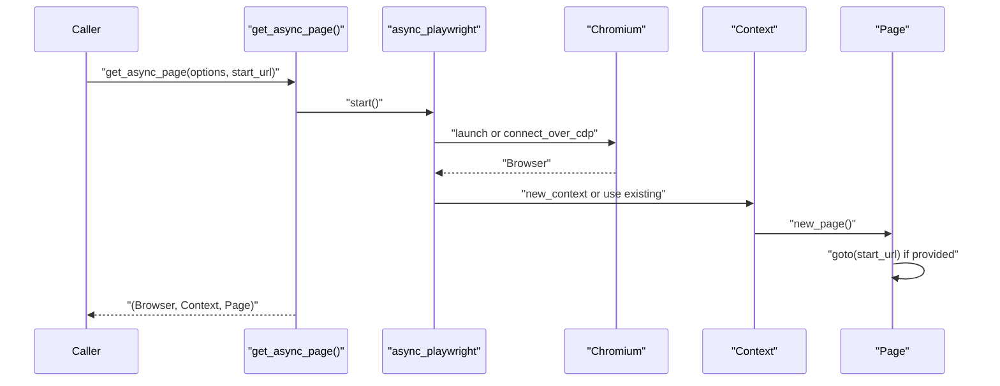
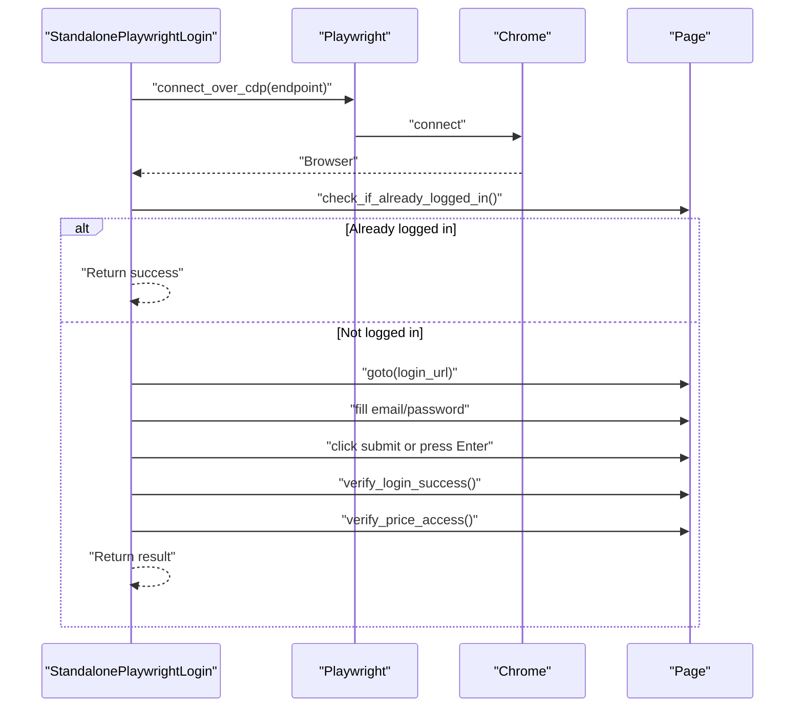
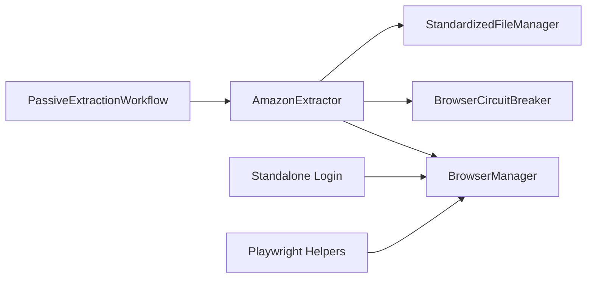

# Playwright Integration

<cite>
**Referenced Files in This Document**
- [amazon_playwright_extractor.py](file://tools/amazon_playwright_extractor.py)
- [playwright_helpers.py](file://tools/legacy_utils/playwright_helpers.py)
- [standalone_playwright_login.py](file://tools/standalone_playwright_login.py)
- [browser_manager.py](file://utils/browser_manager.py)
- [browser_circuit_breaker.py](file://utils/browser_circuit_breaker.py)
- [file_manager.py](file://utils/file_manager.py)
- [passive_extraction_workflow_latest.py](file://tools/passive_extraction_workflow_latest.py)
</cite>

## Table of Contents
1. [Introduction](#introduction)
2. [Project Structure](#project-structure)
3. [Core Components](#core-components)
4. [Architecture Overview](#architecture-overview)
5. [Detailed Component Analysis](#detailed-component-analysis)
6. [Dependency Analysis](#dependency-analysis)
7. [Performance Considerations](#performance-considerations)
8. [Troubleshooting Guide](#troubleshooting-guide)
9. [Conclusion](#conclusion)

## Introduction
This document explains the Playwright integration within the browser automation system, focusing on async Playwright API usage, browser context management, and page lifecycle operations. It details connection strategies for existing Chrome instances and bundled Chromium, CDP endpoint handling, protocol compatibility, page navigation workflows, element interaction patterns, and data extraction techniques. It also covers error handling, performance optimization, and integration with Amazon extractor components to enable reliable web scraping automation.

## Project Structure
The Playwright integration spans several modules:
- Tools: Amazon extractor and auxiliary helpers for standalone tasks
- Utils: Centralized browser management and circuit breaker
- Workflow: Orchestration that coordinates extraction and caching

**Diagram sources**
- [amazon_playwright_extractor.py](file://tools/amazon_playwright_extractor.py#L63-L122)
- [playwright_helpers.py](file://tools/legacy_utils/playwright_helpers.py#L44-L98)
- [standalone_playwright_login.py](file://tools/standalone_playwright_login.py#L98-L131)
- [browser_manager.py](file://utils/browser_manager.py#L35-L140)
- [browser_circuit_breaker.py](file://utils/browser_circuit_breaker.py#L37-L111)
- [file_manager.py](file://utils/file_manager.py#L14-L115)
- [passive_extraction_workflow_latest.py](file://tools/passive_extraction_workflow_latest.py#L136-L173)

**Section sources**
- [amazon_playwright_extractor.py](file://tools/amazon_playwright_extractor.py#L1-L120)
- [browser_manager.py](file://utils/browser_manager.py#L1-L120)
- [passive_extraction_workflow_latest.py](file://tools/passive_extraction_workflow_latest.py#L136-L173)

## Core Components
- AmazonExtractor: Orchestrates Playwright-powered Amazon data extraction, including navigation, cookie consent, CAPTCHA handling, and data extraction from page and browser extensions.
- BrowserManager: Singleton that manages a persistent Chrome instance via CDP, provides page caching, and enforces health checks and restart policies.
- BrowserCircuitBreaker: Protects long-running browser operations from cascading failures with configurable thresholds and recovery.
- Playwright Helpers: Utilities for launching browsers, connecting to Chrome via CDP, and obtaining pages for auxiliary tasks.
- Standalone Playwright Login: Login flow for suppliers using Playwright selectors, with robust verification of price access.
- StandardizedFileManager: Centralized file management for cache and output directories.

**Section sources**
- [amazon_playwright_extractor.py](file://tools/amazon_playwright_extractor.py#L63-L122)
- [browser_manager.py](file://utils/browser_manager.py#L35-L140)
- [browser_circuit_breaker.py](file://utils/browser_circuit_breaker.py#L37-L111)
- [playwright_helpers.py](file://tools/legacy_utils/playwright_helpers.py#L44-L98)
- [standalone_playwright_login.py](file://tools/standalone_playwright_login.py#L33-L131)
- [file_manager.py](file://utils/file_manager.py#L14-L115)

## Architecture Overview
The system connects to an existing Chrome instance via CDP, reuses pages to preserve extension state, and executes extraction with background-mode safeguards. Circuit breaker and health checks protect long sessions.

**Diagram sources**
- [amazon_playwright_extractor.py](file://tools/amazon_playwright_extractor.py#L317-L466)
- [browser_manager.py](file://utils/browser_manager.py#L141-L198)
- [playwright_helpers.py](file://tools/legacy_utils/playwright_helpers.py#L157-L182)

## Detailed Component Analysis

### AmazonExtractor
Responsibilities:
- Connect to Chrome via BrowserManager singleton
- Manage page lifecycle (reuse, background mode, dead page detection)
- Handle cookie consent and CAPTCHA
- Extract product data from page and browser extensions
- Integrate AI fallbacks (disabled in current implementation)
- Persist outputs to standardized cache directories

Key behaviors:
- Background mode setup prevents browser focus and keeps pages off-screen
- Navigation guarded by URL checks and circuit breaker
- Extension data preserved by avoiding page closure
- Output directory managed centrally

**Diagram sources**
- [amazon_playwright_extractor.py](file://tools/amazon_playwright_extractor.py#L63-L122)
- [amazon_playwright_extractor.py](file://tools/amazon_playwright_extractor.py#L317-L466)

**Section sources**
- [amazon_playwright_extractor.py](file://tools/amazon_playwright_extractor.py#L97-L122)
- [amazon_playwright_extractor.py](file://tools/amazon_playwright_extractor.py#L317-L466)
- [amazon_playwright_extractor.py](file://tools/amazon_playwright_extractor.py#L467-L776)

### BrowserManager
Responsibilities:
- Singleton browser manager with LRU page cache
- Connect to existing Chrome via CDP (preferred) or fallback to bundled Chromium
- Detect Chrome protocol version and choose compatible connection strategy
- Enforce health checks, memory monitoring, and periodic restarts
- Provide page acquisition with reuse and navigation under circuit breaker

Connection strategies:
- Prefer CDP to existing Chrome debug instance
- IPv6/IPv4 endpoint selection for Chrome 139+ compatibility
- Enhanced compatibility mode with progressive timeouts and slow motion
- Fallback to Playwright’s bundled Chromium when CDP fails

**Diagram sources**
- [browser_manager.py](file://utils/browser_manager.py#L77-L140)
- [browser_manager.py](file://utils/browser_manager.py#L209-L241)
- [browser_manager.py](file://utils/browser_manager.py#L273-L300)

**Section sources**
- [browser_manager.py](file://utils/browser_manager.py#L77-L140)
- [browser_manager.py](file://utils/browser_manager.py#L209-L241)
- [browser_manager.py](file://utils/browser_manager.py#L273-L300)

### BrowserCircuitBreaker
Responsibilities:
- Protect async browser operations from cascading failures
- Track failures and enforce OPEN/HALF_OPEN/CLOSED states
- Provide recovery timeout and half-open testing

**Diagram sources**
- [browser_circuit_breaker.py](file://utils/browser_circuit_breaker.py#L37-L111)

**Section sources**
- [browser_circuit_breaker.py](file://utils/browser_circuit_breaker.py#L37-L111)

### Playwright Helpers
Capabilities:
- Launch browser and context (persistent or ephemeral)
- Connect to existing Chrome via CDP
- Obtain a ready-to-use page with navigation

**Diagram sources**
- [playwright_helpers.py](file://tools/legacy_utils/playwright_helpers.py#L122-L154)
- [playwright_helpers.py](file://tools/legacy_utils/playwright_helpers.py#L157-L182)

**Section sources**
- [playwright_helpers.py](file://tools/legacy_utils/playwright_helpers.py#L44-L98)
- [playwright_helpers.py](file://tools/legacy_utils/playwright_helpers.py#L122-L154)
- [playwright_helpers.py](file://tools/legacy_utils/playwright_helpers.py#L157-L182)

### Standalone Playwright Login
Capabilities:
- Connect to shared Chrome via CDP
- Detect already logged-in state via price visibility
- Fill login form with robust selector fallbacks
- Submit form and verify success and price access
- Provide detailed error handling and retries

**Diagram sources**
- [standalone_playwright_login.py](file://tools/standalone_playwright_login.py#L98-L131)
- [standalone_playwright_login.py](file://tools/standalone_playwright_login.py#L183-L390)
- [standalone_playwright_login.py](file://tools/standalone_playwright_login.py#L449-L541)

**Section sources**
- [standalone_playwright_login.py](file://tools/standalone_playwright_login.py#L98-L131)
- [standalone_playwright_login.py](file://tools/standalone_playwright_login.py#L183-L390)
- [standalone_playwright_login.py](file://tools/standalone_playwright_login.py#L449-L541)

### Data Extraction and Caching
- AmazonExtractor writes extraction results to standardized cache directories via StandardizedFileManager
- Output directory is resolved centrally; screenshots can be conditionally captured for debugging

**Section sources**
- [amazon_playwright_extractor.py](file://tools/amazon_playwright_extractor.py#L85-L90)
- [file_manager.py](file://utils/file_manager.py#L256-L287)

## Dependency Analysis
The Amazon extraction workflow depends on:
- BrowserManager for CDP connections and page reuse
- BrowserCircuitBreaker for safe navigation and page operations
- StandardizedFileManager for consistent output paths
- Workflow orchestration to coordinate supplier authentication and Amazon matching

**Diagram sources**
- [passive_extraction_workflow_latest.py](file://tools/passive_extraction_workflow_latest.py#L136-L173)
- [amazon_playwright_extractor.py](file://tools/amazon_playwright_extractor.py#L21-L56)
- [browser_manager.py](file://utils/browser_manager.py#L1-L35)
- [browser_circuit_breaker.py](file://utils/browser_circuit_breaker.py#L1-L36)
- [file_manager.py](file://utils/file_manager.py#L1-L20)
- [playwright_helpers.py](file://tools/legacy_utils/playwright_helpers.py#L1-L20)
- [standalone_playwright_login.py](file://tools/standalone_playwright_login.py#L14-L22)

**Section sources**
- [passive_extraction_workflow_latest.py](file://tools/passive_extraction_workflow_latest.py#L136-L173)
- [amazon_playwright_extractor.py](file://tools/amazon_playwright_extractor.py#L21-L56)

## Performance Considerations
- Reuse pages to preserve extension state and avoid repeated extension load times
- Use circuit breaker to prevent cascading failures during long runs
- Prefer CDP to existing Chrome to leverage user profile and extensions
- Apply background-mode safeguards to avoid browser focus and minimize UI overhead
- Monitor memory usage and restart browser periodically to prevent resource exhaustion
- Use stabilized waits after navigation and extension data loading

[No sources needed since this section provides general guidance]

## Troubleshooting Guide
Common issues and resolutions:
- Chrome debug port not accessible: verify port binding and HTTP endpoint responsiveness
- IPv6 vs IPv4 CDP endpoint: BrowserManager detects and selects appropriate endpoint
- Protocol 1.3 compatibility: enhanced compatibility mode with progressive timeouts
- Connection failures: circuit breaker opens after threshold failures; recover after timeout
- Memory pressure: BrowserManager monitors Chrome memory and triggers restarts

**Section sources**
- [browser_manager.py](file://utils/browser_manager.py#L242-L300)
- [browser_manager.py](file://utils/browser_manager.py#L398-L428)
- [browser_manager.py](file://utils/browser_manager.py#L566-L621)
- [browser_circuit_breaker.py](file://utils/browser_circuit_breaker.py#L112-L173)

## Conclusion
The Playwright integration leverages a centralized BrowserManager to connect to an existing Chrome instance via CDP, preserving user profiles and extensions. AmazonExtractor orchestrates robust navigation, cookie consent, CAPTCHA handling, and extraction with background-mode safeguards. Circuit breaker and health monitoring ensure reliability during extended scraping sessions. Together, these components deliver a scalable, maintainable, and resilient browser automation system for Amazon data extraction.