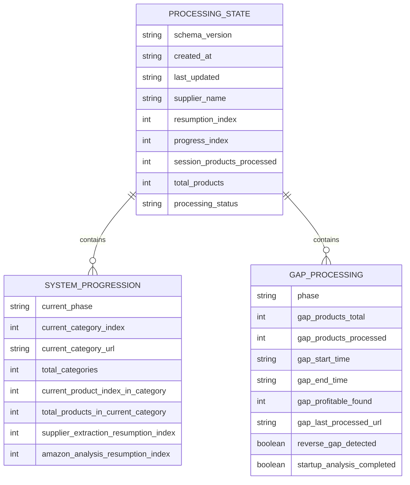
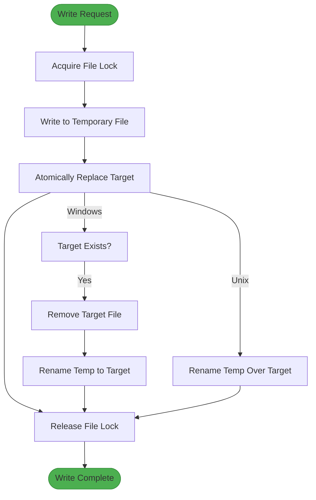
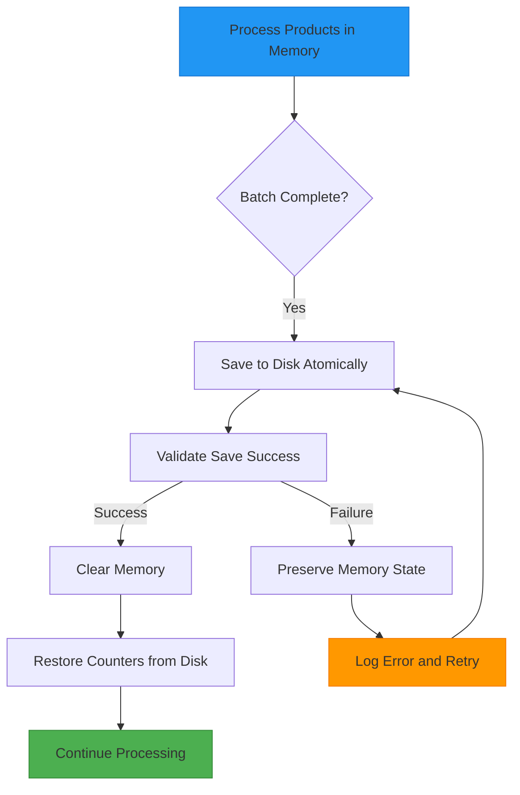
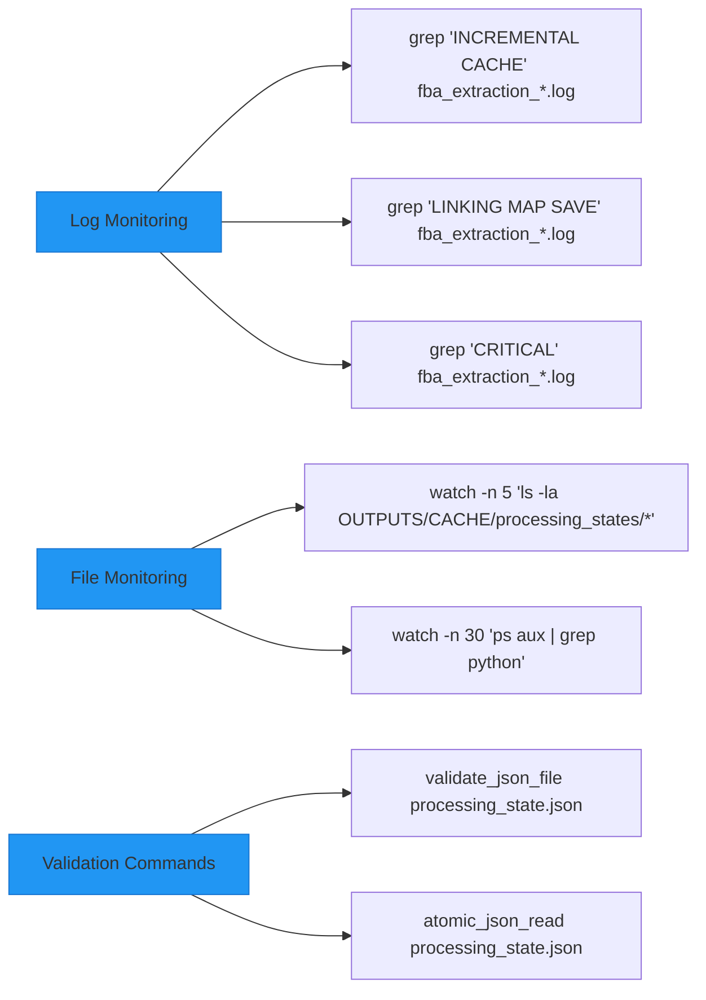

# Cache Persistence and Memory Management

<cite>
**Referenced Files in This Document**   
- [data_store.py](file://utils/data_store.py)
- [atomic_file_operations.py](file://utils/atomic_file_operations.py)
- [fixed_enhanced_state_manager.py](file://utils/fixed_enhanced_state_manager.py)
- [CACHE_MONITORING_SYSTEM.md](file://CACHE_MONITORING_SYSTEM.md)
- [MEMORY_MANAGEMENT_ANALYSIS.md](file://MEMORY_MANAGEMENT_ANALYSIS.md)
</cite>

## Table of Contents
1. [Introduction](#introduction)
2. [Processing State Persistence](#processing-state-persistence)
3. [Atomic File Operations](#atomic-file-operations)
4. [Memory Management Strategies](#memory-management-strategies)
5. [State Validation and Recovery](#state-validation-and-recovery)
6. [Monitoring and Diagnostics](#monitoring-and-diagnostics)
7. [Future Enhancements](#future-enhancements)
8. [Conclusion](#conclusion)

## Introduction

The Amazon FBA Agent System implements a sophisticated cache persistence and memory management architecture designed to ensure data integrity, enable resumable operations, and maintain optimal performance during long-running extraction processes. This document details the mechanisms used to serialize and store processing states, manage memory efficiently, and guarantee data consistency through atomic operations. The system's resilience to interruptions and its ability to recover from failures are central to its reliability in production environments.

## Processing State Persistence

The system persists processing states in the OUTPUTS/CACHE/processing_states directory to enable resumable operations after interruptions. The state manager serializes the current processing context, including category indices, product counters, and phase-specific progress, into JSON files that serve as checkpoints. This allows the system to resume from the exact point of interruption rather than restarting from the beginning.

The state persistence mechanism separates resumption logic from progress tracking by maintaining distinct indices: `resumption_index` for determining where to restart after an interruption, and `progress_index` for tracking current session progress. This architectural separation prevents the common issue of progress counters being reset to zero during restarts.

**Diagram sources**
- [fixed_enhanced_state_manager.py](file://utils/fixed_enhanced_state_manager.py#L100-L200)

**Section sources**
- [fixed_enhanced_state_manager.py](file://utils/fixed_enhanced_state_manager.py#L50-L300)

## Atomic File Operations

The system employs atomic file operations to ensure data integrity during write operations. The `atomic_file_operations.py` module provides thread-safe, cross-platform file operations that prevent data corruption during concurrent access. The implementation uses file locking mechanisms that are compatible with both Windows and Unix-based systems.

Atomic writes follow the pattern of writing to a temporary file first, then atomically replacing the target file. This approach ensures that readers always access complete, valid data, as partially written files are never exposed. On Windows systems, the implementation handles the lack of atomic rename operations by first removing the target file before renaming the temporary file.

**Diagram sources**
- [atomic_file_operations.py](file://utils/atomic_file_operations.py#L50-L100)

**Section sources**
- [atomic_file_operations.py](file://utils/atomic_file_operations.py#L1-L200)

## Memory Management Strategies

The system implements a hybrid memory management strategy that balances in-memory processing performance with disk-based persistence to prevent memory bloat. The architecture follows a multi-layered approach to memory clearing, where data is periodically synchronized to disk before memory is cleared.

Key memory efficiency techniques include:
- **Minimal overhead hash table design**: Optimized data structures with less than 4x memory overhead
- **Index invalidation**: Automatic cleanup of stale indexes and cache entries
- **Periodic memory clearing**: Memory is cleared at configurable intervals (default every 100 products)
- **File-based fallback**: Critical progress tracking is preserved by reading from disk files after memory clearing

The system uses a dual-tracking approach with separate counters for memory management and progress tracking. This prevents dependencies between memory state and progress indicators, ensuring that progress can be accurately tracked even as memory is cleared and rebuilt.

**Diagram sources**
- [MEMORY_MANAGEMENT_ANALYSIS.md](file://MEMORY_MANAGEMENT_ANALYSIS.md#L50-L100)
- [fixed_enhanced_state_manager.py](file://utils/fixed_enhanced_state_manager.py#L300-L400)

**Section sources**
- [MEMORY_MANAGEMENT_ANALYSIS.md](file://MEMORY_MANAGEMENT_ANALYSIS.md#L1-L230)
- [fixed_enhanced_state_manager.py](file://utils/fixed_enhanced_state_manager.py#L300-L500)

## State Validation and Recovery

The state management system includes comprehensive validation and recovery mechanisms to ensure data consistency. The `validate_and_repair_state` method checks for missing keys, bounds violations, and structural integrity, automatically repairing issues when detected. This validation occurs during state loading and at critical processing points.

For recovery from interruptions, the system implements a monotonicity guard that prevents the resumption pointer from regressing to an earlier position. The high-water mark pattern tracks the maximum progress achieved, ensuring that subsequent runs never resume from a point earlier than the previous run's maximum progress.

The system also implements reverse gap detection, which identifies situations where the linking map contains more entries than the product cache. This indicates a potential data inconsistency that requires resolution, either by preserving the existing resume index or resetting to zero based on configuration settings.

**Section sources**
- [fixed_enhanced_state_manager.py](file://utils/fixed_enhanced_state_manager.py#L500-L700)

## Monitoring and Diagnostics

The system provides extensive monitoring capabilities for cache persistence and memory management. Key metrics are logged for real-time monitoring, including:
- Memory clearing events with file-based fallback
- Incremental cache update status
- Atomic save success/failure indicators
- Hash lookup performance statistics

Diagnostic tools include timestamp monitoring of cache files, JSON integrity validation, and comprehensive telemetry logging of all save operations. The system logs detailed information about each atomic write attempt, including execution time, strategy used, and success status.

**Diagram sources**
- [CACHE_MONITORING_SYSTEM.md](file://CACHE_MONITORING_SYSTEM.md#L100-L120)

**Section sources**
- [CACHE_MONITORING_SYSTEM.md](file://CACHE_MONITORING_SYSTEM.md#L1-L122)

## Future Enhancements

Future enhancements to the cache persistence and memory management system include:

### Persistent Disk-Based Indexing
Implementing persistent disk-based indexing would allow hash tables and other data structures to be preserved between sessions, significantly reducing startup time for large datasets. This would involve serializing optimized indexes to disk and loading them at startup, with mechanisms to detect and rebuild stale indexes.

### Distributed Caching
The system could be extended to support distributed caching across multiple nodes, enabling horizontal scaling for very large product catalogs. This would involve implementing a shared cache layer using technologies like Redis or a distributed file system.

### Advanced Memory Optimization
Additional memory optimization techniques could include:
- **Predictive caching**: Using machine learning to predict which products are likely to be accessed and pre-loading them
- **Compression**: Implementing data compression for cached products to reduce memory footprint
- **Tiered storage**: Automatically moving less frequently accessed data to slower, cheaper storage tiers

### Enhanced Monitoring
Future monitoring enhancements could include real-time dashboards, historical analytics of performance trends, and automated alerting for performance degradation.

**Section sources**
- [HASH_OPTIMIZATION_IMPLEMENTATION_SUMMARY.md](file://HASH_OPTIMIZATION_IMPLEMENTATION_SUMMARY.md#L293-L316)

## Conclusion

The Amazon FBA Agent System's cache persistence and memory management architecture provides a robust foundation for reliable, long-running data extraction processes. By combining atomic file operations, sophisticated state management, and efficient memory usage patterns, the system ensures data integrity while maintaining high performance. The separation of resumption logic from progress tracking, combined with comprehensive validation and recovery mechanisms, enables the system to handle interruptions gracefully and resume processing from the exact point of failure. Future enhancements will focus on persistent indexing, distributed caching, and advanced optimization techniques to further improve performance and scalability.