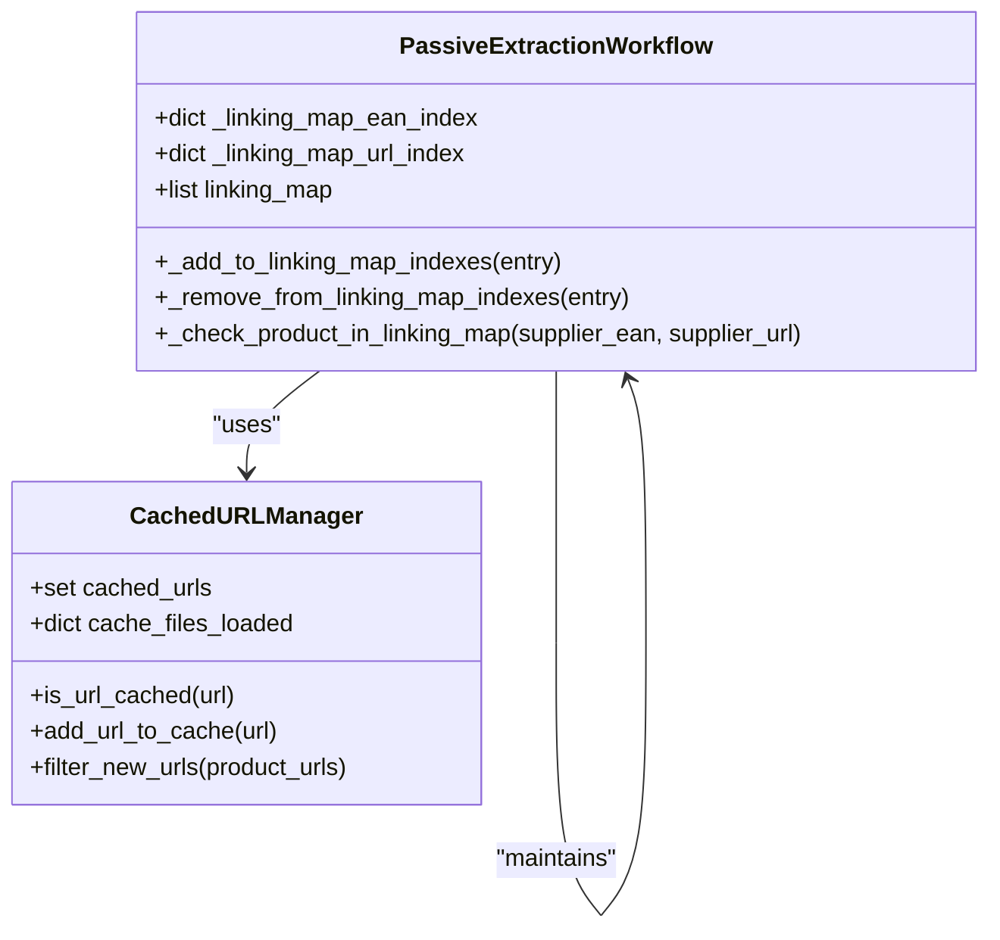
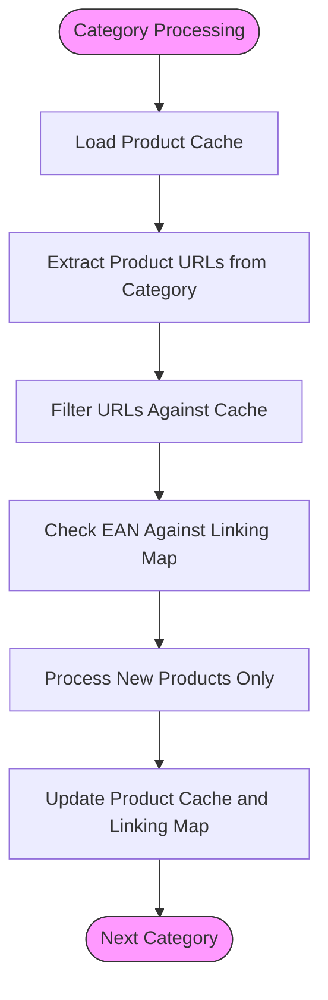

# Caching and Deduplication

<cite>
**Referenced Files in This Document**   
- [hash_lookup_methods.py](file://hash_lookup_methods.py)
- [utils/url_cache_filter.py](file://utils/url_cache_filter.py)
- [tools/passive_extraction_workflow_latest.py](file://tools/passive_extraction_workflow_latest.py)
- [config/system_config.json](file://config/system_config.json)
- [processing_states/poundwholesale_co_uk_processing_state.json](file://processing_states/poundwholesale_co_uk_processing_state.json)
</cite>

## Table of Contents
1. [Introduction](#introduction)
2. [Evolution to Hash-Based Lookup](#evolution-to-hash-based-lookup)
3. [Product Cache Indexing with Dual Hash Indexes](#product-cache-indexing-with-dual-hash-indexes)
4. [Implementation of O(1) Hash Lookup System](#implementation-of-o1-hash-lookup-system)
5. [Multi-Category Deduplication System](#multi-category-deduplication-system)
6. [Cache File Structure and Workflow Integration](#cache-file-structure-and-workflow-integration)
7. [Common Caching Issues and Solutions](#common-caching-issues-and-solutions)
8. [Relationship with State Management and Data Processing](#relationship-with-state-management-and-data-processing)
9. [Performance Impact and Optimization](#performance-impact-and-optimization)

## Introduction
The Amazon FBA Agent System employs a sophisticated caching and deduplication framework to optimize product sourcing efficiency. This document details the implementation of the O(1) hash-based lookup system, which enables instant duplicate detection through dual EAN/URL indexing. The system has evolved from inefficient O(n) linear searches to optimized hash lookups, resulting in significant performance improvements. The product cache serves as a central component in the processing workflow, preventing redundant operations and ensuring products are processed only once, even when appearing across multiple categories. This documentation covers the technical implementation, integration points, and operational benefits of the caching system, using terminology consistent with the codebase such as 'product cache', 'hash optimization', and 'duplicate prevention'.

## Evolution to Hash-Based Lookup
The system has undergone a critical performance evolution from O(n) linear search operations to O(1) hash-based lookups. Initially, duplicate detection required iterating through entire product lists, resulting in quadratic time complexity as the dataset grew. This approach became unsustainable with suppliers like poundwholesale.co.uk containing thousands of products across numerous categories. The transition to hash-based indexing represents a fundamental architectural improvement, replacing inefficient linear searches with constant-time lookups. This optimization was necessitated by performance bottlenecks observed during large-scale product extraction, where processing times scaled poorly with data volume. The implementation leverages Python's dictionary data structure, which provides average-case O(1) time complexity for insertions, deletions, and lookups. This architectural shift enables the system to maintain consistent performance regardless of dataset size, supporting the processing of extensive product catalogs without degradation in response time. The hash optimization specifically targets the most frequent operations—duplicate detection and product existence verification—ensuring these critical path operations execute with maximum efficiency.

**Section sources**
- [hash_lookup_methods.py](file://hash_lookup_methods.py#L1-L44)
- [tools/passive_extraction_workflow_latest.py](file://tools/passive_extraction_workflow_latest.py#L851-L2650)

## Product Cache Indexing with Dual Hash Indexes
The product cache implements a dual-indexing strategy using both EAN and URL hash indexes to enable comprehensive duplicate detection. This approach creates two parallel hash tables: `_linking_map_ean_index` and `_linking_map_url_index`, allowing O(1) lookups by either identifier. When a product is added to the linking map, it is simultaneously indexed in both hash tables, creating bidirectional mappings between the product identifiers and their corresponding entries. The EAN index provides a reliable method for identifying products based on their standardized barcode, while the URL index captures the supplier's web address for the product. This dual-indexing strategy ensures that duplicates can be detected regardless of whether the matching criterion is the product's universal identifier or its web location. The system prioritizes EAN-based lookups when available, falling back to URL-based matching as a secondary method. This redundancy enhances the robustness of duplicate detection, accommodating scenarios where EAN data might be missing or unreliable. The hash indexes are maintained in memory for rapid access, with automatic synchronization to ensure consistency between the indexes and the primary linking map data structure.

**Diagram sources**
- [hash_lookup_methods.py](file://hash_lookup_methods.py#L1-L44)
- [utils/url_cache_filter.py](file://utils/url_cache_filter.py#L1-L271)

## Implementation of O(1) Hash Lookup System
The O(1) hash lookup system is implemented through a suite of methods that manage the creation, maintenance, and querying of hash indexes. The `_add_to_linking_map_indexes()` method inserts a product entry into both the EAN and URL hash tables, using the respective identifiers as keys. Conversely, `_remove_from_linking_map_indexes()` ensures clean removal of entries when products are deleted or updated. The `_rebuild_linking_map_indexes()` method provides a recovery mechanism, reconstructing both hash indexes from the current state of the linking map, which is essential after deserialization or state restoration. The core lookup functionality is provided by `_check_product_in_linking_map()`, which performs a fast existence check by first attempting an EAN-based lookup and then falling back to URL-based matching if necessary. This method returns both a boolean indicating existence and the matching entry, enabling efficient retrieval without additional lookups. The `_add_linking_map_entry_with_index()` method orchestrates the atomic addition of new products, ensuring both the primary data structure and secondary indexes are updated consistently. These methods work in concert to maintain data integrity while providing optimal lookup performance, forming the backbone of the system's duplicate prevention capabilities.

**Section sources**
- [hash_lookup_methods.py](file://hash_lookup_methods.py#L1-L44)
- [tools/passive_extraction_workflow_latest.py](file://tools/passive_extraction_workflow_latest.py#L851-L2650)

## Multi-Category Deduplication System
The multi-category deduplication system ensures that products appearing across multiple categories are processed only once, preventing redundant analysis and data duplication. This is achieved through the integration of the hash-based lookup system with the category processing workflow. When extracting products from supplier categories, the system first checks the product cache using both EAN and URL identifiers before initiating any processing. This pre-filtering occurs at the category level, where the `CachedURLManager` loads existing URLs from the product cache and filters out any new URLs that already exist in the cache. The deduplication logic is applied hierarchically: first at the URL level to prevent duplicate page visits, then at the EAN level to prevent duplicate product analysis, and finally through the linking map to prevent duplicate Amazon matching operations. This multi-layered approach ensures comprehensive duplicate prevention throughout the entire processing pipeline. The system maintains a global view of processed products through the linking map, which serves as the authoritative source of truth for product processing status, regardless of the category from which the product was originally encountered.

**Diagram sources**
- [utils/url_cache_filter.py](file://utils/url_cache_filter.py#L1-L271)
- [hash_lookup_methods.py](file://hash_lookup_methods.py#L1-L44)

## Cache File Structure and Workflow Integration
The cache system integrates seamlessly with the processing workflow through a well-defined file structure and state management protocol. Cache files are organized in the OUTPUTS directory, with product caches stored in the cached_products subdirectory using a naming convention that incorporates the supplier name. The linking map, which maintains the authoritative record of processed products, is stored in the FBA_ANALYSIS/linking_maps directory. The processing state, which includes the product cache and linking map references, is maintained in the CACHE/processing_states directory, with periodic backups to ensure data integrity. The workflow begins by loading the existing processing state, which includes the current product cache and linking map. During execution, the system updates these caches incrementally, with atomic writes ensuring data consistency in case of interruptions. The integration is governed by configuration parameters in system_config.json, which control cache behavior, update frequency, and persistence strategies. This structured approach ensures that the cache system operates as a reliable, persistent component of the overall workflow, maintaining continuity across execution sessions and supporting the system's resume capabilities.

**Section sources**
- [config/system_config.json](file://config/system_config.json#L1-L300)
- [processing_states/poundwholesale_co_uk_processing_state.json](file://processing_states/poundwholesale_co_uk_processing_state.json#L1-L1437)

## Common Caching Issues and Solutions
The system addresses several common caching issues through proactive design and robust error handling. Stale data is prevented through the `supplier_cache_control` configuration, which specifies update frequencies and validation requirements. The system implements `force_update_on_interruption` to ensure cache consistency when processing is unexpectedly terminated. Memory accumulation is mitigated through the `hybrid_processing.memory_management` settings, which include mechanisms for periodic cache clearing and memory threshold monitoring. The system employs atomic file operations to prevent corruption during write operations, with backup mechanisms enabled for critical cache files. Cache integrity is verified through the `verify_cache_integrity` setting, which triggers validation routines to detect and repair inconsistencies. The dual-indexing system provides redundancy that protects against data loss in individual indexes, with the `_rebuild_linking_map_indexes()` method serving as a recovery mechanism. These solutions work together to create a resilient caching system that maintains data accuracy and system stability throughout extended processing runs.

**Section sources**
- [config/system_config.json](file://config/system_config.json#L1-L300)
- [utils/url_cache_filter.py](file://utils/url_cache_filter.py#L1-L271)

## Relationship with State Management and Data Processing
The caching system is deeply integrated with state management and data processing components, forming a cohesive architecture for reliable product analysis. The EnhancedStateManager maintains the processing state, which includes references to the product cache and linking map, ensuring continuity across execution sessions. The state manager's resume capabilities depend on the cache system to identify previously processed products, preventing redundant operations when restarting interrupted workflows. Data processing operations are gated by cache lookups, with the `_filter_unprocessed_products_with_hash_lookup()` equivalent functionality implemented through the combination of `CachedURLManager` and linking map index checks. The financial analysis phase relies on the linking map to determine which products require profitability calculations, ensuring only new or updated products are processed. This tight integration creates a feedback loop where data processing enriches the cache, and the cache optimizes subsequent processing, resulting in an efficient, self-reinforcing system. The relationship is configured through system-level toggles that coordinate cache behavior with processing phases, ensuring optimal performance and data consistency.

**Section sources**
- [tools/passive_extraction_workflow_latest.py](file://tools/passive_extraction_workflow_latest.py#L851-L2650)
- [config/system_config.json](file://config/system_config.json#L1-L300)

## Performance Impact and Optimization
The implementation of hash-based lookup has resulted in significant performance improvements, with reported gains of 20-40% in overall processing efficiency. The elimination of O(n) linear searches has dramatically reduced the time required for duplicate detection, particularly for suppliers with extensive product catalogs like poundwholesale.co.uk. The optimization is most pronounced in the early stages of processing, where the system can quickly filter out thousands of previously processed products before initiating resource-intensive operations like page scraping and Amazon matching. The performance gains are sustained across multiple processing runs, as the growing product cache provides increasing benefits through reduced redundant operations. The system's configuration parameters, such as `supplier_extraction_batch_size` and `linking_map_batch_size`, are tuned to leverage the hash optimization, ensuring that batch operations benefit from the O(1) lookup performance. These performance characteristics enable the system to process large volumes of products efficiently, supporting the comprehensive analysis of suppliers with thousands of products across numerous categories while maintaining responsive operation.

**Section sources**
- [hash_lookup_methods.py](file://hash_lookup_methods.py#L1-L44)
- [config/system_config.json](file://config/system_config.json#L1-L300)
- [processing_states/poundwholesale_co_uk_processing_state.json](file://processing_states/poundwholesale_co_uk_processing_state.json#L1-L1437)