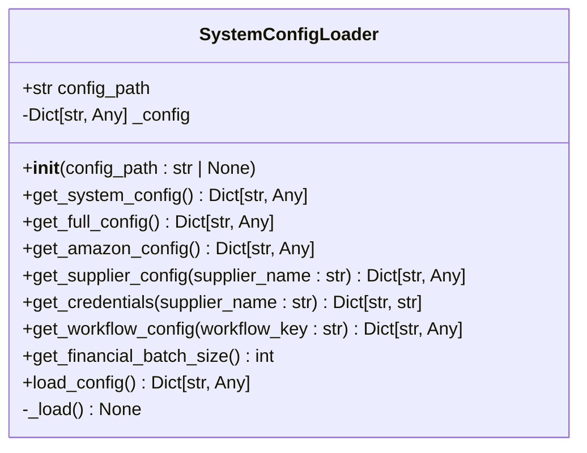
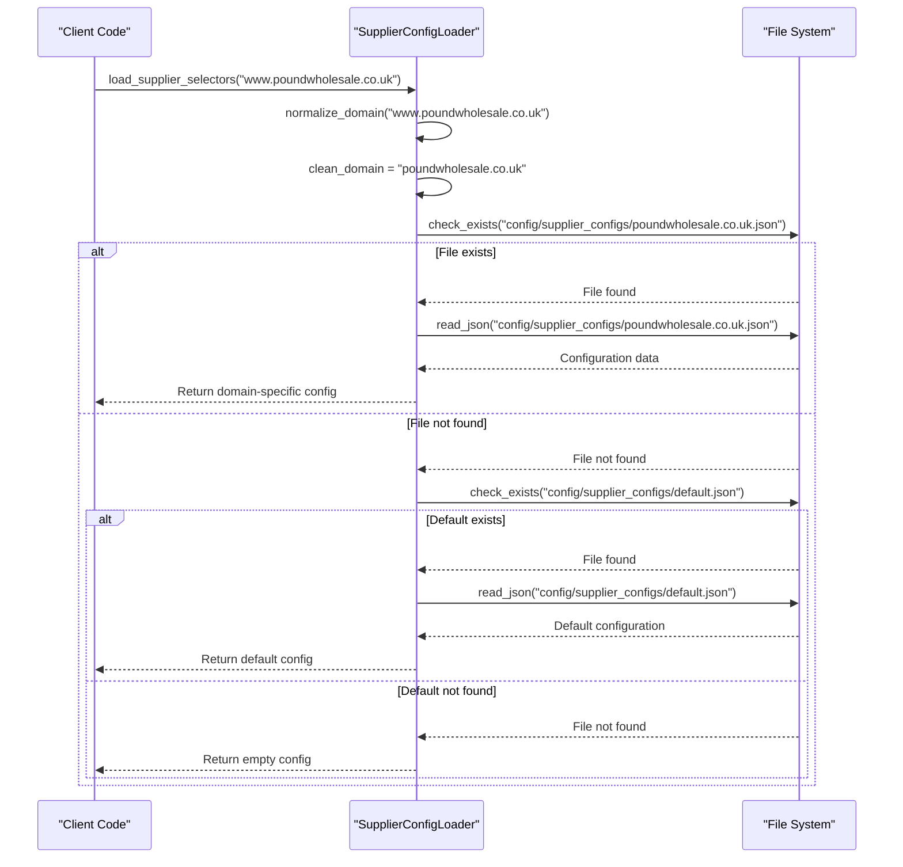

# Configuration Loading Mechanism

<cite>
**Referenced Files in This Document**   
- [system_config_loader.py](file://config/system_config_loader.py)
- [supplier_config_loader.py](file://config/supplier_config_loader.py)
- [system_config.json](file://config/system_config.json)
- [passive_extraction_workflow_latest.py](file://tools/passive_extraction_workflow_latest.py)
</cite>

## Table of Contents
1. [Introduction](#introduction)
2. [System Configuration Loader](#system-configuration-loader)
3. [Supplier Configuration Loader](#supplier-configuration-loader)
4. [Configuration Integration and Usage](#configuration-integration-and-usage)
5. [Error Handling and Path Resolution](#error-handling-and-path-resolution)
6. [Best Practices for Configuration Management](#best-practices-for-configuration-management)

## Introduction
The configuration loading mechanism in the Amazon FBA Agent System is designed to provide a robust, flexible, and backward-compatible way to manage system and supplier-specific settings. The system uses two primary loaders: `SystemConfigLoader` for global system configuration and `SupplierConfigLoader` for supplier-specific scraping configurations. These loaders ensure that configuration data is consistently loaded, accessed, and integrated into various components of the system, enabling dynamic behavior based on configuration toggles and parameters.

**Section sources**
- [system_config_loader.py](file://config/system_config_loader.py#L1-L83)
- [supplier_config_loader.py](file://config/supplier_config_loader.py#L1-L186)

## System Configuration Loader

The `SystemConfigLoader` class is responsible for loading and providing access to the main system configuration file, `system_config.json`. It implements a simple yet effective pattern for configuration management with built-in backward compatibility.

### Initialization and Path Resolution
The loader resolves the configuration path through a hierarchical approach:
1. If a `config_path` is provided during initialization, it uses that path
2. Otherwise, it constructs the default path by navigating from the current file's directory to the project root and appending `config/system_config.json`

This resolution mechanism ensures the configuration can be loaded regardless of the execution context while maintaining a predictable default location.

### Configuration Loading Process
The `_load()` method implements the core loading logic with proper error handling:
- It first checks if the configuration file exists at the resolved path
- If the file is missing, it logs an error and initializes an empty configuration
- If the file exists, it attempts to parse the JSON content with UTF-8 encoding
- In case of parsing errors, it logs the exception and initializes an empty configuration

This fail-safe approach ensures the system can continue operating even when configuration is unavailable, albeit with default behavior.

### Accessor Methods
The loader provides granular getter methods for different configuration sections:
- `get_system_config()`: Returns the system-specific configuration with fallback to the root
- `get_amazon_config()`: Returns Amazon marketplace settings
- `get_supplier_config(supplier_name)`: Returns supplier-specific settings
- `get_credentials(supplier_name)`: Returns authentication credentials for a supplier
- `get_workflow_config(workflow_key)`: Returns workflow-specific parameters
- `get_financial_batch_size()`: Returns batch size for financial reporting with a consistent default

These methods abstract the underlying JSON structure, providing a clean interface for configuration access.

### Backward Compatibility
The `load_config()` method maintains backward compatibility with older code that expects direct access to the full configuration dictionary. This allows gradual refactoring of the codebase without breaking existing functionality.



**Diagram sources**
- [system_config_loader.py](file://config/system_config_loader.py#L8-L81)

**Section sources**
- [system_config_loader.py](file://config/system_config_loader.py#L8-L81)

## Supplier Configuration Loader

The `SupplierConfigLoader` module handles supplier-specific configurations, particularly CSS selectors for web scraping. It provides a flexible system for managing domain-specific scraping rules with fallback mechanisms.

### Domain Normalization
The loader normalizes domain names by:
- Converting to lowercase
- Removing the "www." prefix
- Extracting the domain from URLs using `urlparse`

This normalization ensures consistent handling of domains regardless of their presentation in URLs.

### Configuration Loading Strategy
The loader implements a two-tiered approach:
1. First, it attempts to load a domain-specific configuration file (e.g., `poundwholesale-co-uk.json`)
2. If the domain-specific file is not found, it falls back to a default configuration (`default.json`)

This strategy allows for specialized configurations for known suppliers while providing a baseline configuration for new or unknown suppliers.

### Runtime Configuration Saving
The `save_supplier_selectors()` function enables dynamic creation and updating of supplier configurations:
- It normalizes the domain name before saving
- Ensures the configuration directory exists before writing
- Uses UTF-8 encoding with proper JSON formatting
- Returns a boolean success indicator for error handling

This capability supports the system's adaptability to new suppliers without requiring manual file creation.



**Diagram sources**
- [supplier_config_loader.py](file://config/supplier_config_loader.py#L10-L133)

**Section sources**
- [supplier_config_loader.py](file://config/supplier_config_loader.py#L10-L133)

## Configuration Integration and Usage

### Workflow Initialization
The `passive_extraction_workflow_latest.py` tool demonstrates the integration of configuration loaders into the system's core workflows. During initialization, it:
- Creates a `SystemConfigLoader` instance to load system-wide settings
- Accesses configuration values directly from `self.system_config` without hardcoded fallbacks
- Uses configuration to set operational parameters like batch sizes and processing limits

This approach ensures all toggle experiments and configuration changes are respected at runtime.

### Dependency Injection
Configuration is injected into components through dependency injection:
- The workflow class receives the configuration loader during initialization
- Components like the supplier scraper and authentication service access configuration through the workflow
- This pattern promotes loose coupling and testability

### Configuration-Driven Behavior
The system uses configuration to control critical behaviors:
- Processing limits (maximum products, categories, batch sizes)
- Feature toggles (hybrid processing, AI features, authentication)
- Performance settings (timeouts, retry attempts, rate limiting)
- Output and caching strategies

```mermaid
flowchart TD
A[System Startup] --> B[Initialize SystemConfigLoader]
B --> C[Load system_config.json]
C --> D[Create PassiveExtractionWorkflow]
D --> E[Inject Configuration]
E --> F[Initialize Components]
F --> G[Supplier Scraper]
F --> H[Amazon Extractor]
F --> I[Authentication Service]
G --> J[Use get_supplier_config()]
H --> K[Use get_amazon_config()]
I --> L[Use get_credentials()]
J --> M[Scrape Supplier Data]
K --> N[Extract Amazon Data]
L --> O[Authenticate Supplier]
```

**Diagram sources**
- [passive_extraction_workflow_latest.py](file://tools/passive_extraction_workflow_latest.py#L1902-L1927)
- [system_config_loader.py](file://config/system_config_loader.py#L8-L81)

**Section sources**
- [passive_extraction_workflow_latest.py](file://tools/passive_extraction_workflow_latest.py#L1902-L1927)

## Error Handling and Path Resolution

### Common Issues
The configuration system addresses several common issues:

#### Path Resolution Errors
- The system uses relative path resolution from the module's location
- It constructs paths using `os.path.join()` for cross-platform compatibility
- Missing configuration files are handled gracefully with empty defaults

#### Encoding Problems
- All configuration files are read with explicit UTF-8 encoding
- This prevents issues with special characters in configuration values
- The encoding is specified in both read and write operations

#### Configuration Reload Requirements
- The current implementation loads configuration once during initialization
- For dynamic updates, the system would need a reload mechanism
- Components would need to handle configuration changes at runtime

### Error Handling Strategies
The loaders implement comprehensive error handling:
- File existence checks before reading
- Try-catch blocks around JSON parsing
- Detailed logging of errors and warnings
- Graceful degradation when configuration is unavailable

## Best Practices for Configuration Management

### Extending the Loader
To extend the loader with new accessor methods:
1. Add the method to the `SystemConfigLoader` class
2. Implement appropriate default values
3. Document the method's purpose and return type
4. Ensure backward compatibility with existing code

Example pattern:
```python
def get_new_feature_config(self) -> Dict[str, Any]:
    return self._config.get("new_feature", {})
```

### Handling Dynamic Configuration Updates
For systems requiring runtime configuration updates:
1. Implement a reload method that calls `_load()` again
2. Notify dependent components of configuration changes
3. Handle potential state inconsistencies
4. Consider using a configuration change event system

### Configuration Validation
Additional validation could be implemented:
- Schema validation using JSON Schema
- Type checking for configuration values
- Range validation for numeric parameters
- Required field checks

These practices would enhance configuration reliability and prevent runtime errors due to invalid settings.

**Section sources**
- [system_config_loader.py](file://config/system_config_loader.py#L8-L81)
- [supplier_config_loader.py](file://config/supplier_config_loader.py#L10-L133)
- [passive_extraction_workflow_latest.py](file://tools/passive_extraction_workflow_latest.py#L1902-L1927)