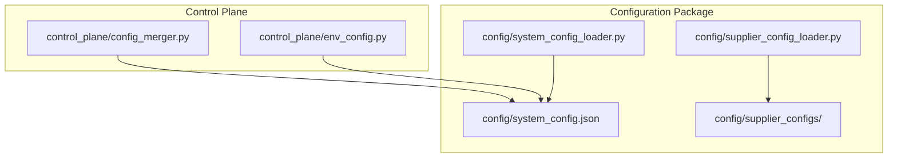
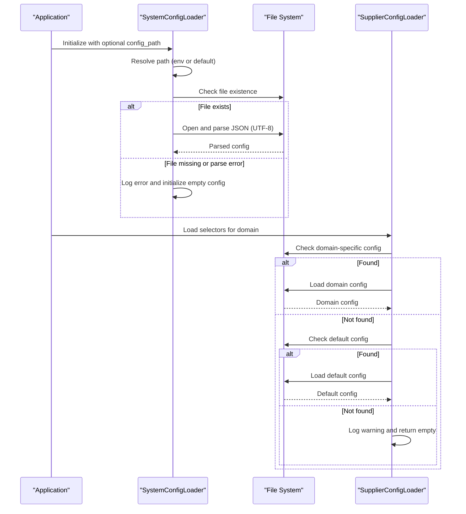
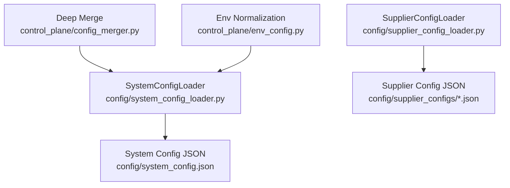

# Configuration Loading Mechanism

<cite>
**Referenced Files in This Document**
- [system_config.json](file://config/system_config.json)
- [system_config_loader.py](file://config/system_config_loader.py)
- [supplier_config_loader.py](file://config/supplier_config_loader.py)
- [config_merger.py](file://control_plane/config_merger.py)
- [env_config.py](file://control_plane/env_config.py)
- [clearance-king.co.uk.json](file://config/supplier_configs/clearance-king.co.uk.json)
- [poundwholesale.co.uk.json](file://config/supplier_configs/poundwholesale.co.uk.json)
</cite>

## Table of Contents
1. [Introduction](#introduction)
2. [Project Structure](#project-structure)
3. [Core Components](#core-components)
4. [Architecture Overview](#architecture-overview)
5. [Detailed Component Analysis](#detailed-component-analysis)
6. [Dependency Analysis](#dependency-analysis)
7. [Performance Considerations](#performance-considerations)
8. [Troubleshooting Guide](#troubleshooting-guide)
9. [Conclusion](#conclusion)

## Introduction
This document explains the configuration loading and management system used by the Amazon FBA Agent System. It covers how the main system configuration is loaded, how supplier-specific configurations are resolved, and how configuration merging and environment-based overrides work. It also documents the current limitations around hot-reloading and runtime updates, and provides guidance on extending the system safely.

## Project Structure
The configuration system is organized into three primary areas:
- System configuration: centralized JSON configuration with environment-aware loading
- Supplier configuration: domain-specific scraping selectors and navigation settings
- Control plane utilities: configuration merging and environment normalization

**Diagram sources**
- [system_config_loader.py](file://config/system_config_loader.py#L1-L87)
- [supplier_config_loader.py](file://config/supplier_config_loader.py#L1-L187)
- [config_merger.py](file://control_plane/config_merger.py#L1-L24)
- [env_config.py](file://control_plane/env_config.py#L1-L45)

**Section sources**
- [system_config_loader.py](file://config/system_config_loader.py#L1-L87)
- [supplier_config_loader.py](file://config/supplier_config_loader.py#L1-L187)
- [config_merger.py](file://control_plane/config_merger.py#L1-L24)
- [env_config.py](file://control_plane/env_config.py#L1-L45)

## Core Components
- SystemConfigLoader: loads and exposes the main system configuration with safe defaults and backward compatibility
- SupplierConfigLoader: loads domain-specific scraping selectors with fallback to a default configuration
- ConfigMerger: merges dictionaries deeply to apply overrides
- EnvConfig: normalizes and aligns environment variables for LLM providers

**Section sources**
- [system_config_loader.py](file://config/system_config_loader.py#L9-L87)
- [supplier_config_loader.py](file://config/supplier_config_loader.py#L23-L135)
- [config_merger.py](file://control_plane/config_merger.py#L7-L23)
- [env_config.py](file://control_plane/env_config.py#L26-L45)

## Architecture Overview
The configuration architecture follows a layered approach:
- System configuration is loaded once at startup with environment-aware path resolution
- Supplier configuration is resolved per-domain with a fallback strategy
- Overrides and environment variables can adjust behavior without changing files
- Deep merging enables incremental configuration changes

**Diagram sources**
- [system_config_loader.py](file://config/system_config_loader.py#L16-L87)
- [supplier_config_loader.py](file://config/supplier_config_loader.py#L23-L70)

## Detailed Component Analysis

### System Configuration Loader
The SystemConfigLoader encapsulates loading and access to the main system configuration. It supports:
- Environment-aware path resolution via an environment variable
- Safe loading with graceful fallback to empty configuration on failure
- Granular getters for subsystems (system, amazon, workflows, credentials)
- Backward-compatible method to return the full configuration tree

Key behaviors:
- Path resolution hierarchy: explicit path → environment variable → default path
- Error handling: logs failures and initializes empty configuration
- Accessor methods provide sensible defaults for missing keys

Programmatic access examples:
- Retrieve the entire system subtree: [get_system_config](file://config/system_config_loader.py#L32-L37)
- Retrieve full configuration: [get_full_config](file://config/system_config_loader.py#L35-L37)
- Retrieve Amazon-specific settings: [get_amazon_config](file://config/system_config_loader.py#L39-L40)
- Retrieve workflow configuration by key: [get_workflow_config](file://config/system_config_loader.py#L49-L50)
- Retrieve supplier credentials: [get_credentials](file://config/system_config_loader.py#L46-L47)

Fallback and precedence:
- The loader does not merge with defaults; it returns empty dicts for missing keys
- For robustness, callers should provide their own defaults when invoking getters

Hot-reloading and runtime updates:
- The current implementation loads configuration once during initialization
- No built-in reload mechanism exists; dynamic updates require manual reload and component notification

Validation and error handling:
- Existence checks before reading
- Try-catch around JSON parsing with detailed logging
- Graceful degradation to empty configuration on failure

**Section sources**
- [system_config_loader.py](file://config/system_config_loader.py#L9-L87)
- [system_config.json](file://config/system_config.json#L1-L384)

### Supplier Configuration Loader
The SupplierConfigLoader manages domain-specific scraping configurations:
- Domain resolution: cleans domain names and removes prefixes
- File resolution: tries domain-specific JSON, falls back to default JSON
- Error handling: logs failures and optionally falls back to default
- URL parsing: extracts domains from URLs with flexible input formats
- Persistence: writes domain-specific configuration files

Configuration resolution order:
1. Look for domain-specific file: `config/supplier_configs/{cleaned_domain}.json`
2. If not found, fall back to default file: `config/supplier_configs/default.json`
3. If neither exists, return empty configuration with warning

Examples:
- Load selectors for a domain: [load_supplier_selectors](file://config/supplier_config_loader.py#L23-L70)
- Extract domain from URL: [get_domain_from_url](file://config/supplier_config_loader.py#L72-L107)
- Save selectors to disk: [save_supplier_selectors](file://config/supplier_config_loader.py#L109-L135)

Supplier configuration examples:
- Clearance King UK configuration demonstrates pricing selectors, authentication, field mappings, pagination, and navigation: [clearance-king.co.uk.json](file://config/supplier_configs/clearance-king.co.uk.json#L1-L159)
- Poundwholesale UK configuration shows predefined categories and pagination settings: [poundwholesale.co.uk.json](file://config/supplier_configs/poundwholesale.co.uk.json#L1-L137)

Template and inheritance patterns:
- Domain-specific files inherit from a default template when present
- No nested inheritance across multiple levels is implemented; fallback is single-level

**Section sources**
- [supplier_config_loader.py](file://config/supplier_config_loader.py#L23-L135)
- [clearance-king.co.uk.json](file://config/supplier_configs/clearance-king.co.uk.json#L1-L159)
- [poundwholesale.co.uk.json](file://config/supplier_configs/poundwholesale.co.uk.json#L1-L137)

### Configuration Merging Utility
The control plane provides a deep merge utility for applying incremental configuration overrides:
- Recursively merges dictionaries, overriding leaf values from the overrides set
- Uses deep copies to avoid mutating original structures
- Suitable for combining base configuration with environment-specific overrides

Usage pattern:
- Merge base configuration with overrides to produce a final configuration object

**Section sources**
- [config_merger.py](file://control_plane/config_merger.py#L7-L23)

### Environment Configuration Normalization
Environment variables are normalized and aligned for LLM provider configuration:
- Cleans whitespace and removes entries that become empty after cleaning
- Ensures consistent provider selection and base URL/model pairing across providers

**Section sources**
- [env_config.py](file://control_plane/env_config.py#L14-L45)

## Dependency Analysis
The configuration system exhibits clear separation of concerns:
- SystemConfigLoader depends on the file system and logging
- SupplierConfigLoader depends on JSON parsing, file system, and URL parsing
- ConfigMerger is a pure utility for dictionary manipulation
- EnvConfig operates purely on environment variables

**Diagram sources**
- [system_config_loader.py](file://config/system_config_loader.py#L16-L87)
- [supplier_config_loader.py](file://config/supplier_config_loader.py#L23-L135)
- [config_merger.py](file://control_plane/config_merger.py#L7-L23)
- [env_config.py](file://control_plane/env_config.py#L26-L45)

**Section sources**
- [system_config_loader.py](file://config/system_config_loader.py#L16-L87)
- [supplier_config_loader.py](file://config/supplier_config_loader.py#L23-L135)
- [config_merger.py](file://control_plane/config_merger.py#L7-L23)
- [env_config.py](file://control_plane/env_config.py#L26-L45)

## Performance Considerations
- Single-shot loading: Both system and supplier configurations are loaded once and cached in memory
- Minimal I/O overhead: Supplier loader performs file existence checks and JSON reads only when needed
- Deep merge cost: Linear in the size of the merged structures; use judiciously for large configurations
- Environment normalization: Constant-time operations on environment variables

## Troubleshooting Guide
Common issues and resolutions:
- System configuration not found
  - Verify the resolved path matches expectations; check environment variable and default path resolution
  - Confirm file permissions and encoding (UTF-8)
  - Review logs for parsing exceptions

- Supplier configuration missing
  - Ensure domain-specific JSON exists or default JSON is present
  - Confirm domain cleaning logic (prefix removal) matches the intended domain
  - Check URL parsing edge cases for protocol-less inputs

- Configuration not updating at runtime
  - The loaders do not implement hot-reloading; restart the process or implement a reload mechanism
  - Apply overrides using the deep merge utility and reinitialize affected components

- Environment variable misconfiguration
  - Use the environment normalization utility to clean and align provider settings
  - Verify that provider-specific variables are consistently set

**Section sources**
- [system_config_loader.py](file://config/system_config_loader.py#L75-L87)
- [supplier_config_loader.py](file://config/supplier_config_loader.py#L42-L70)
- [config_merger.py](file://control_plane/config_merger.py#L7-L23)
- [env_config.py](file://control_plane/env_config.py#L26-L45)

## Conclusion
The configuration system provides a robust foundation for managing system-wide and supplier-specific settings. It emphasizes safety through fail-fast loading, clear separation of concerns, and environment-aware configuration. While it currently lacks built-in hot-reloading, the modular design allows for straightforward extension with a reload mechanism and validation utilities. The deep merge and environment normalization utilities enable flexible overrides and consistent behavior across environments.