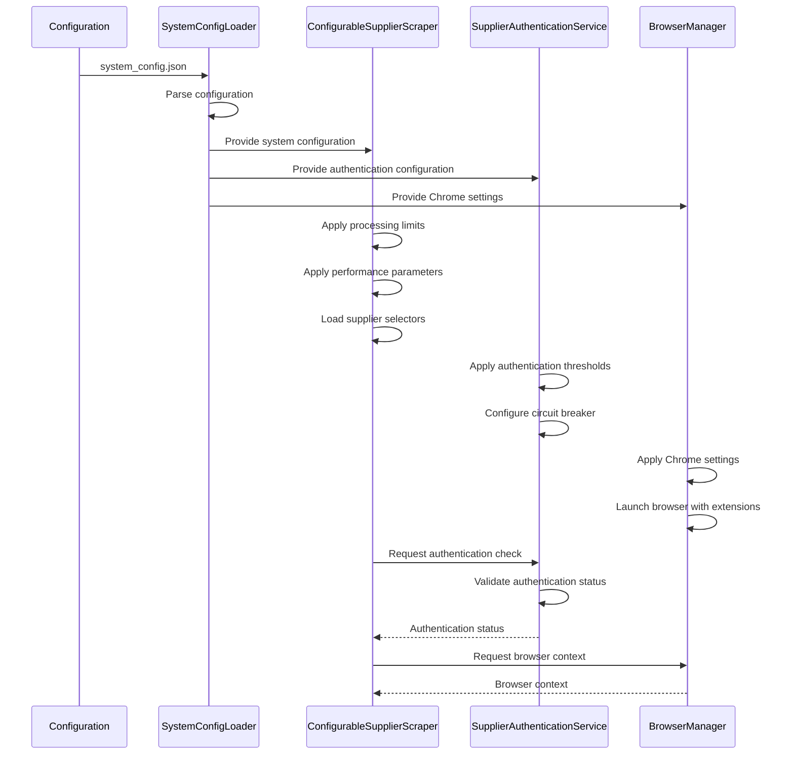

# Configuration Management

<cite>
**Referenced Files in This Document**   
- [system_config.json](file://config/system_config.json)
- [system_config_loader.py](file://config/system_config_loader.py)
- [supplier_config_loader.py](file://config/supplier_config_loader.py)
- [supplier_configs/poundwholesale-co-uk.json](file://config/supplier_configs/poundwholesale-co-uk.json)
- [supplier_configs/clearance-king.co.uk.json](file://config/supplier_configs/clearance-king.co.uk.json)
- [configurable_supplier_scraper.py](file://tools/configurable_supplier_scraper.py)
- [supplier_authentication_service.py](file://tools/supplier_authentication_service.py)
</cite>

## Table of Contents
1. [Introduction](#introduction)
2. [System Configuration Framework](#system-configuration-framework)
3. [Supplier-Specific Configuration](#supplier-specific-configuration)
4. [Configuration Loading Mechanism](#configuration-loading-mechanism)
5. [Key Configuration Options](#key-configuration-options)
6. [Configuration and Component Integration](#configuration-and-component-integration)
7. [Common Configuration Issues and Solutions](#common-configuration-issues-and-solutions)
8. [Best Practices for Configuration Management](#best-practices-for-configuration-management)
9. [Conclusion](#conclusion)

## Introduction
The Amazon FBA Agent System employs a comprehensive configuration management framework that governs system-wide settings, supplier-specific behaviors, performance parameters, and authentication protocols. This document provides a detailed analysis of the configuration architecture, focusing on the implementation of system-wide settings in system_config.json, supplier-specific configurations in the supplier_configs directory, and the mechanisms for loading and applying these configurations throughout the system. The configuration framework enables flexible, maintainable, and scalable operation of the agent system across multiple supplier websites and operational environments.

## System Configuration Framework

The system configuration framework is centered around the system_config.json file, which contains comprehensive settings that control the behavior of the Amazon FBA Agent System. The configuration is organized into logical sections that address different aspects of system operation, including processing limits, performance parameters, Chrome settings, and authentication configuration.

```mermaid
graph TD
SystemConfig[system_config.json] --> ProcessingLimits[processing_limits]
SystemConfig --> Performance[performance]
SystemConfig --> Chrome[chrome]
SystemConfig --> Authentication[authentication]
SystemConfig --> Cache[cache]
SystemConfig --> Output[output]
SystemConfig --> Monitoring[monitoring]
SystemConfig --> Analysis[analysis]
SystemConfig --> Amazon[amazon]
SystemConfig --> Supplier[supplier]
SystemConfig --> Credentials[credentials]
SystemConfig --> Workflows[workflows]
SystemConfig --> AiFeatures[ai_features]
SystemConfig --> Integrations[integrations]
SystemConfig --> SurgicalFixes[surgical_fixes]
ProcessingLimits --> MaxProducts[max_products]
ProcessingLimits --> MaxAnalyzedProducts[max_analyzed_products]
ProcessingLimits --> MaxProductsPerCategory[max_products_per_category]
ProcessingLimits --> MinPrice[min_price_gbp]
ProcessingLimits --> MaxPrice[max_price_gbp]
Performance --> MaxConcurrentRequests[max_concurrent_requests]
Performance --> RequestTimeout[request_timeout_seconds]
Performance --> RetryAttempts[retry_attempts]
Performance --> RetryDelay[retry_delay_seconds]
Performance --> Timeouts[timeouts]
Chrome --> DebugPort[debug_port]
Chrome --> Headless[headless]
Chrome --> Extensions[extensions]
Authentication --> Enabled[enabled]
Authentication --> ConsecutiveFailureThreshold[consecutive_failure_threshold]
Authentication --> MaxConsecutiveAuthFailures[max_consecutive_auth_failures]
Authentication --> AuthFailureDelay[auth_failure_delay_seconds]
Authentication --> CircuitBreaker[circuit_breaker]
Cache --> Enabled[enabled]
Cache --> TtlHours[ttl_hours]
Cache --> MaxSize[max_size_mb]
```



**Diagram sources**
- [system_config.json](file://config/system_config.json#L1-L300)

**Section sources**
- [system_config.json](file://config/system_config.json#L1-L300)

## Supplier-Specific Configuration

Supplier-specific configurations are managed through JSON files in the supplier_configs directory, with each file corresponding to a specific supplier domain. This approach enables tailored scraping strategies, selector configurations, and operational parameters for each supplier website, accommodating the unique structure and requirements of different e-commerce platforms.

The supplier configuration files contain detailed information about CSS selectors for product data extraction, navigation strategies, pagination patterns, and other supplier-specific settings. This modular approach allows for easy addition or modification of supplier configurations without requiring changes to the core scraping logic.

```mermaid
graph TD
SupplierConfigs[supplier_configs/] --> PoundWholesale[poundwholesale-co-uk.json]
SupplierConfigs --> ClearanceKing[clearance-king.co.uk.json]
SupplierConfigs --> CutPriceWholesaler[cutpricewholesaler.com.json]
SupplierConfigs --> WholesaleCosmetics[wholesale-cosmetics.co.uk.json]
SupplierConfigs --> HarrisonsDirect[www.harrisonsdirect.co.uk.json]
SupplierConfigs --> Default[default.json]
PoundWholesale --> FieldMappings[field_mappings]
PoundWholesale --> Navigation[navigation_configuration]
PoundWholesale --> Pagination[pagination]
PoundWholesale --> PageLimiter[page_limiter]
FieldMappings --> ProductItem[product_item]
FieldMappings --> Title[title]
FieldMappings --> Price[price]
FieldMappings --> Url[url]
FieldMappings --> Image[image]
FieldMappings --> Ean[ean]
FieldMappings --> Barcode[barcode]
FieldMappings --> ProductCode[product_code]
FieldMappings --> Sku[sku]
FieldMappings --> OutOfStock[out_of_stock]
FieldMappings --> StockStatus[stock_status]
Navigation --> Strategy[navigation_strategy]
Navigation --> UsePredefinedCategories[use_predefined_categories]
Navigation --> PredefinedCategories[predefined_categories]
Pagination --> Pattern[pagination_pattern]
Pagination --> UseUrlNavigation[use_url_navigation]
Pagination --> NextButtonSelector[next_button_selector]
```



**Diagram sources**
- [supplier_configs/poundwholesale-co-uk.json](file://config/supplier_configs/poundwholesale-co-uk.json#L1-L122)
- [supplier_configs/clearance-king.co.uk.json](file://config/supplier_configs/clearance-king.co.uk.json#L1-L33)

**Section sources**
- [supplier_configs/poundwholesale-co-uk.json](file://config/supplier_configs/poundwholesale-co-uk.json#L1-L122)
- [supplier_configs/clearance-king.co.uk.json](file://config/supplier_configs/clearance-king.co.uk.json#L1-L33)

## Configuration Loading Mechanism

The configuration loading mechanism is implemented through dedicated loader classes that handle the retrieval and parsing of configuration data. The system employs a two-tiered approach with separate loaders for system-wide configuration and supplier-specific configurations, ensuring efficient and reliable access to configuration data throughout the application.

The SystemConfigLoader class manages the loading of system-wide configuration from system_config.json, providing accessor methods for different configuration sections. The SupplierConfigLoader class handles the loading of supplier-specific configurations from JSON files in the supplier_configs directory, with fallback to a default configuration when supplier-specific files are not available.

```mermaid
classDiagram
class SystemConfigLoader {
+config_path : str
-_config : Dict[str, Any]
+__init__(config_path : str | None)
+get_system_config() Dict[str, Any]
+get_full_config() Dict[str, Any]
+get_amazon_config() Dict[str, Any]
+get_supplier_config(supplier_name : str) Dict[str, Any]
+get_credentials(supplier_name : str) Dict[str, str]
+get_workflow_config(workflow_key : str) Dict[str, Any]
+get_financial_batch_size() int
+load_config() Dict[str, Any]
-_load() None
}
class SupplierConfigLoader {
+CONFIG_DIR : Path
+load_supplier_selectors(domain : str) Dict[str, Any]
+get_domain_from_url(url : str) str
+save_supplier_selectors(domain : str, config : Dict[str, Any]) bool
}
SystemConfigLoader --> "loads" system_config.json
SupplierConfigLoader --> "loads" supplier_configs/
configurable_supplier_scraper --> SystemConfigLoader
configurable_supplier_scraper --> SupplierConfigLoader
supplier_authentication_service --> SystemConfigLoader
```

**Diagram sources**
- [system_config_loader.py](file://config/system_config_loader.py#L1-L84)
- [supplier_config_loader.py](file://config/supplier_config_loader.py#L1-L187)

**Section sources**
- [system_config_loader.py](file://config/system_config_loader.py#L1-L84)
- [supplier_config_loader.py](file://config/supplier_config_loader.py#L1-L187)

## Key Configuration Options

The system configuration includes several key options that significantly impact system behavior and performance. These options are carefully designed to balance efficiency, reliability, and resource utilization across different operational scenarios.

### Processing Limits
The processing limits section defines constraints on the number of products processed during extraction and analysis. Key parameters include:
- **max_products**: Maximum total products to process (1,000,000)
- **max_analyzed_products**: Maximum products to analyze (1,000,000)
- **max_products_per_category**: Maximum products per category (1,000)
- **max_products_per_cycle**: Maximum products per processing cycle (100)

These limits prevent resource exhaustion during large-scale operations while allowing comprehensive processing of supplier catalogs.

### Performance Parameters
Performance parameters control the behavior of HTTP requests and concurrent operations:
- **max_concurrent_requests**: Maximum concurrent requests (8)
- **request_timeout_seconds**: Request timeout in seconds (45)
- **retry_attempts**: Number of retry attempts (5)
- **retry_delay_seconds**: Delay between retries (3 seconds)

These settings optimize network efficiency while maintaining reliability in the face of transient failures.

### Chrome Settings
Chrome settings configure the browser automation environment:
- **debug_port**: Chrome debugging port (9222)
- **headless**: Headless mode (false)
- **extensions**: Enabled browser extensions (Keepa, SellerAmp)

These settings enable debugging and integration with essential browser tools for Amazon FBA analysis.

### Authentication Configuration
Authentication settings manage supplier login and session maintenance:
- **consecutive_failure_threshold**: Threshold for consecutive authentication failures (5)
- **max_consecutive_auth_failures**: Maximum consecutive authentication failures (10)
- **auth_failure_delay_seconds**: Delay after authentication failure (60 seconds)
- **circuit_breaker**: Circuit breaker configuration for authentication failures

These settings prevent account lockouts and implement resilience against authentication issues.

**Section sources**
- [system_config.json](file://config/system_config.json#L1-L300)

## Configuration and Component Integration

Configuration settings are integrated throughout the system components, driving behavior and enabling adaptability to different operational requirements. The configuration framework enables dependency injection into various components, allowing them to operate according to the specified parameters.

The configurable_supplier_scraper component uses configuration data to determine scraping behavior, including selector configurations, rate limiting, and AI model selection. The supplier_authentication_service component relies on authentication configuration to manage login attempts and session validation. The browser management system uses Chrome settings to configure the automation environment.



**Diagram sources**
- [system_config_loader.py](file://config/system_config_loader.py#L1-L84)
- [configurable_supplier_scraper.py](file://tools/configurable_supplier_scraper.py#L1-L799)
- [supplier_authentication_service.py](file://tools/supplier_authentication_service.py#L1-L114)

**Section sources**
- [configurable_supplier_scraper.py](file://tools/configurable_supplier_scraper.py#L1-L799)
- [supplier_authentication_service.py](file://tools/supplier_authentication_service.py#L1-L114)

## Common Configuration Issues and Solutions

Several common configuration issues may arise during system operation, particularly related to supplier-specific settings and performance tuning. Understanding these issues and their solutions is essential for maintaining reliable system operation.

### Supplier-Specific Configuration Issues
1. **Selector Mismatch**: When supplier website structure changes, CSS selectors may no longer match the expected elements.
   - **Solution**: Update the supplier configuration file with new selectors, using browser developer tools to identify current element patterns.

2. **Pagination Failure**: Changes in pagination implementation can prevent complete category scraping.
   - **Solution**: Verify and update the pagination configuration, including pattern and next button selectors.

3. **Authentication Problems**: Login requirements or CAPTCHA challenges may disrupt scraping.
   - **Solution**: Adjust authentication configuration, including increasing retry attempts or implementing additional authentication steps.

### Performance Tuning Issues
1. **Rate Limiting**: Excessive request frequency may trigger supplier rate limiting.
   - **Solution**: Adjust performance parameters, particularly request_timeout_seconds and retry_delay_seconds, to reduce request frequency.

2. **Memory Exhaustion**: Large-scale operations may consume excessive memory.
   - **Solution**: Optimize processing_limits, particularly max_products_per_category, and ensure cache settings are appropriate for available resources.

3. **Browser Stability**: Extended browser sessions may become unstable.
   - **Solution**: Adjust Chrome settings, particularly headless mode, and implement browser restarts at appropriate intervals.

**Section sources**
- [system_config.json](file://config/system_config.json#L1-L300)
- [supplier_configs/poundwholesale-co-uk.json](file://config/supplier_configs/poundwholesale-co-uk.json#L1-L122)

## Best Practices for Configuration Management

Effective configuration management is critical for maintaining a reliable and adaptable system. The following best practices are recommended for managing configuration in the Amazon FBA Agent System.

### Environment-Specific Settings
Maintain separate configuration files or configuration sections for different environments (development, testing, production). This allows for appropriate parameter tuning in each environment while maintaining consistency in configuration structure.

### Version Control
Store configuration files in version control to track changes and enable rollback to previous configurations when needed. This is particularly important for supplier-specific configurations that may require frequent updates.

### Documentation
Maintain comprehensive documentation of configuration options, including their purpose, valid values, and impact on system behavior. This facilitates onboarding of new team members and ensures consistent understanding of configuration parameters.

### Testing
Implement thorough testing of configuration changes before deploying to production. This includes testing both the syntax of configuration files and the operational impact of configuration changes.

### Monitoring
Monitor system behavior in relation to configuration settings, particularly performance parameters and processing limits. Use monitoring data to inform configuration optimization and capacity planning.

**Section sources**
- [system_config.json](file://config/system_config.json#L1-L300)
- [supplier_config.md](file://config/supplier_config.md#L1-L50)

## Conclusion
The configuration management framework in the Amazon FBA Agent System provides a robust and flexible foundation for controlling system behavior across diverse operational scenarios. By separating system-wide settings from supplier-specific configurations and implementing a reliable loading mechanism, the system achieves a balance between consistency and adaptability. The comprehensive configuration options enable fine-tuning of performance, reliability, and resource utilization, while the integration with system components ensures consistent application of configuration parameters throughout the application. Following best practices for configuration management will ensure the continued reliability and effectiveness of the system as it evolves to meet changing requirements.