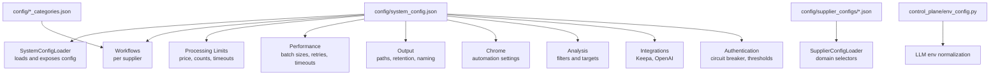
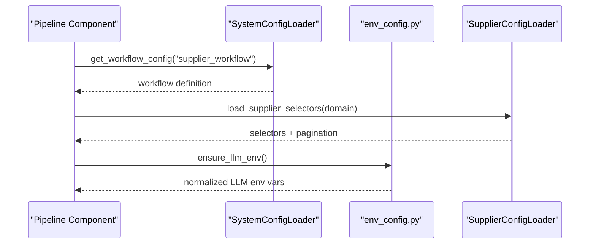
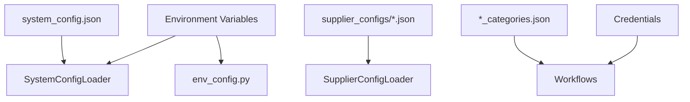

# Configuration Management

<cite>
**Referenced Files in This Document**
- [system_config.json](file://config/system_config.json)
- [system_config_loader.py](file://config/system_config_loader.py)
- [supplier_config_loader.py](file://config/supplier_config_loader.py)
- [poundwholesale_categories.json](file://config/poundwholesale_categories.json)
- [clearance-king_categories.json](file://config/clearance-king_categories.json)
- [efghousewares_categories.json](file://config/efghousewares_categories.json)
- [kdwholesale_categories.json](file://config/kdwholesale_categories.json)
- [laceywholesale_categories.json](file://config/laceywholesale_categories.json)
- [clearance_king_system_config_additions.json](file://config/clearance_king_system_config_additions.json)
- [full-first.json](file://config/full-first.json)
- [env_config.py](file://control_plane/env_config.py)
- [README.md](file://config/supplier_configs/README.md)
</cite>

## Table of Contents
1. [Introduction](#introduction)
2. [Project Structure](#project-structure)
3. [Core Components](#core-components)
4. [Architecture Overview](#architecture-overview)
5. [Detailed Component Analysis](#detailed-component-analysis)
6. [Dependency Analysis](#dependency-analysis)
7. [Performance Considerations](#performance-considerations)
8. [Troubleshooting Guide](#troubleshooting-guide)
9. [Conclusion](#conclusion)
10. [Appendices](#appendices)

## Introduction
This document explains the configuration management of the Amazon FBA Agent System. It covers the system configuration structure, processing limits, performance parameters, Chrome automation settings, supplier-specific configurations, and the configuration loading mechanisms. It also provides examples of configuration options, their behavioral effects, environment variable usage, validation strategies, troubleshooting steps, and templates for integrating new suppliers.

## Project Structure
Configuration is organized around:
- Central system configuration: a single JSON file that defines system-wide behavior, processing limits, performance tuning, output settings, and supplier workflows.
- Supplier-specific selectors: per-domain JSON files that define CSS selectors and pagination patterns for scraping.
- Supplier category lists: per-supplier JSON files enumerating category URLs to crawl.
- Environment configuration helpers: utilities to normalize and align environment variables for LLM providers.

**Diagram sources**
- [system_config.json](file://config/system_config.json#L1-L384)
- [system_config_loader.py](file://config/system_config_loader.py#L1-L87)
- [supplier_config_loader.py](file://config/supplier_config_loader.py#L1-L187)
- [env_config.py](file://control_plane/env_config.py#L1-L45)

**Section sources**
- [system_config.json](file://config/system_config.json#L1-L384)
- [system_config_loader.py](file://config/system_config_loader.py#L1-L87)
- [supplier_config_loader.py](file://config/supplier_config_loader.py#L1-L187)
- [README.md](file://config/supplier_configs/README.md)

## Core Components
- System configuration loader: reads the central configuration file and exposes getters for system, Amazon, workflows, credentials, and batch sizes.
- Supplier configuration loader: loads domain-specific CSS selectors and pagination patterns, with fallback to a default configuration.
- Supplier category lists: JSON arrays of category URLs per supplier, enabling targeted crawling.
- Environment configuration: normalizes LLM provider environment variables for consistent operation.

Key responsibilities:
- Centralized configuration access for the pipeline.
- Supplier-specific scraping customization.
- Supplier category enumeration and pagination patterns.
- Environment variable alignment for LLM providers.

**Section sources**
- [system_config_loader.py](file://config/system_config_loader.py#L1-L87)
- [supplier_config_loader.py](file://config/supplier_config_loader.py#L1-L187)
- [system_config.json](file://config/system_config.json#L1-L384)

## Architecture Overview
The configuration architecture separates concerns:
- System-level controls (limits, performance, output, Chrome) are defined centrally.
- Supplier-level controls (URLs, selectors, pagination) are modular and domain-specific.
- Workflows tie suppliers to their category lists and operational flags.
- Environment helpers ensure consistent LLM configuration across deployments.

**Diagram sources**
- [system_config_loader.py](file://config/system_config_loader.py#L1-L87)
- [supplier_config_loader.py](file://config/supplier_config_loader.py#L1-L187)
- [env_config.py](file://control_plane/env_config.py#L1-L45)

## Detailed Component Analysis

### System Configuration Structure
The central configuration file defines:
- Pipeline toggles: enable/disable hybrid processing modes and resume logic.
- System: name, version, environment, test mode, cache clearing, output roots, batch sizes, and browser reuse.
- Dynamic reordering: optional adaptive ordering of categories/products.
- Processing limits: price bounds, product caps, pagination safety, and category validation.
- Supplier cache control: update frequency, validation, and modes (e.g., exhaustive).
- Supplier extraction progress: tracking, recovery modes, and persistence.
- Hybrid processing: sequential/chunked/balanced modes, memory management, sliding windows.
- Batch synchronization: synchronize batch sizes across subsystems.
- Performance: concurrency, timeouts, retry behavior, rate limiting, and matching thresholds.
- Cache: TTL, size limits, and selective clearing policies.
- Monitoring: intervals, health checks, log level, and alert thresholds.
- Output: base directory, report format, intermediate results, naming pattern, retention.
- Chrome: debug port, headless mode, extensions.
- Analysis: ROI, profit, rating, reviews, sales rank, monthly sales, competition, excluded/target categories.
- Amazon marketplace: marketplace, currency, VAT, and FBA fee structure.
- Supplier pricing: whether prices include VAT.
- Credentials: per-supplier username/password.
- Workflows: per-supplier definitions including URLs, category configs, authentication flags, and test product URLs.
- AI features: category selection and product matching options.
- Integrations: Keepa and OpenAI toggles and limits.
- Authentication: startup verification, thresholds, periodic intervals, circuit breaker.
- Surgical fixes: enhanced detection and state validation toggles.

Effects on system behavior:
- Processing limits constrain price ranges and volumes to reduce risk and cost.
- Performance parameters tune throughput and resilience against upstream throttling.
- Chrome settings control automation headless behavior and extension availability.
- Workflows connect suppliers to category lists and operational modes.
- Cache and monitoring tune reliability and observability.

**Section sources**
- [system_config.json](file://config/system_config.json#L1-L384)

### Supplier-Specific Configuration Loading
The supplier configuration loader:
- Accepts a domain and loads domain-specific selectors from supplier_configs/<domain>.json.
- Falls back to a default.json if domain-specific file is missing.
- Provides utilities to extract domains from URLs and to save updated configurations.
- Supports command-line generation of sample configurations.

Operational impact:
- Enables per-supplier scraping customization without modifying core code.
- Reduces maintenance overhead by centralizing selector definitions.
- Provides a fallback mechanism to keep pipelines running during partial supplier updates.

**Section sources**
- [supplier_config_loader.py](file://config/supplier_config_loader.py#L1-L187)
- [README.md](file://config/supplier_configs/README.md)

### Supplier Category Lists
Each supplier has a dedicated category list JSON:
- Defines category URLs to crawl.
- Includes metadata such as total categories, source, and validation timestamps.
- Some lists include pagination patterns and test product URLs.

Examples:
- poundwholesale: extensive subcategories across homeware, toys, stationery, DIY, and more.
- clearance-king: categorized sections for baby/kids, books, clothing/fashion, electrical, garden/outdoor, gifts/toys, health/beauty, household, mailing supplies, media, party celebrations, pets, smoking products, sports/leisure, stationery/crafts, and more.
- efghousewares: large catalog spanning Christmas, bathroom, china, cleaning materials, DIY brands, electrical, food & drink, gardening, glassware, hardware, home decor, household cleaners, kids products, kitchenware, laundry storage, partyware, pest control, pet products, plastic housewares, pound-lines, seasonal sports homewares, smoking products, stationery, textiles & accessories, toiletries, toys.
- kdwholesale: categorized sections for bathroom essentials, cleaning and laundry products, gifts/party, hardware, health/beauty care products, home essential products, kitchen essentials, seasonal, smoking acc and batteries, special offer, sports and toys, stationery/art and craft, and toys.
- laceywholesale: focused categories including air fresheners, baby products, bath care, batteries, catering cloths, dental, deodorants, feminine care, hair care, house-hold and cleaning, lighting, male care, medical, others, paper products, pet care, refuse and plastic bags, smoking requisites, and vapes.

Best practices:
- Keep category lists curated and validated to minimize wasted cycles.
- Add pagination patterns when suppliers use numbered pages.
- Include test product URLs for quick validation.

**Section sources**
- [poundwholesale_categories.json](file://config/poundwholesale_categories.json#L1-L234)
- [clearance-king_categories.json](file://config/clearance-king_categories.json#L1-L159)
- [efghousewares_categories.json](file://config/efghousewares_categories.json#L1-L346)
- [kdwholesale_categories.json](file://config/kdwholesale_categories.json#L1-L101)
- [laceywholesale_categories.json](file://config/laceywholesale_categories.json#L1-L29)

### Configuration Loading Mechanism
The system loader:
- Reads the central configuration file from a path resolved via environment variable or default location.
- Parses JSON and exposes getters for system, Amazon, suppliers, credentials, workflows, and batch sizes.
- Logs errors if the file is missing or malformed.

Environment variable usage:
- FBA_SYSTEM_CONFIG_PATH: overrides the default configuration file path.

Behavioral effects:
- Ensures consistent configuration access across modules.
- Provides backward-compatible accessors for older parts of the codebase.

**Section sources**
- [system_config_loader.py](file://config/system_config_loader.py#L1-L87)

### Environment Variable Usage
The environment configuration helper:
- Normalizes LLM provider settings by aligning CONTROL_PLANE_LLM_* and CONTROL_PLANE_OLLAMA_* variables.
- Ensures consistent base URLs and model names regardless of which environment variables are set.

Effects:
- Simplifies deployment configuration for local vs remote LLM providers.
- Prevents misconfiguration by auto-aligning related variables.

**Section sources**
- [env_config.py](file://control_plane/env_config.py#L1-L45)

### Configuration Validation and Examples
Validation patterns:
- Central configuration loader validates file existence and parses JSON safely, logging errors and returning empty structures on failure.
- Supplier configuration loader validates presence of domain-specific or default files, with fallback logging.

Examples of configuration effects:
- Processing limits: min/max price and product caps reduce scope and cost.
- Performance: retry attempts and delays improve resilience to transient failures.
- Chrome: headless mode and extensions influence automation stability and debugging.
- Workflows: authentication_required and session_persistence control supplier login behavior.
- Cache control: validation and backup toggles protect against corrupted caches.

**Section sources**
- [system_config_loader.py](file://config/system_config_loader.py#L75-L87)
- [supplier_config_loader.py](file://config/supplier_config_loader.py#L42-L69)

### Templates and Examples for New Suppliers
Templates and guidance:
- Use the sample supplier configuration generator to scaffold domain-specific selector files.
- Populate supplier category lists with validated URLs and pagination patterns.
- Extend workflows with supplier-specific settings and authentication flags.
- Add credentials for suppliers requiring login.

Reference templates:
- Sample supplier configuration template and generator usage are embedded in the supplier configuration loader.
- Example additions for a new supplier’s credentials and workflow are provided in the additions file.
- Full configuration examples demonstrate advanced settings for analysis, cache, monitoring, integrations, and authentication.

**Section sources**
- [supplier_config_loader.py](file://config/supplier_config_loader.py#L137-L187)
- [clearance_king_system_config_additions.json](file://config/clearance_king_system_config_additions.json#L1-L20)
- [full-first.json](file://config/full-first.json#L105-L489)

## Dependency Analysis
Configuration dependencies:
- SystemConfigLoader depends on the central configuration file and environment variables.
- SupplierConfigLoader depends on supplier_configs directory and default fallback.
- Workflows depend on category lists and supplier credentials.
- Environment helpers depend on standard environment variables.

**Diagram sources**
- [system_config.json](file://config/system_config.json#L1-L384)
- [system_config_loader.py](file://config/system_config_loader.py#L1-L87)
- [supplier_config_loader.py](file://config/supplier_config_loader.py#L1-L187)
- [env_config.py](file://control_plane/env_config.py#L1-L45)

**Section sources**
- [system_config.json](file://config/system_config.json#L1-L384)
- [system_config_loader.py](file://config/system_config_loader.py#L1-L87)
- [supplier_config_loader.py](file://config/supplier_config_loader.py#L1-L187)
- [env_config.py](file://control_plane/env_config.py#L1-L45)

## Performance Considerations
- Concurrency and batching: tune max_concurrent_requests, batch_size, and retry_attempts to balance speed and upstream compliance.
- Timeouts: adjust navigation and selector wait timeouts to accommodate supplier page complexity.
- Rate limiting: configure rate_limit_delay and batch_delay to avoid throttling.
- Memory management: use hybrid processing modes and sliding window cache clearing to manage memory pressure.
- Cache TTL and size: set appropriate TTL and max_size_mb to optimize hit rates while controlling disk usage.

[No sources needed since this section provides general guidance]

## Troubleshooting Guide
Common issues and resolutions:
- Configuration file not found: verify FBA_SYSTEM_CONFIG_PATH or ensure the default path exists.
- Malformed JSON: check for syntax errors and ensure UTF-8 encoding.
- Missing supplier selectors: confirm domain-specific JSON exists or rely on default fallback; regenerate with the built-in generator.
- Authentication failures: review authentication thresholds and circuit breaker settings; ensure credentials are present in the configuration.
- Chrome automation problems: adjust headless mode, debug port, and extension list; verify browser compatibility.
- Excessive memory usage: enable memory management toggles and sliding window clearing; reduce batch sizes.

**Section sources**
- [system_config_loader.py](file://config/system_config_loader.py#L75-L87)
- [supplier_config_loader.py](file://config/supplier_config_loader.py#L42-L69)
- [system_config.json](file://config/system_config.json#L139-L186)

## Conclusion
The Amazon FBA Agent System’s configuration management combines a centralized configuration file with modular supplier-specific settings. This design enables precise control over processing limits, performance tuning, Chrome automation, and supplier workflows while supporting extensibility and resilience. By leveraging environment variables, validation, and templates, teams can reliably operate at scale and adapt quickly to new suppliers and changing requirements.

[No sources needed since this section summarizes without analyzing specific files]

## Appendices

### Configuration Options Quick Reference
- System: name, version, environment, test_mode, clear_cache, selective_cache_clear, output_root, reuse_browser, max_tabs, supplier_login_max_retries, supplier_login_backoff_sec, enable_supplier_parser, force_ai_category_suggestion, supplier_extraction_batch_size, max_categories_to_process.
- Processing limits: max_products_per_category, max_products_per_run, pagination_safety_limit, min_price_gbp, max_price_gbp, price_midpoint_gbp, min_products_per_category, category_validation.enabled/min_products_per_category/timeout_seconds.
- Performance: max_concurrent_requests, request_timeout_seconds, retry_attempts, retry_delay_seconds, batch_size, matching_thresholds.title_similarity/medium_title_similarity/high_title_similarity, rate_limiting.rate_limit_delay, batch_delay, ai_batch_size, timeouts.navigation_timeout_ms/search_input_timeout_ms/results_wait_timeout_ms/selector_wait_timeout_ms/page_load_timeout_ms/http_request_timeout_seconds.
- Cache: enabled, ttl_hours, max_size_mb, selective_clear_config.preserve_analyzed_products/preserve_ai_categories/preserve_linking_map/clear_unanalyzed_only/clear_failed_extractions.
- Monitoring: enabled, metrics_interval, health_check_interval, log_level, alert_thresholds.cpu_percent/memory_percent/error_rate_per_hour.
- Output: base_dir, report_format, save_intermediate_results, file_naming.pattern/timestamp_format, retention.keep_days/archive_after_days.
- Chrome: debug_port, headless, extensions.
- Analysis: min_roi_percent, min_profit_per_unit, min_rating, min_reviews, max_sales_rank, min_monthly_sales, max_competition_level, excluded_categories, target_categories.
- Amazon: marketplace, currency, vat_rate, fba_fees.referral_fee_rate/fulfillment_fee_minimum/storage_fee_per_cubic_foot/prep_house_fixed_fee.
- Supplier: prices_include_vat.
- Integrations: keepa.enabled/api_key/rate_limit.requests_per_minute, openai.enabled.
- Authentication: enabled/startup_verification/consecutive_failure_threshold/primary_periodic_interval/secondary_periodic_interval/max_consecutive_auth_failures/auth_failure_delay_seconds/min_products_between_logins/adaptive_threshold_enabled/circuit_breaker.enabled/failure_threshold/recovery_timeout_seconds.
- Surgical fixes: enable_enhanced_fresh_start_detection, enable_state_synchronization_validation, enable_dual_index_system, enable_url_normalization.

**Section sources**
- [system_config.json](file://config/system_config.json#L11-L384)