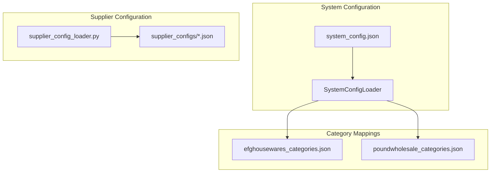
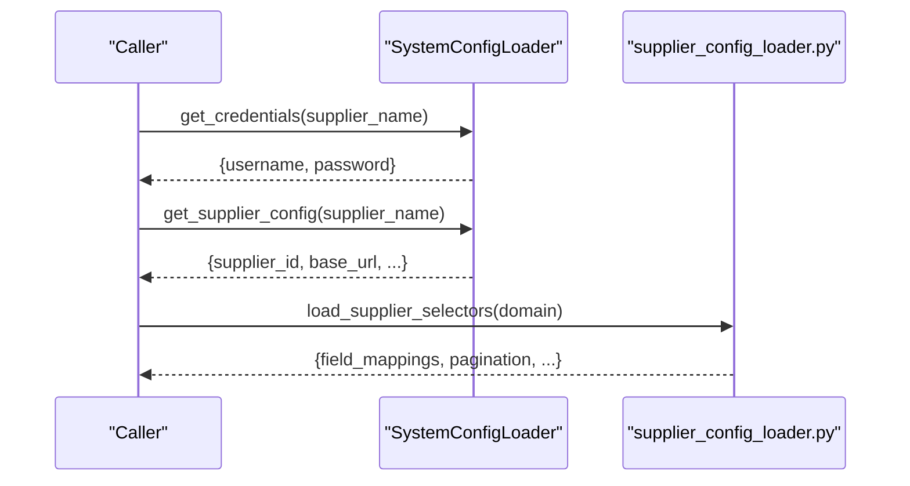
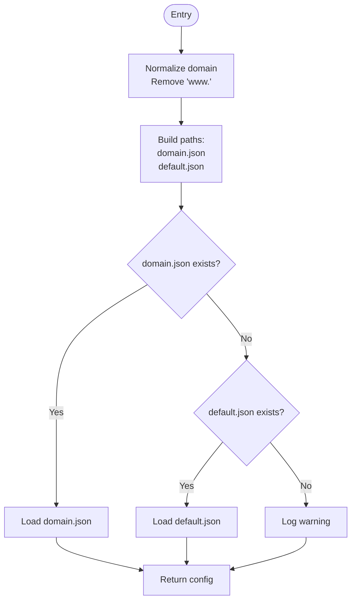
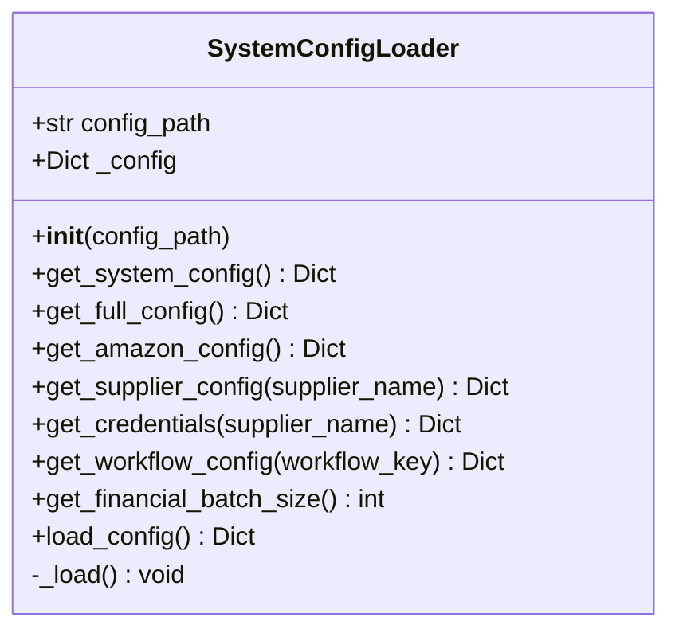
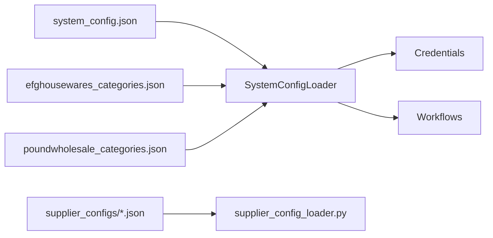

# Supplier Configuration

<cite>
**Referenced Files in This Document**
- [supplier_config_loader.py](file://config/supplier_config_loader.py)
- [system_config_loader.py](file://config/system_config_loader.py)
- [system_config.json](file://config/system_config.json)
- [clearance-king.co.uk.json](file://config/supplier_configs/clearance-king.co.uk.json)
- [efghousewares.co.uk.json](file://config/supplier_configs/efghousewares.co.uk.json)
- [poundwholesale.co.uk.json](file://config/supplier_configs/poundwholesale.co.uk.json)
- [README.md](file://config/supplier_configs/README.md)
- [efghousewares_categories.json](file://config/efghousewares_categories.json)
- [poundwholesale_categories.json](file://config/poundwholesale_categories.json)
- [11.5.1. Credential Validation.md](file://WIKI REPO SEPT17/11. Troubleshooting Guide/11.5. Authentication Issues/11.5.1. Credential Validation.md)
</cite>

## Table of Contents
1. [Introduction](#introduction)
2. [Project Structure](#project-structure)
3. [Core Components](#core-components)
4. [Architecture Overview](#architecture-overview)
5. [Detailed Component Analysis](#detailed-component-analysis)
6. [Dependency Analysis](#dependency-analysis)
7. [Performance Considerations](#performance-considerations)
8. [Troubleshooting Guide](#troubleshooting-guide)
9. [Conclusion](#conclusion)
10. [Appendices](#appendices)

## Introduction
This document explains supplier-specific configuration management for the Amazon FBA Agent System. It covers the configuration structure for authentication credentials, category mappings, workflow settings, and extraction parameters. It also describes how to create and modify supplier configurations for new integrations, provides template examples for authenticated and non-authenticated suppliers, and explains the configuration loading mechanism, validation processes, and error handling. Practical onboarding steps and common configuration issues are included to help operators integrate new suppliers efficiently.

## Project Structure
Supplier configuration is split into two layers:
- System-wide configuration: central settings, credentials, and workflow definitions
- Supplier-specific configuration: selectors, extraction parameters, and navigation settings

**Diagram sources**
- [system_config.json](file://config/system_config.json#L1-L384)
- [system_config_loader.py](file://config/system_config_loader.py#L1-L87)
- [supplier_config_loader.py](file://config/supplier_config_loader.py#L1-L187)
- [efghousewares_categories.json](file://config/efghousewares_categories.json#L1-L346)
- [poundwholesale_categories.json](file://config/poundwholesale_categories.json#L1-L234)

**Section sources**
- [system_config.json](file://config/system_config.json#L1-L384)
- [system_config_loader.py](file://config/system_config_loader.py#L1-L87)
- [supplier_config_loader.py](file://config/supplier_config_loader.py#L1-L187)

## Core Components
- Supplier selector loader: loads domain-specific or default selector configurations from JSON files
- System configuration loader: loads system_config.json and exposes getters for suppliers, credentials, and workflows
- Supplier configuration files: per-domain JSON files containing selectors, authentication, pagination, and extraction parameters
- Category mapping files: lists of category URLs for predefined category extraction workflows

Key responsibilities:
- Load and validate supplier configuration
- Provide selectors and parameters to extraction workflows
- Manage authentication credentials and workflow settings
- Support both authenticated and non-authenticated suppliers

**Section sources**
- [supplier_config_loader.py](file://config/supplier_config_loader.py#L23-L69)
- [system_config_loader.py](file://config/system_config_loader.py#L42-L50)
- [system_config.json](file://config/system_config.json#L247-L264)

## Architecture Overview
The configuration architecture separates concerns between system-level settings and supplier-level specifics. SystemConfigLoader centralizes access to credentials and workflow definitions, while supplier_config_loader.py manages domain-specific selectors and supports fallback to default configurations.

**Diagram sources**
- [system_config_loader.py](file://config/system_config_loader.py#L46-L47)
- [system_config_loader.py](file://config/system_config_loader.py#L42-L44)
- [supplier_config_loader.py](file://config/supplier_config_loader.py#L23-L69)

## Detailed Component Analysis

### Supplier Selector Loader
The selector loader provides:
- Domain-specific configuration loading with fallback to default
- URL parsing and domain normalization
- Save operation for generating new supplier configs

**Diagram sources**
- [supplier_config_loader.py](file://config/supplier_config_loader.py#L23-L69)

**Section sources**
- [supplier_config_loader.py](file://config/supplier_config_loader.py#L23-L69)

### System Configuration Loader
The system loader:
- Reads system_config.json from environment or default location
- Exposes getters for system, amazon, suppliers, credentials, and workflows
- Provides backward-compatible load_config()

**Diagram sources**
- [system_config_loader.py](file://config/system_config_loader.py#L9-L87)

**Section sources**
- [system_config_loader.py](file://config/system_config_loader.py#L9-L87)

### Supplier Configuration Structure
Supplier configuration files define:
- Identity: supplier_id, supplier_name, base_url
- Authentication: login_url, login_selectors, authentication_check_selectors
- Field mappings: selectors for product_item, title, price, url, image, ean, barcode, sku, stock, availability
- Navigation: navigation_strategy, predefined_categories, homepage reliability flag
- Pagination: pattern, next_button_selector, next_button_javascript
- Additional: rate limiting, page limiter, discovery metadata

Examples:
- Authenticated supplier with login_config and authentication fields
- Non-authenticated supplier with authentication_required flag
- Supplier with explicit predefined categories and pagination settings

**Section sources**
- [clearance-king.co.uk.json](file://config/supplier_configs/clearance-king.co.uk.json#L1-L159)
- [efghousewares.co.uk.json](file://config/supplier_configs/efghousewares.co.uk.json#L1-L85)
- [poundwholesale.co.uk.json](file://config/supplier_configs/poundwholesale.co.uk.json#L1-L137)

### Category Mapping Files
Predefined category mappings enable targeted extraction workflows:
- efghousewares_categories.json: comprehensive category URL list
- poundwholesale_categories.json: curated subset of categories

These files are referenced by workflow definitions in system_config.json.

**Section sources**
- [efghousewares_categories.json](file://config/efghousewares_categories.json#L1-L346)
- [poundwholesale_categories.json](file://config/poundwholesale_categories.json#L1-L234)

### Configuration Loading and Validation
The system loads configurations in this order:
- System configuration via SystemConfigLoader
- Supplier-specific selectors via supplier_config_loader
- Category mappings via workflow definitions

Validation highlights:
- Selector priority reversed for EAN extraction (CSS selectors first, then pattern matching)
- Button-based pagination honors config and falls back to URL pagination if needed
- Graceful fallback to default configuration when domain-specific file is missing

**Section sources**
- [README.md](file://config/supplier_configs/README.md#L131-L183)
- [README.md](file://config/supplier_configs/README.md#L454-L456)
- [supplier_config_loader.py](file://config/supplier_config_loader.py#L23-L69)

## Dependency Analysis
Supplier configuration depends on:
- System configuration for credentials and workflow definitions
- Supplier selector files for extraction parameters
- Category mapping files for navigation strategies

**Diagram sources**
- [system_config.json](file://config/system_config.json#L247-L338)
- [system_config_loader.py](file://config/system_config_loader.py#L42-L50)
- [supplier_config_loader.py](file://config/supplier_config_loader.py#L23-L69)

**Section sources**
- [system_config.json](file://config/system_config.json#L247-L338)
- [system_config_loader.py](file://config/system_config_loader.py#L42-L50)
- [supplier_config_loader.py](file://config/supplier_config_loader.py#L23-L69)

## Performance Considerations
- Prefer CSS selectors over pattern matching for EAN extraction to avoid false positives and reduce fallback overhead
- Use button-based pagination when supported by the supplier to capture all products without URL limitations
- Limit per-page product counts using page_limiter to balance throughput and accuracy
- Enable caching and selective clearing to minimize repeated extractions

[No sources needed since this section provides general guidance]

## Troubleshooting Guide
Common configuration issues and resolutions:
- Missing credentials: verify domain key matches base_url and ensure proper structure
- Incorrect supplier IDs: ensure file names use hyphens and match supplier_id
- Malformed JSON: check for trailing commas, missing brackets, unescaped quotes, and comments
- Authentication failures: handle special characters in passwords and avoid account lockout

The system logs detailed errors during configuration loading and authentication attempts to aid diagnosis.

**Section sources**
- [11.5.1. Credential Validation.md](file://WIKI REPO SEPT17/11. Troubleshooting Guide/11.5. Authentication Issues/11.5.1. Credential Validation.md#L241-L274)
- [system_config_loader.py](file://config/system_config_loader.py#L75-L87)
- [supplier_config_loader.py](file://config/supplier_config_loader.py#L58-L69)

## Conclusion
Supplier configuration management centers on a clear separation between system-wide settings and supplier-specific selectors. By following the documented structure and validation practices, operators can onboard new suppliers efficiently, support both authenticated and non-authenticated scenarios, and maintain robust extraction workflows with reliable pagination and field mapping.

[No sources needed since this section summarizes without analyzing specific files]

## Appendices

### Step-by-Step Onboarding Guide
1. Prepare supplier configuration
   - Create domain-specific JSON file in config/supplier_configs/
   - Define identity, base_url, and field_mappings
   - Add authentication fields if required
   - Configure pagination and navigation settings

2. Integrate with system configuration
   - Add supplier credentials under config/system_config.json
   - Define workflow entry under workflows with categories_config_path
   - Set authentication_required and session persistence flags as needed

3. Validate configuration
   - Run selector loader to confirm domain-specific config loads
   - Verify credentials retrieval via SystemConfigLoader
   - Test pagination method selection and fallback behavior

4. Execute extraction
   - Use workflow definitions to trigger category extraction
   - Monitor logs for authentication and extraction success

**Section sources**
- [system_config.json](file://config/system_config.json#L247-L338)
- [supplier_config_loader.py](file://config/supplier_config_loader.py#L23-L69)

### Template Examples
- Authenticated supplier template
  - Includes authentication fields, login_config, and test_product_url
  - Suitable for suppliers requiring login before scraping

- Non-authenticated supplier template
  - Sets authentication_required to false
  - Focuses on public page selectors and pagination

- EAN-based extraction template
  - Emphasizes field_mappings.ean with CSS selectors
  - Validates numeric codes and leverages structured HTML

- Title-based extraction template
  - Relies on title and url selectors
  - Useful when EAN/Barcode data is unavailable

**Section sources**
- [clearance-king.co.uk.json](file://config/supplier_configs/clearance-king.co.uk.json#L1-L159)
- [efghousewares.co.uk.json](file://config/supplier_configs/efghousewares.co.uk.json#L1-L85)
- [poundwholesale.co.uk.json](file://config/supplier_configs/poundwholesale.co.uk.json#L1-L137)